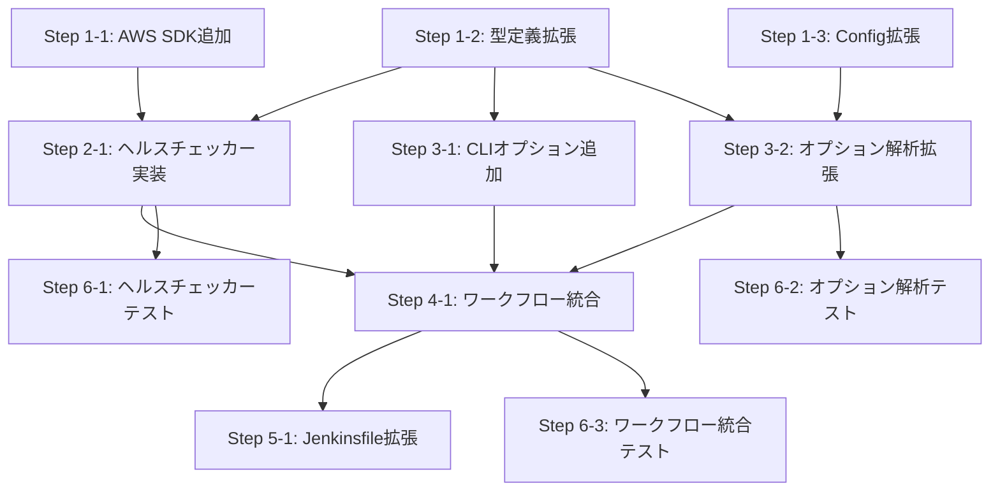

# 詳細設計書: Issue #721

## executeコマンドにEC2ネットワークスループット低下検知によるグレースフル停止機能を追加

---

## 1. アーキテクチャ設計

### 1.1 システム全体図

```
┌─────────────────────────────────────────────────────────────────────────┐
│                           CLI Layer                                     │
│  src/main.ts                                                            │
│  └─ execute コマンド                                                     │
│     ├─ --network-health-check (boolean)                                 │
│     └─ --network-throughput-drop-threshold (number)                     │
└──────────────────────────┬──────────────────────────────────────────────┘
                           │
                           ▼
┌─────────────────────────────────────────────────────────────────────────┐
│                     Options Processing Layer                            │
│  src/commands/execute/options-parser.ts                                  │
│  └─ parseExecuteOptions() / validateExecuteOptions()                    │
│     ├─ networkHealthCheck: boolean                                      │
│     └─ networkThroughputDropThreshold: number (0-100, default: 70)      │
└──────────────────────────┬──────────────────────────────────────────────┘
                           │
                           ▼
┌─────────────────────────────────────────────────────────────────────────┐
│                     Workflow Execution Layer                             │
│  src/commands/execute/workflow-executor.ts                               │
│  └─ executePhasesSequential()                                           │
│     └─ for (phaseName of phases)                                        │
│        ├─ [NEW] ネットワークヘルスチェック ← context.networkHealthCheck    │
│        ├─ skipPhases チェック                                            │
│        ├─ createPhaseInstance()                                         │
│        └─ phaseInstance.run()                                           │
└────────────────────┬────────────────────────────────────────────────────┘
                     │ (チェック委譲)
                     ▼
┌─────────────────────────────────────────────────────────────────────────┐
│                     Network Health Check Layer (NEW)                     │
│  src/core/network-health-checker.ts                                     │
│  └─ checkNetworkHealth(dropThreshold: number)                           │
│     ├─ getEc2InstanceMetadata()  ← IMDSv2 (fetch API)                  │
│     │  ├─ トークン取得 (PUT /latest/api/token)                           │
│     │  ├─ インスタンスID取得 (GET /latest/meta-data/instance-id)          │
│     │  └─ リージョン取得 (GET /latest/meta-data/placement/az)            │
│     ├─ getCloudWatchMetrics()  ← @aws-sdk/client-cloudwatch             │
│     │  ├─ NetworkPacketsOut (GetMetricStatistics)                        │
│     │  └─ NetworkOut (GetMetricStatistics)                               │
│     └─ evaluateNetworkHealth()                                          │
│        ├─ 低下率計算: (1 - current/peak) * 100                          │
│        └─ AND条件判定: 両メトリクス ≥ threshold → shouldStop              │
└─────────────────────────────────────────────────────────────────────────┘
                     │
                     ▼
┌─────────────────────────────────────────────────────────────────────────┐
│                     External Services                                   │
│  ├─ EC2 IMDSv2 (http://169.254.169.254)                                │
│  └─ AWS CloudWatch API (GetMetricStatistics)                            │
└─────────────────────────────────────────────────────────────────────────┘
```

### 1.2 コンポーネント間の関係

```
src/main.ts
    │ CLI オプション定義
    ▼
src/commands/execute/options-parser.ts
    │ オプション解析・バリデーション
    ▼
src/commands/execute.ts (handleExecuteCommand)
    │ PhaseContext 構築
    ▼
src/commands/execute/workflow-executor.ts
    │ フェーズループ内でヘルスチェック呼び出し
    ▼
src/core/network-health-checker.ts  [NEW]
    │ IMDSv2 + CloudWatch API連携
    ▼
@aws-sdk/client-cloudwatch  [NEW dependency]
```

**依存方向**: 上位レイヤーから下位レイヤーへの単方向依存。`network-health-checker.ts`は他のコアモジュールに依存せず、`logger`と`error-utils`のユーティリティのみを使用する。

### 1.3 データフロー

```
1. CLI入力
   --network-health-check --network-throughput-drop-threshold 70
       │
       ▼
2. オプション解析 (options-parser.ts)
   { networkHealthCheck: true, networkThroughputDropThreshold: 70 }
       │
       ▼
3. PhaseContext 構築 (execute.ts)
   context.networkHealthCheck = true
   context.networkThroughputDropThreshold = 70
       │
       ▼
4. フェーズループ (workflow-executor.ts)
   各フェーズ開始前に checkNetworkHealth(70) を呼び出し
       │
       ▼
5. ネットワークヘルスチェック (network-health-checker.ts)
   5a. IMDSv2 → instanceId, region
   5b. CloudWatch → NetworkPacketsOut, NetworkOut メトリクス
   5c. 低下率計算 → dropPercentage
   5d. AND条件判定 → shouldStop
       │
       ▼
6. 判定結果に基づく動作
   ├─ shouldStop: true  → ExecutionSummary(success: false, stoppedReason)
   ├─ shouldStop: false → フェーズ実行続行
   └─ available: false  → チェックスキップ、フェーズ実行続行
```

---

## 2. 実装戦略判断

### 実装戦略: EXTEND

**判断根拠**:
- **既存コード拡張が中心**: 変更対象の7ファイル（`commands.ts`、`config.ts`、`options-parser.ts`、`main.ts`、`workflow-executor.ts`、`Jenkinsfile`、`package.json`）はいずれも既存インターフェースへのフィールド追加・ロジック挿入であり、アーキテクチャの構造変更ではない
- **新規作成は1モジュールのみ**: `src/core/network-health-checker.ts`は独立性の高い新規モジュールだが、既存の`src/core/`パターン（kebab-case命名、named exports、`logger`/`error-utils`ユーティリティ使用）に準拠して作成する
- **既存フェーズライフサイクルへの影響なし**: `executePhasesSequential()`のforループ内にチェックポイントを挿入するだけで、`BasePhase.run()`の`execute()`→`review()`→`revise()`ライフサイクルには一切変更を加えない
- CREATEには該当しない（既存ファイルへの変更が7ファイルあるため）
- REFACTORには該当しない（既存コードの構造改善ではなく機能追加であるため）

---

## 3. テスト戦略判断

### テスト戦略: UNIT_INTEGRATION

**判断根拠**:
- **ユニットテスト**: ネットワークヘルスチェッカーのコアロジック（IMDSv2メタデータ取得、CloudWatchメトリクス取得、低下率計算、AND条件判定、非EC2フォールバック）は外部依存をモックして個別にテスト可能
- **インテグレーションテスト**: `executePhasesSequential()`内でのヘルスチェック呼び出し→早期終了フローは統合テストで検証すべき。特に`ExecutionSummary`の構造（`stoppedReason`フィールド含む）の正確性を検証する必要がある
- BDDテストは不要: エンドユーザー向けUI機能ではなく、インフラレベルの自動制御機能であるため、Given-When-Thenのシナリオベーステストは受け入れ基準の検証としてユニットテスト内で対応可能
- 純粋なUNIT_ONLYでは、ワークフロー統合フロー（ヘルスチェック→早期終了→`ExecutionSummary`構築）の検証が不十分

---

## 4. テストコード戦略判断

### テストコード戦略: BOTH_TEST

**判断根拠**:
- **新規テスト作成が必要**: `tests/unit/core/network-health-checker.test.ts` — 新規モジュールに対応する新規テストファイル。IMDSv2・CloudWatch APIのモック、正常系/異常系/境界値テストを含む
- **既存テスト拡張が必要**:
  - `tests/unit/commands/execute/workflow-executor.test.ts` — ネットワークヘルスチェック統合のテストケース追加（ヘルスチェック有効時の早期終了、無効時のスキップ、利用不可時の続行）
  - `tests/unit/commands/execute/options-parser.test.ts` — 新規オプション（`networkHealthCheck`、`networkThroughputDropThreshold`）の解析・バリデーションテスト追加
- 既存テストファイルが存在し（`workflow-executor.test.ts`、`options-parser.test.ts`）、既存テストとの関連性が高いため、EXTEND_TESTのみでは不十分。新規モジュールのテストも必要なため、BOTH_TESTが適切

---

## 5. 影響範囲分析

### 5.1 既存コードへの影響

| ファイル | 変更種別 | 変更内容 | 影響度 | 要件トレース |
|---------|---------|---------|--------|------------|
| `src/core/network-health-checker.ts` | **新規作成** | IMDSv2 + CloudWatch連携モジュール | なし（新規） | FR-002 |
| `src/types/commands.ts` | 拡張 | `ExecuteCommandOptions`、`PhaseContext`、`ExecutionSummary`にフィールド追加 | **低**（オプショナルフィールドの追加のみ） | FR-004 |
| `src/core/config.ts` | 拡張 | `IConfig`に2メソッド追加、`Config`クラスに実装追加 | **低**（追加のみ、既存メソッドに影響なし） | FR-005 |
| `src/commands/execute/options-parser.ts` | 拡張 | `ParsedExecuteOptions`にフィールド追加、解析・バリデーション拡張 | **低**（追加のみ） | FR-006 |
| `src/main.ts` | 拡張 | `execute`コマンドに2つのCLIオプション追加 | **低**（`.option()`メソッドの追加のみ） | FR-001 |
| `src/commands/execute/workflow-executor.ts` | 拡張 | `executePhasesSequential()`のforループ内にヘルスチェック挿入 | **中**（既存ループへの制御フロー挿入） | FR-003 |
| `jenkins/jobs/pipeline/ai-workflow/all-phases/Jenkinsfile` | 拡張 | パラメータとオプション受け渡し追加 | **低**（既存パターンに従った追加のみ） | FR-007 |
| `package.json` | 拡張 | `@aws-sdk/client-cloudwatch`依存追加 | **低**（依存追加のみ） | FR-008 |

### 5.2 依存関係の変更

| 依存パッケージ | 種別 | 追加先 | 理由 |
|--------------|------|-------|------|
| `@aws-sdk/client-cloudwatch` | **新規追加** | `dependencies` | CloudWatch `GetMetricStatistics` APIの呼び出しに使用 |

**設計判断**: AWS SDK v3のモジュラーアーキテクチャを活用し、`@aws-sdk/client-cloudwatch`のみを追加する。フルSDK（`aws-sdk` v2）ではなく個別クライアントを使用することでバンドルサイズへの影響を最小化する。IMDSv2はNode.js標準の`fetch` APIで直接呼び出す（追加依存不要、Node.js 20以上のプロジェクト要件を満たす）。

### 5.3 マイグレーション要否

| 項目 | 要否 | 詳細 |
|------|------|------|
| データベーススキーマ変更 | なし | — |
| 設定ファイル変更 | なし（オプション） | 環境変数`NETWORK_HEALTH_CHECK`、`NETWORK_THROUGHPUT_DROP_THRESHOLD`は新規追加だが、未設定時はデフォルト値を使用 |
| メタデータスキーマ変更 | 軽微 | `ExecutionSummary`に`stoppedReason`フィールド追加（後方互換、オプショナル） |
| 破壊的変更 | **なし** | 全オプションはデフォルト`false`/未指定で既存動作を完全に維持（NFR-005） |

---

## 6. 変更・追加ファイルリスト

### 6.1 新規作成ファイル

| ファイルパス | 説明 |
|------------|------|
| `src/core/network-health-checker.ts` | ネットワークヘルスチェッカーモジュール |
| `tests/unit/core/network-health-checker.test.ts` | ネットワークヘルスチェッカーユニットテスト |

### 6.2 修正が必要な既存ファイル

| ファイルパス | 変更概要 |
|------------|---------|
| `src/types/commands.ts` | 3つのインターフェース/型にフィールド追加 |
| `src/core/config.ts` | `IConfig`に2メソッド追加、`Config`に実装追加 |
| `src/commands/execute/options-parser.ts` | `ParsedExecuteOptions`拡張、解析・バリデーション拡張 |
| `src/main.ts` | `execute`コマンドに2つのCLIオプション追加 |
| `src/commands/execute/workflow-executor.ts` | forループ内にヘルスチェック挿入 |
| `jenkins/jobs/pipeline/ai-workflow/all-phases/Jenkinsfile` | パラメータ・オプション受け渡し追加 |
| `package.json` | `@aws-sdk/client-cloudwatch`依存追加 |
| `tests/unit/commands/execute/workflow-executor.test.ts` | ヘルスチェック統合テスト追加 |
| `tests/unit/commands/execute/options-parser.test.ts` | 新規オプション解析テスト追加 |

### 6.3 削除が必要なファイル

なし

---

## 7. 詳細設計

### 7.1 インターフェース設計

#### 7.1.1 `NetworkHealthCheckResult`（新規）

```typescript
// src/core/network-health-checker.ts

/**
 * ネットワークヘルスチェック結果
 */
export interface NetworkHealthCheckResult {
  /** チェックが実行可能だったか（IMDSv2・CloudWatchアクセス成功） */
  available: boolean;
  /** 停止すべきか（両メトリクスがAND条件で閾値超過） */
  shouldStop: boolean;
  /** 直近5分の平均NetworkPacketsOut */
  networkPacketsOutCurrent: number;
  /** 過去1時間のピークNetworkPacketsOut */
  networkPacketsOutPeak: number;
  /** 直近5分の平均NetworkOut（バイト） */
  networkOutCurrent: number;
  /** 過去1時間のピークNetworkOut（バイト） */
  networkOutPeak: number;
  /** ピークからの低下率（%、両メトリクスの大きい方） */
  dropPercentage: number;
  /** 停止理由（shouldStop: true の場合のみ） */
  reason?: string;
}
```

**設計根拠**: 要件FR-002-5に準拠。全フィールドを返却することで、ログ出力やデバッグ時にメトリクスの詳細を確認可能にする。`available: false`の場合は数値フィールドはすべて`0`を返却する。

#### 7.1.2 `Ec2InstanceMetadata`（新規・内部型）

```typescript
// src/core/network-health-checker.ts（内部型、export不要）

/**
 * IMDSv2から取得したEC2インスタンスメタデータ
 */
interface Ec2InstanceMetadata {
  /** EC2インスタンスID（例: "i-0abcdef1234567890"） */
  instanceId: string;
  /** AWSリージョン（例: "ap-northeast-1"） */
  region: string;
}
```

#### 7.1.3 `ExecuteCommandOptions`の拡張（FR-004-1）

```typescript
// src/types/commands.ts に追加

export interface ExecuteCommandOptions {
  // ... 既存フィールド（issue, phase, preset, ... squashOnComplete, claudeModel, codexModel）

  /**
   * ネットワークヘルスチェック有効化フラグ（Issue #721）
   *
   * デフォルト: false
   * true の場合、各フェーズ開始前にEC2ネットワークスループットをチェック
   */
  networkHealthCheck?: boolean;

  /**
   * ネットワークスループット低下率の閾値（%）（Issue #721）
   *
   * デフォルト: 70
   * 直近メトリクスがピーク値からこの割合以上低下した場合に停止
   * 有効範囲: 0-100
   */
  networkThroughputDropThreshold?: number;
}
```

#### 7.1.4 `PhaseContext`の拡張（FR-004-2）

```typescript
// src/types/commands.ts に追加

export type PhaseContext = {
  // ... 既存フィールド

  /** ネットワークヘルスチェック有効化フラグ（Issue #721） */
  networkHealthCheck?: boolean;
  /** ネットワークスループット低下率の閾値（%）（Issue #721） */
  networkThroughputDropThreshold?: number;
};
```

#### 7.1.5 `ExecutionSummary`の拡張（FR-004-3）

```typescript
// src/types/commands.ts に追加

export type ExecutionSummary = {
  success: boolean;
  failedPhase?: PhaseName;
  error?: string;
  results: PhaseResultMap;
  /** 停止理由（Issue #721: 'network_throughput_degraded'等） */
  stoppedReason?: string;
};
```

**設計根拠**: `stoppedReason`はオプショナル（`?`付き）として追加。これにより既存コードが`ExecutionSummary`を構築する箇所には一切変更が不要（NFR-005-2）。

#### 7.1.6 `ParsedExecuteOptions`の拡張（FR-006-1）

```typescript
// src/commands/execute/options-parser.ts に追加

export interface ParsedExecuteOptions {
  // ... 既存フィールド

  /** ネットワークヘルスチェック有効化フラグ（Issue #721） */
  networkHealthCheck: boolean;
  /** ネットワークスループット低下率の閾値（%）（Issue #721） */
  networkThroughputDropThreshold: number;
}
```

**設計根拠**: `ParsedExecuteOptions`では全フィールドが正規化済み（デフォルト値適用済み）であるため、`boolean`と`number`（非オプショナル）として定義する。

#### 7.1.7 `IConfig`の拡張（FR-005-1）

```typescript
// src/core/config.ts に追加

export interface IConfig {
  // ... 既存メソッド

  // ========== ネットワークヘルスチェック設定（Issue #721） ==========

  /**
   * ネットワークヘルスチェックが環境変数で有効化されているか
   * @returns true: 有効、false: 無効（デフォルト）
   */
  getNetworkHealthCheckEnabled(): boolean;

  /**
   * ネットワークスループット低下率の閾値（%）
   * @returns 閾値（デフォルト: 70）
   */
  getNetworkThroughputDropThreshold(): number;
}
```

### 7.2 関数設計

#### 7.2.1 `checkNetworkHealth()`（メイン関数）

```typescript
// src/core/network-health-checker.ts

/**
 * EC2インスタンスのネットワークヘルスをチェックする
 *
 * IMDSv2でインスタンスメタデータを取得し、CloudWatch APIで
 * ネットワークメトリクスを取得・評価する。
 *
 * @param dropThreshold - スループット低下率の閾値（%、0-100）
 * @returns ネットワークヘルスチェック結果
 */
export async function checkNetworkHealth(
  dropThreshold: number
): Promise<NetworkHealthCheckResult>;
```

**内部フロー**:

```
checkNetworkHealth(dropThreshold)
│
├─ 1. getEc2InstanceMetadata()
│     ├─ 成功 → { instanceId, region }
│     └─ 失敗（タイムアウト/エラー） → return { available: false, ... }
│
├─ 2. getCloudWatchMetrics(instanceId, region, 'NetworkPacketsOut')
│     ├─ 成功 → { current, peak }
│     └─ 失敗 → return { available: false, ... }
│
├─ 3. getCloudWatchMetrics(instanceId, region, 'NetworkOut')
│     ├─ 成功 → { current, peak }
│     └─ 失敗 → return { available: false, ... }
│
├─ 4. calculateDropPercentage(current, peak) for each metric
│
└─ 5. evaluateAndBuildResult()
      ├─ 両メトリクス ≥ dropThreshold → shouldStop: true
      └─ それ以外 → shouldStop: false
```

**エラーハンドリング方針**: すべてのエラーは`catch`で捕捉し、`getErrorMessage()`で安全にメッセージを取得した上で`logger.warn()`で警告ログを出力し、`{ available: false, shouldStop: false, ... }`を返却する。これにより、ヘルスチェックの失敗がフェーズ実行をブロックすることはない（NFR-002-1）。

#### 7.2.2 `getEc2InstanceMetadata()`（内部関数）

```typescript
/**
 * IMDSv2でEC2インスタンスメタデータを取得する
 *
 * @returns インスタンスメタデータ
 * @throws Error - IMDSv2アクセス失敗時（非EC2環境でのタイムアウト含む）
 */
async function getEc2InstanceMetadata(): Promise<Ec2InstanceMetadata>;
```

**処理フロー**:

1. **IMDSv2トークン取得**: `PUT http://169.254.169.254/latest/api/token`
   - ヘッダー: `X-aws-ec2-metadata-token-ttl-seconds: 21600`
   - タイムアウト: `AbortSignal.timeout(3000)`（3秒、NFR-001-1）

2. **インスタンスID取得**: `GET http://169.254.169.254/latest/meta-data/instance-id`
   - ヘッダー: `X-aws-ec2-metadata-token: <token>`
   - タイムアウト: `AbortSignal.timeout(3000)`

3. **Availability Zone取得**: `GET http://169.254.169.254/latest/meta-data/placement/availability-zone`
   - ヘッダー: `X-aws-ec2-metadata-token: <token>`
   - タイムアウト: `AbortSignal.timeout(3000)`

4. **リージョン導出**: AZの末尾1文字を除去（例: `ap-northeast-1a` → `ap-northeast-1`）

**非EC2環境フォールバック**: `AbortSignal.timeout(3000)`により、非EC2環境ではIMDSv2エンドポイント（`169.254.169.254`）へのアクセスが3秒以内にタイムアウトし、例外がスローされる。呼び出し元（`checkNetworkHealth`）でキャッチして`available: false`を返却する（AC-003-1）。

#### 7.2.3 `getCloudWatchMetrics()`（内部関数）

```typescript
/**
 * CloudWatch APIでメトリクスを取得する
 *
 * @param instanceId - EC2インスタンスID
 * @param region - AWSリージョン
 * @param metricName - メトリクス名（'NetworkPacketsOut' | 'NetworkOut'）
 * @returns 直近5分の平均値とピーク値
 * @throws Error - CloudWatch API呼び出し失敗時
 */
async function getCloudWatchMetrics(
  instanceId: string,
  region: string,
  metricName: 'NetworkPacketsOut' | 'NetworkOut'
): Promise<{ current: number; peak: number }>;
```

**処理フロー**:

1. `CloudWatchClient`を`{ region }`で初期化
2. `GetMetricStatisticsCommand`を以下のパラメータで実行:
   - `Namespace`: `'AWS/EC2'`
   - `MetricName`: 引数の`metricName`
   - `Dimensions`: `[{ Name: 'InstanceId', Value: instanceId }]`
   - `StartTime`: `new Date(Date.now() - 60 * 60 * 1000)`（1時間前）
   - `EndTime`: `new Date()`（現在）
   - `Period`: `300`（5分）
   - `Statistics`: `['Average']`
3. レスポンスの`Datapoints`を`Timestamp`で昇順ソート
4. `Datapoints`が空の場合は例外をスロー（AC-003-3 → 呼び出し元で`available: false`）
5. 最新のデータポイントの`Average`を`current`とする
6. 全データポイントの`Average`の最大値を`peak`とする
7. `{ current, peak }`を返却

**CloudWatchClient インスタンス管理**: `CloudWatchClient`は`getCloudWatchMetrics()`の呼び出しごとに生成する（関数呼び出しは各フェーズ開始前に最大1回のため、パフォーマンスへの影響は無視できる）。SDK v3のモジュラーアーキテクチャにより、必要な時点でのみクライアントを生成することで、メモリ使用量を最小化する。

#### 7.2.4 `calculateDropPercentage()`（内部関数）

```typescript
/**
 * ピーク値からの低下率を計算する
 *
 * @param current - 直近の値
 * @param peak - ピーク値
 * @returns 低下率（%）。peakが0の場合は0を返却
 */
function calculateDropPercentage(current: number, peak: number): number;
```

**計算式**: `dropPercentage = (1 - current / peak) * 100`
- `peak === 0`の場合: `0`を返却（ゼロ除算防止、FR-002-3）
- `current > peak`の場合（計測タイミングのずれ等）: 負の値を返却（低下していない状態）

#### 7.2.5 `Config`クラスへの追加メソッド（FR-005-2）

```typescript
// src/core/config.ts の Config クラスに追加

// ========== ネットワークヘルスチェック設定（Issue #721） ==========

public getNetworkHealthCheckEnabled(): boolean {
  const value = this.getEnv('NETWORK_HEALTH_CHECK', false);
  return this.parseBoolean(value, false);
}

public getNetworkThroughputDropThreshold(): number {
  return this.parseNumericEnv('NETWORK_THROUGHPUT_DROP_THRESHOLD') ?? 70;
}
```

**設計根拠**: 既存の`canAgentInstallPackages()`メソッド（`parseBoolean()`使用）と`getFollowupLlmTimeoutMs()`メソッド（`parseNumericEnv()`使用）の実装パターンに完全に準拠する。`parseBoolean()`と`parseNumericEnv()`はいずれも`Config`クラスのプライベートメソッドとして既に実装されている。

#### 7.2.6 `parseExecuteOptions()`の拡張（FR-006-2）

```typescript
// src/commands/execute/options-parser.ts の parseExecuteOptions() に追加

// ネットワークヘルスチェックオプションの解析（Issue #721）
const networkHealthCheck = Boolean(options.networkHealthCheck);
const networkThroughputDropThreshold =
  options.networkThroughputDropThreshold !== undefined
    ? Number(options.networkThroughputDropThreshold)
    : 70;

// return オブジェクトに追加
return {
  // ... 既存フィールド
  networkHealthCheck,
  networkThroughputDropThreshold,
};
```

#### 7.2.7 `validateExecuteOptions()`の拡張（FR-006-3）

```typescript
// src/commands/execute/options-parser.ts の validateExecuteOptions() に追加

// ネットワークスループット低下率閾値のバリデーション（Issue #721）
if (options.networkThroughputDropThreshold !== undefined) {
  const threshold = Number(options.networkThroughputDropThreshold);
  if (!Number.isFinite(threshold) || threshold < 0 || threshold > 100) {
    errors.push(
      "Option '--network-throughput-drop-threshold' must be a number between 0 and 100."
    );
  }
}
```

**設計根拠**: 既存の`followupLlmTimeout`バリデーションパターン（`Number()`変換→`Number.isFinite()`チェック→範囲チェック→`errors.push()`）に準拠する。

#### 7.2.8 `executePhasesSequential()`のヘルスチェック統合（FR-003）

```typescript
// src/commands/execute/workflow-executor.ts の executePhasesSequential() 内
// forループ内、skipPhasesチェックの前に挿入

for (const phaseName of phases) {
  try {
    // === ネットワークヘルスチェック（Issue #721）===
    if (context.networkHealthCheck) {
      const { checkNetworkHealth } = await import('../../core/network-health-checker.js');
      const healthResult = await checkNetworkHealth(
        context.networkThroughputDropThreshold ?? 70
      );
      if (healthResult.available && healthResult.shouldStop) {
        logger.warn(
          `Network throughput dropped ${healthResult.dropPercentage.toFixed(1)}% from peak. ` +
          `NetworkPacketsOut: ${healthResult.networkPacketsOutCurrent}/${healthResult.networkPacketsOutPeak}, ` +
          `NetworkOut: ${healthResult.networkOutCurrent}/${healthResult.networkOutPeak} bytes. ` +
          `Stopping before phase: ${phaseName}`
        );
        return {
          success: false,
          failedPhase: phaseName,
          error: `Network throughput degraded before ${phaseName}. ` +
                 `Drop: ${healthResult.dropPercentage.toFixed(1)}%`,
          stoppedReason: 'network_throughput_degraded',
          results,
        };
      }
      if (healthResult.available) {
        logger.debug(
          `Network health OK. Drop: ${healthResult.dropPercentage.toFixed(1)}% ` +
          `(threshold: ${context.networkThroughputDropThreshold ?? 70}%)`
        );
      } else {
        logger.debug('Network health check not available, skipping.');
      }
    }
    // === 既存コード ===
    if (context.skipPhases?.includes(phaseName)) {
      // ...
    }
    // ...
  }
}
```

**動的インポートの採用理由**: `network-health-checker.ts`は`@aws-sdk/client-cloudwatch`に依存する。`--network-health-check`が無効（デフォルト）の場合にSDKモジュールの読み込みを回避するため、`await import()`による動的インポートを使用する。これにより、ネットワークヘルスチェックが無効の場合のパフォーマンスオーバーヘッドを完全にゼロにする（NFR-001-4）。

### 7.3 CLIオプション設計（FR-001）

```typescript
// src/main.ts の execute コマンド登録に追加

// --squash-on-complete の後に追加
.option(
  '--network-health-check',
  'Enable network health check before each phase (EC2 only, Issue #721)',
  false,
)
.option(
  '--network-throughput-drop-threshold <percent>',
  'Network throughput drop threshold in % (0-100, default: 70, Issue #721)',
)
```

**設計根拠**:
- `--network-health-check`はboolean型フラグ（Commander.jsのデフォルト動作、指定時に`true`）
- `--network-throughput-drop-threshold`はnumber型パラメータ（`<percent>`で値を受け取る）
- 既存の`--squash-on-complete`（boolean）、`--followup-llm-timeout <ms>`（number）パターンに準拠

### 7.4 Jenkinsfile設計（FR-007）

```groovy
// jenkins/jobs/pipeline/ai-workflow/all-phases/Jenkinsfile
// Execute All Phases ステージ内に追加

// 既存のフラグ変数定義の後に追加
def networkHealthCheckFlag = params.NETWORK_HEALTH_CHECK ? '--network-health-check' : ''

// sh ブロック内に追加
sh """
    node dist/index.js execute \
        --phase all \
        --issue ${env.ISSUE_NUMBER} \
        --agent ${params.AGENT_MODE ?: 'auto'} \
        --followup-llm-mode agent \
        ${forceResetFlag} \
        ${cleanupFlags} \
        ${squashFlag} \
        ${languageOption} \
        ${skipPhasesOption} \
        ${networkHealthCheckFlag}
"""
```

**設計根拠**: 既存の`forceResetFlag`、`squashFlag`等の条件付きフラグ変数パターンに完全に準拠。`NETWORK_HEALTH_CHECK`パラメータはJenkinsのJob DSLで`booleanParam(name: 'NETWORK_HEALTH_CHECK', defaultValue: false)`として定義される想定（Jenkinsfile内ではパラメータ定義は行わず、Job DSL側で管理）。

### 7.5 `network-health-checker.ts`のモジュール構造

```typescript
// src/core/network-health-checker.ts

import { CloudWatchClient, GetMetricStatisticsCommand } from '@aws-sdk/client-cloudwatch';
import { logger } from '../utils/logger.js';
import { getErrorMessage } from '../utils/error-utils.js';

// ========== 型定義 ==========
export interface NetworkHealthCheckResult { /* 7.1.1 参照 */ }
interface Ec2InstanceMetadata { /* 7.1.2 参照 */ }

// ========== 定数 ==========
const IMDS_ENDPOINT = 'http://169.254.169.254';
const IMDS_TOKEN_TTL_SECONDS = '21600';
const IMDS_TIMEOUT_MS = 3000;
const METRIC_PERIOD_SECONDS = 300;
const METRIC_WINDOW_MS = 60 * 60 * 1000; // 1時間

// ========== メイン関数（エクスポート） ==========
export async function checkNetworkHealth(dropThreshold: number): Promise<NetworkHealthCheckResult> { /* 7.2.1 参照 */ }

// ========== 内部関数 ==========
async function getEc2InstanceMetadata(): Promise<Ec2InstanceMetadata> { /* 7.2.2 参照 */ }
async function getCloudWatchMetrics(instanceId: string, region: string, metricName: 'NetworkPacketsOut' | 'NetworkOut'): Promise<{ current: number; peak: number }> { /* 7.2.3 参照 */ }
function calculateDropPercentage(current: number, peak: number): number { /* 7.2.4 参照 */ }

// ========== ヘルパー関数 ==========
function buildUnavailableResult(): NetworkHealthCheckResult {
  return {
    available: false,
    shouldStop: false,
    networkPacketsOutCurrent: 0,
    networkPacketsOutPeak: 0,
    networkOutCurrent: 0,
    networkOutPeak: 0,
    dropPercentage: 0,
  };
}
```

**パターン準拠**: 既存の`src/core/`モジュール（`language-resolver.ts`、`path-utils.ts`等）に準拠した構造。named export（`checkNetworkHealth`、`NetworkHealthCheckResult`）を使用し、内部関数はモジュールスコープに閉じる。

---

## 8. セキュリティ考慮事項

### 8.1 認証・認可

| 項目 | 対応方針 | 要件トレース |
|------|---------|------------|
| AWS認証情報 | Jenkinsfile内の既存環境変数（`AWS_ACCESS_KEY_ID`、`AWS_SECRET_ACCESS_KEY`、`AWS_SESSION_TOKEN`）を使用。新たな認証情報の管理は不要。AWS SDK v3が環境変数から自動的に認証情報を取得する | NFR-004-1 |
| IMDSv2セキュリティ | IMDSv2（トークンベースアクセス）を使用。IMDSv1は使用しない | NFR-004-2 |
| CloudWatch IAM権限 | `cloudwatch:GetMetricStatistics`アクション権限が必要。ドキュメントに明記する | PA-010 |

### 8.2 データ保護

| リスク | 対策 |
|-------|------|
| ログへの認証情報漏洩 | `logger`出力にAWS認証情報やIMDSv2トークンを含めない。メトリクス値（数値のみ）とインスタンスIDのみをログに記録する |
| IMDSv2トークンの露出 | トークンは関数スコープ内のローカル変数として保持し、関数外部に渡さない |

### 8.3 セキュリティリスクと対策

| リスク | 影響度 | 対策 |
|-------|--------|------|
| IMDSv2エンドポイントへの不正アクセス | 低 | IMDSv2はEC2インスタンス内部からのみアクセス可能（リンクローカルアドレス`169.254.169.254`）。外部からのアクセスは不可 |
| CloudWatch APIのレート制限超過 | 低 | 各フェーズ開始前に最大1回のAPI呼び出し（10フェーズで最大10回/ワークフロー実行）。CloudWatchのAPIレート制限（`GetMetricStatistics`: 400 TPS）を大幅に下回る |

---

## 9. 非機能要件への対応

### 9.1 パフォーマンス（NFR-001）

| 要件 | 設計対応 |
|------|---------|
| NFR-001-1: IMDSv2タイムアウト3秒以内 | `AbortSignal.timeout(3000)`を全IMDSv2リクエストに設定 |
| NFR-001-2: ヘルスチェック全体5秒以内 | IMDSv2（最大3秒）+ CloudWatch API（2回、並列化可能）で5秒以内に完了。CloudWatch API呼び出しは`Promise.all()`で並列化する |
| NFR-001-3: 各フェーズ開始前に最大1回 | forループ内の先頭に1回のみ`checkNetworkHealth()`を呼び出す設計 |
| NFR-001-4: 無効時はオーバーヘッドゼロ | `context.networkHealthCheck`の条件分岐のみ。動的インポート採用によりSDKモジュール読み込みも回避 |

**CloudWatch API並列化の詳細設計**:

```typescript
// getCloudWatchMetrics() を2つのメトリクスに対して並列実行
const [packetsOutResult, bytesOutResult] = await Promise.all([
  getCloudWatchMetrics(metadata.instanceId, metadata.region, 'NetworkPacketsOut'),
  getCloudWatchMetrics(metadata.instanceId, metadata.region, 'NetworkOut'),
]);
```

これにより、2つのCloudWatch API呼び出しが逐次実行される場合と比較して、レイテンシを約半分に削減する。

### 9.2 信頼性・可用性（NFR-002）

| 要件 | 設計対応 |
|------|---------|
| NFR-002-1: チェック失敗時は続行 | `checkNetworkHealth()`内の全エラーをtry-catchで捕捉し、`available: false`を返却。呼び出し元ではavailable: falseの場合にフェーズ実行を続行 |
| NFR-002-2: 非EC2環境フォールバック | IMDSv2タイムアウト（3秒）→ catch → `available: false` → フェーズ続行 |
| NFR-002-3: CloudWatch認証失敗時 | SDK例外をcatch → `logger.warn()` → `available: false` → フェーズ続行 |
| NFR-002-4: Datapoints空の場合 | データポイント数チェック → 0件の場合は`available: false` → フェーズ続行 |

**フォールバック判定フローチャート**:

```
checkNetworkHealth() 開始
│
├─ try: getEc2InstanceMetadata()
│  ├─ 成功 → 続行
│  └─ 失敗（タイムアウト/エラー）
│     ├─ logger.warn("IMDSv2 access failed: ...")
│     └─ return { available: false, shouldStop: false, ... }
│
├─ try: Promise.all([getCloudWatchMetrics(..., 'NetworkPacketsOut'), getCloudWatchMetrics(..., 'NetworkOut')])
│  ├─ 成功 → 続行
│  └─ 失敗（認証エラー/APIエラー/Datapoints空）
│     ├─ logger.warn("CloudWatch metrics retrieval failed: ...")
│     └─ return { available: false, shouldStop: false, ... }
│
├─ 低下率計算
│
└─ return { available: true, shouldStop: ..., ... }
```

### 9.3 保守性・拡張性（NFR-003）

| 要件 | 設計対応 |
|------|---------|
| NFR-003-1: 独立モジュール | `network-health-checker.ts`は`logger`と`error-utils`のみに依存。他のコアモジュール（`config`、`metadata-manager`等）への依存なし |
| NFR-003-2: 拡張可能な設計 | 将来的に`checkCpuHealth()`等を同じパターン（`available`/`shouldStop`インターフェース）で追加可能 |
| NFR-003-3: IMDSv2とCloudWatchの分離 | `getEc2InstanceMetadata()`と`getCloudWatchMetrics()`を独立した内部関数として実装。それぞれ個別にモック・テスト可能 |

---

## 10. 実装の順序

### 10.1 推奨実装順序

```
Phase 1: 基盤拡張（依存関係なし、並列実行可能）
├─ Step 1-1: package.json に @aws-sdk/client-cloudwatch 追加 + npm install
├─ Step 1-2: src/types/commands.ts の型定義拡張
│  ├─ ExecuteCommandOptions に 2フィールド追加
│  ├─ PhaseContext に 2フィールド追加
│  └─ ExecutionSummary に stoppedReason 追加
└─ Step 1-3: src/core/config.ts に 2メソッド追加

Phase 2: ネットワークヘルスチェッカー実装
└─ Step 2-1: src/core/network-health-checker.ts 新規作成
   ├─ NetworkHealthCheckResult インターフェース定義
   ├─ getEc2InstanceMetadata() 実装
   ├─ getCloudWatchMetrics() 実装
   ├─ calculateDropPercentage() 実装
   └─ checkNetworkHealth() 実装

Phase 3: CLI・オプション解析の拡張
├─ Step 3-1: src/main.ts に 2つのCLIオプション追加
└─ Step 3-2: src/commands/execute/options-parser.ts
   ├─ ParsedExecuteOptions にフィールド追加
   ├─ parseExecuteOptions() 拡張
   └─ validateExecuteOptions() 拡張

Phase 4: ワークフロー統合
└─ Step 4-1: src/commands/execute/workflow-executor.ts
   └─ executePhasesSequential() のforループにヘルスチェック挿入

Phase 5: Jenkinsfile拡張
└─ Step 5-1: jenkins/jobs/pipeline/ai-workflow/all-phases/Jenkinsfile
   └─ パラメータ・オプション受け渡し追加

Phase 6: テスト実装
├─ Step 6-1: tests/unit/core/network-health-checker.test.ts 新規作成
├─ Step 6-2: tests/unit/commands/execute/options-parser.test.ts 拡張
└─ Step 6-3: tests/unit/commands/execute/workflow-executor.test.ts 拡張
```

### 10.2 依存関係



### 10.3 並列実行可能なタスク

- **Phase 1内**: Step 1-1、Step 1-2、Step 1-3は相互依存なし → 並列実行可能
- **Phase 3内**: Step 3-1とStep 3-2は独立 → 並列実行可能
- **Phase 6内**: Step 6-1とStep 6-2は独立 → 並列実行可能（Step 6-3はStep 4-1完了後）

---

## 11. テスト設計概要

### 11.1 ネットワークヘルスチェッカーテスト（新規）

**ファイル**: `tests/unit/core/network-health-checker.test.ts`

| テストカテゴリ | テストケース | 期待結果 |
|-------------|------------|---------|
| **正常系: メトリクス正常** | EC2環境、両メトリクス低下率が閾値未満 | `{ available: true, shouldStop: false }` |
| **正常系: メトリクス低下（停止）** | EC2環境、両メトリクス低下率が閾値以上 | `{ available: true, shouldStop: true, reason: ... }` |
| **正常系: 片方のみ低下** | `NetworkPacketsOut`のみ低下（AND条件未達） | `{ available: true, shouldStop: false }` |
| **境界値: 閾値ちょうど** | 両メトリクスの低下率が閾値と完全一致 | `{ available: true, shouldStop: true }` |
| **境界値: peakが0** | ピーク値が0（ゼロ除算防止） | `dropPercentage: 0` |
| **異常系: 非EC2環境** | IMDSv2タイムアウト | `{ available: false, shouldStop: false }` |
| **異常系: CloudWatchエラー** | API呼び出し失敗 | `{ available: false, shouldStop: false }` |
| **異常系: Datapoints空** | CloudWatch返却データポイントが0件 | `{ available: false, shouldStop: false }` |

**モック戦略**:
- **IMDSv2**: グローバル`fetch`をモック（`jest.unstable_mockModule`でESMモジュールのモック）
- **CloudWatch API**: `@aws-sdk/client-cloudwatch`の`CloudWatchClient.prototype.send`をモック

### 11.2 ワークフロー統合テスト（拡張）

**ファイル**: `tests/unit/commands/execute/workflow-executor.test.ts`に追加

| テストケース | 期待結果 |
|------------|---------|
| ヘルスチェック有効、shouldStop: true | `ExecutionSummary.success: false`、`stoppedReason: 'network_throughput_degraded'` |
| ヘルスチェック有効、shouldStop: false | フェーズ実行続行 |
| ヘルスチェック有効、available: false | フェーズ実行続行（チェックスキップ） |
| ヘルスチェック無効（デフォルト） | ヘルスチェック処理自体が実行されない |

### 11.3 オプション解析テスト（拡張）

**ファイル**: `tests/unit/commands/execute/options-parser.test.ts`に追加

| テストケース | 期待結果 |
|------------|---------|
| デフォルト値（未指定） | `networkHealthCheck: false`、`networkThroughputDropThreshold: 70` |
| `--network-health-check`指定 | `networkHealthCheck: true` |
| `--network-throughput-drop-threshold 50`指定 | `networkThroughputDropThreshold: 50` |
| 閾値に101指定 | バリデーションエラー |
| 閾値に-1指定 | バリデーションエラー |
| 閾値に"abc"指定 | バリデーションエラー |

---

## 12. コーディング規約チェックリスト

実装時に以下の規約を厳守すること（CLAUDE.mdより）:

- [ ] `console.log`等の直接使用なし → `logger`モジュール（`src/utils/logger.ts`）使用
- [ ] `process.env`の直接アクセスなし → `Config`クラス（`src/core/config.ts`）使用
  - ただし`network-health-checker.ts`はAWS認証情報をSDKに委譲するため、`process.env`への直接アクセスは不要
- [ ] `as Error`型アサーションなし → `getErrorMessage()`/`isError()`（`src/utils/error-utils.ts`）使用
- [ ] ReDoS脆弱性のある正規表現なし（本実装では正規表現は使用しない）
- [ ] テストコードで`jest.restoreAllMocks()`によるクリーンアップ実施
- [ ] ESMモジュールのモックには`jest.unstable_mockModule()`を使用

---

## 13. 品質ゲートチェックリスト（Phase 2）

- [x] **実装戦略の判断根拠が明記されている**: EXTEND（セクション2）
- [x] **テスト戦略の判断根拠が明記されている**: UNIT_INTEGRATION（セクション3）
- [x] **テストコード戦略の判断根拠が明記されている**: BOTH_TEST（セクション4）
- [x] **既存コードへの影響範囲が分析されている**: セクション5で8ファイルの影響度を分析
- [x] **変更が必要なファイルがリストアップされている**: セクション6で新規2ファイル、修正9ファイルを一覧化
- [x] **設計が実装可能である**: セクション7で全インターフェース・関数のシグネチャと処理フローを定義

---

## 付録A: 要件トレーサビリティマトリクス

| 要件ID | 要件概要 | 設計セクション |
|--------|---------|-------------|
| FR-001 | CLIオプション追加 | 7.3 CLIオプション設計 |
| FR-002 | ネットワークヘルスチェッカーモジュール | 7.1.1, 7.2.1-7.2.4, 7.5 |
| FR-003 | フェーズ実行ループへの統合 | 7.2.8 |
| FR-004 | 型定義の拡張 | 7.1.3-7.1.5 |
| FR-005 | 設定管理の拡張 | 7.1.7, 7.2.5 |
| FR-006 | オプション解析の拡張 | 7.1.6, 7.2.6-7.2.7 |
| FR-007 | Jenkinsfileの拡張 | 7.4 |
| FR-008 | AWS SDK依存の追加 | 5.2 |
| NFR-001 | パフォーマンス要件 | 9.1 |
| NFR-002 | 信頼性・可用性要件 | 9.2 |
| NFR-003 | 保守性・拡張性要件 | 9.3 |
| NFR-004 | セキュリティ要件 | 8 |
| NFR-005 | 後方互換性要件 | 5.3 |

## 付録B: `available: false`返却条件一覧

| 条件 | 発生箇所 | ログ出力 |
|------|---------|---------|
| IMDSv2トークン取得タイムアウト（3秒） | `getEc2InstanceMetadata()` | `logger.warn("IMDSv2 token retrieval failed (timeout or non-EC2 environment): ...")` |
| IMDSv2インスタンスID取得失敗 | `getEc2InstanceMetadata()` | `logger.warn("IMDSv2 instance-id retrieval failed: ...")` |
| IMDSv2 AZ取得失敗 | `getEc2InstanceMetadata()` | `logger.warn("IMDSv2 availability-zone retrieval failed: ...")` |
| CloudWatch API呼び出し失敗 | `getCloudWatchMetrics()` | `logger.warn("CloudWatch GetMetricStatistics failed for <metricName>: ...")` |
| CloudWatch Datapointsが空 | `getCloudWatchMetrics()` | `logger.warn("No CloudWatch datapoints available for <metricName>")` |
