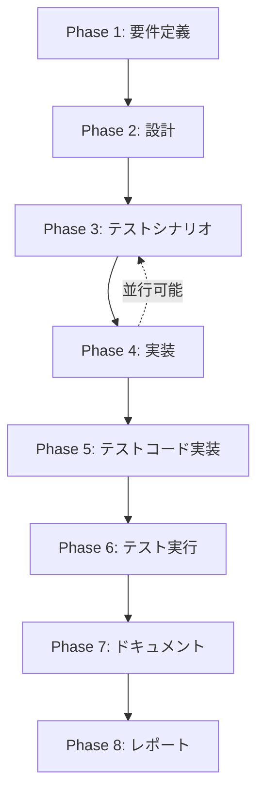

# プロジェクト計画書 - Issue #73

## 1. Issue分析

### 複雑度
**簡単**

### 見積もり工数
**2~4時間**

**根拠**:
- PR タイトル生成ロジックの変更: `src/commands/init.ts` の1箇所のみ（1行の文字列変更）
- PR テンプレート最適化: `src/templates/pr_body_template.md` と `src/templates/pr_body_detailed_template.md` の2ファイルの編集
- 既存の実装ロジックは変更不要（GitHub Client、Report Phase等は影響を受けない）
- テストケース追加: 初期化時のPRタイトル検証、テンプレート生成検証（2~3ファイル）
- ドキュメント更新: CLAUDE.md, ARCHITECTURE.md にPRタイトル変更の記載追加

### リスク評価
**低**

**理由**:
- 影響範囲が限定的（init コマンドとテンプレートファイルのみ）
- 既存の機能を破壊するリスクが低い（表示形式の変更のみ）
- テストによる品質保証が容易

## 2. 実装戦略判断

### 実装戦略: EXTEND

**判断根拠**:
このIssueは既存のPR生成ロジックを拡張する作業です。新規モジュール作成やリファクタリングではなく、以下の理由からEXTEND戦略が適切です：

1. **Issue タイトルの取得**: 既に `GitHubClient.getIssue()` メソッドが存在し、Issue情報を取得可能
2. **PR タイトル生成**: `init.ts` の `handleInitCommand()` 関数内で、現在の固定文字列 `[AI-Workflow] Issue #${issueNumber}` を Issue タイトルに置き換えるだけ
3. **テンプレート最適化**: 既存の2つのテンプレートファイルから不要なセクションを削除するだけ
4. **後方互換性**: PR本文生成ロジック（`generatePrBodyTemplate()`, `generatePrBodyDetailed()`）は変更不要

### テスト戦略: UNIT_INTEGRATION

**判断根拠**:

**UNIT_ONLY を選択しない理由**:
- GitHub API を使用した Issue タイトル取得が必要
- PR作成の実際の動作確認が必要

**INTEGRATION_ONLY を選択しない理由**:
- PR タイトル生成ロジック自体はユニットテストで検証可能
- テンプレート変更の影響はユニットテストで十分

**UNIT_INTEGRATION を選択する理由**:
1. **ユニットテスト**: PR タイトル生成ロジック、テンプレートプレースホルダー置換、エラーハンドリング（Issue取得失敗時）を検証
2. **インテグレーションテスト**: GitHub API を使用した実際のワークフロー（init → PR作成 → タイトル確認）を検証
3. **バランス**: 低リスクな変更であり、UNIT + INTEGRATION で十分なカバレッジを確保可能

### テストコード戦略: BOTH_TEST

**判断根拠**:

**CREATE_TEST を選択しない理由**:
- 既存の `tests/unit/commands/init.test.ts` が存在し、init コマンドのテストインフラが整備済み
- 既存のテストケースを活用できる

**EXTEND_TEST を選択しない理由**:
- 新規に PR タイトル生成専用のユニットテストが必要
- 統合テストも新規作成が必要（既存の統合テストは Issue URL解析やブランチ作成に焦点を当てている）

**BOTH_TEST を選択する理由**:
1. **既存テスト拡張**: `tests/unit/commands/init.test.ts` に Issue タイトル取得のモック追加
2. **新規ユニットテスト作成**: `tests/unit/commands/init-pr-title.test.ts` で PR タイトル生成ロジックを集中的にテスト
3. **新規統合テスト作成**: `tests/integration/init-pr-title-integration.test.ts` で実際のワークフローを検証

## 3. 影響範囲分析

### 既存コードへの影響

**変更が必要なファイル**:
1. **`src/commands/init.ts` (Line 320)**:
   - PR タイトル生成ロジック変更
   - Issue タイトル取得処理追加（`githubClient.getIssue(issueNumber)` 呼び出し）
   - エラーハンドリング追加（Issue取得失敗時のフォールバック）

2. **`src/templates/pr_body_template.md`**:
   - 削除: `### 👀 レビューポイント`, `### ⚙️ 実行環境` セクション

3. **`src/templates/pr_body_detailed_template.md`**:
   - 削除: `### 👀 レビューポイント`, `### ⚙️ 実行環境` セクション

**影響を受けないコンポーネント**:
- `src/core/github-client.ts`: PR作成ロジックは変更不要（タイトルは引数として受け取る設計）
- `src/core/github/pull-request-client.ts`: PR API呼び出しロジックは変更不要
- `src/phases/report.ts`: PR本文更新ロジックは変更不要（Phase 8 で生成される詳細情報は維持される）

### 依存関係の変更
**なし**

- 新規パッケージの追加は不要（既存の `@octokit/rest` を使用）
- 既存の依存関係のバージョン変更も不要

### マイグレーション要否
**不要**

- データベーススキーマ変更なし
- 設定ファイル変更なし
- 既存の `.ai-workflow/issue-*/metadata.json` への影響なし（PR タイトルは GitHub 上にのみ保存される）

## 4. タスク分割

### Phase 1: 要件定義 (見積もり: 0.5~1h)

- [ ] Task 1-1: 機能要件の詳細化 (0.5~1h)
  - PR タイトル生成ルールの明確化（Issue タイトルをそのまま使用 vs プレフィックス追加）
  - エラーハンドリング要件の定義（Issue取得失敗時の挙動、タイトルが空の場合の挙動）
  - テンプレート削除セクションの確認（`### 👀 レビューポイント`, `### ⚙️ 実行環境`）
  - 受け入れ基準の定義

### Phase 2: 設計 (見積もり: 0.5~1h)

- [x] Task 2-1: PR タイトル生成ロジックの設計 (0.5~1h)
  - Issue タイトル取得のエラーハンドリング設計（API失敗時のフォールバック）
  - PR タイトルフォーマット決定（Issue タイトルをそのまま使用 vs プレフィックス追加）
  - 長いタイトルの処理方針（GitHub PR タイトルの最大長: 256文字）

### Phase 3: テストシナリオ (見積もり: 0.5~1h)

- [x] Task 3-1: ユニットテストシナリオ作成 (0.3~0.5h)
  - Issue取得成功時のPRタイトル生成検証
  - Issue取得失敗時のフォールバック動作検証
  - 長いタイトル（256文字以上）の切り詰め動作検証

- [x] Task 3-2: インテグレーションテストシナリオ作成 (0.2~0.5h)
  - init コマンド実行 → PR作成 → タイトル確認の一連の流れ
  - 既存ブランチへの再初期化時のPRタイトル確認

### Phase 4: 実装 (見積もり: 1~2h)

- [x] Task 4-1: PR タイトル生成ロジック実装 (0.5~1h)
  - `src/commands/init.ts` の `handleInitCommand()` 関数修正
  - Issue タイトル取得処理追加
  - エラーハンドリング実装（フォールバック: `[AI-Workflow] Issue #${issueNumber}`）
  - 長いタイトルの切り詰め処理（256文字制限）

- [x] Task 4-2: PR テンプレート最適化 (0.2~0.3h)
  - `src/templates/pr_body_template.md` 編集（`### 👀 レビューポイント`, `### ⚙️ 実行環境` 削除）
  - `src/templates/pr_body_detailed_template.md` 編集（同上）

- [x] Task 4-3: エラーメッセージ追加 (0.1~0.2h)
  - Issue取得失敗時の警告ログ追加
  - デバッグ用ログ追加（`logger.info('Using Issue title as PR title: ...')`)

### Phase 5: テストコード実装 (見積もり: 1~1.5h)

- [x] Task 5-1: ユニットテスト実装 (0.5~0.8h)
  - `tests/unit/commands/init-pr-title.test.ts` 作成
  - Issue タイトル取得のモック設定
  - PR タイトル生成ロジックのテスト（正常系、異常系、境界値）

- [x] Task 5-2: インテグレーションテスト実装 (0.5~0.7h)
  - `tests/integration/init-pr-title-integration.test.ts` 作成
  - モックリポジトリセットアップ
  - init コマンド実行 → PR作成 → タイトル確認フロー

### Phase 6: テスト実行 (見積もり: 0.5~1h)

- [ ] Task 6-1: ユニットテスト実行 (0.2~0.3h)
  - `npm run test:unit` 実行
  - カバレッジ確認（新規コードのカバレッジ80%以上）
  - 失敗テストケースの修正

- [ ] Task 6-2: インテグレーションテスト実行 (0.3~0.5h)
  - `npm run test:integration` 実行
  - 実際のGitHub APIとの連携確認（モック環境）
  - エラーハンドリングの動作確認

- [ ] Task 6-3: 手動テスト実行 (0.1~0.2h)
  - 実際のGitHubリポジトリでinit コマンド実行
  - 生成されたPRのタイトル確認
  - テンプレート最適化の確認

### Phase 7: ドキュメント (見積もり: 0.5~0.8h)

- [ ] Task 7-1: CLAUDE.md 更新 (0.2~0.3h)
  - PRタイトル生成ロジックの説明追加（セクション「## CLI の使用方法」）
  - エラーハンドリングの説明追加

- [ ] Task 7-2: ARCHITECTURE.md 更新 (0.2~0.3h)
  - init コマンドフローの図更新（Issue タイトル取得ステップ追加）
  - テンプレート最適化の説明追加

- [ ] Task 7-3: 変更ログ作成 (0.1~0.2h)
  - CHANGELOG.md にv0.3.x の変更内容記載
  - Issue #73 への参照追加

### Phase 8: レポート (見積もり: 0.3~0.5h)

- [ ] Task 8-1: 変更サマリー作成 (0.2~0.3h)
  - 実装した機能のサマリー
  - 変更したファイルのリスト
  - テスト結果のサマリー

- [ ] Task 8-2: レビューポイント整理 (0.1~0.2h)
  - コードレビューで確認すべきポイントをリスト化
  - テストカバレッジの確認依頼
  - ドキュメント更新の確認依頼

## 5. 依存関係



**クリティカルパス**:
Phase 1 → Phase 2 → Phase 4 → Phase 5 → Phase 6 → Phase 7 → Phase 8

**並行実行可能なタスク**:
- Phase 3（テストシナリオ）と Phase 4（実装）は部分的に並行可能
- Phase 7（ドキュメント）の各タスクは独立して実行可能

## 6. リスクと軽減策

### リスク1: Issue タイトル取得失敗による PR 作成の中断
- **影響度**: 低
- **確率**: 低
- **軽減策**:
  - Issue 取得失敗時は従来のタイトル `[AI-Workflow] Issue #${issueNumber}` にフォールバック
  - エラーログを明示的に出力し、ユーザーに通知
  - GitHub API のレート制限エラーを適切にハンドリング

### リスク2: Issue タイトルが長すぎる場合の GitHub PR タイトル制限違反
- **影響度**: 低
- **確率**: 中
- **軽減策**:
  - GitHub PR タイトルの最大長（256文字）を考慮し、長いタイトルは切り詰める
  - 切り詰め時は `...` を末尾に追加して切り詰めを明示
  - ユニットテストで境界値（256文字、257文字）をテスト

### リスク3: テンプレート変更による既存ワークフローの影響
- **影響度**: 低
- **確率**: 低
- **軽減策**:
  - Report Phase（Phase 8）は `pr_body_detailed_template.md` を使用するため、初期化時のテンプレート変更の影響は限定的
  - 既存のPR（v0.3.0以前）には影響しない（テンプレートは初期化時のみ使用）
  - 統合テストで全フェーズの実行を確認

### リスク4: Issue タイトルに特殊文字が含まれる場合の表示崩れ
- **影響度**: 低
- **確率**: 中
- **軽減策**:
  - GitHub PR タイトルはHTMLエスケープされるため、基本的に安全
  - テストケースで特殊文字（`<`, `>`, `&`, `"`）を含むタイトルを検証
  - 必要に応じてサニタイズ処理を追加（ただし、GitHubが自動処理するため不要と予想）

## 7. 品質ゲート

### Phase 1: 要件定義
- [ ] 機能要件が明確に記載されている（PR タイトル生成ルール、エラーハンドリング要件）
- [ ] 受け入れ基準が定義されている（Issue タイトル → PR タイトル、テンプレート削除）
- [ ] 非機能要件が定義されている（パフォーマンス: Issue 取得時間 < 3秒）

### Phase 2: 設計
- [ ] **実装戦略の判断根拠が明記されている**（EXTEND: 既存コード拡張）
- [ ] **テスト戦略の判断根拠が明記されている**（UNIT_INTEGRATION: ユニット + 統合）
- [ ] **テストコード戦略の判断根拠が明記されている**（BOTH_TEST: 既存拡張 + 新規作成）
- [ ] エラーハンドリング設計が完了している（Issue 取得失敗、長いタイトル）
- [ ] PR タイトルフォーマットが決定している

### Phase 3: テストシナリオ
- [ ] ユニットテストシナリオが網羅的である（正常系、異常系、境界値）
- [ ] インテグレーションテストシナリオが実ワークフローをカバーしている
- [ ] テストデータが準備されている（モックIssueタイトル、長いタイトル）

### Phase 4: 実装
- [ ] PR タイトル生成ロジックが実装されている
- [ ] Issue 取得失敗時のフォールバックが実装されている
- [ ] 長いタイトルの切り詰め処理が実装されている
- [ ] テンプレートファイルが最適化されている（不要セクション削除）
- [ ] コードが ESLint / Prettier でフォーマットされている

### Phase 5: テストコード実装
- [ ] ユニットテストが実装されている（最低3ケース: 正常、異常、境界値）
- [ ] インテグレーションテストが実装されている（init → PR作成フロー）
- [ ] テストカバレッジが80%以上である（新規コード）

### Phase 6: テスト実行
- [ ] すべてのユニットテストがパスしている
- [ ] すべてのインテグレーションテストがパスしている
- [ ] 手動テストで実際のPRタイトルが確認されている
- [ ] エラーハンドリングが正しく動作している

### Phase 7: ドキュメント
- [ ] CLAUDE.md が更新されている（PRタイトル生成の説明）
- [ ] ARCHITECTURE.md が更新されている（init コマンドフロー図）
- [ ] CHANGELOG.md に変更内容が記載されている

### Phase 8: レポート
- [ ] 変更サマリーが作成されている
- [ ] レビューポイントが整理されている
- [ ] テスト結果が文書化されている

## 8. 成功基準

このIssueは以下の基準を満たした場合に成功とみなします：

### 機能要件
- [ ] PR タイトルが Issue タイトルと一致する（`[AI-Workflow] Issue #123` → `機能追加: 環境変数アクセスを一元化する設定管理を追加`）
- [ ] Issue 取得失敗時に従来のタイトルにフォールバックする
- [ ] PR テンプレートから `### 👀 レビューポイント` と `### ⚙️ 実行環境` セクションが削除されている

### 品質要件
- [ ] すべてのユニットテストがパスする
- [ ] すべてのインテグレーションテストがパスする
- [ ] テストカバレッジが80%以上
- [ ] ESLint / Prettier エラーがゼロ

### ドキュメント要件
- [ ] CLAUDE.md が更新されている
- [ ] ARCHITECTURE.md が更新されている
- [ ] CHANGELOG.md に変更内容が記載されている

### レビュー要件
- [ ] コードレビューで承認を得る
- [ ] テストレビューで承認を得る
- [ ] ドキュメントレビューで承認を得る

## 9. 備考

### Issue #73 の改善点

#### 改善点1: PR タイトルの最適化
現在の `[AI-Workflow] Issue #51` というタイトルは、Issue 番号のみでは内容が不明です。Issueタイトルをそのまま使用することで、PR一覧での可読性が大幅に向上します。

**Before**:
```
[AI-Workflow] Issue #51
```

**After**:
```
機能追加: 環境変数アクセスを一元化する設定管理を追加
```

#### 改善点2: PR テンプレートの最適化
現在のテンプレートには、初期化時には内容が空の `### 👀 レビューポイント` セクションと、詳細情報を含まない `### ⚙️ 実行環境` セクションが含まれています。これらは Report Phase（Phase 8）で生成される詳細なPR本文では有用ですが、初期化時のドラフトPRには不要です。

**削除するセクション**:
- `### 👀 レビューポイント` … 初期化時は常に「（レビューの記載なし）」と表示される
- `### ⚙️ 実行環境` … モデル名やブランチ名は、PR本文の他のセクションでも確認可能

**保持するセクション**:
- `### 📋 関連Issue` … Issue番号を明示的に記載（`Closes #N` でGitHub連携）
- `### 🔄 ワークフロー進捗` … 各フェーズの進捗状況を視覚化
- `### 📁 成果物` … ワークフローディレクトリへのパス

### 実装時の注意事項

1. **Issue タイトルの取得**: `githubClient.getIssue(issueNumber)` を使用してIssue情報を取得します。既存のメソッドを活用します。

2. **エラーハンドリング**: GitHub API のレート制限エラー、ネットワークエラー、Issue が存在しない場合など、様々なエラーケースを考慮します。

3. **後方互換性**: 既存のワークフロー（v0.3.0以前）には影響を与えません。新規に `init` コマンドを実行した場合のみ、新しいPRタイトル形式が適用されます。

4. **テストの独立性**: ユニットテストはGitHub APIをモック化し、インテグレーションテストは実際のAPIを使用します（テスト用リポジトリ）。

5. **ドキュメントの一貫性**: CLAUDE.md と ARCHITECTURE.md の両方で、PRタイトル生成ロジックの説明を一貫させます。

## 10. タイムライン

| Phase | 開始予定 | 完了予定 | 所要時間 |
|-------|---------|---------|----------|
| Phase 0: Planning | Day 1 AM | Day 1 AM | 完了 |
| Phase 1: Requirements | Day 1 AM | Day 1 AM | 0.5~1h |
| Phase 2: Design | Day 1 AM | Day 1 PM | 0.5~1h |
| Phase 3: Test Scenario | Day 1 PM | Day 1 PM | 0.5~1h |
| Phase 4: Implementation | Day 1 PM | Day 2 AM | 1~2h |
| Phase 5: Test Implementation | Day 2 AM | Day 2 AM | 1~1.5h |
| Phase 6: Testing | Day 2 AM | Day 2 PM | 0.5~1h |
| Phase 7: Documentation | Day 2 PM | Day 2 PM | 0.5~0.8h |
| Phase 8: Report | Day 2 PM | Day 2 PM | 0.3~0.5h |
| **合計** | - | - | **5.2~9.3h** |

**推奨スケジュール**: 2日間（1日4時間作業想定）

## 11. 参考情報

### 関連Issue
- Issue #51: 環境変数アクセスを一元化する設定管理を追加（PR タイトル例として参照）

### 関連ドキュメント
- @CLAUDE.md - プロジェクト全体方針（セクション「## CLI の使用方法」）
- @ARCHITECTURE.md - init コマンドフロー（セクション「## モジュール一覧」）
- @README.md - PR テンプレートの説明

### 関連コードファイル
- `src/commands/init.ts` - PR タイトル生成ロジック
- `src/core/github-client.ts` - Issue 取得メソッド
- `src/templates/pr_body_template.md` - 初期化時のPRテンプレート
- `src/templates/pr_body_detailed_template.md` - Report Phase用のPRテンプレート

---

**計画書作成日**: 2025-01-20
**計画書バージョン**: 1.0
**承認者**: AI Workflow Phase 0 (Planning)
