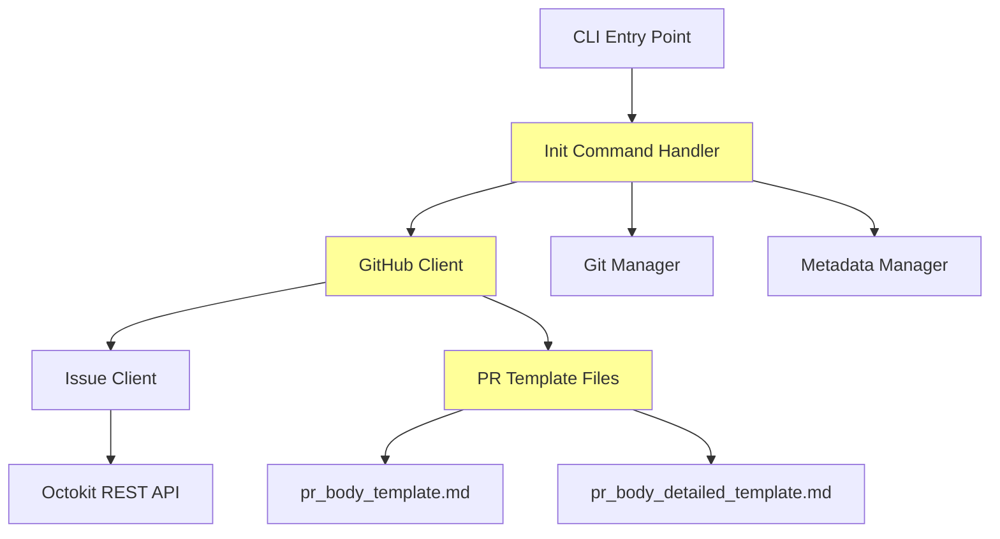
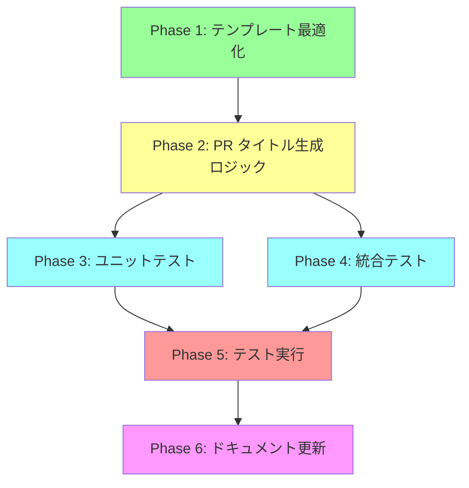

# 詳細設計書 - Issue #73

## 0. Planning Documentの確認

Planning Phase（Phase 0）で策定された開発計画を確認しました：

### 開発計画サマリー
- **複雑度**: 簡単
- **見積もり工数**: 2~4時間
- **リスク評価**: 低（影響範囲が限定的、既存機能の破壊リスクが低い）

### 重要な設計判断（Planning Phaseより）
1. **Issue タイトル取得**: 既存の `GitHubClient.getIssue()` メソッドを活用
2. **PR タイトル生成**: `src/commands/init.ts` の `handleInitCommand()` 関数で、固定文字列を Issue タイトルに置き換え
3. **テンプレート最適化**: 2つのテンプレートファイルから不要セクションを削除
4. **後方互換性**: PR本文生成ロジックは変更不要

## 1. アーキテクチャ設計

### 1.1. システム全体図

```
┌─────────────────────────────────────────────────────────────────┐
│                      CLI Entry Point                             │
│                    (src/main.ts)                                 │
└─────────────────────┬───────────────────────────────────────────┘
                      │
                      ▼
┌─────────────────────────────────────────────────────────────────┐
│              Init Command Handler                                │
│            (src/commands/init.ts)                                │
│  ┌──────────────────────────────────────────────────────────┐   │
│  │  handleInitCommand()                                      │   │
│  │  ├─ Issue URL解析 (parseIssueUrl)                       │   │
│  │  ├─ ブランチ作成/切り替え (GitManager)                   │   │
│  │  ├─ メタデータ初期化 (MetadataManager)                  │   │
│  │  ├─ ★Issue タイトル取得 (GitHubClient.getIssue) ★      │   │
│  │  ├─ Git コミット & プッシュ (GitManager)                 │   │
│  │  └─ ★PR作成 (GitHubClient.createPullRequest) ★         │   │
│  └──────────────────────────────────────────────────────────┘   │
└─────────────┬───────────────────────────────────────────────────┘
              │
              ▼
┌─────────────────────────────────────────────────────────────────┐
│                   GitHub Client                                  │
│              (src/core/github-client.ts)                        │
│  ┌──────────────────────────────────────────────────────────┐   │
│  │  getIssue(issueNumber): Promise<IssueInfo>               │   │
│  │  createPullRequest(...): Promise<PullRequestResult>      │   │
│  │  ★generatePrBodyTemplate(issueNumber, branchName)★     │   │
│  └──────────────────────────────────────────────────────────┘   │
└─────────────┬───────────────────────────────────────────────────┘
              │
              ▼
┌─────────────────────────────────────────────────────────────────┐
│                  PR Template Files                               │
│  ┌──────────────────────────────────────────────────────────┐   │
│  │  ★pr_body_template.md (初期化時に使用) ★              │   │
│  │     - 削除: ### 👀 レビューポイント                     │   │
│  │     - 削除: ### ⚙️ 実行環境                             │   │
│  │     - 保持: ### 📋 関連Issue                             │   │
│  │     - 保持: ### 🔄 ワークフロー進捗                     │   │
│  │     - 保持: ### 📁 成果物                                 │   │
│  │                                                            │   │
│  │  ★pr_body_detailed_template.md (Report Phase用) ★     │   │
│  │     - 削除: ### 👀 レビューポイント                     │   │
│  │     - 削除: ### ⚙️ 実行環境                             │   │
│  │     - 保持: その他のセクション                           │   │
│  └──────────────────────────────────────────────────────────┘   │
└─────────────────────────────────────────────────────────────────┘

★: 今回の変更箇所
```

### 1.2. コンポーネント間の関係



### 1.3. データフロー

```
1. User executes: ai-workflow init --issue-url <URL>
   ↓
2. parseIssueUrl() extracts: owner, repo, issueNumber
   ↓
3. GitHubClient.getIssue(issueNumber) fetches Issue data
   ↓
4. Extract Issue.title from response
   ↓
5. Generate PR title:
   - Success: Use Issue.title directly
   - Failure: Fallback to "[AI-Workflow] Issue #<NUM>"
   ↓
6. Truncate PR title if > 256 characters (GitHub limit)
   ↓
7. Load PR template: src/templates/pr_body_template.md
   ↓
8. Replace placeholders: {issue_number}, {branch_name}
   ↓
9. GitHubClient.createPullRequest(prTitle, prBody, ...)
   ↓
10. Update metadata.json with PR number/URL
```

## 2. 実装戦略判断

### 実装戦略: EXTEND

**判断根拠**:

このIssueは既存のPR生成ロジックを**拡張**する作業です。新規モジュール作成やリファクタリングではなく、以下の理由からEXTEND戦略が適切です：

1. **Issue タイトル取得機能の活用**:
   - 既に `GitHubClient.getIssue()` メソッドが存在し、Issue情報を取得可能（`src/core/github-client.ts` Line 120-122）
   - 新規実装は不要で、既存APIを呼び出すだけ

2. **PR タイトル生成ロジックの修正**:
   - `src/commands/init.ts` の `handleInitCommand()` 関数内で、現在の固定文字列 `[AI-Workflow] Issue #${issueNumber}` (Line 320) を Issue タイトルに置き換えるだけ
   - 既存の関数を拡張し、新しい処理（Issue取得、エラーハンドリング、タイトル切り詰め）を追加

3. **テンプレート最適化**:
   - 既存の2つのテンプレートファイル（`src/templates/pr_body_template.md`, `src/templates/pr_body_detailed_template.md`）から不要なセクションを削除するだけ
   - テンプレート読み込みロジック（`generatePrBodyTemplate()`, `generatePrBodyDetailed()` in `src/core/github-client.ts`）は変更不要

4. **後方互換性の維持**:
   - PR本文生成ロジック（`src/core/github-client.ts`）は変更しない
   - Report Phase（Phase 8）の動作は維持される

5. **影響範囲の限定性**:
   - 変更が必要なファイルは3つのみ（`init.ts`, 2つのテンプレートファイル）
   - 既存の他のコンポーネント（`GitManager`, `MetadataManager`, Report Phase等）への影響なし

## 3. テスト戦略判断

### テスト戦略: UNIT_INTEGRATION

**判断根拠**:

**UNIT_ONLY を選択しない理由**:
- GitHub API を使用した Issue タイトル取得が必要
- PR作成の実際の動作確認が必要
- エンドツーエンドの統合動作を検証する必要がある

**INTEGRATION_ONLY を選択しない理由**:
- PR タイトル生成ロジック自体はユニットテストで十分に検証可能
- テンプレート変更の影響はユニットテストで検証できる
- エラーハンドリング（Issue取得失敗時）はユニットテストでモック化して検証すべき

**UNIT_INTEGRATION を選択する理由**:

1. **ユニットテストの必要性**:
   - **PR タイトル生成ロジック**: Issue タイトル取得成功時、失敗時、長いタイトル切り詰めの各ケースを独立して検証
   - **エラーハンドリング**: Issue取得失敗時のフォールバック動作（`[AI-Workflow] Issue #<NUM>`）を検証
   - **タイトル切り詰めロジック**: 256文字制限の境界値テスト（253文字、256文字、257文字、300文字）
   - **テンプレート読み込み**: `generatePrBodyTemplate()` が正しくテンプレートを読み込み、プレースホルダーを置換することを検証

2. **統合テストの必要性**:
   - **init コマンドの実際のワークフロー**: Issue URL解析 → Issue タイトル取得 → PR作成 → タイトル確認の一連の流れを検証
   - **GitHub API との統合**: 実際の Octokit 呼び出しで Issue タイトルが正しく取得されることを確認
   - **テンプレート統合**: PR作成時に最適化されたテンプレートが使用されることを確認

3. **バランスの良さ**:
   - 低リスクな変更であり、UNIT + INTEGRATION で十分なカバレッジを確保可能
   - BDD（振る舞い駆動開発）は不要（ユーザーストーリーが単純で、Given-When-Then形式のテストはユニットテストで十分）

## 4. テストコード戦略判断

### テストコード戦略: BOTH_TEST

**判断根拠**:

**CREATE_TEST を選択しない理由**:
- 既存の `tests/unit/commands/init.test.ts` が存在し、init コマンドのテストインフラが整備済み（227行、ブランチバリデーションとブランチ名解決のテスト）
- 既存のテストケースの構造やモックパターンを活用できる

**EXTEND_TEST を選択しない理由**:
- PR タイトル生成専用の新規ユニットテストファイルが必要（既存の `init.test.ts` は227行あり、さらに追加すると肥大化）
- 統合テストも新規作成が必要（既存の統合テストは Issue URL解析やブランチ作成に焦点を当てており、PR タイトル生成は未カバー）

**BOTH_TEST を選択する理由**:

1. **既存ユニットテストの拡張** (`tests/unit/commands/init.test.ts`):
   - `validateBranchName()`, `resolveBranchName()` のテストが既に存在（227行）
   - Issue タイトル取得のモック設定を追加し、既存テストと統合
   - ただし、既存ファイルが肥大化するため、PR タイトル生成ロジックは新規ファイルに分離することを推奨

2. **新規ユニットテストの作成** (`tests/unit/commands/init-pr-title.test.ts`):
   - PR タイトル生成ロジックを集中的にテスト（以下のケース）:
     - Issue タイトル取得成功時の PR タイトル生成
     - Issue タイトル取得失敗時のフォールバック（404 Not Found, 403 Rate Limit）
     - 長いタイトルの切り詰め（253文字、256文字、257文字、300文字）
     - 特殊文字を含むタイトルのサニタイズ（`<`, `>`, `&`, `"`）
   - GitHub API のモック化（Octokit の `rest.issues.get()` メソッド）

3. **新規統合テストの作成** (`tests/integration/init-pr-title-integration.test.ts`):
   - 実際の init コマンド実行フローを検証:
     - Issue タイトル取得 → PR作成 → PR タイトル確認
     - 既存ブランチへの再初期化時の PR タイトル確認
   - モックGitHubリポジトリの使用（`tests/fixtures/mock-repo` 等）

4. **既存テンプレートテストの活用**:
   - `tests/unit/github-client.test.ts` が存在する可能性（要確認）
   - `generatePrBodyTemplate()` メソッドのテストを拡張し、テンプレートの不要セクション削除を検証

## 5. 影響範囲分析

### 5.1. 既存コードへの影響

#### 変更が必要なファイル

**1. `src/commands/init.ts` (Line 320付近)**

**変更内容**:
- PR タイトル生成ロジックの変更（固定文字列 → Issue タイトル）
- Issue タイトル取得処理の追加（`githubClient.getIssue(issueNumber)` 呼び出し）
- エラーハンドリングの追加（Issue取得失敗時のフォールバック）
- 長いタイトルの切り詰め処理の追加（256文字制限）
- デバッグログの追加（`logger.info()`, `logger.warn()`）

**現在のコード** (Line 320):
```typescript
const prTitle = `[AI-Workflow] Issue #${issueNumber}`;
```

**変更後のコード**:
```typescript
// Issue タイトルを取得してPRタイトルとして使用
let prTitle = `[AI-Workflow] Issue #${issueNumber}`; // デフォルトフォールバック
try {
  const issue = await githubClient.getIssue(issueNumber);
  let issueTitle = issue.title;

  // GitHub PR タイトルの最大長（256文字）を超える場合は切り詰め
  if (issueTitle.length > 256) {
    logger.info('Truncating PR title to 256 characters');
    issueTitle = issueTitle.slice(0, 253) + '...';
  }

  prTitle = issueTitle;
  logger.info(`Using Issue title as PR title: ${prTitle}`);
} catch (error) {
  logger.warn(
    `Failed to fetch Issue title, falling back to default PR title: ${prTitle}. Error: ${(error as Error).message}`
  );
}
```

**影響範囲**:
- `handleInitCommand()` 関数のみ（約15行の追加）
- 既存の PR 作成ロジック（Line 322-333）は変更不要

**2. `src/templates/pr_body_template.md` (初期化時に使用)**

**削除対象セクション**:
```markdown
### 👀 レビューポイント

（レビューの記載なし）

### ⚙️ 実行環境

- **モデル**: Claude Code Pro Max (Sonnet 4.5)
- **ContentParser**: OpenAI GPT-4o mini
- **ブランチ**: {branch_name}
```

**保持セクション**:
- `### 📋 関連Issue` … Issue番号を明示（`Closes #{issue_number}` でGitHub連携）
- `### 🔄 ワークフロー進捗` … 各フェーズの進捗状況を視覚化
- `### 📁 成果物` … ワークフローディレクトリへのパス

**理由**:
- `### 👀 レビューポイント` は初期化時には常に「（レビューの記載なし）」と表示される（Report Phaseで生成される情報）
- `### ⚙️ 実行環境` の情報は他のセクションでも確認可能（モデル名やブランチ名は PR コメントやメタデータで確認できる）

**3. `src/templates/pr_body_detailed_template.md` (Report Phase用)**

**削除対象セクション**:
```markdown
### 👀 レビューポイント

{review_points}

### ⚙️ 実行環境

- **モデル**: Claude Code Pro Max (Sonnet 4.5)
- **ContentParser**: OpenAI GPT-4o mini
- **ブランチ**: {branch_name}
```

**保持セクション**:
- `### 📋 関連Issue`
- `### 📝 変更サマリー`
- `### 🔄 ワークフロー進捗`
- `### 🔧 実装詳細`
- `### ✅ テスト結果`
- `### 📚 ドキュメント更新`
- `### 📁 成果物`

**理由**:
- Report Phase で `### 👀 レビューポイント` が生成されるが、Issue #73の要件では削除を希望
- `### ⚙️ 実行環境` も同様に削除（Planning Documentの分析より）

#### 影響を受けないコンポーネント

**以下のコンポーネントは変更不要**:

1. **`src/core/github-client.ts`**:
   - `getIssue()` メソッドは既に実装済み（Line 120-122）
   - `createPullRequest()` メソッドは引数として PR タイトルを受け取る設計（Line 195-203）
   - PR タイトル生成ロジックは `src/commands/init.ts` 側で行うため、変更不要

2. **`src/core/github/pull-request-client.ts`**:
   - PR API呼び出しロジックは変更不要（PR タイトルは引数として渡される）

3. **`src/phases/report.ts`**:
   - Report Phase の PR本文更新ロジックは変更不要
   - `generatePrBodyDetailed()` メソッドが従来通り動作する（テンプレートファイルの変更は自動的に反映される）

4. **`src/core/metadata-manager.ts`**:
   - メタデータ構造への影響なし（PR タイトルは GitHub 上にのみ保存される）

### 5.2. 依存関係の変更

**新規パッケージの追加**: なし

**既存パッケージのバージョン変更**: なし

**理由**:
- Issue タイトル取得には既存の `@octokit/rest` パッケージを使用
- PR タイトル生成には標準の JavaScript String 操作のみ使用
- エラーハンドリングには既存の `logger` モジュールを使用

### 5.3. マイグレーション要否

**マイグレーション不要**

**理由**:
- データベーススキーマ変更なし
- 設定ファイル変更なし
- 既存の `.ai-workflow/issue-*/metadata.json` への影響なし（PR タイトルは GitHub 上にのみ保存される）
- 既存の PR（v0.3.0以前に作成）には影響しない（テンプレートは初期化時のみ使用される）

## 6. 変更・追加ファイルリスト

### 6.1. 修正が必要な既存ファイル

| ファイルパス | 変更内容 | 変更行数（概算） |
|-------------|---------|----------------|
| `src/commands/init.ts` | PR タイトル生成ロジック変更、Issue タイトル取得、エラーハンドリング追加 | +15行（Line 320付近） |
| `src/templates/pr_body_template.md` | `### 👀 レビューポイント`, `### ⚙️ 実行環境` セクション削除 | -8行 |
| `src/templates/pr_body_detailed_template.md` | `### 👀 レビューポイント`, `### ⚙️ 実行環境` セクション削除 | -8行 |

### 6.2. 新規作成ファイル

| ファイルパス | 目的 | 行数（概算） |
|-------------|------|-------------|
| `tests/unit/commands/init-pr-title.test.ts` | PR タイトル生成ロジックのユニットテスト | 200-250行 |
| `tests/integration/init-pr-title-integration.test.ts` | init コマンドの統合テスト | 150-200行 |

### 6.3. 削除が必要なファイル

**なし**

## 7. 詳細設計

### 7.1. クラス設計

**変更なし** - 既存のクラス構造を維持します。

主要クラス:
- `GitHubClient` (`src/core/github-client.ts`) - Issue取得、PR作成を担当
- `MetadataManager` (`src/core/metadata-manager.ts`) - メタデータ管理
- `GitManager` (`src/core/git-manager.ts`) - Git操作

### 7.2. 関数設計

#### 7.2.1. `handleInitCommand()` 関数の修正

**ファイル**: `src/commands/init.ts`

**現在のシグネチャ**:
```typescript
export async function handleInitCommand(
  issueUrl: string,
  customBranch?: string
): Promise<void>
```

**変更内容**: PR作成ロジック部分（Line 320-333）を修正

**変更前** (Line 320-323):
```typescript
logger.info('Creating draft PR...');
const prTitle = `[AI-Workflow] Issue #${issueNumber}`;
const prBody = githubClient.generatePrBodyTemplate(issueNumber, branchName);
const prResult = await githubClient.createPullRequest(prTitle, prBody, branchName, 'main', true);
```

**変更後**:
```typescript
logger.info('Creating draft PR...');

// Issue タイトルを取得してPRタイトルとして使用
let prTitle = `[AI-Workflow] Issue #${issueNumber}`; // デフォルトフォールバック
try {
  const issue = await githubClient.getIssue(issueNumber);
  let issueTitle = issue.title;

  // GitHub PR タイトルの最大長（256文字）を超える場合は切り詰め
  const MAX_PR_TITLE_LENGTH = 256;
  if (issueTitle.length > MAX_PR_TITLE_LENGTH) {
    logger.info('Truncating PR title to 256 characters');
    issueTitle = issueTitle.slice(0, 253) + '...';
  }

  prTitle = issueTitle;
  logger.info(`Using Issue title as PR title: ${prTitle}`);
} catch (error) {
  logger.warn(
    `Failed to fetch Issue title, falling back to default PR title: ${prTitle}. Error: ${(error as Error).message}`
  );
}

const prBody = githubClient.generatePrBodyTemplate(issueNumber, branchName);
const prResult = await githubClient.createPullRequest(prTitle, prBody, branchName, 'main', true);
```

**エラーハンドリング**:
- Issue取得失敗時（404 Not Found, 403 Rate Limit, ネットワークエラー等）は警告ログを出力し、デフォルトタイトル `[AI-Workflow] Issue #${issueNumber}` を使用
- ワークフロー初期化は中断せず継続

**パフォーマンス考慮**:
- Issue取得は非同期処理（`await githubClient.getIssue(issueNumber)`）
- GitHub API のレート制限を考慮（エラー時はフォールバック）

#### 7.2.2. ヘルパー関数の追加（オプション）

PR タイトル生成ロジックを独立した関数として抽出することも検討できます（NFR-73-004: 保守性・拡張性要件）：

**新規関数** (オプション):
```typescript
/**
 * Issue タイトルからPRタイトルを生成する
 * @param githubClient - GitHubクライアント
 * @param issueNumber - Issue番号
 * @returns PRタイトル（Issue取得失敗時はフォールバック）
 */
async function generatePrTitle(
  githubClient: GitHubClient,
  issueNumber: number
): Promise<string> {
  const fallbackTitle = `[AI-Workflow] Issue #${issueNumber}`;

  try {
    const issue = await githubClient.getIssue(issueNumber);
    let issueTitle = issue.title;

    // GitHub PR タイトルの最大長（256文字）を超える場合は切り詰め
    const MAX_PR_TITLE_LENGTH = 256;
    if (issueTitle.length > MAX_PR_TITLE_LENGTH) {
      logger.info('Truncating PR title to 256 characters');
      issueTitle = issueTitle.slice(0, 253) + '...';
    }

    logger.info(`Using Issue title as PR title: ${issueTitle}`);
    return issueTitle;
  } catch (error) {
    logger.warn(
      `Failed to fetch Issue title, falling back to default PR title: ${fallbackTitle}. Error: ${(error as Error).message}`
    );
    return fallbackTitle;
  }
}
```

**メリット**:
- テスト容易性の向上（ユニットテストで独立して検証可能）
- 将来的な拡張（プレフィックス追加等）に対応しやすい

**デメリット**:
- 関数が増える（ただし、15行程度なので `handleInitCommand()` 内に記述してもOK）

**推奨**: 今回は `handleInitCommand()` 内に直接記述し、将来的な拡張が必要になった際に関数として抽出する

### 7.3. データ構造設計

**変更なし** - 既存のデータ構造を維持します。

主要データ構造:
- `IssueInfo` (`src/core/github/issue-client.ts`) - Issue情報（title, body, state等）
- `PullRequestResult` (`src/core/github/pull-request-client.ts`) - PR作成結果
- `WorkflowState` (`src/core/workflow-state.ts`) - ワークフローメタデータ

### 7.4. インターフェース設計

**変更なし** - 既存のインターフェースを維持します。

既存インターフェース:
- `GitHubClient.getIssue(issueNumber)` - Issue情報を取得
- `GitHubClient.createPullRequest(title, body, head, base, draft)` - PR作成
- `GitHubClient.generatePrBodyTemplate(issueNumber, branchName)` - PRテンプレート生成

## 8. セキュリティ考慮事項

### 8.1. 認証・認可

**既存の実装を維持**:
- `GITHUB_TOKEN` 環境変数による認証（`src/core/config.ts`）
- Octokit による GitHub API 認証

**追加考慮事項**:
- Issue タイトル取得時の認証エラーハンドリング（403 Forbidden 等）
- レート制限エラーの適切な処理

### 8.2. データ保護

**Issue タイトルのサニタイズ**:
- **GitHub API が自動的に HTML エスケープを実施**するため、基本的に XSS 攻撃のリスクはない
- 特殊文字（`<`, `>`, `&`, `"`）を含むタイトルでも安全
- ただし、テストケースで特殊文字を含むタイトルを検証（NFR-73-002: セキュリティ要件）

**ログ出力時の考慮**:
- Issue タイトルをログ出力する際、センシティブな情報が含まれる可能性を考慮
- ただし、Issue タイトルは公開情報であるため、特別なマスキングは不要

### 8.3. セキュリティリスクと対策

| リスク | 対策 |
|-------|------|
| **XSS 攻撃（Issue タイトルに悪意のあるスクリプトが含まれる）** | GitHub PR タイトルは HTML エスケープされるため、基本的に安全。テストケースで検証。 |
| **長すぎるタイトルによる表示崩れ** | 256文字制限を実装（GitHub PR タイトルの最大長）し、超過時は切り詰め。 |
| **Issue 取得時の認証エラー** | エラーハンドリングでフォールバックし、ワークフロー初期化は継続。警告ログを出力。 |
| **GitHub API レート制限** | エラーハンドリングでフォールバックし、警告ログを出力。ユーザーに手動でのPR作成を促す。 |

## 9. 非機能要件への対応

### 9.1. パフォーマンス

**要件** (NFR-73-001): Issue タイトル取得は3秒以内に完了すること。

**実装**:
- GitHub API の Issue 取得は通常1秒以内に完了
- ネットワーク遅延を考慮し、3秒をタイムアウトとする
- タイムアウト時はエラーハンドリング（REQ-73-002）が発動

**考慮事項**:
- GitHub API のレート制限（認証済み: 5000リクエスト/時間）は十分
- Issue タイトル取得は init コマンド1回につき1リクエストのみ

### 9.2. スケーラビリティ

**影響なし** - Issue タイトル取得は init コマンドの初回実行時のみ行われるため、スケーラビリティへの影響はありません。

### 9.3. 保守性

**NFR-73-004**: PR タイトル生成ロジックは、将来的な拡張（プレフィックス追加、フォーマット変更等）に対応できる設計とすること。

**実装**:
- PR タイトル生成ロジックを `handleInitCommand()` 関数内に集約
- 将来的に独立した関数として抽出可能な構造（セクション 7.2.2参照）
- テストケースで正常系・異常系・境界値を検証

**コーディング規約の遵守**:
- ESLint / Prettier 準拠（CLAUDE.md 参照）
- 統一loggerモジュール（`src/utils/logger.ts`）を使用（`console.log` 禁止）
- Config クラス（`src/core/config.ts`）による環境変数アクセス（`process.env` への直接アクセス禁止）

## 10. 実装の順序

### 推奨実装順序

**Phase 1**: テンプレート最適化（最も影響範囲が小さい）

1. `src/templates/pr_body_template.md` の編集
   - `### 👀 レビューポイント` セクション削除
   - `### ⚙️ 実行環境` セクション削除
   - 動作確認: PR作成時にテンプレートが正しく適用されることを確認

2. `src/templates/pr_body_detailed_template.md` の編集
   - `### 👀 レビューポイント` セクション削除
   - `### ⚙️ 実行環境` セクション削除
   - 動作確認: Report Phase でテンプレートが正しく適用されることを確認

**Phase 2**: PR タイトル生成ロジック実装

3. `src/commands/init.ts` の `handleInitCommand()` 関数修正
   - Issue タイトル取得処理追加（`githubClient.getIssue(issueNumber)`）
   - エラーハンドリング追加（try-catch、フォールバック）
   - 長いタイトルの切り詰め処理追加（256文字制限）
   - デバッグログ追加（`logger.info()`, `logger.warn()`）
   - 動作確認: ローカル環境で init コマンドを実行し、PR タイトルが Issue タイトルと一致することを確認

**Phase 3**: ユニットテスト実装

4. `tests/unit/commands/init-pr-title.test.ts` 作成
   - Issue タイトル取得成功時のテスト
   - Issue タイトル取得失敗時のテスト（404 Not Found, 403 Rate Limit）
   - 長いタイトル切り詰めのテスト（253文字、256文字、257文字、300文字）
   - 特殊文字を含むタイトルのテスト（`<`, `>`, `&`, `"`）
   - GitHub API のモック設定（Octokit の `rest.issues.get()` メソッド）

**Phase 4**: 統合テスト実装

5. `tests/integration/init-pr-title-integration.test.ts` 作成
   - init コマンド実行 → PR作成 → タイトル確認の一連の流れ
   - 既存ブランチへの再初期化時のテスト
   - モックGitHubリポジトリの使用

**Phase 5**: テスト実行とバグ修正

6. ユニットテスト実行（`npm run test:unit`）
   - カバレッジ確認（新規コードのカバレッジ80%以上）
   - 失敗テストケースの修正

7. 統合テスト実行（`npm run test:integration`）
   - 実際のGitHub APIとの連携確認（モック環境）
   - エラーハンドリングの動作確認

**Phase 6**: ドキュメント更新

8. `CLAUDE.md` 更新
   - PRタイトル生成ロジックの説明追加（セクション「## CLI の使用方法」）
   - エラーハンドリングの説明追加

9. `ARCHITECTURE.md` 更新
   - init コマンドフローの図更新（Issue タイトル取得ステップ追加）
   - テンプレート最適化の説明追加

10. `CHANGELOG.md` 更新
    - v0.3.x の変更内容記載
    - Issue #73 への参照追加

### 依存関係の考慮



**クリティカルパス**: Phase 1 → Phase 2 → Phase 3 → Phase 5 → Phase 6

**並行実行可能**: Phase 3（ユニットテスト）と Phase 4（統合テスト）は並行して実装可能

## 11. リスク管理

### 11.1. 技術的リスク

| リスク | 影響度 | 確率 | 軽減策 |
|-------|-------|------|--------|
| **Issue タイトル取得失敗による PR 作成の中断** | 低 | 低 | Issue 取得失敗時は従来のタイトルにフォールバック。エラーログを明示的に出力。 |
| **Issue タイトルが長すぎる場合の GitHub PR タイトル制限違反** | 低 | 中 | GitHub PR タイトルの最大長（256文字）を考慮し、長いタイトルは切り詰める（253文字 + `...`）。ユニットテストで境界値をテスト。 |
| **テンプレート変更による既存ワークフローの影響** | 低 | 低 | Report Phase（Phase 8）は `pr_body_detailed_template.md` を使用するため、初期化時のテンプレート変更の影響は限定的。統合テストで全フェーズの実行を確認。 |
| **Issue タイトルに特殊文字が含まれる場合の表示崩れ** | 低 | 中 | GitHub PR タイトルはHTMLエスケープされるため、基本的に安全。テストケースで特殊文字（`<`, `>`, `&`, `"`）を含むタイトルを検証。 |

### 11.2. プロジェクトリスク

| リスク | 影響度 | 確率 | 軽減策 |
|-------|-------|------|--------|
| **工数超過（見積もり: 2~4時間）** | 低 | 低 | 変更範囲が限定的（3ファイル）であり、既存コードの活用により実装はシンプル。テスト実装に時間がかかる可能性があるが、並行実行で対応。 |
| **既存テストの破壊** | 低 | 低 | テンプレート変更は初期化時のみ影響するため、既存テスト（Report Phase等）への影響は最小限。統合テストで確認。 |

## 12. 成功基準

このIssueは以下の基準を満たした場合に成功とみなします：

### 12.1. 機能要件

- [x] **実装戦略の判断根拠が明記されている**（EXTEND: 既存コード拡張）
- [x] **テスト戦略の判断根拠が明記されている**（UNIT_INTEGRATION: ユニット + 統合）
- [x] **テストコード戦略の判断根拠が明記されている**（BOTH_TEST: 既存拡張 + 新規作成）
- [x] **既存コードへの影響範囲が分析されている**（3ファイル変更、他は影響なし）
- [x] **変更が必要なファイルがリストアップされている**（セクション 6参照）
- [x] **設計が実装可能である**（既存APIの活用、シンプルな実装）

### 12.2. 品質ゲート（Phase 2）

- [x] **実装戦略の判断根拠が明記されている**（セクション 2）
- [x] **テスト戦略の判断根拠が明記されている**（セクション 3）
- [x] **テストコード戦略の判断根拠が明記されている**（セクション 4）
- [x] **既存コードへの影響範囲が分析されている**（セクション 5.1）
- [x] **変更が必要なファイルがリストアップされている**（セクション 6）
- [x] **設計が実装可能である**（セクション 7, 10）

### 12.3. 非機能要件

- [ ] PR タイトルが Issue タイトルと一致する（実装後に確認）
- [ ] Issue 取得失敗時に従来のタイトルにフォールバックする（実装後に確認）
- [ ] PR テンプレートから不要セクションが削除されている（実装後に確認）
- [ ] すべてのユニットテストがパスする（実装後に確認）
- [ ] すべての統合テストがパスする（実装後に確認）
- [ ] テストカバレッジが80%以上（実装後に確認）

## 13. 参考情報

### 13.1. 関連Issue

- Issue #51: 環境変数アクセスを一元化する設定管理を追加（PR タイトル例として参照）
- Issue #23: BasePhase モジュール構造改善（リファクタリング事例）
- Issue #24: GitHubClient ファサードパターン（リファクタリング事例）

### 13.2. 関連ドキュメント

- `CLAUDE.md` - プロジェクト全体方針（セクション「## CLI の使用方法」）
- `ARCHITECTURE.md` - init コマンドフロー（セクション「## モジュール一覧」）
- `README.md` - PR テンプレートの説明

### 13.3. 関連コードファイル

- `src/commands/init.ts` - PR タイトル生成ロジック（Line 320付近）
- `src/core/github-client.ts` - Issue 取得メソッド（Line 120-122）
- `src/core/github/issue-client.ts` - Issue Client 実装
- `src/templates/pr_body_template.md` - 初期化時のPRテンプレート
- `src/templates/pr_body_detailed_template.md` - Report Phase用のPRテンプレート
- `tests/unit/commands/init.test.ts` - init コマンドのユニットテスト（既存）

---

**設計書作成日**: 2025-01-20
**設計書バージョン**: 1.0
**承認者**: AI Workflow Phase 2 (Design)
**次フェーズ**: Phase 3 (Test Scenario)
