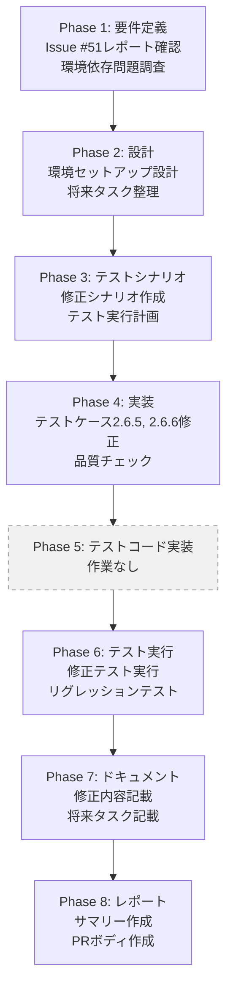

# プロジェクト計画書 - Issue #74

**Issue番号**: #74
**タイトル**: [FOLLOW-UP] Issue #51 - 残タスク
**作成日**: 2025-01-30
**複雑度**: 簡単

---

## 1. Issue分析

### 複雑度判定: 簡単

**判定根拠**:
- 主作業は単一テストファイル（`tests/unit/core/config.test.ts`）の修正
- 既存機能への変更なし（テストコードの環境依存問題の解決のみ）
- その他2つのタスクは「将来的な検討」であり、現時点では別Issueの作成検討のみ

### 見積もり工数: 2~4時間

**内訳**:
- Phase 1（要件定義）: 0.5h
- Phase 2（設計）: 0.5h
- Phase 3（テストシナリオ）: 0.5h
- Phase 4（実装）: 0.5h（テスト修正のみ）
- Phase 5（テストコード実装）: 0h（テストコードの修正が主タスクのため）
- Phase 6（テスト実行）: 0.5h
- Phase 7（ドキュメント）: 0.5h
- Phase 8（レポート）: 0.5h

**合計**: 約3.5時間（余裕を見て2~4時間）

### リスク評価: 低

**理由**:
- 既存機能への影響なし
- テストコードの修正のみ
- 環境依存問題の解決策は明確（JENKINS_HOME環境変数の明示的削除）
- 外部システムへの依存なし

---

## 2. 実装戦略判断

### 実装戦略: EXTEND

**判断根拠**:
既存のテストファイル（`tests/unit/core/config.test.ts`）に対して、環境変数の明示的削除処理を追加する作業が中心です。新規ファイルやクラスの作成は不要で、既存テストケース（2.6.5と2.6.6）の拡張により環境依存問題を解決します。

**作業内容**:
- テストケース2.6.5、2.6.6の beforeEach / afterEach フックで `JENKINS_HOME` 環境変数を削除・復元
- テストの独立性を確保するための環境セットアップ処理の追加

### テスト戦略: UNIT_ONLY

**判断根拠**:
本Issueの対象はユニットテストファイル（`config.test.ts`）の修正のみであり、外部システム連携やユーザーストーリーは含まれません。修正後のテストケースが正しく動作することを検証するため、ユニットテストのみで十分です。

**検証対象**:
- 修正したテストケース2.6.5、2.6.6が環境依存なく動作すること
- 既存の他のテストケースに影響がないこと（リグレッション防止）

### テストコード戦略: EXTEND_TEST

**判断根拠**:
既存のテストファイル（`tests/unit/core/config.test.ts`）に対する修正であり、新規テストファイルの作成は不要です。テストケース2.6.5と2.6.6の環境セットアップ処理を拡張（beforeEach/afterEachフックの追加）することで対応します。

**作業内容**:
- 既存テストケース2.6.5、2.6.6に環境変数管理処理を追加
- テストスイート全体の環境独立性を確認

---

## 3. 影響範囲分析

### 既存コードへの影響

**変更対象ファイル**:
- `tests/unit/core/config.test.ts` のみ

**変更内容**:
- テストケース2.6.5、2.6.6のbeforeEach/afterEachフックに環境変数削除・復元処理を追加
- テストの独立性を確保するための環境セットアップ処理

**本番コードへの影響**: なし（テストコードの修正のみ）

### 依存関係の変更

**新規依存の追加**: なし

**既存依存の変更**: なし

### マイグレーション要否

**結論**: 不要

**理由**:
- データベーススキーマ変更なし
- 設定ファイル変更なし
- テストコードの修正のみ

---

## 4. タスク分割

### Phase 1: 要件定義 (見積もり: 0.5h)

- [x] Task 1-1: Issue #51のEvaluation Reportの確認 (0.2h)
  - `.ai-workflow/issue-51/09_evaluation/output/evaluation_report.md` の内容確認
  - 残タスク3件の優先度と詳細内容の把握
- [x] Task 1-2: テストケース2.6.5と2.6.6の環境依存問題の調査 (0.3h)
  - `tests/unit/core/config.test.ts` の該当テストケースの確認
  - JENKINS_HOME環境変数の影響範囲の特定
  - 修正方針の明確化（beforeEach/afterEachでの環境変数削除）

### Phase 2: 設計 (見積もり: 0.5h)

- [x] Task 2-1: テスト環境セットアップ処理の設計 (0.3h)
  - beforeEachフックでのJENKINS_HOME削除処理の設計
  - afterEachフックでの環境変数復元処理の設計
  - 既存テストスイートへの影響評価
- [x] Task 2-2: 将来的な拡張タスクの整理 (0.2h)
  - ESLint ルール追加（no-process-env）の別Issue作成要否の判断
  - SecretMasker統合の別Issue作成要否の判断
  - Evaluation Phaseでの記載方針決定

### Phase 3: テストシナリオ (見積もり: 0.5h)

- [ ] Task 3-1: テストケース修正のシナリオ作成 (0.3h)
  - テストケース2.6.5、2.6.6の修正シナリオ
  - 環境変数削除・復元処理のテストシナリオ
  - リグレッションテストシナリオ（他のテストケースへの影響確認）
- [ ] Task 3-2: テスト実行計画の作成 (0.2h)
  - ローカル環境でのテスト実行計画
  - CI環境（Jenkins）でのテスト実行計画
  - 環境変数の有無による動作確認計画

### Phase 4: 実装 (見積もり: 0.5h)

- [ ] Task 4-1: テストケース2.6.5の修正 (0.15h)
  - beforeEachフックでのJENKINS_HOME削除処理追加
  - afterEachフックでの環境変数復元処理追加
  - テストケースの独立性確保
- [ ] Task 4-2: テストケース2.6.6の修正 (0.15h)
  - beforeEachフックでのJENKINS_HOME削除処理追加
  - afterEachフックでの環境変数復元処理追加
  - テストケースの独立性確保
- [ ] Task 4-3: コード品質チェック (0.2h)
  - ESLintによる静的解析
  - コードフォーマットチェック
  - テストコードのベストプラクティス適合性確認

### Phase 5: テストコード実装 (見積もり: 0h)

**注記**: Phase 4でテストコードの修正を実施するため、Phase 5での追加作業は不要。

### Phase 6: テスト実行 (見積もり: 0.5h)

- [ ] Task 6-1: 修正したテストケースの実行 (0.2h)
  - テストケース2.6.5、2.6.6の個別実行
  - JENKINS_HOME環境変数が設定された状態での実行確認
  - JENKINS_HOME環境変数が未設定の状態での実行確認
- [ ] Task 6-2: リグレッションテスト実行 (0.2h)
  - `tests/unit/core/config.test.ts` 全体の実行
  - 他のテストケースへの影響確認
  - テストスイート全体の環境独立性確認
- [ ] Task 6-3: CI環境でのテスト実行 (0.1h)
  - Jenkins環境でのテスト実行確認
  - テスト結果の記録

### Phase 7: ドキュメント (見積もり: 0.5h)

- [ ] Task 7-1: テスト修正内容のドキュメント化 (0.2h)
  - 修正内容のサマリー作成
  - 環境依存問題の解決方法の記載
  - 将来的な参考資料としての整備
- [ ] Task 7-2: 将来的な拡張タスクのドキュメント化 (0.2h)
  - ESLint ルール追加（no-process-env）の検討内容記載
  - SecretMasker統合の検討内容記載
  - 別Issue作成の要否と優先度の記載
- [ ] Task 7-3: CLAUDE.mdの更新確認 (0.1h)
  - テスト関連の注意事項に追記が必要か確認
  - 環境変数管理のベストプラクティス追記の要否確認

### Phase 8: レポート (見積もり: 0.5h)

- [ ] Task 8-1: 実装サマリーの作成 (0.2h)
  - 修正内容の要約
  - テスト結果のサマリー
  - 影響範囲の記載
- [ ] Task 8-2: PRボディの作成 (0.2h)
  - 修正内容の明確な記載
  - テスト結果の添付
  - レビューポイントの明示
- [ ] Task 8-3: 残タスクの整理 (0.1h)
  - 将来的な拡張タスク（ESLint、SecretMasker）の別Issue作成要否の最終判断
  - Phase 9（Evaluation）での記載内容の整理

---

## 5. 依存関係

**注記**: Phase 5は作業なし（テストコードの修正がPhase 4で完了）

---

## 6. リスクと軽減策

### リスク1: テスト修正が他のテストケースに影響を与える

- **影響度**: 中
- **確率**: 低
- **軽減策**:
  - Phase 6でリグレッションテストを実施
  - beforeEach/afterEachフックの適用範囲を最小限に限定
  - テストスイート全体の実行により影響を早期検出

### リスク2: CI環境（Jenkins）でのテスト実行時に想定外の問題が発生

- **影響度**: 中
- **確率**: 低
- **軽減策**:
  - Phase 3でCI環境でのテスト実行計画を明確化
  - Phase 6でJenkins環境での実行確認を実施
  - 環境変数の有無による動作確認を徹底

### リスク3: 将来的な拡張タスク（ESLint、SecretMasker）の優先度判断が曖昧

- **影響度**: 低
- **確率**: 中
- **軽減策**:
  - Phase 2で別Issue作成要否の判断基準を明確化
  - Phase 7で検討内容を詳細にドキュメント化
  - Phase 8で最終判断を実施し、必要に応じて別Issueを作成

### リスク4: テストコードの修正が不十分で環境依存問題が再発

- **影響度**: 中
- **確率**: 低
- **軽減策**:
  - Phase 4で環境変数の削除・復元処理を確実に実装
  - Phase 6で複数パターン（環境変数あり/なし）のテスト実行
  - コードレビューで環境独立性を確認

---

## 7. 品質ゲート

### Phase 1: 要件定義

- [x] Issue #51のEvaluation Reportの内容が正確に把握されている
- [x] テストケース2.6.5、2.6.6の環境依存問題の原因が特定されている
- [x] 修正方針（JENKINS_HOME環境変数の明示的削除）が明確である
- [x] 残タスク3件の優先度が明確である

### Phase 2: 設計

- [x] 実装戦略（EXTEND）の判断根拠が明記されている
- [x] テスト戦略（UNIT_ONLY）の判断根拠が明記されている
- [x] テストコード戦略（EXTEND_TEST）の判断根拠が明記されている
- [x] beforeEach/afterEachフックの設計が明確である
- [x] 将来的な拡張タスクの別Issue作成要否が判断されている

### Phase 3: テストシナリオ

- [ ] テストケース2.6.5、2.6.6の修正シナリオが明確である
- [ ] 環境変数削除・復元処理のテストシナリオが定義されている
- [ ] リグレッションテストシナリオが定義されている
- [ ] CI環境でのテスト実行計画が明確である

### Phase 4: 実装

- [ ] テストケース2.6.5のbeforeEach/afterEachフックが実装されている
- [ ] テストケース2.6.6のbeforeEach/afterEachフックが実装されている
- [ ] ESLintによる静的解析がパスしている
- [ ] コードフォーマットが統一されている
- [ ] テストの独立性が確保されている

### Phase 5: テストコード実装

- [ ] Phase 4でテストコード修正が完了している（Phase 5は作業なし）

### Phase 6: テスト実行

- [ ] テストケース2.6.5、2.6.6が環境変数あり/なしの両方で成功している
- [ ] `tests/unit/core/config.test.ts` 全体のテストが成功している
- [ ] 他のテストケースへの影響がない（リグレッションなし）
- [ ] CI環境（Jenkins）でのテスト実行が成功している

### Phase 7: ドキュメント

- [ ] 修正内容のサマリーが明確に記載されている
- [ ] 環境依存問題の解決方法がドキュメント化されている
- [ ] 将来的な拡張タスクの検討内容が記載されている
- [ ] 別Issue作成の要否と優先度が明記されている

### Phase 8: レポート

- [ ] 実装サマリーが作成されている
- [ ] PRボディが作成され、レビューポイントが明示されている
- [ ] テスト結果が添付されている
- [ ] 将来的な拡張タスクの最終判断が記載されている

---

## 8. 補足事項

### 本Issueの優先度

Issue #51のEvaluation Reportによると、本Issueの残タスクは以下の優先度です：

1. **テストコード修正**（Phase: test_implementation、優先度: 低）
2. **ESLint ルール追加検討**（Phase: requirements、優先度: 低）
3. **SecretMasker統合検討**（Phase: requirements、優先度: 低）

すべて優先度が「低」であるため、緊急性は低いと判断します。ただし、テストの環境独立性は品質向上に寄与するため、早期対応が望ましいです。

### 将来的な拡張タスクの方針

ESLint ルール追加（no-process-env）とSecretMasker統合については、以下の方針で検討します：

- **Phase 2（設計）**: 別Issue作成の要否を判断
- **Phase 7（ドキュメント）**: 検討内容を詳細に記載
- **Phase 8（レポート）**: 最終判断を実施し、必要に応じて別Issueを作成

別Issue作成の判断基準：
- 既存コードへの影響範囲が大きい場合 → 別Issue作成
- 小規模な追加作業で対応可能な場合 → 本Issueに含める
- 優先度が低く、現時点で対応不要の場合 → 別Issue作成せず、Evaluation Reportに記載のみ

### 成功基準

本Issueが成功とみなされる条件：

1. ✅ テストケース2.6.5、2.6.6の環境依存問題が解決されている
2. ✅ すべてのテストがCI環境を含む複数環境で成功している
3. ✅ 将来的な拡張タスクの方針が明確に記載されている
4. ✅ ドキュメントが更新され、今後の参考資料として活用可能である

---

## 9. タイムライン

想定スケジュール（連続作業の場合）：

| Phase | 作業時間 | 累積時間 |
|-------|---------|---------|
| Phase 1 | 0.5h | 0.5h |
| Phase 2 | 0.5h | 1.0h |
| Phase 3 | 0.5h | 1.5h |
| Phase 4 | 0.5h | 2.0h |
| Phase 5 | 0h | 2.0h |
| Phase 6 | 0.5h | 2.5h |
| Phase 7 | 0.5h | 3.0h |
| Phase 8 | 0.5h | 3.5h |

**合計**: 約3.5時間（余裕を見て2~4時間）

---

## 10. まとめ

本プロジェクト計画書は、Issue #74の残タスクを完了させるための詳細な計画です。

**重要ポイント**:
- **実装戦略**: EXTEND（既存テストファイルの拡張）
- **テスト戦略**: UNIT_ONLY（ユニットテストのみ）
- **テストコード戦略**: EXTEND_TEST（既存テストケースの拡張）
- **工数**: 2~4時間（見積もり: 約3.5時間）
- **リスク**: 低（テストコードの修正のみ、既存機能への影響なし）

本計画書に基づき、各Phaseを順次実行することで、Issue #74を効率的かつ確実に完了させることができます。

---

**作成者**: AI Workflow Phase 0 (Planning)
**作成日時**: 2025-01-30
**バージョン**: 1.0
