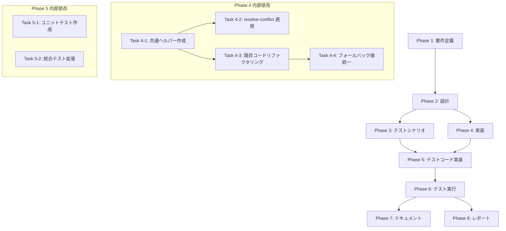

# プロジェクト計画書: Issue #749

## resolve-conflict コマンドの全フェーズで git user 設定が未実施のため CI 環境でコミットが失敗する

---

## 1. Issue分析

### 概要

`resolve-conflict` コマンド（init / analyze / execute）の各フェーズで `git commit` や `git merge` を実行する際、`user.name` および `user.email` の設定が行われていないため、Jenkins 等の CI 環境でコミットが失敗する。他のコマンド（`pr-comment` やメインワークフロー）では `ensureGitConfig()` や `git.addConfig()` で事前に Git ユーザー情報を設定しているが、`resolve-conflict` コマンドのみこの処理が欠落している。

### 複雑度: **簡単〜中程度**

- 影響範囲は `resolve-conflict` コマンドの3ファイル（init.ts / analyze.ts / execute.ts）が主対象
- 既存の `ensureGitConfig()` ロジック（`CommitManager` 内）を共通ヘルパーとして抽出する設計作業が含まれる
- フォールバック値（ユーザー名・メールアドレス）のプロジェクト全体統一も対応する
- 既存テストファイル（1,209行）への追加テストケース作成が必要

### 見積もり工数: **6〜10時間**

| 作業 | 見積もり |
|------|---------|
| 要件定義 | 0.5h |
| 設計（共通ヘルパー設計、統一方針決定） | 1h |
| テストシナリオ作成 | 0.5h |
| 共通ヘルパー関数の抽出・実装 | 1.5〜2h |
| resolve-conflict 3ファイルへの適用 | 1〜1.5h |
| テストコード実装 | 1.5〜2h |
| テスト実行・デバッグ | 0.5〜1h |
| ドキュメント・レポート | 0.5〜1h |
| **合計** | **6〜10h** |

### リスク評価: **低**

- 既に確立されたパターン（`CommitManager.ensureGitConfig()`）が存在し、それを再利用する方針
- 影響範囲が限定的（`resolve-conflict` コマンドの3ファイル + 共通ヘルパー1ファイル）
- 既存テストスイートでリグレッションを検出可能

---

## 2. 実装戦略判断

### 実装戦略: **EXTEND**

**判断根拠**:

- 新規モジュールの作成（CREATE）ではない。`ensureGitConfig()` のロジックは既に `CommitManager` クラス内に完成品として存在する（L528-568）
- 既存コードの構造改善（REFACTOR）が主目的でもない。主目的は `resolve-conflict` コマンドに欠落している機能を追加すること
- 既存の `CommitManager.ensureGitConfig()` から Git ユーザー設定ロジックをスタンドアロン関数として抽出し、`resolve-conflict` コマンドの3ファイルに適用する**機能追加（EXTEND）**が中心
- 追加として、`pr-comment` コマンドと `CommitManager` 間のフォールバック値（デフォルトユーザー名・メールアドレス）を統一する改善も含む

### テスト戦略: **UNIT_INTEGRATION**

**判断根拠**:

- **ユニットテスト**: 共通ヘルパー関数（`ensureGitConfig` のスタンドアロン版）の単体動作確認が必要。設定値の優先順位（環境変数 → フォールバック → デフォルト）、バリデーション（名前長、メール形式）のロジックをテストする
- **インテグレーションテスト**: `resolve-conflict` コマンドの各フェーズ（init / analyze / execute）が `git.commit()` / `git.merge()` 前に Git ユーザー設定を正しく呼び出すことを検証する必要がある。既存の統合テスト（`tests/integration/commands/resolve-conflict.test.ts`、1,209行・18テスト）に追加する
- **BDDテスト**: ユーザーストーリー中心のテストは不要（内部インフラの修正であり、エンドユーザーの操作フローに変更はない）

### テストコード戦略: **BOTH_TEST**

**判断根拠**:

- **EXTEND_TEST**: 既存の `tests/integration/commands/resolve-conflict.test.ts` に Git ユーザー設定の検証テストケースを追加する
- **CREATE_TEST**: 新規抽出する共通ヘルパー関数（`ensureGitUserConfig` 等）のユニットテストファイルを新規作成する。現在 `src/core/git/commit-manager.ts` 内の `ensureGitConfig()` に対する独立したユニットテストは存在しない

---

## 3. 影響範囲分析

### 既存コードへの影響

| ファイル | 変更種別 | 変更内容 |
|---------|---------|---------|
| `src/core/git/commit-manager.ts` | 修正 | `ensureGitConfig()` 内のロジックを新しいスタンドアロン関数に委譲するようリファクタリング |
| `src/core/git/git-config-helper.ts` | **新規作成** | Git ユーザー設定の共通ヘルパー関数を配置 |
| `src/commands/resolve-conflict/init.ts` | 修正 | `git.commit()` 前に共通ヘルパー関数を呼び出す処理を追加 |
| `src/commands/resolve-conflict/analyze.ts` | 修正 | `git.merge()` / `git.commit()` 前に共通ヘルパー関数を呼び出す処理を追加 |
| `src/commands/resolve-conflict/execute.ts` | 修正 | `git.commit()` 前に共通ヘルパー関数を呼び出す処理を追加 |
| `src/commands/pr-comment/init.ts` | 修正 | インライン Git 設定を共通ヘルパー関数に置き換え、フォールバック値を統一 |
| `src/commands/pr-comment/finalize.ts` | 修正 | インライン Git 設定（2箇所）を共通ヘルパー関数に置き換え、フォールバック値を統一 |

### テストファイルへの影響

| ファイル | 変更種別 | 変更内容 |
|---------|---------|---------|
| `tests/unit/core/git/git-config-helper.test.ts` | **新規作成** | 共通ヘルパー関数のユニットテスト |
| `tests/integration/commands/resolve-conflict.test.ts` | 修正 | Git ユーザー設定の呼び出し検証テストケース追加 |

### 依存関係の変更

- **新規依存の追加**: なし（既存の `simple-git` と `config` モジュールのみ使用）
- **既存依存の変更**: `CommitManager.ensureGitConfig()` が内部で新しいスタンドアロン関数を利用するように変更されるが、外部インターフェースは変更なし

### マイグレーション要否

- **データベーススキーマ変更**: なし
- **設定ファイル変更**: なし（既存の環境変数 `GIT_COMMIT_USER_NAME` / `GIT_COMMIT_USER_EMAIL` をそのまま使用）
- **Jenkins パイプライン変更**: 任意。`GIT_COMMIT_USER_NAME` / `GIT_COMMIT_USER_EMAIL` 環境変数を Jenkinsfile に明示的に追加することを推奨するが、必須ではない（コード側でフォールバック値が設定されるため）

### フォールバック値の統一方針

現状の不整合を解消し、プロジェクト全体で統一する：

| 項目 | CommitManager（現在） | pr-comment（現在） | **統一後** |
|------|----------------------|-------------------|-----------|
| ユーザー名 | `'AI Workflow'` | `'AI Workflow Bot'` | `'AI Workflow'` |
| メールアドレス | `'ai-workflow@tielec.local'` | `'ai-workflow@example.com'` | `'ai-workflow@tielec.local'` |

**理由**: `CommitManager` はプロジェクトの標準的な Git 操作モジュールであり、そのデフォルト値を正とする。共通ヘルパー関数にデフォルト値を定数として定義し、一元管理する。

---

## 4. タスク分割

### Phase 1: 要件定義 (見積もり: 0.5h)

- [ ] Task 1-1: 機能要件の明確化 (0.25h)
  - `resolve-conflict` コマンドの全フェーズ（init / analyze / execute）で Git ユーザー設定を適用する要件を定義
  - `git.commit()` および `git.merge()` の呼び出し箇所を特定・列挙
  - 設定値の優先順位（リポジトリローカル設定 → 環境変数 → フォールバック → デフォルト）を明文化
- [ ] Task 1-2: 非機能要件と受け入れ基準の定義 (0.25h)
  - Jenkins CI 環境での `resolve-conflict` コマンドのコミット成功を受け入れ基準として定義
  - フォールバック値のプロジェクト全体統一を非機能要件として定義
  - パフォーマンス要件: `ensureGitConfig()` の呼び出しが既存ワークフローの実行時間に影響しないこと

### Phase 2: 設計 (見積もり: 1h)

- [ ] Task 2-1: 共通ヘルパー関数の設計 (0.5h)
  - `src/core/git/git-config-helper.ts` のインターフェース設計（関数シグネチャ、パラメータ、戻り値）
  - デフォルト値定数（`DEFAULT_GIT_USER_NAME`, `DEFAULT_GIT_USER_EMAIL`）の定義
  - `CommitManager.ensureGitConfig()` からのロジック抽出方針を決定
  - バリデーションロジック（名前長 1-100文字、メール形式 `@` 含む）の移植方針を決定
- [ ] Task 2-2: 適用箇所のマッピングと統合設計 (0.5h)
  - `resolve-conflict` の3ファイルへの適用箇所を図示
  - `pr-comment` の3箇所（init.ts L75-81, finalize.ts L104-110, L203-208）のリファクタリング計画
  - `CommitManager.ensureGitConfig()` の委譲パターン設計

### Phase 3: テストシナリオ (見積もり: 0.5h)

- [x] Task 3-1: テストシナリオの策定 (0.5h)
  - 共通ヘルパー関数のユニットテストシナリオ: 設定値優先順位、バリデーション、デフォルト値適用
  - `resolve-conflict` 統合テストシナリオ: 各フェーズ（init / analyze / execute）で `git.addConfig` が呼び出されることの検証
  - 既存テストのリグレッションテストシナリオ: `CommitManager` の動作が変更後も同一であることの検証

### Phase 4: 実装 (見積もり: 2.5〜3.5h)

- [ ] Task 4-1: 共通ヘルパー関数の作成 (1〜1.5h)
  - `src/core/git/git-config-helper.ts` を新規作成
  - `ensureGitUserConfig(git: SimpleGit)` 関数を実装（`CommitManager.ensureGitConfig()` のロジックを抽出）
  - デフォルト値定数 `DEFAULT_GIT_USER_NAME = 'AI Workflow'` / `DEFAULT_GIT_USER_EMAIL = 'ai-workflow@tielec.local'` を定義
  - バリデーションロジック（名前長・メール形式）を移植
- [ ] Task 4-2: resolve-conflict コマンドへの適用 (0.5〜1h)
  - `src/commands/resolve-conflict/init.ts`: `git.commit()` 前に `ensureGitUserConfig()` を呼び出す処理を追加
  - `src/commands/resolve-conflict/analyze.ts`: `git.merge()` 前に `ensureGitUserConfig()` を呼び出す処理を追加
  - `src/commands/resolve-conflict/execute.ts`: `git.commit()`（2箇所）前に `ensureGitUserConfig()` を呼び出す処理を追加
- [ ] Task 4-3: 既存コードのリファクタリング (0.5〜1h)
  - `src/core/git/commit-manager.ts`: `ensureGitConfig()` メソッドが新しい共通ヘルパー関数に委譲するよう修正
  - `src/commands/pr-comment/init.ts`: インライン Git 設定を共通ヘルパー関数に置き換え
  - `src/commands/pr-comment/finalize.ts`: インライン Git 設定（2箇所）を共通ヘルパー関数に置き換え
- [ ] Task 4-4: フォールバック値の統一 (0.5h)
  - `pr-comment` で使用されていた `'AI Workflow Bot'` / `'ai-workflow@example.com'` を共通ヘルパー関数のデフォルト値 `'AI Workflow'` / `'ai-workflow@tielec.local'` に統一
  - 変更による影響がないことを確認

### Phase 5: テストコード実装 (見積もり: 1.5〜2h)

- [ ] Task 5-1: 共通ヘルパー関数のユニットテスト作成 (1〜1.5h)
  - `tests/unit/core/git/git-config-helper.test.ts` を新規作成
  - テストケース: 環境変数が設定されている場合の優先順位テスト
  - テストケース: 環境変数が未設定の場合のデフォルト値テスト
  - テストケース: 既存のリポジトリローカル設定が存在する場合のスキップ動作テスト
  - テストケース: バリデーション（名前長超過、メール形式不正）のフォールバックテスト
- [ ] Task 5-2: resolve-conflict 統合テストの拡張 (0.5h)
  - `tests/integration/commands/resolve-conflict.test.ts` に Git ユーザー設定検証テストを追加
  - テストケース: init フェーズで `git.addConfig('user.name', ...)` が呼び出されることを検証
  - テストケース: analyze フェーズで `git.addConfig` がマージ前に呼び出されることを検証
  - テストケース: execute フェーズで `git.addConfig` がコミット前に呼び出されることを検証

### Phase 6: テスト実行 (見積もり: 0.5〜1h)

- [ ] Task 6-1: テスト実行と品質検証 (0.5〜1h)
  - `npm run validate` による統合検証（TypeScript 型チェック + テスト + ビルド）
  - 新規テストの pass 確認
  - 既存テストのリグレッション確認（全18テスト + 新規テストが pass すること）
  - ビルド成果物（`dist/`）が正常に生成されることを確認

### Phase 7: ドキュメント (見積もり: 0.5h)

- [ ] Task 7-1: ドキュメント更新 (0.5h)
  - CLAUDE.md のコーディング規約セクションにGit ユーザー設定の共通ヘルパー利用規約を追記（必要に応じて）
  - 変更の影響を受けるドキュメントの確認と更新

### Phase 8: レポート (見積もり: 0.5h)

- [ ] Task 8-1: 変更サマリーの作成 (0.5h)
  - 実装内容のサマリー（変更ファイル一覧、新規作成ファイル一覧）
  - テスト結果のサマリー
  - フォールバック値統一の影響範囲の記録

---

## 5. 依存関係

### タスク間の依存関係詳細

| タスク | 前提タスク | 理由 |
|--------|-----------|------|
| Task 4-1 | Task 2-1 | 設計に基づいて共通ヘルパーを実装 |
| Task 4-2 | Task 4-1 | 共通ヘルパー関数が完成してから適用 |
| Task 4-3 | Task 4-1 | 共通ヘルパー関数が完成してからリファクタリング |
| Task 4-4 | Task 4-3 | リファクタリング完了後にフォールバック値を統一 |
| Task 5-1 | Task 4-1 | 共通ヘルパー関数が存在しないとテスト作成不可 |
| Task 5-2 | Task 4-2 | resolve-conflict への適用完了後にテスト作成 |
| Task 6-1 | Task 5-1, Task 5-2 | すべてのテストが実装されてから実行 |

---

## 6. リスクと軽減策

### リスク1: CommitManager.ensureGitConfig() のリファクタリングによるリグレッション

- **影響度**: 中
- **確率**: 低
- **軽減策**:
  - `CommitManager.ensureGitConfig()` の外部インターフェースは変更しない（内部で新しい共通ヘルパー関数に委譲するのみ）
  - 既存の統合テスト（`resolve-conflict.test.ts` の18テスト）と `npm run validate` でリグレッションを検出
  - リファクタリング前後で `CommitManager` の動作が同一であることをテストで保証

### リスク2: フォールバック値統一による pr-comment コマンドの動作変更

- **影響度**: 低
- **確率**: 低
- **軽減策**:
  - フォールバック値の変更（`'AI Workflow Bot'` → `'AI Workflow'`, `'ai-workflow@example.com'` → `'ai-workflow@tielec.local'`）は、環境変数が設定されている場合は影響なし
  - CI 環境では通常 `GIT_COMMIT_USER_NAME` / `GIT_COMMIT_USER_EMAIL` が設定されているため、デフォルト値が使用されるケースは稀
  - 変更後に `pr-comment` の既存テストが pass することを確認

### リスク3: resolve-conflict テストのモック構造との不整合

- **影響度**: 中
- **確率**: 中
- **軽減策**:
  - 既存テストは `simple-git` をモックしているため、`git.addConfig()` の呼び出しをモック側で受け入れる設定が必要
  - モックオブジェクトに `addConfig` メソッドを追加し、呼び出し回数と引数を検証するテストを作成
  - 既存テストの `beforeEach` で `addConfig` モックを追加する際、他のテストに影響しないよう `afterEach` で `jest.restoreAllMocks()` を確実に実行

### リスク4: git.listConfig() の呼び出しによるパフォーマンス影響

- **影響度**: 低
- **確率**: 低
- **軽減策**:
  - `ensureGitUserConfig()` は各フェーズの開始時に1回のみ呼び出す設計とし、`git.commit()` の直前ではなくフェーズのエントリポイントで実行
  - `git.listConfig()` は軽量な操作であり、パフォーマンスへの影響は無視できるレベル

---

## 7. 品質ゲート

### Phase 1: 要件定義
- [ ] 機能要件が明確に記載されている（Git ユーザー設定の適用対象ファイル・行番号が特定されている）
- [ ] 受け入れ基準が定義されている（Jenkins CI 環境でのコミット成功、フォールバック値の統一）
- [ ] 設定値の優先順位が明文化されている

### Phase 2: 設計
- [x] 実装戦略の判断根拠が明記されている（EXTEND）
- [x] テスト戦略の判断根拠が明記されている（UNIT_INTEGRATION）
- [x] テストコード戦略の判断根拠が明記されている（BOTH_TEST）
- [x] 共通ヘルパー関数のインターフェース設計が完了している
- [x] 適用箇所のマッピングが完了している

### Phase 3: テストシナリオ
- [ ] 共通ヘルパー関数のユニットテストシナリオが定義されている
- [ ] resolve-conflict 統合テストシナリオが定義されている
- [ ] リグレッションテストシナリオが定義されている

### Phase 4: 実装
- [ ] `src/core/git/git-config-helper.ts` が作成されている
- [ ] `resolve-conflict` の3ファイル（init.ts / analyze.ts / execute.ts）に Git ユーザー設定処理が追加されている
- [ ] `CommitManager.ensureGitConfig()` が共通ヘルパー関数に委譲している
- [ ] `pr-comment` のインライン設定が共通ヘルパー関数に置き換えられている
- [ ] フォールバック値がプロジェクト全体で統一されている
- [ ] `npm run lint` が pass する

### Phase 5: テストコード実装
- [ ] 共通ヘルパー関数のユニットテストが作成されている
- [ ] resolve-conflict 統合テストに Git 設定検証テストケースが追加されている
- [ ] テストが実行可能な状態である

### Phase 6: テスト実行
- [ ] `npm run validate` が pass する（lint + test + build）
- [ ] 新規テストがすべて pass する
- [ ] 既存テスト（18テスト）にリグレッションがない
- [ ] ビルド成果物（`dist/`）が正常に生成される

### Phase 7: ドキュメント
- [ ] 変更に関連するドキュメントが更新されている
- [ ] 共通ヘルパー関数の使用方法が記載されている（コード内コメントまたはドキュメント）

### Phase 8: レポート
- [ ] 変更ファイル一覧が記載されている
- [ ] テスト結果サマリーが記載されている
- [ ] マージチェックリストが完成している

---

## 参考情報

### 対象ファイル一覧

#### 修正対象ファイル
| ファイル | 現在の行数 | 変更内容 |
|---------|-----------|---------|
| `src/commands/resolve-conflict/init.ts` | 60行 | L48 の `git.commit()` 前に `ensureGitUserConfig()` 呼び出し追加 |
| `src/commands/resolve-conflict/analyze.ts` | 181行 | L88 の `git.merge()` 前、L169 の `git.commit()` 前に `ensureGitUserConfig()` 呼び出し追加 |
| `src/commands/resolve-conflict/execute.ts` | 151行 | L128, L139 の `git.commit()` 前に `ensureGitUserConfig()` 呼び出し追加 |
| `src/core/git/commit-manager.ts` | 705行 | `ensureGitConfig()` メソッドが共通ヘルパー関数に委譲するよう修正 |
| `src/commands/pr-comment/init.ts` | 317行 | L75-81 のインライン Git 設定を共通ヘルパー関数に置き換え |
| `src/commands/pr-comment/finalize.ts` | 315行 | L104-110, L203-208 のインライン Git 設定（2箇所）を共通ヘルパー関数に置き換え |

#### 新規作成ファイル
| ファイル | 役割 |
|---------|------|
| `src/core/git/git-config-helper.ts` | Git ユーザー設定の共通ヘルパー関数 |
| `tests/unit/core/git/git-config-helper.test.ts` | 共通ヘルパー関数のユニットテスト |

#### 修正対象テストファイル
| ファイル | 現在の行数 | 変更内容 |
|---------|-----------|---------|
| `tests/integration/commands/resolve-conflict.test.ts` | 1,209行 | Git ユーザー設定検証テストケース追加 |

### 参考ファイル（既存の正しい実装）
- `src/core/git/commit-manager.ts` L528-568: `ensureGitConfig()` メソッド
- `src/commands/pr-comment/init.ts` L75-81: Git 設定のインライン実装
- `src/commands/pr-comment/finalize.ts` L104-110, L203-208: Git 設定のインライン実装
- `src/core/config.ts` L310-318: `getGitCommitUserName()` / `getGitCommitUserEmail()`

### Git ユーザー設定の現状比較

| コマンド | 設定方法 | デフォルト名 | デフォルトメール | 状態 |
|---------|---------|-------------|-----------------|------|
| メインワークフロー | `CommitManager.ensureGitConfig()` | `'AI Workflow'` | `'ai-workflow@tielec.local'` | ✅ 正常 |
| `pr-comment` (init) | インライン `git.addConfig()` | `'AI Workflow Bot'` | `'ai-workflow@example.com'` | ✅ 正常（値不統一） |
| `pr-comment` (finalize) | インライン `git.addConfig()`（2箇所） | `'AI Workflow Bot'` | `'ai-workflow@example.com'` | ✅ 正常（値不統一） |
| `resolve-conflict` (全フェーズ) | **設定処理なし** | — | — | ❌ エラー |
