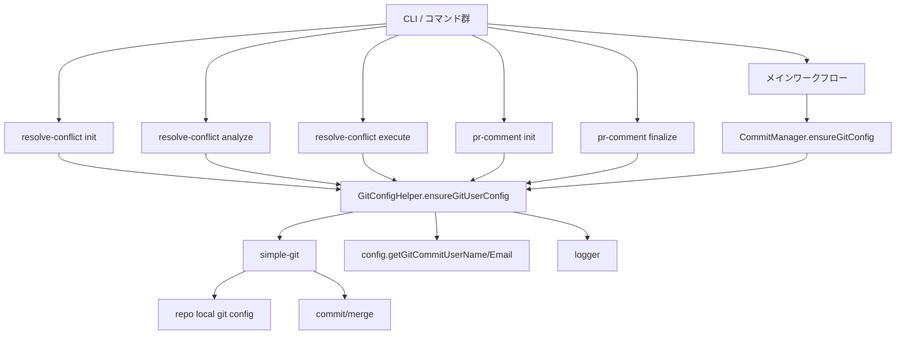
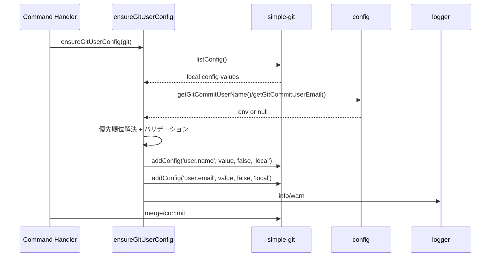

# 詳細設計書: Issue #749

## 1. アーキテクチャ設計

### 1.1 システム全体図

### 1.2 コンポーネント間の関係

- `resolve-conflict` の各フェーズは `simple-git` を直接利用し、Git ユーザー設定の共通ヘルパー（新規）を呼び出す。
- `CommitManager.ensureGitConfig()` は既存の外部 API を維持しつつ、内部処理を共通ヘルパーへ委譲する。
- `pr-comment` のインライン設定は共通ヘルパーへ置換する。
- すべての Git ユーザー設定は `config` と `logger` を利用し、`process.env` への直接アクセスは行わない。

### 1.3 データフロー

---

## 2. 実装戦略判断

### 実装戦略: EXTEND

**判断根拠**:
- 既存の `CommitManager.ensureGitConfig()` のロジックを共通化し、既存コマンドへ適用する拡張が主目的。
- 既存ファイルの修正が中心で、新規作成はヘルパーとユニットテストの最小限。
- リファクタリングは副次的で、外部 API を変えずに機能欠落を補う。

---

## 3. テスト戦略判断

### テスト戦略: UNIT_INTEGRATION

**判断根拠**:
- 共通ヘルパーの優先順位・バリデーション・ログ出力はユニットテストで検証が必要。
- `resolve-conflict` の各フェーズで `merge/commit` 前に設定が適用されることは統合テストで検証が必要。

---

## 4. テストコード戦略判断

### テストコード戦略: BOTH_TEST

**判断根拠**:
- 共通ヘルパーのユニットテストは新規ファイル作成が必要。
- `resolve-conflict` の統合テストは既存ファイルの拡張で対応可能。

---

## 5. 影響範囲分析

### 5.1 既存コードへの影響

- `resolve-conflict` の 3 フェーズに Git ユーザー設定の事前適用を追加。
- `CommitManager.ensureGitConfig()` は共通ヘルパーへ委譲するが、外部 API 互換を維持。
- `pr-comment` のインライン設定を共通ヘルパーに置換し、デフォルト値を統一。

### 5.2 依存関係の変更

- 新規外部依存の追加はなし。
- 内部依存として `src/core/git/git-config-helper.ts` が追加され、各コマンドから参照。

### 5.3 マイグレーション要否

- データ移行なし。
- 設定変更なし（環境変数は既存の `GIT_COMMIT_USER_NAME` / `GIT_COMMIT_USER_EMAIL` を使用）。
- Jenkinsfile への環境変数追加は任意（スコープ外）。

---

## 6. 変更・追加ファイルリスト

### 6.1 新規作成ファイル

- `src/core/git/git-config-helper.ts`
- `tests/unit/core/git/git-config-helper.test.ts`

### 6.2 修正が必要な既存ファイル

- `src/commands/resolve-conflict/init.ts`
- `src/commands/resolve-conflict/analyze.ts`
- `src/commands/resolve-conflict/execute.ts`
- `src/core/git/commit-manager.ts`
- `src/commands/pr-comment/init.ts`
- `src/commands/pr-comment/finalize.ts`
- `tests/integration/commands/resolve-conflict.test.ts`

### 6.3 削除が必要なファイル

- なし

---

## 7. 詳細設計

### 7.1 クラス設計

- 既存のクラス設計は維持し、`CommitManager.ensureGitConfig()` のみ内部委譲に変更。
- 新規にクラスは導入しない（関数ベースのヘルパー）。

### 7.2 関数設計

#### 7.2.1 `ensureGitUserConfig`

- 配置: `src/core/git/git-config-helper.ts`
- シグネチャ: `ensureGitUserConfig(git: SimpleGit): Promise<void>`
- 公開定数:
  - `DEFAULT_GIT_USER_NAME = 'AI Workflow'`
  - `DEFAULT_GIT_USER_EMAIL = 'ai-workflow@tielec.local'`

**処理フロー**:
1. `git.listConfig()` でローカル設定の `user.name` / `user.email` を取得。
2. ローカル設定がある場合はそれを優先。
3. ない場合は `config.getGitCommitUserName()` / `config.getGitCommitUserEmail()` を取得。
4. フォールバックとして `config.getGitAuthorName()` / `config.getGitAuthorEmail()` を使用。（既存 `CommitManager.ensureGitConfig()` に合わせる）
5. バリデーション:
   - ユーザー名 1〜100 文字外は警告しデフォルトへ。
   - メールに `@` がなければ警告しデフォルトへ。
6. `git.addConfig('user.name', value, false, 'local')` と `git.addConfig('user.email', value, false, 'local')` を設定。
7. `logger.info()` で設定値をログ出力。
8. 例外発生時は `logger.warn()` し、呼び出し元でワークフロー継続できるようにする（NFR-3.1）。

**エラーハンドリング**:
- `catch (error: unknown)` で `getErrorMessage(error)` を利用し警告ログ。
- エラーは再スローしない（要求仕様によりワークフロー中断を避ける）。

**依存**:
- `SimpleGit`（既存）
- `config`（環境変数アクセス規約準拠）
- `logger`（ロギング規約準拠）
- `error-utils`（エラーハンドリング規約準拠）

#### 7.2.2 `CommitManager.ensureGitConfig`

- 既存 API を維持し、内部で `ensureGitUserConfig(this.git)` を呼び出す。
- 既存の追加ロジック（必要であれば）を維持し、挙動を一致させる。

#### 7.2.3 resolve-conflict 各フェーズへの適用

- `init.ts` / `analyze.ts` / `execute.ts` のフェーズ開始直後に `ensureGitUserConfig(git)` を 1 回だけ呼び出す。
- `analyze.ts` は `merge --no-commit` 前に 1 回呼び出し、同フェーズ内の `commit` をカバーする。

#### 7.2.4 pr-comment への適用

- `init.ts` / `finalize.ts` のインライン設定を削除し、共通ヘルパー呼び出しに置換。
- デフォルト値は共通ヘルパーの定数に統一。

### 7.3 データ構造設計

- 新規データ構造追加なし。
- 既存の `config` 経由の設定値取得を利用。

### 7.4 インターフェース設計

- `ensureGitUserConfig(git: SimpleGit): Promise<void>` を新規公開。
- `CommitManager.ensureGitConfig()` のシグネチャは変更しない。

### 7.5 要件トレーサビリティ

| 要件ID | 設計要素 | 備考 |
|---|---|---|
| FR-1 | `git-config-helper.ts` / `ensureGitUserConfig` | 優先順位・バリデーション・ログ出力を実装 |
| FR-2 | `resolve-conflict/init.ts` | `commit` 前の適用 |
| FR-3 | `resolve-conflict/analyze.ts` | `merge` 前の適用（1回で両方カバー） |
| FR-4 | `resolve-conflict/execute.ts` | 複数 `commit` 前に1回適用 |
| FR-5 | `commit-manager.ts` | 共通ヘルパーへ委譲 |
| FR-6 | `pr-comment/init.ts` / `pr-comment/finalize.ts` | インライン設定置換 |
| FR-7 | `git-config-helper.ts` 定数 | デフォルト値統一 |

---

## 8. セキュリティ考慮事項

- `process.env` 直接アクセス禁止（`config` 経由）。
- ログ出力はユーザー名/メールのみ。トークン等の機密情報を含めない。
- Git 設定は `local` スコープのみ。`global` は使用しない。
- エラーハンドリングは `error-utils` を使用し型アサーションを回避。

---

## 9. 非機能要件への対応

### 9.1 パフォーマンス

- 各フェーズで `ensureGitUserConfig()` は 1 回のみ呼び出し。
- `git.listConfig()` + `git.addConfig()` のみで軽量。

### 9.2 スケーラビリティ

- 共通ヘルパーにより将来のコマンド追加時の適用が容易。

### 9.3 保守性

- Git ユーザー設定ロジックを 1 箇所に集約。
- デフォルト値の統一により挙動が一貫。

---

## 10. 実装の順序

1. `src/core/git/git-config-helper.ts` の新規作成（定数 + `ensureGitUserConfig`）。
2. `CommitManager.ensureGitConfig()` を共通ヘルパーへ委譲。
3. `resolve-conflict` 3 フェーズに共通ヘルパー適用。
4. `pr-comment` のインライン設定を置換。
5. ユニットテスト新規作成。
6. 統合テスト拡張。
7. `npm run validate` 実行。

---

## 11. テスト設計（概要）

### 11.1 ユニットテスト

- 既存ローカル設定がある場合の優先。
- 環境変数の優先順位（commit → author → default）。
- バリデーション（名前長 / メール形式）でデフォルトへフォールバック。
- `addConfig` の引数検証と `logger` 出力検証。

### 11.2 統合テスト

- `resolve-conflict` の各フェーズで `addConfig` が `commit/merge` 前に呼ばれること。
- エラー時にもワークフローが継続すること（NFR-3.1）。

---

## 12. 品質ゲートチェック

- [x] 実装戦略の判断根拠が明記されている
- [x] テスト戦略の判断根拠が明記されている
- [x] 既存コードへの影響範囲が分析されている
- [x] 変更が必要なファイルがリストアップされている
- [x] 設計が実装可能である
