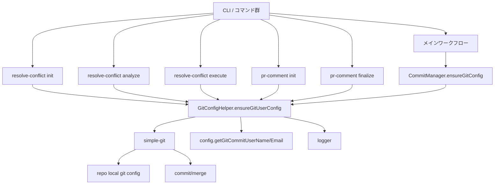
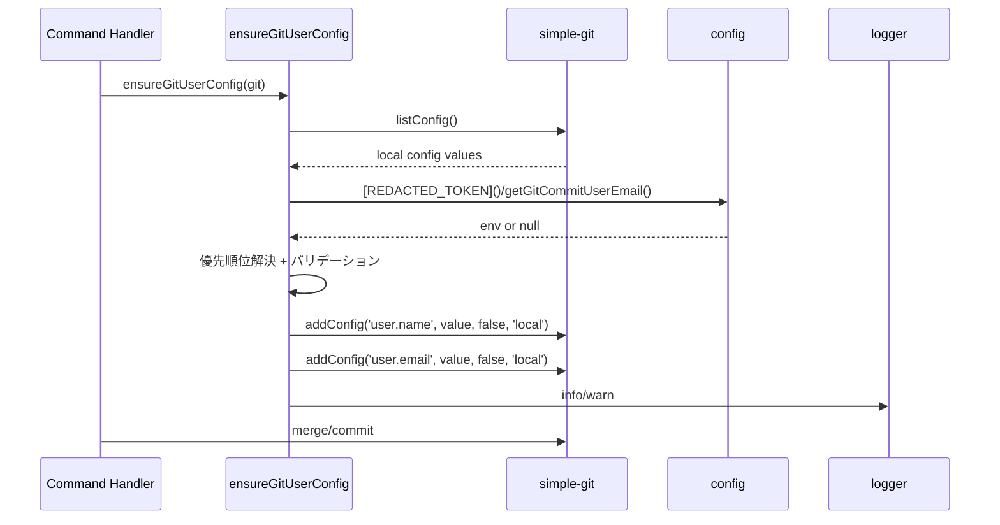

# Codex Agent 実行ログ

開始日時: 2026/2/21 9:46:43

---

## Turn 1: スレッド開始

**Thread ID**: `[REDACTED_TOKEN]`

## Turn 2: ツール実行

**種別**: reasoning
**ステータス**: completed

## Turn 3: ツール実行

**種別**: コマンド実行
**コマンド**: `/bin/bash -lc ls`
**ステータス**: completed (exit_code=0)

```text
AGENT_TEAMS.md
CHANGELOG.md
CLAUDE.md
[REDACTED_TOKEN].md
[REDACTED_TOKEN].md
[REDACTED_TOKEN].md
[REDACTED_TOKEN].md
CODEBASE_SUMMARY.md
Dockerfile
Jenkinsfile
LICENSE
PROGRESS.md
README.md
TROUBLESHOOTING.md
__mocks__
docs
examples
jenkins
jest.config.cjs
metadata.json.template
package-lock.json
package.json
scripts
src
tests
tmp
tsconfig.json
tsconfig.test.json
```

## Turn 4: ツール実行

**種別**: コマンド実行
**コマンド**: `/bin/bash -lc 'cat /tmp/ai-workflow-repos-36-22f1311d/ai-workflow-agent/.ai-workflow/issue-749/00_planning/output/planning.md'`
**ステータス**: completed (exit_code=0)

```text
# プロジェクト計画書: Issue #749

## resolve-conflict コマンドの全フェーズで git user 設定が未実施のため CI 環境でコミットが失敗する

---

## 1. Issue分析

### 概要

`resolve-conflict` コマンド（init / analyze / execute）の各フェーズで `git commit` や `git merge` を実行する際、`user.name` および `user.email` の設定が行われていないため、Jenkins 等の CI 環境でコミットが失敗する。他のコマンド（`pr-comment` やメインワークフロー）では `ensureGitConfig()` や `git.addConfig()` で事前に Git ユーザー情報を設定しているが、`resolve-conflict` コマンドのみこの処理が欠落している。

### 複雑度: **簡単〜中程度**

- 影響範囲は `resolve-conflict` コマンドの3ファイル（init.ts / analyze.ts / execute.ts）が主対象
- 既存の `ensureGitConfig()` ロジック（`CommitManager` 内）を共通ヘルパーとして抽出する設計作業が含まれる
- フォールバック値（ユーザー名・メールアドレス）のプロジェクト全体統一も対応する
- 既存テストファイル（1,209行）への追加テストケース作成が必要

### 見積もり工数: **6〜10時間**

| 作業 | 見積もり |
|------|---------|
| 要件定義 | 0.5h |
| 設計（共通ヘルパー設計、統一方針決定） | 1h |
| テストシナリオ作成 | 0.5h |
| 共通ヘルパー関数の抽出・実装 | 1.5〜2h |
| resolve-conflict 3ファイルへの適用 | 1〜1.5h |
| テストコード実装 | 1.5〜2h |
| テスト実行・デバッグ | 0.5〜1h |
| ドキュメント・レポート | 0.5〜1h |
| **合計** | **6〜10h** |

### リスク評価: **低**

- 既に確立されたパターン（`CommitManager.ensureGitConfig()`）が存在し、それを再利用する方針
- 影響範囲が限定的（`resolve-conflict` コマンドの3ファイル + 共通ヘルパー1ファイル）
- 既存テストスイートでリグレッションを検出可能

---

## 2. 実装戦略判断

### 実装戦略: **EXTEND**

**判断根拠**:

- 新規モジュールの作成（CREATE）ではない。`ensureGitConfig()` のロジックは既に `CommitManager` クラス内に完成品として存在する（L528-568）
- 既存コードの構造改善（REFACTOR）が主目的でもない。主目的は `resolve-conflict` コマンドに欠落している機能を追加すること
- 既存の `CommitManager.ensureGitConfig()` から Git ユーザー設定ロジックをスタンドアロン関数として抽出し、`resolve-conflict` コマンドの3ファイルに適用する**機能追加（EXTEND）**が中心
- 追加として、`pr-comment` コマンドと `CommitManager` 間のフォールバック値（デフォルトユーザー名・メールアドレス）を統一する改善も含む

### テスト戦略: **UNIT_INTEGRATION**

**判断根拠**:

- **ユニットテスト**: 共通ヘルパー関数（`ensureGitConfig` のスタンドアロン版）の単体動作確認が必要。設定値の優先順位（環境変数 → フォールバック → デフォルト）、バリデーション（名前長、メール形式）のロジックをテストする
- **インテグレーションテスト**: `resolve-conflict` コマンドの各フェーズ（init / analyze / execute）が `git.commit()` / `git.merge()` 前に Git ユーザー設定を正しく呼び出すことを検証する必要がある。既存の統合テスト（`tests/integration/commands/resolve-conflict.test.ts`、1,209行・18テスト）に追加する
- **BDDテスト**: ユーザーストーリー中心のテストは不要（内部インフラの修正であり、エンドユーザーの操作フローに変更はない）

### テストコード戦略: **BOTH_TEST**

**判断根拠**:

- **EXTEND_TEST**: 既存の `tests/integration/commands/resolve-conflict.test.ts` に Git ユーザー設定の検証テストケースを追加する
- **CREATE_TEST**: 新規抽出する共通ヘルパー関数（`ensureGitUserConfig` 等）のユニットテストファイルを新規作成する。現在 `src/core/git/commit-manager.ts` 内の `ensureGitConfig()` に対する独立したユニットテストは存在しない

---

## 3. 影響範囲分析

### 既存コードへの影響

| ファイル | 変更種別 | 変更内容 |
|---------|---------|---------|
| `src/core/git/commit-manager.ts` | 修正 | `ensureGitConfig()` 内のロジックを新しいスタンドアロン関数に委譲するようリファクタリング |
| `src/core/git/git-config-helper.ts` | **新規作成** | Git ユーザー設定の共通ヘルパー関数を配置 |
| `src/commands/resolve-conflict/init.ts` | 修正 | `git.commit()` 前に共通ヘルパー関数を呼び出す処理を追加 |
| `src/commands/resolve-conflict/analyze.ts` | 修正 | `git.merge()` / `git.commit()` 前に共通ヘルパー関数を呼び出す処理を追加 |
| `src/commands/resolve-conflict/execute.ts` | 修正 | `git.commit()` 前に共通ヘルパー関数を呼び出す処理を追加 |
| `src/commands/pr-comment/init.ts` | 修正 | インライン Git 設定を共通ヘルパー関数に置き換え、フォールバック値を統一 |
| `src/commands/pr-comment/finalize.ts` | 修正 | インライン Git 設定（2箇所）を共通ヘルパー関数に置き換え、フォールバック値を統一 |

### テストファイルへの影響

| ファイル | 変更種別 | 変更内容 |
|---------|---------|---------|
| `tests/unit/core/git/git-config-helper.test.ts` | **新規作成** | 共通ヘルパー関数のユニットテスト |
| `tests/integration/commands/resolve-conflict.test.ts` | 修正 | Git ユーザー設定の呼び出し検証テストケース追加 |

### 依存関係の変更

- **新規依存の追加**: なし（既存の `simple-git` と `config` モジュールのみ使用）
- **既存依存の変更**: `CommitManager.ensureGitConfig()` が内部で新しいスタンドアロン関数を利用するように変更されるが、外部インターフェースは変更なし

### マイグレーション要否

- **データベーススキーマ変更**: なし
- **設定ファイル変更**: なし（既存の環境変数 `[REDACTED_TOKEN]` / `[REDACTED_TOKEN]` をそのまま使用）
- **Jenkins パイプライン変更**: 任意。`[REDACTED_TOKEN]` / `[REDACTED_TOKEN]` 環境変数を Jenkinsfile に明示的に追加することを推奨するが、必須ではない（コード側でフォールバック値が設定されるため）

### フォールバック値の統一方針

現状の不整合を解消し、プロジェクト全体で統一する：

| 項目 | CommitManager（現在） | pr-comment（現在） | **統一後** |
|------|----------------------|-------------------|-----------|
| ユーザー名 | `'AI Workflow'` | `'AI Workflow Bot'` | `'AI Workflow'` |
| メールアドレス | `'[REDACTED_EMAIL]'` |
... (truncated)
```

## Turn 5: ツール実行

**種別**: コマンド実行
**コマンド**: `/bin/bash -lc 'cat /tmp/ai-workflow-repos-36-22f1311d/ai-workflow-agent/.ai-workflow/issue-749/01_requirements/output/requirements.md'`
**ステータス**: completed (exit_code=0)

```text
# 要件定義書: Issue #749

## resolve-conflict コマンドの全フェーズで git user 設定が未実施のため CI 環境でコミットが失敗する

---

## 0. Planning Document の確認

### 開発計画の全体像

Planning Phase（`planning.md`）にて以下の戦略が策定済み：

- **実装戦略**: EXTEND（既存の `CommitManager.ensureGitConfig()` からロジックを抽出し、共通ヘルパー関数として `resolve-conflict` コマンドに適用）
- **テスト戦略**: UNIT_INTEGRATION（共通ヘルパー関数のユニットテスト + `resolve-conflict` 統合テストの拡張）
- **テストコード戦略**: BOTH_TEST（新規ユニットテスト作成 + 既存統合テスト拡張）
- **複雑度**: 簡単〜中程度（見積もり工数 6〜10 時間）
- **リスク評価**: 低（既存パターンの再利用、限定的な影響範囲）

### Planning Document で策定された主要方針

1. `src/core/git/git-config-helper.ts` を新規作成し、`ensureGitUserConfig()` をスタンドアロン関数として実装
2. `resolve-conflict` の 3 ファイル（init.ts / analyze.ts / execute.ts）に適用
3. `CommitManager.ensureGitConfig()` を新しい共通ヘルパー関数に委譲するようリファクタリング
4. `pr-comment` のインライン Git 設定を共通ヘルパー関数に置き換え
5. フォールバック値（ユーザー名・メールアドレス）をプロジェクト全体で統一

本要件定義書は上記方針を踏まえて策定する。

---

## 1. 概要

### 背景

`resolve-conflict` コマンドは PR のマージコンフリクトを AI で分析・解消するためのコマンドであり、init / analyze / execute / finalize の 4 フェーズで構成される。このうち init / analyze / execute の 3 フェーズでは `simpleGit()` を直接使用して `git.commit()` や `git.merge()` を実行するが、Git ユーザー情報（`user.name` / `user.email`）の事前設定が行われていない。

Jenkins 等の CI 環境ではグローバルな Git ユーザー設定が存在しないため、`resolve-conflict` コマンド実行時に以下のエラーが発生し、コミットおよびマージ操作が失敗する：

```
fatal: unable to auto-detect email address (got 'node@f40376951cc1.(none)')
```

### 目的

1. `resolve-conflict` コマンドの全フェーズ（init / analyze / execute）で Git ユーザー設定を適用し、CI 環境でのコミット・マージ操作を成功させる
2. Git ユーザー設定ロジックを共通ヘルパー関数として抽出し、プロジェクト全体で再利用可能にする
3. フォールバック値（デフォルトユーザー名・メールアドレス）をプロジェクト全体で統一する

### ビジネス価値

- **CI/CD パイプラインの安定化**: Jenkins 環境で `resolve-conflict` ジョブが正常に完了するようになり、PR のマージコンフリクト自動解消ワークフローが実用化される
- **運用コストの削減**: 手動でのコンフリクト解消や Jenkins ジョブの再設定が不要になる

### 技術的価値

- **コードの DRY 原則**: Git ユーザー設定ロジックが 1 箇所に集約され、保守性が向上する
- **統一されたデフォルト値**: プロジェクト全体で Git コミッター情報が一貫し、コミット履歴の追跡が容易になる
- **将来の拡張性**: 新しいコマンドを追加する際に、共通ヘルパー関数を呼び出すだけで Git ユーザー設定が完了する

---

## 2. 機能要件

### FR-1: Git ユーザー設定の共通ヘルパー関数の作成（優先度: 高）

**概要**: `src/core/git/git-config-helper.ts` に `ensureGitUserConfig()` 関数を新規作成する。

**詳細要件**:

| ID | 要件 | 検証方法 |
|----|------|----------|
| FR-1.1 | `ensureGitUserConfig(git: SimpleGit): Promise<void>` のシグネチャで関数を提供する | ユニットテストで関数呼び出しが成功することを確認 |
| FR-1.2 | 設定値の優先順位を以下の順序で解決する: (1) リポジトリローカルの既存 git config → (2) 環境変数 `[REDACTED_TOKEN]` / `[REDACTED_TOKEN]` → (3) フォールバック環境変数 `GIT_AUTHOR_NAME` / `GIT_AUTHOR_EMAIL` → (4) デフォルト値 | ユニットテストで各優先順位の動作を検証 |
| FR-1.3 | デフォルト値として `[REDACTED_TOKEN] = 'AI Workflow'` と `[REDACTED_TOKEN] = '[REDACTED_EMAIL]'` を定数としてエクスポートする | ユニットテストでデフォルト値の適用を検証 |
| FR-1.4 | ユーザー名の長さが 1〜100 文字の範囲外の場合、警告ログを出力しデフォルト値にフォールバックする | ユニットテストでバリデーション動作を検証 |
| FR-1.5 | メールアドレスに `@` が含まれない場合、警告ログを出力しデフォルト値にフォールバックする | ユニットテストでバリデーション動作を検証 |
| FR-1.6 | `git.addConfig('user.name', ..., false, 'local')` および `git.addConfig('user.email', ..., false, 'local')` を使用してリポジトリローカルに設定する | ユニットテストで `addConfig` の呼び出し引数を検証 |
| FR-1.7 | 設定完了後に `logger.info()` で設定されたユーザー名・メールアドレスをログ出力する | ユニットテストでログ出力を検証 |
| FR-1.8 | 環境変数の取得には `config.[REDACTED_TOKEN]()` / `config.[REDACTED_TOKEN]()` を使用する（`process.env` 直接アクセス禁止） | コードレビューで確認 |

### FR-2: resolve-conflict init フェーズへの Git ユーザー設定追加（優先度: 高）

**概要**: `src/commands/resolve-conflict/init.ts` の `git.commit()` 呼び出し前に `ensureGitUserConfig()` を追加する。

**詳細要件**:

| ID | 要件 | 検証方法 |
|----|------|----------|
| FR-2.1 | L48 の `git.commit()` 実行前に `ensureGitUserConfig(git)` を呼び出す | 統合テストで `addConfig` が `commit` 前に呼び出されることを検証 |
| FR-2.2 | `ensureGitUserConfig()` の呼び出しはフェーズの早期段階（`git.commit()` の直前ではなくエントリポイント付近）で実行する | コードレビューで呼び出し位置を確認 |
| FR-2.3 | `ensureGitUserConfig()` がエラーを発生させた場合でも、ワークフロー全体は中断しない（フォールト・トレランス） | 統合テストでエラー時の継続動作を検証 |

### FR-3: resolve-conflict analyze フェーズへの Git ユーザー設定追加（優先度: 高）

**概要**: `src/commands/resolve-conflict/analyze.ts` の `git.merge()` および `git.commit()` 呼び出し前に `ensureGitUserConfig()` を追加する。

**詳細要件**:

| ID | 要件 | 検証方法 |
|----|------|----------|
| FR-3.1 | L88 の `git.raw(['merge', '--no-commit', '--no-ff', ...])` 実行前に `ensureG
... (truncated)
```

## Turn 6: ツール実行

**種別**: コマンド実行
**コマンド**: `/bin/bash -lc 'cat /tmp/ai-workflow-repos-36-22f1311d/ai-workflow-agent/.ai-workflow/issue-749/02_design/output/design.md'`
**ステータス**: completed (exit_code=0)

```text
# 詳細設計書: Issue #749

## 1. アーキテクチャ設計

### 1.1 システム全体図



### 1.2 コンポーネント間の関係

- `resolve-conflict` の各フェーズは `simple-git` を直接利用し、Git ユーザー設定の共通ヘルパー（新規）を呼び出す。
- `CommitManager.ensureGitConfig()` は既存の外部 API を維持しつつ、内部処理を共通ヘルパーへ委譲する。
- `pr-comment` のインライン設定は共通ヘルパーへ置換する。
- すべての Git ユーザー設定は `config` と `logger` を利用し、`process.env` への直接アクセスは行わない。

### 1.3 データフロー



---

## 2. 実装戦略判断

### 実装戦略: EXTEND

**判断根拠**:
- 既存の `CommitManager.ensureGitConfig()` のロジックを共通化し、既存コマンドへ適用する拡張が主目的。
- 既存ファイルの修正が中心で、新規作成はヘルパーとユニットテストの最小限。
- リファクタリングは副次的で、外部 API を変えずに機能欠落を補う。

---

## 3. テスト戦略判断

### テスト戦略: UNIT_INTEGRATION

**判断根拠**:
- 共通ヘルパーの優先順位・バリデーション・ログ出力はユニットテストで検証が必要。
- `resolve-conflict` の各フェーズで `merge/commit` 前に設定が適用されることは統合テストで検証が必要。

---

## 4. テストコード戦略判断

### テストコード戦略: BOTH_TEST

**判断根拠**:
- 共通ヘルパーのユニットテストは新規ファイル作成が必要。
- `resolve-conflict` の統合テストは既存ファイルの拡張で対応可能。

---

## 5. 影響範囲分析

### 5.1 既存コードへの影響

- `resolve-conflict` の 3 フェーズに Git ユーザー設定の事前適用を追加。
- `CommitManager.ensureGitConfig()` は共通ヘルパーへ委譲するが、外部 API 互換を維持。
- `pr-comment` のインライン設定を共通ヘルパーに置換し、デフォルト値を統一。

### 5.2 依存関係の変更

- 新規外部依存の追加はなし。
- 内部依存として `src/core/git/git-config-helper.ts` が追加され、各コマンドから参照。

### 5.3 マイグレーション要否

- データ移行なし。
- 設定変更なし（環境変数は既存の `[REDACTED_TOKEN]` / `[REDACTED_TOKEN]` を使用）。
- Jenkinsfile への環境変数追加は任意（スコープ外）。

---

## 6. 変更・追加ファイルリスト

### 6.1 新規作成ファイル

- `src/core/git/git-config-helper.ts`
- `tests/unit/core/git/git-config-helper.test.ts`

### 6.2 修正が必要な既存ファイル

- `src/commands/resolve-conflict/init.ts`
- `src/commands/resolve-conflict/analyze.ts`
- `src/commands/resolve-conflict/execute.ts`
- `src/core/git/commit-manager.ts`
- `src/commands/pr-comment/init.ts`
- `src/commands/pr-comment/finalize.ts`
- `tests/integration/commands/resolve-conflict.test.ts`

### 6.3 削除が必要なファイル

- なし

---

## 7. 詳細設計

### 7.1 クラス設計

- 既存のクラス設計は維持し、`CommitManager.ensureGitConfig()` のみ内部委譲に変更。
- 新規にクラスは導入しない（関数ベースのヘルパー）。

### 7.2 関数設計

#### 7.2.1 `ensureGitUserConfig`

- 配置: `src/core/git/git-config-helper.ts`
- シグネチャ: `ensureGitUserConfig(git: SimpleGit): Promise<void>`
- 公開定数:
  - `[REDACTED_TOKEN] = 'AI Workflow'`
  - `[REDACTED_TOKEN] = '[REDACTED_EMAIL]'`

**処理フロー**:
1. `git.listConfig()` でローカル設定の `user.name` / `user.email` を取得。
2. ローカル設定がある場合はそれを優先。
3. ない場合は `config.[REDACTED_TOKEN]()` / `config.[REDACTED_TOKEN]()` を取得。
4. フォールバックとして `config.getGitAuthorName()` / `config.getGitAuthorEmail()` を使用。（既存 `CommitManager.ensureGitConfig()` に合わせる）
5. バリデーション:
   - ユーザー名 1〜100 文字外は警告しデフォルトへ。
   - メールに `@` がなければ警告しデフォルトへ。
6. `git.addConfig('user.name', value, false, 'local')` と `git.addConfig('user.email', value, fals
... (truncated)
```

## Turn 7: ツール実行

**種別**: reasoning
**ステータス**: completed

## Turn 8: ツール実行

**種別**: コマンド実行
**コマンド**: `/bin/bash -lc "cat <<'EOF' > /tmp/ai-workflow-repos-36-22f1311d/ai-workflow-agent/.ai-workflow/issue-749/03_test_scenario/output/test-scenario.md
# テストシナリオ: Issue #749

## 1. テスト戦略サマリー

- 選択されたテスト戦略: UNIT_INTEGRATION
- テスト対象範囲
- "'`src/core/git/git-config-helper.ts` の `ensureGitUserConfig()` と定数
- `resolve-conflict` 各フェーズ（init / analyze / execute）での Git 設定適用
- `CommitManager.ensureGitConfig()` の委譲による既存挙動の維持
- `pr-comment` のインライン設定置換による既存挙動の維持
- テスト目的
- Git ユーザー設定の優先順位・バリデーション・ログ出力が要件通りであること
- CI 環境で `resolve-conflict` の commit / merge が失敗しないこと
- 既存機能にリグレッションがないこと

## 2. Unitテストシナリオ

### テストケース名: [REDACTED_TOKEN]正常系_ローカル設定優先
- 目的: 既存のローカル Git 設定がある場合に最優先されることを検証
- 前提条件: `git.listConfig()` が `user.name` / `user.email` を返す
- 入力: `ensureGitUserConfig(git)`
- 期待結果: `git.addConfig('"'user.name', 既存値, false, 'local')"'` と `git.addConfig('"'user.email', 既存値, false, 'local')"'` が呼び出される
- テストデータ: `user.name='"'Existing User'"'`, `user.email='"'[REDACTED_EMAIL]'"'`

### テストケース名: [REDACTED_TOKEN]正常系_環境変数優先
- 目的: 環境変数（commit）がローカル設定未設定時に適用されることを検証
- 前提条件: `git.listConfig()` が `user.name` / `user.email` を返さない
- 入力: `config.[REDACTED_TOKEN]()` = `Custom User`, `config.[REDACTED_TOKEN]()` = `[REDACTED_EMAIL]`
- 期待結果: `git.addConfig('"'user.name', 'Custom User', false, 'local')"'` と `git.addConfig('"'user.email', '[REDACTED_EMAIL]', false, 'local')"'` が呼び出される
- テストデータ: `[REDACTED_TOKEN]='"'Custom User'"'`, `[REDACTED_TOKEN]='"'[REDACTED_EMAIL]'"'`

### テストケース名: [REDACTED_TOKEN]正常系_フォールバック環境変数適用
- 目的: commit 系環境変数が未設定の場合に author 系環境変数が適用されることを検証
- 前提条件: `git.listConfig()` が空、`getGitCommitUserName/Email` が null
- 入力: `config.getGitAuthorName()` = `Author User`, `config.getGitAuthorEmail()` = `[REDACTED_EMAIL]`
- 期待結果: `git.addConfig('"'user.name', 'Author User', false, 'local')"'` と `git.addConfig('"'user.email', '[REDACTED_EMAIL]', false, 'local')"'` が呼び出される
- テストデータ: `GIT_AUTHOR_NAME='"'Author User'"'`, `GIT_AUTHOR_EMAIL='"'[REDACTED_EMAIL]'"'`

### テストケース名: [REDACTED_TOKEN]正常系_デフォルト値適用
- 目的: 環境変数が全て未設定の場合にデフォルト値が適用されることを検証
- 前提条件: `git.listConfig()` が空、`config` が全て null
- 入力: `ensureGitUserConfig(git)`
- 期待結果: `[REDACTED_TOKEN]='"'AI Workflow'"'` と `[REDACTED_TOKEN]='"'[REDACTED_EMAIL]'"'` が設定される
- テストデータ: なし

### テストケース名: [REDACTED_TOKEN]異常系_ユーザー名長さ不正
- 目的: ユーザー名が 1〜100 文字外の場合に警告してデフォルトへフォールバックすることを検証
- 前提条件: `[REDACTED_TOKEN]()` が 101 文字以上
- 入力: `ensureGitUserConfig(git)`
- 期待結果: `logger.warn()` が呼び出され、`git.addConfig('"'user.name', [REDACTED_TOKEN], false, 'local')"'` が呼び出される
- テストデータ: 101 文字のユーザー名

### テストケース名: [REDACTED_TOKEN]異常系_メール形式不正
- 目的: メールに `@` が含まれない場合に警告してデフォルトへフォールバックすることを検証
- 前提条件: `[REDACTED_TOKEN]()` が `invalid-email`
- 入力: `ensureGitUserConfig(git)`
- 期待結果: `logger.warn()` が呼び出され、`git.addConfig('"'user.email', [REDACTED_TOKEN], false, 'local')"'` が呼び出される
- テストデータ: `invalid-email`

### テストケース名: [REDACTED_TOKEN]正常系_addConfig引数検証
- 目的: `git.addConfig` が `('"'user.name' / 'user.email', 値, false, 'local')"'` で呼ばれることを検証
- 前提条件: `git.listConfig()` が空
- 入力: `ensureGitUserConfig(git)`
- 期待結果: 第3引数が `false`、第4引数が `'"'local'"'` である
- テストデータ: デフォルト値または環境変数

### テストケース名: [REDACTED_TOKEN]正常系_ログ出力
- 目的: 設定後に `logger.info()` でユーザー名・メールがログ出力されることを検証
- 前提条件: 正常な設定値が決定される
- 入力: `ensureGitUserConfig(git)`
- 期待結果: `logger.info()` がユーザー名・メールを含むメッセージで呼ばれる
- テストデータ: `Custom User`, `[REDACTED_EMAIL]`

### テストケース名: [REDACTED_TOKEN]異常系_例外発生時継続
- 目的: `git.listConfig()` 等で例外が発生してもエラーを再スローせずワークフローが継続できることを検証
- 前提条件: `git.listConfig()` が例外を投げる
- 入力: `ensureGitUserConfig(git)`
- 期待結果: `logger.warn()` が呼び出され、例外が外に伝播しない
- テストデータ: 例外オブジェクト

### テストケース名: CommitManager.ensureGitConfig_正常系_委譲確認
- 目的: 既存 API のまま共通ヘルパーへ委譲していることを検証
- 前提条件: `CommitManager` が `git` を保持
- 入力: `commitManager.ensureGitConfig()`
- 期待結果: `ensureGitUserConfig(this.git)` が呼び出される
- テストデータ: モック `SimpleGit`

## 3. Integrationテストシナリオ

### シナリオ名: resolve-conflict init + Git設定
- 目的: init フェーズで commit 前に Git 設定が適用されることを検証
- 前提条件: CI 環境相当でグローバル Git 設定なし
- テスト手順:
1. `resolve-conflict init` を実行
2. `git.addConfig('"'user.name', ...)"'` / `git.addConfig('"'user.email', ...)"'` の呼び出しを監視
3. `git.commit()` の呼び出し順序を確認
- 期待結果: `addConfig` が `commit` より前に呼ばれる
- 確認項目:
- `addConfig` が1回ずつ呼ばれている
- `commit` が失敗しないこと

### シナリオ名: resolve-conflict analyze + Git設定
- 目的: analyze フェーズで merge 前に Git 設定が適用されることを検証
- 前提条件: CI 環境相当でグローバル Git 設定なし
- テスト手順:
1. `resolve-conflict analyze` を実行
2. `git.addConfig(...)` が `git.raw(['"'merge', '--no-commit', '--no-ff', ...])"'` より前に呼ばれることを確認
3. `git.commit()` が同一フェーズ内で成功することを確認
- 期待結果: `addConfig` がマージ前に1回呼ばれ、同一フェーズ内の `commit` まで有効
- 確認項目:
- `addConfig` がフェーズ内で1回のみ呼ばれている
- `merge` / `commit` が失敗しないこと

### シナリオ名: resolve-conflict execute + Git設定
- 目的: execute フェーズの複数 `commit` 前に Git 設定が適用されることを検証
- 前提条件: CI 環境相当でグローバル Git 設定なし
- テスト手順:
1. `resolve-conflict execute` を実行
2. `git.addConfig(...)` が最初の `commit` 前に呼ばれていることを確認
3. 2回目の `commit` にも設定が有効であることを確認
- 期待結果: `addConfig` がフェーズ開始時に1回呼ばれ、複数 `commit` でエラーが出ない
- 確認項目:
- `commit` 失敗がないこと

### シナリオ名: resolve-conflict エラー時継続
- 目的: `ensureGitUserConfig()` 内でエラーが発生してもフェーズ処理が継続することを検証
- 前提条件: `git.listConfig()` を例外化するモック
- テスト手順:
1. `resolve-conflict init/analyze/execute` のいずれかを実行
2. `ensureGitUserConfig()` 内で例外を発生させる
3. フェーズ処理が停止しないことを確認
- 期待結果: `logger.warn()` が出力され、フェーズ処理が継続される
- 確認項目:
- 例外が外に伝播しない

### シナリオ名: 既存機能リグレッション（CommitManager / pr-comment）
- 目的: 共通ヘルパー導入後も既存コマンドが正常動作することを検証
- 前提条件: 既存の統合テストが実行可能
- テスト手順:
1. 既存の `pr-comment` 関連テストを実行
2. 既存の `CommitManager` 利用テストを実行
- 期待結果: 既存テストが全て pass
- 確認項目:
- デフォルト値が統一されていること
- 既存の `commit` が失敗しないこと

## 4. テストデータ

- 正常データ
- `[REDACTED_TOKEN]='"'Custom User'"'`
- `[REDACTED_TOKEN]='"'[REDACTED_EMAIL]'"'`
- `GIT_AUTHOR_NAME='"'Author User'"'`
- `GIT_AUTHOR_EMAIL='"'[REDACTED_EMAIL]'"'`
- ローカル Git 設定: `user.name='"'Existing User'"'`, `user.email='"'[REDACTED_EMAIL]'"'`
- 異常データ
- 101文字以上のユーザー名
- `@` を含まないメールアドレス
- 例外発生用のモック `git.listConfig()`
- 境界値データ
- ユーザー名 1 文字、100 文字
- メールアドレス最小構成（例: `a@b`）

## 5. テスト環境要件

- 環境
- ローカル開発環境
- CI（Jenkins 相当）
- 依存
- Node.js 20 以上
- Git インストール済み
- モック/スタブ
- `simple-git` の `listConfig` / `addConfig` / `commit` / `raw` のモック
- `logger` と `config` のモック

## 6. 品質ゲートチェック

- [x] Phase 2の戦略に沿ったテストシナリオである
- [x] 主要な正常系がカバーされている
- [x] 主要な異常系がカバーされている
- [x] 期待結果が明確である
EOF'`
**ステータス**: completed (exit_code=0)

## Turn 9: ツール実行

**種別**: agent_message
**ステータス**: completed

## Turn 10: 実行完了

**ステータス**: completed
**所要時間**: 53677ms
**ターン数**: N/A

---

**経過時間**: 53677ms
**開始**: 2026/2/21 9:46:43
**終了**: 2026/2/21 9:47:37