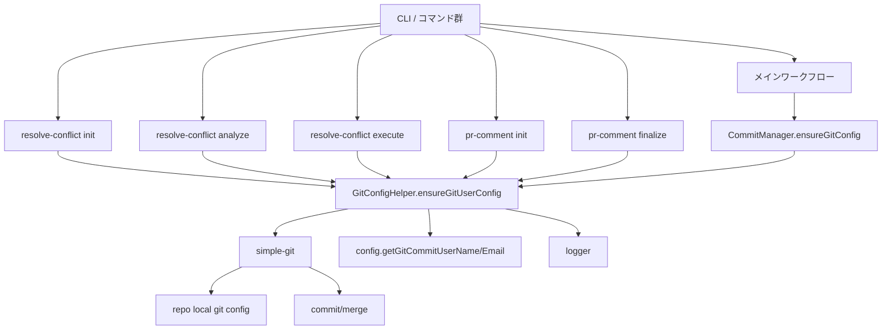
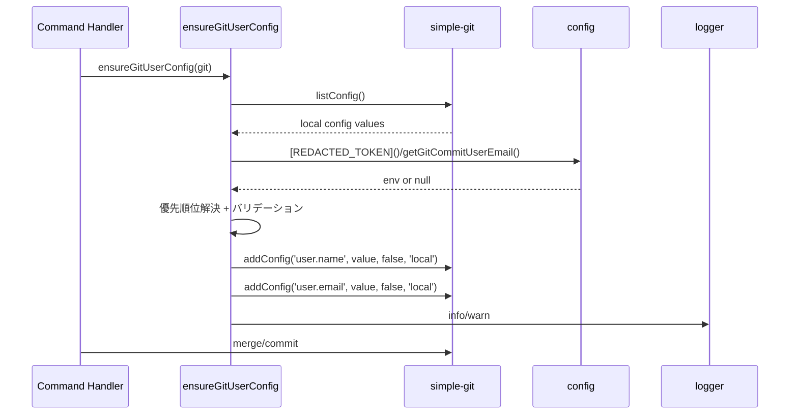

# Codex Agent 実行ログ

開始日時: 2026/2/21 9:50:38

---

## Turn 1: スレッド開始

**Thread ID**: `[REDACTED_TOKEN]`

## Turn 2: ツール実行

**種別**: reasoning
**ステータス**: completed

## Turn 3: ツール実行

**種別**: コマンド実行
**コマンド**: `/bin/bash -lc 'ls -la /tmp/ai-workflow-repos-36-22f1311d/ai-workflow-agent'`
**ステータス**: completed (exit_code=0)

```text
total 656
drwxr-xr-x. 13 node node  16384 Feb 21 09:26 .
drwxr-xr-x.  3 node node     31 Feb 21 09:26 ..
drwxr-xr-x.  6 node node     71 Feb 21 09:27 .ai-workflow
-rw-r--r--.  1 node node    174 Feb 21 09:26 .eslintrc.json
drwxr-xr-x.  8 node node  16384 Feb 21 09:50 .git
drwxr-xr-x.  3 node node  16384 Feb 21 09:26 .github
-rw-r--r--.  1 node node    485 Feb 21 09:26 .gitignore
-rw-r--r--.  1 node node     65 Feb 21 09:26 .npmrc
-rw-r--r--.  1 node node  13781 Feb 21 09:26 AGENT_TEAMS.md
-rw-r--r--.  1 node node  91137 Feb 21 09:26 CHANGELOG.md
-rw-r--r--.  1 node node  33637 Feb 21 09:26 CLAUDE.md
-rw-r--r--.  1 node node   7172 Feb 21 09:26 [REDACTED_TOKEN].md
-rw-r--r--.  1 node node  15780 Feb 21 09:26 [REDACTED_TOKEN].md
-rw-r--r--.  1 node node  16530 Feb 21 09:26 [REDACTED_TOKEN].md
-rw-r--r--.  1 node node  23454 Feb 21 09:26 [REDACTED_TOKEN].md
-rw-r--r--.  1 node node  24812 Feb 21 09:26 CODEBASE_SUMMARY.md
-rw-r--r--.  1 node node   2434 Feb 21 09:26 Dockerfile
-rw-r--r--.  1 node node  37855 Feb 21 09:26 Jenkinsfile
-rw-r--r--.  1 node node   1063 Feb 21 09:26 LICENSE
-rw-r--r--.  1 node node   4767 Feb 21 09:26 PROGRESS.md
-rw-r--r--.  1 node node  17538 Feb 21 09:26 README.md
-rw-r--r--.  1 node node   1494 Feb 21 09:26 TROUBLESHOOTING.md
drwxr-xr-x.  2 node node     25 Feb 21 09:26 __mocks__
drwxr-xr-x.  2 node node  16384 Feb 21 09:26 docs
drwxr-xr-x.  2 node node     29 Feb 21 09:26 examples
drwxr-xr-x.  4 node node     49 Feb 21 09:26 jenkins
-rw-r--r--.  1 node node   1264 Feb 21 09:26 jest.config.cjs
-rw-r--r--.  1 node node   2296 Feb 21 09:26 metadata.json.template
-rw-r--r--.  1 node node 244700 Feb 21 09:26 package-lock.json
-rw-r--r--.  1 node node   2258 Feb 21 09:26 package.json
drwxr-xr-x.  2 node node    144 Feb 21 09:26 scripts
drwxr-xr-x.  9 node node    153 Feb 21 09:26 src
drwxr-xr-x.  6 node node    107 Feb 21 09:26 tests
drwxr-xr-x.  3 node node     23 Feb 21 09:26 tmp
-rw-r--r--.  1 node node    452 Feb 21 09:26 tsconfig.json
-rw-r--r--.  1 node node    282 Feb 21 09:26 tsconfig.test.json
```

## Turn 4: ツール実行

**種別**: reasoning
**ステータス**: completed

## Turn 5: ツール実行

**種別**: コマンド実行
**コマンド**: `/bin/bash -lc 'cat /tmp/ai-workflow-repos-36-22f1311d/ai-workflow-agent/CLAUDE.md'`
**ステータス**: completed (exit_code=0)

```text
# CLAUDE.md

このファイルは、このリポジトリで作業する際に Claude Code (claude.ai/code) にガイダンスを提供します。

## 目次

- [プロジェクト概要](#プロジェクト概要)
- [Agent Teams 運用ガイドライン](#agent-teams-運用ガイドライン)
- [クイックスタート](#クイックスタート)
- [アーキテクチャ概要](#アーキテクチャ概要)
- [コーディング規約](#コーディング規約)
- [重要な制約事項](#重要な制約事項)
- [ドキュメント索引](#ドキュメント索引)

## プロジェクト概要

TypeScript ベースの AI Workflow 自動化ツールキットで、デュアルエージェント（Codex + Claude）をサポートしています。GitHub Issue に対して planning から evaluation までの 10 フェーズのワークフローを実行し、マルチリポジトリワークフロー、Jenkins 統合、永続的なメタデータ管理をサポートします。

**主要機能**:
- **デュアルエージェント**: Codex（gpt-5.2-codex）と Claude（Opus 4.5）の自動フォールバック
- **10フェーズワークフロー**: Planning → Requirements → Design → Test Scenario → Implementation → Test Implementation → Testing → Documentation → Report → Evaluation
- **永続化メタデータ**: `.ai-workflow/issue-*/metadata.json` でワークフロー状態を管理（サンプル: issue-7/issue-10/issue-105 をリファレンスとして保持）
- **マルチリポジトリ対応**: Issue URL から対象リポジトリを自動判定（v0.2.0）
- **Jenkins統合**: Docker コンテナ内で TypeScript CLI を実行

**リポジトリ構成**:
```
ai-workflow-agent/
├── src/
│   ├── core/                  # エージェント・Git/GitHub ヘルパー・メタデータ管理
│   ├── phases/                # 各フェーズ実装（planning 〜 evaluation）
│   ├── prompts/               # フェーズ/コマンド別・言語別プロンプト（{phase|category}/{lang}/*.txt）
│   ├── templates/             # PR ボディなどのテンプレート（{lang}/pr_body*.md）
│   ├── main.ts                # CLI 定義
│   └── index.ts               # bin エントリ
├── tests/
│   ├── unit/                  # ユニットテスト
│   └── integration/           # 統合テスト
├── docs/                      # ドキュメント（詳細は下記参照）
└── dist/                      # ビルド成果物（npm run build 後に生成）
```

## Agent Teams 運用ガイドライン

このプロジェクトは Claude Code の Agent Teams による並列開発をサポートしています。Agent Teams を使用する際は、以下のガイドラインに従ってください。

**詳細な実践ガイドは [AGENT_TEAMS.md](./AGENT_TEAMS.md) を参照してください。**

### ミッション・ビジョン・バリュー（MVV）

**ミッション**

AI Workflow 自動化ツールキットの品質と保守性を維持・向上させ、開発者が安心して利用できる信頼性の高いツールを提供する。

**ビジョン**

- デュアルエージェント（Codex + Claude）による柔軟なワークフロー自動化
- 10フェーズのライフサイクル管理による体系的な開発プロセス
- 多言語対応（日本語・英語）による国際的な利用促進
- 継続的なテストとドキュメントによる長期的な保守性の確保

**バリュー（行動指針）**

1. **既存機能を壊さない**: テストスイート（`npm run validate`）で常に検証する
2. **コードの整合性を維持する**: コーディング規約に従い、統一された品質を保つ
3. **段階的に進める**: 大規模な変更は小さなステップに分割し、各ステップで検証する
4. **判断に迷ったら確認する**: 不明確な要件や影響範囲が大きい変更は、必ず人間（コーチ役）に確認する

### テストスイートの位置づけ

テストスイートは「上司の代わり」として機能します。エージェントが作業を終えたら、以下のコマンドで自己検証してください。

```bash
# 統合検証（推奨）
npm run validate

# または個別に実行
npm run lint                # TypeScript 型チェック
npm test                    # ユニット・統合テスト
npm run build               # ビルド確認
```

- **テストが通ること = 品質の最低基準**：エージェントはテストが通ることをゴールに動く
- **出力はシンプルに**：エラーメッセージは grep しやすい形式（`ERROR: <理由>`）にする
- **高速フィードバック**：各エージェントが素早くリグレッションを検出できるようにする

### Agent Teams に適したタスク・適さないタスク

Agent Teams の特性を理解し、適切なタスクに適用してください。

**✅ Agent Teams に適したタスク（Read-Heavy）**

- 複数ファイルの調査・レビュー（コードレビュー、セキュリティ監査）
- 多角的な視点が必要なタスク（設計レビュー、アーキテクチャ分析）
- 独立性の高いタスク群（複数フェーズの並列実装、独立したバグ修正）
- ドキュメント作成・更新（各フェーズのドキュメント整備）

**❌ Agent Teams に適さないタスク（Write-Heavy）**

- 同一ファイルへの同時書き込み（マージコンフリクトのリスク）
- 強い逐次依存があるタスク（A完了後にBを開始する必要がある場合）
- 小規模な修正（単一ファイルの typo 修正など）
- 密結合な変更（1つの機能変更が複数ファイルに波及する場合）

### タスク分解のベストプラクティス

Agent Teams を効果的に活用するには、タスクを適切に分解する必要があります。

**良い分解（独立性が高い）**
```
✅ 各フェーズのプロンプト改善
├── Agent 1: planning フェーズのプロンプト改善
├── Agent 2: implementation フェーズのプロンプト改善
├── Agent 3: testing フェーズのプロンプト改善
└── Agent 4: documentation フェーズのプロンプト改善
```

**悪い分解（依存関係が強い）**
```
❌ すべてのプロンプトを一括変更
├── Agent 1: すべてのプロンプトを修正（範囲が広すぎる）
└── Agent 2: Agent 1 の完了を待つ（不必要な依存）
```

**改善案（機能単位で分割）**
```
✅ 機能ごとに独立させる
├── Agent 1: 日本語プロンプトの改善（全フェーズ）
├── Agent 2: 英語プロンプトの改善（全フェーズ）
└── Agent 3: プロンプト検証ツールの実装
```

### 並列化のパターン

| パターン | 適用場面 | 例 |
|---|---|---|
| コンポーネント分割型 | モジュール間の結合度が低い | 各エージェントが異なるフェーズの実装を担当 |
| 多角レビュー型 | 品質の多面的な評価が必要 | セキュリティ、パフォーマンス、可読性を別々のエージェントが評価 |
| ドキュメント並列型 | 複数のドキュメントを同時更新 | 各エージェントが異なる docs ファイルを更新 |
| 独立テスト型 | 多数の独立したテストケースがある | 各エージェントが異なるテストファイルを改善 |

### Team Leader（コーチ）の役割

Agent Teams では、Team leader が「コーチ」として環境を整え、エージェントを見守る役割を担います。

**重要な原則**:
- **仕事のやり方には口を出さない**：各エージェントの自律性を尊重する
- **環境や仕組みを整える**：タスク設計、ツール提供、障害の除去に集中する
- **見守り、必要に応じて介入する**：放置ではなく、適切なタイミングでサポー
... (truncated)
```

## Turn 6: ツール実行

**種別**: コマンド実行
**コマンド**: `/bin/bash -lc 'cat /tmp/ai-workflow-repos-36-22f1311d/ai-workflow-agent/CONTRIBUTION.md'`
**ステータス**: failed (exit_code=1)

```text
cat: /tmp/ai-workflow-repos-36-22f1311d/ai-workflow-agent/CONTRIBUTION.md: No such file or directory
```

## Turn 7: ツール実行

**種別**: コマンド実行
**コマンド**: `/bin/bash -lc 'cat /tmp/ai-workflow-repos-36-22f1311d/ai-workflow-agent/.ai-workflow/issue-749/02_design/output/design.md'`
**ステータス**: completed (exit_code=0)

```text
# 詳細設計書: Issue #749

## 1. アーキテクチャ設計

### 1.1 システム全体図



### 1.2 コンポーネント間の関係

- `resolve-conflict` の各フェーズは `simple-git` を直接利用し、Git ユーザー設定の共通ヘルパー（新規）を呼び出す。
- `CommitManager.ensureGitConfig()` は既存の外部 API を維持しつつ、内部処理を共通ヘルパーへ委譲する。
- `pr-comment` のインライン設定は共通ヘルパーへ置換する。
- すべての Git ユーザー設定は `config` と `logger` を利用し、`process.env` への直接アクセスは行わない。

### 1.3 データフロー



---

## 2. 実装戦略判断

### 実装戦略: EXTEND

**判断根拠**:
- 既存の `CommitManager.ensureGitConfig()` のロジックを共通化し、既存コマンドへ適用する拡張が主目的。
- 既存ファイルの修正が中心で、新規作成はヘルパーとユニットテストの最小限。
- リファクタリングは副次的で、外部 API を変えずに機能欠落を補う。

---

## 3. テスト戦略判断

### テスト戦略: UNIT_INTEGRATION

**判断根拠**:
- 共通ヘルパーの優先順位・バリデーション・ログ出力はユニットテストで検証が必要。
- `resolve-conflict` の各フェーズで `merge/commit` 前に設定が適用されることは統合テストで検証が必要。

---

## 4. テストコード戦略判断

### テストコード戦略: BOTH_TEST

**判断根拠**:
- 共通ヘルパーのユニットテストは新規ファイル作成が必要。
- `resolve-conflict` の統合テストは既存ファイルの拡張で対応可能。

---

## 5. 影響範囲分析

### 5.1 既存コードへの影響

- `resolve-conflict` の 3 フェーズに Git ユーザー設定の事前適用を追加。
- `CommitManager.ensureGitConfig()` は共通ヘルパーへ委譲するが、外部 API 互換を維持。
- `pr-comment` のインライン設定を共通ヘルパーに置換し、デフォルト値を統一。

### 5.2 依存関係の変更

- 新規外部依存の追加はなし。
- 内部依存として `src/core/git/git-config-helper.ts` が追加され、各コマンドから参照。

### 5.3 マイグレーション要否

- データ移行なし。
- 設定変更なし（環境変数は既存の `[REDACTED_TOKEN]` / `[REDACTED_TOKEN]` を使用）。
- Jenkinsfile への環境変数追加は任意（スコープ外）。

---

## 6. 変更・追加ファイルリスト

### 6.1 新規作成ファイル

- `src/core/git/git-config-helper.ts`
- `tests/unit/core/git/git-config-helper.test.ts`

### 6.2 修正が必要な既存ファイル

- `src/commands/resolve-conflict/init.ts`
- `src/commands/resolve-conflict/analyze.ts`
- `src/commands/resolve-conflict/execute.ts`
- `src/core/git/commit-manager.ts`
- `src/commands/pr-comment/init.ts`
- `src/commands/pr-comment/finalize.ts`
- `tests/integration/commands/resolve-conflict.test.ts`

### 6.3 削除が必要なファイル

- なし

---

## 7. 詳細設計

### 7.1 クラス設計

- 既存のクラス設計は維持し、`CommitManager.ensureGitConfig()` のみ内部委譲に変更。
- 新規にクラスは導入しない（関数ベースのヘルパー）。

### 7.2 関数設計

#### 7.2.1 `ensureGitUserConfig`

- 配置: `src/core/git/git-config-helper.ts`
- シグネチャ: `ensureGitUserConfig(git: SimpleGit): Promise<void>`
- 公開定数:
  - `[REDACTED_TOKEN] = 'AI Workflow'`
  - `[REDACTED_TOKEN] = '[REDACTED_EMAIL]'`

**処理フロー**:
1. `git.listConfig()` でローカル設定の `user.name` / `user.email` を取得。
2. ローカル設定がある場合はそれを優先。
3. ない場合は `config.[REDACTED_TOKEN]()` / `config.[REDACTED_TOKEN]()` を取得。
4. フォールバックとして `config.getGitAuthorName()` / `config.getGitAuthorEmail()` を使用。（既存 `CommitManager.ensureGitConfig()` に合わせる）
5. バリデーション:
   - ユーザー名 1〜100 文字外は警告しデフォルトへ。
   - メールに `@` がなければ警告しデフォルトへ。
6. `git.addConfig('user.name', value, false, 'local')` と `git.addConfig('user.email', value, fals
... (truncated)
```

## Turn 8: ツール実行

**種別**: コマンド実行
**コマンド**: `/bin/bash -lc 'cat /tmp/ai-workflow-repos-36-22f1311d/ai-workflow-agent/.ai-workflow/issue-749/00_planning/output/planning.md'`
**ステータス**: completed (exit_code=0)

```text
# プロジェクト計画書: Issue #749

## resolve-conflict コマンドの全フェーズで git user 設定が未実施のため CI 環境でコミットが失敗する

---

## 1. Issue分析

### 概要

`resolve-conflict` コマンド（init / analyze / execute）の各フェーズで `git commit` や `git merge` を実行する際、`user.name` および `user.email` の設定が行われていないため、Jenkins 等の CI 環境でコミットが失敗する。他のコマンド（`pr-comment` やメインワークフロー）では `ensureGitConfig()` や `git.addConfig()` で事前に Git ユーザー情報を設定しているが、`resolve-conflict` コマンドのみこの処理が欠落している。

### 複雑度: **簡単〜中程度**

- 影響範囲は `resolve-conflict` コマンドの3ファイル（init.ts / analyze.ts / execute.ts）が主対象
- 既存の `ensureGitConfig()` ロジック（`CommitManager` 内）を共通ヘルパーとして抽出する設計作業が含まれる
- フォールバック値（ユーザー名・メールアドレス）のプロジェクト全体統一も対応する
- 既存テストファイル（1,209行）への追加テストケース作成が必要

### 見積もり工数: **6〜10時間**

| 作業 | 見積もり |
|------|---------|
| 要件定義 | 0.5h |
| 設計（共通ヘルパー設計、統一方針決定） | 1h |
| テストシナリオ作成 | 0.5h |
| 共通ヘルパー関数の抽出・実装 | 1.5〜2h |
| resolve-conflict 3ファイルへの適用 | 1〜1.5h |
| テストコード実装 | 1.5〜2h |
| テスト実行・デバッグ | 0.5〜1h |
| ドキュメント・レポート | 0.5〜1h |
| **合計** | **6〜10h** |

### リスク評価: **低**

- 既に確立されたパターン（`CommitManager.ensureGitConfig()`）が存在し、それを再利用する方針
- 影響範囲が限定的（`resolve-conflict` コマンドの3ファイル + 共通ヘルパー1ファイル）
- 既存テストスイートでリグレッションを検出可能

---

## 2. 実装戦略判断

### 実装戦略: **EXTEND**

**判断根拠**:

- 新規モジュールの作成（CREATE）ではない。`ensureGitConfig()` のロジックは既に `CommitManager` クラス内に完成品として存在する（L528-568）
- 既存コードの構造改善（REFACTOR）が主目的でもない。主目的は `resolve-conflict` コマンドに欠落している機能を追加すること
- 既存の `CommitManager.ensureGitConfig()` から Git ユーザー設定ロジックをスタンドアロン関数として抽出し、`resolve-conflict` コマンドの3ファイルに適用する**機能追加（EXTEND）**が中心
- 追加として、`pr-comment` コマンドと `CommitManager` 間のフォールバック値（デフォルトユーザー名・メールアドレス）を統一する改善も含む

### テスト戦略: **UNIT_INTEGRATION**

**判断根拠**:

- **ユニットテスト**: 共通ヘルパー関数（`ensureGitConfig` のスタンドアロン版）の単体動作確認が必要。設定値の優先順位（環境変数 → フォールバック → デフォルト）、バリデーション（名前長、メール形式）のロジックをテストする
- **インテグレーションテスト**: `resolve-conflict` コマンドの各フェーズ（init / analyze / execute）が `git.commit()` / `git.merge()` 前に Git ユーザー設定を正しく呼び出すことを検証する必要がある。既存の統合テスト（`tests/integration/commands/resolve-conflict.test.ts`、1,209行・18テスト）に追加する
- **BDDテスト**: ユーザーストーリー中心のテストは不要（内部インフラの修正であり、エンドユーザーの操作フローに変更はない）

### テストコード戦略: **BOTH_TEST**

**判断根拠**:

- **EXTEND_TEST**: 既存の `tests/integration/commands/resolve-conflict.test.ts` に Git ユーザー設定の検証テストケースを追加する
- **CREATE_TEST**: 新規抽出する共通ヘルパー関数（`ensureGitUserConfig` 等）のユニットテストファイルを新規作成する。現在 `src/core/git/commit-manager.ts` 内の `ensureGitConfig()` に対する独立したユニットテストは存在しない

---

## 3. 影響範囲分析

### 既存コードへの影響

| ファイル | 変更種別 | 変更内容 |
|---------|---------|---------|
| `src/core/git/commit-manager.ts` | 修正 | `ensureGitConfig()` 内のロジックを新しいスタンドアロン関数に委譲するようリファクタリング |
| `src/core/git/git-config-helper.ts` | **新規作成** | Git ユーザー設定の共通ヘルパー関数を配置 |
| `src/commands/resolve-conflict/init.ts` | 修正 | `git.commit()` 前に共通ヘルパー関数を呼び出す処理を追加 |
| `src/commands/resolve-conflict/analyze.ts` | 修正 | `git.merge()` / `git.commit()` 前に共通ヘルパー関数を呼び出す処理を追加 |
| `src/commands/resolve-conflict/execute.ts` | 修正 | `git.commit()` 前に共通ヘルパー関数を呼び出す処理を追加 |
| `src/commands/pr-comment/init.ts` | 修正 | インライン Git 設定を共通ヘルパー関数に置き換え、フォールバック値を統一 |
| `src/commands/pr-comment/finalize.ts` | 修正 | インライン Git 設定（2箇所）を共通ヘルパー関数に置き換え、フォールバック値を統一 |

### テストファイルへの影響

| ファイル | 変更種別 | 変更内容 |
|---------|---------|---------|
| `tests/unit/core/git/git-config-helper.test.ts` | **新規作成** | 共通ヘルパー関数のユニットテスト |
| `tests/integration/commands/resolve-conflict.test.ts` | 修正 | Git ユーザー設定の呼び出し検証テストケース追加 |

### 依存関係の変更

- **新規依存の追加**: なし（既存の `simple-git` と `config` モジュールのみ使用）
- **既存依存の変更**: `CommitManager.ensureGitConfig()` が内部で新しいスタンドアロン関数を利用するように変更されるが、外部インターフェースは変更なし

### マイグレーション要否

- **データベーススキーマ変更**: なし
- **設定ファイル変更**: なし（既存の環境変数 `[REDACTED_TOKEN]` / `[REDACTED_TOKEN]` をそのまま使用）
- **Jenkins パイプライン変更**: 任意。`[REDACTED_TOKEN]` / `[REDACTED_TOKEN]` 環境変数を Jenkinsfile に明示的に追加することを推奨するが、必須ではない（コード側でフォールバック値が設定されるため）

### フォールバック値の統一方針

現状の不整合を解消し、プロジェクト全体で統一する：

| 項目 | CommitManager（現在） | pr-comment（現在） | **統一後** |
|------|----------------------|-------------------|-----------|
| ユーザー名 | `'AI Workflow'` | `'AI Workflow Bot'` | `'AI Workflow'` |
| メールアドレス | `'[REDACTED_EMAIL]'` |
... (truncated)
```

## Turn 9: ツール実行

**種別**: コマンド実行
**コマンド**: `/bin/bash -lc 'cat /tmp/ai-workflow-repos-36-22f1311d/ai-workflow-agent/.ai-workflow/issue-749/03_test_scenario/output/test-scenario.md'`
**ステータス**: completed (exit_code=0)

```text
# テストシナリオ: Issue #749

## 1. テスト戦略サマリー

- 選択されたテスト戦略: UNIT_INTEGRATION
- テスト対象範囲
- `src/core/git/git-config-helper.ts` の `ensureGitUserConfig()` と定数
- `resolve-conflict` 各フェーズ（init / analyze / execute）での Git 設定適用
- `CommitManager.ensureGitConfig()` の委譲による既存挙動の維持
- `pr-comment` のインライン設定置換による既存挙動の維持
- テスト目的
- Git ユーザー設定の優先順位・バリデーション・ログ出力が要件通りであること
- CI 環境で `resolve-conflict` の commit / merge が失敗しないこと
- 既存機能にリグレッションがないこと

## 2. Unitテストシナリオ

### テストケース名: [REDACTED_TOKEN]正常系_ローカル設定優先
- 目的: 既存のローカル Git 設定がある場合に最優先されることを検証
- 前提条件: `git.listConfig()` が `user.name` / `user.email` を返す
- 入力: `ensureGitUserConfig(git)`
- 期待結果: `git.addConfig('user.name', 既存値, false, 'local')` と `git.addConfig('user.email', 既存値, false, 'local')` が呼び出される
- テストデータ: `user.name='Existing User'`, `user.email='[REDACTED_EMAIL]'`

### テストケース名: [REDACTED_TOKEN]正常系_環境変数優先
- 目的: 環境変数（commit）がローカル設定未設定時に適用されることを検証
- 前提条件: `git.listConfig()` が `user.name` / `user.email` を返さない
- 入力: `config.[REDACTED_TOKEN]()` = `Custom User`, `config.[REDACTED_TOKEN]()` = `[REDACTED_EMAIL]`
- 期待結果: `git.addConfig('user.name', 'Custom User', false, 'local')` と `git.addConfig('user.email', '[REDACTED_EMAIL]', false, 'local')` が呼び出される
- テストデータ: `[REDACTED_TOKEN]='Custom User'`, `[REDACTED_TOKEN]='[REDACTED_EMAIL]'`

### テストケース名: [REDACTED_TOKEN]正常系_フォールバック環境変数適用
- 目的: commit 系環境変数が未設定の場合に author 系環境変数が適用されることを検証
- 前提条件: `git.listConfig()` が空、`getGitCommitUserName/Email` が null
- 入力: `config.getGitAuthorName()` = `Author User`, `config.getGitAuthorEmail()` = `[REDACTED_EMAIL]`
- 期待結果: `git.addConfig('user.name', 'Author User', false, 'local')` と `git.addConfig('user.email', '[REDACTED_EMAIL]', false, 'local')` が呼び出される
- テストデータ: `GIT_AUTHOR_NAME='Author User'`, `GIT_AUTHOR_EMAIL='[REDACTED_EMAIL]'`

### テストケース名: [REDACTED_TOKEN]正常系_デフォルト値適用
- 目的: 環境変数が全て未設定の場合にデフォルト値が適用されることを検証
- 前提条件: `git.listConfig()` が空、`config` が全て null
- 入力: `ensureGitUserConfig(git)`
- 期待結果: `[REDACTED_TOKEN]='AI Workflow'` と `[REDACTED_TOKEN]='[REDACTED_EMAIL]'` が設定される
- テストデータ: なし

### テストケース名: [REDACTED_TOKEN]異常系_ユーザー名長さ不正
- 目的: ユーザー名が 1〜100 文字外の場合に警告してデフォルトへフォールバックすることを検証
- 前提条件: `[REDACTED_TOKEN]()` が 101 文字以上
- 入力: `ensureGitUserConfig(git)`
- 期待結果: `logger.warn()` が呼び出され、`git.addConfig('user.name', [REDACTED_TOKEN], false, 'local')` が呼び出される
- テストデータ: 101 文字のユーザー名

### テストケース名: [REDACTED_TOKEN]異常系_メール形式不正
- 目的: メールに `@` が含まれない場合に警告してデフォルトへフォールバックすることを検証
- 前提条件: `[REDACTED_TOKEN]()` が `invalid-email`
- 入力: `ensureGitUserConfig(git)`
- 期待結果: `logger.warn()` が呼び出され、`git.addConfig('user.email', [REDACTED_TOKEN], false, 'local')` が呼び出される
- テストデータ: `invalid-email`

### テストケース名: [REDACTED_TOKEN]正常系_addConfig引数検証
- 目的: `git.addConfig` が `('user.name' / 'user.email', 値, false, 'local')` で呼ばれることを検証
- 前提条件: `git.listConfig()` が空
- 入力: `ensureGitUserConfig(git)`
- 期待結果: 第3引数が `false`、第4引数が `'local'` である
- テストデータ: デフォルト値または環境変数

### テストケース名: [REDACTED_TOKEN]正常系_ログ出力
- 目的: 設定後に `logger.info()` でユーザー名・メールがログ出力されることを検証
- 前提条件: 正常な設定値が決定される
- 入力: `ensureGitUserConfig(git)`
- 期待結果: `logger.info()` がユーザー名・メールを含むメッセージで呼ばれる
- テストデータ: `Custom User`, `[REDACTED_EMAIL]`

### テストケース名: [REDACTED_TOKEN]異常系_例外発生時継続
- 目的: `git.listConfig()` 等で例外が発生してもエラーを再スローせずワークフローが継続できることを検証
- 前提条件: `git.listConfig()` が例外を投げる
- 入力: `ensureGitUserConfig(git)`
- 期待結果: `logger.warn()` が呼び出され、例外が外に伝播しない
- テストデータ: 例外オブジェクト

### テストケース名: CommitManager.ensureGitConfig_正常系_委譲確認
- 目的: 既存 API のまま共通ヘルパーへ委譲していることを検証
- 前提条件: `CommitManager` が `git` を保持
- 入力: `commitManager.ensureGitConfig()`
- 期待結果: `ensureGitUserConfig(this.git)` が呼び出される
- テストデータ: モック `SimpleGit`

## 3. Integrationテストシナリオ

### シナリオ名: resolve-conflict init + Git設定
- 目的: init フェーズで commit 前に Git 設定が適用されることを検証
- 前提条件: CI 環境相当でグローバル Git 設定なし
- テスト手順:
1. `resolve-conflict init` を実行
2. `git.addConfig('user.name', ...)` / `git.addConfig('user.email', ...)` の呼び出しを監視
3. `git.commit()` の呼び出し順序を確認
-
... (truncated)
```

## Turn 10: ツール実行

**種別**: コマンド実行
**コマンド**: `/bin/bash -lc 'cat /tmp/ai-workflow-repos-36-22f1311d/ai-workflow-agent/.ai-workflow/issue-749/01_requirements/output/requirements.md'`
**ステータス**: completed (exit_code=0)

```text
# 要件定義書: Issue #749

## resolve-conflict コマンドの全フェーズで git user 設定が未実施のため CI 環境でコミットが失敗する

---

## 0. Planning Document の確認

### 開発計画の全体像

Planning Phase（`planning.md`）にて以下の戦略が策定済み：

- **実装戦略**: EXTEND（既存の `CommitManager.ensureGitConfig()` からロジックを抽出し、共通ヘルパー関数として `resolve-conflict` コマンドに適用）
- **テスト戦略**: UNIT_INTEGRATION（共通ヘルパー関数のユニットテスト + `resolve-conflict` 統合テストの拡張）
- **テストコード戦略**: BOTH_TEST（新規ユニットテスト作成 + 既存統合テスト拡張）
- **複雑度**: 簡単〜中程度（見積もり工数 6〜10 時間）
- **リスク評価**: 低（既存パターンの再利用、限定的な影響範囲）

### Planning Document で策定された主要方針

1. `src/core/git/git-config-helper.ts` を新規作成し、`ensureGitUserConfig()` をスタンドアロン関数として実装
2. `resolve-conflict` の 3 ファイル（init.ts / analyze.ts / execute.ts）に適用
3. `CommitManager.ensureGitConfig()` を新しい共通ヘルパー関数に委譲するようリファクタリング
4. `pr-comment` のインライン Git 設定を共通ヘルパー関数に置き換え
5. フォールバック値（ユーザー名・メールアドレス）をプロジェクト全体で統一

本要件定義書は上記方針を踏まえて策定する。

---

## 1. 概要

### 背景

`resolve-conflict` コマンドは PR のマージコンフリクトを AI で分析・解消するためのコマンドであり、init / analyze / execute / finalize の 4 フェーズで構成される。このうち init / analyze / execute の 3 フェーズでは `simpleGit()` を直接使用して `git.commit()` や `git.merge()` を実行するが、Git ユーザー情報（`user.name` / `user.email`）の事前設定が行われていない。

Jenkins 等の CI 環境ではグローバルな Git ユーザー設定が存在しないため、`resolve-conflict` コマンド実行時に以下のエラーが発生し、コミットおよびマージ操作が失敗する：

```
fatal: unable to auto-detect email address (got 'node@f40376951cc1.(none)')
```

### 目的

1. `resolve-conflict` コマンドの全フェーズ（init / analyze / execute）で Git ユーザー設定を適用し、CI 環境でのコミット・マージ操作を成功させる
2. Git ユーザー設定ロジックを共通ヘルパー関数として抽出し、プロジェクト全体で再利用可能にする
3. フォールバック値（デフォルトユーザー名・メールアドレス）をプロジェクト全体で統一する

### ビジネス価値

- **CI/CD パイプラインの安定化**: Jenkins 環境で `resolve-conflict` ジョブが正常に完了するようになり、PR のマージコンフリクト自動解消ワークフローが実用化される
- **運用コストの削減**: 手動でのコンフリクト解消や Jenkins ジョブの再設定が不要になる

### 技術的価値

- **コードの DRY 原則**: Git ユーザー設定ロジックが 1 箇所に集約され、保守性が向上する
- **統一されたデフォルト値**: プロジェクト全体で Git コミッター情報が一貫し、コミット履歴の追跡が容易になる
- **将来の拡張性**: 新しいコマンドを追加する際に、共通ヘルパー関数を呼び出すだけで Git ユーザー設定が完了する

---

## 2. 機能要件

### FR-1: Git ユーザー設定の共通ヘルパー関数の作成（優先度: 高）

**概要**: `src/core/git/git-config-helper.ts` に `ensureGitUserConfig()` 関数を新規作成する。

**詳細要件**:

| ID | 要件 | 検証方法 |
|----|------|----------|
| FR-1.1 | `ensureGitUserConfig(git: SimpleGit): Promise<void>` のシグネチャで関数を提供する | ユニットテストで関数呼び出しが成功することを確認 |
| FR-1.2 | 設定値の優先順位を以下の順序で解決する: (1) リポジトリローカルの既存 git config → (2) 環境変数 `[REDACTED_TOKEN]` / `[REDACTED_TOKEN]` → (3) フォールバック環境変数 `GIT_AUTHOR_NAME` / `GIT_AUTHOR_EMAIL` → (4) デフォルト値 | ユニットテストで各優先順位の動作を検証 |
| FR-1.3 | デフォルト値として `[REDACTED_TOKEN] = 'AI Workflow'` と `[REDACTED_TOKEN] = '[REDACTED_EMAIL]'` を定数としてエクスポートする | ユニットテストでデフォルト値の適用を検証 |
| FR-1.4 | ユーザー名の長さが 1〜100 文字の範囲外の場合、警告ログを出力しデフォルト値にフォールバックする | ユニットテストでバリデーション動作を検証 |
| FR-1.5 | メールアドレスに `@` が含まれない場合、警告ログを出力しデフォルト値にフォールバックする | ユニットテストでバリデーション動作を検証 |
| FR-1.6 | `git.addConfig('user.name', ..., false, 'local')` および `git.addConfig('user.email', ..., false, 'local')` を使用してリポジトリローカルに設定する | ユニットテストで `addConfig` の呼び出し引数を検証 |
| FR-1.7 | 設定完了後に `logger.info()` で設定されたユーザー名・メールアドレスをログ出力する | ユニットテストでログ出力を検証 |
| FR-1.8 | 環境変数の取得には `config.[REDACTED_TOKEN]()` / `config.[REDACTED_TOKEN]()` を使用する（`process.env` 直接アクセス禁止） | コードレビューで確認 |

### FR-2: resolve-conflict init フェーズへの Git ユーザー設定追加（優先度: 高）

**概要**: `src/commands/resolve-conflict/init.ts` の `git.commit()` 呼び出し前に `ensureGitUserConfig()` を追加する。

**詳細要件**:

| ID | 要件 | 検証方法 |
|----|------|----------|
| FR-2.1 | L48 の `git.commit()` 実行前に `ensureGitUserConfig(git)` を呼び出す | 統合テストで `addConfig` が `commit` 前に呼び出されることを検証 |
| FR-2.2 | `ensureGitUserConfig()` の呼び出しはフェーズの早期段階（`git.commit()` の直前ではなくエントリポイント付近）で実行する | コードレビューで呼び出し位置を確認 |
| FR-2.3 | `ensureGitUserConfig()` がエラーを発生させた場合でも、ワークフロー全体は中断しない（フォールト・トレランス） | 統合テストでエラー時の継続動作を検証 |

### FR-3: resolve-conflict analyze フェーズへの Git ユーザー設定追加（優先度: 高）

**概要**: `src/commands/resolve-conflict/analyze.ts` の `git.merge()` および `git.commit()` 呼び出し前に `ensureGitUserConfig()` を追加する。

**詳細要件**:

| ID | 要件 | 検証方法 |
|----|------|----------|
| FR-3.1 | L88 の `git.raw(['merge', '--no-commit', '--no-ff', ...])` 実行前に `ensureG
... (truncated)
```

## Turn 11: ツール実行

**種別**: reasoning
**ステータス**: completed

## Turn 12: ツール実行

**種別**: コマンド実行
**コマンド**: `/bin/bash -lc 'rg -n "ensureGitConfig|git.addConfig|resolve-conflict" src/core/git/commit-manager.ts src/commands/resolve-conflict/init.ts src/commands/resolve-conflict/analyze.ts src/commands/resolve-conflict/execute.ts src/commands/pr-comment/init.ts src/commands/pr-comment/finalize.ts'`
**ステータス**: failed (exit_code=127)

```text
/bin/bash: line 1: rg: command not found
```

## Turn 13: ツール実行

**種別**: コマンド実行
**コマンド**: `/bin/bash -lc 'rg -n "getGitCommitUser|getGitAuthor|addConfig|listConfig" src/core/git/commit-manager.ts'`
**ステータス**: failed (exit_code=127)

```text
/bin/bash: line 1: rg: command not found
```

## Turn 14: ツール実行

**種別**: reasoning
**ステータス**: completed

## Turn 15: ツール実行

**種別**: コマンド実行
**コマンド**: `/bin/bash -lc "grep -n \"ensureGitConfig\\|git.addConfig\\|resolve-conflict\" -n src/core/git/commit-manager.ts src/commands/resolve-conflict/init.ts src/commands/resolve-conflict/analyze.ts src/commands/resolve-conflict/execute.ts src/commands/pr-comment/init.ts src/commands/pr-comment/finalize.ts"`
**ステータス**: completed (exit_code=0)

```text
src/core/git/commit-manager.ts:133:    await this.ensureGitConfig();
src/core/git/commit-manager.ts:227:      await this.ensureGitConfig();
src/core/git/commit-manager.ts:286:      await this.ensureGitConfig();
src/core/git/commit-manager.ts:372:    await this.ensureGitConfig();
src/core/git/commit-manager.ts:459:      await this.ensureGitConfig();
src/core/git/commit-manager.ts:533:  public async ensureGitConfig(): Promise<void> {
src/core/git/commit-manager.ts:562:    await this.git.addConfig('user.name', userName, false, 'local');
src/core/git/commit-manager.ts:563:    await this.git.addConfig('user.email', userEmail, false, 'local');
src/core/git/commit-manager.ts:612:    await this.ensureGitConfig();
src/core/git/commit-manager.ts:678:      await this.ensureGitConfig();
src/commands/resolve-conflict/init.ts:48:      await git.commit(`resolve-conflict: init metadata for PR #${prInfo.prNumber}`);
src/commands/resolve-conflict/init.ts:56:    logger.error(`Failed to initialize resolve-conflict: ${getErrorMessage(error)}`);
src/commands/resolve-conflict/analyze.ts:45:      logger.error("Metadata not found. Run 'resolve-conflict init' first.");
src/commands/resolve-conflict/analyze.ts:169:      await repoGit.commit(`resolve-conflict: analyze completed for PR #${prNumber}`);
src/commands/resolve-conflict/execute.ts:81:      logger.error("Metadata not found. Run 'resolve-conflict init' first.");
src/commands/resolve-conflict/execute.ts:128:      await git.commit(`[resolve-conflict] Resolve conflicts for PR #${prInfo.prNumber}`);
src/commands/resolve-conflict/execute.ts:139:      await git.commit(`resolve-conflict: execute artifacts for PR #${prInfo.prNumber}`);
src/commands/pr-comment/init.ts:80:    await git.addConfig('user.name', gitUserName);
src/commands/pr-comment/init.ts:81:    await git.addConfig('user.email', gitUserEmail);
src/commands/pr-comment/finalize.ts:109:      await git.addConfig('user.name', gitUserName);
src/commands/pr-comment/finalize.ts:110:      await git.addConfig('user.email', gitUserEmail);
src/commands/pr-comment/finalize.ts:207:  await git.addConfig('user.name', gitUserName);
src/commands/pr-comment/finalize.ts:208:  await git.addConfig('user.email', gitUserEmail);
```

## Turn 16: ツール実行

**種別**: コマンド実行
**コマンド**: `/bin/bash -lc "grep -n \"getGitCommitUser\\|getGitAuthor\\|addConfig\\|listConfig\" src/core/git/commit-manager.ts"`
**ステータス**: completed (exit_code=0)

```text
534:    const gitConfig = await this.git.listConfig();
540:      config.[REDACTED_TOKEN]() ||
545:      config.[REDACTED_TOKEN]() ||
562:    await this.git.addConfig('user.name', userName, false, 'local');
563:    await this.git.addConfig('user.email', userEmail, false, 'local');
```

## Turn 17: ツール実行

**種別**: reasoning
**ステータス**: completed

## Turn 18: ツール実行

**種別**: コマンド実行
**コマンド**: `/bin/bash -lc "sed -n '520,590p' src/core/git/commit-manager.ts"`
**ステータス**: completed (exit_code=0)

```text
logger.warn(
        `Skipping ${missingFiles.length} non-existent file(s): ${missingFiles.slice(0, 3).join(', ')}${missingFiles.length > 3 ? '...' : ''}`,
      );
    }

    return existingFiles;
  }

  /**
   * Ensure git config (user.name and user.email)
   *
   * Note: Made public for use by SquashManager during finalize command.
   */
  public async ensureGitConfig(): Promise<void> {
    const gitConfig = await this.git.listConfig();
    const userNameFromConfig = gitConfig.all['user.name'] as string | undefined;
    const userEmailFromConfig = gitConfig.all['user.email'] as string | undefined;

    let userName: string =
      userNameFromConfig ||
      config.[REDACTED_TOKEN]() ||
      'AI Workflow';

    let userEmail: string =
      userEmailFromConfig ||
      config.[REDACTED_TOKEN]() ||
      '[REDACTED_EMAIL]';

    if (userName.length < 1 || userName.length > 100) {
      logger.warn(
        `User name length is invalid (${userName.length} chars), using default`,
      );
      userName = 'AI Workflow';
    }

    if (!userEmail.includes('@')) {
      logger.warn(
        `Invalid email format: ${userEmail}, using default`,
      );
      userEmail = '[REDACTED_EMAIL]';
    }

    await this.git.addConfig('user.name', userName, false, 'local');
    await this.git.addConfig('user.email', userEmail, false, 'local');

    logger.info(
      `Git config ensured: user.name=${userName}, user.email=${userEmail}`,
    );
  }

  /**
   * Issue #90: ロールバック用のコミットを作成
   * Issue #269: 絶対パスを相対パスに変換してからfilterExistingFilesを呼び出す
   */
  public async commitRollback(
    files: string[],
    toPhase: PhaseName,
    toStep: StepName,
    reason: string,
  ): Promise<CommitResult> {
    if (files.length === 0) {
      logger.warn('No files to commit for rollback.');
      return {
        success: true,
        commit_hash: null,
        files_committed: [],
      };
    }

    // Issue #269: 絶対パスを相対パスに変換
    // rollback.tsから渡されるパスは絶対パスだが、filterExistingFilesは相対パスを期待する
```

## Turn 19: ツール実行

**種別**: コマンド実行
**コマンド**: `/bin/bash -lc "sed -n '60,140p' src/commands/pr-comment/init.ts"`
**ステータス**: completed (exit_code=0)

```text
logger.warn('Could not determine current HEAD commit. Squash may not work.');
      }
    } catch (error) {
      logger.warn(`Failed to record base commit: ${getErrorMessage(error)}`);
    }

    const summary = await metadataManager.getSummary();
    displaySummary(summary);

    logger.info(`Initialization completed. Metadata saved to: ${metadataManager.getMetadataPath()}`);

    // Git コミット & プッシュ
    const metadataPath = metadataManager.getMetadataPath();
    const relativePath = metadataPath.replace(`${repoInfo.path}/`, '').replace(/\\/g, '/');

    // Git設定（環境変数から取得、デフォルト値使用）
    const gitUserName = config.[REDACTED_TOKEN]() || 'AI Workflow Bot';
    const gitUserEmail = config.[REDACTED_TOKEN]() || '[REDACTED_EMAIL]';

    logger.debug(`Configuring Git user: ${gitUserName} <${gitUserEmail}>`);
    await git.addConfig('user.name', gitUserName);
    await git.addConfig('user.email', gitUserEmail);

    logger.info('Committing PR comment metadata...');
    await git.add(relativePath);
    await git.commit(`[pr-comment] Initialize PR #${prNumber} comment resolution metadata`);

    logger.info('Pushing to remote...');

    // PRのheadブランチにプッシュ
    const targetBranch = prInfo.branch;

    logger.debug(`Pushing to PR branch: ${targetBranch}`);
    // 現在のHEADをリモートのtargetBranchにpush
    await git.push('origin', `HEAD:${targetBranch}`);

    logger.info('Metadata committed and pushed to remote.');
  } catch (error) {
    logger.error(`Failed to initialize: ${getErrorMessage(error)}`);
    process.exit(1);
  }
}

/**
 * PR URLまたはPR番号からリポジトリ情報とPR番号を解決
 */
async function resolvePrInfo(options: [REDACTED_TOKEN]): Promise<{ repositoryName: string; prNumber: number }> {
  // --pr-url オプションが指定されている場合
  if (options.prUrl) {
    const prInfo = parsePullRequestUrl(options.prUrl);
    logger.info(`Resolved from PR URL: ${prInfo.repositoryName}#${prInfo.prNumber}`);
    return {
      repositoryName: prInfo.repositoryName,
      prNumber: prInfo.prNumber,
    };
  }

  // --pr オプションが指定されている場合（後方互換性）
  if (options.pr) {
    // GITHUB_REPOSITORY 環境変数から取得（従来の動作）
    const githubClient = new GitHubClient();
    const repoInfo = githubClient.getRepositoryInfo();
    const repositoryName = repoInfo.repositoryName;
    const prNumber = Number.parseInt(options.pr, 10);
    logger.info(`Resolved from --pr option: ${repositoryName}#${prNumber}`);
    return {
      repositoryName,
      prNumber,
    };
  }

  // --issue オプションが指定されている場合（後方互換性）
  if (options.issue) {
    const githubClient = new GitHubClient();
    const repoInfo = githubClient.getRepositoryInfo();
    const repositoryName = repoInfo.repositoryName;
    const issueNumber = Number.parseInt(options.issue, 10);
    const prNumber = await githubClient.[REDACTED_TOKEN](issueNumber);
    if (prNumber) {
      logger.info(`Resolved from --issue option: ${repositoryName}#${prNumber}`);
      return {
```

## Turn 20: ツール実行

**種別**: コマンド実行
**コマンド**: `/bin/bash -lc "sed -n '1,220p' src/commands/resolve-conflict/analyze.ts"`
**ステータス**: completed (exit_code=0)

```text
import { promises as fsp } from 'node:fs';
import path from 'node:path';
import process from 'node:process';
import simpleGit from 'simple-git';
import { logger } from '../../utils/logger.js';
import { getErrorMessage } from '../../utils/error-utils.js';
import { GitHubClient } from '../../core/github-client.js';
import { [REDACTED_TOKEN] } from '../../core/conflict/metadata-manager.js';
import { parsePullRequestUrl, [REDACTED_TOKEN] } from '../../core/repository-utils.js';
import { [REDACTED_TOKEN] } from '../../core/git/conflict-parser.js';
import { [REDACTED_TOKEN] } from '../../core/git/merge-context-collector.js';
import { ConflictResolver } from '../../core/git/conflict-resolver.js';
import type { [REDACTED_TOKEN] } from '../../types/commands.js';
import type { ConflictBlock, [REDACTED_TOKEN] } from '../../types/conflict.js';

function [REDACTED_TOKEN](plan: [REDACTED_TOKEN], jsonPath: string): string {
  return [
    '# 解消計画',
    '',
    `- PR: #${plan.prNumber}`,
    `- base: ${plan.baseBranch}`,
    `- head: ${plan.headBranch}`,
    `- generated: ${plan.generatedAt}`,
    '',
    `- JSON: ${jsonPath}`,
    '',
    '```json',
    JSON.stringify(plan, null, 2),
    '```',
    '',
  ].join('\n');
}

export async function [REDACTED_TOKEN](options: [REDACTED_TOKEN]): Promise<void> {
  let repoRoot = '';
  let prNumber = 0;

  try {
    const prInfo = parsePullRequestUrl(options.prUrl);
    prNumber = prInfo.prNumber;
    repoRoot = [REDACTED_TOKEN](options.prUrl);

    const metadataManager = new [REDACTED_TOKEN](repoRoot, prNumber);
    if (!(await metadataManager.exists())) {
      logger.error("Metadata not found. Run 'resolve-conflict init' first.");
      process.exit(1);
    }

    const metadata = await metadataManager.getMetadata();
    const githubClient = new GitHubClient(undefined, prInfo.repositoryName);

    const pr = await githubClient.getPullRequestInfo(prNumber);
    const baseBranch = metadata.baseBranch ?? pr.base;
    const headBranch = metadata.headBranch ?? pr.head;

    if (!baseBranch || !headBranch) {
      throw new Error('Base or head branch could not be determined.');
    }

    const repoGit = simpleGit(repoRoot);
    await repoGit.fetch('origin', baseBranch);
    await repoGit.fetch('origin', headBranch);
    const status = await repoGit.status();
    const nonWorkflowFiles = status.files.filter((file) => !file.path.startsWith('.ai-workflow/'));
    if (nonWorkflowFiles.length > 0) {
      throw new Error('Working tree is not clean. Please commit or stash changes before analyze.');
    }

    const currentBranch = status.current ?? 'HEAD';
    let switched = false;

    if (currentBranch !== baseBranch && currentBranch !== `origin/${baseBranch}`) {
      const locals = await repoGit.branchLocal();
      if (locals.all.includes(baseBranch)) {
        await repoGit.checkout(baseBranch);
      } else {
        await repoGit.checkoutBranch(baseBranch, `origin/${baseBranch}`);
      }
      switched = true;
    }

    let conflictFiles: string[] = [];
    let conflictBlocks: ConflictBlock[] = [];

    try {
      const localBranches = await repoGit.branchLocal();
      const mergeTarget = localBranches.all.includes(headBranch) ? headBranch : `origin/${headBranch}`;
      await repoGit.raw(['merge', '--no-commit', '--no-ff', mergeTarget]);

      const mergeStatus = await repoGit.status();
      conflictFiles = mergeStatus.conflicted ?? [];

      if (conflictFiles.length === 0) {
        logger.info('No conflicts detected.');
        await repoGit.raw(['merge', '--abort']);
        await metadataManager.updateStatus('analyzed', {
          conflictFiles: [],
          baseBranch,
          headBranch,
        });
        return;
      }

      for (const filePath of conflictFiles) {
        const content = await fsp.readFile(path.join(repoRoot, filePath), 'utf-8');
        try {
          con
... (truncated)
```

## Turn 21: ツール実行

**種別**: コマンド実行
**コマンド**: `/bin/bash -lc "sed -n '1,120p' src/commands/resolve-conflict/init.ts"`
**ステータス**: completed (exit_code=0)

```text
import process from 'node:process';
import path from 'node:path';
import simpleGit from 'simple-git';
import { logger } from '../../utils/logger.js';
import { getErrorMessage } from '../../utils/error-utils.js';
import { GitHubClient } from '../../core/github-client.js';
import { [REDACTED_TOKEN] } from '../../core/conflict/metadata-manager.js';
import { parsePullRequestUrl, [REDACTED_TOKEN] } from '../../core/repository-utils.js';
import type { [REDACTED_TOKEN] } from '../../types/commands.js';

export async function [REDACTED_TOKEN](options: [REDACTED_TOKEN]): Promise<void> {
  try {
    const prInfo = parsePullRequestUrl(options.prUrl);
    const repoRoot = [REDACTED_TOKEN](options.prUrl);
    const githubClient = new GitHubClient(undefined, prInfo.repositoryName);

    const pr = await githubClient.getPullRequestInfo(prInfo.prNumber);
    const mergeable = await githubClient.getMergeableStatus(prInfo.prNumber);

    const metadataManager = new [REDACTED_TOKEN](repoRoot, prInfo.prNumber);
    if (await metadataManager.exists()) {
      logger.warn('Metadata already exists. Skipping initialization.');
      return;
    }

    const git = simpleGit(repoRoot);
    if (pr.base) {
      await git.fetch('origin', pr.base);
    }
    if (pr.head) {
      await git.fetch('origin', pr.head);
    }

    await metadataManager.initialize({
      prNumber: prInfo.prNumber,
      owner: prInfo.owner,
      repo: prInfo.repo,
      mergeable: mergeable.mergeable,
      mergeableState: mergeable.mergeableState ?? undefined,
      conflictFiles: [],
      baseBranch: pr.base,
      headBranch: pr.head,
    });

    try {
      const metadataRelPath = path.relative(repoRoot, metadataManager.getMetadataPath());
      await git.add(metadataRelPath);
      await git.commit(`resolve-conflict: init metadata for PR #${prInfo.prNumber}`);
      logger.info(`Committed metadata: ${metadataRelPath}`);
    } catch (commitError: unknown) {
      logger.warn(`Failed to commit metadata: ${getErrorMessage(commitError)}`);
    }

    logger.info(`Initialization completed. Metadata saved to: ${metadataManager.getMetadataPath()}`);
  } catch (error) {
    logger.error(`Failed to initialize resolve-conflict: ${getErrorMessage(error)}`);
    process.exit(1);
  }
}
```

## Turn 22: ツール実行

**種別**: コマンド実行
**コマンド**: `/bin/bash -lc "sed -n '1,200p' src/commands/resolve-conflict/execute.ts"`
**ステータス**: completed (exit_code=0)

```text
import { promises as fsp } from 'node:fs';
import path from 'node:path';
import process from 'node:process';
import simpleGit from 'simple-git';
import { logger } from '../../utils/logger.js';
import { getErrorMessage } from '../../utils/error-utils.js';
import { [REDACTED_TOKEN] } from '../../core/conflict/metadata-manager.js';
import { parsePullRequestUrl, [REDACTED_TOKEN] } from '../../core/repository-utils.js';
import { ConflictResolver } from '../../core/git/conflict-resolver.js';
import { CodeChangeApplier } from '../../core/pr-comment/change-applier.js';
import type { [REDACTED_TOKEN] } from '../../types/commands.js';
import type { [REDACTED_TOKEN], ConflictResolution } from '../../types/conflict.js';

function extractJsonObject(text: string): string | null {
  const start = text.indexOf('{');
  if (start === -1) {
    return null;
  }

  let depth = 0;
  let inString = false;
  let escape = false;

  for (let i = start; i < text.length; i += 1) {
    const ch = text[i];
    if (escape) {
      escape = false;
      continue;
    }
    if (ch === '\\' && inString) {
      escape = true;
      continue;
    }
    if (ch === '"') {
      inString = !inString;
      continue;
    }
    if (!inString) {
      if (ch === '{') {
        depth += 1;
      } else if (ch === '}') {
        depth -= 1;
        if (depth === 0) {
          return text.slice(start, i + 1);
        }
      }
    }
  }

  return null;
}

function [REDACTED_TOKEN](resolutions: ConflictResolution[], jsonPath: string): string {
  return [
    '# 解消結果',
    '',
    `- 対象ファイル数: ${resolutions.length}`,
    '',
    `- JSON: ${jsonPath}`,
    '',
    '```json',
    JSON.stringify(resolutions, null, 2),
    '```',
    '',
  ].join('\n');
}

async function loadResolutionPlan(planPath: string): Promise<[REDACTED_TOKEN]> {
  const content = await fsp.readFile(planPath, 'utf-8');
  const json = extractJsonObject(content) ?? content;
  return JSON.parse(json) as [REDACTED_TOKEN];
}

export async function [REDACTED_TOKEN](options: [REDACTED_TOKEN]): Promise<void> {
  try {
    const prInfo = parsePullRequestUrl(options.prUrl);
    const repoRoot = [REDACTED_TOKEN](options.prUrl);
    const metadataManager = new [REDACTED_TOKEN](repoRoot, prInfo.prNumber);

    if (!(await metadataManager.exists())) {
      logger.error("Metadata not found. Run 'resolve-conflict init' first.");
      process.exit(1);
    }

    const metadata = await metadataManager.getMetadata();
    if (!metadata.resolutionPlanPath) {
      throw new Error('Resolution plan not found. Run analyze first.');
    }

    const plan = await loadResolutionPlan(metadata.resolutionPlanPath);

    const resolver = new ConflictResolver(repoRoot);
    const resolutions = await resolver.resolve(plan, {
      agent: options.agent ?? 'auto',
      language: options.language === 'en' ? 'en' : 'ja',
    });

    const applier = new CodeChangeApplier(repoRoot);
    const changes = resolutions.map((resolution) => ({
      path: resolution.filePath,
      change_type: 'modify' as const,
      content: resolution.resolvedContent,
    }));

    const applyResult = await applier.apply(changes, options.dryRun ?? false);
    if (!applyResult.success) {
      throw new Error(applyResult.error ?? 'Failed to apply resolved changes');
    }

    if (options.dryRun) {
      logger.info('[DRY-RUN] Changes preview completed. No files were modified.');
      return;
    }

    const outputDir = path.join(repoRoot, '.ai-workflow', `conflict-${prInfo.prNumber}`);
    await fsp.mkdir(outputDir, { recursive: true });

    const resultJsonPath = path.join(outputDir, 'resolution-result.json');
    const resultMdPath = path.join(outputDir, 'resolution-result.md');

    await fsp.writeFile(resultJsonPath, JSON.stringify(resolutions, null, 2), 'utf-8');
    await fsp.writeFile(resultMdPath, [REDACTED_TOKEN](resolutions, r
... (truncated)
```

## Turn 23: ツール実行

**種別**: コマンド実行
**コマンド**: `/bin/bash -lc "sed -n '190,230p' src/commands/pr-comment/finalize.ts"`
**ステータス**: completed (exit_code=0)

```text
if (currentBranch === 'main' || currentBranch === 'master') {
    throw new Error(
      `Cannot squash commits on protected branch: ${currentBranch}. ` +
        'Squashing is only allowed on feature branches.',
    );
  }

  const commits = await git.log({ from: baseCommit, to: 'HEAD' });
  if (commits.all.length <= 1) {
    logger.info(`Only ${commits.all.length} commit(s) found. Skipping squash.`);
    return { squashed: false, metadataCleaned: false };
  }

  const gitUserName = config.[REDACTED_TOKEN]() || 'AI Workflow Bot';
  const gitUserEmail = config.[REDACTED_TOKEN]() || '[REDACTED_EMAIL]';

  logger.debug(`Configuring Git user: ${gitUserName} <${gitUserEmail}>`);
  await git.addConfig('user.name', gitUserName);
  await git.addConfig('user.email', gitUserEmail);

  let metadataCleaned = false;
  if (!options.skipCleanup) {
    try {
      await metadataManager.cleanup();
      metadataCleaned = true;
      logger.debug('Metadata directory removed for inclusion in squash commit.');
    } catch (error) {
      logger.warn(`Failed to cleanup metadata before squash: ${getErrorMessage(error)}`);
    }
  }

  const prDir = path.join(repoRoot, '.ai-workflow', `pr-${prNumber}`);
  const analyzeDir = path.join(prDir, 'analyze');
  const outputDir = path.join(prDir, 'output');

  logger.debug('Cleaning up intermediate files before squash...');
  try {
    await fsp.rm(analyzeDir, { recursive: true, force: true });
    await fsp.rm(outputDir, { recursive: true, force: true });
  } catch (error) {
    logger.warn(`Failed to remove intermediate files: ${getErrorMessage(error)}`);
```

## Turn 24: ツール実行

**種別**: コマンド実行
**コマンド**: `/bin/bash -lc "sed -n '90,140p' src/commands/pr-comment/finalize.ts"`
**ステータス**: completed (exit_code=0)

```text
await metadataManager.cleanup();
      logger.info('Metadata cleaned up.');
    }

    logger.info(`Finalization completed. Resolved: ${resolvedCount} threads.`);

    if (dryRun) {
      logger.info('[DRY RUN COMPLETE] No actual changes were made.');
    }

    // Git コミット & プッシュ（dry-runでない場合）
    if (!dryRun && resolvedCount > 0 && !squashResult.squashed) {
      const git = simpleGit(repoRoot);

      // Git設定
      const gitUserName = config.[REDACTED_TOKEN]() || 'AI Workflow Bot';
      const gitUserEmail = config.[REDACTED_TOKEN]() || '[REDACTED_EMAIL]';

      logger.debug(`Configuring Git user: ${gitUserName} <${gitUserEmail}>`);
      await git.addConfig('user.name', gitUserName);
      await git.addConfig('user.email', gitUserEmail);

      logger.info('Committing PR comment finalization...');
      // すべての変更をステージ（削除されたファイルを含む）
      await git.add('.');
      const status = await git.status();
      logger.debug(`Git status reports ${status.files.length} tracked changes.`);
      if (status.files.length > 0) {
        await git.commit(
          `[pr-comment] Finalize PR #${prNumber}: Clean up workflow artifacts (${resolvedCount} threads resolved)`,
        );

        // PRのheadブランチにプッシュ
        const metadata = await metadataManager.load();
        const prBranch = metadata.pr.branch;

        if (!prBranch) {
          logger.error('PR branch information is missing; cannot push finalized changes.');
          return;
        }

        logger.debug(`Pushing to PR branch: ${prBranch}`);
        // 現在のHEADをリモートのprBranchにpush
        await git.push('origin', `HEAD:${prBranch}`);
        logger.info('Finalization committed and pushed to remote.');
      } else {
        logger.info('No changes to commit.');
      }
    }
  } catch (error) {
    logger.error(`Failed to finalize: ${getErrorMessage(error)}`);
```

## Turn 25: ツール実行

**種別**: reasoning
**ステータス**: completed

## Turn 26: ツール実行

**種別**: コマンド実行
**コマンド**: `/bin/bash -lc "grep -n \"getGitAuthorName\\|[REDACTED_TOKEN]\\|[REDACTED_TOKEN]\\|getGitAuthorEmail\" -n src/core/config.ts"`
**ステータス**: completed (exit_code=0)

```text
105:  [REDACTED_TOKEN](): string | null;
111:  [REDACTED_TOKEN](): string | null;
310:  public [REDACTED_TOKEN](): string | null {
315:  public [REDACTED_TOKEN](): string | null {
```

## Turn 27: ツール実行

**種別**: コマンド実行
**コマンド**: `/bin/bash -lc "sed -n '300,340p' src/core/config.ts"`
**ステータス**: completed (exit_code=0)

```text
return this.getEnv('CLAUDE_MODEL', false);
  }

  public getCodexModel(): string | null {
    // CODEX_MODEL 環境変数（エイリアスまたはフルモデルID）
    return this.getEnv('CODEX_MODEL', false);
  }

  // ========== Git関連 ==========

  public [REDACTED_TOKEN](): string | null {
    // [REDACTED_TOKEN] → GIT_AUTHOR_NAME のフォールバック
    return this.getEnvWithFallback('[REDACTED_TOKEN]', 'GIT_AUTHOR_NAME');
  }

  public [REDACTED_TOKEN](): string | null {
    // [REDACTED_TOKEN] → GIT_AUTHOR_EMAIL のフォールバック
    return this.getEnvWithFallback('[REDACTED_TOKEN]', 'GIT_AUTHOR_EMAIL');
  }

  // ========== パス関連 ==========

  public getHomeDir(): string {
    // HOME → USERPROFILE のフォールバック（必須）
    const home = this.getEnvWithFallback('HOME', 'USERPROFILE');
    if (!home) {
      throw new Error(
        'HOME or USERPROFILE environment variable is required. ' +
          'Please ensure your system has a valid home directory.',
      );
    }
    return home;
  }

  public getReposRoot(): string | null {
    return this.getEnv('REPOS_ROOT', false);
  }

  public [REDACTED_TOKEN](): boolean {
    const value = this.getEnv('[REDACTED_TOKEN]', false);
    if (!value) {
```

## Turn 28: ツール実行

**種別**: reasoning
**ステータス**: completed

## Turn 29: ツール実行

**種別**: コマンド実行
**コマンド**: `/bin/bash -lc 'grep -n "GitAuthor" -n src/core/config.ts src -R | head -n 20'`
**ステータス**: completed (exit_code=0)

## Turn 30: ツール実行

**種別**: reasoning
**ステータス**: completed

## Turn 31: ツール実行

**種別**: reasoning
**ステータス**: completed

## Turn 32: ツール実行

**種別**: コマンド実行
**コマンド**: `/bin/bash -lc "sed -n '1,80p' src/core/git/commit-manager.ts"`
**ステータス**: completed (exit_code=0)

```text
import { existsSync } from 'node:fs';
import { join, isAbsolute, relative } from 'node:path';
import { logger } from '../../utils/logger.js';
import { config } from '../config.js';
import { getErrorMessage } from '../../utils/error-utils.js';
import { FileSelector, [REDACTED_TOKEN] } from './file-selector.js';
import { [REDACTED_TOKEN] } from './commit-message-builder.js';
import type { SimpleGit } from 'simple-git';
import type { MetadataManager } from '../metadata-manager.js';
import type { SecretMasker } from '../secret-masker.js';
import type { PhaseName, StepName } from '../../types.js';

interface CommitResult {
  success: boolean;
  commit_hash: string | null;
  files_committed: string[];
  error?: string | null;
}

/**
 * CommitManager - Specialized manager for Git commit operations (Refactored)
 *
 * Responsibilities:
 * - Commit orchestration (delegating to FileSelector and [REDACTED_TOKEN])
 * - SecretMasker integration
 * - Git configuration management
 */
export class CommitManager {
  private readonly git: SimpleGit;
  private readonly metadata: MetadataManager;
  private readonly secretMasker: SecretMasker;
  private readonly repoPath: string;

  // Specialized modules
  private readonly fileSelector: FileSelector;
  private readonly messageBuilder: [REDACTED_TOKEN];

  constructor(
    git: SimpleGit,
    metadataManager: MetadataManager,
    secretMasker: SecretMasker,
    repoPath: string,
  ) {
    this.git = git;
    this.metadata = metadataManager;
    this.secretMasker = secretMasker;
    this.repoPath = repoPath;

    // Initialize specialized modules
    this.fileSelector = new FileSelector(git);
    this.messageBuilder = new [REDACTED_TOKEN](metadataManager);
  }

  /**
   * Commit phase output files
   */
  public async commitPhaseOutput(
    phaseName: PhaseName,
    status: 'completed' | 'failed',
    reviewResult?: string,
  ): Promise<CommitResult> {
    const issueNumber = this.metadata.data.issue_number;
    if (!issueNumber) {
      return {
        success: false,
        commit_hash: null,
        files_committed: [],
        error: 'Issue number not found in metadata',
      };
    }

    // 1. File selection (delegated to FileSelector)
    const changedFiles = await this.fileSelector.getChangedFiles();
    logger.debug(`Git status detected ${changedFiles.length} changed files`);
    if (changedFiles.length > 0) {
      logger.debug(`Changed files: ${changedFiles.slice(0, 5).join(', ')}${changedFiles.length > 5 ? '...' : ''}`);
    }

    const targetFiles = new Set(
      this.fileSelector.filterPhaseFiles(changedFiles, issueNumber),
```

## Turn 33: ツール実行

**種別**: reasoning
**ステータス**: completed

## Turn 34: ツール実行

**種別**: コマンド実行
**コマンド**: `/bin/bash -lc "sed -n '1,40p' src/commands/pr-comment/init.ts"`
**ステータス**: completed (exit_code=0)

```text
import process from 'node:process';
import simpleGit from 'simple-git';
import { logger } from '../../utils/logger.js';
import { getErrorMessage } from '../../utils/error-utils.js';
import { [REDACTED_TOKEN] } from '../../core/pr-comment/metadata-manager.js';
import { GitHubClient } from '../../core/github-client.js';
import { config } from '../../core/config.js';
import { [REDACTED_TOKEN] } from '../../types/commands.js';
import { PRInfo, RepositoryInfo, ReviewComment, ResolutionSummary } from '../../types/pr-comment.js';
import {
  getRepoRoot,
  parsePullRequestUrl,
  [REDACTED_TOKEN],
} from '../../core/repository-utils.js';
import { sanitizeGitUrl } from '../../utils/git-url-utils.js';

/**
 * pr-comment init コマンドハンドラ
 */
export async function [REDACTED_TOKEN](options: [REDACTED_TOKEN]): Promise<void> {
  try {
    // PR URLまたはPR番号からリポジトリ情報とPR番号を解決
    const { repositoryName, prNumber } = await resolvePrInfo(options);

    const githubClient = new GitHubClient(undefined, repositoryName);

    logger.info(`Initializing PR comment resolution for PR #${prNumber}...`);

    const prInfo = await fetchPrInfo(githubClient, prNumber);
    const repoInfo = await buildRepositoryInfo(githubClient, options.prUrl);
    const metadataManager = new [REDACTED_TOKEN](repoInfo.path, prNumber);
    const git = simpleGit(repoInfo.path);

    if (await metadataManager.exists()) {
      logger.warn('Metadata already exists. Skipping initialization.');
      logger.info('Use "pr-comment analyze" or "pr-comment execute" to resume.');
      return;
    }

    const comments = await fetchReviewComments(githubClient, prNumber, options.commentIds);
```

## Turn 35: ツール実行

**種別**: reasoning
**ステータス**: completed

## Turn 36: ツール実行

**種別**: コマンド実行
**コマンド**: `/bin/bash -lc "grep -n \"config\\.\" -n src/commands/pr-comment/init.ts"`
**ステータス**: completed (exit_code=0)

```text
7:import { config } from '../../core/config.js';
76:    const gitUserName = config.[REDACTED_TOKEN]() || 'AI Workflow Bot';
77:    const gitUserEmail = config.[REDACTED_TOKEN]() || '[REDACTED_EMAIL]';
```

## Turn 37: ツール実行

**種別**: reasoning
**ステータス**: completed

## Turn 38: ツール実行

**種別**: コマンド実行
**コマンド**: `/bin/bash -lc "grep -n \"config\\.\" -n src/commands/pr-comment/finalize.ts"`
**ステータス**: completed (exit_code=0)

```text
9:import { config } from '../../core/config.js';
105:      const gitUserName = config.[REDACTED_TOKEN]() || 'AI Workflow Bot';
106:      const gitUserEmail = config.[REDACTED_TOKEN]() || '[REDACTED_EMAIL]';
203:  const gitUserName = config.[REDACTED_TOKEN]() || 'AI Workflow Bot';
204:  const gitUserEmail = config.[REDACTED_TOKEN]() || '[REDACTED_EMAIL]';
```

## Turn 39: ツール実行

**種別**: reasoning
**ステータス**: completed

## Turn 40: ツール実行

**種別**: reasoning
**ステータス**: completed

## Turn 41: ツール実行

**種別**: file_change
**ステータス**: completed

## Turn 42: ツール実行

**種別**: reasoning
**ステータス**: completed

## Turn 43: ツール実行

**種別**: file_change
**ステータス**: completed

## Turn 44: ツール実行

**種別**: reasoning
**ステータス**: completed

## Turn 45: ツール実行

**種別**: reasoning
**ステータス**: completed

## Turn 46: ツール実行

**種別**: file_change
**ステータス**: completed

## Turn 47: ツール実行

**種別**: reasoning
**ステータス**: completed

## Turn 48: ツール実行

**種別**: file_change
**ステータス**: completed

## Turn 49: ツール実行

**種別**: reasoning
**ステータス**: completed

## Turn 50: ツール実行

**種別**: file_change
**ステータス**: completed

## Turn 51: ツール実行

**種別**: reasoning
**ステータス**: completed

## Turn 52: ツール実行

**種別**: file_change
**ステータス**: completed

## Turn 53: ツール実行

**種別**: reasoning
**ステータス**: completed

## Turn 54: ツール実行

**種別**: reasoning
**ステータス**: completed

## Turn 55: ツール実行

**種別**: コマンド実行
**コマンド**: `/bin/bash -lc "sed -n '1,40p' src/commands/pr-comment/finalize.ts"`
**ステータス**: completed (exit_code=0)

```text
import { promises as fsp } from 'node:fs';
import path from 'node:path';
import process from 'node:process';
import simpleGit from 'simple-git';
import { logger } from '../../utils/logger.js';
import { getErrorMessage } from '../../utils/error-utils.js';
import { [REDACTED_TOKEN] } from '../../core/pr-comment/metadata-manager.js';
import { GitHubClient } from '../../core/github-client.js';
import { config } from '../../core/config.js';
import { [REDACTED_TOKEN] } from '../../types/commands.js';
import { ResolutionSummary } from '../../types/pr-comment.js';
import {
  getRepoRoot,
  parsePullRequestUrl,
  [REDACTED_TOKEN],
} from '../../core/repository-utils.js';

/**
 * pr-comment finalize コマンドハンドラ
 */
export async function [REDACTED_TOKEN](
  options: [REDACTED_TOKEN],
): Promise<void> {
  try {
    // PR URLまたはPR番号からリポジトリ情報とPR番号を解決
    const { repositoryName, prNumber, prUrl } = resolvePrInfo(options);

    const repoRoot = prUrl
      ? [REDACTED_TOKEN](prUrl)
      : await getRepoRoot();
    logger.debug(
      prUrl
        ? `Resolved repository path from PR URL: ${repoRoot}`
        : `Using current repository path: ${repoRoot}`,
    );
    const metadataManager = new [REDACTED_TOKEN](repoRoot, prNumber);

    if (!(await metadataManager.exists())) {
      logger.error("Metadata not found. Run 'pr-comment init' first.");
      process.exit(1);
```

## Turn 56: ツール実行

**種別**: reasoning
**ステータス**: completed

## Turn 57: ツール実行

**種別**: file_change
**ステータス**: completed

## Turn 58: ツール実行

**種別**: reasoning
**ステータス**: completed

## Turn 59: ツール実行

**種別**: file_change
**ステータス**: completed

## Turn 60: ツール実行

**種別**: reasoning
**ステータス**: completed

## Turn 61: ツール実行

**種別**: file_change
**ステータス**: completed

## Turn 62: ツール実行

**種別**: reasoning
**ステータス**: completed

## Turn 63: ツール実行

**種別**: コマンド実行
**コマンド**: `/bin/bash -lc "grep -n \"config\\.\" -n src/commands/pr-comment/init.ts src/commands/pr-comment/finalize.ts"`
**ステータス**: failed (exit_code=1)

## Turn 64: ツール実行

**種別**: コマンド実行
**コマンド**: `/bin/bash -lc 'grep -n "ensureGitUserConfig" -n src/commands/pr-comment/init.ts src/commands/pr-comment/finalize.ts src/commands/resolve-conflict/init.ts src/commands/resolve-conflict/analyze.ts src/commands/resolve-conflict/execute.ts src/core/git/commit-manager.ts'`
**ステータス**: completed (exit_code=0)

```text
src/commands/pr-comment/init.ts:7:import { ensureGitUserConfig } from '../../core/git/git-config-helper.js';
src/commands/pr-comment/init.ts:75:    await ensureGitUserConfig(git);
src/commands/pr-comment/finalize.ts:9:import { ensureGitUserConfig } from '../../core/git/git-config-helper.js';
src/commands/pr-comment/finalize.ts:104:      await ensureGitUserConfig(git);
src/commands/pr-comment/finalize.ts:197:  await ensureGitUserConfig(git);
src/commands/resolve-conflict/init.ts:9:import { ensureGitUserConfig } from '../../core/git/git-config-helper.js';
src/commands/resolve-conflict/init.ts:48:      await ensureGitUserConfig(git);
src/commands/resolve-conflict/analyze.ts:13:import { ensureGitUserConfig } from '../../core/git/git-config-helper.js';
src/commands/resolve-conflict/analyze.ts:70:    await ensureGitUserConfig(repoGit);
src/commands/resolve-conflict/execute.ts:11:import { ensureGitUserConfig } from '../../core/git/git-config-helper.js';
src/commands/resolve-conflict/execute.ts:126:    await ensureGitUserConfig(git);
src/core/git/commit-manager.ts:8:import { ensureGitUserConfig } from './git-config-helper.js';
src/core/git/commit-manager.ts:535:    await ensureGitUserConfig(this.git);
```

## Turn 65: ツール実行

**種別**: reasoning
**ステータス**: completed

## Turn 66: ツール実行

**種別**: コマンド実行
**コマンド**: `/bin/bash -lc "sed -n '1,12p' src/commands/pr-comment/init.ts"`
**ステータス**: completed (exit_code=0)

```text
import process from 'node:process';
import simpleGit from 'simple-git';
import { logger } from '../../utils/logger.js';
import { getErrorMessage } from '../../utils/error-utils.js';
import { [REDACTED_TOKEN] } from '../../core/pr-comment/metadata-manager.js';
import { GitHubClient } from '../../core/github-client.js';
import { ensureGitUserConfig } from '../../core/git/git-config-helper.js';
import { [REDACTED_TOKEN] } from '../../types/commands.js';
import { PRInfo, RepositoryInfo, ReviewComment, ResolutionSummary } from '../../types/pr-comment.js';
import {
  getRepoRoot,
  parsePullRequestUrl,
```

## Turn 67: ツール実行

**種別**: reasoning
**ステータス**: completed

## Turn 68: ツール実行

**種別**: コマンド実行
**コマンド**: `/bin/bash -lc "grep -n \"config\\.\" -n src/core/git/commit-manager.ts | head -n 20"`
**ステータス**: completed (exit_code=0)

```text
4:import { config } from '../config.js';
```

## Turn 69: ツール実行

**種別**: reasoning
**ステータス**: completed

## Turn 70: ツール実行

**種別**: コマンド実行
**コマンド**: `/bin/bash -lc 'grep -n "config" -n src/core/git/commit-manager.ts | head -n 20'`
**ステータス**: completed (exit_code=0)

```text
4:import { config } from '../config.js';
8:import { ensureGitUserConfig } from './git-config-helper.js';
27: * - Git configuration management
530:   * Ensure git config (user.name and user.email)
```

## Turn 71: ツール実行

**種別**: reasoning
**ステータス**: completed

## Turn 72: ツール実行

**種別**: file_change
**ステータス**: completed

## Turn 73: ツール実行

**種別**: reasoning
**ステータス**: completed

## Turn 74: ツール実行

**種別**: reasoning
**ステータス**: completed

## Turn 75: ツール実行

**種別**: コマンド実行
**コマンド**: `/bin/bash -lc "cat <<'EOF' > /tmp/ai-workflow-repos-36-22f1311d/ai-workflow-agent/.ai-workflow/issue-749/04_implementation/output/implementation.md
# 実装完了レポート

## 変更ファイル一覧

| ファイル | 変更種別 | 概要 |
|---------|---------|------|
| "'`src/core/git/git-config-helper.ts` | 新規 | Gitユーザー設定の共通ヘルパー関数とデフォルト定数を追加 |
| `src/core/git/commit-manager.ts` | 修正 | `ensureGitConfig()` を共通ヘルパー呼び出しに委譲 |
| `src/commands/resolve-conflict/init.ts` | 修正 | メタデータコミット前に Git ユーザー設定を追加 |
| `src/commands/resolve-conflict/analyze.ts` | 修正 | merge/commit 前に Git ユーザー設定を追加 |
| `src/commands/resolve-conflict/execute.ts` | 修正 | 複数 commit 前に Git ユーザー設定を追加 |
| `src/commands/pr-comment/init.ts` | 修正 | インライン Git 設定を共通ヘルパーに置換 |
| `src/commands/pr-comment/finalize.ts` | 修正 | インライン Git 設定2箇所を共通ヘルパーに置換 |

## 主要な変更点

- Git ユーザー設定を `ensureGitUserConfig()` に集約し、デフォルト値とバリデーションを統一しました。
- `resolve-conflict` の init/analyze/execute 各フェーズで commit/merge 前に共通ヘルパーを呼び出すようにしました。
- `pr-comment` のインライン設定を共通ヘルパーへ置き換え、フォールバック値の不整合を解消しました。
- `CommitManager.ensureGitConfig()` は外部仕様を維持したまま共通ヘルパーへ委譲する構成に変更しました。

## テスト実施状況
- ビルド: ❌ 失敗（未実行）
- リント: ❌ 失敗（未実行）
- 基本動作確認: 未実行
EOF'`
**ステータス**: completed (exit_code=0)

## Turn 76: ツール実行

**種別**: reasoning
**ステータス**: completed

## Turn 77: ツール実行

**種別**: agent_message
**ステータス**: completed

## Turn 78: 実行完了

**ステータス**: completed
**所要時間**: 174884ms
**ターン数**: N/A

---

**経過時間**: 174884ms
**開始**: 2026/2/21 9:50:38
**終了**: 2026/2/21 9:53:33