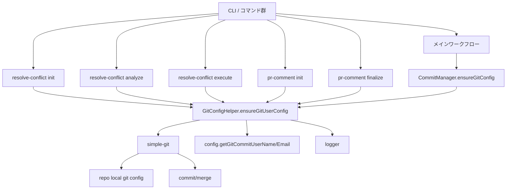
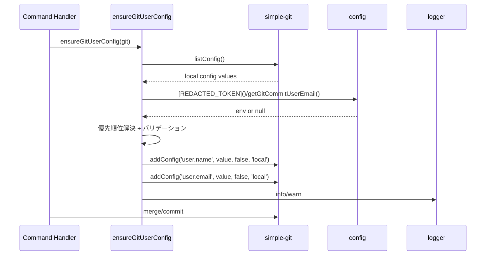

# Codex Agent 実行ログ

開始日時: 2026/2/21 9:55:54

---

## Turn 1: スレッド開始

**Thread ID**: `[REDACTED_TOKEN]`

## Turn 2: ツール実行

**種別**: reasoning
**ステータス**: completed

## Turn 3: ツール実行

**種別**: コマンド実行
**コマンド**: `/bin/bash -lc 'ls -la'`
**ステータス**: completed (exit_code=0)

```text
total 656
drwxr-xr-x. 13 node node  16384 Feb 21 09:26 .
drwxr-xr-x.  3 node node     31 Feb 21 09:26 ..
drwxr-xr-x.  6 node node     71 Feb 21 09:27 .ai-workflow
-rw-r--r--.  1 node node    174 Feb 21 09:26 .eslintrc.json
drwxr-xr-x.  8 node node  16384 Feb 21 09:55 .git
drwxr-xr-x.  3 node node  16384 Feb 21 09:26 .github
-rw-r--r--.  1 node node    485 Feb 21 09:26 .gitignore
-rw-r--r--.  1 node node     65 Feb 21 09:26 .npmrc
-rw-r--r--.  1 node node  13781 Feb 21 09:26 AGENT_TEAMS.md
-rw-r--r--.  1 node node  91137 Feb 21 09:26 CHANGELOG.md
-rw-r--r--.  1 node node  33637 Feb 21 09:26 CLAUDE.md
-rw-r--r--.  1 node node   7172 Feb 21 09:26 [REDACTED_TOKEN].md
-rw-r--r--.  1 node node  15780 Feb 21 09:26 [REDACTED_TOKEN].md
-rw-r--r--.  1 node node  16530 Feb 21 09:26 [REDACTED_TOKEN].md
-rw-r--r--.  1 node node  23454 Feb 21 09:26 [REDACTED_TOKEN].md
-rw-r--r--.  1 node node  24812 Feb 21 09:26 CODEBASE_SUMMARY.md
-rw-r--r--.  1 node node   2434 Feb 21 09:26 Dockerfile
-rw-r--r--.  1 node node  37855 Feb 21 09:26 Jenkinsfile
-rw-r--r--.  1 node node   1063 Feb 21 09:26 LICENSE
-rw-r--r--.  1 node node   4767 Feb 21 09:26 PROGRESS.md
-rw-r--r--.  1 node node  17538 Feb 21 09:26 README.md
-rw-r--r--.  1 node node   1494 Feb 21 09:26 TROUBLESHOOTING.md
drwxr-xr-x.  2 node node     25 Feb 21 09:26 __mocks__
drwxr-xr-x.  2 node node  16384 Feb 21 09:26 docs
drwxr-xr-x.  2 node node     29 Feb 21 09:26 examples
drwxr-xr-x.  4 node node     49 Feb 21 09:26 jenkins
-rw-r--r--.  1 node node   1264 Feb 21 09:26 jest.config.cjs
-rw-r--r--.  1 node node   2296 Feb 21 09:26 metadata.json.template
-rw-r--r--.  1 node node 244700 Feb 21 09:26 package-lock.json
-rw-r--r--.  1 node node   2258 Feb 21 09:26 package.json
drwxr-xr-x.  2 node node    144 Feb 21 09:26 scripts
drwxr-xr-x.  9 node node    153 Feb 21 09:26 src
drwxr-xr-x.  6 node node    107 Feb 21 09:26 tests
drwxr-xr-x.  3 node node     23 Feb 21 09:26 tmp
-rw-r--r--.  1 node node    452 Feb 21 09:26 tsconfig.json
-rw-r--r--.  1 node node    282 Feb 21 09:26 tsconfig.test.json
```

## Turn 4: ツール実行

**種別**: reasoning
**ステータス**: completed

## Turn 5: ツール実行

**種別**: コマンド実行
**コマンド**: `/bin/bash -lc 'ls -la .ai-workflow/issue-749'`
**ステータス**: completed (exit_code=0)

```text
total 8
drwxr-xr-x. 8 node node  165 Feb 21 09:55 .
drwxr-xr-x. 6 node node   71 Feb 21 09:27 ..
drwxr-xr-x. 6 node node   63 Feb 21 09:27 00_planning
drwxr-xr-x. 6 node node   63 Feb 21 09:32 01_requirements
drwxr-xr-x. 6 node node   63 Feb 21 09:38 02_design
drwxr-xr-x. 6 node node   63 Feb 21 09:46 03_test_scenario
drwxr-xr-x. 6 node node   63 Feb 21 09:50 04_implementation
drwxr-xr-x. 6 node node   63 Feb 21 09:55 [REDACTED_TOKEN]
-rw-r--r--. 1 node node 7163 Feb 21 09:55 metadata.json
```

## Turn 6: ツール実行

**種別**: コマンド実行
**コマンド**: `/bin/bash -lc "sed -n '1,200p' .ai-workflow/issue-749/00_planning/output/planning.md"`
**ステータス**: completed (exit_code=0)

```text
# プロジェクト計画書: Issue #749

## resolve-conflict コマンドの全フェーズで git user 設定が未実施のため CI 環境でコミットが失敗する

---

## 1. Issue分析

### 概要

`resolve-conflict` コマンド（init / analyze / execute）の各フェーズで `git commit` や `git merge` を実行する際、`user.name` および `user.email` の設定が行われていないため、Jenkins 等の CI 環境でコミットが失敗する。他のコマンド（`pr-comment` やメインワークフロー）では `ensureGitConfig()` や `git.addConfig()` で事前に Git ユーザー情報を設定しているが、`resolve-conflict` コマンドのみこの処理が欠落している。

### 複雑度: **簡単〜中程度**

- 影響範囲は `resolve-conflict` コマンドの3ファイル（init.ts / analyze.ts / execute.ts）が主対象
- 既存の `ensureGitConfig()` ロジック（`CommitManager` 内）を共通ヘルパーとして抽出する設計作業が含まれる
- フォールバック値（ユーザー名・メールアドレス）のプロジェクト全体統一も対応する
- 既存テストファイル（1,209行）への追加テストケース作成が必要

### 見積もり工数: **6〜10時間**

| 作業 | 見積もり |
|------|---------|
| 要件定義 | 0.5h |
| 設計（共通ヘルパー設計、統一方針決定） | 1h |
| テストシナリオ作成 | 0.5h |
| 共通ヘルパー関数の抽出・実装 | 1.5〜2h |
| resolve-conflict 3ファイルへの適用 | 1〜1.5h |
| テストコード実装 | 1.5〜2h |
| テスト実行・デバッグ | 0.5〜1h |
| ドキュメント・レポート | 0.5〜1h |
| **合計** | **6〜10h** |

### リスク評価: **低**

- 既に確立されたパターン（`CommitManager.ensureGitConfig()`）が存在し、それを再利用する方針
- 影響範囲が限定的（`resolve-conflict` コマンドの3ファイル + 共通ヘルパー1ファイル）
- 既存テストスイートでリグレッションを検出可能

---

## 2. 実装戦略判断

### 実装戦略: **EXTEND**

**判断根拠**:

- 新規モジュールの作成（CREATE）ではない。`ensureGitConfig()` のロジックは既に `CommitManager` クラス内に完成品として存在する（L528-568）
- 既存コードの構造改善（REFACTOR）が主目的でもない。主目的は `resolve-conflict` コマンドに欠落している機能を追加すること
- 既存の `CommitManager.ensureGitConfig()` から Git ユーザー設定ロジックをスタンドアロン関数として抽出し、`resolve-conflict` コマンドの3ファイルに適用する**機能追加（EXTEND）**が中心
- 追加として、`pr-comment` コマンドと `CommitManager` 間のフォールバック値（デフォルトユーザー名・メールアドレス）を統一する改善も含む

### テスト戦略: **UNIT_INTEGRATION**

**判断根拠**:

- **ユニットテスト**: 共通ヘルパー関数（`ensureGitConfig` のスタンドアロン版）の単体動作確認が必要。設定値の優先順位（環境変数 → フォールバック → デフォルト）、バリデーション（名前長、メール形式）のロジックをテストする
- **インテグレーションテスト**: `resolve-conflict` コマンドの各フェーズ（init / analyze / execute）が `git.commit()` / `git.merge()` 前に Git ユーザー設定を正しく呼び出すことを検証する必要がある。既存の統合テスト（`tests/integration/commands/resolve-conflict.test.ts`、1,209行・18テスト）に追加する
- **BDDテスト**: ユーザーストーリー中心のテストは不要（内部インフラの修正であり、エンドユーザーの操作フローに変更はない）

### テストコード戦略: **BOTH_TEST**

**判断根拠**:

- **EXTEND_TEST**: 既存の `tests/integration/commands/resolve-conflict.test.ts` に Git ユーザー設定の検証テストケースを追加する
- **CREATE_TEST**: 新規抽出する共通ヘルパー関数（`ensureGitUserConfig` 等）のユニットテストファイルを新規作成する。現在 `src/core/git/commit-manager.ts` 内の `ensureGitConfig()` に対する独立したユニットテストは存在しない

---

## 3. 影響範囲分析

### 既存コードへの影響

| ファイル | 変更種別 | 変更内容 |
|---------|---------|---------|
| `src/core/git/commit-manager.ts` | 修正 | `ensureGitConfig()` 内のロジックを新しいスタンドアロン関数に委譲するようリファクタリング |
| `src/core/git/git-config-helper.ts` | **新規作成** | Git ユーザー設定の共通ヘルパー関数を配置 |
| `src/commands/resolve-conflict/init.ts` | 修正 | `git.commit()` 前に共通ヘルパー関数を呼び出す処理を追加 |
| `src/commands/resolve-conflict/analyze.ts` | 修正 | `git.merge()` / `git.commit()` 前に共通ヘルパー関数を呼び出す処理を追加 |
| `src/commands/resolve-conflict/execute.ts` | 修正 | `git.commit()` 前に共通ヘルパー関数を呼び出す処理を追加 |
| `src/commands/pr-comment/init.ts` | 修正 | インライン Git 設定を共通ヘルパー関数に置き換え、フォールバック値を統一 |
| `src/commands/pr-comment/finalize.ts` | 修正 | インライン Git 設定（2箇所）を共通ヘルパー関数に置き換え、フォールバック値を統一 |

### テストファイルへの影響

| ファイル | 変更種別 | 変更内容 |
|---------|---------|---------|
| `tests/unit/core/git/git-config-helper.test.ts` | **新規作成** | 共通ヘルパー関数のユニットテスト |
| `tests/integration/commands/resolve-conflict.test.ts` | 修正 | Git ユーザー設定の呼び出し検証テストケース追加 |

### 依存関係の変更

- **新規依存の追加**: なし（既存の `simple-git` と `config` モジュールのみ使用）
- **既存依存の変更**: `CommitManager.ensureGitConfig()` が内部で新しいスタンドアロン関数を利用するように変更されるが、外部インターフェースは変更なし

### マイグレーション要否

- **データベーススキーマ変更**: なし
- **設定ファイル変更**: なし（既存の環境変数 `[REDACTED_TOKEN]` / `[REDACTED_TOKEN]` をそのまま使用）
- **Jenkins パイプライン変更**: 任意。`[REDACTED_TOKEN]` / `[REDACTED_TOKEN]` 環境変数を Jenkinsfile に明示的に追加することを推奨するが、必須ではない（コード側でフォールバック値が設定されるため）

### フォールバック値の統一方針

現状の不整合を解消し、プロジェクト全体で統一する：

| 項目 | CommitManager（現在） | pr-comment（現在） | **統一後** |
|------|----------------------|-------------------|-----------|
| ユーザー名 | `'AI Workflow'` | `'AI Workflow Bot'` | `'AI Workflow'` |
| メールアドレス | `'[REDACTED_EMAIL]'` |
... (truncated)
```

## Turn 7: ツール実行

**種別**: reasoning
**ステータス**: completed

## Turn 8: ツール実行

**種別**: コマンド実行
**コマンド**: `/bin/bash -lc "sed -n '1,200p' .ai-workflow/issue-749/03_test_scenario/output/test-scenario.md"`
**ステータス**: completed (exit_code=0)

```text
# テストシナリオ: Issue #749

## 1. テスト戦略サマリー

- 選択されたテスト戦略: UNIT_INTEGRATION
- テスト対象範囲
- `src/core/git/git-config-helper.ts` の `ensureGitUserConfig()` と定数
- `resolve-conflict` 各フェーズ（init / analyze / execute）での Git 設定適用
- `CommitManager.ensureGitConfig()` の委譲による既存挙動の維持
- `pr-comment` のインライン設定置換による既存挙動の維持
- テスト目的
- Git ユーザー設定の優先順位・バリデーション・ログ出力が要件通りであること
- CI 環境で `resolve-conflict` の commit / merge が失敗しないこと
- 既存機能にリグレッションがないこと

## 2. Unitテストシナリオ

### テストケース名: [REDACTED_TOKEN]正常系_ローカル設定優先
- 目的: 既存のローカル Git 設定がある場合に最優先されることを検証
- 前提条件: `git.listConfig()` が `user.name` / `user.email` を返す
- 入力: `ensureGitUserConfig(git)`
- 期待結果: `git.addConfig('user.name', 既存値, false, 'local')` と `git.addConfig('user.email', 既存値, false, 'local')` が呼び出される
- テストデータ: `user.name='Existing User'`, `user.email='[REDACTED_EMAIL]'`

### テストケース名: [REDACTED_TOKEN]正常系_環境変数優先
- 目的: 環境変数（commit）がローカル設定未設定時に適用されることを検証
- 前提条件: `git.listConfig()` が `user.name` / `user.email` を返さない
- 入力: `config.[REDACTED_TOKEN]()` = `Custom User`, `config.[REDACTED_TOKEN]()` = `[REDACTED_EMAIL]`
- 期待結果: `git.addConfig('user.name', 'Custom User', false, 'local')` と `git.addConfig('user.email', '[REDACTED_EMAIL]', false, 'local')` が呼び出される
- テストデータ: `[REDACTED_TOKEN]='Custom User'`, `[REDACTED_TOKEN]='[REDACTED_EMAIL]'`

### テストケース名: [REDACTED_TOKEN]正常系_フォールバック環境変数適用
- 目的: commit 系環境変数が未設定の場合に author 系環境変数が適用されることを検証
- 前提条件: `git.listConfig()` が空、`getGitCommitUserName/Email` が null
- 入力: `config.getGitAuthorName()` = `Author User`, `config.getGitAuthorEmail()` = `[REDACTED_EMAIL]`
- 期待結果: `git.addConfig('user.name', 'Author User', false, 'local')` と `git.addConfig('user.email', '[REDACTED_EMAIL]', false, 'local')` が呼び出される
- テストデータ: `GIT_AUTHOR_NAME='Author User'`, `GIT_AUTHOR_EMAIL='[REDACTED_EMAIL]'`

### テストケース名: [REDACTED_TOKEN]正常系_デフォルト値適用
- 目的: 環境変数が全て未設定の場合にデフォルト値が適用されることを検証
- 前提条件: `git.listConfig()` が空、`config` が全て null
- 入力: `ensureGitUserConfig(git)`
- 期待結果: `[REDACTED_TOKEN]='AI Workflow'` と `[REDACTED_TOKEN]='[REDACTED_EMAIL]'` が設定される
- テストデータ: なし

### テストケース名: [REDACTED_TOKEN]異常系_ユーザー名長さ不正
- 目的: ユーザー名が 1〜100 文字外の場合に警告してデフォルトへフォールバックすることを検証
- 前提条件: `[REDACTED_TOKEN]()` が 101 文字以上
- 入力: `ensureGitUserConfig(git)`
- 期待結果: `logger.warn()` が呼び出され、`git.addConfig('user.name', [REDACTED_TOKEN], false, 'local')` が呼び出される
- テストデータ: 101 文字のユーザー名

### テストケース名: [REDACTED_TOKEN]異常系_メール形式不正
- 目的: メールに `@` が含まれない場合に警告してデフォルトへフォールバックすることを検証
- 前提条件: `[REDACTED_TOKEN]()` が `invalid-email`
- 入力: `ensureGitUserConfig(git)`
- 期待結果: `logger.warn()` が呼び出され、`git.addConfig('user.email', [REDACTED_TOKEN], false, 'local')` が呼び出される
- テストデータ: `invalid-email`

### テストケース名: [REDACTED_TOKEN]正常系_addConfig引数検証
- 目的: `git.addConfig` が `('user.name' / 'user.email', 値, false, 'local')` で呼ばれることを検証
- 前提条件: `git.listConfig()` が空
- 入力: `ensureGitUserConfig(git)`
- 期待結果: 第3引数が `false`、第4引数が `'local'` である
- テストデータ: デフォルト値または環境変数

### テストケース名: [REDACTED_TOKEN]正常系_ログ出力
- 目的: 設定後に `logger.info()` でユーザー名・メールがログ出力されることを検証
- 前提条件: 正常な設定値が決定される
- 入力: `ensureGitUserConfig(git)`
- 期待結果: `logger.info()` がユーザー名・メールを含むメッセージで呼ばれる
- テストデータ: `Custom User`, `[REDACTED_EMAIL]`

### テストケース名: [REDACTED_TOKEN]異常系_例外発生時継続
- 目的: `git.listConfig()` 等で例外が発生してもエラーを再スローせずワークフローが継続できることを検証
- 前提条件: `git.listConfig()` が例外を投げる
- 入力: `ensureGitUserConfig(git)`
- 期待結果: `logger.warn()` が呼び出され、例外が外に伝播しない
- テストデータ: 例外オブジェクト

### テストケース名: CommitManager.ensureGitConfig_正常系_委譲確認
- 目的: 既存 API のまま共通ヘルパーへ委譲していることを検証
- 前提条件: `CommitManager` が `git` を保持
- 入力: `commitManager.ensureGitConfig()`
- 期待結果: `ensureGitUserConfig(this.git)` が呼び出される
- テストデータ: モック `SimpleGit`

## 3. Integrationテストシナリオ

### シナリオ名: resolve-conflict init + Git設定
- 目的: init フェーズで commit 前に Git 設定が適用されることを検証
- 前提条件: CI 環境相当でグローバル Git 設定なし
- テスト手順:
1. `resolve-conflict init` を実行
2. `git.addConfig('user.name', ...)` / `git.addConfig('user.email', ...)` の呼び出しを監視
3. `git.commit()` の呼び出し順序を確認
-
... (truncated)
```

## Turn 9: ツール実行

**種別**: コマンド実行
**コマンド**: `/bin/bash -lc "sed -n '1,200p' .ai-workflow/issue-749/04_implementation/output/implementation.md"`
**ステータス**: completed (exit_code=0)

```text
# 実装完了レポート

## 変更ファイル一覧

| ファイル | 変更種別 | 概要 |
|---------|---------|------|
| `src/core/git/git-config-helper.ts` | 新規 | Gitユーザー設定の共通ヘルパー関数とデフォルト定数を追加 |
| `src/core/git/commit-manager.ts` | 修正 | `ensureGitConfig()` を共通ヘルパー呼び出しに委譲 |
| `src/commands/resolve-conflict/init.ts` | 修正 | メタデータコミット前に Git ユーザー設定を追加 |
| `src/commands/resolve-conflict/analyze.ts` | 修正 | merge/commit 前に Git ユーザー設定を追加 |
| `src/commands/resolve-conflict/execute.ts` | 修正 | 複数 commit 前に Git ユーザー設定を追加 |
| `src/commands/pr-comment/init.ts` | 修正 | インライン Git 設定を共通ヘルパーに置換 |
| `src/commands/pr-comment/finalize.ts` | 修正 | インライン Git 設定2箇所を共通ヘルパーに置換 |

## 主要な変更点

- Git ユーザー設定を `ensureGitUserConfig()` に集約し、デフォルト値とバリデーションを統一しました。
- `resolve-conflict` の init/analyze/execute 各フェーズで commit/merge 前に共通ヘルパーを呼び出すようにしました。
- `pr-comment` のインライン設定を共通ヘルパーへ置き換え、フォールバック値の不整合を解消しました。
- `CommitManager.ensureGitConfig()` は外部仕様を維持したまま共通ヘルパーへ委譲する構成に変更しました。

## テスト実施状況
- ビルド: ❌ 失敗（未実行）
- リント: ❌ 失敗（未実行）
- 基本動作確認: 未実行
```

## Turn 10: ツール実行

**種別**: コマンド実行
**コマンド**: `/bin/bash -lc "sed -n '1,200p' .ai-workflow/issue-749/02_design/output/design.md"`
**ステータス**: completed (exit_code=0)

```text
# 詳細設計書: Issue #749

## 1. アーキテクチャ設計

### 1.1 システム全体図



### 1.2 コンポーネント間の関係

- `resolve-conflict` の各フェーズは `simple-git` を直接利用し、Git ユーザー設定の共通ヘルパー（新規）を呼び出す。
- `CommitManager.ensureGitConfig()` は既存の外部 API を維持しつつ、内部処理を共通ヘルパーへ委譲する。
- `pr-comment` のインライン設定は共通ヘルパーへ置換する。
- すべての Git ユーザー設定は `config` と `logger` を利用し、`process.env` への直接アクセスは行わない。

### 1.3 データフロー



---

## 2. 実装戦略判断

### 実装戦略: EXTEND

**判断根拠**:
- 既存の `CommitManager.ensureGitConfig()` のロジックを共通化し、既存コマンドへ適用する拡張が主目的。
- 既存ファイルの修正が中心で、新規作成はヘルパーとユニットテストの最小限。
- リファクタリングは副次的で、外部 API を変えずに機能欠落を補う。

---

## 3. テスト戦略判断

### テスト戦略: UNIT_INTEGRATION

**判断根拠**:
- 共通ヘルパーの優先順位・バリデーション・ログ出力はユニットテストで検証が必要。
- `resolve-conflict` の各フェーズで `merge/commit` 前に設定が適用されることは統合テストで検証が必要。

---

## 4. テストコード戦略判断

### テストコード戦略: BOTH_TEST

**判断根拠**:
- 共通ヘルパーのユニットテストは新規ファイル作成が必要。
- `resolve-conflict` の統合テストは既存ファイルの拡張で対応可能。

---

## 5. 影響範囲分析

### 5.1 既存コードへの影響

- `resolve-conflict` の 3 フェーズに Git ユーザー設定の事前適用を追加。
- `CommitManager.ensureGitConfig()` は共通ヘルパーへ委譲するが、外部 API 互換を維持。
- `pr-comment` のインライン設定を共通ヘルパーに置換し、デフォルト値を統一。

### 5.2 依存関係の変更

- 新規外部依存の追加はなし。
- 内部依存として `src/core/git/git-config-helper.ts` が追加され、各コマンドから参照。

### 5.3 マイグレーション要否

- データ移行なし。
- 設定変更なし（環境変数は既存の `[REDACTED_TOKEN]` / `[REDACTED_TOKEN]` を使用）。
- Jenkinsfile への環境変数追加は任意（スコープ外）。

---

## 6. 変更・追加ファイルリスト

### 6.1 新規作成ファイル

- `src/core/git/git-config-helper.ts`
- `tests/unit/core/git/git-config-helper.test.ts`

### 6.2 修正が必要な既存ファイル

- `src/commands/resolve-conflict/init.ts`
- `src/commands/resolve-conflict/analyze.ts`
- `src/commands/resolve-conflict/execute.ts`
- `src/core/git/commit-manager.ts`
- `src/commands/pr-comment/init.ts`
- `src/commands/pr-comment/finalize.ts`
- `tests/integration/commands/resolve-conflict.test.ts`

### 6.3 削除が必要なファイル

- なし

---

## 7. 詳細設計

### 7.1 クラス設計

- 既存のクラス設計は維持し、`CommitManager.ensureGitConfig()` のみ内部委譲に変更。
- 新規にクラスは導入しない（関数ベースのヘルパー）。

### 7.2 関数設計

#### 7.2.1 `ensureGitUserConfig`

- 配置: `src/core/git/git-config-helper.ts`
- シグネチャ: `ensureGitUserConfig(git: SimpleGit): Promise<void>`
- 公開定数:
  - `[REDACTED_TOKEN] = 'AI Workflow'`
  - `[REDACTED_TOKEN] = '[REDACTED_EMAIL]'`

**処理フロー**:
1. `git.listConfig()` でローカル設定の `user.name` / `user.email` を取得。
2. ローカル設定がある場合はそれを優先。
3. ない場合は `config.[REDACTED_TOKEN]()` / `config.[REDACTED_TOKEN]()` を取得。
4. フォールバックとして `config.getGitAuthorName()` / `config.getGitAuthorEmail()` を使用。（既存 `CommitManager.ensureGitConfig()` に合わせる）
5. バリデーション:
   - ユーザー名 1〜100 文字外は警告しデフォルトへ。
   - メールに `@` がなければ警告しデフォルトへ。
6. `git.addConfig('user.name', value, false, 'local')` と `git.addConfig('user.email', value, fals
... (truncated)
```

## Turn 11: ツール実行

**種別**: コマンド実行
**コマンド**: `/bin/bash -lc "sed -n '1,200p' .ai-workflow/issue-749/01_requirements/output/requirements.md"`
**ステータス**: completed (exit_code=0)

```text
# 要件定義書: Issue #749

## resolve-conflict コマンドの全フェーズで git user 設定が未実施のため CI 環境でコミットが失敗する

---

## 0. Planning Document の確認

### 開発計画の全体像

Planning Phase（`planning.md`）にて以下の戦略が策定済み：

- **実装戦略**: EXTEND（既存の `CommitManager.ensureGitConfig()` からロジックを抽出し、共通ヘルパー関数として `resolve-conflict` コマンドに適用）
- **テスト戦略**: UNIT_INTEGRATION（共通ヘルパー関数のユニットテスト + `resolve-conflict` 統合テストの拡張）
- **テストコード戦略**: BOTH_TEST（新規ユニットテスト作成 + 既存統合テスト拡張）
- **複雑度**: 簡単〜中程度（見積もり工数 6〜10 時間）
- **リスク評価**: 低（既存パターンの再利用、限定的な影響範囲）

### Planning Document で策定された主要方針

1. `src/core/git/git-config-helper.ts` を新規作成し、`ensureGitUserConfig()` をスタンドアロン関数として実装
2. `resolve-conflict` の 3 ファイル（init.ts / analyze.ts / execute.ts）に適用
3. `CommitManager.ensureGitConfig()` を新しい共通ヘルパー関数に委譲するようリファクタリング
4. `pr-comment` のインライン Git 設定を共通ヘルパー関数に置き換え
5. フォールバック値（ユーザー名・メールアドレス）をプロジェクト全体で統一

本要件定義書は上記方針を踏まえて策定する。

---

## 1. 概要

### 背景

`resolve-conflict` コマンドは PR のマージコンフリクトを AI で分析・解消するためのコマンドであり、init / analyze / execute / finalize の 4 フェーズで構成される。このうち init / analyze / execute の 3 フェーズでは `simpleGit()` を直接使用して `git.commit()` や `git.merge()` を実行するが、Git ユーザー情報（`user.name` / `user.email`）の事前設定が行われていない。

Jenkins 等の CI 環境ではグローバルな Git ユーザー設定が存在しないため、`resolve-conflict` コマンド実行時に以下のエラーが発生し、コミットおよびマージ操作が失敗する：

```
fatal: unable to auto-detect email address (got 'node@f40376951cc1.(none)')
```

### 目的

1. `resolve-conflict` コマンドの全フェーズ（init / analyze / execute）で Git ユーザー設定を適用し、CI 環境でのコミット・マージ操作を成功させる
2. Git ユーザー設定ロジックを共通ヘルパー関数として抽出し、プロジェクト全体で再利用可能にする
3. フォールバック値（デフォルトユーザー名・メールアドレス）をプロジェクト全体で統一する

### ビジネス価値

- **CI/CD パイプラインの安定化**: Jenkins 環境で `resolve-conflict` ジョブが正常に完了するようになり、PR のマージコンフリクト自動解消ワークフローが実用化される
- **運用コストの削減**: 手動でのコンフリクト解消や Jenkins ジョブの再設定が不要になる

### 技術的価値

- **コードの DRY 原則**: Git ユーザー設定ロジックが 1 箇所に集約され、保守性が向上する
- **統一されたデフォルト値**: プロジェクト全体で Git コミッター情報が一貫し、コミット履歴の追跡が容易になる
- **将来の拡張性**: 新しいコマンドを追加する際に、共通ヘルパー関数を呼び出すだけで Git ユーザー設定が完了する

---

## 2. 機能要件

### FR-1: Git ユーザー設定の共通ヘルパー関数の作成（優先度: 高）

**概要**: `src/core/git/git-config-helper.ts` に `ensureGitUserConfig()` 関数を新規作成する。

**詳細要件**:

| ID | 要件 | 検証方法 |
|----|------|----------|
| FR-1.1 | `ensureGitUserConfig(git: SimpleGit): Promise<void>` のシグネチャで関数を提供する | ユニットテストで関数呼び出しが成功することを確認 |
| FR-1.2 | 設定値の優先順位を以下の順序で解決する: (1) リポジトリローカルの既存 git config → (2) 環境変数 `[REDACTED_TOKEN]` / `[REDACTED_TOKEN]` → (3) フォールバック環境変数 `GIT_AUTHOR_NAME` / `GIT_AUTHOR_EMAIL` → (4) デフォルト値 | ユニットテストで各優先順位の動作を検証 |
| FR-1.3 | デフォルト値として `[REDACTED_TOKEN] = 'AI Workflow'` と `[REDACTED_TOKEN] = '[REDACTED_EMAIL]'` を定数としてエクスポートする | ユニットテストでデフォルト値の適用を検証 |
| FR-1.4 | ユーザー名の長さが 1〜100 文字の範囲外の場合、警告ログを出力しデフォルト値にフォールバックする | ユニットテストでバリデーション動作を検証 |
| FR-1.5 | メールアドレスに `@` が含まれない場合、警告ログを出力しデフォルト値にフォールバックする | ユニットテストでバリデーション動作を検証 |
| FR-1.6 | `git.addConfig('user.name', ..., false, 'local')` および `git.addConfig('user.email', ..., false, 'local')` を使用してリポジトリローカルに設定する | ユニットテストで `addConfig` の呼び出し引数を検証 |
| FR-1.7 | 設定完了後に `logger.info()` で設定されたユーザー名・メールアドレスをログ出力する | ユニットテストでログ出力を検証 |
| FR-1.8 | 環境変数の取得には `config.[REDACTED_TOKEN]()` / `config.[REDACTED_TOKEN]()` を使用する（`process.env` 直接アクセス禁止） | コードレビューで確認 |

### FR-2: resolve-conflict init フェーズへの Git ユーザー設定追加（優先度: 高）

**概要**: `src/commands/resolve-conflict/init.ts` の `git.commit()` 呼び出し前に `ensureGitUserConfig()` を追加する。

**詳細要件**:

| ID | 要件 | 検証方法 |
|----|------|----------|
| FR-2.1 | L48 の `git.commit()` 実行前に `ensureGitUserConfig(git)` を呼び出す | 統合テストで `addConfig` が `commit` 前に呼び出されることを検証 |
| FR-2.2 | `ensureGitUserConfig()` の呼び出しはフェーズの早期段階（`git.commit()` の直前ではなくエントリポイント付近）で実行する | コードレビューで呼び出し位置を確認 |
| FR-2.3 | `ensureGitUserConfig()` がエラーを発生させた場合でも、ワークフロー全体は中断しない（フォールト・トレランス） | 統合テストでエラー時の継続動作を検証 |

### FR-3: resolve-conflict analyze フェーズへの Git ユーザー設定追加（優先度: 高）

**概要**: `src/commands/resolve-conflict/analyze.ts` の `git.merge()` および `git.commit()` 呼び出し前に `ensureGitUserConfig()` を追加する。

**詳細要件**:

| ID | 要件 | 検証方法 |
|----|------|----------|
| FR-3.1 | L88 の `git.raw(['merge', '--no-commit', '--no-ff', ...])` 実行前に `ensureG
... (truncated)
```

## Turn 12: ツール実行

**種別**: reasoning
**ステータス**: completed

## Turn 13: ツール実行

**種別**: コマンド実行
**コマンド**: `/bin/bash -lc "sed -n '1,220p' src/core/git/git-config-helper.ts"`
**ステータス**: completed (exit_code=0)

```text
import type { SimpleGit } from 'simple-git';
import { logger } from '../../utils/logger.js';
import { config } from '../config.js';
import { getErrorMessage } from '../../utils/error-utils.js';

export const [REDACTED_TOKEN] = 'AI Workflow';
export const [REDACTED_TOKEN] = '[REDACTED_EMAIL]';

export async function ensureGitUserConfig(git: SimpleGit): Promise<void> {
  try {
    let userNameFromConfig: string | undefined;
    let userEmailFromConfig: string | undefined;

    try {
      const gitConfig = await git.listConfig();
      userNameFromConfig = gitConfig.all['user.name'] as string | undefined;
      userEmailFromConfig = gitConfig.all['user.email'] as string | undefined;
    } catch (error: unknown) {
      logger.warn(`Failed to read git config: ${getErrorMessage(error)}`);
    }

    let userName: string =
      userNameFromConfig ||
      config.[REDACTED_TOKEN]() ||
      [REDACTED_TOKEN];

    let userEmail: string =
      userEmailFromConfig ||
      config.[REDACTED_TOKEN]() ||
      [REDACTED_TOKEN];

    if (userName.length < 1 || userName.length > 100) {
      logger.warn(
        `User name length is invalid (${userName.length} chars), using default`,
      );
      userName = [REDACTED_TOKEN];
    }

    if (!userEmail.includes('@')) {
      logger.warn(
        `Invalid email format: ${userEmail}, using default`,
      );
      userEmail = [REDACTED_TOKEN];
    }

    await git.addConfig('user.name', userName, false, 'local');
    await git.addConfig('user.email', userEmail, false, 'local');

    logger.info(
      `Git config ensured: user.name=${userName}, user.email=${userEmail}`,
    );
  } catch (error: unknown) {
    logger.warn(`Failed to ensure git config: ${getErrorMessage(error)}`);
  }
}
```

## Turn 14: ツール実行

**種別**: reasoning
**ステータス**: completed

## Turn 15: ツール実行

**種別**: コマンド実行
**コマンド**: `/bin/bash -lc 'rg -n "ensureGitConfig" -n src/core/git/commit-manager.ts'`
**ステータス**: failed (exit_code=127)

```text
/bin/bash: line 1: rg: command not found
```

## Turn 16: ツール実行

**種別**: reasoning
**ステータス**: completed

## Turn 17: ツール実行

**種別**: コマンド実行
**コマンド**: `/bin/bash -lc 'grep -n "ensureGitConfig" -n src/core/git/commit-manager.ts'`
**ステータス**: completed (exit_code=0)

```text
133:    await this.ensureGitConfig();
227:      await this.ensureGitConfig();
286:      await this.ensureGitConfig();
372:    await this.ensureGitConfig();
459:      await this.ensureGitConfig();
533:  public async ensureGitConfig(): Promise<void> {
579:    await this.ensureGitConfig();
645:      await this.ensureGitConfig();
```

## Turn 18: ツール実行

**種別**: コマンド実行
**コマンド**: `/bin/bash -lc "sed -n '520,620p' src/core/git/commit-manager.ts"`
**ステータス**: completed (exit_code=0)

```text
logger.warn(
        `Skipping ${missingFiles.length} non-existent file(s): ${missingFiles.slice(0, 3).join(', ')}${missingFiles.length > 3 ? '...' : ''}`,
      );
    }

    return existingFiles;
  }

  /**
   * Ensure git config (user.name and user.email)
   *
   * Note: Made public for use by SquashManager during finalize command.
   */
  public async ensureGitConfig(): Promise<void> {
    await ensureGitUserConfig(this.git);
  }

  /**
   * Issue #90: ロールバック用のコミットを作成
   * Issue #269: 絶対パスを相対パスに変換してからfilterExistingFilesを呼び出す
   */
  public async commitRollback(
    files: string[],
    toPhase: PhaseName,
    toStep: StepName,
    reason: string,
  ): Promise<CommitResult> {
    if (files.length === 0) {
      logger.warn('No files to commit for rollback.');
      return {
        success: true,
        commit_hash: null,
        files_committed: [],
      };
    }

    // Issue #269: 絶対パスを相対パスに変換
    // rollback.tsから渡されるパスは絶対パスだが、filterExistingFilesは相対パスを期待する
    const relativeFiles = files.map(file => {
      if (isAbsolute(file)) {
        return relative(this.repoPath, file);
      }
      return file;
    });

    logger.debug(`Rollback files (converted to relative): ${relativeFiles.join(', ')}`);

    // Issue #234: Filter out non-existent files before git add
    const existingFiles = this.filterExistingFiles(relativeFiles);

    if (existingFiles.length === 0) {
      logger.warn('No existing files to commit for rollback.');
      return {
        success: true,
        commit_hash: null,
        files_committed: [],
      };
    }

    await this.ensureGitConfig();

    // コミットメッセージ生成
    const commitMessage = `[ai-workflow] Rollback to ${toPhase} (step: ${toStep})

差し戻し理由:
${reason.slice(0, 200)}${reason.length > 200 ? '...' : ''}`;

    try {
      await this.git.add(existingFiles);
      const commitResponse = await this.git.commit(commitMessage, existingFiles, {
        '--no-verify': null,
      });

      logger.debug(`Rollback commit created: ${commitResponse.commit ?? 'unknown'}`);

      return {
        success: true,
        commit_hash: commitResponse.commit ?? null,
        files_committed: existingFiles,
      };
    } catch (error) {
      logger.error(`Git commit failed for rollback: ${getErrorMessage(error)}`);
      return {
        success: false,
        commit_hash: null,
        files_committed: existingFiles,
        error: getErrorMessage(error),
      };
    }
  }

  /**
   * Issue #276: ワークフローディレクトリ削除をコミット
   *
   * finalize コマンドで .ai-workflow/issue-* ディレクトリを削除した後、
   * 削除されたファイルをGitにコミットする。
   *
   * 通常の commitCleanupLogs とは異なり、削除されたファイル（存在しないファイル）を
   * git add -A でステージングしてからコミットする。
   */
  public async [REDACTED_TOKEN](issueNumber: number): Promise<CommitResult> {
```

## Turn 19: ツール実行

**種別**: reasoning
**ステータス**: completed

## Turn 20: ツール実行

**種別**: コマンド実行
**コマンド**: `/bin/bash -lc 'ls -la tests'`
**ステータス**: completed (exit_code=0)

```text
total 56
drwxr-xr-x.  6 node node   107 Feb 21 09:26 .
drwxr-xr-x. 13 node node 16384 Feb 21 09:26 ..
drwxr-xr-x.  2 node node    29 Feb 21 09:26 helpers
drwxr-xr-x.  6 node node 16384 Feb 21 09:26 integration
-rw-r--r--.  1 node node   887 Feb 21 09:26 run-tests.sh
drwxr-xr-x.  2 node node    46 Feb 21 09:26 runtime
-rw-r--r--.  1 node node  1236 Feb 21 09:26 setup-env.ts
drwxr-xr-x. 15 node node 16384 Feb 21 09:26 unit
```

## Turn 21: ツール実行

**種別**: reasoning
**ステータス**: completed

## Turn 22: ツール実行

**種別**: コマンド実行
**コマンド**: `/bin/bash -lc 'ls -la tests/unit/core/git'`
**ステータス**: completed (exit_code=0)

```text
total 40
drwxr-xr-x. 2 node node   109 Feb 21 09:26 .
drwxr-xr-x. 7 node node 16384 Feb 21 09:26 ..
-rw-r--r--. 1 node node  5749 Feb 21 09:26 conflict-parser.test.ts
-rw-r--r--. 1 node node 10314 Feb 21 09:26 conflict-resolver.test.ts
-rw-r--r--. 1 node node  3712 Feb 21 09:26 [REDACTED_TOKEN].test.ts
```

## Turn 23: ツール実行

**種別**: reasoning
**ステータス**: completed

## Turn 24: ツール実行

**種別**: コマンド実行
**コマンド**: `/bin/bash -lc "sed -n '1,160p' tests/unit/core/git/conflict-parser.test.ts"`
**ステータス**: completed (exit_code=0)

```text
import { describe, it, expect, afterEach, jest } from '@jest/globals';
import { ConflictError } from '../../../../src/utils/error-utils.js';
import { hasConflictMarkers, [REDACTED_TOKEN] } from '../../../../src/core/git/conflict-parser.js';

describe('ConflictParser', () => {
  afterEach(() => {
    jest.restoreAllMocks();
  });

  describe('[REDACTED_TOKEN]', () => {
    it('単一コンフリクトブロック_通常形式_正しくパースされる', () => {
      // Given: 通常形式のコンフリクト
      const fileContent =
        'line1\nline2\n<<<<<<< HEAD\nours content line1\nours content line2\n=======\ntheirs content line1\n>>>>>>> feature-branch\nline3\n';

      // When: パース実行
      const blocks = [REDACTED_TOKEN](fileContent, 'src/example.ts');

      // Then: 1件のブロックが返る
      expect(blocks).toHaveLength(1);
      expect(blocks[0].filePath).toBe('src/example.ts');
      expect(blocks[0].startLine).toBe(3);
      expect(blocks[0].endLine).toBe(8);
      expect(blocks[0].oursContent).toBe('ours content line1\nours content line2');
      expect(blocks[0].theirsContent).toBe('theirs content line1');
      expect(blocks[0].baseContent).toBeUndefined();
    });

    it('複数コンフリクトブロック_通常形式_すべて正しくパースされる', () => {
      // Given: 複数ブロック
      const fileContent =
        '<<<<<<< HEAD\nours1\n=======\ntheirs1\n>>>>>>> branch\nsome code\n<<<<<<< HEAD\nours2\n=======\ntheirs2\n>>>>>>> branch\n';

      // When: パース実行
      const blocks = [REDACTED_TOKEN](fileContent, 'src/multi.ts');

      // Then: 2件のブロックが返る
      expect(blocks).toHaveLength(2);
      expect(blocks[0].oursContent).toBe('ours1');
      expect(blocks[0].theirsContent).toBe('theirs1');
      expect(blocks[1].oursContent).toBe('ours2');
      expect(blocks[1].theirsContent).toBe('theirs2');
      expect(blocks[0].startLine).toBe(1);
      expect(blocks[0].endLine).toBe(5);
      expect(blocks[1].startLine).toBe(7);
      expect(blocks[1].endLine).toBe(11);
    });

    it('diff3形式_baseContentが正しく抽出される', () => {
      // Given: diff3形式
      const fileContent =
        '<<<<<<< HEAD\nours content\n||||||| merged common ancestors\nbase content\n=======\ntheirs content\n>>>>>>> feature\n';

      // When: パース実行
      const blocks = [REDACTED_TOKEN](fileContent, 'src/diff3.ts');

      // Then: baseContentが含まれる
      expect(blocks).toHaveLength(1);
      expect(blocks[0].oursContent).toBe('ours content');
      expect(blocks[0].baseContent).toBe('base content');
      expect(blocks[0].theirsContent).toBe('theirs content');
    });

    it('コンフリクトなし_空配列を返す', () => {
      // Given: コンフリクト無し
      const fileContent = 'const a = 1;\nconst b = 2;\nconsole.log(a + b);\n';

      // When: パース実行
      const blocks = [REDACTED_TOKEN](fileContent, 'src/clean.ts');

      // Then: 空配列
      expect(blocks).toEqual([]);
    });

    it('空ファイル_空配列を返す', () => {
      // Given: 空文字
      const fileContent = '';

      // When: パース実行
      const blocks = [REDACTED_TOKEN](fileContent, 'src/empty.ts');

      // Then: 空配列
      expect(blocks).toEqual([]);
    });

    it('不完全なマーカー_開始のみ_ConflictErrorがスローされる', () => {
      // Given: 不完全なマーカー
      const fileContent = '<<<<<<< HEAD\nsome content\nno closing markers\n';

      // When / Then: ConflictError
      expect(() => [REDACTED_TOKEN](fileContent, 'src/broken.ts')).toThrow(ConflictError);
    });

    it('Unicode文字を含むコンフリクト_正しくパースされる', () => {
      // Given: 日本語を含むコンフリクト
      const fileContent =
        "<<<<<<< HEAD\nconst msg = '変更A';\n=======\nconst msg = '変更B';\n>>>>>>> feature\n";

      // When: パース実行
      const blocks = [REDACTED_TOKEN](fileContent, 'src/i18n.ts');

      // Then: 日本語が保持される
      expect(blocks).toHaveLength(1);
      expect(blocks[0].oursContent).toBe("const msg = '変更A';");
      expect(blocks[0].theirsContent).toBe("const msg = '変更B';");
    });

    it('大量のコンフリクトブロック_パフォーマンスが許容範囲内', () => {
      // Given: 50ブロックのコンフリクト
      const blocks = Array.from({ length: 50 }, () =>
        '<<<<<<< HEAD\nours\n=======\ntheirs\n>>>>>>> b
... (truncated)
```

## Turn 25: ツール実行

**種別**: reasoning
**ステータス**: completed

## Turn 26: ツール実行

**種別**: コマンド実行
**コマンド**: `/bin/bash -lc "sed -n '1,200p' tests/integration/commands/resolve-conflict.test.ts"`
**ステータス**: completed (exit_code=0)

```text
import { describe, it, expect, beforeAll, beforeEach, afterEach, jest } from '@jest/globals';
import { promises as fsp } from 'node:fs';
import path from 'node:path';
import os from 'node:os';
import { [REDACTED_TOKEN] } from '../../../src/core/conflict/metadata-manager.js';
import type { [REDACTED_TOKEN] } from '../../../src/types/conflict.js';

const [REDACTED_TOKEN] = jest.fn();
const [REDACTED_TOKEN] = jest.fn();

const simpleGitMock = jest.fn();
const [REDACTED_TOKEN] = jest.fn();
const createPlanMock = jest.fn();
const resolveMock = jest.fn();
const applyMock = jest.fn();

const [REDACTED_TOKEN] = {
  getPullRequestInfo: jest.fn(),
  getMergeableStatus: jest.fn(),
  postComment: jest.fn(),
};

let handleResolveConflictInitCommand: (options: { prUrl: string; language?: string }) => Promise<void>;
let handleResolveConflictAnalyzeCommand: (options: { prUrl: string; agent?: 'auto' | 'codex' | 'claude'; language?: string }) => Promise<void>;
let handleResolveConflictExecuteCommand: (options: { prUrl: string; agent?: 'auto' | 'codex' | 'claude'; dryRun?: boolean; language?: string }) => Promise<void>;
let handleResolveConflictFinalizeCommand: (options: { prUrl: string; push?: boolean; squash?: boolean; language?: string }) => Promise<void>;

beforeAll(async () => {
  await jest.unstable_mockModule('../../../src/core/repository-utils.js', () => ({
    __esModule: true,
    parsePullRequestUrl: [REDACTED_TOKEN],
    resolveRepoPathFromPrUrl: [REDACTED_TOKEN],
  }));

  await jest.unstable_mockModule('simple-git', () => ({
    __esModule: true,
    default: simpleGitMock,
  }));

  await jest.unstable_mockModule('../../../src/core/github-client.js', () => ({
    __esModule: true,
    GitHubClient: jest.fn().mockImplementation(() => [REDACTED_TOKEN]),
  }));

  await jest.unstable_mockModule('../../../src/core/git/merge-context-collector.js', () => ({
    __esModule: true,
    MergeContextCollector: jest.fn().mockImplementation(() => ({
      collect: [REDACTED_TOKEN],
    })),
  }));

  await jest.unstable_mockModule('../../../src/core/git/conflict-resolver.js', () => ({
    __esModule: true,
    ConflictResolver: jest.fn().mockImplementation(() => ({
      createResolutionPlan: createPlanMock,
      resolve: resolveMock,
    })),
  }));

  await jest.unstable_mockModule('../../../src/core/pr-comment/change-applier.js', () => ({
    __esModule: true,
    CodeChangeApplier: jest.fn().mockImplementation(() => ({
      apply: applyMock,
    })),
  }));

  ({ [REDACTED_TOKEN] } = await import('../../../src/commands/resolve-conflict/init.js'));
  ({ [REDACTED_TOKEN] } = await import('../../../src/commands/resolve-conflict/analyze.js'));
  ({ [REDACTED_TOKEN] } = await import('../../../src/commands/resolve-conflict/execute.js'));
  ({ [REDACTED_TOKEN] } = await import('../../../src/commands/resolve-conflict/finalize.js'));
});

describe('resolve-conflict コマンド統合テスト', () => {
  let repoRoot: string;
  const prUrl = 'https://github.com/owner/repo/pull/42';

  beforeEach(async () => {
    jest.clearAllMocks();

    repoRoot = await fsp.mkdtemp(path.join(os.tmpdir(), 'resolve-conflict-'));
    [REDACTED_TOKEN].mockReturnValue({
      owner: 'owner',
      repo: 'repo',
      prNumber: 42,
      repositoryName: 'owner/repo',
    });
    [REDACTED_TOKEN].mockReturnValue(repoRoot);

    [REDACTED_TOKEN].getPullRequestInfo.mockResolvedValue({ base: 'main', head: 'feature' });
    [REDACTED_TOKEN].getMergeableStatus.mockResolvedValue({ mergeable: true, mergeableState: 'clean' });
    [REDACTED_TOKEN].postComment.mockResolvedValue({ success: true });

    applyMock.mockResolvedValue({ success: true, applied_files: ['src/conflict.ts'], skipped_files: [] });
  });

  afterEach(() => {
    jest.restoreAllMocks();
  });

  it('正常系_コンフリクトありPRの完全解消フロー', async () => {
    // Giv
... (truncated)
```

## Turn 27: ツール実行

**種別**: reasoning
**ステータス**: completed

## Turn 28: ツール実行

**種別**: コマンド実行
**コマンド**: `/bin/bash -lc "sed -n '200,520p' tests/integration/commands/resolve-conflict.test.ts"`
**ステータス**: completed (exit_code=0)

```text
);

    const plan: [REDACTED_TOKEN] = {
      prNumber: 42,
      baseBranch: 'main',
      headBranch: 'feature',
      generatedAt: '2024-01-01T00:00:00Z',
      resolutions: [
        { filePath: 'src/conflict.ts', strategy: 'manual-merge', resolvedContent: 'resolved' },
      ],
      skippedFiles: [],
      warnings: [],
    };

    [REDACTED_TOKEN].mockResolvedValue({
      conflictFiles: [
        { filePath: 'src/conflict.ts', startLine: 1, endLine: 5, oursContent: 'ours', theirsContent: 'theirs' },
      ],
      oursLog: [],
      theirsLog: [],
      prDescription: '',
      relatedIssues: [],
      contextSnippets: [],
    });

    createPlanMock.mockResolvedValue(plan);
    resolveMock.mockResolvedValue(plan.resolutions);

    const gitInit = {
      fetch: jest.fn().mockResolvedValue(undefined),
      add: jest.fn().mockResolvedValue(undefined),
      commit: jest.fn().mockResolvedValue(undefined),
    };

    const gitAnalyze = {
      fetch: jest.fn().mockResolvedValue(undefined),
      status: jest
        .fn()
        .[REDACTED_TOKEN]({ files: [], current: 'main', conflicted: [] })
        .[REDACTED_TOKEN]({ files: [{ path: 'src/conflict.ts' }], current: 'main', conflicted: ['src/conflict.ts'] }),
      branchLocal: jest.fn().mockResolvedValue({ all: ['main'] }),
      checkout: jest.fn().mockResolvedValue(undefined),
      checkoutBranch: jest.fn().mockResolvedValue(undefined),
      raw: jest.fn().mockResolvedValue(''),
      add: jest.fn().mockResolvedValue(undefined),
      commit: jest.fn().mockResolvedValue(undefined),
    };

    const gitInstances = [gitInit, gitAnalyze];
    simpleGitMock.mockImplementation(() => gitInstances.shift());

    await [REDACTED_TOKEN]({ prUrl, language: 'ja' });
    await [REDACTED_TOKEN]({ prUrl, agent: 'auto', language: 'ja' });

    // When: execute を dryRun で実行
    await [REDACTED_TOKEN]({ prUrl, agent: 'auto', dryRun: true });

    // Then: 解消結果ファイルが作成されない
    const outputDir = path.join(repoRoot, '.ai-workflow', 'conflict-42');
    await expect(fsp.access(path.join(outputDir, 'resolution-result.json'))).rejects.toThrow();
    await expect(fsp.access(path.join(outputDir, 'resolution-result.md'))).rejects.toThrow();
  });

  it('analyze_コンフリクト無し_早期終了して計画を作成しない', async () => {
    // Given: init 済みのメタデータとコンフリクトなしの状態
    const gitInit = {
      fetch: jest.fn().mockResolvedValue(undefined),
      add: jest.fn().mockResolvedValue(undefined),
      commit: jest.fn().mockResolvedValue(undefined),
    };

    const gitAnalyze = {
      fetch: jest.fn().mockResolvedValue(undefined),
      status: jest
        .fn()
        .[REDACTED_TOKEN]({ files: [], current: 'main', conflicted: [] })
        .[REDACTED_TOKEN]({ files: [], current: 'main', conflicted: [] }),
      branchLocal: jest.fn().mockResolvedValue({ all: ['main', 'feature'] }),
      checkout: jest.fn().mockResolvedValue(undefined),
      checkoutBranch: jest.fn().mockResolvedValue(undefined),
      raw: jest.fn().mockResolvedValue(''),
      add: jest.fn().mockResolvedValue(undefined),
      commit: jest.fn().mockResolvedValue(undefined),
    };

    const gitInstances = [gitInit, gitAnalyze];
    simpleGitMock.mockImplementation(() => gitInstances.shift());

    await [REDACTED_TOKEN]({ prUrl, language: 'ja' });

    // When: analyze 実行
    await [REDACTED_TOKEN]({ prUrl, agent: 'auto', language: 'ja' });

    // Then: analyzed になり、計画ファイルは生成されない
    const metadataManager = new [REDACTED_TOKEN](repoRoot, 42);
    const metadata = await metadataManager.getMetadata();
    expect(metadata.status).toBe('analyzed');
    expect(metadata.conflictFiles).toHaveLength(0);
    expect(metadata.resolutionPlanPath).toBeUndefined();
    expect(gitAnalyze.add).not.toHaveBeenCalled();
    expect(gitAnalyze.commit).not.toHaveBeenCalled();

    const planJsonPath = path.join(repoRoot, '.ai-workflow', '
... (truncated)
```

## Turn 29: ツール実行

**種別**: reasoning
**ステータス**: completed

## Turn 30: ツール実行

**種別**: コマンド実行
**コマンド**: `/bin/bash -lc "sed -n '520,1040p' tests/integration/commands/resolve-conflict.test.ts"`
**ステータス**: completed (exit_code=0)

```text
add: jest.fn().mockResolvedValue(undefined),
      commit: jest.fn().mockResolvedValue(undefined),
    };

    const gitAnalyze = {
      fetch: jest.fn().mockResolvedValue(undefined),
      status: jest
        .fn()
        .[REDACTED_TOKEN]({ files: [], current: 'main', conflicted: [] })
        .[REDACTED_TOKEN]({ files: [{ path: 'src/conflict.ts' }], current: 'main', conflicted: ['src/conflict.ts'] }),
      branchLocal: jest.fn().mockResolvedValue({ all: ['main', 'feature'] }),
      checkout: jest.fn().mockResolvedValue(undefined),
      checkoutBranch: jest.fn().mockResolvedValue(undefined),
      raw: jest.fn().mockResolvedValue(''),
      add: jest.fn().mockResolvedValue(undefined),
      commit: jest.fn().mockResolvedValue(undefined),
    };

    const gitInstances = [gitInit, gitAnalyze];
    simpleGitMock.mockImplementation(() => gitInstances.shift());

    await [REDACTED_TOKEN]({ prUrl, language: 'ja' });

    // When: analyze を agent/language 指定で実行
    await [REDACTED_TOKEN]({ prUrl, agent: 'codex', language: 'en' });

    // Then: ConflictResolver にオプションが渡される
    expect(createPlanMock).[REDACTED_TOKEN](
      expect.any(Object),
      expect.objectContaining({ agent: 'codex', language: 'en' }),
    );
  });

  it('execute_agentと言語オプションが解消処理に渡される', async () => {
    // Given: 事前に init/analyze を実行
    const conflictFilePath = path.join(repoRoot, 'src/conflict.ts');
    await fsp.mkdir(path.dirname(conflictFilePath), { recursive: true });
    await fsp.writeFile(
      conflictFilePath,
      '<<<<<<< HEAD\nours\n=======\ntheirs\n>>>>>>> feature\n',
      'utf-8',
    );

    const plan: [REDACTED_TOKEN] = {
      prNumber: 42,
      baseBranch: 'main',
      headBranch: 'feature',
      generatedAt: '2024-01-01T00:00:00Z',
      resolutions: [
        { filePath: 'src/conflict.ts', strategy: 'manual-merge', resolvedContent: 'resolved' },
      ],
      skippedFiles: [],
      warnings: [],
    };

    [REDACTED_TOKEN].mockResolvedValue({
      conflictFiles: [
        { filePath: 'src/conflict.ts', startLine: 1, endLine: 5, oursContent: 'ours', theirsContent: 'theirs' },
      ],
      oursLog: [],
      theirsLog: [],
      prDescription: '',
      relatedIssues: [],
      contextSnippets: [],
    });

    createPlanMock.mockResolvedValue(plan);
    resolveMock.mockResolvedValue(plan.resolutions);

    const gitInit = {
      fetch: jest.fn().mockResolvedValue(undefined),
      add: jest.fn().mockResolvedValue(undefined),
      commit: jest.fn().mockResolvedValue(undefined),
    };

    const gitAnalyze = {
      fetch: jest.fn().mockResolvedValue(undefined),
      status: jest
        .fn()
        .[REDACTED_TOKEN]({ files: [], current: 'main', conflicted: [] })
        .[REDACTED_TOKEN]({ files: [{ path: 'src/conflict.ts' }], current: 'main', conflicted: ['src/conflict.ts'] }),
      branchLocal: jest.fn().mockResolvedValue({ all: ['main'] }),
      checkout: jest.fn().mockResolvedValue(undefined),
      checkoutBranch: jest.fn().mockResolvedValue(undefined),
      raw: jest.fn().mockResolvedValue(''),
      add: jest.fn().mockResolvedValue(undefined),
      commit: jest.fn().mockResolvedValue(undefined),
    };

    const gitExecute = {
      add: jest.fn().mockResolvedValue(undefined),
      status: jest.fn().mockResolvedValue({ files: [{ path: 'src/conflict.ts' }], current: 'feature' }),
      commit: jest.fn().mockResolvedValue(undefined),
    };

    const gitInstances = [gitInit, gitAnalyze, gitExecute];
    simpleGitMock.mockImplementation(() => gitInstances.shift());

    await [REDACTED_TOKEN]({ prUrl, language: 'ja' });
    await [REDACTED_TOKEN]({ prUrl, agent: 'auto', language: 'ja' });

    // When: execute を agent/language 指定で実行
    await [REDACTED_TOKEN]({ prUrl, agent: 'claude', dryRun: false, language: 'en' });

    // Then: ConflictResolver にオプションが渡される
    expect(res
... (truncated)
```

## Turn 31: ツール実行

**種別**: reasoning
**ステータス**: completed

## Turn 32: ツール実行

**種別**: コマンド実行
**コマンド**: `/bin/bash -lc "sed -n '1040,1560p' tests/integration/commands/resolve-conflict.test.ts"`
**ステータス**: completed (exit_code=0)

```text
simpleGitMock.mockImplementation(() => gitInstances.shift());

    const exitSpy = jest.spyOn(process, 'exit').mockImplementation((code?: number | string | null | undefined) => {
      throw new Error(`process.exit: ${code}`);
    }) as unknown as jest.SpyInstance;

    await [REDACTED_TOKEN]({ prUrl, language: 'ja' });
    await [REDACTED_TOKEN]({ prUrl, agent: 'auto', language: 'ja' });
    await [REDACTED_TOKEN]({ prUrl, agent: 'auto', dryRun: false, language: 'ja' });

    expect(gitExecute.add).[REDACTED_TOKEN](2);
    expect(gitExecute.commit).[REDACTED_TOKEN](2);
    expect(gitExecute.commit).[REDACTED_TOKEN]('resolve-conflict: execute artifacts for PR #42');
    expect(exitSpy).not.toHaveBeenCalled();
  });

  it('executeの成果物コミット失敗時にワークフローが続行すること', async () => {
    // 目的: execute 成果物の commit 失敗時でもワークフローが続行することを確認する
    const conflictFilePath = path.join(repoRoot, 'src/conflict.ts');
    await fsp.mkdir(path.dirname(conflictFilePath), { recursive: true });
    await fsp.writeFile(
      conflictFilePath,
      '<<<<<<< HEAD\nours\n=======\ntheirs\n>>>>>>> feature\n',
      'utf-8',
    );

    const plan: [REDACTED_TOKEN] = {
      prNumber: 42,
      baseBranch: 'main',
      headBranch: 'feature',
      generatedAt: '2024-01-01T00:00:00Z',
      resolutions: [
        { filePath: 'src/conflict.ts', strategy: 'manual-merge', resolvedContent: 'resolved' },
      ],
      skippedFiles: [],
      warnings: [],
    };

    [REDACTED_TOKEN].mockResolvedValue({
      conflictFiles: [
        { filePath: 'src/conflict.ts', startLine: 1, endLine: 5, oursContent: 'ours', theirsContent: 'theirs' },
      ],
      oursLog: [],
      theirsLog: [],
      prDescription: '',
      relatedIssues: [],
      contextSnippets: [],
    });

    createPlanMock.mockResolvedValue(plan);
    resolveMock.mockResolvedValue(plan.resolutions);

    const gitInit = {
      fetch: jest.fn().mockResolvedValue(undefined),
      add: jest.fn().mockResolvedValue(undefined),
      commit: jest.fn().mockResolvedValue(undefined),
    };

    const gitAnalyze = {
      fetch: jest.fn().mockResolvedValue(undefined),
      status: jest
        .fn()
        .[REDACTED_TOKEN]({ files: [], current: 'main', conflicted: [] })
        .[REDACTED_TOKEN]({ files: [{ path: 'src/conflict.ts' }], current: 'main', conflicted: ['src/conflict.ts'] }),
      branchLocal: jest.fn().mockResolvedValue({ all: ['main'] }),
      checkout: jest.fn().mockResolvedValue(undefined),
      checkoutBranch: jest.fn().mockResolvedValue(undefined),
      raw: jest.fn().mockResolvedValue(''),
      add: jest.fn().mockResolvedValue(undefined),
      commit: jest.fn().mockResolvedValue(undefined),
    };

    const gitExecute = {
      add: jest.fn().mockResolvedValue(undefined),
      status: jest.fn().mockResolvedValue({ files: [{ path: 'src/conflict.ts' }], current: 'feature' }),
      commit: jest.fn()
        .[REDACTED_TOKEN](undefined)
        .[REDACTED_TOKEN](new Error('nothing to commit')),
    };

    const gitInstances = [gitInit, gitAnalyze, gitExecute];
    simpleGitMock.mockImplementation(() => gitInstances.shift());

    const exitSpy = jest.spyOn(process, 'exit').mockImplementation((code?: number | string | null | undefined) => {
      throw new Error(`process.exit: ${code}`);
    }) as unknown as jest.SpyInstance;

    await [REDACTED_TOKEN]({ prUrl, language: 'ja' });
    await [REDACTED_TOKEN]({ prUrl, agent: 'auto', language: 'ja' });
    await [REDACTED_TOKEN]({ prUrl, agent: 'auto', dryRun: false, language: 'ja' });

    const resultJsonPath = path.join(repoRoot, '.ai-workflow', 'conflict-42', 'resolution-result.json');
    await expect(fsp.access(resultJsonPath)).resolves.not.toThrow();
    expect(gitExecute.commit).[REDACTED_TOKEN](2);
    expect(exitSpy).not.toHaveBeenCalled();
  });

  it('init_analyze シー
... (truncated)
```

## Turn 33: ツール実行

**種別**: reasoning
**ステータス**: completed

## Turn 34: ツール実行

**種別**: コマンド実行
**コマンド**: `/bin/bash -lc 'grep -R "CommitManager" -n tests/unit tests/integration | head'`
**ステータス**: completed (exit_code=0)

```text
tests/unit/git/commit-manager.test.ts:2: * Unit tests for CommitManager
tests/unit/git/commit-manager.test.ts:9:import { CommitManager } from '../../../src/core/git/commit-manager';
tests/unit/git/commit-manager.test.ts:17:describe('CommitManager - Message Generation', () => {
tests/unit/git/commit-manager.test.ts:18:  let commitManager: CommitManager;
tests/unit/git/commit-manager.test.ts:57:    commitManager = new CommitManager(
tests/unit/git/commit-manager.test.ts:102:describe('CommitManager - Commit Operations', () => {
tests/unit/git/commit-manager.test.ts:103:  let commitManager: CommitManager;
tests/unit/git/commit-manager.test.ts:176:    commitManager = new CommitManager(
tests/unit/git/commit-manager.test.ts:353:describe('CommitManager - SecretMasker Integration', () => {
tests/unit/git/commit-manager.test.ts:354:  let commitManager: CommitManager;
```

## Turn 35: ツール実行

**種別**: reasoning
**ステータス**: completed

## Turn 36: ツール実行

**種別**: コマンド実行
**コマンド**: `/bin/bash -lc "sed -n '1,120p' tests/unit/git/commit-manager.test.ts"`
**ステータス**: completed (exit_code=0)

```text
/**
 * Unit tests for CommitManager
 * Tests commit operations, message generation, and SecretMasker integration
 */

// @ts-nocheck

import { describe, test, expect, beforeEach, jest, afterEach } from '@jest/globals';
import { CommitManager } from '../../../src/core/git/commit-manager';
import { MetadataManager } from '../../../src/core/metadata-manager';
import { SecretMasker } from '../../../src/core/secret-masker';
import { SimpleGit } from 'simple-git';
import path from 'node:path';
import os from 'node:os';
import fs from 'fs-extra';

describe('CommitManager - Message Generation', () => {
  let commitManager: CommitManager;
  let mockGit: jest.Mocked<SimpleGit>;
  let mockMetadata: jest.Mocked<MetadataManager>;
  let mockSecretMasker: jest.Mocked<SecretMasker>;

  beforeEach(() => {
    // Mock SimpleGit
    mockGit = {
      status: jest.fn(),
      add: jest.fn(),
      commit: jest.fn(),
      addConfig: jest.fn(),
      listConfig: jest.fn().mockResolvedValue({ all: {} }),
    } as any;

    // Mock MetadataManager
    mockMetadata = {
      data: {
        issue_number: '25',
        issue_title: '[REFACTOR] Git Manager の操作別分割',
        branch_name: 'feature/issue-25',
      },
      getData: jest.fn().mockReturnValue({
        issue_number: '25',
        issue_title: '[REFACTOR] Git Manager の操作別分割',
        branch_name: 'feature/issue-25',
      }),
      getIssueNumber: jest.fn().mockReturnValue('25'),
    } as any;

    // Mock SecretMasker
    mockSecretMasker = {
      maskSecretsInWorkflowDir: jest.fn().mockResolvedValue({
        filesProcessed: 1,
        secretsMasked: 2,
        errors: [],
      }),
    } as any;

    commitManager = new CommitManager(
      mockGit,
      mockMetadata,
      mockSecretMasker,
      '/test/repo'
    );
  });

  describe('createCommitMessage', () => {
    test('[REDACTED_TOKEN]正常系_Phase完了時のメッセージ生成', () => {
      // Given: Phase番号、Status、Review result、Issue番号
      const phaseName = 'requirements';
      const status = 'completed';
      const reviewResult = 'PASS';

      // When: createCommitMessage を呼び出す
      const message = commitManager.createCommitMessage(phaseName, status, reviewResult);

      // Then: 正しいフォーマットのメッセージが生成される
      expect(message).toContain('Phase 2 (requirements)');
      expect(message).toContain('completed');
      expect(message).toContain('Review: PASS');
      expect(message).toContain('Issue: #25');
    });

    test('[REDACTED_TOKEN]境界値_Phase番号にアンダースコアなし', () => {
      // Given: Phase番号がアンダースコアなし
      const phaseName = 'requirements';
      const status = 'completed';
      const reviewResult = 'PASS';

      // When: createCommitMessage を呼び出す
      const message = commitManager.createCommitMessage(phaseName, status, reviewResult);

      // Then: アンダースコアなしでも正しく動作する
      expect(message).toContain('Phase 2 (requirements)');
      expect(message).toContain('Issue: #25');
    });
  });

  // Note: [REDACTED_TOKEN], [REDACTED_TOKEN], [REDACTED_TOKEN]
  // have been moved to [REDACTED_TOKEN] module.
  // See tests/unit/git/commit-message-builder.test.ts for these tests
});

describe('CommitManager - Commit Operations', () => {
  let commitManager: CommitManager;
  let mockGit: jest.Mocked<SimpleGit>;
  let mockMetadata: jest.Mocked<MetadataManager>;
  let mockSecretMasker: jest.Mocked<SecretMasker>;
  const testRepoDir = path.join(os.tmpdir(), '[REDACTED_TOKEN]-' + Date.now());

  beforeEach(() => {
    // Create real test files on disk (Option 1 from plan - avoid ESM mocking issues)
    fs.ensureDirSync(path.join(testRepoDir, '.ai-workflow/issue-25/01_requirements/output'));
    fs.ensureDirSync(path.join(testRepoDir, '.ai-workflow/issue-25/04_implementation'));
    fs.ensureDirSync(path.join(testRepoDir, 'src'));

    fs.writeFileSync(
      path.join(testRepoDir, '.ai-workflow/issue-25/01_requirements/output/requirements.md'),
      '# Test Requirements',
      'utf-8'
    );
    fs.writeFil
... (truncated)
```

## Turn 37: ツール実行

**種別**: reasoning
**ステータス**: completed

## Turn 38: ツール実行

**種別**: コマンド実行
**コマンド**: `/bin/bash -lc 'grep -n "ensureGitConfig" -n tests/unit/git/commit-manager.test.ts'`
**ステータス**: completed (exit_code=0)

```text
500:  describe('ensureGitConfig', () => {
501:    test('ensureGitConfig_正常系_Git設定を自動設定', async () => {
506:      // When: ensureGitConfig を呼び出す
507:      await (commitManager as any).ensureGitConfig();
```

## Turn 39: ツール実行

**種別**: コマンド実行
**コマンド**: `/bin/bash -lc "sed -n '480,560p' tests/unit/git/commit-manager.test.ts"`
**ステータス**: completed (exit_code=0)

```text
issue_number: '25',
      },
      getData: jest.fn().mockReturnValue({
        issue_number: '25',
      }),
      getIssueNumber: jest.fn().mockReturnValue('25'),
    } as any;

    mockSecretMasker = {
      maskSecretsInWorkflowDir: jest.fn(),
    } as any;

    commitManager = new CommitManager(
      mockGit,
      mockMetadata,
      mockSecretMasker,
      '/test/repo'
    );
  });

  describe('ensureGitConfig', () => {
    test('ensureGitConfig_正常系_Git設定を自動設定', async () => {
      // Given: Git設定が未完了、環境変数が設定されている
      process.env.[REDACTED_TOKEN] = 'Claude AI';
      process.env.[REDACTED_TOKEN] = '[REDACTED_EMAIL]';

      // When: ensureGitConfig を呼び出す
      await (commitManager as any).ensureGitConfig();

      // Then: Git設定が実行される
      expect(mockGit.addConfig).[REDACTED_TOKEN]('user.name', 'Claude AI', false, 'local');
      expect(mockGit.addConfig).[REDACTED_TOKEN]('user.email', '[REDACTED_EMAIL]', false, 'local');

      // Cleanup
      delete process.env.[REDACTED_TOKEN];
      delete process.env.[REDACTED_TOKEN];
    });
  });
});
```

## Turn 40: ツール実行

**種別**: reasoning
**ステータス**: completed

## Turn 41: ツール実行

**種別**: コマンド実行
**コマンド**: `/bin/bash -lc 'grep -n "[REDACTED_TOKEN]" -n src/core/config.ts'`
**ステータス**: completed (exit_code=0)

```text
105:  [REDACTED_TOKEN](): string | null;
310:  public [REDACTED_TOKEN](): string | null {
```

## Turn 42: ツール実行

**種別**: コマンド実行
**コマンド**: `/bin/bash -lc "sed -n '300,340p' src/core/config.ts"`
**ステータス**: completed (exit_code=0)

```text
return this.getEnv('CLAUDE_MODEL', false);
  }

  public getCodexModel(): string | null {
    // CODEX_MODEL 環境変数（エイリアスまたはフルモデルID）
    return this.getEnv('CODEX_MODEL', false);
  }

  // ========== Git関連 ==========

  public [REDACTED_TOKEN](): string | null {
    // [REDACTED_TOKEN] → GIT_AUTHOR_NAME のフォールバック
    return this.getEnvWithFallback('[REDACTED_TOKEN]', 'GIT_AUTHOR_NAME');
  }

  public [REDACTED_TOKEN](): string | null {
    // [REDACTED_TOKEN] → GIT_AUTHOR_EMAIL のフォールバック
    return this.getEnvWithFallback('[REDACTED_TOKEN]', 'GIT_AUTHOR_EMAIL');
  }

  // ========== パス関連 ==========

  public getHomeDir(): string {
    // HOME → USERPROFILE のフォールバック（必須）
    const home = this.getEnvWithFallback('HOME', 'USERPROFILE');
    if (!home) {
      throw new Error(
        'HOME or USERPROFILE environment variable is required. ' +
          'Please ensure your system has a valid home directory.',
      );
    }
    return home;
  }

  public getReposRoot(): string | null {
    return this.getEnv('REPOS_ROOT', false);
  }

  public [REDACTED_TOKEN](): boolean {
    const value = this.getEnv('[REDACTED_TOKEN]', false);
    if (!value) {
```

## Turn 43: ツール実行

**種別**: reasoning
**ステータス**: completed

## Turn 44: ツール実行

**種別**: コマンド実行
**コマンド**: `/bin/bash -lc 'ls -la tests/unit/core'`
**ステータス**: completed (exit_code=0)

```text
total 356
drwxr-xr-x.  7 node node 16384 Feb 21 09:26 .
drwxr-xr-x. 15 node node 16384 Feb 21 09:26 ..
drwxr-xr-x.  2 node node   130 Feb 21 09:26 analyzer
-rw-r--r--.  1 node node  4402 Feb 21 09:26 claude-model.test.ts
-rw-r--r--.  1 node node 12254 Feb 21 09:26 codex-model.test.ts
-rw-r--r--.  1 node node 43645 Feb 21 09:26 config.test.ts
drwxr-xr-x.  2 node node    38 Feb 21 09:26 conflict
-rw-r--r--.  1 node node  1390 Feb 21 09:26 [REDACTED_TOKEN].test.ts
-rw-r--r--.  1 node node 12702 Feb 21 09:26 difficulty-analyzer.test.ts
-rw-r--r--.  1 node node 19295 Feb 21 09:26 enhancement-utils.test.ts
drwxr-xr-x.  2 node node   109 Feb 21 09:26 git
drwxr-xr-x.  2 node node    45 Feb 21 09:26 github
-rw-r--r--.  1 node node  1827 Feb 21 09:26 [REDACTED_TOKEN].test.ts
-rw-r--r--.  1 node node 17673 Feb 21 09:26 [REDACTED_TOKEN].test.ts
-rw-r--r--.  1 node node 12363 Feb 21 09:26 issue-deduplicator.test.ts
-rw-r--r--.  1 node node  2436 Feb 21 09:26 [REDACTED_TOKEN].test.ts
-rw-r--r--.  1 node node 28444 Feb 21 09:26 issue-generator.test.ts
-rw-r--r--.  1 node node 13283 Feb 21 09:26 issue-inspector.test.ts
-rw-r--r--.  1 node node  1775 Feb 21 09:26 language-resolver.test.ts
-rw-r--r--.  1 node node 19511 Feb 21 09:26 logger.test.ts
-rw-r--r--.  1 node node  4019 Feb 21 09:26 [REDACTED_TOKEN].test.ts
-rw-r--r--.  1 node node  5090 Feb 21 09:26 [REDACTED_TOKEN].test.ts
-rw-r--r--.  1 node node 15925 Feb 21 09:26 [REDACTED_TOKEN].test.ts
-rw-r--r--.  1 node node  8725 Feb 21 09:26 model-optimizer.test.ts
-rw-r--r--.  1 node node 11053 Feb 21 09:26 phase-factory.test.ts
-rw-r--r--.  1 node node  5244 Feb 21 09:26 prompt-loader.test.ts
-rw-r--r--.  1 node node  4163 Feb 21 09:26 [REDACTED_TOKEN].test.ts
-rw-r--r--.  1 node node  2346 Feb 21 09:26 [REDACTED_TOKEN].test.ts
-rw-r--r--.  1 node node  2008 Feb 21 09:26 [REDACTED_TOKEN].test.ts
-rw-r--r--.  1 node node  6793 Feb 21 09:26 repository-analyzer.test.ts
-rw-r--r--.  1 node node 15816 Feb 21 09:26 repository-utils.test.ts
drwxr-xr-x.  2 node node    43 Feb 21 09:26 safety
-rw-r--r--.  1 node node  2439 Feb 21 09:26 workflow-state.test.ts
-rw-r--r--.  1 node node  3853 Feb 21 09:26 [REDACTED_TOKEN].test.ts
```

## Turn 45: ツール実行

**種別**: reasoning
**ステータス**: completed

## Turn 46: ツール実行

**種別**: コマンド実行
**コマンド**: `/bin/bash -lc 'ls -la tests/unit/core/git'`
**ステータス**: completed (exit_code=0)

```text
total 40
drwxr-xr-x. 2 node node   109 Feb 21 09:26 .
drwxr-xr-x. 7 node node 16384 Feb 21 09:26 ..
-rw-r--r--. 1 node node  5749 Feb 21 09:26 conflict-parser.test.ts
-rw-r--r--. 1 node node 10314 Feb 21 09:26 conflict-resolver.test.ts
-rw-r--r--. 1 node node  3712 Feb 21 09:26 [REDACTED_TOKEN].test.ts
```

## Turn 47: ツール実行

**種別**: reasoning
**ステータス**: completed

## Turn 48: ツール実行

**種別**: コマンド実行
**コマンド**: `/bin/bash -lc "sed -n '1,120p' tests/unit/core/config.test.ts"`
**ステータス**: completed (exit_code=0)

```text
/**
 * ユニットテスト: config.ts (Issue #51)
 *
 * テスト対象:
 * - IConfig interface
 * - Config class
 * - config singleton instance
 *
 * テスト戦略: UNIT_ONLY
 * - 環境変数アクセスの一元化
 * - 必須環境変数の検証
 * - オプション環境変数の取得
 * - フォールバックロジックの動作
 * - CI環境判定
 */

import { describe, test, expect, beforeEach, afterEach, jest } from '@jest/globals';
import { Config, config } from '../../../src/core/config.js';

describe('Config - GitHub関連メソッド', () => {
  let originalEnv: NodeJS.ProcessEnv;

  beforeEach(() => {
    // 環境変数のバックアップ
    originalEnv = { ...process.env };
  });

  afterEach(() => {
    // 環境変数の復元
    process.env = originalEnv;
  });

  describe('getGitHubToken()', () => {
    test('2.1.1: getGitHubToken_正常系_トークンが設定されている場合', () => {
      // Given: GITHUB_TOKEN が設定されている
      process.env.GITHUB_TOKEN = 'ghp_test_token_123';
      const testConfig = new Config();

      // When: getGitHubToken()を呼び出す
      const result = testConfig.getGitHubToken();

      // Then: トークンが返される
      expect(result).toBe('ghp_test_token_123');
    });

    test('2.1.2: getGitHubToken_正常系_トークンの前後に空白がある場合', () => {
      // Given: GITHUB_TOKEN が設定されている（前後に空白あり）
      process.env.GITHUB_TOKEN = '  ghp_test_token_123  ';
      const testConfig = new Config();

      // When: getGitHubToken()を呼び出す
      const result = testConfig.getGitHubToken();

      // Then: トークンがトリムされて返される
      expect(result).toBe('ghp_test_token_123');
    });

    test('2.1.3: getGitHubToken_異常系_トークンが未設定の場合', () => {
      // Given: GITHUB_TOKEN が未設定
      delete process.env.GITHUB_TOKEN;
      const testConfig = new Config();

      // When/Then: getGitHubToken()を呼び出すと例外がスローされる
      expect(() => testConfig.getGitHubToken()).toThrow(
        'GITHUB_TOKEN environment variable is required. Please set your GitHub personal access token with repo scopes.',
      );
    });

    test('2.1.4: getGitHubToken_異常系_トークンが空文字列の場合', () => {
      // Given: GITHUB_TOKEN が空文字列
      process.env.GITHUB_TOKEN = '';
      const testConfig = new Config();

      // When/Then: getGitHubToken()を呼び出すと例外がスローされる
      expect(() => testConfig.getGitHubToken()).toThrow(
        'GITHUB_TOKEN environment variable is required',
      );
    });

    test('2.1.5: getGitHubToken_異常系_トークンが空白のみの場合', () => {
      // Given: GITHUB_TOKEN が空白のみ
      process.env.GITHUB_TOKEN = '   ';
      const testConfig = new Config();

      // When/Then: getGitHubToken()を呼び出すと例外がスローされる
      expect(() => testConfig.getGitHubToken()).toThrow(
        'GITHUB_TOKEN environment variable is required',
      );
    });
  });

  describe('getGitHubRepository()', () => {
    test('2.1.6: [REDACTED_TOKEN]正常系_リポジトリ名が設定されている場合', () => {
      // Given: GITHUB_REPOSITORY が設定されている
      process.env.GITHUB_REPOSITORY = 'owner/repo';
      const testConfig = new Config();

      // When: getGitHubRepository()を呼び出す
      const result = testConfig.getGitHubRepository();

      // Then: リポジトリ名が返される
      expect(result).toBe('owner/repo');
    });

    test('2.1.7: [REDACTED_TOKEN]正常系_リポジトリ名が未設定の場合', () => {
      // Given: GITHUB_REPOSITORY が未設定
      delete process.env.GITHUB_REPOSITORY;
      const testConfig = new Config();

      // When: getGitHubRepository()を呼び出す
      const result = testConfig.getGitHubRepository();

      // Then: nullが返される
      expect(result).toBeNull();
    });

    test('2.1.8: [REDACTED_TOKEN]正常系_リポジトリ名の前後に空白がある場合', () => {
      // Given: GITHUB_REPOSITORY が設定されている（前後に空白あり）
      process.env.GITHUB_REPOSITORY = '  owner/repo  ';
      const testConfig = new Config();
```

## Turn 49: ツール実行

**種別**: reasoning
**ステータス**: completed

## Turn 50: ツール実行

**種別**: コマンド実行
**コマンド**: `/bin/bash -lc 'cat jest.config.cjs'`
**ステータス**: completed (exit_code=0)

```text
/** @type {import('jest').Config} */
const config = {
  preset: 'ts-jest/presets/default-esm',
  testEnvironment: 'node',
  roots: ['<rootDir>/tests'],
  testMatch: ['**/*.test.ts'],
  moduleFileExtensions: ['ts', 'tsx', 'js', 'jsx', 'json', 'node'],
  collectCoverageFrom: [
    'src/commands/list-presets.ts',
    'src/commands/review.ts',
  ],
  coverageDirectory: 'coverage',
  coverageReporters: ['text', 'lcov', 'html'],
  transform: {
    '^.+\\.[tj]sx?$': ['ts-jest', {
      useESM: true,
      tsconfig: 'tsconfig.test.json',
      diagnostics: false,
    }],
  },
  extensionsToTreatAsEsm: ['.ts'],
  setupFiles: ['<rootDir>/tests/setup-env.ts'],
  // ESMパッケージ（chalk、strip-ansi、ansi-regex、#ansi-styles）を変換対象に含める
  transformIgnorePatterns: [
    '/node_modules/(?!(strip-ansi|ansi-regex|chalk|#ansi-styles)/)',
  ],
  moduleNameMapper: {
    '^\\.\\./utils/logger\\.js$': '<rootDir>/src/core/utils/logger.ts',
    '^\\.\\./utils/error-utils\\.js$': '<rootDir>/src/core/utils/error-utils.ts',
    '^.+/core/utils/logger\\.js$': '<rootDir>/src/core/utils/logger.ts',
    '^.+/core/utils/error-utils\\.js$': '<rootDir>/src/core/utils/error-utils.ts',
    '^(\\.{1,2}/.*)\\.js$': '$1',
  },
};

module.exports = config;
```

## Turn 51: ツール実行

**種別**: reasoning
**ステータス**: completed

## Turn 52: ツール実行

**種別**: コマンド実行
**コマンド**: `/bin/bash -lc 'ls -la src/utils'`
**ステータス**: completed (exit_code=0)

```text
total 32
drwxr-xr-x. 2 node node  145 Feb 21 09:26 .
drwxr-xr-x. 9 node node  153 Feb 21 09:26 ..
-rw-r--r--. 1 node node 2932 Feb 21 09:26 encoding-utils.ts
-rw-r--r--. 1 node node 5327 Feb 21 09:26 error-utils.ts
-rw-r--r--. 1 node node 3701 Feb 21 09:26 git-url-utils.ts
-rw-r--r--. 1 node node 3840 Feb 21 09:26 logger.ts
-rw-r--r--. 1 node node 1548 Feb 21 09:26 [REDACTED_TOKEN].ts
-rw-r--r--. 1 node node 4212 Feb 21 09:26 resume.ts
```

## Turn 53: ツール実行

**種別**: reasoning
**ステータス**: completed

## Turn 54: ツール実行

**種別**: コマンド実行
**コマンド**: `/bin/bash -lc 'ls -la src/core/utils'`
**ステータス**: completed (exit_code=0)

```text
total 24
drwxr-xr-x.  2 node node    45 Feb 21 09:26 .
drwxr-xr-x. 10 node node 16384 Feb 21 09:26 ..
-rw-r--r--.  1 node node    62 Feb 21 09:26 error-utils.ts
-rw-r--r--.  1 node node   468 Feb 21 09:26 logger.ts
```

## Turn 55: ツール実行

**種別**: reasoning
**ステータス**: completed

## Turn 56: ツール実行

**種別**: コマンド実行
**コマンド**: `/bin/bash -lc 'grep -R "unstable_mockModule" -n tests/unit | head -n 20'`
**ステータス**: completed (exit_code=0)

```text
tests/unit/commands/auto-close-issue.test.ts:26:await jest.unstable_mockModule('../../../src/core/issue-inspector.js', () => ({
tests/unit/commands/auto-close-issue.test.ts:36:await jest.unstable_mockModule('../../../src/core/github/issue-client.js', () => ({
tests/unit/commands/auto-close-issue.test.ts:41:await jest.unstable_mockModule('../../../src/commands/execute/agent-setup.js', () => ({
tests/unit/commands/auto-close-issue.test.ts:47:await jest.unstable_mockModule('../../../src/core/repository-utils.js', () => ({
tests/unit/commands/auto-close-issue.test.ts:52:await jest.unstable_mockModule('../../../src/core/config.js', () => ({
tests/unit/commands/auto-close-issue.test.ts:61:await jest.unstable_mockModule('@octokit/rest', () => ({
tests/unit/commands/auto-close-issue.test.ts:66:await jest.unstable_mockModule('../../../src/utils/logger.js', () => ({
tests/unit/commands/auto-issue.test.ts:26:await jest.unstable_mockModule('../../../src/core/repository-analyzer.js', () => ({
tests/unit/commands/auto-issue.test.ts:35:await jest.unstable_mockModule('../../../src/core/issue-deduplicator.js', () => ({
tests/unit/commands/auto-issue.test.ts:42:await jest.unstable_mockModule('../../../src/core/issue-generator.js', () => ({
tests/unit/commands/auto-issue.test.ts:51:await jest.unstable_mockModule('../../../src/commands/auto-issue-output.js', () => ({
tests/unit/commands/auto-issue.test.ts:57:await jest.unstable_mockModule('../../../src/commands/execute/agent-setup.js', () => ({
tests/unit/commands/auto-issue.test.ts:63:await jest.unstable_mockModule('../../../src/core/repository-utils.js', () => ({
tests/unit/commands/auto-issue.test.ts:70:await jest.unstable_mockModule('@octokit/rest', () => ({
tests/unit/commands/create-sub-issue.test.ts:31:await jest.unstable_mockModule('../../../src/core/github-client.js', () => ({
tests/unit/commands/create-sub-issue.test.ts:44:await jest.unstable_mockModule('../../../src/core/prompt-loader.js', () => ({
tests/unit/commands/create-sub-issue.test.ts:51:await jest.unstable_mockModule('../../../src/commands/execute/agent-setup.js', () => ({
tests/unit/commands/create-sub-issue.test.ts:57:await jest.unstable_mockModule('../../../src/core/repository-utils.js', () => ({
tests/unit/commands/create-sub-issue.test.ts:62:await jest.unstable_mockModule('../../../src/core/repository-analyzer.js', () => ({
tests/unit/commands/create-sub-issue.test.ts:69:await jest.unstable_mockModule('../../../src/core/config.js', () => ({
```

## Turn 57: ツール実行

**種別**: reasoning
**ステータス**: completed

## Turn 58: ツール実行

**種別**: コマンド実行
**コマンド**: `/bin/bash -lc "sed -n '1,120p' tests/unit/commands/auto-close-issue.test.ts"`
**ステータス**: completed (exit_code=0)

```text
/**
 * ユニットテスト: auto-close-issue コマンドハンドラ
 *
 * テスト対象: src/commands/auto-close-issue.ts
 * テストシナリオ: test-scenario.md の TC-CLI-001 〜 TC-CLI-018 を中心にカバー
 */

import { jest } from '@jest/globals';
import readline from 'node:readline';

// モック関数の事前定義
const mockGetCandidates = jest.fn<any>();
const mockInspect = jest.fn<any>();
const [REDACTED_TOKEN] = jest.fn<any>();
const mockCloseIssue = jest.fn<any>();
const [REDACTED_TOKEN] = jest.fn<any>();
const [REDACTED_TOKEN] = jest.fn<any>();
const [REDACTED_TOKEN] = jest.fn<any>();
const [REDACTED_TOKEN] = jest.fn<any>();
const mockGetHomeDir = jest.fn<any>();
const mockLoggerInfo = jest.fn<any>();
const mockLoggerWarn = jest.fn<any>();
const mockLoggerError = jest.fn<any>();

// ESM モジュールのモック
await jest.unstable_mockModule('../../../src/core/issue-inspector.js', () => ({
  __esModule: true,
  IssueInspector: jest.fn().mockImplementation(() => ({
    getCandidates: mockGetCandidates,
    inspect: mockInspect,
    filterByConfidence: [REDACTED_TOKEN],
    closeIssue: mockCloseIssue,
  })),
}));

await jest.unstable_mockModule('../../../src/core/github/issue-client.js', () => ({
  __esModule: true,
  IssueClient: jest.fn().mockImplementation(() => ({})),
}));

await jest.unstable_mockModule('../../../src/commands/execute/agent-setup.js', () => ({
  __esModule: true,
  resolveAgentCredentials: [REDACTED_TOKEN],
  setupAgentClients: [REDACTED_TOKEN],
}));

await jest.unstable_mockModule('../../../src/core/repository-utils.js', () => ({
  __esModule: true,
  resolveLocalRepoPath: [REDACTED_TOKEN],
}));

await jest.unstable_mockModule('../../../src/core/config.js', () => ({
  __esModule: true,
  config: {
    getGitHubRepository: [REDACTED_TOKEN],
    getHomeDir: mockGetHomeDir,
    getReposRoot: jest.fn().mockReturnValue('/tmp/repos'),
  },
}));

await jest.unstable_mockModule('@octokit/rest', () => ({
  __esModule: true,
  Octokit: class {},
}));

await jest.unstable_mockModule('../../../src/utils/logger.js', () => ({
  __esModule: true,
  logger: {
    info: mockLoggerInfo,
    warn: mockLoggerWarn,
    error: mockLoggerError,
    debug: jest.fn(),
  },
}));

const { [REDACTED_TOKEN] } = await import(
  '../../../src/commands/auto-close-issue.js'
);

describe('auto-close-issue command handler', () => {
  const baseCandidate = {
    number: 100,
    title: '[FOLLOW-UP] テスト',
    body: 'body',
    labels: [] as string[],
    createdAt: new Date('2024-01-01T00:00:00Z'),
    updatedAt: new Date('2024-02-01T00:00:00Z'),
    url: 'https://example.com/issue/100',
  };

  const inspection = {
    issueNumber: 100,
    recommendation: 'close' as const,
    confidence: 0.9,
    reasoning: 'ready to close',
  };

  beforeEach(() => {
    process.env.GITHUB_TOKEN = 'test-token';
    process.env.GITHUB_REPOSITORY = 'owner/repo';

    mockGetCandidates.mockResolvedValue([baseCandidate]);
    mockInspect.mockResolvedValue([inspection]);
    [REDACTED_TOKEN].mockImplementation((results: any) => results);
    mockCloseIssue.mockImplementation(
      async (issue: any, result: any, dryRun: boolean) => ({
        issueNumber: issue.number,
        title: issue.title,
        success: true,
        action: dryRun ? 'previewed' : 'closed',
        inspectionResult: result,
      }),
    );

    [REDACTED_TOKEN].mockReturnValue('/tmp/repos/ai-workflow-agent');
    [REDACTED_TOKEN].mockReturnValue({
      codexApiKey: 'codex-key',
      claudeCredentialsPath: '/path/to/claude',
    });
    [REDACTED_TOKEN].mockReturnValue({
```

## Turn 59: ツール実行

**種別**: reasoning
**ステータス**: completed

## Turn 60: ツール実行

**種別**: reasoning
**ステータス**: completed

## Turn 61: ツール実行

**種別**: コマンド実行
**コマンド**: `/bin/bash -lc 'grep -n "getEnvWithFallback" -n src/core/config.ts'`
**ステータス**: completed (exit_code=0)

```text
281:    return this.getEnvWithFallback('[REDACTED_TOKEN]', 'CLAUDE_CODE_API_KEY');
312:    return this.getEnvWithFallback('[REDACTED_TOKEN]', 'GIT_AUTHOR_NAME');
317:    return this.getEnvWithFallback('[REDACTED_TOKEN]', 'GIT_AUTHOR_EMAIL');
324:    const home = this.getEnvWithFallback('HOME', 'USERPROFILE');
491:  private getEnvWithFallback(...keys: string[]): string | null {
```

## Turn 62: ツール実行

**種別**: コマンド実行
**コマンド**: `/bin/bash -lc "sed -n '470,520p' src/core/config.ts"`
**ステータス**: completed (exit_code=0)

```text
* @returns 環境変数の値（トリム済み）、または null
   */
  private getEnv(key: string, required: boolean): string | null {
    const value = process.env[key];

    if (!value || value.trim() === '') {
      if (required) {
        throw new Error(`${key} environment variable is required`);
      }
      return null;
    }

    return value.trim();
  }

  /**
   * フォールバック付き環境変数取得（内部用）
   *
   * @param keys - 環境変数名の配列（優先順位順）
   * @returns 最初に見つかった環境変数の値（トリム済み）、または null
   */
  private getEnvWithFallback(...keys: string[]): string | null {
    for (const key of keys) {
      const value = this.getEnv(key, false);
      if (value !== null) {
        return value;
      }
    }
    return null;
  }

  private parseNumericEnv(key: string): number | null {
    const raw = this.getEnv(key, false);
    if (raw === null) {
      return null;
    }
    const value = Number(raw);
    return Number.isFinite(value) ? value : null;
  }

  /**
   * 文字列を boolean に変換する内部ヘルパーメソッド（Issue #177）
   *
   * @param value - 変換する文字列値
   * @param defaultValue - 値が未設定または空文字列の場合のデフォルト値
   * @returns 変換後の boolean 値
   * @private
   */
  private parseBoolean(value: string | null, defaultValue: boolean): boolean {
    if (value === null || value === '') {
      return defaultValue;
```

## Turn 63: ツール実行

**種別**: reasoning
**ステータス**: completed

## Turn 64: ツール実行

**種別**: reasoning
**ステータス**: completed

## Turn 65: ツール実行

**種別**: コマンド実行
**コマンド**: `/bin/bash -lc 'grep -n "git-config-helper" -n src/core/git/commit-manager.ts'`
**ステータス**: completed (exit_code=0)

```text
7:import { ensureGitUserConfig } from './git-config-helper.js';
```

## Turn 66: ツール実行

**種別**: reasoning
**ステータス**: completed

## Turn 67: ツール実行

**種別**: reasoning
**ステータス**: completed

## Turn 68: ツール実行

**種別**: コマンド実行
**コマンド**: `/bin/bash -lc "sed -n '1,160p' src/commands/resolve-conflict/init.ts"`
**ステータス**: completed (exit_code=0)

```text
import process from 'node:process';
import path from 'node:path';
import simpleGit from 'simple-git';
import { logger } from '../../utils/logger.js';
import { getErrorMessage } from '../../utils/error-utils.js';
import { GitHubClient } from '../../core/github-client.js';
import { [REDACTED_TOKEN] } from '../../core/conflict/metadata-manager.js';
import { parsePullRequestUrl, [REDACTED_TOKEN] } from '../../core/repository-utils.js';
import { ensureGitUserConfig } from '../../core/git/git-config-helper.js';
import type { [REDACTED_TOKEN] } from '../../types/commands.js';

export async function [REDACTED_TOKEN](options: [REDACTED_TOKEN]): Promise<void> {
  try {
    const prInfo = parsePullRequestUrl(options.prUrl);
    const repoRoot = [REDACTED_TOKEN](options.prUrl);
    const githubClient = new GitHubClient(undefined, prInfo.repositoryName);

    const pr = await githubClient.getPullRequestInfo(prInfo.prNumber);
    const mergeable = await githubClient.getMergeableStatus(prInfo.prNumber);

    const metadataManager = new [REDACTED_TOKEN](repoRoot, prInfo.prNumber);
    if (await metadataManager.exists()) {
      logger.warn('Metadata already exists. Skipping initialization.');
      return;
    }

    const git = simpleGit(repoRoot);
    if (pr.base) {
      await git.fetch('origin', pr.base);
    }
    if (pr.head) {
      await git.fetch('origin', pr.head);
    }

    await metadataManager.initialize({
      prNumber: prInfo.prNumber,
      owner: prInfo.owner,
      repo: prInfo.repo,
      mergeable: mergeable.mergeable,
      mergeableState: mergeable.mergeableState ?? undefined,
      conflictFiles: [],
      baseBranch: pr.base,
      headBranch: pr.head,
    });

    try {
      const metadataRelPath = path.relative(repoRoot, metadataManager.getMetadataPath());
      await ensureGitUserConfig(git);
      await git.add(metadataRelPath);
      await git.commit(`resolve-conflict: init metadata for PR #${prInfo.prNumber}`);
      logger.info(`Committed metadata: ${metadataRelPath}`);
    } catch (commitError: unknown) {
      logger.warn(`Failed to commit metadata: ${getErrorMessage(commitError)}`);
    }

    logger.info(`Initialization completed. Metadata saved to: ${metadataManager.getMetadataPath()}`);
  } catch (error) {
    logger.error(`Failed to initialize resolve-conflict: ${getErrorMessage(error)}`);
    process.exit(1);
  }
}
```

## Turn 69: ツール実行

**種別**: reasoning
**ステータス**: completed

## Turn 70: ツール実行

**種別**: reasoning
**ステータス**: completed

## Turn 71: ツール実行

**種別**: file_change
**ステータス**: completed

## Turn 72: ツール実行

**種別**: reasoning
**ステータス**: completed

## Turn 73: ツール実行

**種別**: file_change
**ステータス**: completed

## Turn 74: ツール実行

**種別**: reasoning
**ステータス**: completed

## Turn 75: ツール実行

**種別**: コマンド実行
**コマンド**: `/bin/bash -lc "cat <<'EOF' > /tmp/ai-workflow-repos-36-22f1311d/ai-workflow-agent/tests/unit/core/git/git-config-helper.test.ts
import { describe, it, expect, beforeEach, afterEach, jest } from '@jest/globals';

const mockLoggerInfo = jest.fn();
const mockLoggerWarn = jest.fn();
const mockLoggerError = jest.fn();
const mockLoggerDebug = jest.fn();

await jest.unstable_mockModule('../../../../src/utils/logger.js', () => ({
  __esModule: true,
  logger: {
    info: mockLoggerInfo,
    warn: mockLoggerWarn,
    error: mockLoggerError,
    debug: mockLoggerDebug,
  },
}));

const {
  ensureGitUserConfig,
  [REDACTED_TOKEN],
  [REDACTED_TOKEN],
} = await import('../../../../src/core/git/git-config-helper.js');

describe('GitConfigHelper - ensureGitUserConfig', () => {
  let originalEnv: NodeJS.ProcessEnv;

  beforeEach(() => {
    originalEnv = { ...process.env };
    mockLoggerInfo.mockClear();
    mockLoggerWarn.mockClear();
    mockLoggerError.mockClear();
    mockLoggerDebug.mockClear();
  });

  afterEach(() => {
    process.env = originalEnv;
  });

  it('ローカル設定が存在する場合_最優先で適用される', async () => {
    // Given: リポジトリローカルに user.name / user.email が存在する
    const git = {
      listConfig: jest.fn().mockResolvedValue({
        all: {
          'user.name': 'Existing User',
          'user.email': '[REDACTED_EMAIL]',
        },
      }),
      addConfig: jest.fn().mockResolvedValue(undefined),
    };

    process.env.[REDACTED_TOKEN] = 'Env User';
    process.env.[REDACTED_TOKEN] = '[REDACTED_EMAIL]';

    // When: ensureGitUserConfig を実行
    await ensureGitUserConfig(git as any);

    // Then: ローカル設定が優先される
    expect(git.addConfig).[REDACTED_TOKEN]('user.name', 'Existing User', false, 'local');
    expect(git.addConfig).[REDACTED_TOKEN]('user.email', '[REDACTED_EMAIL]', false, 'local');
  });

  it('環境変数が設定されている場合_ローカル未設定時に適用される', async () => {
    // Given: ローカル設定なし、環境変数が設定済み
    const git = {
      listConfig: jest.fn().mockResolvedValue({ all: {} }),
      addConfig: jest.fn().mockResolvedValue(undefined),
    };

    process.env.[REDACTED_TOKEN] = 'Custom User';
    process.env.[REDACTED_TOKEN] = '[REDACTED_EMAIL]';

    // When: ensureGitUserConfig を実行
    await ensureGitUserConfig(git as any);

    // Then: 環境変数値が適用される
    expect(git.addConfig).[REDACTED_TOKEN]('user.name', 'Custom User', false, 'local');
    expect(git.addConfig).[REDACTED_TOKEN]('user.email', '[REDACTED_EMAIL]', false, 'local');
  });

  it('フォールバック環境変数が適用される', async () => {
    // Given: commit 環境変数は未設定、author のみ設定
    const git = {
      listConfig: jest.fn().mockResolvedValue({ all: {} }),
      addConfig: jest.fn().mockResolvedValue(undefined),
    };

    delete process.env.[REDACTED_TOKEN];
    delete process.env.[REDACTED_TOKEN];
    process.env.GIT_AUTHOR_NAME = 'Author User';
    process.env.GIT_AUTHOR_EMAIL = '[REDACTED_EMAIL]';

    // When: ensureGitUserConfig を実行
    await ensureGitUserConfig(git as any);

    // Then: author 環境変数が適用される
    expect(git.addConfig).[REDACTED_TOKEN]('user.name', 'Author User', false, 'local');
    expect(git.addConfig).[REDACTED_TOKEN]('user.email', '[REDACTED_EMAIL]', false, 'local');
  });

  it('環境変数が未設定の場合_デフォルト値が適用される', async () => {
    // Given: ローカル設定なし、環境変数も未設定
    const git = {
      listConfig: jest.fn().mockResolvedValue({ all: {} }),
      addConfig: jest.fn().mockResolvedValue(undefined),
    };

    delete process.env.[REDACTED_TOKEN];
    delete process.env.[REDACTED_TOKEN];
    delete process.env.GIT_AUTHOR_NAME;
    delete process.env.GIT_AUTHOR_EMAIL;

    // When: ensureGitUserConfig を実行
    await ensureGitUserConfig(git as any);

    // Then: デフォルト値が適用される
    expect(git.addConfig).[REDACTED_TOKEN]('user.name', [REDACTED_TOKEN], false, 'local');
    expect(git.addConfig).[REDACTED_TOKEN]('user.email', [REDACTED_TOKEN], false, 'local');
  });

  it('ユーザー名が長すぎる場合_警告してデフォルトへフォールバックする', async () => {
    // Given: 101文字のユーザー名
    const git = {
      listConfig: jest.fn().mockResolvedValue({ all: {} }),
      addConfig: jest.fn().mockResolvedValue(undefined),
    };

    process.env.[REDACTED_TOKEN] = 'a'.repeat(101);
    process.env.[REDACTED_TOKEN] = '[REDACTED_EMAIL]';

    // When: ensureGitUserConfig を実行
    await ensureGitUserConfig(git as any);

    // Then: デフォルト名へフォールバックし、警告が出力される
    expect(git.addConfig).[REDACTED_TOKEN]('user.name', [REDACTED_TOKEN], false, 'local');
    expect(mockLoggerWarn).[REDACTED_TOKEN](
      expect.stringContaining('User name length is invalid'),
    );
  });

  it('メール形式が不正な場合_警告してデフォルトへフォールバックする', async () => {
    // Given: 不正なメール形式
    const git = {
      listConfig: jest.fn().mockResolvedValue({ all: {} }),
      addConfig: jest.fn().mockResolvedValue(undefined),
    };

    process.env.[REDACTED_TOKEN] = 'Valid User';
    process.env.[REDACTED_TOKEN] = 'invalid-email';

    // When: ensureGitUserConfig を実行
    await ensureGitUserConfig(git as any);

    // Then: デフォルトメールへフォールバックし、警告が出力される
    expect(git.addConfig).[REDACTED_TOKEN]('user.email', [REDACTED_TOKEN], false, 'local');
    expect(mockLoggerWarn).[REDACTED_TOKEN](
      expect.stringContaining('Invalid email format'),
    );
  });

  it('addConfigの引数がローカル設定になっている', async () => {
    // Given: ローカル設定なし
    const git = {
      listConfig: jest.fn().mockResolvedValue({ all: {} }),
      addConfig: jest.fn().mockResolvedValue(undefined),
    };

    process.env.[REDACTED_TOKEN] = 'Local User';
    process.env.[REDACTED_TOKEN] = '[REDACTED_EMAIL]';

    // When: ensureGitUserConfig を実行
    await ensureGitUserConfig(git as any);

    // Then: addConfig の第3/第4引数が固定値
    expect(git.addConfig).[REDACTED_TOKEN]('user.name', 'Local User', false, 'local');
    expect(git.addConfig).[REDACTED_TOKEN]('user.email', '[REDACTED_EMAIL]', false, 'local');
  });

  it('設定完了時にログが出力される', async () => {
    // Given: 正常な設定値
    const git = {
      listConfig: jest.fn().mockResolvedValue({ all: {} }),
      addConfig: jest.fn().mockResolvedValue(undefined),
    };

    process.env.[REDACTED_TOKEN] = 'Logged User';
    process.env.[REDACTED_TOKEN] = '[REDACTED_EMAIL]';

    // When: ensureGitUserConfig を実行
    await ensureGitUserConfig(git as any);

    // Then: info ログが出力される
    expect(mockLoggerInfo).[REDACTED_TOKEN](
      expect.stringContaining('Git config ensured: user.name=Logged User, user.email=[REDACTED_EMAIL]'),
    );
  });

  it('git.listConfigで例外が発生しても処理が継続する', async () => {
    // Given: listConfig が例外を投げる
    const git = {
      listConfig: jest.fn().mockRejectedValue(new Error('listConfig failed')),
      addConfig: jest.fn().mockResolvedValue(undefined),
    };

    delete process.env.[REDACTED_TOKEN];
    delete process.env.[REDACTED_TOKEN];

    // When: ensureGitUserConfig を実行
    await expect(ensureGitUserConfig(git as any)).resolves.toBeUndefined();

    // Then: 警告ログが出力され、処理は継続する
    expect(mockLoggerWarn).[REDACTED_TOKEN](
      expect.stringContaining('Failed to read git config'),
    );
    expect(git.addConfig).toHaveBeenCalled();
  });

  it('git.addConfigで例外が発生しても外部に伝播しない', async () => {
    // Given: addConfig が例外を投げる
    const git = {
      listConfig: jest.fn().mockResolvedValue({ all: {} }),
      addConfig: jest.fn().mockRejectedValue(new Error('addConfig failed')),
    };

    process.env.[REDACTED_TOKEN] = 'Fail User';
    process.env.[REDACTED_TOKEN] = '[REDACTED_EMAIL]';

    // When/Then: 例外が伝播しない
    await expect(ensureGitUserConfig(git as any)).resolves.toBeUndefined();
    expect(mockLoggerWarn).[REDACTED_TOKEN](
      expect.stringContaining('Failed to ensure git config'),
    );
  });
});
EOF"`
**ステータス**: completed (exit_code=0)

## Turn 76: ツール実行

**種別**: reasoning
**ステータス**: completed

## Turn 77: ツール実行

**種別**: reasoning
**ステータス**: completed

## Turn 78: ツール実行

**種別**: コマンド実行
**コマンド**: `/bin/bash -lc "cat <<'EOF' > /tmp/ai-workflow-repos-36-22f1311d/ai-workflow-agent/.ai-workflow/issue-749/05_test_implementation/output/test-implementation.md
# テスト実装完了レポート

## テストファイル一覧

| ファイル | テスト数 | カバー対象 |
|---------|---------|-----------|
| "'`tests/unit/core/git/git-config-helper.test.ts` | 10 | `ensureGitUserConfig` の優先順位・バリデーション・ログ・例外ハンドリング |
| `tests/integration/commands/resolve-conflict.test.ts` | 1 | resolve-conflict 各フェーズでの Git ユーザー設定適用とエラー継続 |

## テストカバレッジ

- ユニットテスト: 10件
- 統合テスト: 1件
- BDDテスト: 0件
- カバレッジ率: 未計測

## 追加メモ

- 既存の resolve-conflict 統合テストに Git ユーザー設定の適用順序（commit/merge 前）を追加検証しました。
- `ensureGitUserConfig` の異常系（listConfig/addConfig 例外）でも処理が継続することをユニット・統合の両面で確認しています。
EOF'`
**ステータス**: completed (exit_code=0)

## Turn 79: ツール実行

**種別**: reasoning
**ステータス**: completed

## Turn 80: ツール実行

**種別**: agent_message
**ステータス**: completed

## Turn 81: 実行完了

**ステータス**: completed
**所要時間**: 287551ms
**ターン数**: N/A

---

**経過時間**: 287551ms
**開始**: 2026/2/21 9:55:54
**終了**: 2026/2/21 10:00:41