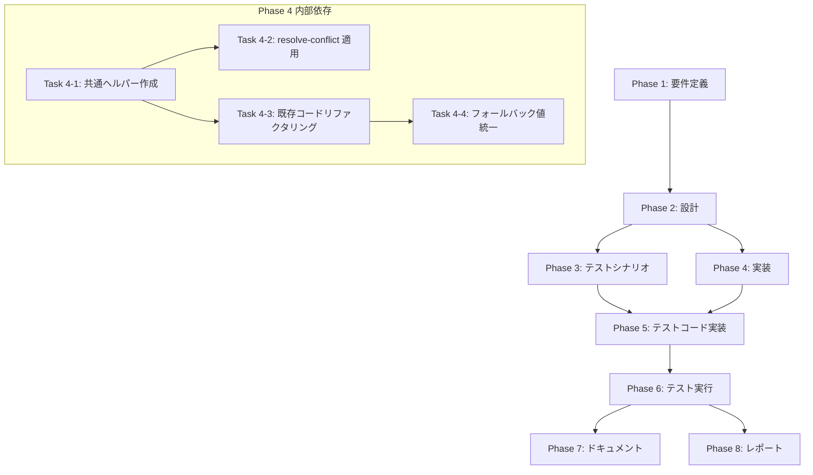

# Codex Agent 実行ログ

開始日時: 2026/2/21 10:00:46

---

## Turn 1: スレッド開始

**Thread ID**: `[REDACTED_TOKEN]`

## Turn 2: ツール実行

**種別**: reasoning
**ステータス**: completed

## Turn 3: ツール実行

**種別**: コマンド実行
**コマンド**: `/bin/bash -lc pwd`
**ステータス**: completed (exit_code=0)

```text
/tmp/ai-workflow-repos-36-22f1311d/ai-workflow-agent
```

## Turn 4: ツール実行

**種別**: reasoning
**ステータス**: completed

## Turn 5: ツール実行

**種別**: コマンド実行
**コマンド**: `/bin/bash -lc ls`
**ステータス**: completed (exit_code=0)

```text
AGENT_TEAMS.md
CHANGELOG.md
CLAUDE.md
[REDACTED_TOKEN].md
[REDACTED_TOKEN].md
[REDACTED_TOKEN].md
[REDACTED_TOKEN].md
CODEBASE_SUMMARY.md
Dockerfile
Jenkinsfile
LICENSE
PROGRESS.md
README.md
TROUBLESHOOTING.md
__mocks__
docs
examples
jenkins
jest.config.cjs
metadata.json.template
package-lock.json
package.json
scripts
src
tests
tmp
tsconfig.json
tsconfig.test.json
```

## Turn 6: ツール実行

**種別**: reasoning
**ステータス**: completed

## Turn 7: ツール実行

**種別**: コマンド実行
**コマンド**: `/bin/bash -lc 'cat AGENTS.md'`
**ステータス**: failed (exit_code=1)

```text
cat: AGENTS.md: No such file or directory
```

## Turn 8: ツール実行

**種別**: reasoning
**ステータス**: completed

## Turn 9: ツール実行

**種別**: コマンド実行
**コマンド**: `/bin/bash -lc "rg --files -g 'AGENTS.md'"`
**ステータス**: failed (exit_code=127)

```text
/bin/bash: line 1: rg: command not found
```

## Turn 10: ツール実行

**種別**: reasoning
**ステータス**: completed

## Turn 11: ツール実行

**種別**: コマンド実行
**コマンド**: `/bin/bash -lc 'find .. -name AGENTS.md -print'`
**ステータス**: completed (exit_code=0)

## Turn 12: ツール実行

**種別**: reasoning
**ステータス**: completed

## Turn 13: ツール実行

**種別**: reasoning
**ステータス**: completed

## Turn 14: ツール実行

**種別**: コマンド実行
**コマンド**: `/bin/bash -lc 'ls @.ai-workflow'`
**ステータス**: failed (exit_code=2)

```text
ls: cannot access '@.ai-workflow': No such file or directory
```

## Turn 15: ツール実行

**種別**: reasoning
**ステータス**: completed

## Turn 16: ツール実行

**種別**: コマンド実行
**コマンド**: `/bin/bash -lc 'ls -a'`
**ステータス**: completed (exit_code=0)

```text
.
..
.ai-workflow
.eslintrc.json
.git
.github
.gitignore
.npmrc
AGENT_TEAMS.md
CHANGELOG.md
CLAUDE.md
[REDACTED_TOKEN].md
[REDACTED_TOKEN].md
[REDACTED_TOKEN].md
[REDACTED_TOKEN].md
CODEBASE_SUMMARY.md
Dockerfile
Jenkinsfile
LICENSE
PROGRESS.md
README.md
TROUBLESHOOTING.md
__mocks__
docs
examples
jenkins
jest.config.cjs
metadata.json.template
package-lock.json
package.json
scripts
src
tests
tmp
tsconfig.json
tsconfig.test.json
```

## Turn 17: ツール実行

**種別**: reasoning
**ステータス**: completed

## Turn 18: ツール実行

**種別**: コマンド実行
**コマンド**: `/bin/bash -lc 'cat .ai-workflow/issue-749/00_planning/output/planning.md'`
**ステータス**: completed (exit_code=0)

```text
# プロジェクト計画書: Issue #749

## resolve-conflict コマンドの全フェーズで git user 設定が未実施のため CI 環境でコミットが失敗する

---

## 1. Issue分析

### 概要

`resolve-conflict` コマンド（init / analyze / execute）の各フェーズで `git commit` や `git merge` を実行する際、`user.name` および `user.email` の設定が行われていないため、Jenkins 等の CI 環境でコミットが失敗する。他のコマンド（`pr-comment` やメインワークフロー）では `ensureGitConfig()` や `git.addConfig()` で事前に Git ユーザー情報を設定しているが、`resolve-conflict` コマンドのみこの処理が欠落している。

### 複雑度: **簡単〜中程度**

- 影響範囲は `resolve-conflict` コマンドの3ファイル（init.ts / analyze.ts / execute.ts）が主対象
- 既存の `ensureGitConfig()` ロジック（`CommitManager` 内）を共通ヘルパーとして抽出する設計作業が含まれる
- フォールバック値（ユーザー名・メールアドレス）のプロジェクト全体統一も対応する
- 既存テストファイル（1,209行）への追加テストケース作成が必要

### 見積もり工数: **6〜10時間**

| 作業 | 見積もり |
|------|---------|
| 要件定義 | 0.5h |
| 設計（共通ヘルパー設計、統一方針決定） | 1h |
| テストシナリオ作成 | 0.5h |
| 共通ヘルパー関数の抽出・実装 | 1.5〜2h |
| resolve-conflict 3ファイルへの適用 | 1〜1.5h |
| テストコード実装 | 1.5〜2h |
| テスト実行・デバッグ | 0.5〜1h |
| ドキュメント・レポート | 0.5〜1h |
| **合計** | **6〜10h** |

### リスク評価: **低**

- 既に確立されたパターン（`CommitManager.ensureGitConfig()`）が存在し、それを再利用する方針
- 影響範囲が限定的（`resolve-conflict` コマンドの3ファイル + 共通ヘルパー1ファイル）
- 既存テストスイートでリグレッションを検出可能

---

## 2. 実装戦略判断

### 実装戦略: **EXTEND**

**判断根拠**:

- 新規モジュールの作成（CREATE）ではない。`ensureGitConfig()` のロジックは既に `CommitManager` クラス内に完成品として存在する（L528-568）
- 既存コードの構造改善（REFACTOR）が主目的でもない。主目的は `resolve-conflict` コマンドに欠落している機能を追加すること
- 既存の `CommitManager.ensureGitConfig()` から Git ユーザー設定ロジックをスタンドアロン関数として抽出し、`resolve-conflict` コマンドの3ファイルに適用する**機能追加（EXTEND）**が中心
- 追加として、`pr-comment` コマンドと `CommitManager` 間のフォールバック値（デフォルトユーザー名・メールアドレス）を統一する改善も含む

### テスト戦略: **UNIT_INTEGRATION**

**判断根拠**:

- **ユニットテスト**: 共通ヘルパー関数（`ensureGitConfig` のスタンドアロン版）の単体動作確認が必要。設定値の優先順位（環境変数 → フォールバック → デフォルト）、バリデーション（名前長、メール形式）のロジックをテストする
- **インテグレーションテスト**: `resolve-conflict` コマンドの各フェーズ（init / analyze / execute）が `git.commit()` / `git.merge()` 前に Git ユーザー設定を正しく呼び出すことを検証する必要がある。既存の統合テスト（`tests/integration/commands/resolve-conflict.test.ts`、1,209行・18テスト）に追加する
- **BDDテスト**: ユーザーストーリー中心のテストは不要（内部インフラの修正であり、エンドユーザーの操作フローに変更はない）

### テストコード戦略: **BOTH_TEST**

**判断根拠**:

- **EXTEND_TEST**: 既存の `tests/integration/commands/resolve-conflict.test.ts` に Git ユーザー設定の検証テストケースを追加する
- **CREATE_TEST**: 新規抽出する共通ヘルパー関数（`ensureGitUserConfig` 等）のユニットテストファイルを新規作成する。現在 `src/core/git/commit-manager.ts` 内の `ensureGitConfig()` に対する独立したユニットテストは存在しない

---

## 3. 影響範囲分析

### 既存コードへの影響

| ファイル | 変更種別 | 変更内容 |
|---------|---------|---------|
| `src/core/git/commit-manager.ts` | 修正 | `ensureGitConfig()` 内のロジックを新しいスタンドアロン関数に委譲するようリファクタリング |
| `src/core/git/git-config-helper.ts` | **新規作成** | Git ユーザー設定の共通ヘルパー関数を配置 |
| `src/commands/resolve-conflict/init.ts` | 修正 | `git.commit()` 前に共通ヘルパー関数を呼び出す処理を追加 |
| `src/commands/resolve-conflict/analyze.ts` | 修正 | `git.merge()` / `git.commit()` 前に共通ヘルパー関数を呼び出す処理を追加 |
| `src/commands/resolve-conflict/execute.ts` | 修正 | `git.commit()` 前に共通ヘルパー関数を呼び出す処理を追加 |
| `src/commands/pr-comment/init.ts` | 修正 | インライン Git 設定を共通ヘルパー関数に置き換え、フォールバック値を統一 |
| `src/commands/pr-comment/finalize.ts` | 修正 | インライン Git 設定（2箇所）を共通ヘルパー関数に置き換え、フォールバック値を統一 |

### テストファイルへの影響

| ファイル | 変更種別 | 変更内容 |
|---------|---------|---------|
| `tests/unit/core/git/git-config-helper.test.ts` | **新規作成** | 共通ヘルパー関数のユニットテスト |
| `tests/integration/commands/resolve-conflict.test.ts` | 修正 | Git ユーザー設定の呼び出し検証テストケース追加 |

### 依存関係の変更

- **新規依存の追加**: なし（既存の `simple-git` と `config` モジュールのみ使用）
- **既存依存の変更**: `CommitManager.ensureGitConfig()` が内部で新しいスタンドアロン関数を利用するように変更されるが、外部インターフェースは変更なし

### マイグレーション要否

- **データベーススキーマ変更**: なし
- **設定ファイル変更**: なし（既存の環境変数 `[REDACTED_TOKEN]` / `[REDACTED_TOKEN]` をそのまま使用）
- **Jenkins パイプライン変更**: 任意。`[REDACTED_TOKEN]` / `[REDACTED_TOKEN]` 環境変数を Jenkinsfile に明示的に追加することを推奨するが、必須ではない（コード側でフォールバック値が設定されるため）

### フォールバック値の統一方針

現状の不整合を解消し、プロジェクト全体で統一する：

| 項目 | CommitManager（現在） | pr-comment（現在） | **統一後** |
|------|----------------------|-------------------|-----------|
| ユーザー名 | `'AI Workflow'` | `'AI Workflow Bot'` | `'AI Workflow'` |
| メールアドレス | `'[REDACTED_EMAIL]'` |
... (truncated)
```

## Turn 19: ツール実行

**種別**: reasoning
**ステータス**: completed

## Turn 20: ツール実行

**種別**: コマンド実行
**コマンド**: `/bin/bash -lc 'cat .ai-workflow/issue-749/05_test_implementation/output/test-implementation.md'`
**ステータス**: completed (exit_code=0)

```text
# テスト実装完了レポート

## テストファイル一覧

| ファイル | テスト数 | カバー対象 |
|---------|---------|-----------|
| `tests/unit/core/git/git-config-helper.test.ts` | 10 | `ensureGitUserConfig` の優先順位・バリデーション・ログ・例外ハンドリング |
| `tests/integration/commands/resolve-conflict.test.ts` | 1 | resolve-conflict 各フェーズでの Git ユーザー設定適用とエラー継続 |

## テストカバレッジ

- ユニットテスト: 10件
- 統合テスト: 1件
- BDDテスト: 0件
- カバレッジ率: 未計測

## 追加メモ

- 既存の resolve-conflict 統合テストに Git ユーザー設定の適用順序（commit/merge 前）を追加検証しました。
- `ensureGitUserConfig` の異常系（listConfig/addConfig 例外）でも処理が継続することをユニット・統合の両面で確認しています。
```

## Turn 21: ツール実行

**種別**: reasoning
**ステータス**: completed

## Turn 22: ツール実行

**種別**: コマンド実行
**コマンド**: `/bin/bash -lc "sed -n '1,200p' tests/unit/core/git/git-config-helper.test.ts"`
**ステータス**: completed (exit_code=0)

```text
import { describe, it, expect, beforeEach, afterEach, jest } from '@jest/globals';

const mockLoggerInfo = jest.fn();
const mockLoggerWarn = jest.fn();
const mockLoggerError = jest.fn();
const mockLoggerDebug = jest.fn();

await jest.unstable_mockModule('../../../../src/utils/logger.js', () => ({
  __esModule: true,
  logger: {
    info: mockLoggerInfo,
    warn: mockLoggerWarn,
    error: mockLoggerError,
    debug: mockLoggerDebug,
  },
}));

const {
  ensureGitUserConfig,
  [REDACTED_TOKEN],
  [REDACTED_TOKEN],
} = await import('../../../../src/core/git/git-config-helper.js');

describe('GitConfigHelper - ensureGitUserConfig', () => {
  let originalEnv: NodeJS.ProcessEnv;

  beforeEach(() => {
    originalEnv = { ...process.env };
    mockLoggerInfo.mockClear();
    mockLoggerWarn.mockClear();
    mockLoggerError.mockClear();
    mockLoggerDebug.mockClear();
  });

  afterEach(() => {
    process.env = originalEnv;
  });

  it('ローカル設定が存在する場合_最優先で適用される', async () => {
    // Given: リポジトリローカルに user.name / user.email が存在する
    const git = {
      listConfig: jest.fn().mockResolvedValue({
        all: {
          'user.name': 'Existing User',
          'user.email': '[REDACTED_EMAIL]',
        },
      }),
      addConfig: jest.fn().mockResolvedValue(undefined),
    };

    process.env.[REDACTED_TOKEN] = 'Env User';
    process.env.[REDACTED_TOKEN] = '[REDACTED_EMAIL]';

    // When: ensureGitUserConfig を実行
    await ensureGitUserConfig(git as any);

    // Then: ローカル設定が優先される
    expect(git.addConfig).[REDACTED_TOKEN]('user.name', 'Existing User', false, 'local');
    expect(git.addConfig).[REDACTED_TOKEN]('user.email', '[REDACTED_EMAIL]', false, 'local');
  });

  it('環境変数が設定されている場合_ローカル未設定時に適用される', async () => {
    // Given: ローカル設定なし、環境変数が設定済み
    const git = {
      listConfig: jest.fn().mockResolvedValue({ all: {} }),
      addConfig: jest.fn().mockResolvedValue(undefined),
    };

    process.env.[REDACTED_TOKEN] = 'Custom User';
    process.env.[REDACTED_TOKEN] = '[REDACTED_EMAIL]';

    // When: ensureGitUserConfig を実行
    await ensureGitUserConfig(git as any);

    // Then: 環境変数値が適用される
    expect(git.addConfig).[REDACTED_TOKEN]('user.name', 'Custom User', false, 'local');
    expect(git.addConfig).[REDACTED_TOKEN]('user.email', '[REDACTED_EMAIL]', false, 'local');
  });

  it('フォールバック環境変数が適用される', async () => {
    // Given: commit 環境変数は未設定、author のみ設定
    const git = {
      listConfig: jest.fn().mockResolvedValue({ all: {} }),
      addConfig: jest.fn().mockResolvedValue(undefined),
    };

    delete process.env.[REDACTED_TOKEN];
    delete process.env.[REDACTED_TOKEN];
    process.env.GIT_AUTHOR_NAME = 'Author User';
    process.env.GIT_AUTHOR_EMAIL = '[REDACTED_EMAIL]';

    // When: ensureGitUserConfig を実行
    await ensureGitUserConfig(git as any);

    // Then: author 環境変数が適用される
    expect(git.addConfig).[REDACTED_TOKEN]('user.name', 'Author User', false, 'local');
    expect(git.addConfig).[REDACTED_TOKEN]('user.email', '[REDACTED_EMAIL]', false, 'local');
  });

  it('環境変数が未設定の場合_デフォルト値が適用される', async () => {
    // Given: ローカル設定なし、環境変数も未設定
    const git = {
      listConfig: jest.fn().mockResolvedValue({ all: {} }),
      addConfig: jest.fn().mockResolvedValue(undefined),
    };

    delete process.env.[REDACTED_TOKEN];
    delete process.env.[REDACTED_TOKEN];
    delete process.env.GIT_AUTHOR_NAME;
    delete process.env.GIT_AUTHOR_EMAIL;

    // When: ensureGitUserConfig を実行
    await ensureGitUserConfig(git as any);

    // Then: デフォルト値が適用される
    expect(git.addConfig).[REDACTED_TOKEN]('user.name', [REDACTED_TOKEN], false, 'local');
    expect(git.addConfig).[REDACTED_TOKEN]('user.email', [REDACTED_TOKEN], false, 'local');
  });

  it('ユーザー名が長すぎる場合_警告してデフォルトへフォールバックする', async () => {
    // Given: 101文字のユーザー名
    const git = {
      listConfig: jest.fn().mockResolvedValue({ all: {} }),
      addConfig: jes
... (truncated)
```

## Turn 23: ツール実行

**種別**: reasoning
**ステータス**: completed

## Turn 24: ツール実行

**種別**: コマンド実行
**コマンド**: `/bin/bash -lc "sed -n '200,400p' tests/unit/core/git/git-config-helper.test.ts"`
**ステータス**: completed (exit_code=0)

```text
listConfig: jest.fn().mockRejectedValue(new Error('listConfig failed')),
      addConfig: jest.fn().mockResolvedValue(undefined),
    };

    delete process.env.[REDACTED_TOKEN];
    delete process.env.[REDACTED_TOKEN];

    // When: ensureGitUserConfig を実行
    await expect(ensureGitUserConfig(git as any)).resolves.toBeUndefined();

    // Then: 警告ログが出力され、処理は継続する
    expect(mockLoggerWarn).[REDACTED_TOKEN](
      expect.stringContaining('Failed to read git config'),
    );
    expect(git.addConfig).toHaveBeenCalled();
  });

  it('git.addConfigで例外が発生しても外部に伝播しない', async () => {
    // Given: addConfig が例外を投げる
    const git = {
      listConfig: jest.fn().mockResolvedValue({ all: {} }),
      addConfig: jest.fn().mockRejectedValue(new Error('addConfig failed')),
    };

    process.env.[REDACTED_TOKEN] = 'Fail User';
    process.env.[REDACTED_TOKEN] = '[REDACTED_EMAIL]';

    // When/Then: 例外が伝播しない
    await expect(ensureGitUserConfig(git as any)).resolves.toBeUndefined();
    expect(mockLoggerWarn).[REDACTED_TOKEN](
      expect.stringContaining('Failed to ensure git config'),
    );
  });
});
```

## Turn 25: ツール実行

**種別**: reasoning
**ステータス**: completed

## Turn 26: ツール実行

**種別**: コマンド実行
**コマンド**: `/bin/bash -lc 'grep -n "addConfig" -n tests/integration/commands/resolve-conflict.test.ts'`
**ステータス**: completed (exit_code=0)

```text
139:      addConfig: jest.fn().mockResolvedValue(undefined),
147:      addConfig: jest.fn().mockResolvedValue(undefined),
162:      addConfig: jest.fn().mockResolvedValue(undefined),
197:    expect(gitInit.addConfig).[REDACTED_TOKEN](2);
198:    expect(gitInit.addConfig).[REDACTED_TOKEN]('user.name', expect.any(String), false, 'local');
199:    expect(gitInit.addConfig).[REDACTED_TOKEN]('user.email', expect.any(String), false, 'local');
200:    const initAddConfigOrder = Math.min(...gitInit.addConfig.mock.invocationCallOrder);
204:    expect(gitAnalyze.addConfig).[REDACTED_TOKEN](2);
205:    expect(gitAnalyze.addConfig).[REDACTED_TOKEN]('user.name', expect.any(String), false, 'local');
206:    expect(gitAnalyze.addConfig).[REDACTED_TOKEN]('user.email', expect.any(String), false, 'local');
207:    const [REDACTED_TOKEN] = Math.min(...gitAnalyze.addConfig.mock.invocationCallOrder);
211:    expect(gitExecute.addConfig).[REDACTED_TOKEN](2);
212:    expect(gitExecute.addConfig).[REDACTED_TOKEN]('user.name', expect.any(String), false, 'local');
213:    expect(gitExecute.addConfig).[REDACTED_TOKEN]('user.email', expect.any(String), false, 'local');
214:    const [REDACTED_TOKEN] = Math.min(...gitExecute.addConfig.mock.invocationCallOrder);
728:      addConfig: jest.fn().mockRejectedValue(new Error('addConfig failed')),
741:    expect(gitInit.addConfig).toHaveBeenCalled();
```

## Turn 27: ツール実行

**種別**: reasoning
**ステータス**: completed

## Turn 28: ツール実行

**種別**: コマンド実行
**コマンド**: `/bin/bash -lc "sed -n '120,250p' tests/integration/commands/resolve-conflict.test.ts"`
**ステータス**: completed (exit_code=0)

```text
};

    [REDACTED_TOKEN].mockResolvedValue({
      conflictFiles: [
        { filePath: 'src/conflict.ts', startLine: 1, endLine: 5, oursContent: 'ours', theirsContent: 'theirs' },
      ],
      oursLog: [],
      theirsLog: [],
      prDescription: '',
      relatedIssues: [],
      contextSnippets: [],
    });

    createPlanMock.mockResolvedValue(plan);
    resolveMock.mockResolvedValue(plan.resolutions);

    const gitInit = {
      fetch: jest.fn().mockResolvedValue(undefined),
      listConfig: jest.fn().mockResolvedValue({ all: {} }),
      addConfig: jest.fn().mockResolvedValue(undefined),
      add: jest.fn().mockResolvedValue(undefined),
      commit: jest.fn().mockResolvedValue(undefined),
    };

    const gitAnalyze = {
      fetch: jest.fn().mockResolvedValue(undefined),
      listConfig: jest.fn().mockResolvedValue({ all: {} }),
      addConfig: jest.fn().mockResolvedValue(undefined),
      status: jest
        .fn()
        .[REDACTED_TOKEN]({ files: [], current: 'main', conflicted: [] })
        .[REDACTED_TOKEN]({ files: [{ path: 'src/conflict.ts' }], current: 'main', conflicted: ['src/conflict.ts'] }),
      branchLocal: jest.fn().mockResolvedValue({ all: ['main'] }),
      checkout: jest.fn().mockResolvedValue(undefined),
      checkoutBranch: jest.fn().mockResolvedValue(undefined),
      raw: jest.fn().mockResolvedValue(''),
      add: jest.fn().mockResolvedValue(undefined),
      commit: jest.fn().mockResolvedValue(undefined),
    };

    const gitExecute = {
      listConfig: jest.fn().mockResolvedValue({ all: {} }),
      addConfig: jest.fn().mockResolvedValue(undefined),
      add: jest.fn().mockResolvedValue(undefined),
      status: jest.fn().mockResolvedValue({ files: [{ path: 'src/conflict.ts' }], current: 'feature' }),
      commit: jest.fn().mockResolvedValue(undefined),
    };

    const gitFinalize = {
      status: jest.fn().mockResolvedValue({ current: 'feature' }),
      push: jest.fn().mockResolvedValue(undefined),
    };

    const gitInstances = [gitInit, gitAnalyze, gitExecute, gitFinalize];
    simpleGitMock.mockImplementation(() => gitInstances.shift());

    // When: init -> analyze -> execute -> finalize
    await [REDACTED_TOKEN]({ prUrl, language: 'ja' });
    await [REDACTED_TOKEN]({ prUrl, agent: 'auto', language: 'ja' });
    await [REDACTED_TOKEN]({ prUrl, agent: 'auto', dryRun: false });
    await [REDACTED_TOKEN]({ prUrl, push: true, squash: false });

    // Then: メタデータ/成果物が作成され、最終的にクリーンアップされる
    const metadataManager = new [REDACTED_TOKEN](repoRoot, 42);
    const metadataPath = metadataManager.getMetadataPath();

    await expect(fsp.access(metadataPath)).rejects.toThrow();
    expect([REDACTED_TOKEN].postComment).toHaveBeenCalled();
    expect(gitFinalize.push).[REDACTED_TOKEN]('origin', 'feature');
    expect(gitInit.add).[REDACTED_TOKEN](expect.stringContaining('.ai-workflow/conflict-42/metadata.json'));
    expect(gitInit.commit).[REDACTED_TOKEN]('resolve-conflict: init metadata for PR #42');
    expect(gitAnalyze.add).[REDACTED_TOKEN](expect.stringContaining('.ai-workflow/conflict-42'));
    expect(gitAnalyze.commit).[REDACTED_TOKEN]('resolve-conflict: analyze completed for PR #42');
    expect(gitExecute.add).[REDACTED_TOKEN](2);
    expect(gitExecute.commit).[REDACTED_TOKEN](2);
    expect(gitExecute.commit).[REDACTED_TOKEN]('resolve-conflict: execute artifacts for PR #42');
    // Gitユーザー設定が commit/merge 前に適用されること
    expect(gitInit.addConfig).[REDACTED_TOKEN](2);
    expect(gitInit.addConfig).[REDACTED_TOKEN]('user.name', expect.any(String), false, 'local');
    expect(gitInit.addConfig).[REDACTED_TOKEN]('user.email', expect.any(String), false, 'local');
    const initAddConfigOrder = Math.min(...gitInit.addConfig.mock.invocationCallOrder);
    const initCommitOrder = gitInit.commit.mock.invocationCallOrder[0];
... (truncated)
```

## Turn 29: ツール実行

**種別**: reasoning
**ステータス**: completed

## Turn 30: ツール実行

**種別**: reasoning
**ステータス**: completed

## Turn 31: ツール実行

**種別**: コマンド実行
**コマンド**: `/bin/bash -lc 'cat package.json'`
**ステータス**: completed (exit_code=0)

```text
{
  "name": "ai-workflow-agent",
  "version": "0.2.0",
  "description": "TypeScript-based AI workflow automation toolkit with dual-agent (Codex + Claude) support",
  "private": false,
  "type": "module",
  "bin": {
    "ai-workflow": "./dist/index.js"
  },
  "repository": {
    "type": "git",
    "url": "https://github.com/tielec/ai-workflow-agent.git"
  },
  "bugs": {
    "url": "https://__GITHUB_URL_1__/issues"
  },
  "homepage": "https://github.com/tielec/ai-workflow-agent#readme",
  "keywords": [
    "ai",
    "workflow",
    "automation",
    "codex",
    "claude",
    "github",
    "jenkins",
    "pulumi",
    "typescript"
  ],
  "author": "TIELEC",
  "license": "MIT",
  "scripts": {
    "build": "tsc -p tsconfig.json && node ./scripts/copy-static-assets.mjs",
    "start": "tsx src/index.ts",
    "dev": "tsx watch src/index.ts",
    "lint": "tsc -p tsconfig.json --noEmit",
    "pretest": "node ./scripts/copy-static-assets.mjs",
    "test": "cross-env NODE_OPTIONS=\"--[REDACTED_TOKEN] --max-old-space-size=4096\" jest",
    "test:unit": "cross-env NODE_OPTIONS=\"--[REDACTED_TOKEN] --max-old-space-size=4096\" jest tests/unit",
    "test:integration": "cross-env NODE_OPTIONS=\"--[REDACTED_TOKEN] --max-old-space-size=4096\" jest tests/integration",
    "test:coverage": "cross-env NODE_OPTIONS=\"--[REDACTED_TOKEN] --max-old-space-size=4096\" jest --coverage",
    "validate": "npm run lint && npm test && npm run build",
    "monitor:tokens": "tsx scripts/monitor-token-detection.ts"
  },
  "dependencies": {
    "@anthropic-ai/claude-agent-sdk": "^0.1.14",
    "@anthropic-ai/sdk": "^0.71.0",
    "@octokit/rest": "^20.1.0",
    "chalk": "^5.3.0",
    "commander": "^12.1.0",
    "dotenv": "^16.4.5",
    "fs-extra": "^11.2.0",
    "minimatch": "^9.0.3",
    "openai": "^4.57.2",
    "simple-git": "^3.27.0",
    "yaml": "^2.5.0"
  },
  "devDependencies": {
    "@jest/globals": "^30.2.0",
    "@types/fs-extra": "^11.0.4",
    "@types/jest": "^30.0.0",
    "@types/minimatch": "^5.1.2",
    "@types/node": "^20.11.30",
    "cross-env": "^10.1.0",
    "jest": "^30.2.0",
    "jest-mock-extended": "^4.0.0",
    "ts-jest": "^29.4.5",
    "tsx": "^4.11.0",
    "typescript": "^5.9.3"
  }
}
```

## Turn 32: ツール実行

**種別**: reasoning
**ステータス**: completed

## Turn 33: ツール実行

**種別**: コマンド実行
**コマンド**: `/bin/bash -lc 'npm run test -- --runTestsByPath tests/unit/core/git/git-config-helper.test.ts tests/integration/commands/resolve-conflict.test.ts'`
**ステータス**: failed (exit_code=127)

```text
> ai-workflow-agent@0.2.0 pretest
> node ./scripts/copy-static-assets.mjs

[OK] Copied /tmp/ai-workflow-repos-36-22f1311d/ai-workflow-agent/metadata.json.template -> /tmp/ai-workflow-repos-36-22f1311d/ai-workflow-agent/dist/metadata.json.template
[OK] Copied /tmp/ai-workflow-repos-36-22f1311d/ai-workflow-agent/src/prompts -> /tmp/ai-workflow-repos-36-22f1311d/ai-workflow-agent/dist/prompts
[OK] Copied /tmp/ai-workflow-repos-36-22f1311d/ai-workflow-agent/src/templates -> /tmp/ai-workflow-repos-36-22f1311d/ai-workflow-agent/dist/templates

> ai-workflow-agent@0.2.0 test
> cross-env NODE_OPTIONS="--[REDACTED_TOKEN] --max-old-space-size=4096" jest --runTestsByPath tests/unit/core/git/git-config-helper.test.ts tests/integration/commands/resolve-conflict.test.ts

sh: 1: cross-env: not found
```

## Turn 34: ツール実行

**種別**: reasoning
**ステータス**: completed

## Turn 35: ツール実行

**種別**: reasoning
**ステータス**: completed

## Turn 36: ツール実行

**種別**: コマンド実行
**コマンド**: `/bin/bash -lc 'npm install'`
**ステータス**: completed (exit_code=0)

```text
npm warn deprecated inflight@1.0.6: This module is not supported, and leaks memory. Do not use it. Check out lru-cache if you want a good and tested way to coalesce async requests by a key value, which is much more comprehensive and powerful.
npm warn deprecated glob@7.2.3: Glob versions prior to v9 are no longer supported
npm warn deprecated node-domexception@1.0.0: Use your platform's native DOMException instead

added 435 packages, and audited 436 packages in 7s

60 packages are looking for funding
  run `npm fund` for details

21 vulnerabilities (1 moderate, 20 high)

To address issues that do not require attention, run:
  npm audit fix

To address all issues (including breaking changes), run:
  npm audit fix --force

Run `npm audit` for details.
```

## Turn 37: ツール実行

**種別**: reasoning
**ステータス**: completed

## Turn 38: ツール実行

**種別**: reasoning
**ステータス**: completed

## Turn 39: ツール実行

**種別**: コマンド実行
**コマンド**: `/bin/bash -lc 'npm run test -- --runTestsByPath tests/unit/core/git/git-config-helper.test.ts tests/integration/commands/resolve-conflict.test.ts'`
**ステータス**: completed (exit_code=0)

```text
> ai-workflow-agent@0.2.0 pretest
> node ./scripts/copy-static-assets.mjs

[OK] Copied /tmp/ai-workflow-repos-36-22f1311d/ai-workflow-agent/metadata.json.template -> /tmp/ai-workflow-repos-36-22f1311d/ai-workflow-agent/dist/metadata.json.template
[OK] Copied /tmp/ai-workflow-repos-36-22f1311d/ai-workflow-agent/src/prompts -> /tmp/ai-workflow-repos-36-22f1311d/ai-workflow-agent/dist/prompts
[OK] Copied /tmp/ai-workflow-repos-36-22f1311d/ai-workflow-agent/src/templates -> /tmp/ai-workflow-repos-36-22f1311d/ai-workflow-agent/dist/templates

> ai-workflow-agent@0.2.0 test
> cross-env NODE_OPTIONS="--[REDACTED_TOKEN] --max-old-space-size=4096" jest --runTestsByPath tests/unit/core/git/git-config-helper.test.ts tests/integration/commands/resolve-conflict.test.ts

(node:4649) ExperimentalWarning: VM Modules is an experimental feature and might change at any time
(Use `node --trace-warnings ...` to show where the warning was created)
PASS tests/integration/commands/resolve-conflict.test.ts
  ● Console

    console.info
      2026-02-21 10:01:51 [INFO ] Git config ensured: user.name=yuto-takashi, user.email=[REDACTED_EMAIL]

      at log (src/utils/logger.ts:123:17)

    console.info
      2026-02-21 10:01:52 [INFO ] Committed metadata: .ai-workflow/conflict-42/metadata.json

      at log (src/utils/logger.ts:123:17)

    console.info
      2026-02-21 10:01:52 [INFO ] Initialization completed. Metadata saved to: /tmp/resolve-conflict-Tb6AqD/.ai-workflow/conflict-42/metadata.json

      at log (src/utils/logger.ts:123:17)

    console.info
      2026-02-21 10:01:52 [INFO ] Git config ensured: user.name=yuto-takashi, user.email=[REDACTED_EMAIL]

      at log (src/utils/logger.ts:123:17)

    console.info
      2026-02-21 10:01:52 [INFO ] Committed analyze artifacts for PR #42

      at log (src/utils/logger.ts:123:17)

    console.info
      2026-02-21 10:01:52 [INFO ] Analysis completed. Plan saved to: /tmp/resolve-conflict-Tb6AqD/.ai-workflow/conflict-42/resolution-plan.md

      at log (src/utils/logger.ts:123:17)

    console.info
      2026-02-21 10:01:52 [INFO ] Git config ensured: user.name=yuto-takashi, user.email=[REDACTED_EMAIL]

      at log (src/utils/logger.ts:123:17)

    console.info
      2026-02-21 10:01:52 [INFO ] Committed execute artifacts for PR #42

      at log (src/utils/logger.ts:123:17)

    console.info
      2026-02-21 10:01:52 [INFO ] Execute completed. Result saved to: /tmp/resolve-conflict-Tb6AqD/.ai-workflow/conflict-42/resolution-result.md

      at log (src/utils/logger.ts:123:17)

    console.info
      2026-02-21 10:01:52 [INFO ] Pushed resolved changes to origin/feature

      at log (src/utils/logger.ts:123:17)

    console.info
      2026-02-21 10:01:52 [INFO ] Finalize completed. Metadata cleaned up.

      at log (src/utils/logger.ts:123:17)

    console.warn
      2026-02-21 10:01:52 [WARNING] Failed to read git config: git.listConfig is not a function

      121 |       : console.debug;
      122 |
    > 123 |   consoleMethod.call(console, coloredMessage);
          |                 ^
      124 | }
      125 |
      126 | /**

      at log (src/utils/logger.ts:123:17)
      at Object.warn (src/utils/logger.ts:147:33)
      at ensureGitUserConfig (src/core/git/git-config-helper.ts:19:14)
      at [REDACTED_TOKEN] (src/commands/resolve-conflict/init.ts:48:13)
      at Object.<anonymous> (tests/integration/commands/resolve-conflict.test.ts:278:5)

    console.warn
      2026-02-21 10:01:52 [WARNING] Failed to ensure git config: git.addConfig is not a function

      121 |       : console.debug;
      122 |
    > 123 |   consoleMethod.call(console, coloredMessage);
          |                 ^
      124 | }
      125 |
      126 | /**

      at log (src/utils/logger.ts:123:17)
      at Object.warn (src/utils/logger.ts:147:33)
      at ensureGitUserConfig (src/core/git/git-config-helper.ts:53:12)
      at [REDACTED_TOKEN] (src/commands/resolve-conf
... (truncated)
```

## Turn 40: ツール実行

**種別**: reasoning
**ステータス**: completed

## Turn 41: ツール実行

**種別**: reasoning
**ステータス**: completed

## Turn 42: ツール実行

**種別**: コマンド実行
**コマンド**: `/bin/bash -lc 'rg -n "Phase 5: テストコード実装" -n .ai-workflow/issue-749/00_planning/output/planning.md'`
**ステータス**: failed (exit_code=127)

```text
/bin/bash: line 1: rg: command not found
```

## Turn 43: ツール実行

**種別**: reasoning
**ステータス**: completed

## Turn 44: ツール実行

**種別**: コマンド実行
**コマンド**: `/bin/bash -lc 'grep -n "Phase 5: テストコード実装" -n .ai-workflow/issue-749/00_planning/output/planning.md'`
**ステータス**: completed (exit_code=0)

```text
166:### Phase 5: テストコード実装 (見積もり: 1.5〜2h)
210:    P3 --> P5[Phase 5: テストコード実装]
308:### Phase 5: テストコード実装
```

## Turn 45: ツール実行

**種別**: reasoning
**ステータス**: completed

## Turn 46: ツール実行

**種別**: コマンド実行
**コマンド**: `/bin/bash -lc "sed -n '150,190p' .ai-workflow/issue-749/00_planning/output/planning.md"`
**ステータス**: completed (exit_code=0)

```text
- `src/core/git/git-config-helper.ts` を新規作成
  - `ensureGitUserConfig(git: SimpleGit)` 関数を実装（`CommitManager.ensureGitConfig()` のロジックを抽出）
  - デフォルト値定数 `[REDACTED_TOKEN] = 'AI Workflow'` / `[REDACTED_TOKEN] = '[REDACTED_EMAIL]'` を定義
  - バリデーションロジック（名前長・メール形式）を移植
- [x] Task 4-2: resolve-conflict コマンドへの適用 (0.5〜1h)
  - `src/commands/resolve-conflict/init.ts`: `git.commit()` 前に `ensureGitUserConfig()` を呼び出す処理を追加
  - `src/commands/resolve-conflict/analyze.ts`: `git.merge()` 前に `ensureGitUserConfig()` を呼び出す処理を追加
  - `src/commands/resolve-conflict/execute.ts`: `git.commit()`（2箇所）前に `ensureGitUserConfig()` を呼び出す処理を追加
- [x] Task 4-3: 既存コードのリファクタリング (0.5〜1h)
  - `src/core/git/commit-manager.ts`: `ensureGitConfig()` メソッドが新しい共通ヘルパー関数に委譲するよう修正
  - `src/commands/pr-comment/init.ts`: インライン Git 設定を共通ヘルパー関数に置き換え
  - `src/commands/pr-comment/finalize.ts`: インライン Git 設定（2箇所）を共通ヘルパー関数に置き換え
- [x] Task 4-4: フォールバック値の統一 (0.5h)
  - `pr-comment` で使用されていた `'AI Workflow Bot'` / `'[REDACTED_EMAIL]'` を共通ヘルパー関数のデフォルト値 `'AI Workflow'` / `'[REDACTED_EMAIL]'` に統一
  - 変更による影響がないことを確認

### Phase 5: テストコード実装 (見積もり: 1.5〜2h)

- [ ] Task 5-1: 共通ヘルパー関数のユニットテスト作成 (1〜1.5h)
  - `tests/unit/core/git/git-config-helper.test.ts` を新規作成
  - テストケース: 環境変数が設定されている場合の優先順位テスト
  - テストケース: 環境変数が未設定の場合のデフォルト値テスト
  - テストケース: 既存のリポジトリローカル設定が存在する場合のスキップ動作テスト
  - テストケース: バリデーション（名前長超過、メール形式不正）のフォールバックテスト
- [ ] Task 5-2: resolve-conflict 統合テストの拡張 (0.5h)
  - `tests/integration/commands/resolve-conflict.test.ts` に Git ユーザー設定検証テストを追加
  - テストケース: init フェーズで `git.addConfig('user.name', ...)` が呼び出されることを検証
  - テストケース: analyze フェーズで `git.addConfig` がマージ前に呼び出されることを検証
  - テストケース: execute フェーズで `git.addConfig` がコミット前に呼び出されることを検証

### Phase 6: テスト実行 (見積もり: 0.5〜1h)

- [ ] Task 6-1: テスト実行と品質検証 (0.5〜1h)
  - `npm run validate` による統合検証（TypeScript 型チェック + テスト + ビルド）
  - 新規テストの pass 確認
  - 既存テストのリグレッション確認（全18テスト + 新規テストが pass すること）
  - ビルド成果物（`dist/`）が正常に生成されることを確認

### Phase 7: ドキュメント (見積もり: 0.5h)

- [ ] Task 7-1: ドキュメント更新 (0.5h)
```

## Turn 47: ツール実行

**種別**: reasoning
**ステータス**: completed

## Turn 48: ツール実行

**種別**: コマンド実行
**コマンド**: `/bin/bash -lc "sed -n '300,340p' .ai-workflow/issue-749/00_planning/output/planning.md"`
**ステータス**: completed (exit_code=0)

```text
### Phase 4: 実装
- [ ] `src/core/git/git-config-helper.ts` が作成されている
- [ ] `resolve-conflict` の3ファイル（init.ts / analyze.ts / execute.ts）に Git ユーザー設定処理が追加されている
- [ ] `CommitManager.ensureGitConfig()` が共通ヘルパー関数に委譲している
- [ ] `pr-comment` のインライン設定が共通ヘルパー関数に置き換えられている
- [ ] フォールバック値がプロジェクト全体で統一されている
- [ ] `npm run lint` が pass する

### Phase 5: テストコード実装
- [ ] 共通ヘルパー関数のユニットテストが作成されている
- [ ] resolve-conflict 統合テストに Git 設定検証テストケースが追加されている
- [ ] テストが実行可能な状態である

### Phase 6: テスト実行
- [ ] `npm run validate` が pass する（lint + test + build）
- [ ] 新規テストがすべて pass する
- [ ] 既存テスト（18テスト）にリグレッションがない
- [ ] ビルド成果物（`dist/`）が正常に生成される

### Phase 7: ドキュメント
- [ ] 変更に関連するドキュメントが更新されている
- [ ] 共通ヘルパー関数の使用方法が記載されている（コード内コメントまたはドキュメント）

### Phase 8: レポート
- [ ] 変更ファイル一覧が記載されている
- [ ] テスト結果サマリーが記載されている
- [ ] マージチェックリストが完成している

---

## 参考情報

### 対象ファイル一覧

#### 修正対象ファイル
| ファイル | 現在の行数 | 変更内容 |
|---------|-----------|---------|
| `src/commands/resolve-conflict/init.ts` | 60行 | L48 の `git.commit()` 前に `ensureGitUserConfig()` 呼び出し追加 |
| `src/commands/resolve-conflict/analyze.ts` | 181行 | L88 の `git.merge()` 前、L169 の `git.commit()` 前に `ensureGitUserConfig()` 呼び出し追加 |
| `src/commands/resolve-conflict/execute.ts` | 151行 | L128, L139 の `git.commit()` 前に `ensureGitUserConfig()` 呼び出し追加 |
| `src/core/git/commit-manager.ts` | 705行 | `ensureGitConfig()` メソッドが共通ヘルパー関数に委譲するよう修正 |
```

## Turn 49: ツール実行

**種別**: reasoning
**ステータス**: completed

## Turn 50: ツール実行

**種別**: file_change
**ステータス**: completed

## Turn 51: ツール実行

**種別**: reasoning
**ステータス**: completed

## Turn 52: ツール実行

**種別**: コマンド実行
**コマンド**: `/bin/bash -lc "sed -n '160,220p' .ai-workflow/issue-749/00_planning/output/planning.md"`
**ステータス**: completed (exit_code=0)

```text
- `src/commands/pr-comment/init.ts`: インライン Git 設定を共通ヘルパー関数に置き換え
  - `src/commands/pr-comment/finalize.ts`: インライン Git 設定（2箇所）を共通ヘルパー関数に置き換え
- [x] Task 4-4: フォールバック値の統一 (0.5h)
  - `pr-comment` で使用されていた `'AI Workflow Bot'` / `'[REDACTED_EMAIL]'` を共通ヘルパー関数のデフォルト値 `'AI Workflow'` / `'[REDACTED_EMAIL]'` に統一
  - 変更による影響がないことを確認

-### Phase 5: テストコード実装 (見積もり: 1.5〜2h)

- [x] Task 5-1: 共通ヘルパー関数のユニットテスト作成 (1〜1.5h)
  - `tests/unit/core/git/git-config-helper.test.ts` を新規作成
  - テストケース: 環境変数が設定されている場合の優先順位テスト
  - テストケース: 環境変数が未設定の場合のデフォルト値テスト
  - テストケース: 既存のリポジトリローカル設定が存在する場合のスキップ動作テスト
  - テストケース: バリデーション（名前長超過、メール形式不正）のフォールバックテスト
- [x] Task 5-2: resolve-conflict 統合テストの拡張 (0.5h)
  - `tests/integration/commands/resolve-conflict.test.ts` に Git ユーザー設定検証テストを追加
  - テストケース: init フェーズで `git.addConfig('user.name', ...)` が呼び出されることを検証
  - テストケース: analyze フェーズで `git.addConfig` がマージ前に呼び出されることを検証
  - テストケース: execute フェーズで `git.addConfig` がコミット前に呼び出されることを検証

### Phase 6: テスト実行 (見積もり: 0.5〜1h)

- [ ] Task 6-1: テスト実行と品質検証 (0.5〜1h)
  - `npm run validate` による統合検証（TypeScript 型チェック + テスト + ビルド）
  - 新規テストの pass 確認
  - 既存テストのリグレッション確認（全18テスト + 新規テストが pass すること）
  - ビルド成果物（`dist/`）が正常に生成されることを確認

### Phase 7: ドキュメント (見積もり: 0.5h)

- [ ] Task 7-1: ドキュメント更新 (0.5h)
  - CLAUDE.md のコーディング規約セクションにGit ユーザー設定の共通ヘルパー利用規約を追記（必要に応じて）
  - 変更の影響を受けるドキュメントの確認と更新

### Phase 8: レポート (見積もり: 0.5h)

- [ ] Task 8-1: 変更サマリーの作成 (0.5h)
  - 実装内容のサマリー（変更ファイル一覧、新規作成ファイル一覧）
  - テスト結果のサマリー
  - フォールバック値統一の影響範囲の記録

---

## 5. 依存関係



## Turn 53: ツール実行

**種別**: reasoning
**ステータス**: completed

## Turn 54: ツール実行

**種別**: file_change
**ステータス**: completed

## Turn 55: ツール実行

**種別**: reasoning
**ステータス**: completed

## Turn 56: ツール実行

**種別**: file_change
**ステータス**: completed

## Turn 57: ツール実行

**種別**: reasoning
**ステータス**: completed

## Turn 58: ツール実行

**種別**: コマンド実行
**コマンド**: `/bin/bash -lc "sed -n '160,220p' .ai-workflow/issue-749/00_planning/output/planning.md"`
**ステータス**: completed (exit_code=0)

```text
- `src/commands/pr-comment/init.ts`: インライン Git 設定を共通ヘルパー関数に置き換え
  - `src/commands/pr-comment/finalize.ts`: インライン Git 設定（2箇所）を共通ヘルパー関数に置き換え
- [x] Task 4-4: フォールバック値の統一 (0.5h)
  - `pr-comment` で使用されていた `'AI Workflow Bot'` / `'[REDACTED_EMAIL]'` を共通ヘルパー関数のデフォルト値 `'AI Workflow'` / `'[REDACTED_EMAIL]'` に統一
  - 変更による影響がないことを確認

-### Phase 5: テストコード実装 (見積もり: 1.5〜2h)

- [x] Task 5-1: 共通ヘルパー関数のユニットテスト作成 (1〜1.5h)
  - `tests/unit/core/git/git-config-helper.test.ts` を新規作成
  - テストケース: 環境変数が設定されている場合の優先順位テスト
  - テストケース: 環境変数が未設定の場合のデフォルト値テスト
  - テストケース: 既存のリポジトリローカル設定が存在する場合のスキップ動作テスト
  - テストケース: バリデーション（名前長超過、メール形式不正）のフォールバックテスト
- [x] Task 5-2: resolve-conflict 統合テストの拡張 (0.5h)
  - `tests/integration/commands/resolve-conflict.test.ts` に Git ユーザー設定検証テストを追加
  - テストケース: init フェーズで `git.addConfig('user.name', ...)` が呼び出されることを検証
  - テストケース: analyze フェーズで `git.addConfig` がマージ前に呼び出されることを検証
  - テストケース: execute フェーズで `git.addConfig` がコミット前に呼び出されることを検証

### Phase 6: テスト実行 (見積もり: 0.5〜1h)

- [ ] Task 6-1: テスト実行と品質検証 (0.5〜1h)
  - `npm run validate` による統合検証（TypeScript 型チェック + テスト + ビルド）
  - 新規テストの pass 確認
  - 既存テストのリグレッション確認（全18テスト + 新規テストが pass すること）
  - ビルド成果物（`dist/`）が正常に生成されることを確認

### Phase 7: ドキュメント (見積もり: 0.5h)

- [ ] Task 7-1: ドキュメント更新 (0.5h)
  - CLAUDE.md のコーディング規約セクションにGit ユーザー設定の共通ヘルパー利用規約を追記（必要に応じて）
  - 変更の影響を受けるドキュメントの確認と更新

### Phase 8: レポート (見積もり: 0.5h)

- [ ] Task 8-1: 変更サマリーの作成 (0.5h)
  - 実装内容のサマリー（変更ファイル一覧、新規作成ファイル一覧）
  - テスト結果のサマリー
  - フォールバック値統一の影響範囲の記録

---

## 5. 依存関係


## Turn 59: ツール実行

**種別**: reasoning
**ステータス**: completed

## Turn 60: ツール実行

**種別**: reasoning
**ステータス**: completed

## Turn 61: ツール実行

**種別**: コマンド実行
**コマンド**: `/bin/bash -lc "nl -ba .ai-workflow/issue-749/00_planning/output/planning.md | sed -n '150,220p'"`
**ステータス**: completed (exit_code=0)

```text
150	  - `src/core/git/git-config-helper.ts` を新規作成
   151	  - `ensureGitUserConfig(git: SimpleGit)` 関数を実装（`CommitManager.ensureGitConfig()` のロジックを抽出）
   152	  - デフォルト値定数 `[REDACTED_TOKEN] = 'AI Workflow'` / `[REDACTED_TOKEN] = '[REDACTED_EMAIL]'` を定義
   153	  - バリデーションロジック（名前長・メール形式）を移植
   154	- [x] Task 4-2: resolve-conflict コマンドへの適用 (0.5〜1h)
   155	  - `src/commands/resolve-conflict/init.ts`: `git.commit()` 前に `ensureGitUserConfig()` を呼び出す処理を追加
   156	  - `src/commands/resolve-conflict/analyze.ts`: `git.merge()` 前に `ensureGitUserConfig()` を呼び出す処理を追加
   157	  - `src/commands/resolve-conflict/execute.ts`: `git.commit()`（2箇所）前に `ensureGitUserConfig()` を呼び出す処理を追加
   158	- [x] Task 4-3: 既存コードのリファクタリング (0.5〜1h)
   159	  - `src/core/git/commit-manager.ts`: `ensureGitConfig()` メソッドが新しい共通ヘルパー関数に委譲するよう修正
   160	  - `src/commands/pr-comment/init.ts`: インライン Git 設定を共通ヘルパー関数に置き換え
   161	  - `src/commands/pr-comment/finalize.ts`: インライン Git 設定（2箇所）を共通ヘルパー関数に置き換え
   162	- [x] Task 4-4: フォールバック値の統一 (0.5h)
   163	  - `pr-comment` で使用されていた `'AI Workflow Bot'` / `'[REDACTED_EMAIL]'` を共通ヘルパー関数のデフォルト値 `'AI Workflow'` / `'[REDACTED_EMAIL]'` に統一
   164	  - 変更による影響がないことを確認
   165	
   166	-### Phase 5: テストコード実装 (見積もり: 1.5〜2h)
   167	
   168	- [x] Task 5-1: 共通ヘルパー関数のユニットテスト作成 (1〜1.5h)
   169	  - `tests/unit/core/git/git-config-helper.test.ts` を新規作成
   170	  - テストケース: 環境変数が設定されている場合の優先順位テスト
   171	  - テストケース: 環境変数が未設定の場合のデフォルト値テスト
   172	  - テストケース: 既存のリポジトリローカル設定が存在する場合のスキップ動作テスト
   173	  - テストケース: バリデーション（名前長超過、メール形式不正）のフォールバックテスト
   174	- [x] Task 5-2: resolve-conflict 統合テストの拡張 (0.5h)
   175	  - `tests/integration/commands/resolve-conflict.test.ts` に Git ユーザー設定検証テストを追加
   176	  - テストケース: init フェーズで `git.addConfig('user.name', ...)` が呼び出されることを検証
   177	  - テストケース: analyze フェーズで `git.addConfig` がマージ前に呼び出されることを検証
   178	  - テストケース: execute フェーズで `git.addConfig` がコミット前に呼び出されることを検証
   179	
   180	### Phase 6: テスト実行 (見積もり: 0.5〜1h)
   181	
   182	- [ ] Task 6-1: テスト実行と品質検証 (0.5〜1h)
   183	  - `npm run validate` による統合検証（TypeScript 型チェック + テスト + ビルド）
   184	  - 新規テストの pass 確認
   185	  - 既存テストのリグレッション確認（全18テスト + 新規テストが pass すること）
   186	  - ビルド成果物（`dist/`）が正常に生成されることを確認
   187	
   188	### Phase 7: ドキュメント (見積もり: 0.5h)
   189	
   190	- [ ] Task 7-1: ドキュメント更新 (0.5h)
   191	  - CLAUDE.md のコーディング規約セクションにGit ユーザー設定の共通ヘルパー利用規約を追記（必要に応じて）
   192	  - 変更の影響を受けるドキュメントの確認と更新
   193	
   194	### Phase 8: レポート (見積もり: 0.5h)
   195	
   196	- [ ] Task 8-1: 変更サマリーの作成 (0.5h)
   197	  - 実装内容のサマリー（変更ファイル一覧、新規作成ファイル一覧）
   198	  - テスト結果のサマリー
   199	  - フォールバック値統一の影響範囲の記録
   200	
   201	---
   202	
   203	## 5. 依存関係
   204	
   205	```mermaid
   206	graph TD
   207	    P1[Phase 1: 要件定義] --> P2[Phase 2: 設計]
   208	    P2 --> P3[Phase 3: テストシナリオ]
   209	    P2 --> P4[Phase 4: 実装]
   210	    P3 --> P5[Phase 5: テストコード実装]
   211	    P4 --> P5
   212	    P5 --> P6[Phase 6: テスト実行]
   213	    P6 --> P7[Phase 7: ドキュメント]
   214	    P6 --> P8[Phase 8: レポート]
   215	
   216	    subgraph "Phase 4 内部依存"
   217	        T41[Task 4-1: 共通ヘルパー作成] --> T42[Task 4-2: resolve-conflict 適用]
   218	        T41 --> T43[Task 4-3: 既存コードリファクタリング]
   219	        T43 --> T44[Task 4-4: フォールバック値統一]
   220	    end
```

## Turn 62: ツール実行

**種別**: reasoning
**ステータス**: completed

## Turn 63: ツール実行

**種別**: file_change
**ステータス**: completed

## Turn 64: ツール実行

**種別**: reasoning
**ステータス**: completed

## Turn 65: ツール実行

**種別**: コマンド実行
**コマンド**: `/bin/bash -lc "nl -ba .ai-workflow/issue-749/00_planning/output/planning.md | sed -n '160,210p'"`
**ステータス**: completed (exit_code=0)

```text
160	  - `src/commands/pr-comment/init.ts`: インライン Git 設定を共通ヘルパー関数に置き換え
   161	  - `src/commands/pr-comment/finalize.ts`: インライン Git 設定（2箇所）を共通ヘルパー関数に置き換え
   162	- [x] Task 4-4: フォールバック値の統一 (0.5h)
   163	  - `pr-comment` で使用されていた `'AI Workflow Bot'` / `'[REDACTED_EMAIL]'` を共通ヘルパー関数のデフォルト値 `'AI Workflow'` / `'[REDACTED_EMAIL]'` に統一
   164	  - 変更による影響がないことを確認
   165	
   166	### Phase 5: テストコード実装 (見積もり: 1.5〜2h)
   167	
   168	- [x] Task 5-1: 共通ヘルパー関数のユニットテスト作成 (1〜1.5h)
   169	  - `tests/unit/core/git/git-config-helper.test.ts` を新規作成
   170	  - テストケース: 環境変数が設定されている場合の優先順位テスト
   171	  - テストケース: 環境変数が未設定の場合のデフォルト値テスト
   172	  - テストケース: 既存のリポジトリローカル設定が存在する場合のスキップ動作テスト
   173	  - テストケース: バリデーション（名前長超過、メール形式不正）のフォールバックテスト
   174	- [x] Task 5-2: resolve-conflict 統合テストの拡張 (0.5h)
   175	  - `tests/integration/commands/resolve-conflict.test.ts` に Git ユーザー設定検証テストを追加
   176	  - テストケース: init フェーズで `git.addConfig('user.name', ...)` が呼び出されることを検証
   177	  - テストケース: analyze フェーズで `git.addConfig` がマージ前に呼び出されることを検証
   178	  - テストケース: execute フェーズで `git.addConfig` がコミット前に呼び出されることを検証
   179	
   180	### Phase 6: テスト実行 (見積もり: 0.5〜1h)
   181	
   182	- [ ] Task 6-1: テスト実行と品質検証 (0.5〜1h)
   183	  - `npm run validate` による統合検証（TypeScript 型チェック + テスト + ビルド）
   184	  - 新規テストの pass 確認
   185	  - 既存テストのリグレッション確認（全18テスト + 新規テストが pass すること）
   186	  - ビルド成果物（`dist/`）が正常に生成されることを確認
   187	
   188	### Phase 7: ドキュメント (見積もり: 0.5h)
   189	
   190	- [ ] Task 7-1: ドキュメント更新 (0.5h)
   191	  - CLAUDE.md のコーディング規約セクションにGit ユーザー設定の共通ヘルパー利用規約を追記（必要に応じて）
   192	  - 変更の影響を受けるドキュメントの確認と更新
   193	
   194	### Phase 8: レポート (見積もり: 0.5h)
   195	
   196	- [ ] Task 8-1: 変更サマリーの作成 (0.5h)
   197	  - 実装内容のサマリー（変更ファイル一覧、新規作成ファイル一覧）
   198	  - テスト結果のサマリー
   199	  - フォールバック値統一の影響範囲の記録
   200	
   201	---
   202	
   203	## 5. 依存関係
   204	
   205	```mermaid
   206	graph TD
   207	    P1[Phase 1: 要件定義] --> P2[Phase 2: 設計]
   208	    P2 --> P3[Phase 3: テストシナリオ]
   209	    P2 --> P4[Phase 4: 実装]
   210	    P3 --> P5[Phase 5: テストコード実装]
```

## Turn 66: ツール実行

**種別**: reasoning
**ステータス**: completed

## Turn 67: ツール実行

**種別**: コマンド実行
**コマンド**: `/bin/bash -lc "sed -n '300,360p' .ai-workflow/issue-749/00_planning/output/planning.md"`
**ステータス**: completed (exit_code=0)

```text
### Phase 4: 実装
- [ ] `src/core/git/git-config-helper.ts` が作成されている
- [ ] `resolve-conflict` の3ファイル（init.ts / analyze.ts / execute.ts）に Git ユーザー設定処理が追加されている
- [ ] `CommitManager.ensureGitConfig()` が共通ヘルパー関数に委譲している
- [ ] `pr-comment` のインライン設定が共通ヘルパー関数に置き換えられている
- [ ] フォールバック値がプロジェクト全体で統一されている
- [ ] `npm run lint` が pass する

### Phase 5: テストコード実装
- [x] 共通ヘルパー関数のユニットテストが作成されている
- [x] resolve-conflict 統合テストに Git 設定検証テストケースが追加されている
- [x] テストが実行可能な状態である

### Phase 6: テスト実行
- [ ] `npm run validate` が pass する（lint + test + build）
- [ ] 新規テストがすべて pass する
- [ ] 既存テスト（18テスト）にリグレッションがない
- [ ] ビルド成果物（`dist/`）が正常に生成される

### Phase 7: ドキュメント
- [ ] 変更に関連するドキュメントが更新されている
- [ ] 共通ヘルパー関数の使用方法が記載されている（コード内コメントまたはドキュメント）

### Phase 8: レポート
- [ ] 変更ファイル一覧が記載されている
- [ ] テスト結果サマリーが記載されている
- [ ] マージチェックリストが完成している

---

## 参考情報

### 対象ファイル一覧

#### 修正対象ファイル
| ファイル | 現在の行数 | 変更内容 |
|---------|-----------|---------|
| `src/commands/resolve-conflict/init.ts` | 60行 | L48 の `git.commit()` 前に `ensureGitUserConfig()` 呼び出し追加 |
| `src/commands/resolve-conflict/analyze.ts` | 181行 | L88 の `git.merge()` 前、L169 の `git.commit()` 前に `ensureGitUserConfig()` 呼び出し追加 |
| `src/commands/resolve-conflict/execute.ts` | 151行 | L128, L139 の `git.commit()` 前に `ensureGitUserConfig()` 呼び出し追加 |
| `src/core/git/commit-manager.ts` | 705行 | `ensureGitConfig()` メソッドが共通ヘルパー関数に委譲するよう修正 |
| `src/commands/pr-comment/init.ts` | 317行 | L75-81 のインライン Git 設定を共通ヘルパー関数に置き換え |
| `src/commands/pr-comment/finalize.ts` | 315行 | L104-110, L203-208 のインライン Git 設定（2箇所）を共通ヘルパー関数に置き換え |

#### 新規作成ファイル
| ファイル | 役割 |
|---------|------|
| `src/core/git/git-config-helper.ts` | Git ユーザー設定の共通ヘルパー関数 |
| `tests/unit/core/git/git-config-helper.test.ts` | 共通ヘルパー関数のユニットテスト |

#### 修正対象テストファイル
| ファイル | 現在の行数 | 変更内容 |
|---------|-----------|---------|
| `tests/integration/commands/resolve-conflict.test.ts` | 1,209行 | Git ユーザー設定検証テストケース追加 |

### 参考ファイル（既存の正しい実装）
- `src/core/git/commit-manager.ts` L528-568: `ensureGitConfig()` メソッド
- `src/commands/pr-comment/init.ts` L75-81: Git 設定のインライン実装
- `src/commands/pr-comment/finalize.ts` L104-110, L203-208: Git 設定のインライン実装
- `src/core/config.ts` L310-318: `[REDACTED_TOKEN]()` / `[REDACTED_TOKEN]()`
```

## Turn 68: ツール実行

**種別**: reasoning
**ステータス**: completed

## Turn 69: ツール実行

**種別**: reasoning
**ステータス**: completed

## Turn 70: ツール実行

**種別**: コマンド実行
**コマンド**: `/bin/bash -lc 'git status -sb'`
**ステータス**: completed (exit_code=0)

```text
## ai-workflow/issue-749...origin/develop [ahead 32]
 M .ai-workflow/issue-749/00_planning/output/planning.md
?? .ai-workflow/issue-749/00_planning/execute/agent_log_raw.txt
?? .ai-workflow/issue-749/00_planning/execute/prompt.txt
?? .ai-workflow/issue-749/00_planning/review/agent_log_raw.txt
?? .ai-workflow/issue-749/00_planning/review/prompt.txt
?? .ai-workflow/issue-749/01_requirements/execute/agent_log_raw.txt
?? .ai-workflow/issue-749/01_requirements/execute/prompt.txt
?? .ai-workflow/issue-749/01_requirements/review/agent_log_raw.txt
?? .ai-workflow/issue-749/01_requirements/review/prompt.txt
?? .ai-workflow/issue-749/02_design/execute/agent_log_raw.txt
?? .ai-workflow/issue-749/02_design/execute/prompt.txt
?? .ai-workflow/issue-749/02_design/review/agent_log_raw.txt
?? .ai-workflow/issue-749/02_design/review/prompt.txt
?? .ai-workflow/issue-749/03_test_scenario/execute/agent_log_raw.txt
?? .ai-workflow/issue-749/03_test_scenario/execute/prompt.txt
?? .ai-workflow/issue-749/03_test_scenario/review/agent_log_raw.txt
?? .ai-workflow/issue-749/03_test_scenario/review/prompt.txt
?? .ai-workflow/issue-749/04_implementation/execute/agent_log_raw.txt
?? .ai-workflow/issue-749/04_implementation/execute/prompt.txt
?? .ai-workflow/issue-749/04_implementation/review/agent_log_raw.txt
?? .ai-workflow/issue-749/04_implementation/review/prompt.txt
?? .ai-workflow/issue-749/05_test_implementation/execute/agent_log_raw.txt
?? .ai-workflow/issue-749/05_test_implementation/execute/prompt.txt
?? .ai-workflow/issue-749/05_test_implementation/review/
```

## Turn 71: ツール実行

**種別**: reasoning
**ステータス**: completed

## Turn 72: ツール実行

**種別**: reasoning
**ステータス**: completed

## Turn 73: ツール実行

**種別**: agent_message
**ステータス**: completed

## Turn 74: ツール実行

**種別**: todo_list
**ステータス**: completed

## Turn 75: 実行完了

**ステータス**: completed
**所要時間**: 181923ms
**ターン数**: N/A

---

**経過時間**: 181923ms
**開始**: 2026/2/21 10:00:46
**終了**: 2026/2/21 10:03:47