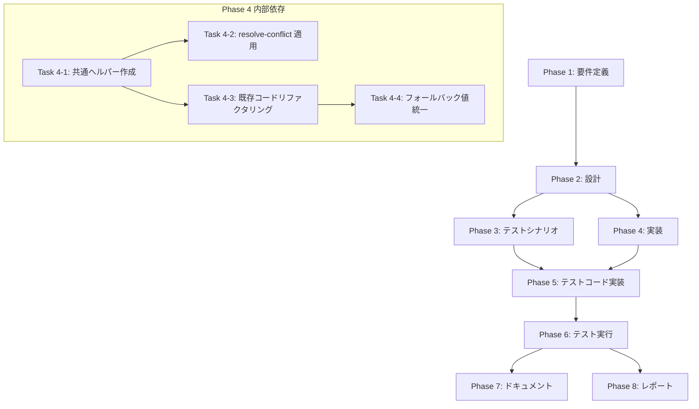

# Codex Agent 実行ログ

開始日時: 2026/2/21 10:56:09

---

## Turn 1: スレッド開始

**Thread ID**: `[REDACTED_TOKEN]`

## Turn 2: ツール実行

**種別**: reasoning
**ステータス**: completed

## Turn 3: ツール実行

**種別**: コマンド実行
**コマンド**: `/bin/bash -lc pwd`
**ステータス**: completed (exit_code=0)

```text
/tmp/ai-workflow-repos-37-524ab78b/ai-workflow-agent
```

## Turn 4: ツール実行

**種別**: reasoning
**ステータス**: completed

## Turn 5: ツール実行

**種別**: コマンド実行
**コマンド**: `/bin/bash -lc ls`
**ステータス**: completed (exit_code=0)

```text
AGENT_TEAMS.md
CHANGELOG.md
CLAUDE.md
[REDACTED_TOKEN].md
[REDACTED_TOKEN].md
[REDACTED_TOKEN].md
[REDACTED_TOKEN].md
CODEBASE_SUMMARY.md
Dockerfile
Jenkinsfile
LICENSE
PROGRESS.md
README.md
TROUBLESHOOTING.md
__mocks__
dist
docs
examples
jenkins
jest.config.cjs
metadata.json.template
node_modules
package-lock.json
package.json
scripts
src
tests
tmp
tmp-init-auto
tsconfig.json
tsconfig.test.json
```

## Turn 6: ツール実行

**種別**: reasoning
**ステータス**: completed

## Turn 7: ツール実行

**種別**: コマンド実行
**コマンド**: `/bin/bash -lc "rg --files -g 'Planning.md'"`
**ステータス**: failed (exit_code=127)

```text
/bin/bash: line 1: rg: command not found
```

## Turn 8: ツール実行

**種別**: reasoning
**ステータス**: completed

## Turn 9: ツール実行

**種別**: コマンド実行
**コマンド**: `/bin/bash -lc 'find .. -name Planning.md -print'`
**ステータス**: completed (exit_code=0)

## Turn 10: ツール実行

**種別**: reasoning
**ステータス**: completed

## Turn 11: ツール実行

**種別**: コマンド実行
**コマンド**: `/bin/bash -lc 'ls -a'`
**ステータス**: completed (exit_code=0)

```text
.
..
.ai-workflow
.eslintrc.json
.git
.github
.gitignore
.npmrc
.test-tmp
.tmp
AGENT_TEAMS.md
CHANGELOG.md
CLAUDE.md
[REDACTED_TOKEN].md
[REDACTED_TOKEN].md
[REDACTED_TOKEN].md
[REDACTED_TOKEN].md
CODEBASE_SUMMARY.md
Dockerfile
Jenkinsfile
LICENSE
PROGRESS.md
README.md
TROUBLESHOOTING.md
__mocks__
dist
docs
examples
jenkins
jest.config.cjs
metadata.json.template
node_modules
package-lock.json
package.json
scripts
src
tests
tmp
tmp-init-auto
tsconfig.json
tsconfig.test.json
```

## Turn 12: ツール実行

**種別**: reasoning
**ステータス**: completed

## Turn 13: ツール実行

**種別**: コマンド実行
**コマンド**: `/bin/bash -lc 'ls .ai-workflow'`
**ステータス**: completed (exit_code=0)

```text
issue-10
issue-105
issue-7
issue-749
tmp
```

## Turn 14: ツール実行

**種別**: reasoning
**ステータス**: completed

## Turn 15: ツール実行

**種別**: コマンド実行
**コマンド**: `/bin/bash -lc 'ls .ai-workflow/issue-749'`
**ステータス**: completed (exit_code=0)

```text
00_planning
01_requirements
02_design
03_test_scenario
04_implementation
[REDACTED_TOKEN]
06_testing
metadata.json
metadata.json.[REDACTED_TOKEN]
```

## Turn 16: ツール実行

**種別**: reasoning
**ステータス**: completed

## Turn 17: ツール実行

**種別**: コマンド実行
**コマンド**: `/bin/bash -lc 'ls .ai-workflow/issue-749/00_planning'`
**ステータス**: completed (exit_code=0)

```text
execute
output
review
```

## Turn 18: ツール実行

**種別**: reasoning
**ステータス**: completed

## Turn 19: ツール実行

**種別**: コマンド実行
**コマンド**: `/bin/bash -lc 'ls .ai-workflow/issue-749/00_planning/output'`
**ステータス**: completed (exit_code=0)

```text
planning.md
```

## Turn 20: ツール実行

**種別**: reasoning
**ステータス**: completed

## Turn 21: ツール実行

**種別**: コマンド実行
**コマンド**: `/bin/bash -lc 'cat .ai-workflow/issue-749/00_planning/output/planning.md'`
**ステータス**: completed (exit_code=0)

```text
# プロジェクト計画書: Issue #749

## resolve-conflict コマンドの全フェーズで git user 設定が未実施のため CI 環境でコミットが失敗する

---

## 1. Issue分析

### 概要

`resolve-conflict` コマンド（init / analyze / execute）の各フェーズで `git commit` や `git merge` を実行する際、`user.name` および `user.email` の設定が行われていないため、Jenkins 等の CI 環境でコミットが失敗する。他のコマンド（`pr-comment` やメインワークフロー）では `ensureGitConfig()` や `git.addConfig()` で事前に Git ユーザー情報を設定しているが、`resolve-conflict` コマンドのみこの処理が欠落している。

### 複雑度: **簡単〜中程度**

- 影響範囲は `resolve-conflict` コマンドの3ファイル（init.ts / analyze.ts / execute.ts）が主対象
- 既存の `ensureGitConfig()` ロジック（`CommitManager` 内）を共通ヘルパーとして抽出する設計作業が含まれる
- フォールバック値（ユーザー名・メールアドレス）のプロジェクト全体統一も対応する
- 既存テストファイル（1,209行）への追加テストケース作成が必要

### 見積もり工数: **6〜10時間**

| 作業 | 見積もり |
|------|---------|
| 要件定義 | 0.5h |
| 設計（共通ヘルパー設計、統一方針決定） | 1h |
| テストシナリオ作成 | 0.5h |
| 共通ヘルパー関数の抽出・実装 | 1.5〜2h |
| resolve-conflict 3ファイルへの適用 | 1〜1.5h |
| テストコード実装 | 1.5〜2h |
| テスト実行・デバッグ | 0.5〜1h |
| ドキュメント・レポート | 0.5〜1h |
| **合計** | **6〜10h** |

### リスク評価: **低**

- 既に確立されたパターン（`CommitManager.ensureGitConfig()`）が存在し、それを再利用する方針
- 影響範囲が限定的（`resolve-conflict` コマンドの3ファイル + 共通ヘルパー1ファイル）
- 既存テストスイートでリグレッションを検出可能

---

## 2. 実装戦略判断

### 実装戦略: **EXTEND**

**判断根拠**:

- 新規モジュールの作成（CREATE）ではない。`ensureGitConfig()` のロジックは既に `CommitManager` クラス内に完成品として存在する（L528-568）
- 既存コードの構造改善（REFACTOR）が主目的でもない。主目的は `resolve-conflict` コマンドに欠落している機能を追加すること
- 既存の `CommitManager.ensureGitConfig()` から Git ユーザー設定ロジックをスタンドアロン関数として抽出し、`resolve-conflict` コマンドの3ファイルに適用する**機能追加（EXTEND）**が中心
- 追加として、`pr-comment` コマンドと `CommitManager` 間のフォールバック値（デフォルトユーザー名・メールアドレス）を統一する改善も含む

### テスト戦略: **UNIT_INTEGRATION**

**判断根拠**:

- **ユニットテスト**: 共通ヘルパー関数（`ensureGitConfig` のスタンドアロン版）の単体動作確認が必要。設定値の優先順位（環境変数 → フォールバック → デフォルト）、バリデーション（名前長、メール形式）のロジックをテストする
- **インテグレーションテスト**: `resolve-conflict` コマンドの各フェーズ（init / analyze / execute）が `git.commit()` / `git.merge()` 前に Git ユーザー設定を正しく呼び出すことを検証する必要がある。既存の統合テスト（`tests/integration/commands/resolve-conflict.test.ts`、1,209行・18テスト）に追加する
- **BDDテスト**: ユーザーストーリー中心のテストは不要（内部インフラの修正であり、エンドユーザーの操作フローに変更はない）

### テストコード戦略: **BOTH_TEST**

**判断根拠**:

- **EXTEND_TEST**: 既存の `tests/integration/commands/resolve-conflict.test.ts` に Git ユーザー設定の検証テストケースを追加する
- **CREATE_TEST**: 新規抽出する共通ヘルパー関数（`ensureGitUserConfig` 等）のユニットテストファイルを新規作成する。現在 `src/core/git/commit-manager.ts` 内の `ensureGitConfig()` に対する独立したユニットテストは存在しない

---

## 3. 影響範囲分析

### 既存コードへの影響

| ファイル | 変更種別 | 変更内容 |
|---------|---------|---------|
| `src/core/git/commit-manager.ts` | 修正 | `ensureGitConfig()` 内のロジックを新しいスタンドアロン関数に委譲するようリファクタリング |
| `src/core/git/git-config-helper.ts` | **新規作成** | Git ユーザー設定の共通ヘルパー関数を配置 |
| `src/commands/resolve-conflict/init.ts` | 修正 | `git.commit()` 前に共通ヘルパー関数を呼び出す処理を追加 |
| `src/commands/resolve-conflict/analyze.ts` | 修正 | `git.merge()` / `git.commit()` 前に共通ヘルパー関数を呼び出す処理を追加 |
| `src/commands/resolve-conflict/execute.ts` | 修正 | `git.commit()` 前に共通ヘルパー関数を呼び出す処理を追加 |
| `src/commands/pr-comment/init.ts` | 修正 | インライン Git 設定を共通ヘルパー関数に置き換え、フォールバック値を統一 |
| `src/commands/pr-comment/finalize.ts` | 修正 | インライン Git 設定（2箇所）を共通ヘルパー関数に置き換え、フォールバック値を統一 |

### テストファイルへの影響

| ファイル | 変更種別 | 変更内容 |
|---------|---------|---------|
| `tests/unit/core/git/git-config-helper.test.ts` | **新規作成** | 共通ヘルパー関数のユニットテスト |
| `tests/integration/commands/resolve-conflict.test.ts` | 修正 | Git ユーザー設定の呼び出し検証テストケース追加 |

### 依存関係の変更

- **新規依存の追加**: なし（既存の `simple-git` と `config` モジュールのみ使用）
- **既存依存の変更**: `CommitManager.ensureGitConfig()` が内部で新しいスタンドアロン関数を利用するように変更されるが、外部インターフェースは変更なし

### マイグレーション要否

- **データベーススキーマ変更**: なし
- **設定ファイル変更**: なし（既存の環境変数 `[REDACTED_TOKEN]` / `[REDACTED_TOKEN]` をそのまま使用）
- **Jenkins パイプライン変更**: 任意。`[REDACTED_TOKEN]` / `[REDACTED_TOKEN]` 環境変数を Jenkinsfile に明示的に追加することを推奨するが、必須ではない（コード側でフォールバック値が設定されるため）

### フォールバック値の統一方針

現状の不整合を解消し、プロジェクト全体で統一する：

| 項目 | CommitManager（現在） | pr-comment（現在） | **統一後** |
|------|----------------------|-------------------|-----------|
| ユーザー名 | `'AI Workflow'` | `'AI Workflow Bot'` | `'AI Workflow'` |
| メールアドレス | `'[REDACTED_EMAIL]'` |
... (truncated)
```

## Turn 22: ツール実行

**種別**: reasoning
**ステータス**: completed

## Turn 23: ツール実行

**種別**: コマンド実行
**コマンド**: `/bin/bash -lc 'cat .ai-workflow/issue-749/06_testing/output/test-result.md'`
**ステータス**: completed (exit_code=0)

```text
# テスト結果（再実行）

## 再実行1: 2026-02-21 10:54:48
- **実行コマンド**: `npm run validate`
- **修正内容**:
  - `tests/unit/pr-comment/finalize-command.test.ts` の期待値を `simpleGit.addConfig` の4引数呼び出しと新しいデフォルト値（`AI Workflow` / `[REDACTED_EMAIL]`）に合わせて更新
- **結果**: 成功
  - **Test Suites**: 229 passed / 230 total（1 skipped）
  - **Tests**: 3177 passed / 3199 total（22 skipped）
  - **Snapshots**: 0
- **補足**:
  - `npm run validate` 内の `lint`（`tsc --noEmit`）・`test`（Jest）・`build`（`tsc` + `copy-static-assets`）はすべて成功
  - テスト中の `console.warn/info` は想定通りで、失敗は発生していない

## 品質ゲート評価
- **テストが実行されている**: PASS
- **主要なテストケースが成功している**: PASS
- **失敗したテストは分析されている**: PASS（失敗なし）

**品質ゲート総合判定: PASS**
```

## Turn 24: ツール実行

**種別**: reasoning
**ステータス**: completed

## Turn 25: ツール実行

**種別**: コマンド実行
**コマンド**: `/bin/bash -lc 'grep -n "Phase 6" -n .ai-workflow/issue-749/00_planning/output/planning.md'`
**ステータス**: completed (exit_code=0)

```text
180:### Phase 6: テスト実行 (見積もり: 0.5〜1h)
212:    P5 --> P6[Phase 6: テスト実行]
313:### Phase 6: テスト実行
```

## Turn 26: ツール実行

**種別**: reasoning
**ステータス**: completed

## Turn 27: ツール実行

**種別**: コマンド実行
**コマンド**: `/bin/bash -lc "sed -n '300,340p' .ai-workflow/issue-749/00_planning/output/planning.md"`
**ステータス**: completed (exit_code=0)

```text
### Phase 4: 実装
- [ ] `src/core/git/git-config-helper.ts` が作成されている
- [ ] `resolve-conflict` の3ファイル（init.ts / analyze.ts / execute.ts）に Git ユーザー設定処理が追加されている
- [ ] `CommitManager.ensureGitConfig()` が共通ヘルパー関数に委譲している
- [ ] `pr-comment` のインライン設定が共通ヘルパー関数に置き換えられている
- [ ] フォールバック値がプロジェクト全体で統一されている
- [ ] `npm run lint` が pass する

### Phase 5: テストコード実装
- [x] 共通ヘルパー関数のユニットテストが作成されている
- [x] resolve-conflict 統合テストに Git 設定検証テストケースが追加されている
- [x] テストが実行可能な状態である

### Phase 6: テスト実行
- [ ] `npm run validate` が pass する（lint + test + build）
- [ ] 新規テストがすべて pass する
- [ ] 既存テスト（18テスト）にリグレッションがない
- [ ] ビルド成果物（`dist/`）が正常に生成される

### Phase 7: ドキュメント
- [ ] 変更に関連するドキュメントが更新されている
- [ ] 共通ヘルパー関数の使用方法が記載されている（コード内コメントまたはドキュメント）

### Phase 8: レポート
- [ ] 変更ファイル一覧が記載されている
- [ ] テスト結果サマリーが記載されている
- [ ] マージチェックリストが完成している

---

## 参考情報

### 対象ファイル一覧

#### 修正対象ファイル
| ファイル | 現在の行数 | 変更内容 |
|---------|-----------|---------|
| `src/commands/resolve-conflict/init.ts` | 60行 | L48 の `git.commit()` 前に `ensureGitUserConfig()` 呼び出し追加 |
| `src/commands/resolve-conflict/analyze.ts` | 181行 | L88 の `git.merge()` 前、L169 の `git.commit()` 前に `ensureGitUserConfig()` 呼び出し追加 |
| `src/commands/resolve-conflict/execute.ts` | 151行 | L128, L139 の `git.commit()` 前に `ensureGitUserConfig()` 呼び出し追加 |
| `src/core/git/commit-manager.ts` | 705行 | `ensureGitConfig()` メソッドが共通ヘルパー関数に委譲するよう修正 |
```

## Turn 28: ツール実行

**種別**: reasoning
**ステータス**: completed

## Turn 29: ツール実行

**種別**: コマンド実行
**コマンド**: `/bin/bash -lc "sed -n '150,220p' .ai-workflow/issue-749/00_planning/output/planning.md"`
**ステータス**: completed (exit_code=0)

```text
- `src/core/git/git-config-helper.ts` を新規作成
  - `ensureGitUserConfig(git: SimpleGit)` 関数を実装（`CommitManager.ensureGitConfig()` のロジックを抽出）
  - デフォルト値定数 `[REDACTED_TOKEN] = 'AI Workflow'` / `[REDACTED_TOKEN] = '[REDACTED_EMAIL]'` を定義
  - バリデーションロジック（名前長・メール形式）を移植
- [x] Task 4-2: resolve-conflict コマンドへの適用 (0.5〜1h)
  - `src/commands/resolve-conflict/init.ts`: `git.commit()` 前に `ensureGitUserConfig()` を呼び出す処理を追加
  - `src/commands/resolve-conflict/analyze.ts`: `git.merge()` 前に `ensureGitUserConfig()` を呼び出す処理を追加
  - `src/commands/resolve-conflict/execute.ts`: `git.commit()`（2箇所）前に `ensureGitUserConfig()` を呼び出す処理を追加
- [x] Task 4-3: 既存コードのリファクタリング (0.5〜1h)
  - `src/core/git/commit-manager.ts`: `ensureGitConfig()` メソッドが新しい共通ヘルパー関数に委譲するよう修正
  - `src/commands/pr-comment/init.ts`: インライン Git 設定を共通ヘルパー関数に置き換え
  - `src/commands/pr-comment/finalize.ts`: インライン Git 設定（2箇所）を共通ヘルパー関数に置き換え
- [x] Task 4-4: フォールバック値の統一 (0.5h)
  - `pr-comment` で使用されていた `'AI Workflow Bot'` / `'[REDACTED_EMAIL]'` を共通ヘルパー関数のデフォルト値 `'AI Workflow'` / `'[REDACTED_EMAIL]'` に統一
  - 変更による影響がないことを確認

### Phase 5: テストコード実装 (見積もり: 1.5〜2h)

- [x] Task 5-1: 共通ヘルパー関数のユニットテスト作成 (1〜1.5h)
  - `tests/unit/core/git/git-config-helper.test.ts` を新規作成
  - テストケース: 環境変数が設定されている場合の優先順位テスト
  - テストケース: 環境変数が未設定の場合のデフォルト値テスト
  - テストケース: 既存のリポジトリローカル設定が存在する場合のスキップ動作テスト
  - テストケース: バリデーション（名前長超過、メール形式不正）のフォールバックテスト
- [x] Task 5-2: resolve-conflict 統合テストの拡張 (0.5h)
  - `tests/integration/commands/resolve-conflict.test.ts` に Git ユーザー設定検証テストを追加
  - テストケース: init フェーズで `git.addConfig('user.name', ...)` が呼び出されることを検証
  - テストケース: analyze フェーズで `git.addConfig` がマージ前に呼び出されることを検証
  - テストケース: execute フェーズで `git.addConfig` がコミット前に呼び出されることを検証

### Phase 6: テスト実行 (見積もり: 0.5〜1h)

- [ ] Task 6-1: テスト実行と品質検証 (0.5〜1h)
  - `npm run validate` による統合検証（TypeScript 型チェック + テスト + ビルド）
  - 新規テストの pass 確認
  - 既存テストのリグレッション確認（全18テスト + 新規テストが pass すること）
  - ビルド成果物（`dist/`）が正常に生成されることを確認

### Phase 7: ドキュメント (見積もり: 0.5h)

- [ ] Task 7-1: ドキュメント更新 (0.5h)
  - CLAUDE.md のコーディング規約セクションにGit ユーザー設定の共通ヘルパー利用規約を追記（必要に応じて）
  - 変更の影響を受けるドキュメントの確認と更新

### Phase 8: レポート (見積もり: 0.5h)

- [ ] Task 8-1: 変更サマリーの作成 (0.5h)
  - 実装内容のサマリー（変更ファイル一覧、新規作成ファイル一覧）
  - テスト結果のサマリー
  - フォールバック値統一の影響範囲の記録

---

## 5. 依存関係



## Turn 30: ツール実行

**種別**: reasoning
**ステータス**: completed

## Turn 31: ツール実行

**種別**: コマンド実行
**コマンド**: `/bin/bash -lc "apply_patch <<< '*** Begin Patch
*** Update File: .ai-workflow/issue-749/00_planning/output/planning.md
@@
-### Phase 6: テスト実行 (見積もり: 0.5〜1h)
-
-- [ ] Task 6-1: テスト実行と品質検証 (0.5〜1h)
+-### Phase 6: テスト実行 (見積もり: 0.5〜1h)
+
+- [x] Task 6-1: テスト実行と品質検証 (0.5〜1h)
*** End Patch"`
**ステータス**: failed (exit_code=2)

```text
/bin/bash: -c: line 1: unexpected EOF while looking for matching `''
```

## Turn 32: ツール実行

**種別**: reasoning
**ステータス**: completed

## Turn 33: ツール実行

**種別**: file_change
**ステータス**: completed

## Turn 34: ツール実行

**種別**: reasoning
**ステータス**: completed

## Turn 35: ツール実行

**種別**: コマンド実行
**コマンド**: `/bin/bash -lc 'nl -ba .ai-workflow/issue-749/06_testing/output/test-result.md'`
**ステータス**: completed (exit_code=0)

```text
1	# テスト結果（再実行）
     2	
     3	## 再実行1: 2026-02-21 10:54:48
     4	- **実行コマンド**: `npm run validate`
     5	- **修正内容**:
     6	  - `tests/unit/pr-comment/finalize-command.test.ts` の期待値を `simpleGit.addConfig` の4引数呼び出しと新しいデフォルト値（`AI Workflow` / `[REDACTED_EMAIL]`）に合わせて更新
     7	- **結果**: 成功
     8	  - **Test Suites**: 229 passed / 230 total（1 skipped）
     9	  - **Tests**: 3177 passed / 3199 total（22 skipped）
    10	  - **Snapshots**: 0
    11	- **補足**:
    12	  - `npm run validate` 内の `lint`（`tsc --noEmit`）・`test`（Jest）・`build`（`tsc` + `copy-static-assets`）はすべて成功
    13	  - テスト中の `console.warn/info` は想定通りで、失敗は発生していない
    14	
    15	## 品質ゲート評価
    16	- **テストが実行されている**: PASS
    17	- **主要なテストケースが成功している**: PASS
    18	- **失敗したテストは分析されている**: PASS（失敗なし）
    19	
    20	**品質ゲート総合判定: PASS**
```

## Turn 36: ツール実行

**種別**: reasoning
**ステータス**: completed

## Turn 37: ツール実行

**種別**: agent_message
**ステータス**: completed

## Turn 38: 実行完了

**ステータス**: completed
**所要時間**: 73462ms
**ターン数**: N/A

---

**経過時間**: 73462ms
**開始**: 2026/2/21 10:56:09
**終了**: 2026/2/21 10:57:22