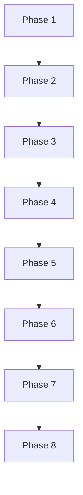

# Codex Agent 実行ログ

開始日時: 2026/4/9 7:21:30

---

## Turn 1: スレッド開始

**Thread ID**: `[REDACTED_TOKEN]`

## Turn 2: ツール実行

**種別**: コマンド実行
**コマンド**: `/bin/bash -lc 'python3 --version'`
**ステータス**: completed (exit_code=0)

```text
Python 3.11.2
```

## Turn 3: ツール実行

**種別**: コマンド実行
**コマンド**: `/bin/bash -lc ls`
**ステータス**: completed (exit_code=0)

```text
AGENT_TEAMS.md
CHANGELOG.md
CLAUDE.md
[REDACTED_TOKEN].md
[REDACTED_TOKEN].md
[REDACTED_TOKEN].md
[REDACTED_TOKEN].md
[REDACTED_TOKEN].md
[REDACTED_TOKEN].md
CODEBASE_SUMMARY.md
Dockerfile
Jenkinsfile
LICENSE
PROGRESS.md
README.md
[REDACTED_TOKEN].md
[REDACTED_TOKEN].md
TROUBLESHOOTING.md
__mocks__
docs
examples
jenkins
jest.config.cjs
metadata.json.template
package-lock.json
package.json
scripts
src
tests
tmp
tsconfig.json
tsconfig.test.json
```

## Turn 4: ツール実行

**種別**: コマンド実行
**コマンド**: `/bin/bash -lc 'cat CLAUDE.md'`
**ステータス**: completed (exit_code=0)

```text
# CLAUDE.md

このファイルは、このリポジトリで作業する際に Claude Code (claude.ai/code) にガイダンスを提供します。

## 目次

- [プロジェクト概要](#プロジェクト概要)
- [Agent Teams 運用ガイドライン](#agent-teams-運用ガイドライン)
- [クイックスタート](#クイックスタート)
- [アーキテクチャ概要](#アーキテクチャ概要)
- [コーディング規約](#コーディング規約)
- [重要な制約事項](#重要な制約事項)
- [ドキュメント索引](#ドキュメント索引)

## プロジェクト概要

TypeScript ベースの AI Workflow 自動化ツールキットで、デュアルエージェント（Codex + Claude）をサポートしています。GitHub Issue に対して planning から evaluation までの 10 フェーズのワークフローを実行し、マルチリポジトリワークフロー、Jenkins 統合、永続的なメタデータ管理をサポートします。

**主要機能**:
- **デュアルエージェント**: Codex（gpt-5.2-codex）と Claude（Opus 4.5）の自動フォールバック
- **10フェーズワークフロー**: Planning → Requirements → Design → Test Scenario → Implementation → Test Implementation → Testing → Documentation → Report → Evaluation
- **永続化メタデータ**: `.ai-workflow/issue-*/metadata.json` でワークフロー状態を管理（サンプル: issue-7/issue-10/issue-105 をリファレンスとして保持）
- **マルチリポジトリ対応**: Issue URL から対象リポジトリを自動判定（v0.2.0）
- **Jenkins統合**: Docker コンテナ内で TypeScript CLI を実行

**リポジトリ構成**:
```
ai-workflow-agent/
├── src/
│   ├── core/                  # エージェント・Git/GitHub ヘルパー・メタデータ管理
│   ├── phases/                # 各フェーズ実装（planning 〜 evaluation）
│   ├── prompts/               # フェーズ/コマンド別・言語別プロンプト（{phase|category}/{lang}/*.txt）
│   ├── templates/             # PR ボディなどのテンプレート（{lang}/pr_body*.md）
│   ├── main.ts                # CLI 定義
│   └── index.ts               # bin エントリ
├── tests/
│   ├── unit/                  # ユニットテスト
│   └── integration/           # 統合テスト
├── docs/                      # ドキュメント（詳細は下記参照）
└── dist/                      # ビルド成果物（npm run build 後に生成）
```

## Agent Teams 運用ガイドライン

このプロジェクトは Claude Code の Agent Teams による並列開発をサポートしています。Agent Teams を使用する際は、以下のガイドラインに従ってください。

**詳細な実践ガイドは [AGENT_TEAMS.md](./AGENT_TEAMS.md) を参照してください。**

### ミッション・ビジョン・バリュー（MVV）

**ミッション**

AI Workflow 自動化ツールキットの品質と保守性を維持・向上させ、開発者が安心して利用できる信頼性の高いツールを提供する。

**ビジョン**

- デュアルエージェント（Codex + Claude）による柔軟なワークフロー自動化
- 10フェーズのライフサイクル管理による体系的な開発プロセス
- 多言語対応（日本語・英語）による国際的な利用促進
- 継続的なテストとドキュメントによる長期的な保守性の確保

**バリュー（行動指針）**

1. **既存機能を壊さない**: テストスイート（`npm run validate`）で常に検証する
2. **コードの整合性を維持する**: コーディング規約に従い、統一された品質を保つ
3. **段階的に進める**: 大規模な変更は小さなステップに分割し、各ステップで検証する
4. **判断に迷ったら確認する**: 不明確な要件や影響範囲が大きい変更は、必ず人間（コーチ役）に確認する

### テストスイートの位置づけ

テストスイートは「上司の代わり」として機能します。エージェントが作業を終えたら、以下のコマンドで自己検証してください。

```bash
# 統合検証（推奨）
npm run validate

# または個別に実行
npm run lint                # TypeScript 型チェック
npm test                    # ユニット・統合テスト
npm run build               # ビルド確認
```

- **テストが通ること = 品質の最低基準**：エージェントはテストが通ることをゴールに動く
- **出力はシンプルに**：エラーメッセージは grep しやすい形式（`ERROR: <理由>`）にする
- **高速フィードバック**：各エージェントが素早くリグレッションを検出できるようにする

### Agent Teams に適したタスク・適さないタスク

Agent Teams の特性を理解し、適切なタスクに適用してください。

**✅ Agent Teams に適したタスク（Read-Heavy）**

- 複数ファイルの調査・レビュー（コードレビュー、セキュリティ監査）
- 多角的な視点が必要なタスク（設計レビュー、アーキテクチャ分析）
- 独立性の高いタスク群（複数フェーズの並列実装、独立したバグ修正）
- ドキュメント作成・更新（各フェーズのドキュメント整備）

**❌ Agent Teams に適さないタスク（Write-Heavy）**

- 同一ファイルへの同時書き込み（マージコンフリクトのリスク）
- 強い逐次依存があるタスク（A完了後にBを開始する必要がある場合）
- 小規模な修正（単一ファイルの typo 修正など）
- 密結合な変更（1つの機能変更が複数ファイルに波及する場合）

### タスク分解のベストプラクティス

Agent Teams を効果的に活用するには、タスクを適切に分解する必要があります。

**良い分解（独立性が高い）**
```
✅ 各フェーズのプロンプト改善
├── Agent 1: planning フェーズのプロンプト改善
├── Agent 2: implementation フェーズのプロンプト改善
├── Agent 3: testing フェーズのプロンプト改善
└── Agent 4: documentation フェーズのプロンプト改善
```

**悪い分解（依存関係が強い）**
```
❌ すべてのプロンプトを一括変更
├── Agent 1: すべてのプロンプトを修正（範囲が広すぎる）
└── Agent 2: Agent 1 の完了を待つ（不必要な依存）
```

**改善案（機能単位で分割）**
```
✅ 機能ごとに独立させる
├── Agent 1: 日本語プロンプトの改善（全フェーズ）
├── Agent 2: 英語プロンプトの改善（全フェーズ）
└── Agent 3: プロンプト検証ツールの実装
```

### 並列化のパターン

| パターン | 適用場面 | 例 |
|---|---|---|
| コンポーネント分割型 | モジュール間の結合度が低い | 各エージェントが異なるフェーズの実装を担当 |
| 多角レビュー型 | 品質の多面的な評価が必要 | セキュリティ、パフォーマンス、可読性を別々のエージェントが評価 |
| ドキュメント並列型 | 複数のドキュメントを同時更新 | 各エージェントが異なる docs ファイルを更新 |
| 独立テスト型 | 多数の独立したテストケースがある | 各エージェントが異なるテストファイルを改善 |

### Team Leader（コーチ）の役割

Agent Teams では、Team leader が「コーチ」として環境を整え、エージェントを見守る役割を担います。

**重要な原則**:
- **仕事のやり方には口を出さない**：各エージェントの自律性を尊重する
- **環境や仕組みを整える**：タスク設計、ツール提供、障害の除去に集中する
- **見守り、必要に応じて介入する**：放置ではなく、適切なタイミングでサポー
... (truncated)
```

## Turn 5: ツール実行

**種別**: reasoning
**ステータス**: completed

## Turn 6: ツール実行

**種別**: コマンド実行
**コマンド**: `/bin/bash -lc "cat <<'EOF' > /tmp/ai-workflow-repos-4-b659c7bb/ai-workflow-agent/.ai-workflow/issue-830/00_planning/output/planning.md
# Issue #830 プロジェクト計画書

## 1. Issue分析
- **複雑度**: 中程度
- **見積もり工数**: 10~14時間
  - 根拠: Dockerfileの依存追加と動作確認（2~3h）、認証失敗検出ロジックの設計/改修（3~4h）、既存ユニットテスト拡張と追加ケース作成（3~4h）、テスト実行・ドキュメント更新・レポート（2~3h）
- **リスク評価**: 中

## 2. 実装戦略判断

### 実装戦略: EXTEND
**判断根拠**: 既存のDockerfileと認証失敗検出ロジックに対して、依存追加と検出精度の改善を加える拡張が中心であり、新規サブシステムの追加や大規模な構造変更は行わないため。

### テスト戦略: UNIT_INTEGRATION
**判断根拠**: 認証失敗検出ロジックはユニットテストでカバーし、Dockerイメージ内CLI導入は統合的な観点（ビルド/実行確認）で検証が必要なため。ユニットと統合の両方が妥当。

### テストコード戦略: EXTEND_TEST
**判断根拠**: 既存の "'`tests/unit/phases/core/agent-executor*.test.ts` に誤検知防止ケースを追加するのが最短で影響範囲が限定的。新規テストファイルの追加は必須ではないため。

## 3. 影響範囲分析
- **既存コードへの影響**:
  - `Dockerfile`
  - `src/phases/core/agent-executor.ts`
  - `tests/unit/phases/core/agent-executor.test.ts`
  - `tests/unit/phases/core/agent-executor-codex-availability.test.ts`
  - 必要に応じて `docs/TROUBLESHOOTING.md`（運用上の注意追記）
- **依存関係の変更**:
  - 追加: グローバルnpmパッケージ `@anthropic-ai/claude-code@latest`（Dockerfileで導入）
  - 既存依存の変更: なし
- **マイグレーション要否**:
  - なし（DB・設定スキーマの変更なし）

## 4. タスク分割

### Phase 1: 要件定義 (見積もり: 1~2h)
- [ ] Task 1-1: 不具合再現条件と受け入れ基準の確定 (1~2h)
  - サブタスク: Jenkins `all-phases` の失敗ログ/再現条件を整理
  - サブタスク: 完了条件（Dockerfile更新・誤検知防止・テスト継続成功）を明文化

### Phase 2: 設計 (見積もり: 2~3h)
- [ ] Task 2-1: 認証失敗検出ロジックの設計 (2~3h)
  - サブタスク: 検出対象をJSONイベント/エラー構造に限定する方針を決定
  - サブタスク: stdout由来のソースコード断片を誤検知しない条件を定義

### Phase 3: テストシナリオ (見積もり: 1~2h)
- [ ] Task 3-1: テストケース設計 (1~2h)
  - サブタスク: 既存ファイル内容を読み込んでも誤検知しないケース
  - サブタスク: 正しい認証エラーイベントを検出するケース

### Phase 4: 実装 (見積もり: 3~4h)
- [ ] Task 4-1: DockerfileへのClaude Code CLI導入 (1~2h)
  - サブタスク: `@anthropic-ai/claude-code@latest` のインストールを追加
  - サブタスク: `claude --version` のbest-effort確認を追加
- [ ] Task 4-2: 認証失敗検出ロジックの厳密化 (2~3h)
  - サブタスク: メッセージ配列ではなく構造化イベント/エラーのみを対象化
  - サブタスク: 旧ロジックからの移行点と例外処理の整理

### Phase 5: テストコード実装 (見積もり: 2~3h)
- [ ] Task 5-1: ユニットテストの拡張 (2~3h)
  - サブタスク: `agent-executor` の誤検知防止テスト追加
  - サブタスク: 認証失敗の正検出テスト追加

### Phase 6: テスト実行 (見積もり: 1~2h)
- [ ] Task 6-1: 既存テストの実行と結果確認 (1~2h)
  - サブタスク: `npm run test:unit` を実行
  - サブタスク: 可能であれば `npm run validate` を実行

### Phase 7: ドキュメント (見積もり: 1~2h)
- [ ] Task 7-1: 運用ドキュメント更新 (1~2h)
  - サブタスク: DockerイメージにClaude Code CLIが必要な旨を追記
  - サブタスク: 誤検知回避の背景/注意点を簡潔に記載

### Phase 8: レポート (見積もり: 1~2h)
- [ ] Task 8-1: 変更内容と検証結果のレポート作成 (1~2h)
  - サブタスク: 変更点・影響範囲・テスト結果をまとめる
  - サブタスク: 未実施項目があれば理由を明記

## 5. 依存関係



## 6. リスクと軽減策

#### リスク1: Claude Code CLIの導入失敗
- **影響度**: 高
- **確率**: 中
- **軽減策**: Dockerfileにbest-effort導入ログを残す。CIで `claude --version` を確認し、失敗時のログを明示。

#### リスク2: 認証失敗検出の過検出/未検出
- **影響度**: 中
- **確率**: 中
- **軽減策**: JSON構造化イベント/エラーのみを検出対象に限定し、誤検知ケースと正検知ケースのユニットテストを追加。

#### リスク3: 既存テストの回帰
- **影響度**: 中
- **確率**: 低
- **軽減策**: `tests/unit/phases/core/agent-executor*.test.ts` を優先的に実行し、関連ロジックの影響を確認。

#### リスク4: Dockerイメージ再ビルドの外部依存
- **影響度**: 中
- **確率**: 中
- **軽減策**: 依存インストールの失敗時に警告ログを残し、ビルド失敗時のリトライ手順を明記。

## 7. 品質ゲート

#### Phase 1: 要件定義
- [ ] 失敗条件と再現条件が明記されている
- [ ] 完了条件が具体的に定義されている

#### Phase 2: 設計
- [ ] 実装戦略の判断根拠が明記されている
- [ ] テスト戦略の判断根拠が明記されている
- [ ] 認証失敗検出の対象範囲が明確化されている

#### Phase 3: テストシナリオ
- [ ] 誤検知防止ケースが定義されている
- [ ] 正しい認証失敗検出ケースが定義されている

#### Phase 4: 実装
- [ ] DockerfileにClaude Code CLI導入が反映されている
- [ ] 認証失敗検出ロジックが厳密化されている

#### Phase 5: テストコード実装
- [ ] 既存テストに誤検知防止ケースが追加されている
- [ ] 認証失敗の正検出テストが追加されている

#### Phase 6: テスト実行
- [ ] `npm run test:unit` が成功している
- [ ] 可能であれば `npm run validate` が成功している

#### Phase 7: ドキュメント
- [ ] Dockerイメージの依存追加がドキュメント化されている
- [ ] 誤検知防止の背景が簡潔に説明されている

#### Phase 8: レポート
- [ ] 変更点・影響範囲・テスト結果が整理されている
- [ ] 未実施項目があれば理由が明記されている
EOF'`
**ステータス**: completed (exit_code=0)

## Turn 7: ツール実行

**種別**: reasoning
**ステータス**: completed

## Turn 8: ツール実行

**種別**: コマンド実行
**コマンド**: `/bin/bash -lc "cat <<'EOF' > /tmp/ai-workflow-repos-4-b659c7bb/ai-workflow-agent/.ai-workflow/issue-830/00_planning/output/planning.md
# Issue #830 プロジェクト計画書

## 1. Issue分析
- **複雑度**: 中程度
- **見積もり工数**: 10~14時間（Dockerfileの依存追加と動作確認 2~3h、認証失敗検出ロジックの設計/改修 3~4h、既存ユニットテスト拡張 3~4h、テスト実行・ドキュメント更新・レポート 2~3h）
- **リスク評価**: 中

## 2. 実装戦略判断

### 実装戦略: EXTEND
**判断根拠**: 既存のDockerfileと認証失敗検出ロジックに対して依存追加と検出精度の改善を行う拡張が中心であり、新規サブシステム追加や大規模構造変更は行わないため。

### テスト戦略: UNIT_INTEGRATION
**判断根拠**: 認証失敗検出ロジックはユニットテストで検証し、Dockerイメージ内CLI導入は統合的観点（ビルド/実行確認）で検証が必要なため。

### テストコード戦略: EXTEND_TEST
**判断根拠**: 既存の "'`tests/unit/phases/core/agent-executor*.test.ts` に誤検知防止ケースを追加するのが最短で影響範囲が限定的。新規テストファイル追加は必須ではないため。

## 3. 影響範囲分析
- **既存コードへの影響**: `Dockerfile`、`src/phases/core/agent-executor.ts`、`tests/unit/phases/core/agent-executor.test.ts`、`tests/unit/phases/core/agent-executor-codex-availability.test.ts`、必要に応じて `docs/TROUBLESHOOTING.md`
- **依存関係の変更**: グローバルnpmパッケージ `@anthropic-ai/claude-code@latest` をDockerfileで追加（既存依存の変更なし）
- **マイグレーション要否**: なし（DB・設定スキーマ変更なし）

## 4. タスク分割

### Phase 1: 要件定義 (見積もり: 1~2h)
- [ ] Task 1-1: 不具合再現条件と受け入れ基準の確定 (1~2h)
  サブタスク: Jenkins `all-phases` の失敗ログ/再現条件の整理、完了条件（Dockerfile更新・誤検知防止・テスト継続成功）の明文化

### Phase 2: 設計 (見積もり: 2~3h)
- [ ] Task 2-1: 認証失敗検出ロジックの設計 (2~3h)
  サブタスク: 検出対象をJSONイベント/エラー構造に限定する方針決定、stdout由来のソース断片を誤検知しない条件定義

### Phase 3: テストシナリオ (見積もり: 1~2h)
- [ ] Task 3-1: テストケース設計 (1~2h)
  サブタスク: 既存ファイル内容を読み込んでも誤検知しないケース、正しい認証エラーイベントを検出するケース

### Phase 4: 実装 (見積もり: 3~4h)
- [ ] Task 4-1: DockerfileへのClaude Code CLI導入 (1~2h)
  サブタスク: `@anthropic-ai/claude-code@latest` のインストール追加、`claude --version` のbest-effort確認追加
- [ ] Task 4-2: 認証失敗検出ロジックの厳密化 (2~3h)
  サブタスク: メッセージ配列ではなく構造化イベント/エラーのみを対象化、旧ロジックからの移行点と例外処理の整理

### Phase 5: テストコード実装 (見積もり: 2~3h)
- [ ] Task 5-1: ユニットテストの拡張 (2~3h)
  サブタスク: `agent-executor` の誤検知防止テスト追加、認証失敗の正検出テスト追加

### Phase 6: テスト実行 (見積もり: 1~2h)
- [ ] Task 6-1: 既存テストの実行と結果確認 (1~2h)
  サブタスク: `npm run test:unit` 実行、可能であれば `npm run validate` 実行

### Phase 7: ドキュメント (見積もり: 1~2h)
- [ ] Task 7-1: 運用ドキュメント更新 (1~2h)
  サブタスク: DockerイメージにClaude Code CLIが必要な旨を追記、誤検知回避の背景/注意点を簡潔に記載

### Phase 8: レポート (見積もり: 1~2h)
- [ ] Task 8-1: 変更内容と検証結果のレポート作成 (1~2h)
  サブタスク: 変更点・影響範囲・テスト結果の整理、未実施項目があれば理由を明記

## 5. 依存関係


## 6. リスクと軽減策

#### リスク1: Claude Code CLIの導入失敗
- **影響度**: 高
- **確率**: 中
- **軽減策**: Dockerfileにbest-effort導入ログを残す。CIで `claude --version` を確認し、失敗時のログを明示。

#### リスク2: 認証失敗検出の過検出/未検出
- **影響度**: 中
- **確率**: 中
- **軽減策**: JSON構造化イベント/エラーのみを検出対象に限定し、誤検知ケースと正検知ケースのユニットテストを追加。

#### リスク3: 既存テストの回帰
- **影響度**: 中
- **確率**: 低
- **軽減策**: `tests/unit/phases/core/agent-executor*.test.ts` を優先的に実行し、関連ロジックの影響を確認。

#### リスク4: Dockerイメージ再ビルドの外部依存
- **影響度**: 中
- **確率**: 中
- **軽減策**: 依存インストールの失敗時に警告ログを残し、ビルド失敗時のリトライ手順を明記。

## 7. 品質ゲート

#### Phase 1: 要件定義
- [ ] 失敗条件と再現条件が明記されている
- [ ] 完了条件が具体的に定義されている

#### Phase 2: 設計
- [ ] 実装戦略の判断根拠が明記されている
- [ ] テスト戦略の判断根拠が明記されている
- [ ] 認証失敗検出の対象範囲が明確化されている

#### Phase 3: テストシナリオ
- [ ] 誤検知防止ケースが定義されている
- [ ] 正しい認証失敗検出ケースが定義されている

#### Phase 4: 実装
- [ ] DockerfileにClaude Code CLI導入が反映されている
- [ ] 認証失敗検出ロジックが厳密化されている

#### Phase 5: テストコード実装
- [ ] 既存テストに誤検知防止ケースが追加されている
- [ ] 認証失敗の正検出テストが追加されている

#### Phase 6: テスト実行
- [ ] `npm run test:unit` が成功している
- [ ] 可能であれば `npm run validate` が成功している

#### Phase 7: ドキュメント
- [ ] Dockerイメージの依存追加がドキュメント化されている
- [ ] 誤検知防止の背景が簡潔に説明されている

#### Phase 8: レポート
- [ ] 変更点・影響範囲・テスト結果が整理されている
- [ ] 未実施項目があれば理由が明記されている
EOF'`
**ステータス**: completed (exit_code=0)

## Turn 9: ツール実行

**種別**: reasoning
**ステータス**: completed

## Turn 10: ツール実行

**種別**: コマンド実行
**コマンド**: `/bin/bash -lc 'rg -n "EXTEND_TEST|agent-executor" /tmp/ai-workflow-repos-4-b659c7bb/ai-workflow-agent/.ai-workflow/issue-830/00_planning/output/planning.md'`
**ステータス**: failed (exit_code=127)

```text
/bin/bash: line 1: rg: command not found
```

## Turn 11: ツール実行

**種別**: コマンド実行
**コマンド**: `/bin/bash -lc "grep -n \"EXTEND_TEST\\|agent-executor\" /tmp/ai-workflow-repos-4-b659c7bb/ai-workflow-agent/.ai-workflow/issue-830/00_planning/output/planning.md"`
**ステータス**: completed (exit_code=0)

```text
16:### テストコード戦略: EXTEND_TEST
17:**判断根拠**: 既存の `tests/unit/phases/core/agent-executor*.test.ts` に誤検知防止ケースを追加するのが最短で影響範囲が限定的。新規テストファイル追加は必須ではないため。
20:- **既存コードへの影響**: `Dockerfile`、`src/phases/core/agent-executor.ts`、`tests/unit/phases/core/agent-executor.test.ts`、`tests/unit/phases/core/agent-executor-codex-availability.test.ts`、必要に応じて `docs/TROUBLESHOOTING.md`
46:  サブタスク: `agent-executor` の誤検知防止テスト追加、認証失敗の正検出テスト追加
88:- **軽減策**: `tests/unit/phases/core/agent-executor*.test.ts` を優先的に実行し、関連ロジックの影響を確認。
```

## Turn 12: ツール実行

**種別**: reasoning
**ステータス**: completed

## Turn 13: ツール実行

**種別**: agent_message
**ステータス**: completed

## Turn 14: 実行完了

**ステータス**: completed
**所要時間**: 133647ms
**ターン数**: N/A

---

**経過時間**: 133647ms
**開始**: 2026/4/9 7:21:30
**終了**: 2026/4/9 7:23:44