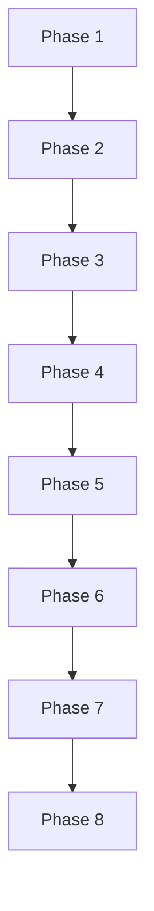

# Issue #830 プロジェクト計画書

## 1. Issue分析
- **複雑度**: 中程度
- **見積もり工数**: 10~14時間（Dockerfileの依存追加と動作確認 2~3h、認証失敗検出ロジックの設計/改修 3~4h、既存ユニットテスト拡張 3~4h、テスト実行・ドキュメント更新・レポート 2~3h）
- **リスク評価**: 中

## 2. 実装戦略判断

### 実装戦略: EXTEND
**判断根拠**: 既存のDockerfileと認証失敗検出ロジックに対して依存追加と検出精度の改善を行う拡張が中心であり、新規サブシステム追加や大規模構造変更は行わないため。

### テスト戦略: UNIT_INTEGRATION
**判断根拠**: 認証失敗検出ロジックはユニットテストで検証し、Dockerイメージ内CLI導入は統合的観点（ビルド/実行確認）で検証が必要なため。

### テストコード戦略: EXTEND_TEST
**判断根拠**: 既存の `tests/unit/phases/core/agent-executor*.test.ts` に誤検知防止ケースを追加するのが最短で影響範囲が限定的。新規テストファイル追加は必須ではないため。

## 3. 影響範囲分析
- **既存コードへの影響**: `Dockerfile`、`src/phases/core/agent-executor.ts`、`tests/unit/phases/core/agent-executor.test.ts`、`tests/unit/phases/core/agent-executor-codex-availability.test.ts`、必要に応じて `docs/TROUBLESHOOTING.md`
- **依存関係の変更**: グローバルnpmパッケージ `@anthropic-ai/claude-code@latest` をDockerfileで追加（既存依存の変更なし）
- **マイグレーション要否**: なし（DB・設定スキーマ変更なし）

## 4. タスク分割

### Phase 1: 要件定義 (見積もり: 1~2h)
- [x] Task 1-1: 不具合再現条件と受け入れ基準の確定 (1~2h)
  サブタスク: Jenkins `all-phases` の失敗ログ/再現条件の整理、完了条件（Dockerfile更新・誤検知防止・テスト継続成功）の明文化

### Phase 2: 設計 (見積もり: 2~3h)
- [ ] Task 2-1: 認証失敗検出ロジックの設計 (2~3h)
  サブタスク: 検出対象をJSONイベント/エラー構造に限定する方針決定、stdout由来のソース断片を誤検知しない条件定義

### Phase 3: テストシナリオ (見積もり: 1~2h)
- [ ] Task 3-1: テストケース設計 (1~2h)
  サブタスク: 既存ファイル内容を読み込んでも誤検知しないケース、正しい認証エラーイベントを検出するケース

### Phase 4: 実装 (見積もり: 3~4h)
- [ ] Task 4-1: DockerfileへのClaude Code CLI導入 (1~2h)
  サブタスク: `@anthropic-ai/claude-code@latest` のインストール追加、`claude --version` のbest-effort確認追加
- [ ] Task 4-2: 認証失敗検出ロジックの厳密化 (2~3h)
  サブタスク: メッセージ配列ではなく構造化イベント/エラーのみを対象化、旧ロジックからの移行点と例外処理の整理

### Phase 5: テストコード実装 (見積もり: 2~3h)
- [ ] Task 5-1: ユニットテストの拡張 (2~3h)
  サブタスク: `agent-executor` の誤検知防止テスト追加、認証失敗の正検出テスト追加

### Phase 6: テスト実行 (見積もり: 1~2h)
- [ ] Task 6-1: 既存テストの実行と結果確認 (1~2h)
  サブタスク: `npm run test:unit` 実行、可能であれば `npm run validate` 実行

### Phase 7: ドキュメント (見積もり: 1~2h)
- [ ] Task 7-1: 運用ドキュメント更新 (1~2h)
  サブタスク: DockerイメージにClaude Code CLIが必要な旨を追記、誤検知回避の背景/注意点を簡潔に記載

### Phase 8: レポート (見積もり: 1~2h)
- [ ] Task 8-1: 変更内容と検証結果のレポート作成 (1~2h)
  サブタスク: 変更点・影響範囲・テスト結果の整理、未実施項目があれば理由を明記

## 5. 依存関係

## 6. リスクと軽減策

#### リスク1: Claude Code CLIの導入失敗
- **影響度**: 高
- **確率**: 中
- **軽減策**: Dockerfileにbest-effort導入ログを残す。CIで `claude --version` を確認し、失敗時のログを明示。

#### リスク2: 認証失敗検出の過検出/未検出
- **影響度**: 中
- **確率**: 中
- **軽減策**: JSON構造化イベント/エラーのみを検出対象に限定し、誤検知ケースと正検知ケースのユニットテストを追加。

#### リスク3: 既存テストの回帰
- **影響度**: 中
- **確率**: 低
- **軽減策**: `tests/unit/phases/core/agent-executor*.test.ts` を優先的に実行し、関連ロジックの影響を確認。

#### リスク4: Dockerイメージ再ビルドの外部依存
- **影響度**: 中
- **確率**: 中
- **軽減策**: 依存インストールの失敗時に警告ログを残し、ビルド失敗時のリトライ手順を明記。

## 7. 品質ゲート

#### Phase 1: 要件定義
- [ ] 失敗条件と再現条件が明記されている
- [ ] 完了条件が具体的に定義されている

#### Phase 2: 設計
- [ ] 実装戦略の判断根拠が明記されている
- [ ] テスト戦略の判断根拠が明記されている
- [ ] 認証失敗検出の対象範囲が明確化されている

#### Phase 3: テストシナリオ
- [ ] 誤検知防止ケースが定義されている
- [ ] 正しい認証失敗検出ケースが定義されている

#### Phase 4: 実装
- [ ] DockerfileにClaude Code CLI導入が反映されている
- [ ] 認証失敗検出ロジックが厳密化されている

#### Phase 5: テストコード実装
- [ ] 既存テストに誤検知防止ケースが追加されている
- [ ] 認証失敗の正検出テストが追加されている

#### Phase 6: テスト実行
- [ ] `npm run test:unit` が成功している
- [ ] 可能であれば `npm run validate` が成功している

#### Phase 7: ドキュメント
- [ ] Dockerイメージの依存追加がドキュメント化されている
- [ ] 誤検知防止の背景が簡潔に説明されている

#### Phase 8: レポート
- [ ] 変更点・影響範囲・テスト結果が整理されている
- [ ] 未実施項目があれば理由が明記されている
