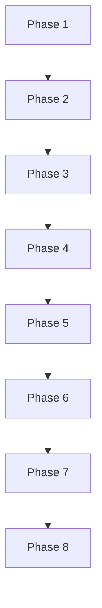

# Codex Agent 実行ログ

開始日時: 2026/4/9 7:29:35

---

## Turn 1: スレッド開始

**Thread ID**: `[REDACTED_TOKEN]`

## Turn 2: ツール実行

**種別**: コマンド実行
**コマンド**: `/bin/bash -lc pwd`
**ステータス**: completed (exit_code=0)

```text
/tmp/ai-workflow-repos-4-b659c7bb/ai-workflow-agent
```

## Turn 3: ツール実行

**種別**: コマンド実行
**コマンド**: `/bin/bash -lc ls`
**ステータス**: completed (exit_code=0)

```text
AGENT_TEAMS.md
CHANGELOG.md
CLAUDE.md
[REDACTED_TOKEN].md
[REDACTED_TOKEN].md
[REDACTED_TOKEN].md
[REDACTED_TOKEN].md
[REDACTED_TOKEN].md
[REDACTED_TOKEN].md
CODEBASE_SUMMARY.md
Dockerfile
Jenkinsfile
LICENSE
PROGRESS.md
README.md
[REDACTED_TOKEN].md
[REDACTED_TOKEN].md
TROUBLESHOOTING.md
__mocks__
docs
examples
jenkins
jest.config.cjs
metadata.json.template
package-lock.json
package.json
scripts
src
tests
tmp
tsconfig.json
tsconfig.test.json
```

## Turn 4: ツール実行

**種別**: コマンド実行
**コマンド**: `/bin/bash -lc 'ls -a'`
**ステータス**: completed (exit_code=0)

```text
.
..
.ai-workflow
.eslintrc.json
.git
.github
.gitignore
.npmrc
AGENT_TEAMS.md
CHANGELOG.md
CLAUDE.md
[REDACTED_TOKEN].md
[REDACTED_TOKEN].md
[REDACTED_TOKEN].md
[REDACTED_TOKEN].md
[REDACTED_TOKEN].md
[REDACTED_TOKEN].md
CODEBASE_SUMMARY.md
Dockerfile
Jenkinsfile
LICENSE
PROGRESS.md
README.md
[REDACTED_TOKEN].md
[REDACTED_TOKEN].md
TROUBLESHOOTING.md
__mocks__
docs
examples
jenkins
jest.config.cjs
metadata.json.template
package-lock.json
package.json
scripts
src
tests
tmp
tsconfig.json
tsconfig.test.json
```

## Turn 5: ツール実行

**種別**: コマンド実行
**コマンド**: `/bin/bash -lc 'cat .ai-workflow/issue-830/00_planning/output/planning.md'`
**ステータス**: completed (exit_code=0)

```text
# Issue #830 プロジェクト計画書

## 1. Issue分析
- **複雑度**: 中程度
- **見積もり工数**: 10~14時間（Dockerfileの依存追加と動作確認 2~3h、認証失敗検出ロジックの設計/改修 3~4h、既存ユニットテスト拡張 3~4h、テスト実行・ドキュメント更新・レポート 2~3h）
- **リスク評価**: 中

## 2. 実装戦略判断

### 実装戦略: EXTEND
**判断根拠**: 既存のDockerfileと認証失敗検出ロジックに対して依存追加と検出精度の改善を行う拡張が中心であり、新規サブシステム追加や大規模構造変更は行わないため。

### テスト戦略: UNIT_INTEGRATION
**判断根拠**: 認証失敗検出ロジックはユニットテストで検証し、Dockerイメージ内CLI導入は統合的観点（ビルド/実行確認）で検証が必要なため。

### テストコード戦略: EXTEND_TEST
**判断根拠**: 既存の `tests/unit/phases/core/agent-executor*.test.ts` に誤検知防止ケースを追加するのが最短で影響範囲が限定的。新規テストファイル追加は必須ではないため。

## 3. 影響範囲分析
- **既存コードへの影響**: `Dockerfile`、`src/phases/core/agent-executor.ts`、`tests/unit/phases/core/agent-executor.test.ts`、`tests/unit/phases/core/agent-executor-codex-availability.test.ts`、必要に応じて `docs/TROUBLESHOOTING.md`
- **依存関係の変更**: グローバルnpmパッケージ `@anthropic-ai/claude-code@latest` をDockerfileで追加（既存依存の変更なし）
- **マイグレーション要否**: なし（DB・設定スキーマ変更なし）

## 4. タスク分割

### Phase 1: 要件定義 (見積もり: 1~2h)
- [ ] Task 1-1: 不具合再現条件と受け入れ基準の確定 (1~2h)
  サブタスク: Jenkins `all-phases` の失敗ログ/再現条件の整理、完了条件（Dockerfile更新・誤検知防止・テスト継続成功）の明文化

### Phase 2: 設計 (見積もり: 2~3h)
- [ ] Task 2-1: 認証失敗検出ロジックの設計 (2~3h)
  サブタスク: 検出対象をJSONイベント/エラー構造に限定する方針決定、stdout由来のソース断片を誤検知しない条件定義

### Phase 3: テストシナリオ (見積もり: 1~2h)
- [ ] Task 3-1: テストケース設計 (1~2h)
  サブタスク: 既存ファイル内容を読み込んでも誤検知しないケース、正しい認証エラーイベントを検出するケース

### Phase 4: 実装 (見積もり: 3~4h)
- [ ] Task 4-1: DockerfileへのClaude Code CLI導入 (1~2h)
  サブタスク: `@anthropic-ai/claude-code@latest` のインストール追加、`claude --version` のbest-effort確認追加
- [ ] Task 4-2: 認証失敗検出ロジックの厳密化 (2~3h)
  サブタスク: メッセージ配列ではなく構造化イベント/エラーのみを対象化、旧ロジックからの移行点と例外処理の整理

### Phase 5: テストコード実装 (見積もり: 2~3h)
- [ ] Task 5-1: ユニットテストの拡張 (2~3h)
  サブタスク: `agent-executor` の誤検知防止テスト追加、認証失敗の正検出テスト追加

### Phase 6: テスト実行 (見積もり: 1~2h)
- [ ] Task 6-1: 既存テストの実行と結果確認 (1~2h)
  サブタスク: `npm run test:unit` 実行、可能であれば `npm run validate` 実行

### Phase 7: ドキュメント (見積もり: 1~2h)
- [ ] Task 7-1: 運用ドキュメント更新 (1~2h)
  サブタスク: DockerイメージにClaude Code CLIが必要な旨を追記、誤検知回避の背景/注意点を簡潔に記載

### Phase 8: レポート (見積もり: 1~2h)
- [ ] Task 8-1: 変更内容と検証結果のレポート作成 (1~2h)
  サブタスク: 変更点・影響範囲・テスト結果の整理、未実施項目があれば理由を明記

## 5. 依存関係



## 6. リスクと軽減策

#### リスク1: Claude Code CLIの導入失敗
- **影響度**: 高
- **確率**: 中
- **軽減策**: Dockerfileにbest-effort導入ログを残す。CIで `claude --version` を確認し、失敗時のログを明示。

#### リスク2: 認証失敗検出の過検出/未検出
- **影響度**: 中
- **確率**: 中
- **軽減策**: JSON構造化イベント/エラーのみを検出対象に限定し、誤検知ケースと正検知ケースのユニットテストを追加。

#### リスク3: 既存テストの回帰
- **影響度**: 中
- **確率**: 低
- **軽減策**: `tests/unit/phases/core/agent-executor*.test.ts` を優先的に実行し、関連ロジックの影響を確認。

#### リスク4: Dockerイメージ再ビルドの外部依存
- **影響度**: 中
- **確率**: 中
- **軽減策**: 依存インストールの失敗時に警告ログを残し、ビルド失敗時のリトライ手順を明記。

## 7. 品質ゲート

#### Phase 1: 要件定義
- [ ] 失敗条件と再現条件が明記されている
- [ ] 完了条件が具体的に定義されている

#### Phase 2: 設計
- [ ] 実装戦略の判断根拠が明記されている
- [ ] テスト戦略の判断根拠が明記されている
- [ ] 認証失敗検出の対象範囲が明確化されている

#### Phase 3: テストシナリオ
- [ ] 誤検知防止ケースが定義されている
- [ ] 正しい認証失敗検出ケースが定義されている

#### Phase 4: 実装
- [ ] DockerfileにClaude Code CLI導入が反映されている
- [ ] 認証失敗検出ロジックが厳密化されている

#### Phase 5: テストコード実装
- [ ] 既存テストに誤検知防止ケースが追加されている
- [ ] 認証失敗の正検出テストが追加されている

#### Phase 6: テスト実行
- [ ] `npm run test:unit` が成功している
- [ ] 可能であれば `npm run validate` が成功している

#### Phase 7: ドキュメント
- [ ] Dockerイメージの依存追加がドキュメント化されている
- [ ] 誤検知防止の背景が簡潔に説明されている

#### Phase 8: レポート
- [ ] 変更点・影響範囲・テスト結果が整理されている
- [ ] 未実施項目があれば理由が明記されている
```

## Turn 6: ツール実行

**種別**: コマンド実行
**コマンド**: `/bin/bash -lc 'cat .ai-workflow/issue-830/01_requirements/output/requirements.md'`
**ステータス**: completed (exit_code=0)

```text
# Issue #830 要件定義書

## 0. Planning Documentの確認（Planning Phaseが実行されている場合）
Planning Documentを確認し、実装戦略はEXTEND、テスト戦略はUNIT_INTEGRATION、テストコード戦略はEXTEND_TESTであることを把握した。スコープはDockerfileへのClaude Code CLI導入、認証失敗検出ロジックの厳密化、既存ユニットテスト拡張が中心である。リスクは「Claude Code CLI導入失敗」「認証失敗検出の過検出/未検出」「既存テスト回帰」「Dockerイメージ再ビルドの外部依存」で、対策としてbest-effort導入ログ、検出対象の限定、重点テスト実行、リトライ手順明記を前提とする。スケジュールは概ね10〜14時間の見積で、要件定義→設計→テスト設計→実装→テスト実装→テスト実行→ドキュメント→レポートの順で進む。

## 1. 概要
- 要約: `all-phases` ジョブの `test_implementation` フェーズが常にFAILUREになる。原因は「Claude Code CLI未導入」と「認証失敗検出の誤検知」の2つが独立に存在し、後者でCodexの正常完了後に誤ってフォールバックが発動し、前者によりClaudeが即時終了するためである。
- 背景: 既存DockerイメージにはCodex CLIのみがインストールされ、Claude Code CLIが欠落している。加えて、認証失敗検出がエージェント出力全文（stdout含む）を文字列スキャンするため、リポジトリ内ソースの文字列が誤検知を誘発する。
- 目的: Claude Code CLIをDockerイメージへ導入し、認証失敗検出を誤検知しない厳密な判定へ改善する。
- ビジネス価値: `all-phases` の安定稼働によりCIの信頼性と開発速度を回復し、無駄なフォールバックによるコストを削減する。
- 技術的価値: 依存関係の欠落を解消し、認証エラー検知の正確性を高めることで運用品質を向上させる。

## 2. 機能要件
Issue本文に「## TODO」セクションは存在しないため、Issueの「完了条件」を機能要件として定義する。

1. FR-1: DockerfileにClaude Code CLIのインストールを追加する。内容はDockerfileのnpm install工程に `@anthropic-ai/claude-code@latest` を追加し、`claude --version` による確認（best-effort）を実行する。優先度は高。
2. FR-2: 認証失敗検出ロジックを厳密化する。内容は `src/phases/core/agent-executor.ts` のauthFailed検出をstdout由来の任意文字列に依存しない方式へ変更する（例: JSON構造化イベント/エラーのみ、または厳密なJSONパターン一致）。優先度は高。
3. FR-3: 誤検知が起きないことをテストで保証する。内容はリポジトリ内ソースを読み取るケースを含め、認証失敗の誤検知が発生しないこと、および正しい認証エラーが検出されることをユニットテストで担保する。優先度は高。
4. FR-4: 既存ユニットテストが継続して通ることを保証する。内容は `tests/unit/phases/core/agent-executor*.test.ts` を含む既存テストが改修後も成功すること。優先度は中。
5. FR-5: ECRイメージを再ビルドし `all-phases` が通ることを確認する。内容はDockerイメージを再ビルドし、`all-phases` が成功することを確認する。優先度は中。

## 3. 非機能要件
- パフォーマンス要件: 既存ワークフローの総実行時間を悪化させないこと（CLI導入・検出ロジック変更による顕著な実行時間増がないこと）。
- セキュリティ要件: Claude/Codexの認証情報はログに平文出力しないこと。認証失敗検出はエラー構造に限定し、機密情報の漏えいに繋がるログ増加を避けること。
- 可用性・信頼性要件: `all-phases` の `test_implementation` が再現的に失敗しないこと。CLI導入失敗時は警告ログを残し、ビルドや実行が即時停止しない設計（best-effort方針の場合）を明確化すること。
- 保守性・拡張性要件: 認証失敗検出は将来のイベント形式変更に追随しやすい実装（構造化イベント中心）とすること。

## 4. 制約事項
- 技術的制約: 既存のDockerfile、`agent-executor.ts`、既存ユニットテスト群を前提に改修すること。新規の大規模サブシステム追加は行わない。
- リソース制約: 見積もり工数は10〜14時間。要件定義・設計・実装・テストまでを段階的に実施する。
- ポリシー制約: 既存コーディング規約およびCI運用方針に従うこと。認証情報の取り扱いに関する既存ポリシーに準拠すること。

## 5. 前提条件
- システム環境: Dockerビルド環境が利用可能であること。Node.js/npmがDockerイメージ内に存在すること。
- 依存コンポーネント: `@anthropic-ai/claude-agent-sdk` が `@anthropic-ai/claude-code` のCLIを参照する設計であること。
- 外部システム連携: ECRへのイメージ再ビルド/デプロイが可能であること。CI環境で `all-phases` が実行可能であること。

## 6. 受け入れ基準（Given-When-Then）
1. AC-1（FR-1）: Given: Dockerfileのビルド環境が利用可能。When: Dockerイメージをビルドする。Then: `@anthropic-ai/claude-code@latest` がインストールされ、`claude --version` の結果が確認できる（失敗時はWARNINGログを出す）。
2. AC-2（FR-2）: Given: Codexが正常に `type=turn.completed` を出力する。When: 認証失敗検出を実行する。Then: stdoutにソースコード文字列が含まれていても認証失敗と誤判定しない。
3. AC-3（FR-2）: Given: Codexの構造化イベント/エラーに認証失敗が含まれる。When: 認証失敗検出を実行する。Then: 認証失敗として検出され、適切なフォールバック/エラー処理が行われる。
4. AC-4（FR-3）: Given: リポジトリ内の該当ソースを参照するテストケース。When: ユニットテストを実行する。Then: 誤検知が発生しないことがテストで保証される。
5. AC-5（FR-4）: Given: 既存のユニットテスト群。When: `tests/unit/phases/core/agent-executor*.test.ts` を含むテストを実行する。Then: すべて成功する。
6. AC-6（FR-5）: Given: Claude Code CLI導入と認証失敗検出の改修が完了している。When: ECRイメージを再ビルドし `all-phases` を実行する。Then: `test_implementation` を含む全フェーズが成功する。

## 7. スコープ外
- スコープ外: Claude/Codex以外のエージェント導入やワークフロー構造の大規模変更。
- スコープ外: 新規のCIパイプライン設計変更。
- スコープ外: 認証方式そのものの刷新（トークン発行方式の変更等）。
- 将来的な拡張候補: 認証失敗検出ロジックの汎用化（複数SDK/CLI対応）。
- 将来的な拡張候補: 失敗時の自動再試行やリカバリーフローの拡充。
```

## Turn 7: ツール実行

**種別**: file_change
**ステータス**: completed

## Turn 8: ツール実行

**種別**: reasoning
**ステータス**: completed

## Turn 9: ツール実行

**種別**: agent_message
**ステータス**: completed

## Turn 10: 実行完了

**ステータス**: completed
**所要時間**: 41948ms
**ターン数**: N/A

---

**経過時間**: 41948ms
**開始**: 2026/4/9 7:29:35
**終了**: 2026/4/9 7:30:17