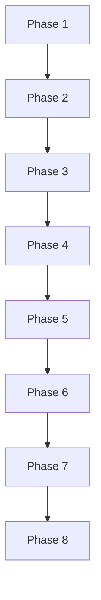
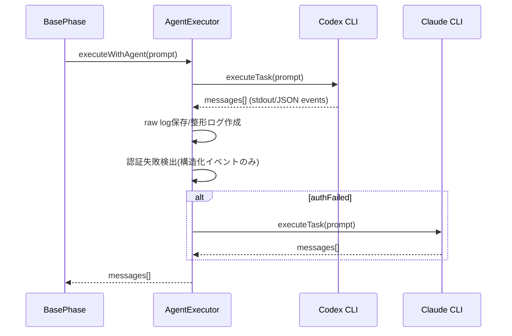

# Codex Agent 実行ログ

開始日時: 2026/4/9 7:35:37

---

## Turn 1: スレッド開始

**Thread ID**: `[REDACTED_TOKEN]`

## Turn 2: ツール実行

**種別**: reasoning
**ステータス**: completed

## Turn 3: ツール実行

**種別**: コマンド実行
**コマンド**: `/bin/bash -lc 'python3 --version'`
**ステータス**: completed (exit_code=0)

```text
Python 3.11.2
```

## Turn 4: ツール実行

**種別**: reasoning
**ステータス**: completed

## Turn 5: ツール実行

**種別**: コマンド実行
**コマンド**: `/bin/bash -lc 'ls -la .ai-workflow/issue-830/00_planning/output && ls -la .ai-workflow/issue-830/01_requirements/output'`
**ステータス**: completed (exit_code=0)

```text
total 8
drwxr-xr-x. 2 node node   25 Apr  9 07:21 .
drwxr-xr-x. 6 node node   63 Apr  9 07:18 ..
-rw-r--r--. 1 node node 6406 Apr  9 07:29 planning.md
total 8
drwxr-xr-x. 2 node node   29 Apr  9 07:27 .
drwxr-xr-x. 6 node node   63 Apr  9 07:24 ..
-rw-r--r--. 1 node node 7296 Apr  9 07:29 requirements.md
```

## Turn 6: ツール実行

**種別**: reasoning
**ステータス**: completed

## Turn 7: ツール実行

**種別**: コマンド実行
**コマンド**: `/bin/bash -lc "sed -n '1,200p' .ai-workflow/issue-830/00_planning/output/planning.md"`
**ステータス**: completed (exit_code=0)

```text
# Issue #830 プロジェクト計画書

## 1. Issue分析
- **複雑度**: 中程度
- **見積もり工数**: 10~14時間（Dockerfileの依存追加と動作確認 2~3h、認証失敗検出ロジックの設計/改修 3~4h、既存ユニットテスト拡張 3~4h、テスト実行・ドキュメント更新・レポート 2~3h）
- **リスク評価**: 中

## 2. 実装戦略判断

### 実装戦略: EXTEND
**判断根拠**: 既存のDockerfileと認証失敗検出ロジックに対して依存追加と検出精度の改善を行う拡張が中心であり、新規サブシステム追加や大規模構造変更は行わないため。

### テスト戦略: UNIT_INTEGRATION
**判断根拠**: 認証失敗検出ロジックはユニットテストで検証し、Dockerイメージ内CLI導入は統合的観点（ビルド/実行確認）で検証が必要なため。

### テストコード戦略: EXTEND_TEST
**判断根拠**: 既存の `tests/unit/phases/core/agent-executor*.test.ts` に誤検知防止ケースを追加するのが最短で影響範囲が限定的。新規テストファイル追加は必須ではないため。

## 3. 影響範囲分析
- **既存コードへの影響**: `Dockerfile`、`src/phases/core/agent-executor.ts`、`tests/unit/phases/core/agent-executor.test.ts`、`tests/unit/phases/core/agent-executor-codex-availability.test.ts`、必要に応じて `docs/TROUBLESHOOTING.md`
- **依存関係の変更**: グローバルnpmパッケージ `@anthropic-ai/claude-code@latest` をDockerfileで追加（既存依存の変更なし）
- **マイグレーション要否**: なし（DB・設定スキーマ変更なし）

## 4. タスク分割

### Phase 1: 要件定義 (見積もり: 1~2h)
- [x] Task 1-1: 不具合再現条件と受け入れ基準の確定 (1~2h)
  サブタスク: Jenkins `all-phases` の失敗ログ/再現条件の整理、完了条件（Dockerfile更新・誤検知防止・テスト継続成功）の明文化

### Phase 2: 設計 (見積もり: 2~3h)
- [ ] Task 2-1: 認証失敗検出ロジックの設計 (2~3h)
  サブタスク: 検出対象をJSONイベント/エラー構造に限定する方針決定、stdout由来のソース断片を誤検知しない条件定義

### Phase 3: テストシナリオ (見積もり: 1~2h)
- [ ] Task 3-1: テストケース設計 (1~2h)
  サブタスク: 既存ファイル内容を読み込んでも誤検知しないケース、正しい認証エラーイベントを検出するケース

### Phase 4: 実装 (見積もり: 3~4h)
- [ ] Task 4-1: DockerfileへのClaude Code CLI導入 (1~2h)
  サブタスク: `@anthropic-ai/claude-code@latest` のインストール追加、`claude --version` のbest-effort確認追加
- [ ] Task 4-2: 認証失敗検出ロジックの厳密化 (2~3h)
  サブタスク: メッセージ配列ではなく構造化イベント/エラーのみを対象化、旧ロジックからの移行点と例外処理の整理

### Phase 5: テストコード実装 (見積もり: 2~3h)
- [ ] Task 5-1: ユニットテストの拡張 (2~3h)
  サブタスク: `agent-executor` の誤検知防止テスト追加、認証失敗の正検出テスト追加

### Phase 6: テスト実行 (見積もり: 1~2h)
- [ ] Task 6-1: 既存テストの実行と結果確認 (1~2h)
  サブタスク: `npm run test:unit` 実行、可能であれば `npm run validate` 実行

### Phase 7: ドキュメント (見積もり: 1~2h)
- [ ] Task 7-1: 運用ドキュメント更新 (1~2h)
  サブタスク: DockerイメージにClaude Code CLIが必要な旨を追記、誤検知回避の背景/注意点を簡潔に記載

### Phase 8: レポート (見積もり: 1~2h)
- [ ] Task 8-1: 変更内容と検証結果のレポート作成 (1~2h)
  サブタスク: 変更点・影響範囲・テスト結果の整理、未実施項目があれば理由を明記

## 5. 依存関係



## 6. リスクと軽減策

#### リスク1: Claude Code CLIの導入失敗
- **影響度**: 高
- **確率**: 中
- **軽減策**: Dockerfileにbest-effort導入ログを残す。CIで `claude --version` を確認し、失敗時のログを明示。

#### リスク2: 認証失敗検出の過検出/未検出
- **影響度**: 中
- **確率**: 中
- **軽減策**: JSON構造化イベント/エラーのみを検出対象に限定し、誤検知ケースと正検知ケースのユニットテストを追加。

#### リスク3: 既存テストの回帰
- **影響度**: 中
- **確率**: 低
- **軽減策**: `tests/unit/phases/core/agent-executor*.test.ts` を優先的に実行し、関連ロジックの影響を確認。

#### リスク4: Dockerイメージ再ビルドの外部依存
- **影響度**: 中
- **確率**: 中
- **軽減策**: 依存インストールの失敗時に警告ログを残し、ビルド失敗時のリトライ手順を明記。

## 7. 品質ゲート

#### Phase 1: 要件定義
- [ ] 失敗条件と再現条件が明記されている
- [ ] 完了条件が具体的に定義されている

#### Phase 2: 設計
- [ ] 実装戦略の判断根拠が明記されている
- [ ] テスト戦略の判断根拠が明記されている
- [ ] 認証失敗検出の対象範囲が明確化されている

#### Phase 3: テストシナリオ
- [ ] 誤検知防止ケースが定義されている
- [ ] 正しい認証失敗検出ケースが定義されている

#### Phase 4: 実装
- [ ] DockerfileにClaude Code CLI導入が反映されている
- [ ] 認証失敗検出ロジックが厳密化されている

#### Phase 5: テストコード実装
- [ ] 既存テストに誤検知防止ケースが追加されている
- [ ] 認証失敗の正検出テストが追加されている

#### Phase 6: テスト実行
- [ ] `npm run test:unit` が成功している
- [ ] 可能であれば `npm run validate` が成功している

#### Phase 7: ドキュメント
- [ ] Dockerイメージの依存追加がドキュメント化されている
- [ ] 誤検知防止の背景が簡潔に説明されている

#### Phase 8: レポート
- [ ] 変更点・影響範囲・テスト結果が整理されている
- [ ] 未実施項目があれば理由が明記されている
```

## Turn 8: ツール実行

**種別**: コマンド実行
**コマンド**: `/bin/bash -lc "sed -n '1,200p' .ai-workflow/issue-830/01_requirements/output/requirements.md"`
**ステータス**: completed (exit_code=0)

```text
# Issue #830 要件定義書

## 0. Planning Documentの確認（Planning Phaseが実行されている場合）
Planning Documentを確認し、実装戦略はEXTEND、テスト戦略はUNIT_INTEGRATION、テストコード戦略はEXTEND_TESTであることを把握した。スコープはDockerfileへのClaude Code CLI導入、認証失敗検出ロジックの厳密化、既存ユニットテスト拡張が中心である。リスクは「Claude Code CLI導入失敗」「認証失敗検出の過検出/未検出」「既存テスト回帰」「Dockerイメージ再ビルドの外部依存」で、対策としてbest-effort導入ログ、検出対象の限定、重点テスト実行、リトライ手順明記を前提とする。スケジュールは概ね10〜14時間の見積で、要件定義→設計→テスト設計→実装→テスト実装→テスト実行→ドキュメント→レポートの順で進む。

## 1. 概要
- 要約: `all-phases` ジョブの `test_implementation` フェーズが常にFAILUREになる。原因は「Claude Code CLI未導入」と「認証失敗検出の誤検知」の2つが独立に存在し、後者でCodexの正常完了後に誤ってフォールバックが発動し、前者によりClaudeが即時終了するためである。
- 背景: 既存DockerイメージにはCodex CLIのみがインストールされ、Claude Code CLIが欠落している。加えて、認証失敗検出がエージェント出力全文（stdout含む）を文字列スキャンするため、リポジトリ内ソースの文字列が誤検知を誘発する。
- 目的: Claude Code CLIをDockerイメージへ導入し、認証失敗検出を誤検知しない厳密な判定へ改善する。
- ビジネス価値: `all-phases` の安定稼働によりCIの信頼性と開発速度を回復し、無駄なフォールバックによるコストを削減する。
- 技術的価値: 依存関係の欠落を解消し、認証エラー検知の正確性を高めることで運用品質を向上させる。

## 2. 機能要件
Issue本文に「## TODO」セクションは存在しないため、Issueの「完了条件」を機能要件として定義する。

1. FR-1: DockerfileにClaude Code CLIのインストールを追加する。内容はDockerfileのnpm install工程に `@anthropic-ai/claude-code@latest` を追加し、`claude --version` による確認（best-effort）を実行する。優先度は高。
2. FR-2: 認証失敗検出ロジックを厳密化する。内容は `src/phases/core/agent-executor.ts` のauthFailed検出をstdout由来の任意文字列に依存しない方式へ変更する（例: JSON構造化イベント/エラーのみ、または厳密なJSONパターン一致）。優先度は高。
3. FR-3: 誤検知が起きないことをテストで保証する。内容はリポジトリ内ソースを読み取るケースを含め、認証失敗の誤検知が発生しないこと、および正しい認証エラーが検出されることをユニットテストで担保する。優先度は高。
4. FR-4: 既存ユニットテストが継続して通ることを保証する。内容は `tests/unit/phases/core/agent-executor*.test.ts` を含む既存テストが改修後も成功すること。優先度は中。
5. FR-5: ECRイメージを再ビルドし `all-phases` が通ることを確認する。内容はDockerイメージを再ビルドし、`all-phases` が成功することを確認する。優先度は中。

## 3. 非機能要件
- パフォーマンス要件: 既存ワークフローの総実行時間を悪化させないこと（CLI導入・検出ロジック変更による顕著な実行時間増がないこと）。
- セキュリティ要件: Claude/Codexの認証情報はログに平文出力しないこと。認証失敗検出はエラー構造に限定し、機密情報の漏えいに繋がるログ増加を避けること。
- 可用性・信頼性要件: `all-phases` の `test_implementation` が再現的に失敗しないこと。CLI導入失敗時は警告ログを残し、ビルドや実行が即時停止しない設計（best-effort方針の場合）を明確化すること。
- 保守性・拡張性要件: 認証失敗検出は将来のイベント形式変更に追随しやすい実装（構造化イベント中心）とすること。

## 4. 制約事項
- 技術的制約: 既存のDockerfile、`agent-executor.ts`、既存ユニットテスト群を前提に改修すること。新規の大規模サブシステム追加は行わない。
- リソース制約: 見積もり工数は10〜14時間。要件定義・設計・実装・テストまでを段階的に実施する。
- ポリシー制約: 既存コーディング規約およびCI運用方針に従うこと。認証情報の取り扱いに関する既存ポリシーに準拠すること。

## 5. 前提条件
- システム環境: Dockerビルド環境が利用可能であること。Node.js/npmがDockerイメージ内に存在すること。
- 依存コンポーネント: `@anthropic-ai/claude-agent-sdk` が `@anthropic-ai/claude-code` のCLIを参照する設計であること。
- 外部システム連携: ECRへのイメージ再ビルド/デプロイが可能であること。CI環境で `all-phases` が実行可能であること。

## 6. 受け入れ基準（Given-When-Then）
1. AC-1（FR-1）: Given: Dockerfileのビルド環境が利用可能。When: Dockerイメージをビルドする。Then: `@anthropic-ai/claude-code@latest` がインストールされ、`claude --version` の結果が確認できる（失敗時はWARNINGログを出す）。
2. AC-2（FR-2）: Given: Codexが正常に `type=turn.completed` を出力する。When: 認証失敗検出を実行する。Then: stdoutにソースコード文字列が含まれていても認証失敗と誤判定しない。
3. AC-3（FR-2）: Given: Codexの構造化イベント/エラーに認証失敗が含まれる。When: 認証失敗検出を実行する。Then: 認証失敗として検出され、適切なフォールバック/エラー処理が行われる。
4. AC-4（FR-3）: Given: リポジトリ内の該当ソースを参照するテストケース。When: ユニットテストを実行する。Then: 誤検知が発生しないことがテストで保証される。
5. AC-5（FR-4）: Given: 既存のユニットテスト群。When: `tests/unit/phases/core/agent-executor*.test.ts` を含むテストを実行する。Then: すべて成功する。
6. AC-6（FR-5）: Given: Claude Code CLI導入と認証失敗検出の改修が完了している。When: ECRイメージを再ビルドし `all-phases` を実行する。Then: `test_implementation` を含む全フェーズが成功する。

## 7. スコープ外
- スコープ外: Claude/Codex以外のエージェント導入やワークフロー構造の大規模変更。
- スコープ外: 新規のCIパイプライン設計変更。
- スコープ外: 認証方式そのものの刷新（トークン発行方式の変更等）。
- 将来的な拡張候補: 認証失敗検出ロジックの汎用化（複数SDK/CLI対応）。
- 将来的な拡張候補: 失敗時の自動再試行やリカバリーフローの拡充。
```

## Turn 9: ツール実行

**種別**: コマンド実行
**コマンド**: `/bin/bash -lc "ls -la | sed -n '1,200p'"`
**ステータス**: completed (exit_code=0)

```text
total 800
drwxr-xr-x. 13 node node  16384 Apr  9 07:17 .
drwxr-xr-x.  3 node node     31 Apr  9 07:17 ..
drwxr-xr-x.  6 node node     71 Apr  9 07:17 .ai-workflow
-rw-r--r--.  1 node node    174 Apr  9 07:17 .eslintrc.json
drwxr-xr-x.  8 node node  16384 Apr  9 07:30 .git
drwxr-xr-x.  3 node node  16384 Apr  9 07:17 .github
-rw-r--r--.  1 node node    510 Apr  9 07:17 .gitignore
-rw-r--r--.  1 node node     65 Apr  9 07:17 .npmrc
-rw-r--r--.  1 node node  13781 Apr  9 07:17 AGENT_TEAMS.md
-rw-r--r--.  1 node node 111857 Apr  9 07:17 CHANGELOG.md
-rw-r--r--.  1 node node  35162 Apr  9 07:17 CLAUDE.md
-rw-r--r--.  1 node node   7172 Apr  9 07:17 [REDACTED_TOKEN].md
-rw-r--r--.  1 node node  15780 Apr  9 07:17 [REDACTED_TOKEN].md
-rw-r--r--.  1 node node  16530 Apr  9 07:17 [REDACTED_TOKEN].md
-rw-r--r--.  1 node node  23454 Apr  9 07:17 [REDACTED_TOKEN].md
-rw-r--r--.  1 node node  27275 Apr  9 07:17 [REDACTED_TOKEN].md
-rw-r--r--.  1 node node  20467 Apr  9 07:17 [REDACTED_TOKEN].md
-rw-r--r--.  1 node node  24812 Apr  9 07:17 CODEBASE_SUMMARY.md
-rw-r--r--.  1 node node   3356 Apr  9 07:17 Dockerfile
-rw-r--r--.  1 node node  37855 Apr  9 07:17 Jenkinsfile
-rw-r--r--.  1 node node   1063 Apr  9 07:17 LICENSE
-rw-r--r--.  1 node node   4767 Apr  9 07:17 PROGRESS.md
-rw-r--r--.  1 node node  18381 Apr  9 07:17 README.md
-rw-r--r--.  1 node node  10334 Apr  9 07:17 [REDACTED_TOKEN].md
-rw-r--r--.  1 node node  12195 Apr  9 07:17 [REDACTED_TOKEN].md
-rw-r--r--.  1 node node   1494 Apr  9 07:17 TROUBLESHOOTING.md
drwxr-xr-x.  2 node node     25 Apr  9 07:17 __mocks__
drwxr-xr-x.  2 node node  16384 Apr  9 07:17 docs
drwxr-xr-x.  2 node node     29 Apr  9 07:17 examples
drwxr-xr-x.  4 node node     49 Apr  9 07:17 jenkins
-rw-r--r--.  1 node node   1264 Apr  9 07:17 jest.config.cjs
-rw-r--r--.  1 node node   2296 Apr  9 07:17 metadata.json.template
-rw-r--r--.  1 node node 298425 Apr  9 07:17 package-lock.json
-rw-r--r--.  1 node node   2290 Apr  9 07:17 package.json
drwxr-xr-x.  2 node node    192 Apr  9 07:17 scripts
drwxr-xr-x.  9 node node    153 Apr  9 07:17 src
drwxr-xr-x.  7 node node    123 Apr  9 07:17 tests
drwxr-xr-x.  3 node node     23 Apr  9 07:17 tmp
-rw-r--r--.  1 node node    452 Apr  9 07:17 tsconfig.json
-rw-r--r--.  1 node node    282 Apr  9 07:17 tsconfig.test.json
```

## Turn 10: ツール実行

**種別**: reasoning
**ステータス**: completed

## Turn 11: ツール実行

**種別**: コマンド実行
**コマンド**: `/bin/bash -lc "rg --files -g 'ARCHITECTURE.md' -g 'architecture.md'"`
**ステータス**: failed (exit_code=127)

```text
/bin/bash: line 1: rg: command not found
```

## Turn 12: ツール実行

**種別**: コマンド実行
**コマンド**: `/bin/bash -lc "find . -maxdepth 2 -name 'ARCHITECTURE.md' -o -name 'architecture.md'"`
**ステータス**: completed (exit_code=0)

```text
./docs/ARCHITECTURE.md
```

## Turn 13: ツール実行

**種別**: reasoning
**ステータス**: completed

## Turn 14: ツール実行

**種別**: コマンド実行
**コマンド**: `/bin/bash -lc "sed -n '1,200p' CLAUDE.md"`
**ステータス**: completed (exit_code=0)

```text
# CLAUDE.md

このファイルは、このリポジトリで作業する際に Claude Code (claude.ai/code) にガイダンスを提供します。

## 目次

- [プロジェクト概要](#プロジェクト概要)
- [Agent Teams 運用ガイドライン](#agent-teams-運用ガイドライン)
- [クイックスタート](#クイックスタート)
- [アーキテクチャ概要](#アーキテクチャ概要)
- [コーディング規約](#コーディング規約)
- [重要な制約事項](#重要な制約事項)
- [ドキュメント索引](#ドキュメント索引)

## プロジェクト概要

TypeScript ベースの AI Workflow 自動化ツールキットで、デュアルエージェント（Codex + Claude）をサポートしています。GitHub Issue に対して planning から evaluation までの 10 フェーズのワークフローを実行し、マルチリポジトリワークフロー、Jenkins 統合、永続的なメタデータ管理をサポートします。

**主要機能**:
- **デュアルエージェント**: Codex（gpt-5.2-codex）と Claude（Opus 4.5）の自動フォールバック
- **10フェーズワークフロー**: Planning → Requirements → Design → Test Scenario → Implementation → Test Implementation → Testing → Documentation → Report → Evaluation
- **永続化メタデータ**: `.ai-workflow/issue-*/metadata.json` でワークフロー状態を管理（サンプル: issue-7/issue-10/issue-105 をリファレンスとして保持）
- **マルチリポジトリ対応**: Issue URL から対象リポジトリを自動判定（v0.2.0）
- **Jenkins統合**: Docker コンテナ内で TypeScript CLI を実行

**リポジトリ構成**:
```
ai-workflow-agent/
├── src/
│   ├── core/                  # エージェント・Git/GitHub ヘルパー・メタデータ管理
│   ├── phases/                # 各フェーズ実装（planning 〜 evaluation）
│   ├── prompts/               # フェーズ/コマンド別・言語別プロンプト（{phase|category}/{lang}/*.txt）
│   ├── templates/             # PR ボディなどのテンプレート（{lang}/pr_body*.md）
│   ├── main.ts                # CLI 定義
│   └── index.ts               # bin エントリ
├── tests/
│   ├── unit/                  # ユニットテスト
│   └── integration/           # 統合テスト
├── docs/                      # ドキュメント（詳細は下記参照）
└── dist/                      # ビルド成果物（npm run build 後に生成）
```

## Agent Teams 運用ガイドライン

このプロジェクトは Claude Code の Agent Teams による並列開発をサポートしています。Agent Teams を使用する際は、以下のガイドラインに従ってください。

**詳細な実践ガイドは [AGENT_TEAMS.md](./AGENT_TEAMS.md) を参照してください。**

### ミッション・ビジョン・バリュー（MVV）

**ミッション**

AI Workflow 自動化ツールキットの品質と保守性を維持・向上させ、開発者が安心して利用できる信頼性の高いツールを提供する。

**ビジョン**

- デュアルエージェント（Codex + Claude）による柔軟なワークフロー自動化
- 10フェーズのライフサイクル管理による体系的な開発プロセス
- 多言語対応（日本語・英語）による国際的な利用促進
- 継続的なテストとドキュメントによる長期的な保守性の確保

**バリュー（行動指針）**

1. **既存機能を壊さない**: テストスイート（`npm run validate`）で常に検証する
2. **コードの整合性を維持する**: コーディング規約に従い、統一された品質を保つ
3. **段階的に進める**: 大規模な変更は小さなステップに分割し、各ステップで検証する
4. **判断に迷ったら確認する**: 不明確な要件や影響範囲が大きい変更は、必ず人間（コーチ役）に確認する

### テストスイートの位置づけ

テストスイートは「上司の代わり」として機能します。エージェントが作業を終えたら、以下のコマンドで自己検証してください。

```bash
# 統合検証（推奨）
npm run validate

# または個別に実行
npm run lint                # TypeScript 型チェック
npm test                    # ユニット・統合テスト
npm run build               # ビルド確認
```

- **テストが通ること = 品質の最低基準**：エージェントはテストが通ることをゴールに動く
- **出力はシンプルに**：エラーメッセージは grep しやすい形式（`ERROR: <理由>`）にする
- **高速フィードバック**：各エージェントが素早くリグレッションを検出できるようにする

### Agent Teams に適したタスク・適さないタスク

Agent Teams の特性を理解し、適切なタスクに適用してください。

**✅ Agent Teams に適したタスク（Read-Heavy）**

- 複数ファイルの調査・レビュー（コードレビュー、セキュリティ監査）
- 多角的な視点が必要なタスク（設計レビュー、アーキテクチャ分析）
- 独立性の高いタスク群（複数フェーズの並列実装、独立したバグ修正）
- ドキュメント作成・更新（各フェーズのドキュメント整備）

**❌ Agent Teams に適さないタスク（Write-Heavy）**

- 同一ファイルへの同時書き込み（マージコンフリクトのリスク）
- 強い逐次依存があるタスク（A完了後にBを開始する必要がある場合）
- 小規模な修正（単一ファイルの typo 修正など）
- 密結合な変更（1つの機能変更が複数ファイルに波及する場合）

### タスク分解のベストプラクティス

Agent Teams を効果的に活用するには、タスクを適切に分解する必要があります。

**良い分解（独立性が高い）**
```
✅ 各フェーズのプロンプト改善
├── Agent 1: planning フェーズのプロンプト改善
├── Agent 2: implementation フェーズのプロンプト改善
├── Agent 3: testing フェーズのプロンプト改善
└── Agent 4: documentation フェーズのプロンプト改善
```

**悪い分解（依存関係が強い）**
```
❌ すべてのプロンプトを一括変更
├── Agent 1: すべてのプロンプトを修正（範囲が広すぎる）
└── Agent 2: Agent 1 の完了を待つ（不必要な依存）
```

**改善案（機能単位で分割）**
```
✅ 機能ごとに独立させる
├── Agent 1: 日本語プロンプトの改善（全フェーズ）
├── Agent 2: 英語プロンプトの改善（全フェーズ）
└── Agent 3: プロンプト検証ツールの実装
```

### 並列化のパターン

| パターン | 適用場面 | 例 |
|---|---|---|
| コンポーネント分割型 | モジュール間の結合度が低い | 各エージェントが異なるフェーズの実装を担当 |
| 多角レビュー型 | 品質の多面的な評価が必要 | セキュリティ、パフォーマンス、可読性を別々のエージェントが評価 |
| ドキュメント並列型 | 複数のドキュメントを同時更新 | 各エージェントが異なる docs ファイルを更新 |
| 独立テスト型 | 多数の独立したテストケースがある | 各エージェントが異なるテストファイルを改善 |

### Team Leader（コーチ）の役割

Agent Teams では、Team leader が「コーチ」として環境を整え、エージェントを見守る役割を担います。

**重要な原則**:
- **仕事のやり方には口を出さない**：各エージェントの自律性を尊重する
- **環境や仕組みを整える**：タスク設計、ツール提供、障害の除去に集中する
- **見守り、必要に応じて介入する**：放置ではなく、適切なタイミングでサポー
... (truncated)
```

## Turn 15: ツール実行

**種別**: コマンド実行
**コマンド**: `/bin/bash -lc "sed -n '1,200p' docs/ARCHITECTURE.md"`
**ステータス**: completed (exit_code=0)

```text
# アーキテクチャ概要 ― AI Workflow v2 (TypeScript)

このドキュメントでは、TypeScript 版 AI Workflow の構成、モジュール間の制御フロー、および Codex / Claude Code / GitHub との連携方法を説明します。

## 全体フロー

```
CLI (src/main.ts - 約118行に削減、v0.3.0でリファクタリング)
 ├─ runCli() … CLI エントリーポイント
 ├─ commander定義（コマンドルーティングのみ）
 ├─ reportFatalError() … 致命的エラー報告
 ├─ [REDACTED_TOKEN]() … 実行サマリー表示
 └─ isValidPhaseName() … フェーズ名バリデーション

src/commands/init.ts (Issue初期化コマンド処理)
 ├─ handleInitCommand() … Issue初期化コマンドハンドラ
 ├─ validateBranchName() … ブランチ名バリデーション（Git 命名規則チェック）
 ├─ resolveBranchName() … ブランチ名解決（カスタム or デフォルト）
 ├─ ★PR タイトル生成★ … Issueタイトルを取得し、PRタイトルとして使用（v0.3.0、Issue #73）
 └─ src/core/repository-utils.ts を利用（Issue URL解析、リポジトリパス解決）

src/commands/execute.ts (フェーズ実行コマンド処理 - ファサード、v0.3.1で27%削減、Issue #46)
 ├─ [REDACTED_TOKEN]() … フェーズ実行コマンドハンドラ（各モジュールへ委譲）
 ├─ 既存公開関数の再エクスポート
 │   ├─ [REDACTED_TOKEN] (workflow-executor から)
 │   ├─ executePhasesFrom (workflow-executor から)
 │   ├─ createPhaseInstance (phase-factory から)
 │   ├─ resolvePresetName (そのまま保持)
 │   └─ getPresetPhases (そのまま保持)
 └─ 内部ヘルパー関数
     ├─ canResumeWorkflow (そのまま保持)
     ├─ [REDACTED_TOKEN] (そのまま保持)
     ├─ resetMetadata (そのまま保持)
     └─ [REDACTED_TOKEN] (そのまま保持)

src/commands/execute/options-parser.ts (CLIオプション解析、v0.3.1で追加、Issue #46、v0.5.1でskip-phases対応、Issue #636)
 ├─ parseExecuteOptions() … [REDACTED_TOKEN] を正規化
 ├─ [REDACTED_TOKEN]() … --skip-phases オプションの解析・バリデーション（Issue #636）
 └─ [REDACTED_TOKEN]() … 相互排他オプションの検証（--preset と --skip-phases を含む）

src/commands/execute/agent-setup.ts (エージェント初期化、v0.3.1で追加、Issue #46)
 ├─ setupAgentClients() … Codex/Claude クライアントの初期化
 └─ [REDACTED_TOKEN]() … 認証情報のフォールバック処理

src/commands/execute/workflow-executor.ts (ワークフロー実行、v0.3.1で追加、Issue #46、v0.5.1でskip-phases対応、Issue #636、Issue #721でネットワークヘルスチェック追加)
 ├─ [REDACTED_TOKEN]() … フェーズの順次実行・スキップ判定
 ├─ executePhasesFrom() … 特定フェーズからの実行
 └─ 依存関係順にフェーズを実行・スキップ対象は除外
      ├─ [Issue #721] ネットワークヘルスチェック（context.networkHealthCheck 有効時のみ）
      │    ├─ checkNetworkHealth() … EC2メトリクス評価 → shouldStop 判定
      │    └─ shouldStop: true → ExecutionSummary(success: false, stoppedReason) で早期終了
      ├─ BasePhase.run()
      │    ├─ execute()    … エージェントで成果物生成
      │    ├─ review()     … 可能ならレビューサイクル実施
      │    └─ revise()     … オプション（自動修正）
      └─ GitManager による自動コミット / プッシュ（必要に応じて）

src/core/phase-factory.ts (フェーズインスタンス生成、v0.3.1で追加、Issue #46)
 └─ createPhaseInstance() … フェーズインスタンス生成（10フェーズ対応）

src/commands/review.ts (フェーズレビューコマンド処理)
 └─ handleReviewCommand() … メタデータを取得し、フェーズの状態を表示

src/commands/list-presets.ts (プリセット一覧表示コマンド処理)
 └─ listPresets() … 利用可能なプリセット一覧を表示

src/commands/rollback.ts (フェーズ差し戻しコマンド処理、v0.4.0、Issue #90/#271で追加)
 ├─ [REDACTED_TOKEN]() … 手動rollbackコマンドハンドラ（Issue #90）
 │   ├─ [REDACTED_TOKEN]() … rollbackオプションのバリデーション（exported for testing）
 │   ├─ loadRollbackReason() … 差し戻し理由の読み込み（--reason, --reason-file, --interactive）（exported for testing）
 │   ├─ [REDACTED_TOKEN]() … ROLLBACK_REASON.mdファイルの生成（exported for testing）
 │   └─ getPhaseNumber() … フェーズ名から番号を取得するヘルパー（exported for testing）
 │
 ├─ [REDACTED_TOKEN]() … 自動rollbackコマンドハンドラ（Issue #271）
 │   ├─ [REDACTED_TOKEN]() … agentモードに応じたエージェント初期化（Codex/Claude）
 │   ├─ [REDACTED_TOKEN]() … review/test結果の自動探索
 │   │   ├─ [REDACTED_TOKEN]() … review-result.md の最新ファイルを検索
 │   │   └─ [REDACTED_TOKEN]() … test-result.md の最新ファイルを検索
│   ├─ buildAgentPrompt() … プロンプトテンプレート（src/prompts/rollback/{lang}/auto-analyze.txt、PromptLoader経由で言語フォールバック）から分析プロンプトを生成
 │   ├─ AgentExecutor.executeWithAgent() … エージェントで分析実行（Codex/Claude）
 │   ├─ [REDACTED_TOKEN]() … エージェント応答からRollbackDecisionをJSON抽出（exported for testing）
 │   │   └─ 3つのフォールバックパターン: Markdown code block → Plain JSON → Bracket search
 │   ├─ [REDACTED_TOKEN]() … RollbackDecision型の厳格な検証（exported for testing）
 │   │   └─ needs_rollback, to_phase, confidence, reason, analysis フィールドの必須チェック
 │   ├─ [REDACTED_TOKEN]() … 判定結果をユーザーに表示
 │   ├
... (truncated)
```

## Turn 16: ツール実行

**種別**: コマンド実行
**コマンド**: `/bin/bash -lc "sed -n '1,200p' README.md"`
**ステータス**: completed (exit_code=0)

```text
# AI Workflow Agent

TypeScript ベースの AI Workflow 自動化ツールキットです。Codex と Claude Code のデュアルエージェント機能により、GitHub / Jenkins 統合で 10 フェーズの Issue ワークフロー（planning 〜 evaluation）を実行します。

## 特長

- **Codex + Claude のデュアルエージェント** - Codex（gpt-5.2-codex）と Claude（Opus 4.5）の自動フォールバック
- **10フェーズワークフロー** - Planning → Requirements → Design → Test Scenario → Implementation → Test Implementation → Testing → Documentation → Report → Evaluation
- **永続化メタデータ** - `.ai-workflow/issue-*/metadata.json` でワークフロー状態を管理、途中再開とコスト集計が可能
- **マルチリポジトリ対応** - Issue URL から対象リポジトリを自動判定し、別のリポジトリに対してもワークフローを実行（v0.2.0）
- **自動PR作成** - Issue タイトルを PR タイトルとして使用、リアルタイム進捗表示（Issue #325）
- **Jenkins統合** - Docker コンテナ内で TypeScript CLI を実行、実行モード別Jenkinsfileをサポート
- **多言語対応** - 日本語/英語でワークフローを実行可能（Issue #526）
- **Agent Teams 対応** - Claude Code の Agent Teams による並列開発をサポート（詳細は [AGENT_TEAMS.md](./AGENT_TEAMS.md) 参照）
- **Codex 可用性チェック + Claude/Regex フォールバック** - ARM64 などで Codex CLI が利用できない場合でも事前検知して Claude に切り替え、ContentParser は Claude/Regex でレビュー解析を継続します
- **Testing フェーズの環境事前チェック** - Python などのランタイム不足を検出し、プロンプトにセットアップ手順や警告を注入して `[REDACTED_TOKEN]` の設定に応じた対応を促します

## リポジトリ構成

```
ai-workflow-agent/
├── src/
│   ├── core/         # エージェント・Git/GitHub ヘルパー・メタデータ管理
│   ├── phases/       # 各フェーズ実装（planning 〜 evaluation）
│   ├── prompts/      # フェーズ/コマンド別・言語別プロンプト（{phase|category}/{lang}/*.txt）
│   ├── templates/    # PR ボディなどのテンプレート（{lang}/pr_body*.md）
│   └── main.ts       # CLI 定義
├── tests/
│   ├── unit/         # ユニットテスト
│   └── integration/  # 統合テスト
├── docs/             # ドキュメント（詳細は下記参照）
├── .ai-workflow/     # ワークフロー成果物（サンプル含む）
│   ├── issue-7/      # サンプル: シンプルな成功例
│   ├── issue-10/     # サンプル: 標準的な完了例
│   └── issue-105/    # サンプル: ロールバック対応例
└── dist/             # ビルド成果物（npm run build 後に生成）
```

### サンプルワークフロー

`.ai-workflow/` ディレクトリには、リファレンス用に完了済みワークフローのサンプルを保持しています：

- **issue-7**: シンプルな成功例（ロールバックなし、$10.51）— 基本的なワークフロー構成の理解に最適
- **issue-10**: 標準的な完了例（コスト追跡あり、$24.92）— フェーズ管理とコスト追跡の参考
- **issue-105**: ロールバック対応例（testing→implementation、$13.15）— 失敗からの復旧フローを示す

各サンプルディレクトリには README.md が含まれており、10 フェーズの構成と各成果物の詳細が記載されています。

## 前提条件

- **Node.js**: 20 以上
- **npm**: 10 以上
- **GitHub Token**: パーソナルアクセストークン（`repo` スコープ）
- **エージェント認証**（どちらか一方）:
  - Codex: `CODEX_API_KEY` または `~/.codex/auth.json`
  - Claude: `[REDACTED_TOKEN]` または `CLAUDE_CODE_API_KEY`
- **Docker**: 24 以上（コンテナ内で実行する場合）

### Dockerイメージにプリインストールされた言語ランタイム

- **Python 3**: `python3`, `python3-pip`, `python3-venv`
- **Go**: `golang-go`
- **Java**: `default-jdk` (OpenJDK)
- **Ruby**: `ruby`, `ruby-dev`
- **sudo**: 権限昇格用

これにより、Testing フェーズの環境チェックで `python3` や他のランタイムが不足したと検出されることがなくなり、エージェントが `apt-get install` を試みる必要がなくなります。

Testing フェーズでは `[REDACTED_TOKEN]` による事前チェックが実行され、主要ランタイム（例: Python 3.11）が不足するとプロンプトにセットアップ手順や警告が追加されます。`[REDACTED_TOKEN]=true` なら自動インストール手順を含めて案内し、`false` の場合は警告中心に出力します。Codex CLI の可用性は `AgentExecutor` によって事前に確認され、`CODEX_CLI_NOT_FOUND` 相当と判定された場合は Claude に切り替えるため、ARM64 環境でもフェーズ中断を回避しやすくなっています。

 詳細な環境変数設定は [docs/ENVIRONMENT.md](./docs/ENVIRONMENT.md) を参照してください。

## クイックスタート

### 1. インストール

```bash
# リポジトリのクローン
git clone https://github.com/tielec/ai-workflow-agent.git
cd ai-workflow-agent

# 依存関係のインストールとビルド
npm install
npm run build
```

### 2. 環境変数の設定

```bash
# 必須
export GITHUB_TOKEN="ghp_..."
export GITHUB_REPOSITORY="tielec/ai-workflow-agent"

# エージェント認証（どちらか一方）
export CODEX_API_KEY="sk-code..."
# または
export [REDACTED_TOKEN]="sess..."

# オプション
export REPOS_ROOT="$HOME/projects"
export LOG_LEVEL="info"
```

詳細な環境変数リストは [docs/ENVIRONMENT.md](./docs/ENVIRONMENT.md) を参照してください。

### 3. ワークフローの実行

```bash
# Issue に対してワークフローを初期化
node dist/index.js init --issue-url https://github.com/owner/repo/issues/123

# 全フェーズを実行
node dist/index.js execute --issue 123 --phase all

# 特定のフェーズのみ実行
node dist/index.js execute --issue 123 --phase implementation

# 英語でワークフローを実行
node dist/index.js execute --issue 123 --phase all --language en
```

## 主要コマンド

| コマンド | 説明 |
|---------|------|
| `init` | GitHub I
... (truncated)
```

## Turn 17: ツール実行

**種別**: reasoning
**ステータス**: completed

## Turn 18: ツール実行

**種別**: コマンド実行
**コマンド**: `/bin/bash -lc "sed -n '300,460p' src/phases/core/agent-executor.ts"`
**ステータス**: completed (exit_code=0)

```text
agent === this.codex
          ? this.stepModelConfig?.codexModel
            ? resolveCodexModel(this.stepModelConfig.codexModel)
            : undefined
          : this.stepModelConfig?.claudeModel
            ? resolveClaudeModel(this.stepModelConfig.claudeModel)
            : undefined;

      if (modelOverride) {
        logger.info(
          `Using model override for ${agentName}: ${modelOverride} (phase=${this.phaseName})`
        );
      }

      messages = await agent.executeTask({
        prompt,
        maxTurns: options?.maxTurns ?? 50,
        workingDirectory: agentWorkingDir,
        verbose: options?.verbose,
        model: modelOverride,
      });
    } catch (e) {
      error = e instanceof Error ? e : new Error(String(e));
    }

    const endTime = Date.now();
    const duration = endTime - startTime;

    // 生ログの保存
    fs.writeFileSync(rawLogFile, messages.join('\n'), 'utf-8');
    logger.info(`Raw log saved to: ${rawLogFile}`);

    if (agentName === 'Codex Agent') {
      logger.debug('Codex agent emitted messages:');
      messages.slice(0, 10).forEach((line, index) => {
        logger.debug(`[Codex][${index}] ${line}`);
      });
    }

    // フォーマット済みログの保存
    const agentLogContent = this.logFormatter.formatAgentLog(
      messages,
      startTime,
      endTime,
      duration,
      error,
      agentName,
    );
    fs.writeFileSync(agentLogFile, agentLogContent, 'utf-8');
    logger.info(`Agent log saved to: ${agentLogFile}`);

    if (error) {
      throw error;
    }

    // 利用量メトリクスの抽出・記録
    const usage = this.extractUsageMetrics(messages);
    this.recordUsageMetrics(usage);

    // 認証失敗検出
    const authFailed = messages.some((line) => {
      const normalized = line.toLowerCase();
      return (
        normalized.includes('invalid bearer [REDACTED_TOKEN]') ||
        normalized.includes('[REDACTED_TOKEN]') ||
        normalized.includes('please run /login')
      );
    });

    return { messages, authFailed };
  }

  /**
   * Issue #603: Get validated working directory for agent execution.
   *
   * Resolution priority:
   * 1. [REDACTED_TOKEN] (from BasePhase, uses metadata.target_repository.path)
   * 2. workingDir (constructor fallback)
   *
   * Validates that the directory exists and is not masked.
   * Throws if validation fails - never falls back to process.cwd().
   */
  private [REDACTED_TOKEN](): string {
    const candidatePath = this.[REDACTED_TOKEN]?.() ?? this.workingDir;
    logger.debug(`[Issue #603] Working directory candidate: ${candidatePath} (source: ${this.[REDACTED_TOKEN] ? '[REDACTED_TOKEN]' : 'workingDir'})`);
    return [REDACTED_TOKEN](candidatePath, this.workingDir);
  }

  /**
   * 利用量メトリクスを抽出
   *
   * @param messages - エージェントが生成したメッセージ配列
   * @returns 利用量メトリクス（存在しない場合は null）
   */
  private extractUsageMetrics(messages: string[]): UsageMetrics | null {
    let inputTokens = 0;
    let outputTokens = 0;
    let totalCostUsd = 0;
    let found = false;

    for (const raw of messages) {
      try {
        // JSON パース
        const parsed = JSON.parse(raw) as Record<string, unknown>;
        const usage =
          (parsed.usage as Record<string, unknown> | undefined) ??
          ((parsed.result as Record<string, unknown> | undefined)?.usage as Record<string, unknown> | undefined);

        if (usage) {
          if (typeof usage.input_tokens === 'number') {
            inputTokens = usage.input_tokens;
            found = true;
          }
          if (typeof usage.output_tokens === 'number') {
            outputTokens = usage.output_tokens;
            found = true;
          }
        }

        const cost =
          (parsed.total_cost_usd as number | undefined) ??
          ((parsed.result as Record<string, unknown> | undefined)?.total_cost_usd as number | undefined);

        if (typeof cost === 'number') {
          totalCostUsd = cost;
          found = true;
        }
      } catch {
... (truncated)
```

## Turn 19: ツール実行

**種別**: reasoning
**ステータス**: completed

## Turn 20: ツール実行

**種別**: コマンド実行
**コマンド**: `/bin/bash -lc 'grep -R "[REDACTED_TOKEN]" -n src tests docs | head -n 50'`
**ステータス**: completed (exit_code=0)

```text
src/phases/core/agent-executor.ts:364:        normalized.includes('[REDACTED_TOKEN]') ||
tests/unit/phases/core/agent-executor.test.ts:247:      'Error: [REDACTED_TOKEN]',
tests/unit/phases/core/agent-executor.test.ts:257:    expect(result[0]).toContain('[REDACTED_TOKEN]');
```

## Turn 21: ツール実行

**種別**: コマンド実行
**コマンド**: `/bin/bash -lc "sed -n '200,340p' tests/unit/phases/core/agent-executor.test.ts"`
**ステータス**: completed (exit_code=0)

```text
await fs.ensureDir(testWorkflowDir);
  });

  afterEach(async () => {
    await fs.remove(TEST_DIR);
  });

  test('2-1: Codex の認証エラー時に Claude へフォールバックする', async () => {
    // Given: Codex は認証エラーを返し、Claude は成功
    const mockCodex = [REDACTED_TOKEN]([
      'Error: invalid bearer [REDACTED_TOKEN]',
    ]);
    const mockClaude = [REDACTED_TOKEN]([
      JSON.stringify({ type: 'result', subtype: 'success' }),
    ]);
    const mockMetadata = [REDACTED_TOKEN](testWorkflowDir);
    const executor = new AgentExecutor(mockCodex, mockClaude, mockMetadata, 'planning', process.cwd());

    // When: executeWithAgent を呼び出し
    const result = await executor.executeWithAgent('Test prompt', { logDir: path.join(testWorkflowDir, 'planning-execute') });

    // Then: Codex が実行され、認証エラー検出後に Claude へフォールバック
    expect(mockCodex.executeTask).[REDACTED_TOKEN](1);
    expect(mockClaude.executeTask).[REDACTED_TOKEN](1);
    expect(result.length).toBeGreaterThan(0);
  });

  test('2-2: Codex の例外時に Claude へフォールバックする', async () => {
    // Given: Codex は例外をスロー、Claude は成功
    const mockCodex = [REDACTED_TOKEN]([], new Error('Codex CLI not found'));
    const mockClaude = [REDACTED_TOKEN]([
      JSON.stringify({ type: 'result', subtype: 'success' }),
    ]);
    const mockMetadata = [REDACTED_TOKEN](testWorkflowDir);
    const executor = new AgentExecutor(mockCodex, mockClaude, mockMetadata, 'planning', process.cwd());

    // When: executeWithAgent を呼び出し
    const result = await executor.executeWithAgent('Test prompt', { logDir: path.join(testWorkflowDir, 'planning-execute') });

    // Then: Claude へフォールバック
    expect(mockClaude.executeTask).[REDACTED_TOKEN](1);
    expect(result.length).toBeGreaterThan(0);
  });

  test('2-3: Claude のみの場合、フォールバックは発生しない', async () => {
    // Given: Claude のみで認証エラー
    const mockClaude = [REDACTED_TOKEN]([
      'Error: [REDACTED_TOKEN]',
    ]);
    const mockMetadata = [REDACTED_TOKEN](testWorkflowDir);
    const executor = new AgentExecutor(null, mockClaude, mockMetadata, 'requirements', process.cwd());

    // When: executeWithAgent を呼び出し
    const result = await executor.executeWithAgent('Test prompt', { logDir: path.join(testWorkflowDir, '[REDACTED_TOKEN]') });

    // Then: フォールバックせず、認証エラーメッセージを返す
    expect(mockClaude.executeTask).[REDACTED_TOKEN](1);
    expect(result[0]).toContain('[REDACTED_TOKEN]');
  });
});

describe('AgentExecutor - フォールバック処理（空出力）', () => {
  let testWorkflowDir: string;

  beforeEach(async () => {
    testWorkflowDir = path.join(TEST_DIR, '.ai-workflow', 'issue-empty-output');
    await fs.ensureDir(testWorkflowDir);
  });

  afterEach(async () => {
    await fs.remove(TEST_DIR);
  });

  test('3-1: Codex が空出力を返した場合、Claude へフォールバックする', async () => {
    // Given: Codex は空配列、Claude は成功
    const mockCodex = [REDACTED_TOKEN]([]);
    const mockClaude = [REDACTED_TOKEN]([
      JSON.stringify({ type: 'result', subtype: 'success' }),
    ]);
    const mockMetadata = [REDACTED_TOKEN](testWorkflowDir);
    const executor = new AgentExecutor(mockCodex, mockClaude, mockMetadata, 'design', process.cwd());

    // When: executeWithAgent を呼び出し
    const result = await executor.executeWithAgent('Test prompt', { logDir: path.join(testWorkflowDir, 'design-execute') });

    // Then: Claude へフォールバック
    expect(mockCodex.executeTask).[REDACTED_TOKEN](1);
    expect(mockClaude.executeTask).[REDACTED_TOKEN](1);
    expect(result.length).toBeGreaterThan(0);
  });

  test('3-2: Claude のみの場合、空出力でもフォールバックしない', async () => {
    // Given: Claude のみで空出力
    const mockClaude = [REDACTED_TOKEN]([]);
    const mockMetadata = [REDACTED_TOKEN](testWorkflowDir);
    const executor = new AgentExecutor(null, mockClaude, mockMetadata, 'implementation', process.cwd());

    // When: executeWithAgent を呼び出し
    const result = await executor.executeWithAgent('Test prompt', { logDir: path.join(testWorkflowDir
... (truncated)
```

## Turn 22: ツール実行

**種別**: reasoning
**ステータス**: completed

## Turn 23: ツール実行

**種別**: コマンド実行
**コマンド**: `/bin/bash -lc "sed -n '1,200p' tests/unit/phases/core/agent-executor-codex-availability.test.ts"`
**ステータス**: completed (exit_code=0)

```text
/**
 * ユニットテスト: AgentExecutor - Codex CLI 可用性チェック詳細 (Issue #706)
 *
 * テスト対象:
 * - AgentExecutor の Codex 不可時フォールバック動作
 * - Codex 実行時の CODEX_CLI_NOT_FOUND エラーからのフォールバック
 * - agentPriority と Codex 不可の連携
 *
 * テストシナリオ参照:
 * - 2.2 AgentExecutor.executeWithAgent
 *   - [REDACTED_TOKEN]不可_フォールバック選択_正常系
 *   - [REDACTED_TOKEN]可_通常実行_正常系
 *
 * 注意: ESM 環境では node:child_process の spawnSync を直接 spy できないため、
 * jest.unstable_mockModule を使用して node:child_process をモック化する。
 */

import { jest } from '@jest/globals';
import fs from 'fs-extra';
import path from 'node:path';

// ESM read-only プロパティ問題を回避: node:child_process をモック化
const mockSpawnSync = jest.fn();
const mockSpawn = jest.fn();
jest.unstable_mockModule('node:child_process', () => ({
  spawnSync: mockSpawnSync,
  spawn: mockSpawn,
}));

// jest.unstable_mockModule の後に動的インポートでモジュールをロード
const { AgentExecutor } = await import('../../../../src/phases/core/agent-executor.js');

const TEST_DIR = path.join(process.cwd(), 'tests', 'temp', '[REDACTED_TOKEN]');

jest.setTimeout(20000);

/**
 * モック AgentClient を作成
 */
function [REDACTED_TOKEN](
  executeResult: string[],
  shouldThrow?: Error,
): any {
  return {
    executeTask: jest.fn<any>().mockImplementation(async () => {
      if (shouldThrow) {
        throw shouldThrow;
      }
      return executeResult;
    }),
    getBinaryPath: jest.fn<any>().mockReturnValue('/usr/bin/codex'),
  };
}

/**
 * モック MetadataManager を作成
 */
function [REDACTED_TOKEN](workflowDir: string): any {
  return {
    workflowDir,
    addCost: jest.fn<any>(),
  };
}

describe('AgentExecutor - Codex実行エラーからのフォールバック（Issue #706）', () => {
  let testWorkflowDir: string;

  beforeEach(async () => {
    testWorkflowDir = path.join(TEST_DIR, '.ai-workflow', '[REDACTED_TOKEN]');
    await fs.ensureDir(testWorkflowDir);
    mockSpawnSync.mockReset();
  });

  afterEach(async () => {
    await fs.remove(TEST_DIR);
  });

  // テストケース: CODEX_CLI_NOT_FOUND エラーで Claude にフォールバック
  test('Codex実行でCODEX_CLI_NOT_FOUNDエラー時にClaudeへフォールバックする', async () => {
    // Given: Codex CLI は --version チェックを通過するが、実行時に CODEX_CLI_NOT_FOUND エラー
    mockSpawnSync.mockReturnValue({
      status: 0,
      error: null,
      stdout: 'codex 1.0.0',
      stderr: '',
    });

    const codexError: any = new Error('Missing optional dependency @openai/codex-linux-arm64');
    codexError.code = 'CODEX_CLI_NOT_FOUND';

    const mockCodex = [REDACTED_TOKEN]([], codexError);
    const mockClaude = [REDACTED_TOKEN]([
      JSON.stringify({ type: 'result', content: 'Claude fallback result' }),
    ]);
    const mockMetadata = [REDACTED_TOKEN](testWorkflowDir);
    const executor = new AgentExecutor(mockCodex, mockClaude, mockMetadata, 'testing', process.cwd());

    // When: executeWithAgent を呼び出す
    const result = await executor.executeWithAgent('Test prompt', {
      logDir: path.join(testWorkflowDir, 'testing-execute'),
    });

    // Then: Codexが試行されて失敗し、Claudeにフォールバック
    expect(mockCodex.executeTask).[REDACTED_TOKEN](1);
    expect(mockClaude.executeTask).[REDACTED_TOKEN](1);
    expect(result[0]).toContain('Claude fallback result');
  });

  // テストケース: 一般エラーでもフォールバックが機能する
  test('Codex実行で一般エラー時にもClaudeへフォールバックする', async () => {
    // Given: Codex CLI は --version チェック通過、実行時に一般エラー
    mockSpawnSync.mockReturnValue({
      status: 0,
      error: null,
      stdout: 'codex 1.0.0',
      stderr: '',
    });

    const mockCodex = [REDACTED_TOKEN]([], new Error('Codex execution timeout'));
    const mockClaude = [REDACTED_TOKEN]([
      JSON.stringify({ type: 'result', content: 'Claude general fallback' }),
    ]);
    const mockMetadata = [REDACTED_TOKEN](testWorkflowDir);
    const executor = new AgentExecutor(mockCodex, mockClaude, mockMetadata, 'testing', process.cwd());

    // When: executeWithAgent を呼び出す
    const result = await executor.executeWithAgent('Test prompt', {
      logDir: path.join(testWorkflow
... (truncated)
```

## Turn 24: ツール実行

**種別**: コマンド実行
**コマンド**: `/bin/bash -lc "sed -n '200,400p' tests/unit/phases/core/agent-executor-codex-availability.test.ts"`
**ステータス**: completed (exit_code=0)

```text
]);
    const mockClaude = [REDACTED_TOKEN]([
      JSON.stringify({ type: 'result', content: 'Claude auth error fallback' }),
    ]);
    const mockMetadata = [REDACTED_TOKEN](testWorkflowDir);
    const executor = new AgentExecutor(mockCodex, mockClaude, mockMetadata, 'testing', process.cwd());

    // When: executeWithAgent を呼び出す
    const result = await executor.executeWithAgent('Test prompt', {
      logDir: path.join(testWorkflowDir, 'testing-execute'),
    });

    // Then: 認証エラーを検知して Claude にフォールバック
    expect(mockCodex.executeTask).[REDACTED_TOKEN](1);
    expect(mockClaude.executeTask).[REDACTED_TOKEN](1);
    expect(result[0]).toContain('Claude auth error fallback');
  });

  // テストケース: Codex CLI が --version で不可 → 自動的に Claude にフォールバック
  test('Codex CLIが--versionで不可の場合、自動的にClaudeへフォールバックする', async () => {
    // Given: Codex CLI が --version チェックで ENOENT エラー
    mockSpawnSync.mockReturnValue({
      status: null,
      error: new Error('spawn ENOENT'),
      stdout: '',
      stderr: '',
    });

    const mockCodex = [REDACTED_TOKEN]([
      JSON.stringify({ type: 'response.completed', content: 'Codex result (should not appear)' }),
    ]);
    const mockClaude = [REDACTED_TOKEN]([
      JSON.stringify({ type: 'result', content: 'Claude auto-selected result' }),
    ]);
    const mockMetadata = [REDACTED_TOKEN](testWorkflowDir);
    const executor = new AgentExecutor(mockCodex, mockClaude, mockMetadata, 'testing', process.cwd());

    // When: executeWithAgent を呼び出す
    const result = await executor.executeWithAgent('Test prompt', {
      logDir: path.join(testWorkflowDir, 'testing-execute'),
    });

    // Then: Codex は実行されず、Claude が自動選択される
    expect(mockCodex.executeTask).not.toHaveBeenCalled();
    expect(mockClaude.executeTask).[REDACTED_TOKEN](1);
    expect(result[0]).toContain('Claude auto-selected result');
  });
});

describe('AgentExecutor - agentPriority連携（Issue #706 + #306）', () => {
  let testWorkflowDir: string;

  beforeEach(async () => {
    testWorkflowDir = path.join(TEST_DIR, '.ai-workflow', '[REDACTED_TOKEN]');
    await fs.ensureDir(testWorkflowDir);
    mockSpawnSync.mockReset();
  });

  afterEach(async () => {
    await fs.remove(TEST_DIR);
  });

  // テストケース: claude-first + Codex エラー → Claude がプライマリ
  test('claude-first優先でClaude成功時、Codexエラーは影響しない', async () => {
    // Given: claude-first 優先順位で Claude が正常実行
    // Codex CLI は --version で不可（しかし claude-first なので影響なし）
    mockSpawnSync.mockReturnValue({
      status: null,
      error: new Error('spawn ENOENT'),
      stdout: '',
      stderr: '',
    });

    const codexError: any = new Error('CODEX_CLI_NOT_FOUND');
    codexError.code = 'CODEX_CLI_NOT_FOUND';

    const mockCodex = [REDACTED_TOKEN]([], codexError);
    const mockClaude = [REDACTED_TOKEN]([
      JSON.stringify({ type: 'result', content: 'Claude primary success' }),
    ]);
    const mockMetadata = [REDACTED_TOKEN](testWorkflowDir);
    const executor = new AgentExecutor(
      mockCodex, mockClaude, mockMetadata, 'planning', process.cwd(),
      undefined, 'claude-first'
    );

    // When: executeWithAgent を呼び出す
    const result = await executor.executeWithAgent('Test prompt', {
      logDir: path.join(testWorkflowDir, 'planning-execute'),
    });

    // Then: Claude がプライマリとして実行成功
    expect(mockClaude.executeTask).[REDACTED_TOKEN](1);
    // Codex は呼ばれない（Claude が成功したため）
    expect(mockCodex.executeTask).not.toHaveBeenCalled();
    expect(result[0]).toContain('Claude primary success');
  });

  // テストケース: claude-first + Claude失敗 + Codex不可 → 両方失敗
  test('claude-first優先でClaude失敗+Codex不可の場合、例外がスローされる', async () => {
    // Given: Codex CLI は --version で不可
    mockSpawnSync.mockReturnValue({
      status: null,
      error: new Error('spawn ENOENT'),
      stdout: '',
      stderr: '',
    });

    const mockCodex = [REDACTED_TOKEN]([], new Error('Codex CLI not found'));
    const mockClaude = cr
... (truncated)
```

## Turn 25: ツール実行

**種別**: reasoning
**ステータス**: completed

## Turn 26: ツール実行

**種別**: コマンド実行
**コマンド**: `/bin/bash -lc 'grep -n "authFailed" -n src/phases/core/agent-executor.ts'`
**ステータス**: completed (exit_code=0)

```text
122:    let primaryResult: { messages: string[]; authFailed: boolean } | null = null;
175:    if (finalResult.authFailed && fallbackAgent) {
265:  ): Promise<{ messages: string[]; authFailed: boolean }> {
360:    const authFailed = messages.some((line) => {
369:    return { messages, authFailed };
```

## Turn 27: ツール実行

**種別**: コマンド実行
**コマンド**: `/bin/bash -lc "sed -n '80,220p' src/phases/core/agent-executor.ts"`
**ステータス**: completed (exit_code=0)

```text
this.stepModelConfig = config;
  }

  /**
   * エージェントを使用してタスクを実行
   *
   * Issue #306: 優先順位に基づいてプライマリエージェントを選択
   * - claude-first: Claude → Codex の順でフォールバック
   * - codex-first: Codex → Claude の順でフォールバック（デフォルト、従来動作）
   *
   * @param prompt - プロンプト文字列
   * @param options - 実行オプション（maxTurns、verbose、logDir）
   * @returns エージェントが生成したメッセージ配列
   */
  async executeWithAgent(
    prompt: string,
    options?: { maxTurns?: number; verbose?: boolean; logDir?: string },
  ): Promise<string[]> {
    // NEW: Codex CLI 可用性チェック（Issue #706）
    const codexAvailable = this.isCodexCliAvailable();
    if (!codexAvailable && this.codex) {
      const reason = this.[REDACTED_TOKEN]?.reason ?? 'unknown reason';
      logger.warn(`Codex CLI unavailable; skipping Codex agent. Reason: ${reason}`);
      this.codex = null;
    }

    // NEW: 優先順位に基づいてプライマリエージェントを選択（Issue #306）
    const primaryAgent =
      this.agentPriority === 'claude-first'
        ? this.claude ?? this.codex
        : this.codex ?? this.claude;

    if (!primaryAgent) {
      throw new Error('No agent client configured for this phase.');
    }

    // NEW: 選択されたエージェントと優先順位をログ出力
    const primaryName = primaryAgent === this.codex ? 'Codex Agent' : 'Claude Agent';
    const fallbackName = primaryAgent === this.codex ? 'Claude Agent' : 'Codex Agent';
    logger.info(`Using ${primaryName} for phase ${this.phaseName} (${this.agentPriority} priority)`);
    logger.debug(`Agent priority: ${this.agentPriority} (${primaryName} → ${fallbackName} fallback)`);

    let primaryResult: { messages: string[]; authFailed: boolean } | null = null;

    try {
      primaryResult = await this.runAgentTask(primaryAgent, primaryName, prompt, options);
    } catch (error) {
      // NEW: プライマリ失敗時のフォールバック（優先順位に応じて動的に決定）
      // フォールバックエージェントはプライマリと異なる場合のみ有効
      const candidateFallback =
        this.agentPriority === 'claude-first' ? this.codex : this.claude;
      const fallbackAgent = candidateFallback !== primaryAgent ? candidateFallback : null;

      if (fallbackAgent) {
        const err = error as NodeJS.ErrnoException & { code?: string };
        const message = err?.message ?? String(error);

        if (primaryAgent === this.codex) {
          const binaryPath = this.codex?.getBinaryPath?.();
          if (err?.code === 'CODEX_CLI_NOT_FOUND') {
            logger.warn(`Codex CLI not found at ${binaryPath ?? 'codex'}: ${message}`);
          } else {
            logger.warn(`Codex agent failed: ${message}`);
          }
        } else {
          logger.warn(`Claude agent failed: ${message}`);
        }

        logger.warn(`Falling back to ${fallbackName}.`);

        // フォールバックエージェントを使用（元のエージェントを無効化）
        if (primaryAgent === this.codex) {
          this.codex = null;
        } else {
          this.claude = null;
        }

        const fallbackResult = await this.runAgentTask(fallbackAgent, fallbackName, prompt, options);
        return fallbackResult.messages;
      }
      throw error;
    }

    if (!primaryResult) {
      throw new Error(`${primaryName} returned no result.`);
    }

    const finalResult = primaryResult;

    // 認証失敗時のフォールバック（優先順位に応じて動的に決定）
    // フォールバックエージェントはプライマリと異なる場合のみ有効
    const [REDACTED_TOKEN] =
      this.agentPriority === 'claude-first' ? this.codex : this.claude;
    const fallbackAgent = [REDACTED_TOKEN] !== primaryAgent ? candidateFallbackForAuth : null;

    if (finalResult.authFailed && fallbackAgent) {
      logger.warn(`${primaryName} authentication failed. Falling back to ${fallbackName}.`);

      if (primaryAgent === this.codex) {
        this.codex = null;
      } else {
        this.claude = null;
      }

      const fallbackResult = await this.runAgentTask(fallbackAgent, fallbackName, prompt, options);
      return fallbackResult.messages;
    }

    // 空出力時のフォールバック（優先順位に応じて動的に決定）
    if (finalResult.messages.length === 0 && fallbackAgent) {
      logger.warn(`${primaryName} produced no output. Trying ${fallbackName} a
... (truncated)
```

## Turn 28: ツール実行

**種別**: reasoning
**ステータス**: completed

## Turn 29: ツール実行

**種別**: コマンド実行
**コマンド**: `/bin/bash -lc "cat <<'EOF' > /tmp/ai-workflow-repos-4-b659c7bb/ai-workflow-agent/.ai-workflow/issue-830/02_design/output/design.md
# Issue #830 詳細設計書

## 0. 参照ドキュメント
- Planning: "'`.ai-workflow/issue-830/00_planning/output/planning.md`
- Requirements: `.ai-workflow/issue-830/01_requirements/output/requirements.md`
- ガイド: `CLAUDE.md`, `README.md`, `docs/ARCHITECTURE.md`

## 1. アーキテクチャ設計

### 1.1 システム全体図
```mermaid
graph TD
  CLI[CLI: src/main.ts] --> EXEC[Workflow Executor]
  EXEC --> PHASE[BasePhase.run()]
  PHASE --> AGENT[AgentExecutor]
  AGENT -->|Codex| CODEX[Codex CLI]
  AGENT -->|Claude| CLAUDE[Claude Code CLI]
  AGENT --> LOGS[Logs/Usage Metrics]
  DOCKER[Docker Image] --> CODEX
  DOCKER --> CLAUDE
```

### 1.2 コンポーネント間の関係
- `Dockerfile` は CLI 実行環境を構成し、Codex/Claude CLI の可用性を決定する。
- `AgentExecutor` はエージェント実行とフォールバック制御の中核であり、認証失敗検出ロジックを持つ。
- テストは `tests/unit/phases/core/agent-executor*.test.ts` に集約され、フォールバック条件や検出ロジックの回帰を抑制する。

### 1.3 データフロー


## 2. 実装戦略判断

### 実装戦略: EXTEND

**判断根拠**:
- 既存の `Dockerfile` と `AgentExecutor` の拡張で問題解決が可能で、新規サブシステム追加は不要。
- 既存のユニットテスト群を拡張する方針のため、既存機能の拡張が中心。

## 3. テスト戦略判断

### テスト戦略: UNIT_INTEGRATION

**判断根拠**:
- 認証失敗検出の誤検知はユニットテストで再現・担保できる。
- Docker イメージへの CLI 導入は統合的観点（ビルド/実行可否確認）が必要。

## 4. テストコード戦略判断

### テストコード戦略: EXTEND_TEST

**判断根拠**:
- 既存の `tests/unit/phases/core/agent-executor*.test.ts` に誤検知防止ケースを追加するのが最小変更。
- 新規ファイル追加は不要で、既存のテスト網羅性を活用できる。

## 5. 影響範囲分析

### 5.1 既存コードへの影響
- `Dockerfile`: Claude Code CLI の導入手順を追加。
- `src/phases/core/agent-executor.ts`: 認証失敗検出ロジックを「構造化イベント中心」に変更。
- `tests/unit/phases/core/agent-executor.test.ts`: 認証失敗検出テストを構造化イベントに更新。
- `tests/unit/phases/core/agent-executor-codex-availability.test.ts`: 認証失敗検出テストの期待値更新。
- `docs/TROUBLESHOOTING.md`（必要に応じて）: CLI 依存の説明追加。

### 5.2 依存関係の変更
- `@anthropic-ai/claude-code@latest` を Docker イメージに追加（グローバル npm パッケージ）。

### 5.3 マイグレーション要否
- なし（DB/設定スキーマ変更なし）。

## 6. 変更・追加ファイルリスト

### 6.1 新規作成
- なし

### 6.2 修正が必要な既存ファイル
- `Dockerfile`
- `src/phases/core/agent-executor.ts`
- `tests/unit/phases/core/agent-executor.test.ts`
- `tests/unit/phases/core/agent-executor-codex-availability.test.ts`
- `docs/TROUBLESHOOTING.md`（必要に応じて）

### 6.3 削除
- なし

## 7. 詳細設計

### 7.1 変更方針
- 認証失敗検出は「JSON 構造化イベントのみ」を対象にする。
- stdout に混在するソースコードやテキストの断片は検出対象外とし、誤検知を防ぐ。

### 7.2 関数設計

#### 7.2.1 `detectAuthFailure(messages: string[]): boolean`（新規ヘルパー）
- **責務**: メッセージ配列から認証失敗を厳密に検出する。
- **入力**: `messages: string[]`
- **出力**: `boolean`
- **検出ルール（案）**:
  - 各 `line` を JSON パースし、パース失敗時は無視。
  - `error` オブジェクトを以下の優先順で抽出:
    1. `parsed.error`
    2. `parsed.result?.error`
    3. `parsed.response?.error`
  - 以下のいずれかで認証失敗と判定:
    - `error.type === '"'[REDACTED_TOKEN]'"'`
    - `error.code === '"'[REDACTED_TOKEN]'"'`
    - `error.message` に `invalid bearer [REDACTED_TOKEN]` / `please run /login` が含まれる
  - 互換性のため、トップレベル `type === '"'[REDACTED_TOKEN]'"'` も許可。
- **非対象**:
  - JSON でない行（stdout/ファイル内容）は常に無視。

#### 7.2.2 `runAgentTask()` 内の改修
- 既存の `messages.some(...)` を `detectAuthFailure(messages)` 呼び出しに置換。
- 既存のログ保存・メトリクス抽出は変更しない。

### 7.3 データ構造設計
- 追加のデータ構造は不要。
- 既存の `messages: string[]` をそのまま利用し、検出処理のみを厳密化。

### 7.4 インターフェース設計
- `AgentExecutor.executeWithAgent()` の戻り値は変更しない。
- `authFailed` 判定ロジックのみを差し替えるため外部インターフェース変更なし。

### 7.5 Dockerfile 変更設計
- `npm install` セクションに `@anthropic-ai/claude-code@latest` を追加。
- Codex CLI と同様に `claude --version` を best-effort 実行。
- 失敗時は WARNING を出しつつビルドは継続（要件の best-effort 前提）。

## 8. セキュリティ考慮事項
- 認証失敗検出は構造化イベントのみ参照し、stdout の任意文字列を走査しない。
- トークン等の機密情報をログ出力しない方針は既存のまま維持。
- CLI 追加による権限拡大はなく、既存の npm パッケージ導入ポリシーに従う。

## 9. 非機能要件への対応

### 9.1 パフォーマンス
- JSON パースは `messages` 配列の線形走査のみで、既存のログ処理に比べて僅少。

### 9.2 スケーラビリティ
- CLI 依存の追加のみであり、ワークフローの並列性/拡張性に影響しない。

### 9.3 保守性
- 認証失敗検出をヘルパー関数へ分離することで、将来のイベント形式変更に追従しやすい。

## 10. 実装の順序
1. `Dockerfile` に Claude Code CLI 導入を追加
2. `AgentExecutor` の認証失敗検出ロジックをヘルパー関数化し、JSON 構造化イベントのみを対象化
3. 既存ユニットテストを更新（構造化イベントの認証失敗 + 誤検知防止ケース追加）
4. 必要に応じて `docs/TROUBLESHOOTING.md` を更新
5. `npm run test:unit` の実行

## 11. テスト設計（要件トレーサビリティ）

| 要件 | 設計対応 | テスト観点 |
|---|---|---|
| FR-1 | Dockerfile に Claude Code CLI 追加 | Docker ビルド時の `claude --version` 実行確認（統合） |
| FR-2 | 認証失敗検出を構造化イベントに限定 | JSON エラーイベントで検知、stdout の文字列は無視 |
| FR-3 | 誤検知防止をテストで保証 | ソースコード断片を含む stdout を入力し、authFailed=false |
| FR-4 | 既存ユニットテスト継続 | 既存 `agent-executor*.test.ts` が成功 |
| FR-5 | ECR 再ビルドで all-phases 成功 | CI/実行環境で all-phases 実行（統合） |

## 12. 具体的なテストケース追加案
- `agent-executor.test.ts`
  - 構造化 JSON で `error.type=[REDACTED_TOKEN]` を含むケース → `authFailed=true` でフォールバック。
  - `messages` に `[REDACTED_TOKEN]` を含む **非 JSON 行**を入れても `authFailed=false`。
- `[REDACTED_TOKEN].test.ts`
  - 既存の「認証エラー時フォールバック」を JSON 形式に更新。

## 13. 品質ゲート対応
- 実装戦略/テスト戦略/テストコード戦略の判断根拠を明記済み。
- 影響範囲/変更ファイルを明確化済み。
- 既存構造を尊重し、実装可能な設計に限定。

EOF'`
**ステータス**: completed (exit_code=0)

## Turn 30: ツール実行

**種別**: コマンド実行
**コマンド**: `/bin/bash -lc "sed -n '1,60p' /tmp/ai-workflow-repos-4-b659c7bb/ai-workflow-agent/.ai-workflow/issue-830/02_design/output/design.md"`
**ステータス**: completed (exit_code=0)

```text
# Issue #830 詳細設計書

## 0. 参照ドキュメント
- Planning: `.ai-workflow/issue-830/00_planning/output/planning.md`
- Requirements: `.ai-workflow/issue-830/01_requirements/output/requirements.md`
- ガイド: `CLAUDE.md`, `README.md`, `docs/ARCHITECTURE.md`

## 1. アーキテクチャ設計

### 1.1 システム全体図
```mermaid
graph TD
  CLI[CLI: src/main.ts] --> EXEC[Workflow Executor]
  EXEC --> PHASE[BasePhase.run()]
  PHASE --> AGENT[AgentExecutor]
  AGENT -->|Codex| CODEX[Codex CLI]
  AGENT -->|Claude| CLAUDE[Claude Code CLI]
  AGENT --> LOGS[Logs/Usage Metrics]
  DOCKER[Docker Image] --> CODEX
  DOCKER --> CLAUDE
```

### 1.2 コンポーネント間の関係
- `Dockerfile` は CLI 実行環境を構成し、Codex/Claude CLI の可用性を決定する。
- `AgentExecutor` はエージェント実行とフォールバック制御の中核であり、認証失敗検出ロジックを持つ。
- テストは `tests/unit/phases/core/agent-executor*.test.ts` に集約され、フォールバック条件や検出ロジックの回帰を抑制する。

### 1.3 データフロー


## 2. 実装戦略判断

### 実装戦略: EXTEND

**判断根拠**:
- 既存の `Dockerfile` と `AgentExecutor` の拡張で問題解決が可能で、新規サブシステム追加は不要。
- 既存のユニットテスト群を拡張する方針のため、既存機能の拡張が中心。

## 3. テスト戦略判断

### テスト戦略: UNIT_INTEGRATION

**判断根拠**:
```

## Turn 31: ツール実行

**種別**: コマンド実行
**コマンド**: `/bin/bash -lc "sed -n '120,220p' /tmp/ai-workflow-repos-4-b659c7bb/ai-workflow-agent/.ai-workflow/issue-830/02_design/output/design.md"`
**ステータス**: completed (exit_code=0)

```text
- 以下のいずれかで認証失敗と判定:
    - `error.type === '[REDACTED_TOKEN]'`
    - `error.code === '[REDACTED_TOKEN]'`
    - `error.message` に `invalid bearer [REDACTED_TOKEN]` / `please run /login` が含まれる
  - 互換性のため、トップレベル `type === '[REDACTED_TOKEN]'` も許可。
- **非対象**:
  - JSON でない行（stdout/ファイル内容）は常に無視。

#### 7.2.2 `runAgentTask()` 内の改修
- 既存の `messages.some(...)` を `detectAuthFailure(messages)` 呼び出しに置換。
- 既存のログ保存・メトリクス抽出は変更しない。

### 7.3 データ構造設計
- 追加のデータ構造は不要。
- 既存の `messages: string[]` をそのまま利用し、検出処理のみを厳密化。

### 7.4 インターフェース設計
- `AgentExecutor.executeWithAgent()` の戻り値は変更しない。
- `authFailed` 判定ロジックのみを差し替えるため外部インターフェース変更なし。

### 7.5 Dockerfile 変更設計
- `npm install` セクションに `@anthropic-ai/claude-code@latest` を追加。
- Codex CLI と同様に `claude --version` を best-effort 実行。
- 失敗時は WARNING を出しつつビルドは継続（要件の best-effort 前提）。

## 8. セキュリティ考慮事項
- 認証失敗検出は構造化イベントのみ参照し、stdout の任意文字列を走査しない。
- トークン等の機密情報をログ出力しない方針は既存のまま維持。
- CLI 追加による権限拡大はなく、既存の npm パッケージ導入ポリシーに従う。

## 9. 非機能要件への対応

### 9.1 パフォーマンス
- JSON パースは `messages` 配列の線形走査のみで、既存のログ処理に比べて僅少。

### 9.2 スケーラビリティ
- CLI 依存の追加のみであり、ワークフローの並列性/拡張性に影響しない。

### 9.3 保守性
- 認証失敗検出をヘルパー関数へ分離することで、将来のイベント形式変更に追従しやすい。

## 10. 実装の順序
1. `Dockerfile` に Claude Code CLI 導入を追加
2. `AgentExecutor` の認証失敗検出ロジックをヘルパー関数化し、JSON 構造化イベントのみを対象化
3. 既存ユニットテストを更新（構造化イベントの認証失敗 + 誤検知防止ケース追加）
4. 必要に応じて `docs/TROUBLESHOOTING.md` を更新
5. `npm run test:unit` の実行

## 11. テスト設計（要件トレーサビリティ）

| 要件 | 設計対応 | テスト観点 |
|---|---|---|
| FR-1 | Dockerfile に Claude Code CLI 追加 | Docker ビルド時の `claude --version` 実行確認（統合） |
| FR-2 | 認証失敗検出を構造化イベントに限定 | JSON エラーイベントで検知、stdout の文字列は無視 |
| FR-3 | 誤検知防止をテストで保証 | ソースコード断片を含む stdout を入力し、authFailed=false |
| FR-4 | 既存ユニットテスト継続 | 既存 `agent-executor*.test.ts` が成功 |
| FR-5 | ECR 再ビルドで all-phases 成功 | CI/実行環境で all-phases 実行（統合） |

## 12. 具体的なテストケース追加案
- `agent-executor.test.ts`
  - 構造化 JSON で `error.type=[REDACTED_TOKEN]` を含むケース → `authFailed=true` でフォールバック。
  - `messages` に `[REDACTED_TOKEN]` を含む **非 JSON 行**を入れても `authFailed=false`。
- `[REDACTED_TOKEN].test.ts`
  - 既存の「認証エラー時フォールバック」を JSON 形式に更新。

## 13. 品質ゲート対応
- 実装戦略/テスト戦略/テストコード戦略の判断根拠を明記済み。
- 影響範囲/変更ファイルを明確化済み。
- 既存構造を尊重し、実装可能な設計に限定。
```

## Turn 32: ツール実行

**種別**: reasoning
**ステータス**: completed

## Turn 33: ツール実行

**種別**: agent_message
**ステータス**: completed

## Turn 34: 実行完了

**ステータス**: completed
**所要時間**: 160029ms
**ターン数**: N/A

---

**経過時間**: 160029ms
**開始**: 2026/4/9 7:35:37
**終了**: 2026/4/9 7:38:17