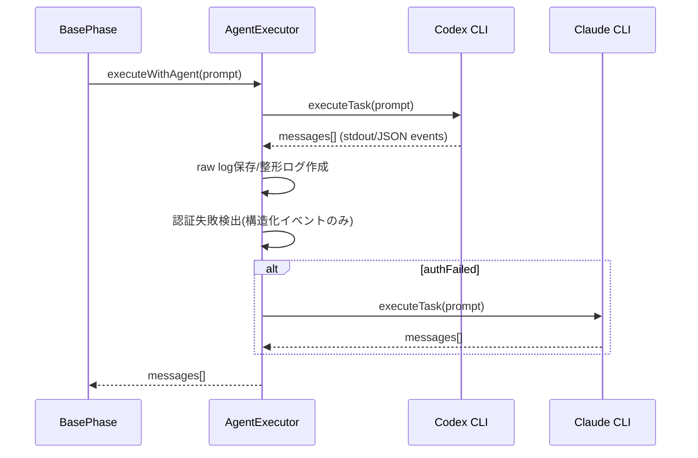

# Issue #830 詳細設計書

## 0. 参照ドキュメント
- Planning: `.ai-workflow/issue-830/00_planning/output/planning.md`
- Requirements: `.ai-workflow/issue-830/01_requirements/output/requirements.md`
- ガイド: `CLAUDE.md`, `README.md`, `docs/ARCHITECTURE.md`

## 1. アーキテクチャ設計

### 1.1 システム全体図
```mermaid
graph TD
  CLI[CLI: src/main.ts] --> EXEC[Workflow Executor]
  EXEC --> PHASE[BasePhase.run()]
  PHASE --> AGENT[AgentExecutor]
  AGENT -->|Codex| CODEX[Codex CLI]
  AGENT -->|Claude| CLAUDE[Claude Code CLI]
  AGENT --> LOGS[Logs/Usage Metrics]
  DOCKER[Docker Image] --> CODEX
  DOCKER --> CLAUDE
```

### 1.2 コンポーネント間の関係
- `Dockerfile` は CLI 実行環境を構成し、Codex/Claude CLI の可用性を決定する。
- `AgentExecutor` はエージェント実行とフォールバック制御の中核であり、認証失敗検出ロジックを持つ。
- テストは `tests/unit/phases/core/agent-executor*.test.ts` に集約され、フォールバック条件や検出ロジックの回帰を抑制する。

### 1.3 データフロー


## 2. 実装戦略判断

### 実装戦略: EXTEND

**判断根拠**:
- 既存の `Dockerfile` と `AgentExecutor` の拡張で問題解決が可能で、新規サブシステム追加は不要。
- 既存のユニットテスト群を拡張する方針のため、既存機能の拡張が中心。

## 3. テスト戦略判断

### テスト戦略: UNIT_INTEGRATION

**判断根拠**:
- 認証失敗検出の誤検知はユニットテストで再現・担保できる。
- Docker イメージへの CLI 導入は統合的観点（ビルド/実行可否確認）が必要。

## 4. テストコード戦略判断

### テストコード戦略: EXTEND_TEST

**判断根拠**:
- 既存の `tests/unit/phases/core/agent-executor*.test.ts` に誤検知防止ケースを追加するのが最小変更。
- 新規ファイル追加は不要で、既存のテスト網羅性を活用できる。

## 5. 影響範囲分析

### 5.1 既存コードへの影響
- `Dockerfile`: Claude Code CLI の導入手順を追加。
- `src/phases/core/agent-executor.ts`: 認証失敗検出ロジックを「構造化イベント中心」に変更。
- `tests/unit/phases/core/agent-executor.test.ts`: 認証失敗検出テストを構造化イベントに更新。
- `tests/unit/phases/core/agent-executor-codex-availability.test.ts`: 認証失敗検出テストの期待値更新。
- `docs/TROUBLESHOOTING.md`（必要に応じて）: CLI 依存の説明追加。

### 5.2 依存関係の変更
- `@anthropic-ai/claude-code@latest` を Docker イメージに追加（グローバル npm パッケージ）。

### 5.3 マイグレーション要否
- なし（DB/設定スキーマ変更なし）。

## 6. 変更・追加ファイルリスト

### 6.1 新規作成
- なし

### 6.2 修正が必要な既存ファイル
- `Dockerfile`
- `src/phases/core/agent-executor.ts`
- `tests/unit/phases/core/agent-executor.test.ts`
- `tests/unit/phases/core/agent-executor-codex-availability.test.ts`
- `docs/TROUBLESHOOTING.md`（必要に応じて）

### 6.3 削除
- なし

## 7. 詳細設計

### 7.1 変更方針
- 認証失敗検出は「JSON 構造化イベントのみ」を対象にする。
- stdout に混在するソースコードやテキストの断片は検出対象外とし、誤検知を防ぐ。

### 7.2 関数設計

#### 7.2.1 `detectAuthFailure(messages: string[]): boolean`（新規ヘルパー）
- **責務**: メッセージ配列から認証失敗を厳密に検出する。
- **入力**: `messages: string[]`
- **出力**: `boolean`
- **検出ルール（案）**:
  - 各 `line` を JSON パースし、パース失敗時は無視。
  - `error` オブジェクトを以下の優先順で抽出:
    1. `parsed.error`
    2. `parsed.result?.error`
    3. `parsed.response?.error`
  - 以下のいずれかで認証失敗と判定:
    - `error.type === 'authentication_error'`
    - `error.code === 'authentication_error'`
    - `error.message` に `invalid bearer token` / `please run /login` が含まれる
  - 互換性のため、トップレベル `type === 'authentication_error'` も許可。
- **非対象**:
  - JSON でない行（stdout/ファイル内容）は常に無視。

#### 7.2.2 `runAgentTask()` 内の改修
- 既存の `messages.some(...)` を `detectAuthFailure(messages)` 呼び出しに置換。
- 既存のログ保存・メトリクス抽出は変更しない。

### 7.3 データ構造設計
- 追加のデータ構造は不要。
- 既存の `messages: string[]` をそのまま利用し、検出処理のみを厳密化。

### 7.4 インターフェース設計
- `AgentExecutor.executeWithAgent()` の戻り値は変更しない。
- `authFailed` 判定ロジックのみを差し替えるため外部インターフェース変更なし。

### 7.5 Dockerfile 変更設計
- `npm install` セクションに `@anthropic-ai/claude-code@latest` を追加。
- Codex CLI と同様に `claude --version` を best-effort 実行。
- 失敗時は WARNING を出しつつビルドは継続（要件の best-effort 前提）。

## 8. セキュリティ考慮事項
- 認証失敗検出は構造化イベントのみ参照し、stdout の任意文字列を走査しない。
- トークン等の機密情報をログ出力しない方針は既存のまま維持。
- CLI 追加による権限拡大はなく、既存の npm パッケージ導入ポリシーに従う。

## 9. 非機能要件への対応

### 9.1 パフォーマンス
- JSON パースは `messages` 配列の線形走査のみで、既存のログ処理に比べて僅少。

### 9.2 スケーラビリティ
- CLI 依存の追加のみであり、ワークフローの並列性/拡張性に影響しない。

### 9.3 保守性
- 認証失敗検出をヘルパー関数へ分離することで、将来のイベント形式変更に追従しやすい。

## 10. 実装の順序
1. `Dockerfile` に Claude Code CLI 導入を追加
2. `AgentExecutor` の認証失敗検出ロジックをヘルパー関数化し、JSON 構造化イベントのみを対象化
3. 既存ユニットテストを更新（構造化イベントの認証失敗 + 誤検知防止ケース追加）
4. 必要に応じて `docs/TROUBLESHOOTING.md` を更新
5. `npm run test:unit` の実行

## 11. テスト設計（要件トレーサビリティ）

| 要件 | 設計対応 | テスト観点 |
|---|---|---|
| FR-1 | Dockerfile に Claude Code CLI 追加 | Docker ビルド時の `claude --version` 実行確認（統合） |
| FR-2 | 認証失敗検出を構造化イベントに限定 | JSON エラーイベントで検知、stdout の文字列は無視 |
| FR-3 | 誤検知防止をテストで保証 | ソースコード断片を含む stdout を入力し、authFailed=false |
| FR-4 | 既存ユニットテスト継続 | 既存 `agent-executor*.test.ts` が成功 |
| FR-5 | ECR 再ビルドで all-phases 成功 | CI/実行環境で all-phases 実行（統合） |

## 12. 具体的なテストケース追加案
- `agent-executor.test.ts`
  - 構造化 JSON で `error.type=authentication_error` を含むケース → `authFailed=true` でフォールバック。
  - `messages` に `authentication_error` を含む **非 JSON 行**を入れても `authFailed=false`。
- `agent-executor-codex-availability.test.ts`
  - 既存の「認証エラー時フォールバック」を JSON 形式に更新。

## 13. 品質ゲート対応
- 実装戦略/テスト戦略/テストコード戦略の判断根拠を明記済み。
- 影響範囲/変更ファイルを明確化済み。
- 既存構造を尊重し、実装可能な設計に限定。

