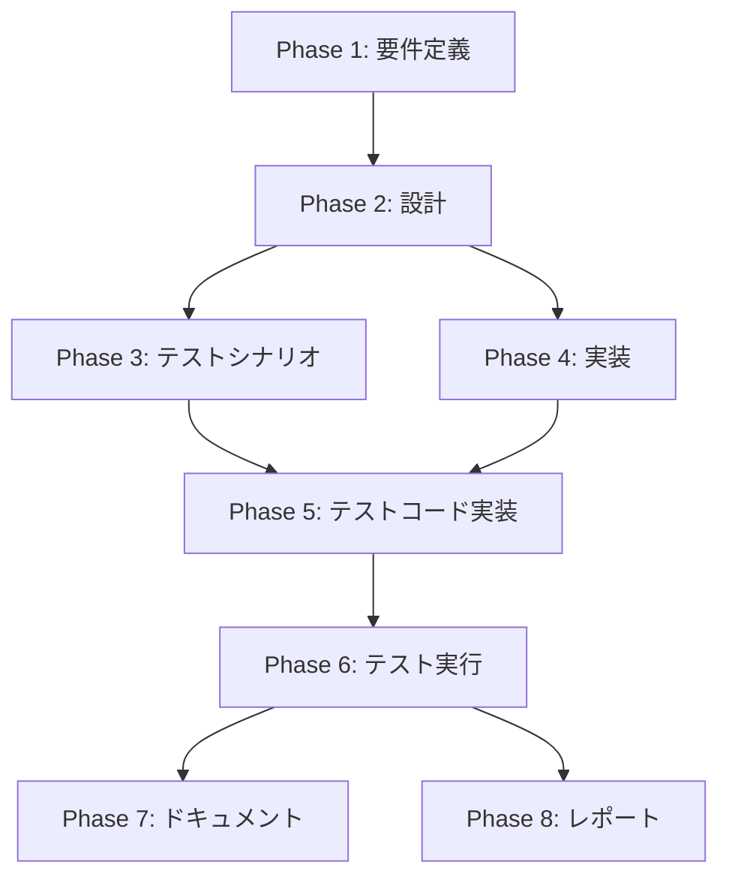

# プロジェクト計画書: Issue #888

## ⚡ PR Finalize後のPRボディをレビュアー向けに全面リライトする機能の実装

---

## 1. Issue分析

### 概要

Issue #888 は、`finalize` コマンドに `--ai-rewrite` オプションを追加し、AIエージェント（Claude / Codex）を活用して、レビュアー向けに最適化されたPRボディを自動生成する機能を実装する提案である。

### 現状分析

コードベースを精査した結果、本Issue の実装は**すでに大部分が完了している**ことが確認された。具体的には：

- **`src/commands/finalize.ts`**: `--ai-rewrite` フラグ、`--agent` オプション、AIリライトオーケストレーション（`generateAiRewrittenPrBody`）、diff取得（`getDiffForPrompt`）、プロンプトコンテキスト構築（`buildPromptContext`）、フェーズ成果物収集（`collectPhaseOutputs`）、必須セクション検証（`validateRequiredSections`）、エージェント実行（`executeAgentTask`）が実装済み
- **`src/main.ts`**: CLI定義に `--ai-rewrite` と `--agent` オプションが登録済み
- **`src/templates/{ja,en}/pr_body_finalize_template.md`**: 日本語・英語テンプレートが作成済み
- **`src/prompts/finalize/{ja,en}/rewrite_pr_body.txt`**: 日本語・英語AIプロンプトが作成済み
- **`src/core/prompt-loader.ts`**: `finalize` カテゴリがサポート済み
- **`tests/unit/commands/finalize.test.ts`**: ユニットテスト12件以上が実装済み
- **`tests/integration/finalize-command.test.ts`**: 統合テストが実装済み

### 残課題の特定

実装済みコードの品質確認・テスト拡充・ドキュメント更新が主な残作業となる：

1. **AIリライト固有のユニットテスト**: `generateAiRewrittenPrBody`、`collectPhaseOutputs`、`getDiffForPrompt`、`buildPromptContext`、`validateRequiredSections`、`executeAgentTask` の各関数に対する網羅的テスト
2. **AIリライト固有の統合テスト**: `--ai-rewrite` フラグ有効時のエンドツーエンドシナリオ
3. **ドキュメント更新**: CLI_REFERENCE.md、README.md への `--ai-rewrite` オプション記載
4. **プロンプト品質チューニング**: 生成されるPRボディの実用性検証

### 複雑度判定: **中程度**

- **根拠**: 主要な実装は完了済みであるが、テスト拡充（複数ファイル）、ドキュメント更新（複数ファイル）、プロンプトチューニングが必要
- コア実装のリファクタリングは不要
- 既存機能への影響は限定的（`--ai-rewrite` 未指定時は従来動作を完全保持: FR-009）

### 見積もり工数: **12〜16時間**

| 作業項目 | 見積もり |
|---------|---------|
| 要件定義・仕様整理 | 1〜2h |
| 設計レビュー・確認 | 1〜2h |
| テストシナリオ策定 | 1〜2h |
| 実装確認・微調整 | 2〜3h |
| テストコード実装 | 3〜4h |
| テスト実行・修正 | 1〜2h |
| ドキュメント更新 | 1〜2h |

### リスク評価: **中**

- AIエージェント呼び出しの不安定性は既にフォールバック機構（FR-008）で対処済み
- 大規模diff のトークン制限も切り詰め戦略（FR-003: 50,000文字/300ファイル閾値）で対処済み
- テスト環境でのエージェントモック戦略が鍵

---

## 2. 実装戦略判断

### 実装戦略: **EXTEND**

**判断根拠**:
- 新規ファイル作成ではなく、既存の `src/commands/finalize.ts` への機能追加が中心
- テンプレート・プロンプトファイルはすでに作成済み
- CLI定義（`src/main.ts`）への追加も完了済み
- 残作業はテスト拡充とドキュメント更新が主体で、既存コードベースの拡張に該当する
- 新規モジュールやクラスの作成は不要

### テスト戦略: **UNIT_INTEGRATION**

**判断根拠**:
- **ユニットテスト**: `generateAiRewrittenPrBody`、`collectPhaseOutputs`、`getDiffForPrompt`、`buildPromptContext`、`validateRequiredSections`、`executeAgentTask` の各関数を個別にモック付きでテスト（外部API依存の分離が重要）
- **統合テスト**: `--ai-rewrite` フラグ有効時のエンドツーエンドフロー（CLI → finalize → AIリライト → PR更新）を検証
- BDDテストは不要（エンドユーザー向けUIではなくCLIツールのため）
- 外部システム連携（GitHub API、AIエージェント）はモック化して統合テストに含める

### テストコード戦略: **BOTH_TEST**

**判断根拠**:
- **EXTEND_TEST**: 既存の `tests/unit/commands/finalize.test.ts` にAIリライト固有のテストケースを追加（既存テストとの整合性維持）
- **CREATE_TEST**: AIリライトのヘルパー関数群（`collectPhaseOutputs`、`getDiffForPrompt`、`buildPromptContext`、`validateRequiredSections`）は関心の分離のため新規テストファイルでカバーすることが望ましい
- 統合テストは既存の `tests/integration/finalize-command.test.ts` に追加

---

## 3. 影響範囲分析

### 既存コードへの影響

| ファイル | 変更種別 | 影響範囲 |
|---------|---------|---------|
| `src/commands/finalize.ts` | 実装済み・微調整のみ | AIリライト関連関数群は実装完了。プロンプトチューニング時に微調整の可能性あり |
| `src/main.ts` | 実装済み・変更不要 | `--ai-rewrite`、`--agent` オプションは登録済み |
| `src/templates/{ja,en}/pr_body_finalize_template.md` | 作成済み・チューニング | テンプレート構造は完成。実運用テスト後に微調整の可能性あり |
| `src/prompts/finalize/{ja,en}/rewrite_pr_body.txt` | 作成済み・チューニング | プロンプト品質の検証と改善 |
| `src/core/prompt-loader.ts` | 実装済み・変更不要 | `finalize` カテゴリは既にサポート済み |
| `docs/CLI_REFERENCE.md` | **更新必要** | `--ai-rewrite`、`--agent` オプションの説明追加 |
| `README.md` | **更新必要** | finalize コマンドの説明に `--ai-rewrite` を追記 |
| `tests/unit/commands/finalize.test.ts` | **テスト追加必要** | AIリライト固有テストケースの追加 |
| `tests/integration/finalize-command.test.ts` | **テスト追加必要** | AIリライトフローの統合テスト追加 |

### 依存関係の変更

- **新規依存の追加**: なし（既存のエージェントクライアント、PromptLoader を再利用）
- **既存依存の変更**: なし
- 使用する既存モジュール:
  - `src/core/prompt-loader.ts`（PromptLoader）
  - `src/commands/execute/agent-setup.ts`（resolveAgentCredentials, setupAgentClients）
  - `src/core/claude-agent-client.ts`（ClaudeAgentClient）
  - `src/core/codex-agent-client.ts`（CodexAgentClient）
  - `src/core/github-client.ts` / `src/core/github/pull-request-client.ts`（PullRequestClient）

### マイグレーション要否

- **データベーススキーマ変更**: 不要
- **設定ファイル変更**: 不要（新規環境変数の追加なし）
- **メタデータ形式変更**: 不要（`metadata.json` の構造変更なし）
- **後方互換性**: 完全維持（`--ai-rewrite` 未指定時は従来と同一動作: FR-009）

---

## 4. タスク分割

### Phase 1: 要件定義 (見積もり: 1〜2h)

- [ ] Task 1-1: 機能要件の詳細化 (0.5〜1h)
  - FR-001〜FR-009 の各機能要件を明文化
  - `--ai-rewrite` オプションの仕様（デフォルト値、型、動作条件）
  - `--agent` オプションの仕様（`auto`/`codex`/`claude`、`--ai-rewrite` 有効時のみ機能）
  - フォールバック動作の仕様（AI生成失敗 → 従来のPRボディにフォールバック）
- [ ] Task 1-2: 非機能要件の詳細化 (0.5〜1h)
  - NFR-001: パフォーマンス要件（エージェント呼び出しのタイムアウト上限）
  - NFR-002: セキュリティ要件（ReDoS防止のための `replaceAll()` 使用）
  - NFR-003: トークン制限対応（diff: 50,000文字上限、フェーズ成果物: 10,000文字上限）
  - NFR-004: 多言語対応要件（日本語・英語テンプレート/プロンプト）
- [ ] Task 1-3: 受け入れ基準の策定 (0.5h)
  - `--ai-rewrite` 指定時にAI生成PRボディが出力されること
  - `--ai-rewrite` 未指定時に従来動作が維持されること
  - AI生成失敗時にフォールバックが動作すること
  - 生成されたPRボディに必須セクション（変更概要/主要な変更点）が含まれること

### Phase 2: 設計 (見積もり: 1〜2h)

- [ ] Task 2-1: 既存実装の設計レビュー (0.5〜1h)
  - `finalize.ts` のAIリライト関数群の設計妥当性を確認
  - 関数間の依存関係と責務分離の確認
  - エラーハンドリングパスの網羅性確認
- [ ] Task 2-2: テンプレート・プロンプト設計の確認 (0.5〜1h)
  - `pr_body_finalize_template.md` のセクション構成の妥当性
  - `rewrite_pr_body.txt` のプロンプト指示の明確性と具体性
  - プレースホルダー置換ロジックの安全性（ReDoS防止）
- [ ] Task 2-3: テスト設計 (0.5h)
  - ユニットテストのモック戦略（エージェントクライアント、GitHub API、ファイルシステム）
  - 統合テストのシナリオ設計（正常系、異常系、フォールバック）
  - テストデータの準備方針

### Phase 3: テストシナリオ (見積もり: 1〜2h)

- [ ] Task 3-1: AIリライト正常系テストシナリオの策定 (0.5〜1h)
  - `--ai-rewrite` 有効時のPRボディ生成フロー
  - 日本語・英語それぞれでの必須セクション検証
  - diff が小規模（50,000文字未満）の場合のフルdiff取得
  - diff が大規模（50,000文字以上または300ファイル超）の場合のサマリー取得
  - フェーズ成果物が全件存在する場合の収集
  - フェーズ成果物が一部欠損している場合のフォールバックテキスト使用
- [ ] Task 3-2: AIリライト異常系テストシナリオの策定 (0.5〜1h)
  - Claudeエージェント呼び出し失敗 → Codexフォールバック
  - 両エージェント失敗 → 従来PRボディへのフォールバック
  - 必須セクション検証失敗 → 従来PRボディへのフォールバック
  - プロンプトテンプレート読み込み失敗
  - diff 取得失敗（GitHub API エラー）
  - 認証情報未設定時の動作
- [ ] Task 3-3: 後方互換性テストシナリオの策定 (0.5h)
  - `--ai-rewrite` 未指定時の従来動作維持確認
  - 既存の `generateFinalPrBody` の動作に影響がないことの確認
  - 既存テストケースのリグレッション確認

### Phase 4: 実装 (見積もり: 2〜3h)

- [ ] Task 4-1: 実装コードの品質確認と微調整 (1〜1.5h)
  - `finalize.ts` のAIリライト関数群のコードレビュー
  - ロギング規約（`logger` モジュール使用）の遵守確認
  - エラーハンドリング規約（`getErrorMessage()` 使用）の遵守確認
  - 環境変数アクセス規約（`config` クラス使用）の遵守確認
- [ ] Task 4-2: プロンプト品質チューニング (1〜1.5h)
  - `rewrite_pr_body.txt`（日本語・英語）のプロンプト指示の明確化
  - 出力例の充実（レビュアーが価値を感じるPRボディの具体例）
  - テンプレートのセクション構成の最適化（実用性の観点）
- [ ] Task 4-3: Jenkins パラメータ対応の確認 (0.5h)
  - `jenkins/jobs/pipeline/ai-workflow/finalize/Jenkinsfile` に `--ai-rewrite` パラメータが含まれているか確認
  - Jenkins から `--ai-rewrite` オプションを指定して実行できることの確認

### Phase 5: テストコード実装 (見積もり: 3〜4h)

- [ ] Task 5-1: AIリライトヘルパー関数のユニットテスト実装 (1.5〜2h)
  - `collectPhaseOutputs()`: フェーズ成果物の収集テスト（全件存在/一部欠損/全件欠損/10,000文字超切り詰め）
  - `getDiffForPrompt()`: diff取得テスト（小規模diff/大規模diff切り詰め/300ファイル超サマリー/API エラー）
  - `buildPromptContext()`: プロンプトコンテキスト構築テスト（プレースホルダー置換/テンプレート読み込み）
  - `validateRequiredSections()`: セクション検証テスト（日本語/英語/必須ヘッダー有/無）
- [ ] Task 5-2: AIリライトオーケストレーションのユニットテスト実装 (1〜1.5h)
  - `executeAgentTask()`: エージェント実行テスト（Claude成功/Claude失敗→Codexフォールバック/両方失敗）
  - `generateAiRewrittenPrBody()`: 統合オーケストレーションテスト（正常系/フォールバック系）
- [ ] Task 5-3: 統合テストの拡充 (0.5〜1h)
  - `--ai-rewrite` 有効時のエンドツーエンドシナリオ
  - `--ai-rewrite` 未指定時の従来動作維持確認
  - エージェントモック環境での全体フロー検証

### Phase 6: テスト実行 (見積もり: 1〜2h)

- [ ] Task 6-1: ユニットテスト実行と修正 (0.5〜1h)
  - `npm run test:unit` の実行
  - テスト失敗時の原因調査と修正
  - カバレッジ確認（AIリライト関連関数のブランチカバレッジ）
- [ ] Task 6-2: 統合テスト実行と修正 (0.5〜1h)
  - `npm run test:integration` の実行
  - テスト失敗時の原因調査と修正
- [ ] Task 6-3: 統合検証 (0.5h)
  - `npm run validate` の実行（lint + test + build）
  - 全テスト通過の確認
  - ビルド成果物の確認（`dist/` にプロンプト・テンプレートがコピーされていること）

### Phase 7: ドキュメント (見積もり: 1〜2h)

- [ ] Task 7-1: CLI_REFERENCE.md の更新 (0.5〜1h)
  - `finalize` コマンドのオプション一覧に `--ai-rewrite` と `--agent` を追加
  - 使用例の追記（`--ai-rewrite` 有効時の実行例）
  - フォールバック動作の説明
- [ ] Task 7-2: README.md の更新 (0.5h)
  - 主要コマンド表の `finalize` 説明に「AIリライト」を追記
  - クイックスタートまたはFAQに `--ai-rewrite` の簡潔な説明を追加
- [ ] Task 7-3: CLAUDE.md の確認 (0.5h)
  - コアモジュール（抜粋）セクションに `finalize.ts` のAIリライト関連情報が反映されているか確認
  - 必要に応じて更新

### Phase 8: レポート (見積もり: 1h)

- [ ] Task 8-1: 実装レポートの作成 (0.5h)
  - 実装完了した機能要件の一覧（FR-001〜FR-009）
  - テスト結果サマリー
  - 品質メトリクス
- [ ] Task 8-2: マージチェックリストの作成 (0.5h)
  - テスト通過状況
  - ドキュメント更新状況
  - 後方互換性確認結果
  - レビューポイントの整理

---

## 5. 依存関係



**依存関係の詳細**:
- Phase 2 は Phase 1 完了後に着手（要件定義に基づく設計）
- Phase 3 は Phase 2 完了後に着手（設計に基づくテストシナリオ）
- Phase 4 は Phase 2 完了後に着手（設計に基づく実装確認・微調整）
- Phase 5 は Phase 3 と Phase 4 の両方が完了後に着手（テストシナリオと実装の両方が確定していること）
- Phase 6 は Phase 5 完了後に着手（テストコード実装後にテスト実行）
- Phase 7, 8 は Phase 6 完了後に着手（テスト通過後にドキュメントとレポート作成）

---

## 6. リスクと軽減策

### リスク1: AIエージェント呼び出しの不安定性
- **影響度**: 中
- **確率**: 中
- **軽減策**:
  - フォールバック機構（FR-008）が実装済み（Claude → Codex → 従来PRボディ）
  - `executeAgentTask()` 内で最大30ターンの制限あり
  - 呼び出し失敗時のエラーログ出力で原因追跡可能

### リスク2: 大規模diff によるトークン制限超過
- **影響度**: 中
- **確率**: 中
- **軽減策**:
  - `getDiffForPrompt()` で 50,000文字/300ファイルの閾値を設定済み（FR-003）
  - 閾値超過時はファイルサマリー（追加/削除行数）のみをプロンプトに含める
  - `extractDiffFileSummary()` で簡潔なサマリーを生成

### リスク3: テスト環境でのエージェントモック戦略の複雑性
- **影響度**: 中
- **確率**: 低
- **軽減策**:
  - 既存テスト（`finalize.test.ts`）のモックパターンを踏襲
  - エージェントクライアントは `jest.fn()` でモック化
  - `resolveAgentCredentials` と `setupAgentClients` はモジュール単位でモック可能
  - テストヘルパー関数の作成で重複を削減

### リスク4: プロンプト品質によるPRボディの実用性不足
- **影響度**: 高
- **確率**: 低
- **軽減策**:
  - プロンプトに具体的な出力例を含めることで品質を安定化
  - `validateRequiredSections()` で最低限の構造品質を保証
  - テンプレートによる構造制約でAI出力の一貫性を維持
  - チューニングサイクル（Phase 4 Task 4-2）で改善

### リスク5: 後方互換性の破壊
- **影響度**: 高
- **確率**: 低
- **軽減策**:
  - `--ai-rewrite` はデフォルト `false`（オプトイン設計: FR-009）
  - 既存の `generateFinalPrBody` 関数は一切変更なし
  - 既存テストケースのリグレッションテストで確認
  - `npm run validate` による統合検証

### リスク6: Jenkins 環境での `--ai-rewrite` オプション動作不良
- **影響度**: 中
- **確率**: 低
- **軽減策**:
  - Jenkins パラメータ定義の確認（Phase 4 Task 4-3）
  - Docker コンテナ内でのエージェント認証情報の疎通確認
  - `validate-credentials` コマンドによる事前検証

---

## 7. 品質ゲート

### Phase 1: 要件定義
- [ ] 機能要件（FR-001〜FR-009）が明確に記載されている
- [ ] 非機能要件（NFR-001〜NFR-004）が定義されている
- [ ] 受け入れ基準が検証可能な形式で記載されている
- [ ] `--ai-rewrite` オプションの仕様が明確である
- [ ] フォールバック動作の仕様が明確である

### Phase 2: 設計
- [ ] 実装戦略の判断根拠が明記されている（EXTEND）
- [ ] テスト戦略の判断根拠が明記されている（UNIT_INTEGRATION）
- [ ] テストコード戦略の判断根拠が明記されている（BOTH_TEST）
- [ ] 既存実装の設計妥当性が確認されている
- [ ] エラーハンドリングパスが網羅的にレビューされている
- [ ] プロンプト・テンプレートの設計が確認されている

### Phase 3: テストシナリオ
- [ ] 正常系テストシナリオが網羅的に策定されている（AI生成成功、日英両言語）
- [ ] 異常系テストシナリオが網羅的に策定されている（エージェント失敗、フォールバック）
- [ ] 後方互換性テストシナリオが策定されている
- [ ] diff の小規模・大規模パターンがカバーされている
- [ ] フェーズ成果物の存在・欠損パターンがカバーされている

### Phase 4: 実装
- [ ] コーディング規約（ロギング、環境変数アクセス、エラーハンドリング）が遵守されている
- [ ] ReDoS 防止のための `replaceAll()` 使用が確認されている
- [ ] プロンプトの品質チューニングが完了している
- [ ] `npm run lint` がエラーなく通過する

### Phase 5: テストコード実装
- [ ] ヘルパー関数のユニットテストが実装されている
- [ ] オーケストレーション関数のユニットテストが実装されている
- [ ] 統合テストが `--ai-rewrite` 有効時のフローをカバーしている
- [ ] テストでモッククリーンアップ（`jest.restoreAllMocks()`）が正しく行われている

### Phase 6: テスト実行
- [ ] `npm run test:unit` が全件通過する
- [ ] `npm run test:integration` が全件通過する
- [ ] `npm run validate` が全ステップ通過する（lint + test + build）
- [ ] ビルド成果物（`dist/`）にプロンプト・テンプレートがコピーされている

### Phase 7: ドキュメント
- [ ] `docs/CLI_REFERENCE.md` に `--ai-rewrite` と `--agent` オプションが記載されている
- [ ] `README.md` に `--ai-rewrite` の説明が追記されている
- [ ] ドキュメントの記述が正確で最新の実装と一致している

---

## 付録A: 技術仕様サマリー

### 新規CLIオプション

| オプション | 型 | デフォルト | 説明 |
|-----------|------|---------|------|
| `--ai-rewrite` | boolean | `false` | AIエージェントによるPRボディリライトを有効化（FR-001） |
| `--agent` | `auto\|codex\|claude` | `auto` | AIリライト時のエージェントモード（FR-002） |

### リソース制約定数

| 定数名 | 値 | 用途 |
|--------|-----|------|
| `MAX_PHASE_OUTPUT_LENGTH` | 10,000文字 | フェーズ成果物の最大文字数（FR-004） |
| `MAX_DIFF_LENGTH` | 50,000文字 | diff テキストの最大文字数（FR-003） |
| `MAX_DIFF_FILES_THRESHOLD` | 300ファイル | diff ファイル数の上限閾値 |

### AIリライトフロー

```
handleFinalizeCommand()
├─ 1. オプション検証
├─ 2. メタデータ読み込み
├─ 3. フェーズ成果物の事前収集（--ai-rewrite 有効時、.ai-workflow/ 削除前）
├─ 4. Step 1: base_commit 取得
├─ 5. Step 2: .ai-workflow/ クリーンアップ
├─ 6. Step 3: コミットスカッシュ（--skip-squash でスキップ可）
└─ 7. Step 4-5: PR 更新
   ├─ --ai-rewrite 有効:
   │  ├─ getDiffForPrompt(): PR diff 取得（切り詰め付き）
   │  ├─ buildPromptContext(): プロンプト構築（テンプレート + diff + 成果物）
   │  ├─ setupAgentClients(): エージェント初期化
   │  ├─ executeAgentTask(): エージェント実行（Claude優先、Codexフォールバック）
   │  ├─ validateRequiredSections(): 必須セクション検証
   │  └─ 成功: AI生成ボディ / 失敗: 従来ボディにフォールバック
   └─ --ai-rewrite 無効:
      └─ generateFinalPrBody(): 従来のPRボディ生成
```

### ファイル一覧（実装済み/更新対象）

| ファイル | 状態 | 作業内容 |
|---------|------|---------|
| `src/commands/finalize.ts` | ✅ 実装済み | 品質確認・微調整 |
| `src/main.ts` | ✅ 実装済み | 変更不要 |
| `src/templates/ja/pr_body_finalize_template.md` | ✅ 作成済み | チューニング |
| `src/templates/en/pr_body_finalize_template.md` | ✅ 作成済み | チューニング |
| `src/prompts/finalize/ja/rewrite_pr_body.txt` | ✅ 作成済み | チューニング |
| `src/prompts/finalize/en/rewrite_pr_body.txt` | ✅ 作成済み | チューニング |
| `src/core/prompt-loader.ts` | ✅ 実装済み | 変更不要 |
| `tests/unit/commands/finalize.test.ts` | ✅ 基本テスト済み | AIリライトテスト追加 |
| `tests/integration/finalize-command.test.ts` | ✅ 基本テスト済み | AIリライトテスト追加 |
| `docs/CLI_REFERENCE.md` | 📝 更新必要 | `--ai-rewrite` オプション説明追加 |
| `README.md` | 📝 更新必要 | `finalize` コマンド説明更新 |
