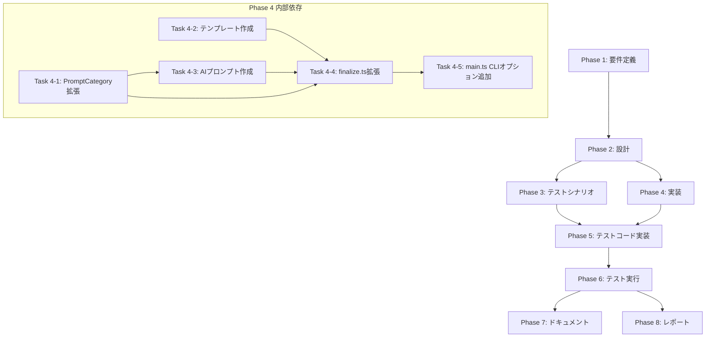

# プロジェクト計画書: Issue #888

## ⚡ PR Finalize後のPRボディをレビュアー向けに全面リライトする機能の実装

---

## 1. Issue分析

### 概要

PR Finalize 実行後に、AI エージェント（Codex / Claude）を活用して、レビュアー向けに最適化された PR ボディを自動生成する機能を追加する。現在の `generateFinalPrBody` が出力する内部ワークフロー管理情報（フェーズステータス一覧、クリーンアップ状況など）を、「変更概要」「主要な変更点」「レビュー時の注目ポイント」「テスト結果サマリー」などを含む、レビュアーにとって実用的な PR ボディへ全面的にリライトする。

### 複雑度: **中程度**

**判定根拠**:
- **既存コードの拡張が中心**: `src/commands/finalize.ts` の `executeStep4And5` 関数内に新しいフローを追加する形式
- **複数ファイルの変更**: finalize.ts、main.ts（CLIオプション追加）、prompt-loader.ts（カテゴリ追加）、および新規テンプレート/プロンプトファイルの作成
- **既存パターンの活用**: エージェント実行パターン（`AgentExecutor`）、プロンプトロード（`PromptLoader`）、テンプレート管理、diff取得（`PullRequestClient.getPullRequestDiff()`）など、すべて既存の仕組みを再利用可能
- **新規サブシステムの追加は不要**: 既存アーキテクチャの範囲内で完結する

### 見積もり工数: **12〜16時間**

**根拠**:
- CLIオプション追加 + finalize.ts 拡張: 3〜4時間
- テンプレート作成（日英2言語）: 1〜2時間
- AIプロンプト作成・チューニング（日英2言語）: 2〜3時間
- フェーズ成果物収集ロジック: 1〜2時間
- diff取得・トランケーション処理: 1〜2時間
- ユニットテスト: 2〜3時間
- 統合テスト: 1時間
- ドキュメント更新: 0.5〜1時間

### リスク評価: **中**

**主なリスク要因**:
- 大規模diffのトークン制限への対処が必要
- AI生成コンテンツの品質にばらつきがある可能性
- 既存のfinalizeフローへの影響

---

## 2. 実装戦略判断

### 実装戦略: **EXTEND**

**判断根拠**:
- 既存の `src/commands/finalize.ts` の `generateFinalPrBody` 関数はフォールバックとして維持し、新しいAIリライトロジックを追加する
- `PromptLoader` の `PromptCategory` 型に `'finalize'` を追加する拡張
- `main.ts` のfinalizeコマンド定義に `--ai-rewrite` オプションを追加
- `FinalizeCommandOptions` インターフェースに `aiRewrite` プロパティを追加
- 新規ファイル作成はテンプレート（`src/templates/{ja,en}/pr_body_finalize_template.md`）とプロンプト（`src/prompts/finalize/{ja,en}/rewrite_pr_body.txt`）のみで、これは既存のプロンプト/テンプレート配置パターンに従う
- 既存の `ReportPhase.getPhaseOutputs()` のパターンを再利用してフェーズ成果物を収集する
- 既存の `PullRequestClient.getPullRequestDiff()` を利用してdiff情報を取得する

**CREATEではない理由**: 新規モジュール・クラスの作成は不要。既存コマンドの拡張で完結する。
**REFACTORではない理由**: 既存コードの構造改善は主目的ではなく、新機能追加が中心。

### テスト戦略: **UNIT_INTEGRATION**

**判断根拠**:
- **ユニットテスト**: `generateFinalPrBody` のフォールバック動作、`--ai-rewrite` オプションのバリデーション、diff トランケーション処理、フェーズ成果物収集ロジックなど、個別関数のテストが必要
- **インテグレーションテスト**: AI エージェント呼び出し（モック）→ PR更新 → フォールバックの一連のフローをテストする必要がある
- **BDDテストは不要**: エンドユーザー向けUIがなく、CLI オプションの機能テストで十分
- 既存の `tests/unit/commands/finalize.test.ts` と `tests/integration/finalize-command.test.ts` のパターンに従う

### テストコード戦略: **BOTH_TEST**

**判断根拠**:
- **EXTEND_TEST**: 既存の `tests/unit/commands/finalize.test.ts` に `--ai-rewrite` 関連のテストケースを追加（バリデーション、フォールバック動作）
- **CREATE_TEST**: AI リライトロジック専用のテストファイル（`tests/unit/commands/finalize-ai-rewrite.test.ts`）を新規作成し、diff トランケーション、成果物収集、プロンプト構築、エージェント呼び出しフローのテストを体系的にカバーする
- 統合テスト（`tests/integration/finalize-command.test.ts`）にも `--ai-rewrite` シナリオのテストケースを追加

---

## 3. 影響範囲分析

### 既存コードへの影響

| ファイル | 変更内容 | 影響度 |
|---------|---------|--------|
| `src/commands/finalize.ts` | `--ai-rewrite` オプション判定ロジック追加、AI リライト関数追加、`FinalizeCommandOptions` 拡張 | 高 |
| `src/main.ts` | finalize コマンドに `--ai-rewrite` オプション定義追加 | 低 |
| `src/core/prompt-loader.ts` | `PromptCategory` 型に `'finalize'` を追加 | 低 |
| `src/templates/ja/pr_body_finalize_template.md` | 新規作成（日本語テンプレート） | 新規 |
| `src/templates/en/pr_body_finalize_template.md` | 新規作成（英語テンプレート） | 新規 |
| `src/prompts/finalize/ja/rewrite_pr_body.txt` | 新規作成（日本語AIプロンプト） | 新規 |
| `src/prompts/finalize/en/rewrite_pr_body.txt` | 新規作成（英語AIプロンプト） | 新規 |

### 依存関係の変更

- **新規依存の追加**: なし（既存の `@octokit/rest`, `simple-git`, `@anthropic-ai/claude-agent-sdk` 等で完結）
- **既存依存の変更**: なし
- **内部モジュール依存**: `AgentExecutor` または直接 `CodexAgentClient`/`ClaudeAgentClient` を使用する。finalize コマンドは現在エージェントクライアントを初期化していないため、新たに初期化ロジックを追加する必要がある

### マイグレーション要否

- **データベーススキーマ変更**: なし
- **設定ファイル変更**: なし（`--ai-rewrite` はCLIオプションとして追加、環境変数の追加は不要）
- **破壊的変更**: なし（`--ai-rewrite` 未指定時は従来動作を100%保持）

---

## 4. タスク分割

### Phase 1: 要件定義 (見積もり: 1〜2h)

- [x] Task 1-1: 機能要件の詳細化 (1h)
  - `--ai-rewrite` オプションの仕様（デフォルト値、他オプションとの組み合わせ）
  - AI リライト後の PR ボディの必須セクション構成の確定
  - 各セクションの記載ガイドラインの策定
  - 多言語対応要件（日本語・英語）の明確化
- [x] Task 1-2: 非機能要件の明確化 (0.5h)
  - diff サイズの上限（トークン制限: 推奨 50,000 文字以下）
  - AI 生成のタイムアウト設定
  - フォールバック条件の定義（エージェント失敗、空出力、タイムアウト）
  - エラーメッセージの仕様
- [x] Task 1-3: 受け入れ基準の策定 (0.5h)
  - `--ai-rewrite` 指定時にAIがPRボディを再生成すること
  - `--ai-rewrite` 未指定時に従来の `generateFinalPrBody` 出力が使用されること
  - AI生成失敗時に従来出力にフォールバックすること
  - 日本語・英語の両方でテンプレートが正しく適用されること

### Phase 2: 設計 (見積もり: 2〜3h)

- [x] Task 2-1: finalize.ts の拡張設計 (1.5h)
  - `FinalizeCommandOptions` への `aiRewrite` プロパティ追加設計
  - `executeStep4And5` 内の分岐ロジック設計
  - AI リライト関数 `generateAiRewrittenPrBody()` のインターフェース設計
  - エージェントクライアント初期化パターンの設計（`auto-issue`コマンドや`impact-analysis`コマンドの実装パターンを参考）
- [x] Task 2-2: フェーズ成果物収集ロジックの設計 (0.5h)
  - `ReportPhase.getPhaseOutputs()` のパターンを再利用
  - 各成果物ファイルの読み込みとコンテキスト構築
  - ファイル不在時のフォールバックテキスト
- [x] Task 2-3: diff 取得・トランケーション戦略の設計 (0.5h)
  - `PullRequestClient.getPullRequestDiff()` の `truncated` フラグ活用
  - 大規模 diff の場合のサマリー生成戦略
  - トークン制限を考慮した diff の切り詰め方針（ファイル変更リストのみ提供等）
- [x] Task 2-4: テンプレート・プロンプト構造設計 (0.5h)
  - PRボディテンプレートのセクション構成確定
  - AIプロンプトの入出力仕様設計
  - テンプレート変数の一覧定義

### Phase 3: テストシナリオ (見積もり: 1.5〜2h)

- [ ] Task 3-1: ユニットテストシナリオ設計 (1h)
  - `--ai-rewrite` オプションバリデーションのテストケース
  - `generateAiRewrittenPrBody()` の正常系テストケース
  - diff トランケーション処理のテストケース
  - フェーズ成果物収集の正常系・異常系テストケース
  - AI生成失敗時のフォールバックテストケース
- [ ] Task 3-2: 統合テストシナリオ設計 (0.5h)
  - `--ai-rewrite` フラグ有効時のエンドツーエンドフロー
  - エージェントモック使用時の一連のフロー検証
  - `--ai-rewrite` 未指定時の既存動作の回帰テスト
- [ ] Task 3-3: エッジケースの洗い出し (0.5h)
  - diff が空の場合（変更ファイルなし）
  - すべてのフェーズ成果物が不在の場合
  - diff が 300 ファイル超（truncated=true）の場合
  - エージェント認証エラーの場合
  - 言語未指定時のデフォルト動作

### Phase 4: 実装 (見積もり: 5〜7h)

- [ ] Task 4-1: PromptCategory の拡張 (0.5h)
  - `src/core/prompt-loader.ts` の `PromptCategory` 型に `'finalize'` を追加
- [ ] Task 4-2: テンプレートファイルの作成 (1h)
  - `src/templates/ja/pr_body_finalize_template.md` の作成
  - `src/templates/en/pr_body_finalize_template.md` の作成
  - セクション構成: 変更概要、変更の背景・目的、主要な変更点、レビュー時の注目ポイント、テスト結果サマリー、影響範囲
- [ ] Task 4-3: AIプロンプトの作成 (1.5h)
  - `src/prompts/finalize/ja/rewrite_pr_body.txt` の作成
  - `src/prompts/finalize/en/rewrite_pr_body.txt` の作成
  - プロンプトには diff 情報、フェーズ成果物、Issue 情報をコンテキストとして含める
  - テンプレートのセクション構成に沿った出力を指示する
- [ ] Task 4-4: finalize.ts の拡張実装 (2.5〜3h)
  - `FinalizeCommandOptions` に `aiRewrite?: boolean` を追加
  - `executeStep4And5` 内に `--ai-rewrite` 判定分岐を追加
  - `generateAiRewrittenPrBody()` 非同期関数の実装
    - diff 取得ロジック（`getPullRequestDiff()`）
    - フェーズ成果物収集ロジック（`getPhaseOutputs()` パターン）
    - プロンプト構築（`PromptLoader.loadPrompt('finalize', 'rewrite_pr_body', language)`）
    - エージェントクライアント初期化・実行
    - 出力からPRボディテキスト抽出
    - フォールバック処理（失敗時に `generateFinalPrBody()` を使用）
  - diff トランケーション処理の実装
- [ ] Task 4-5: main.ts の CLI オプション追加 (0.5h)
  - finalize コマンド定義に `--ai-rewrite` オプションを追加
  - `--agent` オプションも追加（エージェントモード選択用）
  - オプション値を `handleFinalizeCommand` に渡すロジック追加

### Phase 5: テストコード実装 (見積もり: 2.5〜3h)

- [ ] Task 5-1: 既存テストの拡張 (1h)
  - `tests/unit/commands/finalize.test.ts` に `--ai-rewrite` バリデーション関連テストケース追加
  - フォールバック動作のテストケース追加
  - `generateFinalPrBody` の既存テストが引き続きパスすることを確認
- [ ] Task 5-2: 新規テストファイルの作成 (1.5〜2h)
  - `tests/unit/commands/finalize-ai-rewrite.test.ts` の新規作成
  - diff 取得・トランケーションのユニットテスト
  - フェーズ成果物収集のユニットテスト
  - プロンプト構築ロジックのユニットテスト
  - エージェント実行モック使用のフローテスト
  - AI生成失敗時のフォールバックフローテスト
  - 言語切り替え（日本語・英語）のテスト

### Phase 6: テスト実行 (見積もり: 1〜2h)

- [ ] Task 6-1: ユニットテストの実行と修正 (0.5h)
  - `npm run test:unit` で全テストが通ることを確認
  - 失敗テストの修正
- [ ] Task 6-2: 統合テストの実行と修正 (0.5h)
  - `npm run test:integration` で既存テストが通ることを確認
  - 新規テストケースの追加（必要に応じて）
- [ ] Task 6-3: 統合検証の実行 (0.5h)
  - `npm run validate` を実行し、lint・テスト・ビルドがすべてパスすることを確認
  - 既存機能への回帰がないことを確認

### Phase 7: ドキュメント (見積もり: 1〜1.5h)

- [ ] Task 7-1: CLI リファレンスの更新 (0.5h)
  - `docs/CLI_REFERENCE.md` に `--ai-rewrite` オプションの説明を追加
  - `--agent` オプションとの組み合わせ使用例を追加
- [ ] Task 7-2: README の更新 (0.5h)
  - `README.md` のfinalize コマンド説明に `--ai-rewrite` オプションを追記
  - 使用例を追加
- [ ] Task 7-3: CLAUDE.md の更新（必要に応じて）(0.5h)
  - コアモジュール抜粋のfinalize.ts 行数更新
  - 新しいプロンプトカテゴリの記載

### Phase 8: レポート (見積もり: 1h)

- [ ] Task 8-1: 実装レポートの作成 (1h)
  - 変更概要のサマリー
  - テスト結果のまとめ
  - 既知の制限事項
  - フォローアップ提案

---

## 5. 依存関係



**クリティカルパス**: Phase 1 → Phase 2 → Phase 4 (Task 4-1 → 4-3 → 4-4 → 4-5) → Phase 5 → Phase 6

---

## 6. リスクと軽減策

### リスク1: 大規模diffのトークン制限超過

- **影響度**: 高
- **確率**: 中
- **軽減策**:
  - `PullRequestClient.getPullRequestDiff()` の `truncated` フラグを確認し、`filesChanged > 300` の場合はdiff全文ではなくファイル変更リスト（ファイル名 + 追加/削除行数）のみをプロンプトに含める
  - diff テキスト自体にも文字数上限（例: 50,000文字）を設定し、超過時はトランケーションする
  - プロンプト内で「diffが大きいため要約のみ提供」と明示する

### リスク2: AI生成コンテンツの品質ばらつき

- **影響度**: 中
- **確率**: 中
- **軽減策**:
  - テンプレートによる構造制約を設け、AIに各セクションの出力形式を強制する
  - プロンプトに具体的な出力例（few-shot）を含めてAI出力の品質を安定させる
  - 生成結果に必須セクション（変更概要、主要な変更点）が含まれない場合はフォールバックする

### リスク3: 既存 finalize フローへの回帰

- **影響度**: 高
- **確率**: 低
- **軽減策**:
  - `--ai-rewrite` 未指定時の既存フローは一切変更しない（分岐追加のみ）
  - 既存の `tests/unit/commands/finalize.test.ts` が引き続きすべてパスすることを確認
  - `generateFinalPrBody` 関数の署名・実装は変更しない

### リスク4: エージェントクライアント初期化の複雑さ

- **影響度**: 中
- **確率**: 中
- **軽減策**:
  - 既存の `auto-issue` コマンドや `impact-analysis` コマンドでのエージェント初期化パターンを参考にする
  - 必要最小限のエージェント初期化（Codex/Claude クライアント作成 → `executeTask` 呼び出し）に留める
  - エージェント初期化失敗時は即座にフォールバック（従来のPRボディ生成）

### リスク5: プロンプト/テンプレートのビルドコピー漏れ

- **影響度**: 中
- **確率**: 低
- **軽減策**:
  - 既存の `npm run build` スクリプトがプロンプト/テンプレートを `dist/` にコピーする仕組みを確認
  - ビルド後に新規ファイルが `dist/prompts/finalize/` と `dist/templates/` に正しくコピーされることをテスト
  - `npm run validate` で包括的に検証

---

## 7. 品質ゲート

### Phase 1: 要件定義

- [ ] 機能要件が明確に記載されている（`--ai-rewrite` オプション仕様、PRボディセクション構成）
- [ ] 非機能要件が定義されている（トークン制限、タイムアウト、フォールバック条件）
- [ ] 受け入れ基準が定義されている（正常系・異常系・フォールバック）
- [ ] 多言語対応要件が明確化されている

### Phase 2: 設計

- [ ] 実装戦略の判断根拠が明記されている（EXTEND）
- [ ] テスト戦略の判断根拠が明記されている（UNIT_INTEGRATION）
- [ ] テストコード戦略の判断根拠が明記されている（BOTH_TEST）
- [ ] finalize.ts 拡張のインターフェース設計が完了している
- [ ] diff トランケーション戦略が定義されている
- [ ] テンプレート・プロンプトの構造が設計されている

### Phase 3: テストシナリオ

- [ ] ユニットテストのシナリオが網羅的に設計されている
- [ ] エッジケースが洗い出されている
- [ ] 回帰テストシナリオが含まれている

### Phase 4: 実装

- [ ] `PromptCategory` に `'finalize'` が追加されている
- [ ] テンプレートファイルが日英両言語で作成されている
- [ ] AIプロンプトが日英両言語で作成されている
- [ ] `finalize.ts` に `--ai-rewrite` ロジックが実装されている
- [ ] `main.ts` に `--ai-rewrite` オプションが追加されている
- [ ] エラーハンドリング規約（`getErrorMessage`）が遵守されている
- [ ] ロギング規約（`logger` モジュール）が遵守されている
- [ ] TypeScript コンパイルが成功する（`npm run lint`）

### Phase 5: テストコード実装

- [ ] 既存テストに `--ai-rewrite` 関連テストケースが追加されている
- [ ] 新規テストファイルが作成されている
- [ ] モッククリーンアップ（`jest.restoreAllMocks()`）が実装されている
- [ ] テストカバレッジが主要パスをカバーしている

### Phase 6: テスト実行

- [ ] `npm run test:unit` が全テストパス
- [ ] `npm run test:integration` が全テストパス
- [ ] `npm run validate`（lint + test + build）が成功
- [ ] 既存テストに回帰がないことを確認

### Phase 7: ドキュメント

- [ ] CLI リファレンスに `--ai-rewrite` オプションが記載されている
- [ ] 使用例が含まれている
- [ ] README に新機能の説明が追記されている

---

## 実装戦略サマリー

| 項目 | 判定 |
|------|------|
| **実装戦略** | **EXTEND** |
| **テスト戦略** | **UNIT_INTEGRATION** |
| **テストコード戦略** | **BOTH_TEST** |
| **複雑度** | 中程度 |
| **見積もり工数** | 12〜16時間 |
| **リスク** | 中 |

---

## 技術的補足

### エージェント初期化パターンの参考

finalize コマンドは現在エージェントクライアントを使用していない。AI リライト機能を追加するにあたり、以下の既存コマンドのエージェント初期化パターンを参考にする:

1. **`src/commands/impact-analysis.ts`**: `--agent` オプションに基づいて Codex/Claude クライアントを初期化し、エージェントタスクを実行するパターン
2. **`src/commands/auto-issue.ts`**: エージェント初期化とフォールバック処理のパターン

### diff トランケーション戦略の詳細

```
diff サイズ判定:
  - filesChanged <= 300 かつ diff.length <= 50,000 文字: diff 全文をプロンプトに含める
  - filesChanged > 300 または diff.length > 50,000 文字: ファイル変更リスト + 主要変更箇所のサマリーのみ
  - diff 取得失敗: diff なしでプロンプトを構築（成果物のみベース）
```

### フォールバック戦略の詳細

```
フォールバックチェーン:
  1. AI リライト成功 → 生成されたPRボディを使用
  2. AI リライト失敗（エージェントエラー）→ 従来の generateFinalPrBody() 出力を使用 + 警告ログ
  3. AI リライト失敗（空出力）→ 従来の generateFinalPrBody() 出力を使用 + 警告ログ
  4. AI リライトタイムアウト → 従来の generateFinalPrBody() 出力を使用 + 警告ログ
```
