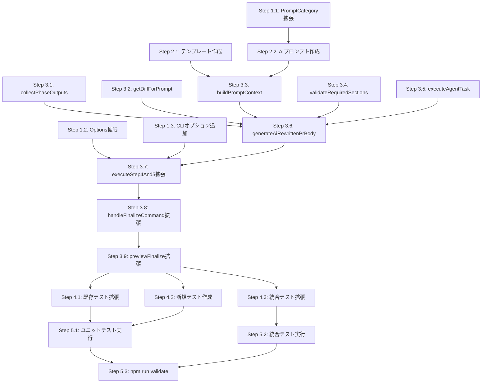

# 詳細設計書: Issue #888

## PR Finalize後のPRボディをレビュアー向けに全面リライトする機能の実装

---

## 0. 要件定義書・Planning Documentの確認

### 計画との整合性

本設計書は、Planning Phase（`.ai-workflow/issue-888/00_planning/output/planning.md`）で策定された計画と、Requirements Phase（`.ai-workflow/issue-888/01_requirements/output/requirements.md`）で定義された機能要件 FR-001〜FR-011、非機能要件 NFR-001〜NFR-005、受け入れ基準 AC-001〜AC-014 に基づいて設計を行う。

| 項目 | 計画値 | 設計での確認 |
|------|--------|-------------|
| **実装戦略** | EXTEND | 既存 `finalize.ts` の拡張で実現可能であることを確認済み |
| **テスト戦略** | UNIT_INTEGRATION | 既存テストパターンとの整合性を確認済み |
| **テストコード戦略** | BOTH_TEST | 既存テスト拡張＋新規テスト作成の両方が必要 |

---

## 1. アーキテクチャ設計

### 1.1 システム全体図

```
┌──────────────────────────────────────────────────────────────┐
│                        CLI Layer                              │
│  ┌──────────────────────────────────────────────────────────┐│
│  │  src/main.ts                                             ││
│  │  ・finalize コマンド定義                                  ││
│  │  ・--ai-rewrite, --agent オプション追加                    ││
│  └──────────────────────┬───────────────────────────────────┘│
└─────────────────────────┼────────────────────────────────────┘
                          ▼
┌──────────────────────────────────────────────────────────────┐
│                    Command Layer                              │
│  ┌──────────────────────────────────────────────────────────┐│
│  │  src/commands/finalize.ts                                ││
│  │                                                          ││
│  │  handleFinalizeCommand()                                 ││
│  │  ├─ validateFinalizeOptions()                            ││
│  │  ├─ loadWorkflowMetadata()                               ││
│  │  ├─ collectPhaseOutputs()        ← 新規: Step2前に成果物収集││
│  │  ├─ executeStep1()                                       ││
│  │  ├─ executeStep2()               ← .ai-workflow 削除     ││
│  │  ├─ executeStep3()               ← スカッシュ             ││
│  │  └─ executeStep4And5()           ← PR更新                ││
│  │      ├─ [既存] generateFinalPrBody()                     ││
│  │      └─ [新規] generateAiRewrittenPrBody()               ││
│  │          ├─ getDiffForPrompt()                            ││
│  │          ├─ buildPromptContext()                           ││
│  │          ├─ resolveAgentCredentials()                     ││
│  │          ├─ setupAgentClients()                           ││
│  │          └─ executeAgentTask()                            ││
│  └──────────────────────┬───────────────────────────────────┘│
└─────────────────────────┼────────────────────────────────────┘
                          ▼
┌──────────────────────────────────────────────────────────────┐
│                     Core Layer                                │
│  ┌─────────────┐  ┌──────────────┐  ┌─────────────────────┐ │
│  │PromptLoader │  │ GitHubClient │  │ Agent Clients       │ │
│  │             │  │              │  │                     │ │
│  │loadPrompt() │  │getPRDiff()   │  │CodexAgentClient     │ │
│  │loadTemplate()│  │updatePR()   │  │ClaudeAgentClient    │ │
│  │             │  │              │  │executeTask()        │ │
│  └─────────────┘  └──────────────┘  └─────────────────────┘ │
│  ┌─────────────────────┐  ┌─────────────────────────────┐   │
│  │ MetadataManager     │  │ agent-setup.ts              │   │
│  │                     │  │                             │   │
│  │ getLanguage()       │  │ resolveAgentCredentials()   │   │
│  │ data (issue_title)  │  │ setupAgentClients()         │   │
│  └─────────────────────┘  └─────────────────────────────┘   │
└──────────────────────────────────────────────────────────────┘
                          ▼
┌──────────────────────────────────────────────────────────────┐
│                    Asset Layer                                │
│  ┌───────────────────────────────────────────────────────┐   │
│  │ src/prompts/finalize/{ja,en}/rewrite_pr_body.txt      │   │
│  │ src/templates/{ja,en}/pr_body_finalize_template.md     │   │
│  └───────────────────────────────────────────────────────┘   │
└──────────────────────────────────────────────────────────────┘
```

### 1.2 コンポーネント間の関係

```mermaid
graph LR
    CLI[main.ts<br>CLI定義] --> FC[finalize.ts<br>コマンドハンドラ]
    FC --> MM[MetadataManager<br>メタデータ管理]
    FC --> GHC[GitHubClient<br>GitHub操作]
    FC --> PRC[PullRequestClient<br>PR操作/diff取得]
    FC --> AS[agent-setup.ts<br>エージェント初期化]
    FC --> PL[PromptLoader<br>プロンプト読込]
    AS --> CAC[ClaudeAgentClient<br>Claude実行]
    AS --> COC[CodexAgentClient<br>Codex実行]
    GHC --> PRC
    PL --> PT[prompts/finalize/<br>AIプロンプト]
    PL --> TM[templates/{lang}/<br>テンプレート]
```

### 1.3 データフロー

```
handleFinalizeCommand()
│
├─ [Phase 1] loadWorkflowMetadata()
│   └─ MetadataManager 初期化
│
├─ [Phase 2] collectPhaseOutputs()  ← 新規: Step2の前に実行
│   ├─ .ai-workflow/issue-{N}/00_planning/output/planning.md を読込
│   ├─ .ai-workflow/issue-{N}/01_requirements/output/requirements.md を読込
│   ├─ .ai-workflow/issue-{N}/02_design/output/design.md を読込
│   ├─ .ai-workflow/issue-{N}/03_test_scenario/output/test-scenario.md を読込
│   ├─ .ai-workflow/issue-{N}/04_implementation/output/implementation.md を読込
│   ├─ .ai-workflow/issue-{N}/06_testing/output/test-result.md を読込
│   └─ .ai-workflow/issue-{N}/07_documentation/output/documentation-update-log.md を読込
│       ※ 各ファイルは最大10,000文字にトランケーション
│       ※ ファイル不在時はスキップ（フォールバックテキスト使用）
│
├─ executeStep1() → base_commit / HEAD 取得
├─ executeStep2() → .ai-workflow 削除 + コミット
├─ executeStep3() → コミットスカッシュ（任意）
│
└─ executeStep4And5()
    ├─ [--ai-rewrite 未指定] generateFinalPrBody() → 既存PRボディ
    └─ [--ai-rewrite 指定] generateAiRewrittenPrBody()
        ├─ getDiffForPrompt()
        │   ├─ GitHubClient.getPullRequestDiff(prNumber)
        │   ├─ diff.length > 50,000 → トランケーション → ファイル変更サマリーのみ
        │   └─ diff取得失敗 → diff無しでプロンプト構築
        │
        ├─ buildPromptContext()
        │   ├─ PromptLoader.loadPrompt('finalize', 'rewrite_pr_body', language)
        │   ├─ PromptLoader.loadTemplate('pr_body_finalize_template.md', language)
        │   ├─ テンプレート変数置換（replaceAll使用、ReDoS防止）
        │   │   ├─ {issue_number} → Issue番号
        │   │   ├─ {issue_title} → Issueタイトル
        │   │   ├─ {diff_content} → diff情報
        │   │   ├─ {phase_outputs} → フェーズ成果物
        │   │   └─ {template_structure} → テンプレート構造
        │   └─ 最終プロンプト文字列を構築
        │
        ├─ resolveAgentCredentials() + setupAgentClients()
        │   └─ agentPriority: 'claude-first'
        │
        ├─ executeAgentTask()
        │   ├─ claudeClient.executeTask({ prompt, maxTurns: 30 })
        │   ├─ 失敗時 → codexClient.executeTask() にフォールバック
        │   └─ 両方失敗 → generateFinalPrBody() にフォールバック
        │
        └─ 出力テキスト抽出・バリデーション
            ├─ 必須セクション検証（見出しの存在確認）
            ├─ 検証失敗 → generateFinalPrBody() にフォールバック
            └─ 成功 → AI生成PRボディを返却
```

---

## 2. 実装戦略判断

### 実装戦略: EXTEND

**判断根拠**:
- **既存コマンドの拡張が中心**: `src/commands/finalize.ts` の既存フロー（5ステップ構成）は一切変更せず、`executeStep4And5()` 内に分岐ロジックを追加するのみで実現可能
- **新規モジュール不要**: 新しいクラスやモジュールの作成は不要。既存の `PromptLoader`、`agent-setup.ts`（`resolveAgentCredentials()` / `setupAgentClients()`）、`GitHubClient.getPullRequestDiff()` をそのまま再利用する
- **新規ファイルはアセットのみ**: TypeScript ソースの新規ファイルは不要。追加するのはテンプレート（2ファイル）とプロンプト（2ファイル）の計4ファイルのみ
- **`PromptCategory` 型の拡張**: `prompt-loader.ts` のユニオン型に `'finalize'` を1行追加する軽微な変更
- **`FinalizeCommandOptions` の拡張**: 既存インターフェースに `aiRewrite` と `agent` プロパティを追加する軽微な変更
- **参考パターンが豊富**: `impact-analysis.ts` がほぼ同一のパターン（diff取得 → プロンプト構築 → エージェント実行 → 結果投稿）を実装済みであり、設計リスクが極めて低い

**CREATEではない理由**: 既存の `finalize.ts` コマンド内に完全に収まるため、新規コマンドやモジュールの作成は不要。
**REFACTORではない理由**: 既存コードの構造改善が目的ではなく、新機能の追加が中心。既存の `generateFinalPrBody()` は変更せずフォールバックとして維持する。

---

## 3. テスト戦略判断

### テスト戦略: UNIT_INTEGRATION

**判断根拠**:
- **ユニットテスト必須**: diff トランケーション処理、フェーズ成果物収集、プロンプト構築、フォールバック判定など、個別の純粋関数・ロジックに対する単体テストが必要
- **統合テスト必須**: `--ai-rewrite` フラグ有効時のエンドツーエンドフロー（エージェントモック使用 → PR更新 → フォールバック）を検証する必要がある
- **BDDテスト不要**: CLI コマンドの機能テストで十分であり、エンドユーザー向けUIは存在しない
- **既存テストパターンとの整合**: `tests/unit/commands/finalize.test.ts`（522行）と `tests/integration/finalize-command.test.ts`（255行）が既に存在し、同じパターンで拡張可能
- **既存テストの回帰保証**: `--ai-rewrite` 未指定時の既存動作が変わらないことを、既存テストの継続パスで保証する

---

## 4. テストコード戦略判断

### テストコード戦略: BOTH_TEST

**判断根拠**:
- **EXTEND_TEST（既存テスト拡張）**:
  - `tests/unit/commands/finalize.test.ts` に以下を追加:
    - `FinalizeCommandOptions` の `aiRewrite` / `agent` プロパティのバリデーションテスト
    - `--ai-rewrite` 未指定時に従来の `generateFinalPrBody()` が使用されることの回帰テスト
    - `--skip-pr-update` と `--ai-rewrite` 同時指定時の動作テスト
  - `tests/integration/finalize-command.test.ts` に以下を追加:
    - `--ai-rewrite` フラグ有効時のdry-runモード統合テスト
    - `--ai-rewrite` フラグ有効時のエージェントモック使用統合テスト

- **CREATE_TEST（新規テスト作成）**:
  - `tests/unit/commands/finalize-ai-rewrite.test.ts` を新規作成し、AIリライト固有のロジックを体系的にテスト:
    - `collectPhaseOutputs()` の正常系・異常系（ファイル不在、空ファイル、サイズ超過トランケーション）
    - `getDiffForPrompt()` の正常系・異常系（通常diff、大規模diff、取得失敗）
    - `buildPromptContext()` のプロンプト構築ロジック
    - `generateAiRewrittenPrBody()` のフォールバックチェーン全体
    - 必須セクション検証ロジック
    - 言語切替（日本語・英語）のテスト

---

## 5. 影響範囲分析

### 5.1 既存コードへの影響

| ファイル | 変更種別 | 変更内容 | 影響度 | リスク |
|---------|---------|---------|--------|--------|
| `src/commands/finalize.ts` | 修正 | `FinalizeCommandOptions` 拡張、`handleFinalizeCommand()` フロー変更、新規関数群追加 | 高 | 中（既存コードパスは分岐追加のみ）|
| `src/main.ts` | 修正 | finalize コマンド定義に `--ai-rewrite` / `--agent` オプション追加 | 低 | 低（2行追加のみ）|
| `src/core/prompt-loader.ts` | 修正 | `PromptCategory` 型に `'finalize'` を追加 | 低 | 極低（ユニオン型に1値追加のみ）|

### 5.2 新規作成ファイル

| ファイル | 種別 | 説明 |
|---------|------|------|
| `src/templates/ja/pr_body_finalize_template.md` | テンプレート | 日本語PRボディテンプレート |
| `src/templates/en/pr_body_finalize_template.md` | テンプレート | 英語PRボディテンプレート |
| `src/prompts/finalize/ja/rewrite_pr_body.txt` | プロンプト | 日本語AIプロンプト |
| `src/prompts/finalize/en/rewrite_pr_body.txt` | プロンプト | 英語AIプロンプト |
| `tests/unit/commands/finalize-ai-rewrite.test.ts` | テスト | AIリライト専用ユニットテスト |

### 5.3 依存関係の変更

- **新規外部依存の追加**: なし
- **新規内部モジュール依存の追加**:
  - `finalize.ts` → `agent-setup.ts`（`resolveAgentCredentials`, `setupAgentClients`）
  - `finalize.ts` → `prompt-loader.ts`（`PromptLoader.loadPrompt`, `PromptLoader.loadTemplate`）
  - `finalize.ts` → `config.ts`（`config.getHomeDir()`）
- **既存依存の変更**: なし

### 5.4 マイグレーション要否

- **データベーススキーマ変更**: なし
- **設定ファイル変更**: なし
- **環境変数追加**: なし（既存の `CODEX_API_KEY`, `CLAUDE_CODE_OAUTH_TOKEN` 等を使用）
- **破壊的変更**: なし（`--ai-rewrite` 未指定時は100%既存動作を保持）

---

## 6. 変更・追加ファイルリスト

### 6.1 新規作成ファイル

```
src/templates/ja/pr_body_finalize_template.md       ← 日本語テンプレート
src/templates/en/pr_body_finalize_template.md       ← 英語テンプレート
src/prompts/finalize/ja/rewrite_pr_body.txt         ← 日本語AIプロンプト
src/prompts/finalize/en/rewrite_pr_body.txt         ← 英語AIプロンプト
tests/unit/commands/finalize-ai-rewrite.test.ts     ← 新規ユニットテスト
```

### 6.2 修正が必要な既存ファイル

```
src/commands/finalize.ts                            ← メイン実装変更
src/main.ts                                         ← CLIオプション追加
src/core/prompt-loader.ts                           ← PromptCategory拡張
tests/unit/commands/finalize.test.ts                ← 既存テスト拡張
tests/integration/finalize-command.test.ts          ← 統合テスト拡張
```

### 6.3 削除が必要なファイル

```
（なし）
```

---

## 7. 詳細設計

### 7.1 インターフェース設計

#### 7.1.1 `FinalizeCommandOptions` の拡張

```typescript
/**
 * FinalizeCommandOptions - CLIオプションの型定義
 */
export interface FinalizeCommandOptions {
  /** Issue番号（必須） */
  issue: string;

  /** ドライランフラグ（オプション） */
  dryRun?: boolean;

  /** スカッシュをスキップ（オプション） */
  skipSquash?: boolean;

  /** PR更新をスキップ（オプション） */
  skipPrUpdate?: boolean;

  /** PRのマージ先ブランチ（オプション、デフォルト: main） */
  baseBranch?: string;

  /** AIリライト有効化フラグ（オプション、デフォルト: false）
   *  FR-001: --ai-rewrite オプション */
  aiRewrite?: boolean;

  /** エージェントモード（オプション、デフォルト: 'auto'）
   *  FR-002: --agent オプション
   *  --ai-rewrite が有効な場合のみ使用される */
  agent?: 'auto' | 'codex' | 'claude';
}
```

#### 7.1.2 フェーズ成果物の型定義

```typescript
/**
 * 収集されたフェーズ成果物のコンテキスト情報
 */
interface CollectedPhaseOutputs {
  /** フェーズ名をキー、成果物テキストを値とするマップ
   *  ファイル不在の場合はフォールバックテキストが設定される */
  outputs: Record<string, string>;

  /** 収集されたフェーズの数（ファイルが実在したもの） */
  collectedCount: number;

  /** 全フェーズ数 */
  totalCount: number;
}
```

#### 7.1.3 diffコンテキストの型定義

```typescript
/**
 * プロンプト用に整形されたdiff情報
 */
interface DiffContext {
  /** プロンプトに含めるdiffテキスト */
  content: string;

  /** トランケーションが行われたかどうか */
  wasTruncated: boolean;

  /** 変更ファイル数 */
  filesChanged: number;
}
```

### 7.2 関数設計

#### 7.2.1 `handleFinalizeCommand()` の拡張

**変更箇所**: Step 2 実行前にフェーズ成果物を収集する処理を追加し、収集データを `executeStep4And5` に渡す。

```typescript
export async function handleFinalizeCommand(options: FinalizeCommandOptions): Promise<void> {
  logger.info('Starting finalize command...');

  // 1. バリデーション
  validateFinalizeOptions(options);

  // 2. メタデータ読み込み
  const { metadataManager, workflowDir, repoDir } = await loadWorkflowMetadata(options.issue);

  // 3. ドライランモード判定
  if (options.dryRun) {
    await previewFinalize(options, metadataManager);
    return;
  }

  // ★ 新規: Step 2 実行前にフェーズ成果物を収集
  // TC-007: .ai-workflow/ 削除前に成果物を保持する必要がある
  let collectedOutputs: CollectedPhaseOutputs | null = null;
  if (options.aiRewrite) {
    collectedOutputs = collectPhaseOutputs(
      metadataManager,
      parseInt(options.issue, 10)
    );
  }

  // 4. Step 1: base_commit 取得・一時保存
  const { baseCommit, headBeforeCleanup } = await executeStep1(metadataManager, repoDir);

  // 5. Step 2: .ai-workflow 削除 + コミット
  await executeStep2(metadataManager, repoDir, options);

  // 6. Step 3: コミットスカッシュ
  if (!options.skipSquash) {
    await executeStep3(metadataManager, repoDir, baseCommit, headBeforeCleanup, options);
  } else {
    logger.info('Skipping commit squash (--skip-squash option)');
  }

  // 7. Step 4-5: PR 更新とドラフト解除
  if (!options.skipPrUpdate) {
    await executeStep4And5(metadataManager, options, collectedOutputs);
  } else {
    logger.info('Skipping PR update and draft conversion (--skip-pr-update option)');
  }

  logger.info('✅ Finalize completed successfully.');
}
```

**設計根拠**:
- `collectPhaseOutputs()` を Step 2 の前に実行することで、`.ai-workflow/` ディレクトリ削除後もフェーズ成果物の内容をメモリ上に保持できる（FR-004、TC-007 準拠）
- `--ai-rewrite` フラグが無効の場合は収集処理を完全にスキップし、既存フローへの影響をゼロにする（FR-009 準拠）

#### 7.2.2 `collectPhaseOutputs()` — フェーズ成果物収集

```typescript
/** 成果物ファイルの最大文字数 */
const MAX_PHASE_OUTPUT_LENGTH = 10_000;

/**
 * フェーズ成果物を収集する
 *
 * FR-004 に基づき、各フェーズの output ファイルを読み込んで
 * CollectedPhaseOutputs として返す。
 *
 * @param metadataManager - メタデータマネージャー
 * @param issueNumber - Issue番号
 * @returns 収集されたフェーズ成果物
 */
function collectPhaseOutputs(
  metadataManager: MetadataManager,
  issueNumber: number
): CollectedPhaseOutputs {
  logger.info('Collecting phase outputs for AI rewrite...');

  const workflowDir = metadataManager.workflowDir;
  // workflowDir は .ai-workflow/issue-{N} を指す
  const baseDir = workflowDir;

  // FR-004: 収集対象フェーズ成果物の定義
  const phaseFiles: Record<string, string> = {
    planning: path.join(baseDir, '00_planning', 'output', 'planning.md'),
    requirements: path.join(baseDir, '01_requirements', 'output', 'requirements.md'),
    design: path.join(baseDir, '02_design', 'output', 'design.md'),
    test_scenario: path.join(baseDir, '03_test_scenario', 'output', 'test-scenario.md'),
    implementation: path.join(baseDir, '04_implementation', 'output', 'implementation.md'),
    test_result: path.join(baseDir, '06_testing', 'output', 'test-result.md'),
    documentation: path.join(baseDir, '07_documentation', 'output', 'documentation-update-log.md'),
  };

  const outputs: Record<string, string> = {};
  let collectedCount = 0;
  const totalCount = Object.keys(phaseFiles).length;

  for (const [phaseName, filePath] of Object.entries(phaseFiles)) {
    try {
      if (fs.existsSync(filePath)) {
        let content = fs.readFileSync(filePath, 'utf-8');
        // FR-004: 各成果物ファイルの内容は最大 10,000 文字に制限
        if (content.length > MAX_PHASE_OUTPUT_LENGTH) {
          content = content.substring(0, MAX_PHASE_OUTPUT_LENGTH)
            + '\n\n... (以降省略)';
          logger.debug(`Phase output '${phaseName}' truncated to ${MAX_PHASE_OUTPUT_LENGTH} chars`);
        }
        outputs[phaseName] = content;
        collectedCount++;
        logger.debug(`Collected phase output: ${phaseName} (${content.length} chars)`);
      } else {
        outputs[phaseName] = '（このフェーズの成果物は利用できません）';
        logger.debug(`Phase output not found: ${phaseName} (${filePath})`);
      }
    } catch (error: unknown) {
      outputs[phaseName] = '（このフェーズの成果物の読み込みに失敗しました）';
      logger.warn(`Failed to read phase output '${phaseName}': ${getErrorMessage(error)}`);
    }
  }

  logger.info(`Phase outputs collected: ${collectedCount}/${totalCount}`);
  return { outputs, collectedCount, totalCount };
}
```

**設計根拠**:
- `report.ts` の `getPhaseOutputs()` メソッド（L301-L333）と同じフェーズ・ファイルパスのマッピングパターンを採用
- `planning.md` を収集対象に追加（要件定義書 FR-004 の指定に基づく）
- ファイルごとの `try-catch` で個別のエラーハンドリングを行い、1ファイルの読み込み失敗が全体の処理を阻害しない設計

#### 7.2.3 `getDiffForPrompt()` — diff取得・トランケーション

```typescript
/** diff テキストの最大文字数 */
const MAX_DIFF_LENGTH = 50_000;

/**
 * プロンプト用のdiff情報を取得・整形する
 *
 * FR-003 に基づき、PullRequestClient から diff を取得し、
 * 必要に応じてトランケーションを行う。
 *
 * @param prClient - PullRequestClient インスタンス
 * @param prNumber - PR番号
 * @returns プロンプト用に整形されたdiffコンテキスト
 */
async function getDiffForPrompt(
  prClient: ReturnType<GitHubClient['getPullRequestClient']>,
  prNumber: number
): Promise<DiffContext> {
  try {
    const diffResult = await prClient.getPullRequestDiff(prNumber);

    // FR-003: トランケーション戦略
    if (diffResult.filesChanged > 300 || diffResult.diff.length > MAX_DIFF_LENGTH) {
      // 大規模diffの場合: ファイル変更リストのサマリーのみ
      const summary = extractDiffFileSummary(diffResult.diff);
      const truncationNote = diffResult.filesChanged > 300
        ? `このPRは ${diffResult.filesChanged} ファイルを変更しています（300ファイル超）。diff全文は省略し、ファイル変更リストのサマリーのみを提供しています。`
        : `diffが大規模（${diffResult.diff.length.toLocaleString()} 文字）なためサマリーのみ提供しています。`;

      return {
        content: `${truncationNote}\n\n${summary}`,
        wasTruncated: true,
        filesChanged: diffResult.filesChanged,
      };
    }

    // 通常サイズの場合: diff全文を返却
    return {
      content: diffResult.diff,
      wasTruncated: false,
      filesChanged: diffResult.filesChanged,
    };
  } catch (error: unknown) {
    // FR-003: diff取得失敗時はdiffなしでプロンプトを構築
    logger.warn(`Failed to get PR diff: ${getErrorMessage(error)}`);
    return {
      content: '（diff情報の取得に失敗しました。フェーズ成果物のみでPRボディを生成します。）',
      wasTruncated: false,
      filesChanged: 0,
    };
  }
}
```

#### 7.2.4 `extractDiffFileSummary()` — diffファイルサマリー抽出

```typescript
/**
 * diff テキストからファイル変更リストのサマリーを抽出する
 *
 * diff のヘッダー行（'diff --git a/... b/...'）を解析し、
 * 各ファイルの変更概要（追加/削除行数）を生成する。
 *
 * @param diffText - 生のdiffテキスト
 * @returns ファイル変更リストのMarkdownサマリー
 */
function extractDiffFileSummary(diffText: string): string {
  const lines = diffText.split('\n');
  const fileSummaries: string[] = [];

  let currentFile = '';
  let additions = 0;
  let deletions = 0;

  for (const line of lines) {
    if (line.startsWith('diff --git')) {
      // 前のファイルの集計を保存
      if (currentFile) {
        fileSummaries.push(`- ${currentFile}: +${additions} -${deletions}`);
      }
      // 新しいファイル名を抽出
      const match = line.match(/diff --git a\/.+ b\/(.+)/);
      currentFile = match ? match[1] : line;
      additions = 0;
      deletions = 0;
    } else if (line.startsWith('+') && !line.startsWith('+++')) {
      additions++;
    } else if (line.startsWith('-') && !line.startsWith('---')) {
      deletions++;
    }
  }

  // 最後のファイル
  if (currentFile) {
    fileSummaries.push(`- ${currentFile}: +${additions} -${deletions}`);
  }

  return `### 変更ファイル一覧（${fileSummaries.length} ファイル）\n\n${fileSummaries.join('\n')}`;
}
```

#### 7.2.5 `buildPromptContext()` — プロンプト構築

```typescript
/**
 * AIリライト用のプロンプトを構築する
 *
 * FR-005 に基づき、プロンプトテンプレートにコンテキスト変数を埋め込む。
 * NFR-002（ReDoS防止）に準拠し、replaceAll() を使用する。
 *
 * @param issueNumber - Issue番号
 * @param issueTitle - Issueタイトル
 * @param diffContext - diff情報
 * @param phaseOutputs - フェーズ成果物
 * @param language - 言語設定
 * @returns 構築されたプロンプト文字列
 */
function buildPromptContext(
  issueNumber: number,
  issueTitle: string,
  diffContext: DiffContext,
  phaseOutputs: CollectedPhaseOutputs,
  language: SupportedLanguage
): string {
  // プロンプトテンプレートの読み込み
  const promptTemplate = PromptLoader.loadPrompt(
    'finalize',
    'rewrite_pr_body',
    language
  );

  // PRボディテンプレートの読み込み（出力構造の指示用）
  const bodyTemplate = PromptLoader.loadTemplate(
    'pr_body_finalize_template.md',
    language
  );

  // フェーズ成果物を結合テキストに変換
  const phaseOutputsText = Object.entries(phaseOutputs.outputs)
    .map(([phase, content]) => `### ${phase}\n\n${content}`)
    .join('\n\n---\n\n');

  // PC-004 準拠: replaceAll() を使用してReDoS防止
  let prompt = promptTemplate;
  prompt = prompt.replaceAll('{issue_number}', String(issueNumber));
  prompt = prompt.replaceAll('{issue_title}', issueTitle);
  prompt = prompt.replaceAll('{diff_content}', diffContext.content);
  prompt = prompt.replaceAll('{phase_outputs}', phaseOutputsText);
  prompt = prompt.replaceAll('{template_structure}', bodyTemplate);

  return prompt;
}
```

#### 7.2.6 `generateAiRewrittenPrBody()` — AIリライトメイン処理

```typescript
/**
 * AIエージェントを使ってレビュアー向けPRボディを生成する
 *
 * FR-005, FR-008 に基づき、エージェントを呼び出してPRボディを生成し、
 * 失敗時はフォールバックチェーンに従って安全にリカバリーする。
 *
 * @param metadataManager - メタデータマネージャー
 * @param options - CLIオプション
 * @param prNumber - PR番号
 * @param prClient - PullRequestClient インスタンス
 * @param collectedOutputs - 事前収集されたフェーズ成果物
 * @param fallbackBody - フォールバック用PRボディ（既存generateFinalPrBody出力）
 * @returns 生成されたPRボディ文字列
 */
async function generateAiRewrittenPrBody(
  metadataManager: MetadataManager,
  options: FinalizeCommandOptions,
  prNumber: number,
  prClient: ReturnType<GitHubClient['getPullRequestClient']>,
  collectedOutputs: CollectedPhaseOutputs,
  fallbackBody: string
): Promise<string> {
  logger.info('Starting AI rewrite of PR body...');

  const issueNumber = parseInt(options.issue, 10);
  const language = metadataManager.getLanguage() || 'ja';
  const issueTitle = metadataManager.data.issue_title ?? 'Unknown';
  const repoDir = path.dirname(path.dirname(metadataManager.workflowDir));

  try {
    // Step 1: diff取得
    const diffContext = await getDiffForPrompt(prClient, prNumber);

    // Step 2: プロンプト構築
    const prompt = buildPromptContext(
      issueNumber,
      issueTitle,
      diffContext,
      collectedOutputs,
      language
    );

    // Step 3: エージェント初期化
    const homeDir = config.getHomeDir();
    const credentials = resolveAgentCredentials(homeDir, repoDir);
    const agentMode = options.agent ?? 'auto';
    const agentPriority: AgentPriority = 'claude-first';

    const { codexClient, claudeClient } = setupAgentClients(
      agentMode,
      repoDir,
      credentials,
      { agentPriority }
    );

    if (!codexClient && !claudeClient) {
      logger.warn('No agent credentials available. Falling back to default PR body.');
      return fallbackBody;
    }

    // Step 4: エージェント実行（フォールバック付き）
    const messages = await executeAgentTask(
      prompt,
      claudeClient,
      codexClient
    );

    // Step 5: 出力テキスト抽出
    const generatedBody = messages.join('\n').trim();

    if (!generatedBody) {
      logger.warn('AI agent returned empty output. Falling back to default PR body.');
      return fallbackBody;
    }

    // Step 6: 必須セクション検証
    if (!validateRequiredSections(generatedBody, language)) {
      logger.warn('AI-generated PR body missing required sections. Falling back to default PR body.');
      return fallbackBody;
    }

    logger.info('AI rewrite of PR body completed successfully.');
    return generatedBody;
  } catch (error: unknown) {
    logger.warn(`AI rewrite failed: ${getErrorMessage(error)}. Falling back to default PR body.`);
    return fallbackBody;
  }
}
```

#### 7.2.7 `executeAgentTask()` — エージェント実行（フォールバック付き）

```typescript
/**
 * エージェントにタスクを実行させる（プライマリ→セカンダリフォールバック）
 *
 * FR-008 のフォールバックチェーンに従い、
 * プライマリエージェントが失敗した場合はセカンダリにフォールバックする。
 *
 * @param prompt - 実行するプロンプト
 * @param claudeClient - Claude エージェントクライアント（nullable）
 * @param codexClient - Codex エージェントクライアント（nullable）
 * @returns エージェントの出力メッセージ配列
 * @throws Error - 両方のエージェントが失敗した場合
 */
async function executeAgentTask(
  prompt: string,
  claudeClient: ClaudeAgentClient | null,
  codexClient: CodexAgentClient | null
): Promise<string[]> {
  // claude-first 優先順位に基づくフォールバック
  // Step 1: Claude で試行
  if (claudeClient) {
    try {
      logger.info('Executing AI rewrite with Claude agent...');
      const messages = await claudeClient.executeTask({
        prompt,
        maxTurns: 30,
      });
      if (messages.length > 0) {
        return messages;
      }
      logger.warn('Claude agent returned empty result. Trying Codex...');
    } catch (error: unknown) {
      logger.warn(`Claude agent failed: ${getErrorMessage(error)}. Trying Codex...`);
    }
  }

  // Step 2: Codex で試行
  if (codexClient) {
    try {
      logger.info('Executing AI rewrite with Codex agent...');
      const messages = await codexClient.executeTask({
        prompt,
        maxTurns: 30,
      });
      if (messages.length > 0) {
        return messages;
      }
      logger.warn('Codex agent returned empty result.');
    } catch (error: unknown) {
      logger.warn(`Codex agent failed: ${getErrorMessage(error)}`);
    }
  }

  throw new Error('Both Claude and Codex agents failed to generate PR body');
}
```

#### 7.2.8 `validateRequiredSections()` — 必須セクション検証

```typescript
/**
 * AI生成PRボディに必須セクションが含まれているか検証する
 *
 * FR-008 に基づき、生成されたPRボディに必須のMarkdownヘッダーが
 * 含まれているかを検証する。
 *
 * @param body - AI生成されたPRボディ
 * @param language - 言語設定
 * @returns 必須セクションが含まれていればtrue
 */
function validateRequiredSections(body: string, language: SupportedLanguage): boolean {
  // 言語別の必須セクション見出し（部分一致で検証）
  const requiredHeaders: Record<SupportedLanguage, string[]> = {
    ja: ['変更概要', '主要な変更点'],
    en: ['Summary', 'Key Changes'],
  };

  const headers = requiredHeaders[language] ?? requiredHeaders.ja;

  // 少なくとも1つの必須ヘッダーが見つかればOK
  // （AIの出力は完全一致しない場合があるため、厳密すぎる検証は避ける）
  const foundCount = headers.filter(header =>
    body.includes(header)
  ).length;

  return foundCount >= 1;
}
```

#### 7.2.9 `executeStep4And5()` の拡張

```typescript
/**
 * executeStep4And5 - PR 本文更新とドラフト解除（拡張版）
 *
 * FR-001, FR-008, FR-009 に基づき、--ai-rewrite フラグに応じて
 * AIリライトまたは従来のPRボディ生成を選択する。
 */
async function executeStep4And5(
  metadataManager: MetadataManager,
  options: FinalizeCommandOptions,
  collectedOutputs: CollectedPhaseOutputs | null  // ← 引数追加
): Promise<void> {
  logger.info('Step 4-5: Updating PR and marking as ready for review...');

  const issueNumber = parseInt(options.issue, 10);
  const githubClient = await createGitHubClient(metadataManager);
  const prClient = githubClient.getPullRequestClient();

  // ... (PR番号取得ロジックは既存のまま) ...

  // ★ 変更: PRボディ生成の分岐
  let prBody: string;

  // FR-009: --ai-rewrite 未指定時は従来動作を100%保持
  const fallbackBody = generateFinalPrBody(metadataManager, issueNumber);

  if (options.aiRewrite && collectedOutputs) {
    // FR-001: --ai-rewrite 指定時のAIリライトフロー
    prBody = await generateAiRewrittenPrBody(
      metadataManager,
      options,
      prNumber,
      prClient,
      collectedOutputs,
      fallbackBody
    );
  } else {
    prBody = fallbackBody;
  }

  const updateResult = await prClient.updatePullRequest(prNumber, prBody);
  // ... (以降は既存のまま) ...
}
```

#### 7.2.10 `previewFinalize()` の拡張

```typescript
/**
 * previewFinalize - ドライランモードでプレビュー表示（拡張版）
 *
 * FR-011 に基づき、--ai-rewrite の状態をプレビューに含める。
 */
async function previewFinalize(
  options: FinalizeCommandOptions,
  metadataManager: MetadataManager
): Promise<void> {
  logger.info('[DRY RUN] Finalize preview:');
  logger.info('');

  logger.info('Steps to be executed:');
  logger.info('  1. Retrieve base_commit from metadata');
  logger.info('  2. Clean up workflow artifacts (.ai-workflow/issue-<NUM>/)');

  if (!options.skipSquash) {
    logger.info('  3. Squash commits from base_commit to HEAD');
  } else {
    logger.info('  3. [SKIPPED] Squash commits (--skip-squash)');
  }

  if (!options.skipPrUpdate) {
    // FR-011: --ai-rewrite の状態を表示
    if (options.aiRewrite) {
      const agentMode = options.agent ?? 'auto';
      const language = metadataManager.getLanguage() || 'ja';
      const text = language === 'ja'
        ? `  4. PR更新: AI リライトが有効（エージェント: ${agentMode}）`
        : `  4. PR Update: AI rewrite enabled (agent: ${agentMode})`;
      logger.info(text);
    } else {
      logger.info('  4. Update PR body with final content');
    }
    if (options.baseBranch) {
      logger.info(`  5. Change PR base branch to '${options.baseBranch}'`);
    }
    logger.info('  6. Mark PR as ready for review (convert from draft)');
  } else {
    logger.info('  4-6. [SKIPPED] PR update and draft conversion (--skip-pr-update)');
  }

  logger.info('');
  logger.info('[DRY RUN] No changes were made. Remove --dry-run to execute.');
}
```

### 7.3 main.ts の CLIオプション追加設計

```typescript
// src/main.ts - finalize コマンド定義（拡張版）
program
  .command('finalize')
  .description('Finalize workflow completion (cleanup, squash, PR update, draft conversion)')
  .requiredOption('--issue <number>', 'Issue number')
  .option('--dry-run', 'Preview mode (do not execute)', false)
  .option('--skip-squash', 'Skip commit squash step', false)
  .option('--skip-pr-update', 'Skip PR update and draft conversion steps', false)
  .option('--base-branch <branch>', 'PR base branch (default: main)', 'main')
  .option('--ai-rewrite', 'Rewrite PR body using AI agent for reviewer-optimized content', false)  // ← 新規
  .option('--agent <mode>', 'Agent mode for AI rewrite (auto|codex|claude)', 'auto')  // ← 新規
  .addOption(createLanguageOption())
  .action(async (options) => {
    try {
      applyLanguageOption(options.language);
      await handleFinalizeCommand(options);
    } catch (error) {
      reportFatalError(error);
    }
  });
```

### 7.4 prompt-loader.ts の PromptCategory 拡張設計

```typescript
// 現在のPromptCategory型に 'finalize' を追加
export type PromptCategory =
  | 'auto-issue'
  | 'auto-close'
  | 'pr-comment'
  | 'rollback'
  | 'difficulty'
  | 'followup'
  | 'squash'
  | 'content_parser'
  | 'validation'
  | 'rewrite-issue'
  | 'create-sub-issue'
  | 'split-issue'
  | 'conflict'
  | 'impact-analysis'
  | 'finalize';           // ← 新規追加
```

### 7.5 テンプレート設計

#### 7.5.1 日本語テンプレート（`src/templates/ja/pr_body_finalize_template.md`）

```markdown
## 変更概要

{summary}

Closes #{issue_number}

## 変更の背景・目的

{background}

## 主要な変更点

{key_changes}

## レビュー時の注目ポイント

{review_focus}

## テスト結果サマリー

{test_results}

## 影響範囲

{impact_scope}

---

**AI Workflow Agent - Finalize (AI Rewrite)**
```

#### 7.5.2 英語テンプレート（`src/templates/en/pr_body_finalize_template.md`）

```markdown
## Summary of Changes

{summary}

Closes #{issue_number}

## Background & Purpose

{background}

## Key Changes

{key_changes}

## Review Focus Points

{review_focus}

## Test Results Summary

{test_results}

## Impact Scope

{impact_scope}

---

**AI Workflow Agent - Finalize (AI Rewrite)**
```

### 7.6 AIプロンプト設計

#### 7.6.1 プロンプト構造（`src/prompts/finalize/{ja,en}/rewrite_pr_body.txt`）

プロンプトは以下の構造で設計する:

```
1. ロール定義
   - 「あなたはコードレビューの専門家です」という役割設定
   - レビュアー向けPRボディを生成するタスクの明示

2. コンテキスト情報
   - Issue情報（{issue_number}, {issue_title}）
   - PR diff情報（{diff_content}）
   - フェーズ成果物（{phase_outputs}）

3. 出力フォーマット指示
   - テンプレート構造（{template_structure}）に従う指示
   - 各セクションの記述ガイドライン
   - 言語指示（日本語/英語）

4. 品質要件
   - 具体的かつ簡潔な記述
   - レビュアーにとって有用な情報に焦点
   - 内部ワークフロー情報は含めない

5. 出力例（few-shot）
   - 模範的なPRボディの例を1つ含める
```

**プロンプトの主要な指示内容**:

- diff とフェーズ成果物を分析し、レビュアーにとって重要な情報を抽出すること
- テンプレートの各セクション（変更概要、背景・目的、主要な変更点、注目ポイント、テスト結果、影響範囲）を埋めること
- 変更概要は1〜3文で簡潔にまとめること
- 主要な変更点はファイル単位またはモジュール単位でリスト化すること
- レビュー注目ポイントではセキュリティ、パフォーマンス、破壊的変更に着目すること
- Markdownフォーマットのみで出力すること（コードブロックで囲まない）
- Issue番号は `Closes #{issue_number}` の形式で含めること

### 7.7 finalize.ts への新規 import 追加

```typescript
// 新規追加 import
import * as fs from 'node:fs';
import { config } from '../core/config.js';
import { PromptLoader } from '../core/prompt-loader.js';
import { resolveAgentCredentials, setupAgentClients, type AgentPriority } from './execute/agent-setup.js';
import type { ClaudeAgentClient } from '../core/claude-agent-client.js';
import type { CodexAgentClient } from '../core/codex-agent-client.js';
import type { SupportedLanguage } from '../types.js';
```

**注意**: `fs` モジュールは現在 `finalize.ts` では使用されていないため新規追加となる。`config`, `PromptLoader`, `agent-setup` のインポートも新規追加である。

---

## 8. セキュリティ考慮事項

### 8.1 認証・認可

| 項目 | 対策 | 対応要件 |
|------|------|---------|
| エージェント認証情報 | `resolveAgentCredentials()` → `config.getCodexApiKey()` / `config.getClaudeCodeToken()` 経由でアクセス。`process.env` 直接アクセスは行わない | NFR-002, PC-003 |
| GitHub Token | 既存の `GitHubClient` 初期化パターンを使用。新たなトークン管理は不要 | NFR-002 |
| 認証失敗時 | エージェント初期化失敗時は `generateFinalPrBody()` にフォールバック。finalizeプロセス全体は中断しない | FR-008, AC-012 |

### 8.2 データ保護

| 項目 | 対策 | 対応要件 |
|------|------|---------|
| diff内の機密情報 | diff は GitHub API 経由で取得した公開情報（PR閲覧権限と同等のアクセス範囲）のため、追加のフィルタリングは不要 | NFR-002 |
| ログ出力 | API キーや認証トークンはログに出力しない。`resolveAgentCredentials()` の既存実装がキー長のみをデバッグログに出力する設計を踏襲 | NFR-002 |

### 8.3 セキュリティリスクと対策

| リスク | 対策 | 対応要件 |
|--------|------|---------|
| ReDoS攻撃 | テンプレート変数置換は `String.prototype.replaceAll()` を使用。`new RegExp()` による動的正規表現生成は行わない | PC-004 |
| プロンプトインジェクション | diff 内容やフェーズ成果物はエージェントのプロンプトコンテキストとして渡されるが、AIエージェントの実行権限はリポジトリ内のファイル操作に限定される（既存のエージェント実行サンドボックスに依拠） | NFR-002 |

---

## 9. 非機能要件への対応

### 9.1 パフォーマンス（NFR-001）

| 要件 | 設計上の対策 |
|------|------------|
| AIリライト処理 120秒以内 | `executeTask()` の `maxTurns: 30` 制限により、無限ループを防止。タイムアウトはエージェントクライアント側のデフォルトタイムアウト機構に依拠 |
| diffトランケーション 1秒以内 | `extractDiffFileSummary()` は単純な文字列分割・マッチのO(n)処理であり、100,000文字のdiffでも1秒以内に処理完了する |
| フェーズ成果物収集 5秒以内 | 7ファイルの同期的な `readFileSync` であり、ファイルシステムI/O以外のオーバーヘッドはない |
| フォールバック切替 3秒以内 | `try-catch` による即時フォールバックであり、追加の待機処理は発生しない |

### 9.2 保守性・拡張性（NFR-004）

| 要件 | 設計上の対策 |
|------|------------|
| コーディング規約準拠 | `logger` モジュール使用（PC-001）、`getErrorMessage()` 使用（PC-002）、`config` クラス使用（PC-003）をすべて遵守 |
| テンプレート変更容易性 | PRボディのセクション構成は `pr_body_finalize_template.md` で管理。TypeScriptコードの変更なしにセクション構成を変更可能 |
| プロンプトチューニング容易性 | AIプロンプトは `rewrite_pr_body.txt` として外部管理。コード変更なしにプロンプト改善が可能 |
| 新規言語追加容易性 | `PromptLoader` の既存言語フォールバック機構により、新言語のプロンプト/テンプレートを配置するだけで対応可能 |

### 9.3 ビルド・デプロイ（NFR-005）

| 要件 | 設計上の対策 |
|------|------------|
| ビルドコピー | `scripts/copy-static-assets.mjs` が `src/prompts` と `src/templates` ディレクトリ全体を `dist/` にコピーする仕組みが既存で実装済み。`src/prompts/finalize/` と `src/templates/{ja,en}/pr_body_finalize_template.md` は自動的にコピーされる |
| ビルド検証 | `npm run validate` で lint + test + build を包括的に検証 |

---

## 10. 実装の順序

### 10.1 推奨実装順序

```
Phase 1: 基盤拡張（依存関係なし、他の実装の前提条件）
├── Step 1.1: PromptCategory に 'finalize' を追加
│   └── src/core/prompt-loader.ts の修正（1行追加）
├── Step 1.2: FinalizeCommandOptions の拡張
│   └── src/commands/finalize.ts の型定義修正
└── Step 1.3: main.ts の CLIオプション追加
    └── --ai-rewrite / --agent オプション追加

Phase 2: アセット作成（Phase 1 完了後、Phase 3 の前提条件）
├── Step 2.1: テンプレートファイル作成（日英）
│   ├── src/templates/ja/pr_body_finalize_template.md
│   └── src/templates/en/pr_body_finalize_template.md
└── Step 2.2: AIプロンプトファイル作成（日英）
    ├── src/prompts/finalize/ja/rewrite_pr_body.txt
    └── src/prompts/finalize/en/rewrite_pr_body.txt

Phase 3: コア実装（Phase 1, 2 完了後）
├── Step 3.1: collectPhaseOutputs() の実装
├── Step 3.2: getDiffForPrompt() + extractDiffFileSummary() の実装
├── Step 3.3: buildPromptContext() の実装
├── Step 3.4: validateRequiredSections() の実装
├── Step 3.5: executeAgentTask() の実装
├── Step 3.6: generateAiRewrittenPrBody() の実装
├── Step 3.7: executeStep4And5() の拡張
├── Step 3.8: handleFinalizeCommand() の拡張
└── Step 3.9: previewFinalize() の拡張

Phase 4: テスト実装（Phase 3 完了後）
├── Step 4.1: 既存テスト拡張（finalize.test.ts）
├── Step 4.2: 新規テスト作成（finalize-ai-rewrite.test.ts）
└── Step 4.3: 統合テスト拡張（finalize-command.test.ts）

Phase 5: 検証（Phase 4 完了後）
├── Step 5.1: npm run test:unit
├── Step 5.2: npm run test:integration
└── Step 5.3: npm run validate
```

### 10.2 依存関係図



### 10.3 クリティカルパス

**Phase 1（Step 1.1）→ Phase 2（Step 2.2）→ Phase 3（Step 3.3 → 3.6 → 3.7 → 3.8）→ Phase 4 → Phase 5**

---

## 11. 要件トレーサビリティマトリクス

| 要件ID | 要件名 | 設計セクション | 実装ファイル |
|--------|--------|--------------|-------------|
| FR-001 | `--ai-rewrite` CLIオプション | 7.1.1, 7.3 | `main.ts`, `finalize.ts` |
| FR-002 | `--agent` CLIオプション | 7.1.1, 7.3 | `main.ts`, `finalize.ts` |
| FR-003 | diff情報の取得 | 7.2.3, 7.2.4 | `finalize.ts` |
| FR-004 | フェーズ成果物の収集 | 7.2.2 | `finalize.ts` |
| FR-005 | AIプロンプトの構築と実行 | 7.2.5, 7.2.6, 7.2.7 | `finalize.ts` |
| FR-006 | PRボディテンプレートの作成 | 7.5 | `templates/{ja,en}/pr_body_finalize_template.md` |
| FR-007 | AIプロンプトファイルの作成 | 7.6 | `prompts/finalize/{ja,en}/rewrite_pr_body.txt` |
| FR-008 | AI生成失敗時のフォールバック | 7.2.6, 7.2.7, 7.2.8 | `finalize.ts` |
| FR-009 | 未指定時の既存動作保持 | 7.2.9 | `finalize.ts` |
| FR-010 | 多言語対応 | 7.5, 7.6, 7.2.5 | テンプレート, プロンプト, `finalize.ts` |
| FR-011 | dry-runモード対応 | 7.2.10 | `finalize.ts` |
| NFR-001 | パフォーマンス | 9.1 | `finalize.ts` |
| NFR-002 | セキュリティ | 8 | `finalize.ts` |
| NFR-003 | 可用性・信頼性 | 7.2.6 (フォールバックチェーン) | `finalize.ts` |
| NFR-004 | 保守性・拡張性 | 9.2 | 全ファイル |
| NFR-005 | ビルド・デプロイ | 9.3 | `copy-static-assets.mjs`（変更不要） |

---

## 12. 品質ゲートチェックリスト（Phase 2: 設計）

- [x] **実装戦略の判断根拠が明記されている**: EXTEND戦略の採用根拠を6項目で明示（セクション2）
- [x] **テスト戦略の判断根拠が明記されている**: UNIT_INTEGRATION戦略の採用根拠を5項目で明示（セクション3）
- [x] **テストコード戦略の判断根拠が明記されている**: BOTH_TEST戦略の採用根拠をEXTEND_TEST/CREATE_TESTの両面で明示（セクション4）
- [x] **既存コードへの影響範囲が分析されている**: 3つの修正ファイルの影響度とリスクを分析（セクション5.1）
- [x] **変更が必要なファイルがリストアップされている**: 新規5ファイル、修正5ファイルを網羅的にリスト化（セクション6）
- [x] **設計が実装可能である**: すべての関数に具体的なシグネチャ、入出力型、処理フローを定義。既存パターン（`impact-analysis.ts`、`report.ts`）との整合性を確認済み

---

## 実装戦略サマリー

| 項目 | 判定 |
|------|------|
| **実装戦略** | **EXTEND** |
| **テスト戦略** | **UNIT_INTEGRATION** |
| **テストコード戦略** | **BOTH_TEST** |
| **新規TSファイル** | 0（テスト除く） |
| **新規アセットファイル** | 4（テンプレート2 + プロンプト2） |
| **修正TSファイル** | 3（finalize.ts, main.ts, prompt-loader.ts） |
| **新規テストファイル** | 1（finalize-ai-rewrite.test.ts） |
| **修正テストファイル** | 2（finalize.test.ts, finalize-command.test.ts） |
