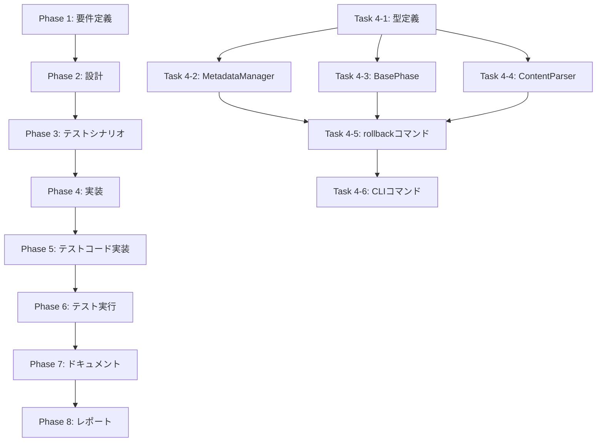

# プロジェクト計画書 - Issue #90: フェーズ差し戻し機能の実装

## 1. Issue分析

### 複雑度: 中程度

**判断根拠**:
- 複数モジュールへの影響（MetadataManager, BasePhase, ContentParser, Commands）
- 新規コマンドの追加（rollback）と既存コードの拡張
- 既存ワークフロー機構への統合が必要
- アーキテクチャ変更ではなく、既存システムへの機能追加

### 見積もり工数: 12~16時間

**内訳**:
- Phase 1（要件定義）: 1~2h
- Phase 2（設計）: 2~3h
- Phase 3（テストシナリオ）: 1~2h
- Phase 4（実装）: 4~6h
- Phase 5（テストコード実装）: 2~3h
- Phase 6（テスト実行）: 0.5~1h
- Phase 7（ドキュメント）: 1~1.5h
- Phase 8（レポート）: 0.5~0.5h

### リスク評価: 中

**判断根拠**:
- 既存メタデータ構造の拡張（後方互換性の確保が必要）
- プロンプト生成ロジックの変更（既存フェーズへの影響最小化が必要）
- レビュー結果のパース処理（ContentParserの拡張が必要）
- 複数の専門モジュール間の連携（依存性管理が重要）

## 2. 実装戦略判断

### 実装戦略: EXTEND

**判断根拠**:
- 既存の`MetadataManager`クラスに新規メソッド追加（`setRollbackContext`, `getRollbackContext`, `clearRollbackContext`, `addRollbackHistory`）
- 既存の`BasePhase`クラスに`loadPrompt()`メソッドの拡張（差し戻し理由の注入）
- 既存の`ContentParser`クラスに新規メソッド追加（`extractBlockers`, `extractSuggestions`）
- 新規コマンド`rollback`の追加（`src/commands/rollback.ts`）
- 既存のワークフロー機構を維持しながら、差し戻し機能を追加
- 新規モジュールの作成は最小限（コマンドハンドラのみ）

### テスト戦略: UNIT_INTEGRATION

**判断根拠**:
- **ユニットテスト**: 各クラスの新規メソッド（MetadataManager, BasePhase, ContentParser）の動作を個別に検証
- **インテグレーションテスト**: エンドツーエンドの差し戻しシナリオ（Phase 6 → Phase 4）、プロンプト注入の検証、メタデータ更新の検証
- BDDテストは不要: ユーザーストーリーよりも、システム内部の状態遷移とデータフローの検証が重要
- 既存ワークフローへの影響を確認する必要がある（インテグレーションテスト必須）

### テストコード戦略: BOTH_TEST

**判断根拠**:
- **既存テスト拡張（EXTEND_TEST）**:
  - `tests/unit/core/metadata-manager.test.ts` - 新規メソッドのテストケース追加
  - `tests/unit/phases/base-phase.test.ts` - `loadPrompt()`拡張のテストケース追加
  - `tests/unit/core/content-parser.test.ts` - `extractBlockers()`のテストケース追加
- **新規テスト作成（CREATE_TEST）**:
  - `tests/unit/commands/rollback.test.ts` - rollbackコマンドのユニットテスト
  - `tests/integration/rollback-workflow.test.ts` - エンドツーエンドのインテグレーションテスト

## 3. 影響範囲分析

### 既存コードへの影響

**変更が必要なファイル・モジュール**:

1. **`src/core/metadata-manager.ts`**（約239行、Issue #26で9.5%削減）
   - 新規メソッド追加: `setRollbackContext()`, `getRollbackContext()`, `clearRollbackContext()`, `addRollbackHistory()`
   - 影響度: 中（メタデータ構造の拡張、後方互換性の確保）

2. **`src/phases/base-phase.ts`**（約445行、v0.3.1で40%削減）
   - `loadPrompt()`メソッドの拡張: 差し戻しコンテキストがある場合にプロンプトの先頭に差し戻し情報を注入
   - `buildRollbackPromptSection()`メソッドの追加: 差し戻し理由をMarkdown形式で生成
   - `run()`メソッドの拡張: reviseステップ完了後に`rollback_context`をクリア
   - 影響度: 中（プロンプト生成ロジックの変更、既存フェーズへの影響最小化が必要）

3. **`src/core/content-parser.ts`**
   - 新規メソッド追加: `extractBlockers()`, `extractSuggestions()`
   - レビュー結果（Markdown形式）からブロッカー情報を構造化データとして抽出
   - 影響度: 低（新規メソッドの追加のみ、既存機能への影響なし）

4. **`src/main.ts`**（約118行、v0.3.0でリファクタリング）
   - `rollback`コマンドの定義追加
   - 影響度: 低（コマンド定義の追加のみ）

5. **`src/types/commands.ts`**（約150行、Issue #45で拡張）
   - `RollbackCommandOptions`型の追加
   - `RollbackContext`型の追加
   - `RollbackHistoryEntry`型の追加
   - 影響度: 低（型定義の追加のみ）

6. **`src/types.ts`**
   - `WorkflowState`型の拡張: `rollback_context`フィールドの追加（各フェーズ）
   - `WorkflowState`型の拡張: `rollback_history`フィールドの追加（ルートレベル）
   - 影響度: 低（オプショナルフィールドの追加、後方互換性あり）

**新規作成ファイル**:

1. **`src/commands/rollback.ts`**
   - `handleRollbackCommand()`関数の実装
   - 差し戻しロジックの実装（メタデータ更新、`ROLLBACK_REASON.md`生成）

### 依存関係の変更

**新規依存の追加**:
- なし（既存の依存関係のみを使用）

**既存依存の変更**:
- なし

### マイグレーション要否

**不要**:
- `rollback_context`と`rollback_history`フィールドはオプショナル（後方互換性あり）
- 既存のメタデータ（`metadata.json`）は変更不要
- 新規フィールドは差し戻し実行時に自動的に追加される

## 4. タスク分割

### Phase 1: 要件定義 (見積もり: 1~2h)

- [x] Task 1-1: 差し戻しユースケースの明確化 (0.5~1h)
  - Issue #49での経験を基に、具体的なユースケースを洗い出す
  - 差し戻しトリガー（手動、自動）のシナリオを定義
  - 差し戻し理由の入力方法（ファイル、コマンドライン、対話的）を明確化
- [x] Task 1-2: 機能要件の詳細化 (0.5~1h)
  - 必須機能（P0）の明確化
  - オプション機能（P1, P2）の明確化
  - 後方互換性の要件定義

### Phase 2: 設計 (見積もり: 2~3h)

- [ ] Task 2-1: メタデータ構造の設計 (0.5~1h)
  - `rollback_context`フィールドの詳細設計（型定義、フィールド構成）
  - `rollback_history`フィールドの詳細設計
  - 後方互換性の確保方法（オプショナルフィールド）
- [ ] Task 2-2: API設計 (1~1.5h)
  - `MetadataManager`新規メソッドのシグネチャ設計
  - `BasePhase.loadPrompt()`拡張のインターフェース設計
  - `ContentParser`新規メソッドのシグネチャ設計
  - `handleRollbackCommand()`関数のインターフェース設計
- [ ] Task 2-3: プロンプト注入ロジックの設計 (0.5~0.5h)
  - 差し戻し理由のMarkdownフォーマット設計
  - 既存プロンプトへの注入位置の決定（先頭に追加）

### Phase 3: テストシナリオ (見積もり: 1~2h)

- [x] Task 3-1: ユニットテストシナリオの策定 (0.5~1h)
  - `MetadataManager`新規メソッドのテストケース
  - `BasePhase.buildRollbackPromptSection()`のテストケース
  - `ContentParser.extractBlockers()`のテストケース
- [x] Task 3-2: インテグレーションテストシナリオの策定 (0.5~1h)
  - エンドツーエンドの差し戻しシナリオ（Phase 6 → Phase 4）
  - プロンプト注入の検証シナリオ
  - メタデータ更新の検証シナリオ
  - `ROLLBACK_REASON.md`生成の検証シナリオ

### Phase 4: 実装 (見積もり: 4~6h)

- [x] Task 4-1: 型定義の追加 (0.5~1h)
  - `src/types/commands.ts`: `RollbackCommandOptions`, `RollbackContext`, `RollbackHistoryEntry`型の追加
  - `src/types.ts`: `WorkflowState`型の拡張（`rollback_context`, `rollback_history`）
- [x] Task 4-2: MetadataManagerの拡張 (1~1.5h)
  - `setRollbackContext()`メソッドの実装
  - `getRollbackContext()`メソッドの実装
  - `clearRollbackContext()`メソッドの実装
  - `addRollbackHistory()`メソッドの実装
  - `updatePhaseForRollback()`メソッドの実装
  - `resetSubsequentPhases()`メソッドの実装
- [x] Task 4-3: BasePhaseの拡張 (1~1.5h)
  - `loadPrompt()`メソッドの拡張（差し戻しコンテキストのチェックと注入）
  - `buildRollbackPromptSection()`メソッドの実装
  - ReviewCycleManagerでrevise完了後のクリア処理を実装
- [ ] Task 4-4: ContentParserの拡張 (0.5~1h) **[P1機能として省略]**
  - `extractBlockers()`メソッドの実装（Markdownパース）
  - `extractSuggestions()`メソッドの実装（Markdownパース）
  - **省略理由**: コア機能に注力するため、ブロッカー情報抽出は将来的に実装
- [x] Task 4-5: rollbackコマンドの実装 (1.5~2h)
  - `src/commands/rollback.ts`の作成
  - `handleRollbackCommand()`関数の実装
  - バリデーション処理の実装
  - 確認プロンプトの実装
  - `ROLLBACK_REASON.md`生成処理の実装
  - 後続フェーズのリセット処理の実装
- [x] Task 4-6: CLIコマンドの追加 (0.5~0.5h)
  - `src/main.ts`に`rollback`コマンドの定義追加

### Phase 5: テストコード実装 (見積もり: 2~3h)

- [x] Task 5-1: ユニットテストの実装 (1~1.5h)
  - `tests/unit/core/metadata-manager-rollback.test.ts`の作成（新規ファイル）
  - `tests/unit/commands/rollback.test.ts`の作成
  - MetadataManager新規メソッドのテストケース実装（UC-MM-01 ~ UC-MM-09）
  - Rollbackコマンドのテストケース実装（UC-RC-01 ~ UC-RC-16）
- [x] Task 5-2: インテグレーションテストの実装 (1~1.5h)
  - `tests/integration/rollback-workflow.test.ts`の作成
  - エンドツーエンドの差し戻しシナリオの実装（IC-E2E-01 ~ IC-E2E-04）
  - エラーハンドリングの検証（IC-ERR-01, IC-ERR-02, IC-ERR-04）
  - 後方互換性の検証（IC-COMPAT-02）
  - 差し戻し履歴の検証（IC-HISTORY-01）

### Phase 6: テスト実行 (見積もり: 0.5~1h)

- [ ] Task 6-1: ユニットテストの実行 (0.25~0.5h)
  - `npm run test:unit`でユニットテストを実行
  - テスト失敗時の修正
- [ ] Task 6-2: インテグレーションテストの実行 (0.25~0.5h)
  - `npm run test:integration`でインテグレーションテストを実行
  - テスト失敗時の修正

### Phase 7: ドキュメント (見積もり: 1~1.5h)

- [x] Task 7-1: README.mdの更新 (0.5~0.75h)
  - `rollback`コマンドの使用方法を追加
  - 使用例の追加
- [x] Task 7-2: CLAUDE.mdの更新 (0.25~0.375h)
  - アーキテクチャセクションに差し戻し機能の説明を追加
- [x] Task 7-3: ARCHITECTURE.mdの更新 (0.25~0.375h)
  - モジュール構成セクションに`rollback`コマンドの説明を追加

### Phase 8: レポート (見積もり: 0.5~0.5h)

- [ ] Task 8-1: 実装サマリーの作成 (0.25~0.25h)
  - 実装内容の要約
  - 追加されたファイル・変更されたファイルの一覧
- [ ] Task 8-2: PRボディの作成 (0.25~0.25h)
  - Issue #90の要件に対する実装内容の説明
  - テスト結果の報告

## 5. 依存関係

**クリティカルパス**:
Phase 1 → Phase 2 → Phase 3 → Phase 4（Task 4-1 → Task 4-2, 4-3, 4-4 → Task 4-5 → Task 4-6）→ Phase 5 → Phase 6 → Phase 7 → Phase 8

**並列実行可能なタスク**:
- Phase 4内: Task 4-2（MetadataManager）、Task 4-3（BasePhase）、Task 4-4（ContentParser）は並列実行可能（Task 4-1完了後）

## 6. リスクと軽減策

### リスク1: 既存プロンプト生成ロジックへの影響

- **影響度**: 中
- **確率**: 中
- **説明**: `BasePhase.loadPrompt()`の拡張により、既存のフェーズ実行に予期しない影響が出る可能性
- **軽減策**:
  - `rollback_context`が存在しない場合は既存のロジックを維持（後方互換性の確保）
  - reviseステップのみに差し戻し情報を注入（executeとreviewステップには影響なし）
  - インテグレーションテストで既存ワークフローへの影響を検証

### リスク2: メタデータ構造の拡張による互換性問題

- **影響度**: 低
- **確率**: 低
- **説明**: 既存の`metadata.json`を読み込む際にエラーが発生する可能性
- **軽減策**:
  - `rollback_context`と`rollback_history`フィールドをオプショナルとして定義
  - メタデータ読み込み時にフィールドが存在しない場合はデフォルト値（null, []）を使用
  - 既存のワークフローメタデータを変更しない

### リスク3: レビュー結果のパース失敗

- **影響度**: 中
- **確率**: 中
- **説明**: `ContentParser.extractBlockers()`でレビュー結果のMarkdownフォーマットが想定外の場合、パースに失敗する可能性
- **軽減策**:
  - `--reason`オプションで差し戻し理由を直接指定可能にする（パース不要）
  - `extractBlockers()`でパース失敗時はエラーではなく警告を表示し、手動入力を促す
  - 複数のレビュー結果フォーマットに対応したパースロジックを実装

### リスク4: 工数見積もりの超過

- **影響度**: 低
- **確率**: 中
- **説明**: 実装の複雑さやテストケースの追加により、見積もり工数（12~16時間）を超過する可能性
- **軽減策**:
  - P0（必須）機能に絞り、P1, P2機能は後続Issueで実装
  - タスク粒度を細かく設定し、進捗を可視化
  - Phase 4で実装の複雑さが判明した場合、Phase 2（設計）に戻って簡素化

## 7. 品質ゲート

### Phase 1: 要件定義

- [ ] 差し戻しユースケースが具体的に記載されている
- [ ] 差し戻し理由の伝達メカニズムが明確に定義されている
- [ ] 必須機能（P0）とオプション機能（P1, P2）が区別されている
- [ ] 後方互換性の要件が定義されている

### Phase 2: 設計

- [ ] 実装戦略の判断根拠が明記されている（EXTEND）
- [ ] テスト戦略の判断根拠が明記されている（UNIT_INTEGRATION）
- [ ] テストコード戦略の判断根拠が明記されている（BOTH_TEST）
- [ ] メタデータ構造の設計が後方互換性を保っている
- [ ] API設計が既存コードへの影響を最小化している
- [ ] プロンプト注入ロジックが既存フェーズに影響しない設計である

### Phase 3: テストシナリオ

- [ ] ユニットテストシナリオがすべての新規メソッドをカバーしている
- [ ] インテグレーションテストシナリオがエンドツーエンドの差し戻しフローをカバーしている
- [ ] プロンプト注入の検証シナリオが含まれている
- [ ] 後方互換性の検証シナリオが含まれている

### Phase 4: 実装

- [ ] すべてのP0機能が実装されている
- [ ] 型定義が追加されている（`RollbackCommandOptions`, `RollbackContext`, `RollbackHistoryEntry`）
- [ ] MetadataManagerに新規メソッドが追加されている
- [ ] BasePhaseの`loadPrompt()`が拡張されている
- [ ] ContentParserに`extractBlockers()`が追加されている
- [ ] `rollback`コマンドが実装されている
- [ ] TypeScriptのビルドが成功する（`npm run build`）
- [ ] ESLintエラーがない（`npx eslint --ext .ts src`）

### Phase 5: テストコード実装

- [x] ユニットテストが実装されている（新規メソッドすべて）
- [x] インテグレーションテストが実装されている（エンドツーエンドシナリオ）
- [x] テストコードがTypeScriptのビルドエラーを起こさない

### Phase 6: テスト実行

- [ ] すべてのユニットテストが成功する
- [ ] すべてのインテグレーションテストが成功する
- [ ] テストカバレッジが80%以上である（新規コードのみ）
- [ ] 既存テストがすべて成功する（後方互換性の確認）

### Phase 7: ドキュメント

- [x] README.mdに`rollback`コマンドの使用方法が追加されている
- [x] 使用例が具体的である
- [x] CLAUDE.mdが更新されている
- [x] ARCHITECTURE.mdが更新されている

### Phase 8: レポート

- [ ] 実装サマリーが作成されている
- [ ] PRボディが作成されている
- [ ] Issue #90の要件がすべて満たされていることが明記されている

## 8. 成功基準

このプロジェクトは、以下の基準をすべて満たした場合に成功とみなされます：

1. **機能要件の達成**:
   - [ ] `rollback`コマンドが実装され、メタデータを更新できる
   - [ ] 差し戻し理由がメタデータに記録される（`rollback_context`）
   - [ ] `ROLLBACK_REASON.md`が自動生成される
   - [ ] reviseステップのプロンプトに差し戻し理由が自動注入される
   - [ ] 後続フェーズが正しくリセットされる

2. **品質要件の達成**:
   - [ ] ユニットテストがすべて成功する
   - [ ] インテグレーションテストがすべて成功する
   - [ ] テストカバレッジが80%以上である（新規コードのみ）
   - [ ] TypeScriptのビルドエラーがない
   - [ ] ESLintエラーがない

3. **ドキュメント要件の達成**:
   - [ ] README.md、CLAUDE.md、ARCHITECTURE.mdが更新されている
   - [ ] 使用方法が明確に記載されている

4. **後方互換性の確保**:
   - [ ] 既存のワークフローが正常に動作する
   - [ ] 既存のメタデータが読み込める

## 9. 次のステップ

Phase 0（Planning）が完了したら、以下の順序で進めます：

1. **Phase 1（Requirements）**: 差し戻しユースケースを詳細化し、機能要件を明確化
2. **Phase 2（Design）**: メタデータ構造、API設計、プロンプト注入ロジックを詳細設計
3. **Phase 3（TestScenario）**: ユニットテストとインテグレーションテストのシナリオを策定
4. **Phase 4（Implementation）**: 型定義、MetadataManager、BasePhase、ContentParser、rollbackコマンドを実装
5. **Phase 5（TestImplementation）**: ユニットテストとインテグレーションテストを実装
6. **Phase 6（Testing）**: テストを実行し、品質ゲートをクリア
7. **Phase 7（Documentation）**: ドキュメントを更新
8. **Phase 8（Report）**: 実装サマリーとPRボディを作成

---

**作成日**: 2025-01-30
**作成者**: AI Workflow Agent (Phase 0: Planning)
**Issue**: #90 - フェーズ差し戻し機能の実装（差し戻し理由の伝達を重視）
