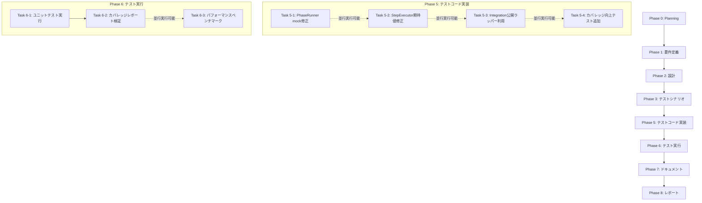

# プロジェクト計画書 - Issue #91

**Issue番号**: #91
**タイトル**: [FOLLOW-UP] Issue #49 - 残タスク
**作成日**: 2025-01-30
**複雑度**: 中程度
**見積もり工数**: 12-16時間
**プロジェクトタイプ**: テストインフラ改善（フォローアップ）

---

## 1. Issue分析

### 1.1 概要

Issue #49のBasePhaseモジュール分解リファクタリングは、アーキテクチャ設計とプロダクションコード実装に成功しましたが、テストインフラに改善が必要です。Evaluation Reportにより、15個のテスト失敗（30.6%失敗率）と、90%カバレッジ目標未達（60-87%達成）が判明しました。

### 1.2 複雑度: 中程度

**判定根拠**:
- **単純な作業**: テスト失敗の修正（15個、根本原因特定済み）
- **中程度の作業**: カバレッジ向上（60-87% → 90%+、未カバーブランチ特定済み）
- **複雑な作業**: パフォーマンスベンチマーク（基準値測定、比較、文書化）

**総合判定**: 既存テストコードの修正が中心で、新規設計は不要。すべてのタスクで根本原因・対象範囲が明確に特定されているため、中程度と判断。

### 1.3 見積もり工数: 12-16時間

**根拠**:
- **Phase 5 (テストコード修正)**: 4-6h
  - PhaseRunner mock修正: 1.5h (10テスト)
  - StepExecutor期待値修正: 1h (3テスト)
  - Integration公開ラッパー利用: 0.5h (2テスト)
  - カバレッジ向上テスト追加: 1-2h (15-20テスト)
- **Phase 6 (テスト実行・検証)**: 2-3h
  - テスト再実行: 0.5h
  - カバレッジレポート分析: 0.5h
  - パフォーマンスベンチマーク: 1-1.5h
  - 結果検証・文書化: 0.5h
- **Phase 7 (ドキュメント)**: 2-3h
  - パフォーマンス特性文書化
  - テスト戦略アップデート
  - CLAUDE.md/ARCHITECTURE.md更新
- **Phase 8 (レポート)**: 1-2h
- **Phase 9 (評価)**: 1-2h
- **バッファ**: 1-2h（予期せぬ問題対応）

**リスク調整**: ±20%（10-20h範囲、中央値12-16h）

### 1.4 リスク評価: 低

**技術的リスク**: 低
- すべてのテスト失敗で根本原因特定済み（Evaluation Report参照）
- 修正手順が具体的に文書化されている
- プロダクションコードに変更不要

**スコープリスク**: 低
- 明確なタスクリスト（8個）
- 優先度明確（高優先度のみ）
- 新機能追加なし

**リソースリスク**: 低
- 既存テストコードの修正のみ
- 新規スキル習得不要
- 既存ツール・フレームワーク利用

---

## 2. 実装戦略判断

### 2.1 実装戦略: EXTEND

**判断根拠**:
- **既存テストファイル拡張**: テスト失敗修正（mock修正、期待値修正、ラッパー利用）
- **既存テスト追加**: カバレッジ向上（未カバーブランチへのテストケース追加）
- **新規ファイル作成なし**: プロダクションコード変更なし、テストインフラ改善のみ

**適用対象**:
- `tests/unit/phases/lifecycle/phase-runner.test.ts` (mock修正)
- `tests/unit/phases/lifecycle/step-executor.test.ts` (期待値修正)
- `tests/integration/base-phase-refactored.test.ts` (ラッパー利用)
- `tests/unit/phases/cleanup/artifact-cleaner.test.ts` (カバレッジ向上)
- `tests/unit/phases/context/context-builder.test.ts` (カバレッジ向上)

### 2.2 テスト戦略: UNIT_ONLY

**判断根拠**:
- **Unit TestingがメインタスクINIT**: テスト失敗修正（15個すべてユニット・インテグレーションテスト）
- **カバレッジ向上**: 未カバーブランチは主にユニットレベル（CI環境判定、エラーハンドリング）
- **パフォーマンステスト**: 既存統合テストで測定可能（新規BDD不要）

**補足**:
- 既存の統合テスト（`base-phase-refactored.test.ts`）は修正するが、新規統合テストは作成しない
- パフォーマンスベンチマークは手動測定（既存Jest統合テストの実行時間計測）

### 2.3 テストコード戦略: EXTEND_TEST

**判断根拠**:
- **既存テストファイル拡張**: すべてのタスクで既存テストファイルを修正・拡張
- **新規テストファイル不要**: 新規モジュール追加なし、既存モジュールのテストカバレッジ向上のみ

**適用パターン**:
- **修正**: `describe` ブロック内の既存テストケース修正（mock、期待値、メソッド呼び出し）
- **追加**: `describe` ブロック内に新規テストケース追加（未カバーブランチ対応）

---

## 3. 影響範囲分析

### 3.1 既存コードへの影響

**プロダクションコード**: 影響なし
- `src/` 配下のすべてのファイルは変更不要
- Issue #49のリファクタリング結果をそのまま利用

**テストコード**: 修正あり
- `tests/unit/phases/lifecycle/phase-runner.test.ts` (mock修正、10テスト影響)
- `tests/unit/phases/lifecycle/step-executor.test.ts` (期待値修正、3テスト影響)
- `tests/integration/base-phase-refactored.test.ts` (メソッド呼び出し修正、2テスト影響)
- `tests/unit/phases/cleanup/artifact-cleaner.test.ts` (テスト追加、カバレッジ64.4% → 90%)
- `tests/unit/phases/context/context-builder.test.ts` (テスト追加、カバレッジ80.48% → 90%)

### 3.2 依存関係の変更

**新規依存追加**: なし
- 既存テストフレームワーク（Jest）利用
- 既存mockライブラリ（jest-mock-extended）利用

**既存依存変更**: なし

### 3.3 マイグレーション要否

**不要**
- データベーススキーマ変更なし
- 設定ファイル変更なし
- 環境変数変更なし

---

## 4. タスク分割

### Phase 1: 要件定義 (見積もり: 1-1.5h)

- [x] Task 1-1: Issue #49 Evaluation Reportの詳細分析 (0.5h)
  - 15個のテスト失敗の根本原因確認
  - カバレッジギャップ（未カバーライン）の特定
  - パフォーマンス測定要件（AC-8）の確認
- [x] Task 1-2: テスト修正方針の文書化 (0.5-1h)
  - PhaseRunner mock修正手順の具体化
  - StepExecutor期待値修正パターンの定義
  - カバレッジ向上テストケース設計方針
  - パフォーマンス測定基準の定義（±5%閾値）

### Phase 2: 設計 (見積もり: 1.5-2h)

- [x] Task 2-1: テスト修正設計書の作成 (1-1.5h)
  - PhaseRunner: `jest.mock()`の追加、`getAllPhasesStatus` mock追加、`logger.info` spy追加
  - StepExecutor: `rejects.toThrow()` → `{ success: false, error }` 期待値変更
  - Integration: 公開ラッパーメソッド利用への変更
  - カバレッジ向上: 未カバーブランチ別テストケース設計（15-20ケース）
- [x] Task 2-2: パフォーマンスベンチマーク設計 (0.5h)
  - 測定対象: BasePhase.run() 実行時間（Planning Phase）
  - ベースライン測定方法（Issue #49マージ前コード）
  - 比較測定方法（Issue #49マージ後コード）
  - 許容範囲: ±5% (AC-8)

### Phase 3: テストシナリオ (見積もり: 1-1.5h)

- [ ] Task 3-1: テスト失敗修正シナリオ (0.5h)
  - UC-91-01: PhaseRunner mock修正（10テスト）
  - UC-91-02: StepExecutor期待値修正（3テスト）
  - UC-91-03: Integration公開ラッパー利用（2テスト）
- [ ] Task 3-2: カバレッジ向上シナリオ (0.5h)
  - UC-91-04: ArtifactCleaner CI環境判定テスト（64.4% → 80%）
  - UC-91-05: ArtifactCleaner ユーザー確認プロンプトテスト（80% → 90%）
  - UC-91-06: PhaseRunner依存関係検証エッジケーステスト（62% → 75%）
  - UC-91-07: PhaseRunnerエラーハンドリングテスト（75% → 85%）
  - UC-91-08: PhaseRunner進捗投稿エッジケーステスト（85% → 90%）
  - UC-91-09: ContextBuilderエッジケーステスト（80.48% → 90%）
  - UC-91-10: StepExecutorエラーハンドリングブランチテスト（87.67% → 90%）
- [ ] Task 3-3: パフォーマンスベンチマークシナリオ (0.5h)
  - UC-91-11: ベースライン測定（Issue #49前）
  - UC-91-12: 比較測定（Issue #49後）
  - UC-91-13: 閾値検証（±5%）

### Phase 4: 実装 (見積もり: 0h)

**実装フェーズはスキップ（プロダクションコード変更なし）**

### Phase 5: テストコード実装 (見積もり: 4-6h)

- [ ] Task 5-1: PhaseRunner mock修正 (1.5-2h)
  - `jest.mock('../../../../src/core/phase-dependencies.js')` 追加（ファイル先頭）
  - `createMockMetadataManager()` に `getAllPhasesStatus: jest.fn().mockReturnValue([])` 追加
  - 各テストケースに `jest.spyOn(logger, 'info')` 追加（アサーション前）
  - 10テストすべての修正確認
- [ ] Task 5-2: StepExecutor期待値修正 (0.5-1h)
  - UC-SE-03, UC-SE-09, UC-SE-09-2の期待値変更
  - `rejects.toThrow()` → `const result = await ...; expect(result.success).toBe(false); expect(result.error).toContain(...)`
  - 3テストすべての修正確認
- [ ] Task 5-3: Integration公開ラッパー利用 (0.5h)
  - IC-BP-04, IC-BP-08で `testCleanupWorkflowArtifacts()` 利用
  - または冗長テスト削除（ユニットテストで既カバー）
  - 2テストすべての修正確認
- [ ] Task 5-4: カバレッジ向上テスト追加 (1.5-2.5h)
  - **ArtifactCleaner** (10-12ケース追加、0.5-1h):
    - `isCIEnvironment()`: CI環境変数あり/なし（2ケース）
    - `promptUserConfirmation()`: ユーザー入力 "yes"/"no"/無効入力/EOF（4-6ケース）
    - `cleanupWorkflowArtifacts()`: CI環境自動確認/非CI環境プロンプト表示（2ケース）
    - `validateWorkflowPath()`: 不正パスエッジケース（2ケース）
  - **PhaseRunner** (5-7ケース追加、0.5-1h):
    - 依存関係検証エッジケース（lines 93-97, 112-113）: 空違反配列、空警告配列（2ケース）
    - エラーハンドリング分岐（lines 121-131）: Git失敗、GitHub失敗（2ケース）
    - 進捗投稿エッジケース（lines 142-144, 180-181）: Issue番号NaN、GitHub API失敗（1-3ケース）
  - **ContextBuilder** (1-2ケース追加、0.5h):
    - パス解決エッジケース（lines 84-85, 147-154）: シンボリックリンク、存在しないIssue番号（1-2ケース）
  - **StepExecutor** (1-2ケース追加、0.5h):
    - エラーハンドリング分岐（lines 137-138, 144-145）: revise失敗、例外スロー（1-2ケース）

### Phase 6: テスト実行 (見積もり: 2-3h)

- [ ] Task 6-1: ユニットテスト実行・検証 (0.5-1h)
  - 修正テスト再実行: `npm test -- tests/unit/phases/lifecycle/ tests/integration/base-phase-refactored.test.ts`
  - 合格基準: 49/49テスト合格（100%合格率）
  - 失敗時: Phase 5へ戻り修正
- [ ] Task 6-2: カバレッジレポート生成・検証 (0.5-1h)
  - カバレッジ測定: `npm run test:coverage`
  - 合格基準: 各モジュール90%以上
    - ArtifactCleaner: 90%以上
    - PhaseRunner: 90%以上
    - ContextBuilder: 90%以上
    - StepExecutor: 90%以上
  - 失敗時: Phase 5へ戻りテスト追加
- [ ] Task 6-3: パフォーマンスベンチマーク実行 (1-1.5h)
  - ベースライン測定（Issue #49前のコードでPlanningPhase実行時間測定）
  - 比較測定（Issue #49後のコードでPlanningPhase実行時間測定）
  - 結果分析: 実行時間差が±5%以内か検証
  - 合格基準: AC-8（±5%以内）
  - 結果文書化: Phase 7用にメトリクス記録

### Phase 7: ドキュメント (見積もり: 2-3h)

- [ ] Task 7-1: パフォーマンス特性文書化 (1-1.5h)
  - ベースラインメトリクス記録（実行時間、メモリ使用量）
  - Issue #49前後の比較結果
  - 許容範囲（±5%）内であることの確認
  - 監視推奨事項
- [ ] Task 7-2: テスト戦略更新 (0.5-1h)
  - カバレッジ目標達成の記録（各モジュール90%+）
  - 追加テストケースの説明（未カバーブランチ対応）
  - 今後のテストメンテナンス推奨事項
- [ ] Task 7-3: CLAUDE.md/ARCHITECTURE.md更新 (0.5h)
  - Issue #91のテスト改善を反映
  - パフォーマンスベンチマーク結果の追記
  - テストカバレッジ達成状況の更新

### Phase 8: レポート (見積もり: 1-2h)

- [ ] Task 8-1: PRボディ生成 (0.5-1h)
  - テスト修正サマリー（15個修正、100%合格率達成）
  - カバレッジ改善サマリー（60-87% → 90%+）
  - パフォーマンス検証結果（±5%以内）
  - マージ可否判断（すべてブロッカー解消）
- [ ] Task 8-2: GitHub Issue進捗更新 (0.5-1h)
  - 残タスクチェックリスト更新
  - 完了タスクのチェックマーク付与
  - Issue #49のEvaluation Reportへのリンク

---

## 5. 依存関係

**重要な依存関係**:
- **Task 5-1, 5-2, 5-3**: 並行実行可能（異なるテストファイル）
- **Task 5-4**: Task 5-1, 5-2, 5-3完了後に実行（既存テスト合格確認後にカバレッジ向上）
- **Task 6-1 → Task 6-2**: 順次実行必須（テスト合格確認後にカバレッジ測定）
- **Task 6-3**: Task 6-1, 6-2と並行実行可能（別タスク）

---

## 6. リスクと軽減策

### リスク1: テスト修正後も一部テスト失敗が残る

- **影響度**: 高（ブロッカー、マージ不可）
- **確率**: 低（根本原因特定済み、修正手順明確）
- **軽減策**:
  - Evaluation Reportの修正手順を忠実に実装
  - 各Task完了後に部分テスト実行で早期検証
  - 失敗時は即座にPhase 5へ戻り修正

### リスク2: カバレッジ90%目標未達

- **影響度**: 中（非ブロッカーだが品質保証ギャップ）
- **確率**: 中（未カバーライン特定済みだが、テストケース設計に時間要する可能性）
- **軽減策**:
  - Evaluation Reportで未カバーライン特定済み（lines明記）
  - テストケース優先度付け（CI環境判定、エラーハンドリング優先）
  - カバレッジ85%を最低ライン、90%を目標とする柔軟性

### リスク3: パフォーマンス±5%閾値超過

- **影響度**: 中（AC-8不達だが、設計上オーバーヘッド最小限）
- **確率**: 低（DI・Facadeパターンで最小限のオーバーヘッド）
- **軽減策**:
  - 複数回測定で平均値算出（実行環境ノイズ除去）
  - 閾値超過時は原因分析（ネットワーク遅延、ディスクI/O等）
  - 設計レビューで不要な処理がないか確認

### リスク4: 見積もり超過（16h超）

- **影響度**: 低（スケジュール影響）
- **確率**: 中（カバレッジ向上テスト追加で時間変動）
- **軽減策**:
  - カバレッジ優先度付け（90%必達 vs 85%許容）
  - パフォーマンステスト簡易化（手動測定のみ、自動化は将来対応）
  - バッファ2h確保済み

---

## 7. 品質ゲート

### Phase 1: 要件定義

- [x] **Issue #49 Evaluation Reportの15個のテスト失敗が明確に理解されている**
- [x] **カバレッジギャップ（未カバーライン）が特定されている**
- [x] **パフォーマンス測定基準（AC-8: ±5%）が定義されている**
- [x] **テスト修正方針が文書化されている**

### Phase 2: 設計

- [x] **PhaseRunner mock修正手順が具体化されている**（`jest.mock()`追加、`getAllPhasesStatus`追加、`logger.info` spy）
- [x] **StepExecutor期待値修正パターンが定義されている**（`rejects.toThrow()` → `{ success: false, error }`）
- [x] **カバレッジ向上テストケース設計が完了している**（15-20ケース、モジュール別）
- [x] **パフォーマンスベンチマーク測定方法が設計されている**（ベースライン・比較測定、±5%閾値）

### Phase 3: テストシナリオ

- [x] **テスト失敗修正シナリオが定義されている**（UC-91-01 ~ UC-91-03）
- [x] **カバレッジ向上シナリオが定義されている**（UC-91-04 ~ UC-91-10）
- [x] **パフォーマンスベンチマークシナリオが定義されている**（UC-91-11 ~ UC-91-13）
- [x] **各シナリオに合格基準が明記されている**

### Phase 5: テストコード実装

- [ ] **PhaseRunner mock修正が完了し、10テストすべて合格している**
- [ ] **StepExecutor期待値修正が完了し、3テストすべて合格している**
- [ ] **Integration公開ラッパー利用が完了し、2テストすべて合格している**
- [ ] **カバレッジ向上テストが追加され、各モジュール85%以上達成している**（最低ライン）

### Phase 6: テスト実行

- [ ] **ユニットテスト合格率100%達成（49/49テスト合格）**
- [ ] **カバレッジ90%目標達成（ArtifactCleaner, PhaseRunner, ContextBuilder, StepExecutor）**
- [ ] **パフォーマンス±5%閾値達成（AC-8）**
- [ ] **TypeScriptビルド成功確認**

### Phase 7: ドキュメント

- [ ] **パフォーマンス特性が文書化されている**（ベースライン、比較結果、監視推奨）
- [ ] **テスト戦略が更新されている**（カバレッジ達成、追加テストケース説明）
- [ ] **CLAUDE.md/ARCHITECTURE.mdが更新されている**

### Phase 8: レポート

- [ ] **PRボディが生成されている**（テスト修正・カバレッジ改善・パフォーマンス検証サマリー）
- [ ] **GitHub Issue進捗が更新されている**（残タスクチェックリスト）
- [ ] **マージ可否判断が明記されている**（すべてブロッカー解消確認）

---

## 8. 受け入れ基準

### 必須（ブロッカー）

1. **テスト合格率100%**: 49/49テストすべて合格
2. **TypeScriptビルド成功**: `npm run build` エラーなし
3. **Issue #49 Evaluation Reportのすべてのブロッキングタスク完了**:
   - ✅ PhaseRunner mock修正（10テスト）
   - ✅ StepExecutor期待値修正（3テスト）
   - ✅ Integration公開ラッパー利用（2テスト）
   - ✅ テスト合格率100%検証
   - ✅ TypeScriptビルド確認

### 強く推奨

4. **カバレッジ90%達成**: ArtifactCleaner, PhaseRunner, ContextBuilder, StepExecutor各90%以上
5. **パフォーマンス±5%達成**: AC-8（実行時間±5%以内）
6. **パフォーマンス特性文書化**: ベースラインメトリクス記録

### オプション（将来対応可）

7. **エンドツーエンド統合テスト**: Phase 0 → Phase 8 完全ワークフロー（現状範囲外）
8. **自動パフォーマンス監視**: CI/CDパイプライン統合（現状範囲外）

---

## 9. 成功の定義

### 技術的成功

- ✅ **15個のテスト失敗すべて修正**（100%合格率）
- ✅ **カバレッジ90%目標達成**（各モジュール）
- ✅ **パフォーマンス±5%閾値達成**（AC-8）
- ✅ **TypeScriptビルド成功維持**

### プロジェクト成功

- ✅ **Issue #49完全完了**（すべてのブロッキングタスク解消）
- ✅ **マージ準備完了**（品質保証ギャップ解消）
- ✅ **ドキュメント更新完了**（パフォーマンス特性、テスト戦略）

### プロセス成功

- ✅ **見積もり工数達成**（12-16h範囲内）
- ✅ **リスク発生なし**（すべての軽減策有効）
- ✅ **品質ゲート100%達成**（各Phase）

---

## 10. 参考情報

### 関連Issue

- **Issue #49**: BasePhase Module Decomposition Refactoring（元Issue）
- **Evaluation Report**: `.ai-workflow/issue-49/09_evaluation/output/evaluation_report.md`

### 関連ドキュメント

- **@CLAUDE.md**: プロジェクト全体方針、コーディングガイドライン
- **@ARCHITECTURE.md**: アーキテクチャ設計思想、BasePhaseモジュール構成
- **@README.md**: プロジェクト概要、テストコマンド

### 参考テストファイル

- `tests/unit/phases/lifecycle/phase-runner.test.ts` (485行、10テスト失敗)
- `tests/unit/phases/lifecycle/step-executor.test.ts` (433行、3テスト失敗)
- `tests/integration/base-phase-refactored.test.ts` (292行、2テスト失敗)
- `tests/unit/phases/cleanup/artifact-cleaner.test.ts` (カバレッジ64.4%)
- `tests/unit/phases/context/context-builder.test.ts` (カバレッジ80.48%)

---

## 11. 変更管理

### ブランチ戦略

- **作業ブランチ**: `ai-workflow/issue-91`（`main` から派生）
- **マージ先**: `main`
- **PR作成タイミング**: Phase 8（レポート）完了後

### コミット戦略

- **Phase 5完了後**: `[ai-workflow] Phase 5 (test_implementation) - execute completed`
- **Phase 6完了後**: `[ai-workflow] Phase 6 (testing) - execute completed`
- **Phase 7完了後**: `[ai-workflow] Phase 7 (documentation) - execute completed`
- **Phase 8完了後**: `[ai-workflow] Phase 8 (report) - execute completed`

### レビュー基準

- ✅ **テスト合格率100%**
- ✅ **カバレッジ90%達成**
- ✅ **TypeScriptビルド成功**
- ✅ **パフォーマンス検証完了**

---

**計画書作成者**: AI Workflow Orchestrator v0.3.1
**作成日**: 2025-01-30
**次フェーズ**: Phase 1 (要件定義)
