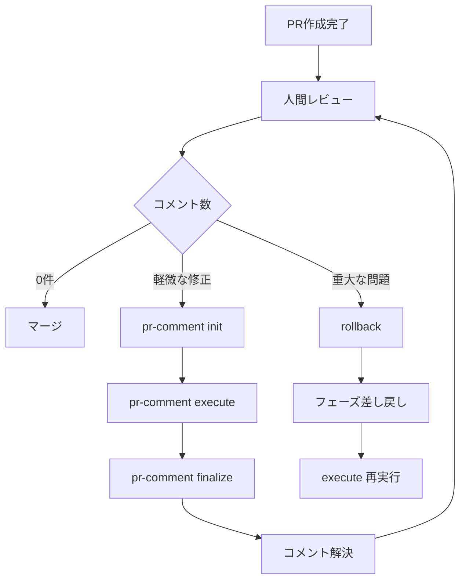

# PRコメント自動対応機能の実装

## 概要

Pull Requestに投稿されたレビューコメントを検出し、AIエージェントが各コメントに対して自動的に対応（コード修正、返信、解決マーク）を行う機能を実装する。

既存の `init` → `execute` → `finalize` ワークフローパターンに従い、PRコメント対応専用のメタデータ管理とレジューム機能をサポートする。

## 背景

現在、`ai-workflow-agent` は以下の機能を提供しています：

| 機能 | コマンド | 説明 |
|------|---------|------|
| **Issue → PR作成** | `init`, `execute` | IssueからワークフローPRを自動生成 |
| **リポジトリ検索 → Issue作成** | `auto-issue` | バグ・リファクタリング機会を検出してIssue生成 |
| **フェーズ差し戻し** | `rollback`, `rollback-auto` | レビュー指摘に基づいて前フェーズへ差し戻し |

しかし、**PR作成後のレビューコメントへの対応**については手動で行う必要があり、以下の課題があります：

- レビューコメントが複数ある場合、すべてに対応するのに時間がかかる
- コメントの対応漏れが発生しやすい
- レビュアーとのやり取りが非効率（コメント → 修正 → 返信 → 解決マークの繰り返し）

## 目標

PRレビューコメントに対して、AIエージェントが以下を自動実行：

1. **コメント検出**: 未解決のレビューコメントを自動収集（init）
2. **対応方針決定**: 各コメントの内容を分析し、対応方針を決定（execute）
3. **コード修正**: 必要に応じてコードを修正（execute）
4. **返信投稿**: レビュアーへの返信コメントを投稿（execute）
5. **解決マーク**: 対応完了後、コメントを解決済みとしてマーク（finalize）
6. **コミット＆プッシュ**: すべての変更をコミットしてPRに反映（execute）

## 戦略的設計：既存ワークフローとの整合性

### アーキテクチャ原則

既存の `init` → `execute` → `finalize` ワークフローパターンに従い、PRコメント対応も同じ3段階構造で実装する。



### コマンド構造

#### 1. `pr-comment init` - コメント収集＆メタデータ作成

```bash
# 基本的な使用方法（PR番号を指定）
node dist/index.js pr-comment init --pr <PR_NUMBER>

# Issue番号から自動的にPR番号を解決
node dist/index.js pr-comment init --issue <ISSUE_NUMBER>

# 特定のコメントIDのみを対象にする
node dist/index.js pr-comment init --pr <PR_NUMBER> --comment-ids 123,456,789
```

**主な機能**:
- PR review comments を GitHub API から取得
- 未解決コメントのみをフィルタリング
- コメント対応用のメタデータファイルを作成（`.ai-workflow/pr-<PR_NUMBER>/comment-resolution-metadata.json`）
- 各コメントに対して初期ステータス（`pending`）を設定

#### 2. `pr-comment execute` - コメント対応実行

```bash
# 全コメントに対して自動対応
node dist/index.js pr-comment execute --pr <PR_NUMBER>

# 特定のコメントIDのみ対応
node dist/index.js pr-comment execute --pr <PR_NUMBER> --comment-ids 123,456

# プレビューモード（実際には修正せず、対応方針のみ表示）
node dist/index.js pr-comment execute --pr <PR_NUMBER> --dry-run

# エージェント指定
node dist/index.js pr-comment execute --pr <PR_NUMBER> --agent codex

# バッチサイズ指定（並列処理数）
node dist/index.js pr-comment execute --pr <PR_NUMBER> --batch-size 5
```

**主な機能**:
- メタデータから未対応（`pending` または `in_progress`）のコメントを取得
- 各コメントをAIエージェントで分析（対応方針決定）
- コード修正を適用
- レビュアーへ返信コメントを投稿
- Git コミット＆プッシュ
- メタデータを更新（`completed` または `failed`）
- **レジューム機能**: 実行中に中断された場合、次回実行時に `in_progress` から再開

#### 3. `pr-comment finalize` - 解決マーク＆クリーンアップ

```bash
# 対応完了したコメントを解決済みとしてマーク
node dist/index.js pr-comment finalize --pr <PR_NUMBER>

# 解決マークのみ実行（クリーンアップはスキップ）
node dist/index.js pr-comment finalize --pr <PR_NUMBER> --skip-cleanup

# プレビューモード
node dist/index.js pr-comment finalize --pr <PR_NUMBER> --dry-run
```

**主な機能**:
- メタデータから `completed` ステータスのコメントを取得
- GitHub GraphQL API を使用して各コメントスレッドを解決済みとしてマーク
- メタデータファイルのクリーンアップ（オプション）
- 結果サマリーを表示

### メタデータ構造

#### `.ai-workflow/pr-<PR_NUMBER>/comment-resolution-metadata.json`

```json
{
  "pr_number": 123,
  "pr_url": "https://github.com/owner/repo/pull/123",
  "pr_title": "Feature: Add new authentication system",
  "pr_branch": "feature/auth-system",
  "base_branch": "main",
  "repository": {
    "owner": "owner",
    "repo": "repo",
    "path": "/path/to/repo"
  },
  "workflow_version": "1.0.0",
  "created_at": "2025-12-09T12:00:00Z",
  "updated_at": "2025-12-09T12:30:00Z",
  "comments": [
    {
      "id": 456789,
      "pull_request_review_id": 123456,
      "path": "src/core/config.ts",
      "line": 42,
      "body": "Fix typo: 'recieve' should be 'receive'",
      "user": {
        "login": "reviewer-alice",
        "id": 12345
      },
      "created_at": "2025-12-09T11:00:00Z",
      "html_url": "https://github.com/owner/repo/pull/123#discussion_r456789",
      "thread_id": "PRRT_kwDOABCDEFGHIJKLMNOPQRSTUVWXYZ",
      "status": "completed",
      "resolution": {
        "type": "code_change",
        "confidence": "high",
        "changes": [
          {
            "file_path": "src/core/config.ts",
            "change_type": "modify",
            "lines_changed": 1
          }
        ],
        "reply_comment_id": 456790,
        "reply_body": "Fixed typo as suggested. Changed 'recieve' to 'receive'.",
        "commit_sha": "abc123def456",
        "resolved_at": "2025-12-09T12:15:00Z"
      },
      "retry_count": 0,
      "error": null
    },
    {
      "id": 456791,
      "pull_request_review_id": 123457,
      "path": "src/commands/init.ts",
      "line": 163,
      "body": "Why did you choose this approach? Could you explain the rationale?",
      "user": {
        "login": "reviewer-bob",
        "id": 12346
      },
      "created_at": "2025-12-09T11:05:00Z",
      "html_url": "https://github.com/owner/repo/pull/123#discussion_r456791",
      "thread_id": "PRRT_kwABCDEFGHIJKLMNOPQRSTUVWXYZ123",
      "status": "completed",
      "resolution": {
        "type": "reply",
        "confidence": "medium",
        "changes": [],
        "reply_comment_id": 456792,
        "reply_body": "We chose this approach because it provides better type safety...",
        "commit_sha": null,
        "resolved_at": "2025-12-09T12:20:00Z"
      },
      "retry_count": 0,
      "error": null
    },
    {
      "id": 456793,
      "pull_request_review_id": 123458,
      "path": "src/core/git-manager.ts",
      "line": 78,
      "body": "This might cause issues with nested objects. Consider using deep merge.",
      "user": {
        "login": "reviewer-carol",
        "id": 12347
      },
      "created_at": "2025-12-09T11:10:00Z",
      "html_url": "https://github.com/owner/repo/pull/123#discussion_r456793",
      "thread_id": "PRRT_kwABCDEFGHIJKLMNOPQRSTUVWXYZ456",
      "status": "skipped",
      "resolution": {
        "type": "discussion",
        "confidence": "low",
        "changes": [],
        "reply_comment_id": 456794,
        "reply_body": "Good point. This needs architectural discussion. Marked for manual review.",
        "commit_sha": null,
        "resolved_at": null,
        "skip_reason": "Requires architectural discussion"
      },
      "retry_count": 0,
      "error": null
    }
  ],
  "summary": {
    "total_comments": 3,
    "completed": 2,
    "skipped": 1,
    "failed": 0,
    "pending": 0,
    "in_progress": 0
  },
  "cost_tracking": {
    "total_input_tokens": 5000,
    "total_output_tokens": 2000,
    "total_cost_usd": 0.15
  }
}
```

#### メタデータフィールド説明

##### トップレベル

| フィールド | 型 | 説明 |
|-----------|-----|------|
| `pr_number` | number | PR番号 |
| `pr_url` | string | PR URL |
| `pr_title` | string | PRタイトル |
| `pr_branch` | string | PRブランチ名 |
| `base_branch` | string | マージ先ブランチ名 |
| `repository` | object | リポジトリ情報（owner, repo, path） |
| `workflow_version` | string | メタデータバージョン |
| `created_at` | string | メタデータ作成日時 |
| `updated_at` | string | メタデータ更新日時 |
| `comments` | array | コメント配列 |
| `summary` | object | 集計情報 |
| `cost_tracking` | object | コスト追跡 |

##### Comment オブジェクト

| フィールド | 型 | 説明 |
|-----------|-----|------|
| `id` | number | コメントID |
| `pull_request_review_id` | number | レビューID |
| `path` | string | ファイルパス |
| `line` | number | 行番号 |
| `body` | string | コメント本文 |
| `user` | object | レビュアー情報（login, id） |
| `created_at` | string | コメント作成日時 |
| `html_url` | string | コメントURL |
| `thread_id` | string | スレッドID（GraphQL node_id） |
| `status` | string | ステータス（`pending`, `in_progress`, `completed`, `skipped`, `failed`） |
| `resolution` | object | 対応内容 |
| `retry_count` | number | リトライ回数 |
| `error` | string\|null | エラーメッセージ |

##### Resolution オブジェクト

| フィールド | 型 | 説明 |
|-----------|-----|------|
| `type` | string | 対応タイプ（`code_change`, `reply`, `discussion`, `skip`） |
| `confidence` | string | 信頼度（`high`, `medium`, `low`） |
| `changes` | array | ファイル変更情報（FileChange配列） |
| `reply_comment_id` | number\|null | 返信コメントID |
| `reply_body` | string\|null | 返信コメント本文 |
| `commit_sha` | string\|null | コミットSHA |
| `resolved_at` | string\|null | 解決日時 |
| `skip_reason` | string\|null | スキップ理由 |

##### ステータス遷移

```
pending → in_progress → completed
                    ↓
                  failed
                    ↓
                  skipped
```

- **pending**: 未対応（init で設定）
- **in_progress**: 対応中（execute で設定）
- **completed**: 対応完了（execute で設定、コード修正または返信完了）
- **skipped**: スキップ（execute で設定、議論が必要な場合）
- **failed**: 失敗（execute で設定、エラー発生時）

### レジューム機能

`execute` コマンド実行中にエラーや中断が発生した場合、次回実行時に `status` が `pending` または `in_progress` のコメントから自動的に再開する。

```bash
# 初回実行（3件中2件完了、1件でエラー発生）
node dist/index.js pr-comment execute --pr 123
# [INFO] Resolved 2/3 comments
# [ERROR] Failed to resolve comment #456793: Agent timeout

# 再実行（未完了の1件のみ処理）
node dist/index.js pr-comment execute --pr 123
# [INFO] Resuming from previous execution...
# [INFO] Found 1 unresolved comment
# [INFO] Resolved 1/1 comments
# [INFO] All comments resolved successfully
```

### エージェント戦略

既存の `auto-issue` および `rollback-auto` と同様、以下のエージェント選択肢をサポート：

| エージェント | 用途 | API |
|------------|------|-----|
| **Codex** | コード修正が主体 | OpenAI Codex CLI |
| **Claude** | 分析・返信が主体 | Claude Agent SDK |
| **auto** | 自動選択（コメント内容に応じて最適なエージェントを選択） | 両方 |

**エージェント選択ロジック**:
- コメント内容が「コード修正」を示唆（fix, change, typo 等） → Codex 優先
- コメント内容が「質問」「説明要求」（why, what, how, ? 等） → Claude 優先
- 複数コメントの場合 → 各コメントごとに最適なエージェントを選択

## 実装詳細

### 1. CLI コマンド

#### `src/main.ts` への追加

```typescript
// pr-comment init コマンド
program
  .command('pr-comment-init')
  .description('Initialize PR comment resolution workflow')
  .option('--pr <number>', 'Pull request number')
  .option('--issue <number>', 'Issue number (resolve PR number from metadata)')
  .option('--comment-ids <ids>', 'Comma-separated comment IDs to include (default: all unresolved)')
  .action(async (options) => {
    await handlePRCommentInitCommand(options);
  });

// pr-comment execute コマンド
program
  .command('pr-comment-execute')
  .description('Execute PR comment resolution')
  .requiredOption('--pr <number>', 'Pull request number')
  .option('--comment-ids <ids>', 'Comma-separated comment IDs to resolve (default: all unresolved)')
  .option('--dry-run', 'Preview mode: show resolution plan without applying changes')
  .option('--agent <mode>', 'Agent mode: auto, codex, or claude (default: auto)')
  .option('--batch-size <number>', 'Number of comments to process in parallel (default: 3)')
  .action(async (options) => {
    await handlePRCommentExecuteCommand(options);
  });

// pr-comment finalize コマンド
program
  .command('pr-comment-finalize')
  .description('Finalize PR comment resolution (mark as resolved)')
  .requiredOption('--pr <number>', 'Pull request number')
  .option('--skip-cleanup', 'Skip metadata cleanup')
  .option('--dry-run', 'Preview mode: show which comments will be resolved')
  .action(async (options) => {
    await handlePRCommentFinalizeCommand(options);
  });
```

### 2. コマンドハンドラ

#### `src/commands/pr-comment/init.ts` (新規作成)

```typescript
export interface PRCommentInitOptions {
  pr?: string; // PR番号
  issue?: string; // Issue番号（PR番号を自動解決）
  commentIds?: string; // カンマ区切りのコメントID（オプション）
}

export async function handlePRCommentInitCommand(
  options: PRCommentInitOptions
): Promise<void> {
  // 1. PR番号の解決（--issue 指定時は metadata.json から pr_number を取得）
  // 2. GitHub Client 初期化
  // 3. PR review comments 取得（GitHub API）
  // 4. 未解決コメントのフィルタリング
  // 5. comment-ids フィルタリング（オプション）
  // 6. メタデータディレクトリ作成（.ai-workflow/pr-<PR_NUMBER>/）
  // 7. メタデータファイル作成（comment-resolution-metadata.json）
  // 8. 各コメントに初期ステータス（pending）を設定
  // 9. サマリー表示
}
```

#### `src/commands/pr-comment/execute.ts` (新規作成)

```typescript
export interface PRCommentExecuteOptions {
  pr: string; // PR番号
  commentIds?: string; // カンマ区切りのコメントID（オプション）
  dryRun?: boolean; // プレビューモード
  agent?: 'auto' | 'codex' | 'claude'; // エージェント選択
  batchSize?: number; // 並列処理数（デフォルト: 3）
}

export async function handlePRCommentExecuteCommand(
  options: PRCommentExecuteOptions
): Promise<void> {
  // 1. メタデータ読み込み
  // 2. 未対応コメントの取得（status: pending または in_progress）
  // 3. comment-ids フィルタリング（オプション）
  // 4. レジューム検出（in_progress コメントがあれば警告表示）
  // 5. エージェントクライアント初期化
  // 6. バッチ処理（batch_size ごとに並列実行）
  //    - コメント分析（ReviewCommentAnalyzer）
  //    - ステータス更新（in_progress）
  //    - コード修正適用（CodeChangeApplier）
  //    - 返信コメント投稿（CommentClient）
  //    - Git コミット＆プッシュ
  //    - ステータス更新（completed / skipped / failed）
  //    - メタデータ保存
  // 7. コスト追跡更新
  // 8. サマリー表示
}
```

#### `src/commands/pr-comment/finalize.ts` (新規作成)

```typescript
export interface PRCommentFinalizeOptions {
  pr: string; // PR番号
  skipCleanup?: boolean; // メタデータクリーンアップをスキップ
  dryRun?: boolean; // プレビューモード
}

export async function handlePRCommentFinalizeCommand(
  options: PRCommentFinalizeOptions
): Promise<void> {
  // 1. メタデータ読み込み
  // 2. 対応完了コメントの取得（status: completed）
  // 3. GraphQL API で各コメントスレッドを解決済みとしてマーク
  // 4. メタデータ更新（resolved_at タイムスタンプ）
  // 5. メタデータクリーンアップ（--skip-cleanup でない場合）
  // 6. サマリー表示
}
```

### 3. GitHub API クライアント拡張

#### `src/core/github/comment-client.ts` への追加

```typescript
export interface PRReviewComment {
  id: number;
  pull_request_review_id: number;
  path: string;
  line?: number;
  body: string;
  user: {
    login: string;
    id: number;
  };
  created_at: string;
  updated_at: string;
  html_url: string;
  in_reply_to_id?: number;
}

export interface PRReviewThread {
  id: string; // GraphQL node_id
  isResolved: boolean;
}

/**
 * Gets all review comments for a pull request.
 */
public async getPRReviewComments(prNumber: number): Promise<PRReviewComment[]> {
  const { data } = await this.octokit.pulls.listReviewComments({
    owner: this.owner,
    repo: this.repo,
    pull_number: prNumber,
    per_page: 100,
  });

  return data as PRReviewComment[];
}

/**
 * Gets unresolved review comments using GraphQL API.
 */
public async getUnresolvedPRReviewComments(prNumber: number): Promise<PRReviewComment[]> {
  const query = `
    query GetUnresolvedComments($owner: String!, $repo: String!, $prNumber: Int!) {
      repository(owner: $owner, name: $repo) {
        pullRequest(number: $prNumber) {
          reviewThreads(first: 100) {
            nodes {
              id
              isResolved
              comments(first: 1) {
                nodes {
                  id
                  databaseId
                  path
                  line
                  body
                  author {
                    login
                  }
                  createdAt
                  url
                }
              }
            }
          }
        }
      }
    }
  `;

  const variables = {
    owner: this.owner,
    repo: this.repo,
    prNumber,
  };

  const response = await this.octokit.graphql<any>(query, variables);
  const threads = response.repository.pullRequest.reviewThreads.nodes;

  // 未解決スレッドのコメントのみ抽出
  return threads
    .filter((thread: any) => !thread.isResolved)
    .map((thread: any) => thread.comments.nodes[0])
    .filter((comment: any) => comment !== undefined)
    .map((comment: any) => ({
      id: comment.databaseId,
      path: comment.path,
      line: comment.line,
      body: comment.body,
      user: {
        login: comment.author.login,
        id: 0, // GraphQL では user ID は取得しない
      },
      created_at: comment.createdAt,
      html_url: comment.url,
      thread_id: threads.find((t: any) => t.comments.nodes[0]?.databaseId === comment.databaseId)?.id,
    }));
}

/**
 * Posts a reply to a review comment.
 */
public async replyToPRReviewComment(
  prNumber: number,
  commentId: number,
  body: string
): Promise<number> {
  const { data } = await this.octokit.pulls.createReplyForReviewComment({
    owner: this.owner,
    repo: this.repo,
    pull_number: prNumber,
    comment_id: commentId,
    body,
  });

  logger.info(`Replied to PR review comment #${commentId}`);
  return data.id;
}

/**
 * Marks a review thread as resolved using GraphQL API.
 */
public async resolveReviewThread(threadId: string): Promise<void> {
  const mutation = `
    mutation ResolveThread($threadId: ID!) {
      resolveReviewThread(input: { threadId: $threadId }) {
        thread {
          isResolved
        }
      }
    }
  `;

  await this.octokit.graphql(mutation, { threadId });
  logger.info(`Resolved review thread: ${threadId}`);
}
```

### 4. コメント分析エンジン

#### `src/core/pr-comment/comment-analyzer.ts` (新規作成)

```typescript
import type { PRReviewComment } from '../github/comment-client.js';
import type { CodexAgentClient } from '../codex-agent-client.js';
import type { ClaudeAgentClient } from '../claude-agent-client.js';

export interface CommentResolution {
  comment_id: number;
  type: 'code_change' | 'reply' | 'discussion' | 'skip';
  confidence: 'high' | 'medium' | 'low';
  changes: FileChange[];
  reply: string | null;
  reason: string;
}

export interface FileChange {
  file_path: string;
  old_content?: string;
  new_content: string;
  change_type: 'modify' | 'create' | 'delete';
}

/**
 * ReviewCommentAnalyzer analyzes PR review comments and determines resolution strategies.
 */
export class ReviewCommentAnalyzer {
  constructor(
    private readonly codexClient: CodexAgentClient | null,
    private readonly claudeClient: ClaudeAgentClient | null,
    private readonly repoPath: string
  ) {}

  /**
   * Analyzes a single review comment and determines resolution strategy.
   */
  public async analyzeComment(
    comment: PRReviewComment,
    prContext: {
      pr_number: number;
      pr_title: string;
      pr_description: string;
      branch_name: string;
    }
  ): Promise<CommentResolution> {
    // 1. コメント分類（code_change / question / discussion）
    const classification = this.classifyComment(comment);

    // 2. 最適なエージェント選択
    const agentType = this.selectAgent(classification);

    // 3. プロンプト構築
    const prompt = await this.buildPrompt(comment, prContext);

    // 4. エージェント実行（ファイルベースJSON出力）
    const outputFilePath = this.generateOutputFilePath(comment.id);
    const agent = agentType === 'codex' ? this.codexClient : this.claudeClient;

    if (!agent) {
      throw new Error(`Agent ${agentType} is not initialized`);
    }

    await agent.execute(prompt, this.repoPath, {
      output_file: outputFilePath,
    });

    // 5. JSON パース
    const resolution = this.parseResolutionFile(outputFilePath);

    return resolution;
  }

  private classifyComment(comment: PRReviewComment): 'code_change' | 'question' | 'discussion' {
    const body = comment.body.toLowerCase();

    if (
      body.includes('fix') ||
      body.includes('change') ||
      body.includes('typo') ||
      body.includes('should be')
    ) {
      return 'code_change';
    }

    if (body.includes('why') || body.includes('what') || body.includes('how') || body.includes('?')) {
      return 'question';
    }

    return 'discussion';
  }

  private selectAgent(classification: string): 'codex' | 'claude' {
    return classification === 'code_change' ? 'codex' : 'claude';
  }

  private async buildPrompt(
    comment: PRReviewComment,
    prContext: {
      pr_number: number;
      pr_title: string;
      pr_description: string;
      branch_name: string;
    }
  ): Promise<string> {
    // プロンプトテンプレート読み込み
    const templatePath = path.join(__dirname, '../../prompts/pr-comment/analyze.txt');
    const template = await fs.readFile(templatePath, 'utf-8');

    // ファイル内容のスニペット取得
    const fileSnippet = await this.getFileSnippet(comment.path, comment.line);

    // プレースホルダー置換
    return template
      .replaceAll('{pr_number}', prContext.pr_number.toString())
      .replaceAll('{pr_title}', prContext.pr_title)
      .replaceAll('{pr_description}', prContext.pr_description)
      .replaceAll('{branch_name}', prContext.branch_name)
      .replaceAll('{comment_id}', comment.id.toString())
      .replaceAll('{comment_file_path}', comment.path)
      .replaceAll('{comment_line}', comment.line?.toString() ?? 'N/A')
      .replaceAll('{reviewer_login}', comment.user.login)
      .replaceAll('{comment_body}', comment.body)
      .replaceAll('{file_content_snippet}', fileSnippet)
      .replaceAll('{output_file_path}', this.generateOutputFilePath(comment.id));
  }

  private async getFileSnippet(filePath: string, line?: number): Promise<string> {
    const fullPath = path.join(this.repoPath, filePath);
    if (!fs.existsSync(fullPath)) {
      return '(File not found)';
    }

    const content = await fs.readFile(fullPath, 'utf-8');
    const lines = content.split('\n');

    if (!line) {
      // 行番号なし: 先頭50行のみ
      return lines.slice(0, 50).join('\n');
    }

    // 行番号あり: その周辺10行（前後5行ずつ）
    const start = Math.max(0, line - 5);
    const end = Math.min(lines.length, line + 5);
    return lines.slice(start, end).join('\n');
  }

  private generateOutputFilePath(commentId: number): string {
    const timestamp = Date.now();
    const random = Math.random().toString(36).substring(2, 8);
    return path.join(os.tmpdir(), `pr-comment-resolution-${commentId}-${timestamp}-${random}.json`);
  }

  private parseResolutionFile(filePath: string): CommentResolution {
    const content = fs.readFileSync(filePath, 'utf-8');
    return JSON.parse(content) as CommentResolution;
  }
}
```

### 5. コード変更適用エンジン

#### `src/core/pr-comment/change-applier.ts` (新規作成)

```typescript
import * as fs from 'fs-extra';
import * as path from 'path';
import type { FileChange } from './comment-analyzer.js';

/**
 * CodeChangeApplier applies file changes to the working directory.
 */
export class CodeChangeApplier {
  constructor(private readonly repoPath: string) {}

  /**
   * Applies a list of file changes to the repository.
   */
  public async applyChanges(changes: FileChange[]): Promise<{
    success: boolean;
    applied_files: string[];
    errors: string[];
  }> {
    const appliedFiles: string[] = [];
    const errors: string[] = [];

    for (const change of changes) {
      try {
        await this.applyChange(change);
        appliedFiles.push(change.file_path);
      } catch (error) {
        errors.push(`Failed to apply change to ${change.file_path}: ${getErrorMessage(error)}`);
      }
    }

    return {
      success: errors.length === 0,
      applied_files: appliedFiles,
      errors,
    };
  }

  private async applyChange(change: FileChange): Promise<void> {
    const fullPath = path.join(this.repoPath, change.file_path);

    switch (change.change_type) {
      case 'modify':
        await fs.writeFile(fullPath, change.new_content, 'utf-8');
        logger.info(`Modified file: ${change.file_path}`);
        break;

      case 'create':
        await fs.ensureDir(path.dirname(fullPath));
        await fs.writeFile(fullPath, change.new_content, 'utf-8');
        logger.info(`Created file: ${change.file_path}`);
        break;

      case 'delete':
        await fs.remove(fullPath);
        logger.info(`Deleted file: ${change.file_path}`);
        break;

      default:
        throw new Error(`Unknown change type: ${change.change_type}`);
    }
  }
}
```

### 6. メタデータ管理

#### `src/core/pr-comment/metadata-manager.ts` (新規作成)

```typescript
import * as fs from 'fs-extra';
import * as path from 'path';
import type { PRReviewComment } from '../github/comment-client.js';
import type { CommentResolution } from './comment-analyzer.js';

export interface CommentResolutionMetadata {
  pr_number: number;
  pr_url: string;
  pr_title: string;
  pr_branch: string;
  base_branch: string;
  repository: {
    owner: string;
    repo: string;
    path: string;
  };
  workflow_version: string;
  created_at: string;
  updated_at: string;
  comments: CommentMetadata[];
  summary: {
    total_comments: number;
    completed: number;
    skipped: number;
    failed: number;
    pending: number;
    in_progress: number;
  };
  cost_tracking: {
    total_input_tokens: number;
    total_output_tokens: number;
    total_cost_usd: number;
  };
}

export interface CommentMetadata {
  id: number;
  pull_request_review_id: number;
  path: string;
  line?: number;
  body: string;
  user: {
    login: string;
    id: number;
  };
  created_at: string;
  html_url: string;
  thread_id: string;
  status: 'pending' | 'in_progress' | 'completed' | 'skipped' | 'failed';
  resolution: ResolutionMetadata | null;
  retry_count: number;
  error: string | null;
}

export interface ResolutionMetadata {
  type: 'code_change' | 'reply' | 'discussion' | 'skip';
  confidence: 'high' | 'medium' | 'low';
  changes: Array<{
    file_path: string;
    change_type: 'modify' | 'create' | 'delete';
    lines_changed: number;
  }>;
  reply_comment_id: number | null;
  reply_body: string | null;
  commit_sha: string | null;
  resolved_at: string | null;
  skip_reason: string | null;
}

/**
 * PRCommentMetadataManager manages comment resolution metadata.
 */
export class PRCommentMetadataManager {
  private metadataPath: string;
  public data: CommentResolutionMetadata;

  constructor(prNumber: number, repoPath: string) {
    const metadataDir = path.join(repoPath, '.ai-workflow', `pr-${prNumber}`);
    this.metadataPath = path.join(metadataDir, 'comment-resolution-metadata.json');
  }

  /**
   * Initializes metadata for a new PR comment resolution workflow.
   */
  public async initialize(
    prNumber: number,
    prUrl: string,
    prTitle: string,
    prBranch: string,
    baseBranch: string,
    repository: { owner: string; repo: string; path: string },
    comments: PRReviewComment[]
  ): Promise<void> {
    this.data = {
      pr_number: prNumber,
      pr_url: prUrl,
      pr_title: prTitle,
      pr_branch: prBranch,
      base_branch: baseBranch,
      repository,
      workflow_version: '1.0.0',
      created_at: new Date().toISOString(),
      updated_at: new Date().toISOString(),
      comments: comments.map((comment) => ({
        id: comment.id,
        pull_request_review_id: comment.pull_request_review_id,
        path: comment.path,
        line: comment.line,
        body: comment.body,
        user: comment.user,
        created_at: comment.created_at,
        html_url: comment.html_url,
        thread_id: comment.thread_id ?? '',
        status: 'pending',
        resolution: null,
        retry_count: 0,
        error: null,
      })),
      summary: {
        total_comments: comments.length,
        completed: 0,
        skipped: 0,
        failed: 0,
        pending: comments.length,
        in_progress: 0,
      },
      cost_tracking: {
        total_input_tokens: 0,
        total_output_tokens: 0,
        total_cost_usd: 0.0,
      },
    };

    await this.save();
  }

  /**
   * Loads metadata from file.
   */
  public async load(): Promise<void> {
    if (!fs.existsSync(this.metadataPath)) {
      throw new Error(`Metadata file not found: ${this.metadataPath}`);
    }

    const content = await fs.readFile(this.metadataPath, 'utf-8');
    this.data = JSON.parse(content) as CommentResolutionMetadata;
  }

  /**
   * Saves metadata to file.
   */
  public async save(): Promise<void> {
    await fs.ensureDir(path.dirname(this.metadataPath));
    this.data.updated_at = new Date().toISOString();
    await fs.writeFile(this.metadataPath, JSON.stringify(this.data, null, 2), 'utf-8');
  }

  /**
   * Updates comment status.
   */
  public async updateCommentStatus(
    commentId: number,
    status: 'in_progress' | 'completed' | 'skipped' | 'failed',
    resolution?: CommentResolution,
    error?: string
  ): Promise<void> {
    const comment = this.data.comments.find((c) => c.id === commentId);
    if (!comment) {
      throw new Error(`Comment not found: ${commentId}`);
    }

    comment.status = status;
    if (resolution) {
      comment.resolution = {
        type: resolution.type,
        confidence: resolution.confidence,
        changes: resolution.changes.map((change) => ({
          file_path: change.file_path,
          change_type: change.change_type,
          lines_changed: change.new_content.split('\n').length,
        })),
        reply_comment_id: null, // 後で設定
        reply_body: resolution.reply,
        commit_sha: null, // 後で設定
        resolved_at: status === 'completed' ? new Date().toISOString() : null,
        skip_reason: resolution.type === 'skip' ? resolution.reason : null,
      };
    }
    if (error) {
      comment.error = error;
    }

    this.updateSummary();
    await this.save();
  }

  /**
   * Gets unresolved comments (pending or in_progress).
   */
  public getUnresolvedComments(): CommentMetadata[] {
    return this.data.comments.filter(
      (c) => c.status === 'pending' || c.status === 'in_progress'
    );
  }

  /**
   * Gets completed comments.
   */
  public getCompletedComments(): CommentMetadata[] {
    return this.data.comments.filter((c) => c.status === 'completed');
  }

  /**
   * Updates summary statistics.
   */
  private updateSummary(): void {
    this.data.summary = {
      total_comments: this.data.comments.length,
      completed: this.data.comments.filter((c) => c.status === 'completed').length,
      skipped: this.data.comments.filter((c) => c.status === 'skipped').length,
      failed: this.data.comments.filter((c) => c.status === 'failed').length,
      pending: this.data.comments.filter((c) => c.status === 'pending').length,
      in_progress: this.data.comments.filter((c) => c.status === 'in_progress').length,
    };
  }
}
```

### 7. プロンプトテンプレート

#### `src/prompts/pr-comment/analyze.txt` (新規作成)

```markdown
# PR Review Comment Resolution Task

You are an AI assistant tasked with resolving a code review comment on a Pull Request.

## Context

### Pull Request Information
- **PR Number**: {pr_number}
- **PR Title**: {pr_title}
- **Branch**: {branch_name}

### PR Description
{pr_description}

### Review Comment
- **Comment ID**: {comment_id}
- **File**: {comment_file_path}
- **Line**: {comment_line}
- **Reviewer**: {reviewer_login}
- **Comment**:
```
{comment_body}
```

### Current File Content (around the commented line)
```
{file_content_snippet}
```

## Your Task

Analyze the review comment and determine the best resolution strategy. You must write your response to the following JSON file:

**Output File**: `{output_file_path}`

Write a valid JSON object in this exact format:

```json
{
  "comment_id": {comment_id},
  "type": "code_change",
  "confidence": "high",
  "changes": [
    {
      "file_path": "{comment_file_path}",
      "old_content": "original code here (optional)",
      "new_content": "fixed code here",
      "change_type": "modify"
    }
  ],
  "reply": "Fixed as suggested. Changed X to Y for better clarity.",
  "reason": "The comment clearly indicates a specific issue. Applied the suggested fix."
}
```

### Field Requirements

- `comment_id`: Integer (must match {comment_id})
- `type`: String (one of: "code_change", "reply", "discussion", "skip")
  - **"code_change"**: Apply code modifications to resolve the comment
  - **"reply"**: Post a reply comment without code changes (e.g., answer a question)
  - **"discussion"**: Mark for further discussion (human intervention needed)
  - **"skip"**: Skip this comment (unclear, out of scope, already resolved)
- `confidence`: String (one of: "high", "medium", "low")
  - **"high"**: Clear, straightforward fix with no ambiguity
  - **"medium"**: Reasonable fix but may need human verification
  - **"low"**: Uncertain, requires discussion or clarification
- `changes`: Array of FileChange objects (required if type is "code_change")
  - `file_path`: String (relative path from repository root)
  - `old_content`: String (optional, original content for verification)
  - `new_content`: String (new file content after modification)
  - `change_type`: String (one of: "modify", "create", "delete")
- `reply`: String (reply comment to post, optional but recommended)
- `reason`: String (explanation of your resolution strategy, max 500 chars)

## Resolution Guidelines

### 1. Code Change Requests
If the comment requests a specific code change (e.g., "Fix typo", "Change variable name"):
- Set `type` to "code_change"
- Apply the requested change in `changes` array
- Provide a brief reply explaining what was changed
- Set `confidence` to "high" if the change is straightforward

### 2. Questions
If the comment asks a question (e.g., "Why did you use X?"):
- Set `type` to "reply"
- Provide a clear explanation in `reply`
- Set `confidence` based on how confident you are in the answer

### 3. Suggestions for Discussion
If the comment suggests an architectural change:
- Set `type` to "discussion"
- Explain in `reason` why this needs human discussion
- Optionally provide initial thoughts in `reply`

### 4. Unclear or Out-of-Scope Comments
If the comment is unclear or already resolved:
- Set `type` to "skip"
- Explain in `reason` why you're skipping

## Important Notes

- **File output is mandatory**: Write the JSON to `{output_file_path}`
- Ensure the JSON is valid and parseable
- Keep code changes minimal and focused on the specific comment
- If modifying code, ensure syntax correctness
- Be conservative: if uncertain, set `confidence` to "low" or use "discussion" type

Now analyze the review comment and write your resolution plan to the specified output file.
```

## 期待される動作

### 正常ケース（全体フロー）

```bash
# Step 1: init（コメント収集＆メタデータ作成）
$ node dist/index.js pr-comment-init --pr 123

[INFO] Fetching review comments for PR #123...
[INFO] Found 5 review comments (3 unresolved)
[INFO] Creating metadata file: .ai-workflow/pr-123/comment-resolution-metadata.json
[INFO] Initialized comment resolution workflow

Summary:
  📝 Total comments: 3
  ⏳ Pending: 3
  ✅ Completed: 0

# Step 2: execute（コメント対応実行）
$ node dist/index.js pr-comment-execute --pr 123

[INFO] Loading metadata from .ai-workflow/pr-123/comment-resolution-metadata.json
[INFO] Found 3 unresolved comments

[INFO] Processing comment #456789 (1/3)
[INFO] Comment: "Fix typo: 'recieve' should be 'receive'"
[INFO] Analysis: code_change (confidence: high)
[INFO] Applying changes to src/core/config.ts...
[INFO] Posting reply comment...
[INFO] Committing changes...
[INFO] ✅ Resolved comment #456789

[INFO] Processing comment #456791 (2/3)
[INFO] Comment: "Why did you choose this approach?"
[INFO] Analysis: reply (confidence: medium)
[INFO] Posting reply comment...
[INFO] ✅ Resolved comment #456791

[INFO] Processing comment #456793 (3/3)
[INFO] Comment: "Consider using deep merge for nested objects."
[INFO] Analysis: discussion (confidence: low)
[INFO] Posting reply comment...
[INFO] ⏭️ Skipped comment #456793 (marked for manual review)

Summary:
  ✅ Completed: 2
  ⏭️ Skipped: 1
  ❌ Failed: 0

# Step 3: finalize（解決マーク）
$ node dist/index.js pr-comment-finalize --pr 123

[INFO] Loading metadata from .ai-workflow/pr-123/comment-resolution-metadata.json
[INFO] Found 2 completed comments

[INFO] Marking comment #456789 as resolved...
[INFO] Marking comment #456791 as resolved...
[INFO] ✅ All completed comments marked as resolved

Summary:
  ✅ Resolved: 2 comments
  ⏭️ Skipped: 1 comment (manual review required)
```

### レジュームケース

```bash
# 初回実行（エラー発生）
$ node dist/index.js pr-comment-execute --pr 123

[INFO] Processing comment #456789 (1/3)
[INFO] ✅ Resolved comment #456789

[INFO] Processing comment #456791 (2/3)
[ERROR] Agent timeout for comment #456791
[ERROR] Failed to resolve comment #456791

# 再実行（自動レジューム）
$ node dist/index.js pr-comment-execute --pr 123

[INFO] Loading metadata from .ai-workflow/pr-123/comment-resolution-metadata.json
[INFO] Resuming from previous execution...
[INFO] Found 2 unresolved comments (1 in_progress, 1 pending)

[INFO] Processing comment #456791 (1/2) [RETRY]
[INFO] ✅ Resolved comment #456791

[INFO] Processing comment #456793 (2/2)
[INFO] ✅ Resolved comment #456793

Summary:
  ✅ Completed: 2
  ⏭️ Skipped: 0
  ❌ Failed: 0
```

### ドライランモード

```bash
$ node dist/index.js pr-comment-execute --pr 123 --dry-run

[INFO] DRY RUN MODE: No changes will be applied

[INFO] Resolution Plan:

Comment #456789 (src/core/config.ts:42)
  Status: pending
  Reviewer: alice
  Comment: "Fix typo: 'recieve' should be 'receive'"
  Strategy: code_change (confidence: high)
  Changes:
    - Modify: src/core/config.ts (1 line)
  Reply: "Fixed typo as suggested."

Comment #456791 (src/commands/init.ts:163)
  Status: pending
  Reviewer: bob
  Comment: "Why did you choose this approach?"
  Strategy: reply (confidence: medium)
  Changes: None
  Reply: "We chose this approach because..."

[INFO] DRY RUN COMPLETE: Review the plan and run without --dry-run to apply
```

## セキュリティ考慮事項

### 1. コード修正の安全性

| リスク | 対策 |
|-------|------|
| 悪意のあるコード注入 | ファイルパス検証（リポジトリ外への書き込み禁止） |
| シンタックスエラー | エージェントの検証に依存（後日言語別チェック追加） |
| 意図しない削除 | `change_type: "delete"` は高信頼度のみ実行 |
| 機密情報漏洩 | `.gitignore`, `.env`, `credentials.json` 等は修正対象から除外 |

### 2. エージェント実行の制限

- **サンドボックス実行**: エージェントはリポジトリディレクトリ内のみアクセス可能
- **タイムアウト**: 各コメント分析は最大60秒
- **リトライ制限**: エージェントエラー時は最大3回までリトライ

### 3. GitHub API レート制限

- **バッチ処理**: `--batch-size` で並列処理数を制限（デフォルト: 3）
- **レート制限監視**: GitHub API レスポンスヘッダーを監視

## パフォーマンス考慮事項

### 1. 並列処理

- **コメント分析**: 3件ずつ並列実行（`--batch-size 3`）
- **ファイル修正**: 同一ファイルへの修正は順次実行（競合回避）
- **コメント投稿**: 1件ずつ順次実行（GitHub API の順序保証）

### 2. 推定実行時間

| コメント数 | init | execute | finalize | 合計 |
|----------|------|---------|----------|------|
| 1-3件 | 5秒 | 30-60秒 | 5秒 | 40-70秒 |
| 4-10件 | 10秒 | 2-5分 | 10秒 | 2.5-5.5分 |
| 11-20件 | 15秒 | 5-10分 | 15秒 | 5.5-10.5分 |

## 後方互換性

- 既存のワークフロー（`init`, `execute`, `finalize`）とは完全に独立
- 既存の `.ai-workflow/issue-*/` メタデータとは別ディレクトリ（`.ai-workflow/pr-*/`）
- 既存コマンドのオプションとの衝突なし

## 段階的実装計画

### Phase 1: MVP（コメント収集＆分析＆返信）

- `pr-comment-init`: コメント収集＆メタデータ作成
- `pr-comment-execute`: コメント分析＆返信投稿のみ（コード修正なし）
- メタデータ管理
- レジューム機能

### Phase 2: コード修正機能

- `CodeChangeApplier`: ファイル修正適用
- Git コミット＆プッシュ

### Phase 3: 解決マーク自動化

- `pr-comment-finalize`: GraphQL API で解決マーク

### Phase 4: 高度な機能

- Suggested changes の自動適用
- 複数ファイルにまたがる修正の最適化
- レビューコメントの優先順位付け

## 関連Issue

- Issue #377: Codex エージェントのエラーログ改善（JSON出力形式の統一）
- Issue #90: フェーズ差し戻し機能（rollback）の実装
- Issue #271: 自動差し戻し判定機能（rollback-auto）の実装

## 成果物

### 1. 新規ファイル

- `src/commands/pr-comment/init.ts`
- `src/commands/pr-comment/execute.ts`
- `src/commands/pr-comment/finalize.ts`
- `src/core/pr-comment/metadata-manager.ts`
- `src/core/pr-comment/comment-analyzer.ts`
- `src/core/pr-comment/change-applier.ts`
- `src/prompts/pr-comment/analyze.txt`
- `src/types/pr-comment.ts`

### 2. 拡張ファイル

- `src/main.ts`: 3つのコマンド追加
- `src/core/github/comment-client.ts`: PR review comments API メソッド追加
- `src/types/commands.ts`: PR comment コマンドオプション型追加

### 3. テストファイル

- `tests/unit/pr-comment/metadata-manager.test.ts`
- `tests/unit/pr-comment/comment-analyzer.test.ts`
- `tests/unit/pr-comment/change-applier.test.ts`
- `tests/integration/pr-comment-workflow.test.ts`

### 4. ドキュメント

- `CLAUDE.md`: `pr-comment` コマンドの使用方法を追加
- `docs/PR_COMMENT_RESOLUTION.md`: 詳細ガイド

## チェックリスト

- [ ] `src/commands/pr-comment/init.ts` 作成
- [ ] `src/commands/pr-comment/execute.ts` 作成
- [ ] `src/commands/pr-comment/finalize.ts` 作成
- [ ] `src/core/pr-comment/metadata-manager.ts` 作成
- [ ] `src/core/pr-comment/comment-analyzer.ts` 作成
- [ ] `src/core/pr-comment/change-applier.ts` 作成
- [ ] `src/core/github/comment-client.ts` 拡張（PR review comments API）
- [ ] `src/prompts/pr-comment/analyze.txt` 作成
- [ ] `src/types/pr-comment.ts` 作成
- [ ] `src/types/commands.ts` にオプション型追加
- [ ] `src/main.ts` に3つのコマンド追加
- [ ] ユニットテスト実装
- [ ] 統合テスト実装
- [ ] `CLAUDE.md` 更新
- [ ] `docs/PR_COMMENT_RESOLUTION.md` 作成
