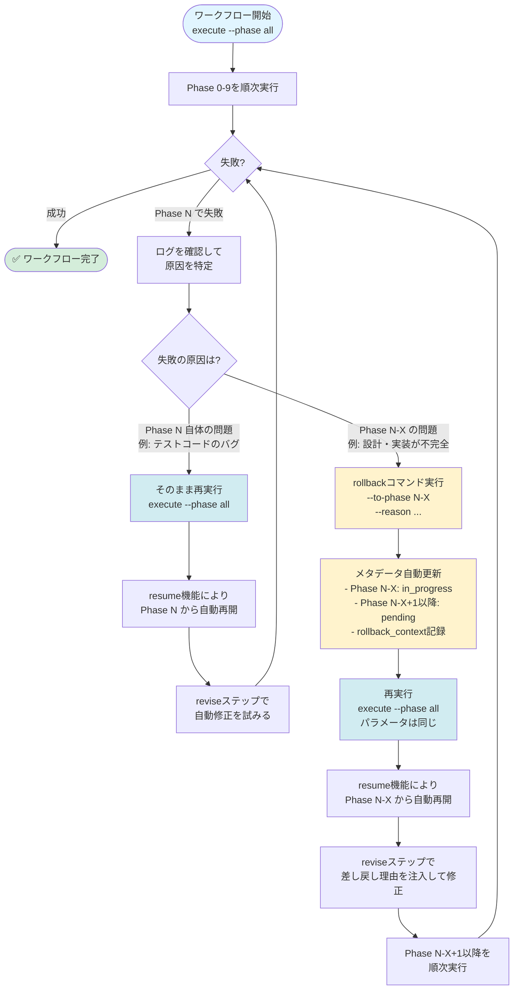
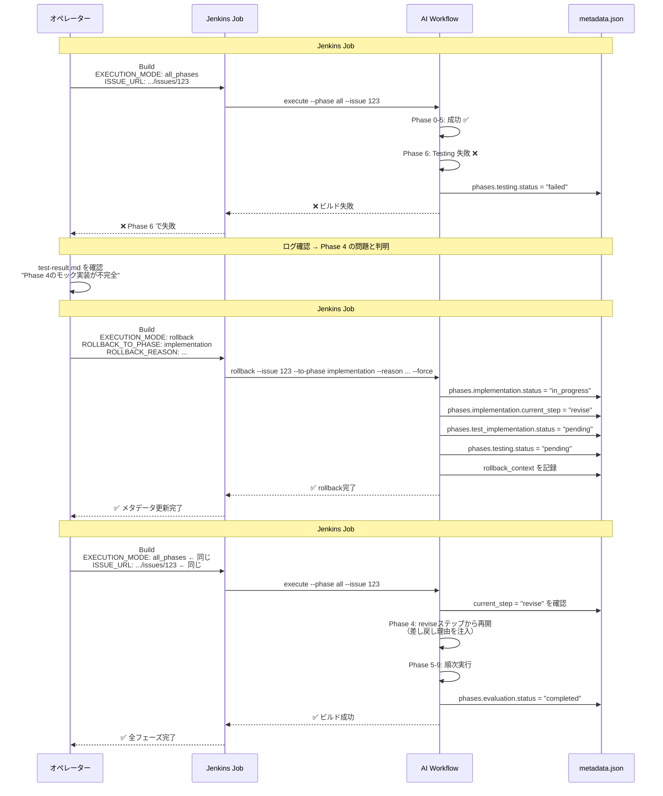

# AI Workflow Agent

TypeScript ベースの AI Workflow 自動化ツールキットです。Codex と Claude Code のデュアルエージェント機能により、GitHub / Jenkins / Pulumi と統合した 10 フェーズの Issue ワークフロー（planning 〜 evaluation）を実行します。

## 特長

- **Codex + Claude のデュアルエージェント** … Codex（`gpt-5.1-codex-max`）で高い推論が必要な編集を担当し、状況に応じて自動で Claude にフォールバックします。
- **決定的なプロンプト管理** … すべてのプロンプトテンプレートは `src/prompts/{phase}` に配置され、ビルド時に `dist` へコピーされます。
- **永続化されたワークフロー状態** … `.ai-workflow/issue-*/metadata.json` へメタデータを保存する `MetadataManager` により、途中再開やコスト集計が可能です。
- **マルチリポジトリ対応** … Issue URL から対象リポジトリを自動判定し、別のリポジトリに対してもワークフローを実行できます（v0.2.0 で追加）。
- **自動PR作成とタイトル最適化** … Issue タイトルをそのまま PR タイトルとして使用し、PR 一覧での可読性を向上（v0.3.0、Issue #73）。
- **GitHub & Jenkins 対応** … 個人アクセストークンと Jenkins Job DSL に対応し、Docker コンテナ内で TypeScript CLI を実行できます。

## リポジトリ構成

```
ai-workflow-agent/
├── Dockerfile                 # Node 20 ベースの Codex 対応イメージ
├── package.json               # CLI エントリーポイント（bin: ai-workflow）
├── scripts/
│   └── copy-static-assets.mjs # prompts/templates を dist/ へコピー
├── src/
│   ├── core/                  # エージェント・Git/GitHub ヘルパー・メタデータ管理
│   ├── phases/                # 各フェーズ実装（planning 〜 evaluation）
│   ├── prompts/               # フェーズ別プロンプト
│   ├── templates/             # PR ボディなどのテンプレート
│   ├── main.ts                # CLI 定義
│   └── index.ts               # bin エントリ
└── dist/                      # `npm run build` 後に生成される JS
```

## 前提条件

- Node.js 20 以上
- npm 10 以上
- Codex API キー（`CODEX_API_KEY` または `OPENAI_API_KEY`）
- Claude Code 認証ファイル（`credentials.json`）
- GitHub パーソナルアクセストークン（`repo`, `workflow`, `read:org`）
- （任意）環境変数 `REPOS_ROOT` … マルチリポジトリ環境でリポジトリの親ディレクトリを指定
- （任意）環境変数 `LOG_LEVEL` … ログレベル制御（`debug` | `info` | `warn` | `error`、デフォルト: `info`）
- （任意）環境変数 `LOG_NO_COLOR` … カラーリング無効化（CI環境用）
- （任意）環境変数 `AGENT_CAN_INSTALL_PACKAGES` … エージェントがパッケージをインストール可能かどうか（Docker環境では `true`、デフォルト: `false`）
- （任意）Docker 24 以上（コンテナ内で実行する場合）

## クイックスタート（ローカル）

```bash
# 依存関係のインストールとビルド
npm install
npm run build

# 環境変数
export CODEX_API_KEY="sk-code..."        # Codex 高推論キー
export CLAUDE_CODE_CREDENTIALS_PATH="$HOME/.claude-code/credentials.json"
export GITHUB_TOKEN="ghp_..."
export GITHUB_REPOSITORY="tielec/ai-workflow-agent"
export REPOS_ROOT="$HOME/projects"       # （任意）リポジトリの親ディレクトリ
export LOG_LEVEL="info"                  # （任意）ログレベル（debug|info|warn|error）
export LOG_NO_COLOR="false"              # （任意）カラーリング無効化（CI環境では "true"）
export AGENT_CAN_INSTALL_PACKAGES="false"  # （任意）パッケージインストール許可（Docker内部では "true"）
export AI_WORKFLOW_SQUASH_ON_COMPLETE="false"  # （任意）スカッシュ機能のデフォルト動作

# Issue URL からワークフローを初期化
node dist/index.js init \
  --issue-url https://github.com/tielec/ai-workflow-agent/issues/1

# 全フェーズ実行
node dist/index.js execute --phase all --issue 1

# 失敗したフェーズのみ再実行
node dist/index.js execute --phase requirements --issue 1 --agent codex

# マルチリポジトリの例: 別リポジトリのIssueに対してワークフローを実行
node dist/index.js init \
  --issue-url https://github.com/owner/my-app/issues/123
node dist/index.js execute --phase all --issue 123
```

## CLI オプション

```bash
ai-workflow init \
  --issue-url <URL> \
  [--branch <name>] \
  [--auto-model-selection]

ai-workflow execute \
  --issue <number> \
  [--phase <name>|--phase all] \
  [--agent auto|codex|claude] \
  [--preset <name>] \
  [--force-reset] \
  [--skip-dependency-check|--ignore-dependencies] \
  [--cleanup-on-complete] \
  [--cleanup-on-complete-force] \
  [--squash-on-complete] \
  [--no-squash-on-complete] \
  [--codex-model <model>] \
  [--claude-model <model>] \
  [--requirements-doc <path>] [...] \
  [--git-user <name>] [--git-email <email>] \
  [--followup-llm-mode auto|openai|claude|off] \
  [--followup-llm-model <model>] \
  [--followup-llm-timeout <ms>] \
  [--followup-llm-max-retries <count>] \
  [--followup-llm-append-metadata]

ai-workflow execute \
  --list-presets

ai-workflow auto-issue \
  [--category bug|refactor|enhancement|all] \
  [--limit <number>] \
  [--dry-run] \
  [--similarity-threshold <0.0-1.0>] \
  [--agent auto|codex|claude] \
  [--creative-mode] \
  [--output-file <path>]

ai-workflow review \
  --phase <name> \
  --issue <number>

ai-workflow migrate \
  --sanitize-tokens \
  [--dry-run] \
  [--issue <number>] \
  [--repo <path>]

ai-workflow rollback \
  --issue <number> \
  --to-phase <phase> \
  --reason <text> | --reason-file <path> | --interactive \
  [--to-step <step>] \
  [--from-phase <phase>] \
  [--force] \
  [--dry-run]

ai-workflow rollback-auto \
  --issue <number> \
  [--dry-run] \
  [--force] \
  [--agent auto|codex|claude]

ai-workflow cleanup \
  --issue <number> \
  [--dry-run] \
  [--phases <range>] \
  [--all]

ai-workflow finalize \
  --issue <number> \
  [--dry-run] \
  [--skip-squash] \
  [--skip-pr-update] \
  [--base-branch <branch>]
```

### ブランチ名のカスタマイズ

`init` コマンドで `--branch` オプションを使用すると、カスタムブランチ名でワークフローを開始できます（v0.2.0 で追加）：

```bash
# カスタムブランチ名を指定
node dist/index.js init \
  --issue-url https://github.com/tielec/ai-workflow-agent/issues/1 \
  --branch feature/add-logging

# 既存ブランチでワークフローを開始
node dist/index.js init \
  --issue-url https://github.com/tielec/ai-workflow-agent/issues/1 \
  --branch feature/existing-work

# デフォルト（未指定時は ai-workflow/issue-{issue_number}）
node dist/index.js init \
  --issue-url https://github.com/tielec/ai-workflow-agent/issues/1
```

**ブランチ名のバリデーション**:

Git 命名規則に従わないブランチ名はエラーになります：
- 空白を含まない
- `..`（連続ドット）を含まない
- 不正文字（`~`, `^`, `:`, `?`, `*`, `[`, `\`, `@{`）を含まない
- `/` で始まらない、終わらない
- `.` で終わらない

### エージェントモード

- `auto`（既定）: Codex API キーがあれば Codex を使用し、なければ Claude にフォールバックします。
- `codex`: Codex のみを使用（デフォルト: `gpt-5.1-codex-max`）。Claude 認証情報は無視されます。`--codex-model` オプションでモデル変更可能。
- `claude`: Claude Code を強制使用。`CLAUDE_CODE_CREDENTIALS_PATH` が必須です。

### モデル自動選択機能（Issue #363で追加）

`--auto-model-selection` オプションを `init` コマンドで指定すると、Issueの難易度に基づいて各フェーズ・ステップで使用するモデルを自動的に最適化します。

```bash
# 難易度分析を有効にしてワークフローを初期化
node dist/index.js init \
  --issue-url https://github.com/owner/repo/issues/123 \
  --auto-model-selection

# 通常通りワークフローを実行（モデルが自動選択される）
node dist/index.js execute --phase all --issue 123
```

**難易度分析**:

Issue情報（タイトル、本文、ラベル）をLLMで分析し、3段階の難易度を判定します:

| 難易度 | 説明 | 例 |
|--------|------|-----|
| `simple` | 軽微な修正、タイポ修正、小さなバグ修正 | ドキュメント更新、定数値の変更 |
| `moderate` | 中程度の複雑さ、既存機能の拡張 | 新規オプション追加、軽微なリファクタリング |
| `complex` | 大規模な変更、新機能、アーキテクチャ変更 | 新規モジュール追加、複雑なバグ修正 |

**モデルマッピング**:

難易度とフェーズに応じて、各ステップで使用するモデルが自動的に選択されます:

- `simple`: 全フェーズで execute/review/revise ともに Sonnet / Mini
- `moderate`:
  - planning / requirements / design / test_scenario / evaluation: execute=Opus/Max, review=Sonnet/Mini, revise=Sonnet/Mini
  - implementation / test_implementation / testing: execute=Opus/Max, review=Sonnet/Mini, revise=Opus/Max
  - documentation / report: execute/review/revise ともに Sonnet/Mini
- `complex`: 全フェーズで execute/revise が Opus/Max、review が Sonnet/Mini

**重要**: `review` ステップは難易度に関係なく常に軽量モデル（Sonnet/Mini）を使用します。これはレビュー処理が比較的単純であり、コスト最適化のためです。

**優先順位**:

モデル選択の優先順位は以下の通りです（上が優先）:

1. CLI オプション（`--codex-model`、`--claude-model`）
2. 環境変数（`CODEX_MODEL`、`CLAUDE_MODEL`）
3. metadata.json に保存された `model_config`（`--auto-model-selection` で生成）
4. デフォルトマッピング

※ `review` ステップは上記の優先順位に関係なく軽量モデル固定です（オーバーライドを指定しても review には適用されません）。

**後方互換性**:

`--auto-model-selection` を指定しない場合、従来通りすべてのステップで高品質モデル（Opus/Max）が使用されます。

**metadata.json への保存**:

難易度分析結果と生成されたモデル設定は `metadata.json` に保存され、execute コマンド実行時に参照されます:

```json
{
  "difficulty_analysis": {
    "level": "moderate",
    "confidence": 0.85,
    "factors": {
      "estimated_file_changes": 6,
      "scope": "single_module",
      "requires_tests": true,
      "requires_architecture_change": false,
      "complexity_score": 0.62
    },
    "analyzed_at": "2025-01-20T10:30:00Z",
    "analyzer_agent": "claude",
    "analyzer_model": "sonnet"
  },
  "model_config": {
    "planning": {
      "execute": { "claudeModel": "opus", "codexModel": "max" },
      "review": { "claudeModel": "sonnet", "codexModel": "mini" },
      "revise": { "claudeModel": "sonnet", "codexModel": "mini" }
    },
    "implementation": {
      "execute": { "claudeModel": "opus", "codexModel": "max" },
      "review": { "claudeModel": "sonnet", "codexModel": "mini" },
      "revise": { "claudeModel": "opus", "codexModel": "max" }
    }
  }
}
```

### Codex モデル選択（Issue #302で追加）

Codex エージェントのモデルを CLI オプションまたは環境変数で指定できます。

```bash
# デフォルト（gpt-5.1-codex-max）を使用
node dist/index.js execute --issue 123 --phase all

# エイリアスでモデルを指定
node dist/index.js execute --issue 123 --phase all --codex-model mini

# フルモデルIDで指定
node dist/index.js execute --issue 123 --phase all --codex-model gpt-5.1-codex-max

# 環境変数でデフォルト動作を設定
export CODEX_MODEL=mini
node dist/index.js execute --issue 123 --phase all
```

**モデルエイリアス**:

| エイリアス | 実際のモデルID | 説明 |
|-----------|---------------|------|
| `max` | `gpt-5.1-codex-max` | **デフォルト**。長時間エージェントタスク向け |
| `mini` | `gpt-5.1-codex-mini` | 軽量・経済的 |
| `5.1` | `gpt-5.1` | 汎用モデル |
| `legacy` | `gpt-5-codex` | レガシー（後方互換性） |

**優先順位**: CLI オプション `--codex-model` > 環境変数 `CODEX_MODEL` > デフォルト値 `gpt-5.1-codex-max`

### プリセット

プリセットは、よくある開発パターンに合わせて複数のフェーズを組み合わせたショートカットです。各プリセットはオプショナルコンテキスト構築機能により、前段フェーズの成果物が存在しない場合でも柔軟に実行できます。

**利用可能なプリセット一覧**:

```bash
# プリセット一覧を表示
ai-workflow execute --list-presets
```

| プリセット名 | 含まれるフェーズ | 用途 |
|------------|----------------|------|
| `review-requirements` | Planning + Requirements | 要件定義のレビュー用 |
| `review-design` | Planning + Requirements + Design | 設計のレビュー用 |
| `review-test-scenario` | Planning + Requirements + Design + TestScenario | テストシナリオのレビュー用 |
| `quick-fix` | Implementation + Documentation + Report | 軽微な修正（タイポ、小さなバグ修正）<br>※ `--ignore-dependencies` との併用を推奨 |
| `implementation` | Implementation + TestImplementation + Testing + Documentation + Report | 通常の実装フロー |
| `testing` | TestImplementation + Testing | 既存実装へのテスト追加 |
| `finalize` | Documentation + Report + Evaluation | 実装完了後の最終化 |

**使用例**:

```bash
# 軽微な修正を実装からレポートまで一括実行（依存関係を無視）
ai-workflow execute --issue 1 --preset quick-fix --ignore-dependencies

# 要件定義とPlanningのみ実行してレビューを受ける
ai-workflow execute --issue 2 --preset review-requirements
```

**プリセット vs `--phase` の使い分け**:

- **プリセット**: 頻繁に使用するフェーズの組み合わせ（推奨）
- **`--phase all`**: 全フェーズを実行（新規Issue、初回実行時）
- **`--phase <name>`**: 単一フェーズ実行、またはプリセットでカバーされないパターン

**後方互換性**:

旧プリセット名も6ヶ月間サポートされますが、新しい名前への移行を推奨します:

- `requirements-only` → `review-requirements`
- `design-phase` → `review-design`
- `implementation-phase` → `implementation`
- `full-workflow` → `--phase all`

### コミットスカッシュ

ワークフロー完了後、すべてのコミットを1つにまとめてAI生成のコミットメッセージを付与できます（Issue #194で追加）：

```bash
# 全フェーズ実行後に自動スカッシュ
ai-workflow execute --issue 385 --phase all --squash-on-complete

# 環境変数でデフォルト動作を設定
export AI_WORKFLOW_SQUASH_ON_COMPLETE=true
ai-workflow execute --issue 385 --phase all

# 明示的に無効化
ai-workflow execute --issue 385 --phase all --no-squash-on-complete
```

**動作要件**:
- `evaluation` フェーズが含まれる場合のみ実行
- ワークフロー開始時（`init`コマンド実行時）に `base_commit` が記録されている
- main/master ブランチでは実行不可（ブランチ保護）

**スカッシュの流れ**:
1. ワークフロー完了後、`base_commit` から `HEAD` までのコミット範囲を取得
2. エージェント（Codex / Claude）がコミット履歴とdiff統計を分析
3. Conventional Commits形式のコミットメッセージを自動生成
4. `git reset --soft base_commit` でコミットをスカッシュ
5. 生成されたメッセージで新しいコミットを作成
6. `git push --force-with-lease` で安全に強制プッシュ

**安全機能**:
- ブランチ保護（main/master への強制プッシュを防止）
- `--force-with-lease` による安全な強制プッシュ（他の変更を上書きしない）
  - リモートブランチが先に進んでいる場合は push が自動的に拒否される
  - non-fast-forwardエラー時にpullを実行しない（スカッシュ後の履歴を保持）
- `pre_squash_commits` メタデータによるロールバック可能性
- スカッシュ失敗時もワークフロー全体は成功として扱う（警告ログのみ）

### フォローアップIssue生成オプション（v0.4.0、Issue #119で追加）

フォローアップIssue生成時にLLM (OpenAI/Anthropic) を利用してタイトルと本文の品質を向上できます。LLM失敗時は既存テンプレートへ自動的にフォールバックします。

- `--followup-llm-mode <mode>` … LLMモード選択（`auto`（既定）、`openai`、`claude`、`off`）
- `--followup-llm-model <model>` … モデル指定（例: `gpt-4o-mini`、`claude-3-sonnet-20240229`）
- `--followup-llm-timeout <ms>` … タイムアウト時間（ミリ秒、既定: 25000）
- `--followup-llm-max-retries <count>` … 最大リトライ回数（既定: 3）
- `--followup-llm-append-metadata` … 生成メタデータをIssue本文に追記

**環境変数**:
- `FOLLOWUP_LLM_MODE` … LLMモード（`auto` | `openai` | `claude` | `off`）
- `FOLLOWUP_LLM_MODEL` … モデル名
- `FOLLOWUP_LLM_TIMEOUT_MS` … タイムアウト（ミリ秒）
- `FOLLOWUP_LLM_MAX_RETRIES` … 最大リトライ回数
- `FOLLOWUP_LLM_APPEND_METADATA` … メタデータ追記フラグ（`true` | `false`）
- `OPENAI_API_KEY` … OpenAI APIキー（`openai` モード使用時）
- `ANTHROPIC_API_KEY` … Anthropic APIキー（`claude` モード使用時）

**使用例**:
```bash
# OpenAIで生成（メタデータ追記あり）
node dist/index.js execute --issue 123 --phase evaluation \
  --followup-llm-mode openai --followup-llm-model gpt-4o-mini \
  --followup-llm-append-metadata

# Anthropicで生成（タイムアウト短縮）
node dist/index.js execute --issue 123 --phase evaluation \
  --followup-llm-mode claude --followup-llm-model claude-3-sonnet-20240229 \
  --followup-llm-timeout 20000

# LLM無効化（既存テンプレートを使用）
node dist/index.js execute --issue 123 --phase evaluation --followup-llm-mode off
```

**注意**: デフォルトは無効（`enabled=false`）です。CLIオプションまたは環境変数で明示的に有効化してください。

### 依存関係チェックのフラグ

- `--skip-dependency-check` … すべてのフェーズ依存関係チェックを無効化します（慎重に使用）。
- `--ignore-dependencies` … 依存関係の警告を表示しつつ処理を続行します。

### マイグレーションコマンド

`migrate` コマンドは、既存の `.ai-workflow/issue-*/metadata.json` に含まれるPersonal Access Tokenを検出・除去します（v0.3.1で追加）：

```bash
# 基本的な使用方法
ai-workflow migrate --sanitize-tokens

# ドライラン（ファイルを変更せず、検出のみ）
ai-workflow migrate --sanitize-tokens --dry-run

# 特定のIssueのみ対象
ai-workflow migrate --sanitize-tokens --issue 123

# 対象リポジトリを指定
ai-workflow migrate --sanitize-tokens --repo /path/to/repo
```

**主な機能**:
- **トークン検出**: メタデータの `target_repository.remote_url` フィールドをスキャン
- **自動サニタイズ**: HTTPS形式のURLからトークンを除去（SSH形式は変更なし）
- **バックアップ作成**: 変更前に `.bak` ファイルを作成
- **ドライランモード**: `--dry-run` でファイルを変更せず検出のみ実行

**注意**: v0.3.1以降、`init` コマンド実行時に自動的にトークンが除去されるため、新規ワークフローでは不要です。既存ワークフロー（v0.3.1より前に作成）のメタデータ修正に使用してください。

### Rollbackコマンド（フェーズ差し戻し）

`rollback` コマンドは、ワークフローを前のフェーズに差し戻し、修正作業を行うための機能です（v0.4.0、Issue #90で追加）。レビューで問題が発見された場合や、実装方針の変更が必要な場合に使用します。

```bash
# 基本的な使用方法（直接理由を指定）
ai-workflow rollback \
  --issue 123 \
  --to-phase implementation \
  --reason "テストでバグが発見されたため、実装を修正する必要があります"

# ファイルから差し戻し理由を読み込む
ai-workflow rollback \
  --issue 123 \
  --to-phase design \
  --reason-file /path/to/reason.md

# インタラクティブモード（標準入力から理由を入力）
ai-workflow rollback \
  --issue 123 \
  --to-phase requirements \
  --interactive

# 特定のステップへの差し戻し（revise ステップから再開）
ai-workflow rollback \
  --issue 123 \
  --to-phase implementation \
  --to-step revise \
  --reason "レビューコメントの修正が必要"

# ドライラン（実際には差し戻さず、変更内容のみ確認）
ai-workflow rollback \
  --issue 123 \
  --to-phase implementation \
  --reason "テスト用" \
  --dry-run
```

**主な機能**:

- **差し戻し理由の記録**: `--reason`、`--reason-file`、`--interactive` の3つの入力方法をサポート
- **メタデータ自動更新**: 差し戻し先フェーズを `in_progress` に、後続フェーズを `pending` にリセット
- **差し戻し履歴の記録**: `metadata.json` の `rollback_history` 配列に履歴を保存
- **プロンプト自動注入**: 差し戻し先フェーズの `revise` ステップで差し戻し理由が自動的にプロンプトに注入される
- **ROLLBACK_REASON.md生成**: 差し戻し理由を記録したMarkdownファイルを自動生成

**オプション**:

- `--issue <number>`: 対象のIssue番号（必須）
- `--to-phase <phase>`: 差し戻し先のフェーズ名（必須）
  - 有効なフェーズ: `planning`, `requirements`, `design`, `test-scenario`, `implementation`, `test-implementation`, `testing`, `documentation`, `report`, `evaluation`
- `--reason <text>`: 差し戻し理由を直接指定（最大1000文字）
- `--reason-file <path>`: 差し戻し理由が記載されたファイルパス（最大100KB）
- `--interactive`: 標準入力から差し戻し理由を読み込む（EOF（Ctrl+D）で終了）
- `--to-step <step>`: 差し戻し先のステップ（`execute` | `review` | `revise`、デフォルト: `revise`）
- `--from-phase <phase>`: 差し戻し元のフェーズ（省略時は現在の最新完了フェーズ）
- `--force`: 確認プロンプトをスキップ
- `--dry-run`: 実際には差し戻さず、変更内容のみを表示

**使用例**:

```bash
# ケース1: Phase 6（Testing）でバグ発見 → Phase 4（Implementation）に差し戻し
ai-workflow rollback \
  --issue 90 \
  --to-phase implementation \
  --reason "テスト実行時にNullPointerExceptionが発生。エラーハンドリングの追加が必要。"

# ケース2: Phase 5（Test Implementation）でテスト設計の見直しが必要 → Phase 3（Test Scenario）に差し戻し
ai-workflow rollback \
  --issue 90 \
  --to-phase test-scenario \
  --reason-file review-comments.md \
  --to-step execute

# ケース3: 長文の差し戻し理由をインタラクティブに入力
ai-workflow rollback --issue 90 --to-phase design --interactive
# （標準入力から複数行の理由を入力し、Ctrl+Dで終了）

# ケース4: 差し戻し前に変更内容を確認（ドライラン）
ai-workflow rollback \
  --issue 90 \
  --to-phase implementation \
  --reason "テスト用" \
  --dry-run
```

**注意事項**:

- 差し戻し先フェーズは少なくとも一度実行済み（`completed` または `in_progress`）である必要があります
- `--reason`、`--reason-file`、`--interactive` のいずれか1つが必須です
- 差し戻しを実行すると、後続フェーズのステータスはすべて `pending` にリセットされます
- 差し戻し理由は `ROLLBACK_REASON.md` として `.ai-workflow/issue-<NUM>/<PHASE>/` ディレクトリに保存されます
- 差し戻し後、次回の `execute` コマンドで差し戻し先フェーズの指定ステップから自動的に再開されます

#### Rollback Auto モード（AI エージェントによる自動差し戻し判定）

`rollback-auto` コマンドは、AI エージェント（Codex/Claude）がワークフロー状態を自動分析し、差し戻しが必要かどうかを判定する機能です（v0.4.0、Issue #271で追加）。テスト失敗やレビュー結果を自動的に分析し、差し戻しが必要な場合は適切なフェーズとステップを提案します。

```bash
# 基本的な使用方法（auto モード）
ai-workflow rollback-auto --issue 123

# プレビューモード（差し戻し判定のみ、実際には実行しない）
ai-workflow rollback-auto --issue 123 --dry-run

# 高信頼度判定時は確認をスキップ
ai-workflow rollback-auto --issue 123 --force

# 使用するエージェントを指定
ai-workflow rollback-auto --issue 123 --agent codex
ai-workflow rollback-auto --issue 123 --agent claude
```

**主な機能**:

- **自動状態分析**: `metadata.json`、review results、test results を自動収集して分析
- **AI エージェントによる判定**:
  - 差し戻しが必要かどうかを判定（`needs_rollback: true/false`）
  - 差し戻しが必要な場合、適切な差し戻し先フェーズとステップを提案
  - 判定理由と分析結果を詳細に説明
  - 判定の信頼度（`high` / `medium` / `low`）を提供
- **信頼度ベースの確認**:
  - `confidence: high` かつ `--force` 指定時: 確認プロンプトをスキップして自動実行
  - `confidence: medium/low`: 常に確認プロンプトを表示（安全性重視）
- **既存 rollback との統合**: 差し戻し実行時は既存の `executeRollback()` を再利用

**オプション**:

- `--issue <number>`: 対象のIssue番号（必須）
- `--dry-run`: プレビューモード（差し戻し判定のみ、実際には実行しない）
- `--force`: 高信頼度判定時は確認をスキップ（`confidence: high` の場合のみ有効）
- `--agent <mode>`: 使用するエージェント（`auto` | `codex` | `claude`、デフォルト: `auto`）
  - `auto`: Codex API キーがあれば Codex、なければ Claude にフォールバック
  - `codex`: Codex のみ使用
  - `claude`: Claude Code 強制使用

**使用例**:

```bash
# ケース1: テスト失敗後に自動判定（プレビューモード）
ai-workflow rollback-auto --issue 271 --dry-run
# → エージェントが test-result.md を分析
# → 差し戻しが必要かどうか判定
# → 必要な場合、差し戻し先フェーズとステップを提案
# → 実際には差し戻さない（プレビューのみ）

# ケース2: 本番実行（確認あり）
ai-workflow rollback-auto --issue 271
# → エージェントが判定
# → confidence が medium/low の場合、確認プロンプトを表示
# → Y/N で差し戻しを実行

# ケース3: 高信頼度判定時は自動実行
ai-workflow rollback-auto --issue 271 --force
# → エージェントが判定
# → confidence: high の場合、確認なしで自動実行
# → confidence: medium/low の場合、確認プロンプトを表示（安全性重視）

# ケース4: Codex で高精度判定
ai-workflow rollback-auto --issue 271 --agent codex
# → Codex エージェントで高精度な分析を実施
```

**エージェント判定の例**:

```json
{
  "needs_rollback": true,
  "to_phase": "implementation",
  "to_step": "revise",
  "reason": "Testing Phase で 11 個のテスト失敗。PhaseRunner のモック実装が不完全。",
  "confidence": "high",
  "analysis": "test-result.md を分析した結果、validatePhaseDependencies の修正が必要と判断しました。Phase 4 (Implementation) の revise ステップから再開することを推奨します。"
}
```

**差し戻しが必要と判定されるケース**:

- **テスト失敗**: 複数のテストが失敗し、前のフェーズの実装に問題がある
- **レビュー BLOCKER**: レビューで BLOCKER レベルの問題が発見され、設計・実装の修正が必要
- **アーキテクチャ問題**: 設計の根本的な問題が発見され、前のフェーズに戻る必要がある

**差し戻しが不要と判定されるケース**:

- **軽微なバグ**: 現在のフェーズの revise ステップで修正可能
- **コード品質の問題**: リファクタリングで対応可能
- **ドキュメント不足**: ドキュメント追加のみで対応可能

**注意事項**:

- エージェントの判定は参考情報であり、最終的な判断はユーザーが行います
- `--force` オプションは `confidence: high` の場合のみ確認をスキップします
- `--dry-run` での事前確認を推奨します
- 差し戻し実行後は、通常の rollback と同様に `rollback_history` に記録されます（`mode: "auto"` として記録）

### Cleanupコマンド（ワークフローログの手動クリーンアップ）

`cleanup` コマンドは、ワークフローログ（`execute/`、`review/`、`revise/` ディレクトリ）を手動でクリーンアップし、リポジトリサイズを削減する機能です（v0.4.0、Issue #212で追加）。Report Phase（Phase 8）で自動実行されるクリーンアップを手動で制御したい場合や、特定のフェーズのみをクリーンアップしたい場合に使用します。

```bash
# 基本的な使用方法（Phase 0-8のログをクリーンアップ）
ai-workflow cleanup --issue 123

# プレビューモード（削除対象のみ表示、実際には削除しない）
ai-workflow cleanup --issue 123 --dry-run

# 特定のフェーズ範囲をクリーンアップ（数値範囲）
ai-workflow cleanup --issue 123 --phases 0-4

# 特定のフェーズ範囲をクリーンアップ（フェーズ名リスト）
ai-workflow cleanup --issue 123 --phases planning,requirements,design

# 完全クリーンアップ（Phase 0-9すべて、Evaluation Phase完了後のみ）
ai-workflow cleanup --issue 123 --all
```

**主な機能**:

- **通常クリーンアップ**（デフォルト）: Phase 0-8のワークフローログを削除
- **部分クリーンアップ**（`--phases`）: 指定したフェーズ範囲のみを削除
- **完全クリーンアップ**（`--all`）: Phase 0-9すべてのログを削除（Evaluation Phase完了後のみ可能）
- **プレビューモード**（`--dry-run`）: 削除対象を確認してから実行可能
- **Git 自動コミット**: クリーンアップ後に変更を自動コミット＆プッシュ

**削除対象**:
- 各フェーズディレクトリ内の `execute/`、`review/`、`revise/` ディレクトリ
- これらのディレクトリに含まれるすべてのファイル（プロンプトファイル、エージェント出力等）

**保持対象**:
- `metadata.json`（ワークフロー状態の管理ファイル）
- `output/*.md`（Planning Phase の `planning.md`、各フェーズの成果物ドキュメント）

**オプション**:

- `--issue <number>`: 対象のIssue番号（必須）
- `--dry-run`: プレビューモード（削除対象のみ表示、実際には削除しない）
- `--phases <range>`: クリーンアップするフェーズ範囲
  - 数値範囲: `0-4`、`5-7`
  - フェーズ名リスト（カンマ区切り）: `planning,requirements,design`
  - 有効なフェーズ名: `planning`, `requirements`, `design`, `test-scenario`, `implementation`, `test-implementation`, `testing`, `documentation`, `report`, `evaluation`
- `--all`: 完全クリーンアップ（Phase 0-9すべて）
  - Evaluation Phase（Phase 9）が `completed` 状態の場合のみ実行可能
  - 他のフェーズと組み合わせ不可

**使用例**:

```bash
# ケース1: 実行前に削除対象を確認（プレビューモード）
ai-workflow cleanup --issue 212 --dry-run
# → Phase 0-8 の execute/, review/, revise/ ディレクトリを表示（削除しない）

# ケース2: Phase 0-8 のログをクリーンアップ
ai-workflow cleanup --issue 212
# → 約75%のリポジトリサイズ削減
# → 自動的にGitコミット＆プッシュ

# ケース3: Planning と Requirements のみクリーンアップ
ai-workflow cleanup --issue 212 --phases planning,requirements
# → Phase 0-1 のログのみ削除

# ケース4: Phase 0-4 のログをクリーンアップ
ai-workflow cleanup --issue 212 --phases 0-4
# → Planning ～ Implementation のログを削除

# ケース5: Evaluation Phase 完了後に完全クリーンアップ
ai-workflow cleanup --issue 212 --all
# → Phase 0-9 すべてのログを削除（--allは Evaluation 完了後のみ可能）

# ケース6: 完全クリーンアップ前にプレビュー
ai-workflow cleanup --issue 212 --all --dry-run
# → Phase 0-9 の削除対象をプレビュー表示
```

**クリーンアップモードの比較**:

| モード | オプション | 削除対象 | 実行可能タイミング | リポジトリサイズ削減効果 |
|--------|----------|---------|------------------|---------------------|
| **通常** | なし | Phase 0-8 | いつでも | 約75% |
| **部分** | `--phases 0-4` | 指定範囲のみ | いつでも | 範囲に応じて |
| **完全** | `--all` | Phase 0-9 | Evaluation完了後 | 約75%（Phase 9を含む） |

**エラー処理**:

- **Phase範囲が不正**: `Error: Invalid phase range format. Use numeric ranges (0-4) or phase name lists (planning,requirements).`
- **Evaluation未完了で--all使用**: `Error: Cannot use --all option. Evaluation phase is not completed yet.`
- **--allと--phasesの併用**: `Error: Cannot specify both --phases and --all options.`
- **削除対象なし**: `No directories to clean up. All specified phases may already be cleaned.`

**注意事項**:

- クリーンアップは **非破壊的** に動作します（`metadata.json` と `output/*.md` は保持）
- **成果物ドキュメント**（`planning.md`、`requirements.md` 等）は削除されません
- クリーンアップ後も **フェーズの再実行は可能** です（メタデータが保持されているため）
- **PRレビュー前** に実行することで、レビュー対象を成果物に集中できます
- **`--dry-run`** での事前確認を推奨します
- Report Phase（Phase 8）では **自動的にクリーンアップが実行** されます（`cleanup` コマンド不要）

### Rollback機能の運用フロー

rollback機能を使用する場合の典型的なオペレーションフローを説明します。

#### フローチャート



#### パターン1: 自動修正可能な失敗（rollback不要）

フェーズ自体の問題で失敗した場合、`rollback`コマンドは不要です。そのまま再実行すれば、自動的にreviseステップで修正が試みられます。

```bash
# 1. 初回実行
ai-workflow execute --phase all --issue 123

# → Phase 6 (Testing) で失敗
# → reviseステップで3回自動修正を試みるが、すべて失敗
# → phases.testing.status = "failed" が記録される

# 2. そのまま再実行（rollbackなし）
ai-workflow execute --phase all --issue 123

# → resume機能により Phase 6 から自動的に再開
# → reviseステップで再度修正を試みる
# → 成功すれば Phase 7-9 を継続実行
```

**この場合、rollbackは不要です。** `--phase all` のまま再実行するだけでOKです。

#### パターン2: 前のフェーズに問題がある場合（rollback必要）

前のフェーズの設計・実装に問題があり、現在のフェーズでは修正できない場合、rollbackコマンドを使用します。

```bash
# 1. 初回実行
ai-workflow execute --phase all --issue 123

# → Phase 0-5: 成功
# → Phase 6 (Testing): 失敗
#    理由: "Phase 4のテストコード実装が不完全"と判明
#    （reviseで3回修正を試みるが、Phase 6では解決できない）

# 2. ログを確認して原因を特定
cat .ai-workflow/issue-123/06_testing/output/test-result.md
# → "Phase 4 (Implementation)のモック実装が不完全"と判明

# 3. rollbackコマンドで Phase 4 に差し戻し
ai-workflow rollback \
  --issue 123 \
  --to-phase implementation \
  --reason "Testing Phaseで11個のテスト失敗。PhaseRunnerのモック実装が不完全。validatePhaseDependenciesの修正が必要"

# → メタデータ自動更新:
#    - phases.implementation.status = "in_progress"
#    - phases.implementation.current_step = "revise"
#    - phases.test_implementation.status = "pending" (リセット)
#    - phases.testing.status = "pending" (リセット)
#    - rollback_context に差し戻し理由を記録
#    - ROLLBACK_REASON.md を生成

# 4. 再実行（rollback後も --phase all のまま）
ai-workflow execute --phase all --issue 123

# → resume機能により Phase 4 から自動的に再開
# → Phase 4 の revise ステップから開始
#    （差し戻し理由が自動的にプロンプトに注入される）
# → AIエージェントがテストコードを修正
# → Phase 5-9 を順次実行
# → 成功
```

**重要**: rollback後も `--phase all` のまま再実行してください。`--phase implementation` に変更する必要はありません。resume機能により自動的に正しいフェーズから再開されます。

#### パターン3: Jenkins での運用フロー

Jenkinsでも同様のフローになります。



**Jenkinsでの設定例**:

```bash
# 1. Jenkins Job #1: 初回実行
EXECUTION_MODE: all_phases
ISSUE_URL: https://github.com/owner/repo/issues/123
# → Phase 6 で失敗

# 2. ログ確認 → Phase 4 の問題と判明

# 3. Jenkins Job #2: rollback実行
EXECUTION_MODE: rollback
ROLLBACK_TO_PHASE: implementation
ROLLBACK_REASON: "Testing Phaseで失敗。PhaseRunnerのモック実装が不完全"
# → メタデータ更新

# 4. Jenkins Job #3: 再実行（パラメータは最初と同じ）
EXECUTION_MODE: all_phases  ← rollback前と同じ
ISSUE_URL: https://github.com/owner/repo/issues/123
# → Phase 4 から自動的に再開
# → 成功
```

**Jenkinsでの注意点**:
- rollback後は **EXECUTION_MODEを `all_phases` または `preset` に戻す**
- `single_phase` モードは使用しない（自動的に後続フェーズが実行されない）
- CI環境では `--force` フラグが自動的に付与されるため、確認プロンプトは表示されません

#### パターン4: 差し戻し理由の伝達

rollbackで記録された差し戻し理由は、次回実行時に自動的にAIエージェントに伝達されます。

```markdown
# Phase 4 (Implementation) - Revise プロンプト

## ⚠️ 前のフェーズから差し戻されました

**差し戻し元**: testing (Phase 6)
**差し戻し日時**: 2025-01-30 14:00:00
**差し戻し理由**:
Testing Phaseで11個のテスト失敗。
PhaseRunnerのモック実装が不完全。
validatePhaseDependenciesの修正が必要。

---

## 修正指示

上記の差し戻し理由を踏まえて、実装を修正してください。

（以下、通常のreviseプロンプトが続く）
```

これにより、AIエージェントは問題の本質を理解して適切な修正を実施できます。

#### まとめ: rollback vs 通常のresume


| 状況 | 使用コマンド | 次の実行 | resume開始フェーズ |
|------|------------|----------|------------------|
| **Phase N 自体の問題**<br/>（例: Testing失敗、テストコードのバグ） | なし（そのまま再実行） | `--phase all` で再実行 | Phase N |
| **Phase N-X の問題**<br/>（例: Testing失敗、Implementationのモック不完全） | `rollback --to-phase N-X` | `--phase all` で再実行 | Phase N-X |

**重要なポイント**:
- ✅ rollback後も `--phase all` で実行する（`--phase <name>` に変更しない）
- ✅ resume機能は自動的に働くので、メタデータさえ正しければ正しいフェーズから再開される
- ✅ rollbackはメタデータを更新するだけなので、実行モードは変更不要
- ✅ Jenkinsでも同じ（EXECUTION_MODEは `all_phases` または `preset` のまま）

### auto-issueコマンド（自動バグ・リファクタリング検出＆Issue生成）

`auto-issue` コマンドは、リポジトリのコードベースを自動分析してバグやリファクタリング機会を検出し、重複を除外した上でGitHub Issueを自動生成する機能です（v0.5.0、Issue #126でバグ検出機能追加、Issue #127でリファクタリング検出機能追加）。

```bash
# 基本的な使用方法（バグ検出とIssue生成）
ai-workflow auto-issue

# リファクタリング機会を検出してIssue生成
ai-workflow auto-issue --category refactor

# 機能拡張提案を検出してIssue生成
ai-workflow auto-issue --category enhancement

# 創造的な機能拡張提案を検出してIssue生成
ai-workflow auto-issue --category enhancement --creative-mode

# プレビューモード（Issue生成せず、検出結果のみ表示）
ai-workflow auto-issue --dry-run

# 検出数を制限（最大5件のIssueを生成）
ai-workflow auto-issue --limit 5

# 類似度閾値を調整（より厳格な重複判定、バグ検出時のみ有効）
ai-workflow auto-issue --similarity-threshold 0.85

# 使用するエージェントを指定
ai-workflow auto-issue --agent codex

# すべてのオプションを組み合わせ
ai-workflow auto-issue \
  --category bug \
  --limit 10 \
  --dry-run \
  --similarity-threshold 0.8 \
  --agent auto

# 実行結果をJSONファイルに出力（Jenkins CI連携用）
ai-workflow auto-issue \
  --category bug \
  --limit 5 \
  --output-file auto-issue-results.json
```

**主な機能**:

1. **リポジトリ分析（RepositoryAnalyzer）**:
   - コードベース全体を自動分析し、潜在的なバグ、リファクタリング機会、機能拡張提案を検出
   - 30+ のプログラミング言語をサポート（Issue #144で汎用化）
   - AIエージェント（Codex / Claude）による高精度な分析
   - **バグ検出**（`--category bug`、デフォルト）: 潜在的なバグ、エラーハンドリング不足、null参照など
   - **リファクタリング検出**（`--category refactor`）: コード品質、重複、未使用コード、ドキュメント不足など
   - **機能拡張提案**（`--category enhancement`）: 機能改善、統合、自動化、DX向上、品質改善、エコシステム拡張など

2. **重複除外（IssueDeduplicator）**:
   - 2段階の重複検出アルゴリズム（バグ検出時のみ有効）
     - Stage 1: コサイン類似度による高速フィルタリング（TF-IDF ベクトル化）
     - Stage 2: LLM による意味的類似性の判定
   - 既存のGitHub Issueとの重複チェック
   - 検出されたバグ同士の重複チェック
   - ※ リファクタリング検出時は重複除外を実行しません

3. **Issue自動生成（IssueGenerator）**:
   - 検出されたバグ、リファクタリング機会、または機能拡張提案から自動的にGitHub Issueを作成
   - タイトル、説明、ラベル、優先度を自動設定
   - **バグIssue**: エージェント生成の詳細な説明と修正提案
   - **リファクタリングIssue**: テンプレートベースの定型Issue（概要、推奨改善策、アクションアイテム）
   - **機能拡張Issue**: エージェント生成の詳細な提案（根拠、実装ヒント、期待される効果、工数見積もり）
   - `--dry-run` モードで事前確認が可能

**オプション**:

- `--category <type>`: 検出するIssueの種類（`bug` | `refactor` | `enhancement` | `all`）
  - **`bug`**（デフォルト）: バグ検出（Phase 1 MVP、Issue #126）
  - **`refactor`**: リファクタリング機会検出（Phase 2、Issue #127）
    - 6種類のリファクタリングタイプ: `large-file`, `large-function`, `high-complexity`, `duplication`, `unused-code`, `missing-docs`
    - 優先度による自動ソート（high → medium → low）
    - 重複除外は実行されません
  - **`enhancement`**: 機能拡張提案検出（Phase 3、Issue #128）
    - 6種類の拡張タイプ: `improvement`, `integration`, `automation`, `dx`, `quality`, `ecosystem`
    - 優先度（expected_impact）による自動ソート（high → medium → low）
    - 重複除外は実行されません
    - `--creative-mode` オプションで実験的・創造的な提案を有効化
  - **`all`**: Phase 4 で実装予定
- `--limit <number>`: 生成するIssueの最大数（デフォルト: 無制限）
  - 大規模リポジトリでのテスト時に有用
- `--dry-run`: プレビューモード
  - Issue生成せず、検出結果のみをコンソールに表示
  - 実際のIssue生成前の確認に使用
- `--similarity-threshold <0.0-1.0>`: 重複判定の類似度閾値（デフォルト: 0.75）
  - 高い値（例: 0.85）: より厳格な重複判定（重複を少なく判定）
  - 低い値（例: 0.65）: より緩い重複判定（重複を多く判定）
  - **注意**: バグ検出時のみ有効（リファクタリング検出時は無視されます）
- `--agent <mode>`: 使用するAIエージェント（`auto` | `codex` | `claude`）
  - `auto`（デフォルト）: Codex優先、なければClaudeにフォールバック
  - `codex`: Codexのみ使用（デフォルト: `gpt-5.1-codex-max`、`CODEX_MODEL` で上書き可能）
  - `claude`: Claude Code強制使用
- `--creative-mode`: 創造的・実験的な提案を有効化（`enhancement` カテゴリのみ有効）
  - より野心的で革新的な機能拡張アイデアを生成
  - 実験的な統合やエコシステム改善の提案を含む
- `--output-file <path>`: 実行結果をJSON形式で指定パスに出力（Issue #257で追加）
  - 指定しない場合はファイル出力なし（後方互換性維持）
  - CI環境（Jenkins）でのアーティファクト収集に有用
  - dry-runモードでも出力可能

**環境変数**:

```bash
export GITHUB_TOKEN="ghp_..."          # GitHub Personal Access Token（必須）
export GITHUB_REPOSITORY="owner/repo" # 対象リポジトリ（必須）
export REPOS_ROOT="$HOME/projects"    # リポジトリの親ディレクトリ（Jenkins環境では必須、Issue #153で追加）
export CODEX_API_KEY="sk-code..."     # Codexキー（--agent codex 使用時）
export CLAUDE_CODE_CREDENTIALS_PATH="$HOME/.claude-code/credentials.json" # Claude認証
```

**使用例**:

```bash
# ケース1: 初めての使用（バグ検出、プレビューモードで確認）
ai-workflow auto-issue --dry-run --limit 3
# → 最大3件のバグを検出し、Issue内容をプレビュー表示（実際には生成しない）

# ケース2: リファクタリング機会の検出（プレビューモード）
ai-workflow auto-issue --category refactor --dry-run --limit 5
# → 最大5件のリファクタリング機会を検出し、Issue内容をプレビュー表示

# ケース3: 本番実行（最大5件のバグIssueを生成）
ai-workflow auto-issue --limit 5
# → バグを検出し、重複を除外して最大5件のGitHub Issueを自動生成

# ケース4: リファクタリングIssueの生成（優先度順）
ai-workflow auto-issue --category refactor --limit 10
# → リファクタリング機会を検出し、優先度順（high → medium → low）で最大10件のIssueを生成

# ケース5: 高精度モード（Codex専用、厳格な重複判定）
ai-workflow auto-issue \
  --agent codex \
  --similarity-threshold 0.85 \
  --limit 10
# → Codexで高精度なバグ分析を実施、類似度85%以上で重複判定

# ケース6: 大規模リポジトリのテスト
ai-workflow auto-issue --dry-run --limit 1
# → 1件のみ検出してプレビュー（動作確認用）

# ケース7: 機能拡張提案の検出（プレビューモード）
ai-workflow auto-issue --category enhancement --dry-run --limit 5
# → 最大5件の機能拡張提案を検出し、Issue内容をプレビュー表示

# ケース8: 創造的な機能拡張提案の生成
ai-workflow auto-issue --category enhancement --creative-mode --limit 10
# → より野心的・革新的な機能拡張アイデアを最大10件生成

# ケース9: 実行結果をJSONファイルに出力
ai-workflow auto-issue --category bug --limit 5 --output-file ./results/auto-issue.json
# → 検出結果とIssue生成結果をJSONファイルに保存
# → Jenkins等のCIでアーティファクトとして収集可能
```

**出力例（--dry-runモード）**:

```
🔍 リポジトリ分析中...
✅ 15個の潜在的なバグを検出しました

🔄 重複チェック中...
  - Stage 1 (コサイン類似度): 3件の重複を検出
  - Stage 2 (LLM判定): 2件の重複を確認
✅ 10個のユニークなバグに絞り込みました

📝 Issue生成プレビュー（--dry-runモード）:

[Issue 1]
タイトル: Potential null pointer exception in UserService.getUser()
説明: src/services/user.service.ts:45 で null チェックが不足...
ラベル: bug, priority:high

[Issue 2]
タイトル: Missing error handling in DataProcessor.process()
説明: src/processors/data.processor.ts:120 でエラーハンドリングが不足...
ラベル: bug, priority:medium

...（省略）

ℹ️ --dry-run モードのため、Issueは生成されませんでした。
   実際に生成するには --dry-run オプションを外してください。
```

**JSON出力フォーマット（--output-fileオプション使用時）**:

```json
{
  "execution": {
    "timestamp": "2025-12-08T09:00:00.000Z",
    "repository": "owner/repo",
    "category": "bug",
    "dryRun": false
  },
  "summary": {
    "total": 5,
    "success": 4,
    "failed": 0,
    "skipped": 1
  },
  "issues": [
    {
      "success": true,
      "title": "Potential null pointer exception in UserService.getUser()",
      "issueNumber": 123,
      "issueUrl": "https://github.com/owner/repo/issues/123"
    },
    {
      "success": true,
      "title": "Missing error handling in DataProcessor",
      "skippedReason": "dry-run"
    }
  ]
}
```

**サポート対象言語**（v0.5.1、Issue #144で汎用化）:

| カテゴリ | 言語/ファイル |
|---------|--------------|
| **スクリプト言語** | JavaScript (.js, .jsx, .mjs), TypeScript (.ts, .tsx), Python (.py), Ruby (.rb), PHP (.php), Perl (.pl), Shell (.sh, .bash) |
| **コンパイル言語** | Go (.go), Java (.java), Kotlin (.kt), Rust (.rs), C (.c, .h), C++ (.cpp, .hpp), C# (.cs), Swift (.swift) |
| **JVM言語** | Groovy (.groovy), Scala (.scala) |
| **CI/CD設定** | Jenkinsfile, Dockerfile, Makefile |
| **設定/データ** | YAML (.yml, .yaml), JSON (.json), TOML (.toml), XML (.xml) |
| **IaC** | Terraform (.tf), CloudFormation (.template) |

**除外パターン**:
- **ディレクトリ**: `node_modules/`, `vendor/`, `.git/`, `dist/`, `build/`, `out/`, `target/`, `__pycache__/`, `.venv/`, `venv/`, `.pytest_cache/`, `.mypy_cache/`, `coverage/`, `.next/`, `.nuxt/`
- **生成ファイル**: `*.min.js`, `*.bundle.js`, `*.generated.*`, `*.g.go`, `*.pb.go`, `*.gen.ts`
- **ロックファイル**: `package-lock.json`, `yarn.lock`, `pnpm-lock.yaml`, `Gemfile.lock`, `poetry.lock`, `Pipfile.lock`, `go.sum`, `Cargo.lock`, `composer.lock`
- **バイナリ**: `.exe`, `.dll`, `.so`, `.dylib`, `.a`, `.lib`, `.png`, `.jpg`, `.jpeg`, `.gif`, `.ico`, `.svg`, `.webp`, `.pdf`, `.doc`, `.docx`, `.xls`, `.xlsx`, `.ppt`, `.pptx`, `.zip`, `.tar`, `.gz`, `.bz2`, `.7z`, `.rar`, `.mp3`, `.mp4`, `.avi`, `.mov`, `.mkv`, `.woff`, `.woff2`, `.ttf`, `.eot`

**現在の実装状況**:
- ✅ **Phase 1 (Issue #126)**: `bug` カテゴリ（バグ検出とIssue生成）
- ✅ **Phase 2 (Issue #127)**: `refactor` カテゴリ（リファクタリング機会検出とIssue生成）
- ✅ **Phase 3 (Issue #128)**: `enhancement` カテゴリ（機能拡張提案とIssue生成）
- ⏳ **Phase 4**: `all` カテゴリ（将来実装予定）

**制限事項**:
- **分析対象**: `src/` ディレクトリ配下のファイル（カスタマイズ不可）
- **重複判定**: 既存Issueとの重複チェックのみ（他のリポジトリとの重複は未対応）
- **リファクタリング検出**: 重複除外は実行されません（優先度順でソートのみ）

**注意事項**:

- 初回実行時は分析に時間がかかる場合があります（リポジトリサイズに依存）
- `--dry-run` モードでの事前確認を推奨します
- GitHub APIレート制限に注意してください（大量のIssue生成時）
- `--limit` オプションでテスト実行することを推奨します

## フェーズ概要

| フェーズ | ファイル                         | 説明                                        |
|--------:|----------------------------------|---------------------------------------------|
| 0       | `src/phases/planning.ts`         | 計画ドキュメントと設計メモの草案            |
| 1       | `src/phases/requirements.ts`     | 要件収集・外部資料の整理                    |
| 2       | `src/phases/design.ts`           | アーキテクチャ設計                          |
| 3       | `src/phases/test-scenario.ts`    | テストシナリオ策定                          |
| 4       | `src/phases/implementation.ts`   | コード実装                                  |
| 5       | `src/phases/test-implementation.ts` | テストコードの実装                      |
| 6       | `src/phases/testing.ts`          | テスト実行と証跡収集                        |
| 7       | `src/phases/documentation.ts`    | ドキュメント・ランブック更新                |
| 8       | `src/phases/report.ts`           | ステータスレポート・PR ボディ生成・ワークフローログクリーンアップ |
| 9       | `src/phases/evaluation.ts`       | 最終評価と残作業の整理                     |

各フェーズは `BasePhase` を継承し、メタデータ永続化、実行/レビューサイクル、エージェント制御、Git 自動コミットなど共通機能を利用します。

### ステップ単位のGitコミット＆レジューム

各フェーズは execute / review / revise の3つのステップで構成されており、**各ステップ完了後に自動的にGitコミット＆プッシュ**が実行されます（v0.3.0で追加）：

**主な利点**:
- **高速なレジューム**: 失敗したステップのみを再実行（フェーズ全体ではなく）
- **トークン消費量の削減**: 完了済みステップのスキップにより、無駄なAPI呼び出しを防止
- **CI/CD効率化**: Jenkins等のCI環境でワークスペースリセット後も、リモートから最新状態を取得して適切なステップから再開

**Gitログの例**:
```
[ai-workflow] Phase 1 (requirements) - revise completed
[ai-workflow] Phase 1 (requirements) - review completed
[ai-workflow] Phase 1 (requirements) - execute completed
```

**レジューム動作**:
- CI環境では各ビルド開始時にリモートブランチからメタデータを同期
- `metadata.json` の `current_step` と `completed_steps` フィールドで進捗を管理
- 完了済みステップは自動的にスキップされ、次のステップから再開

### ワークフローログの自動クリーンアップ

Report Phase (Phase 8) 完了後、リポジトリサイズを削減するためにワークフローログが自動的にクリーンアップされます：

- **削除対象**: 各フェーズ（00_planning 〜 08_report）の `execute/`, `review/`, `revise/` ディレクトリ
- **保持対象**: `metadata.json` と `output/*.md`（成果物ファイル、Planning Phaseの `output/planning.md` を含む）
- **効果**: リポジトリサイズを約75%削減、PRレビューを成果物に集中

クリーンアップは非破壊的に動作し、失敗してもワークフロー全体は継続します。

**手動クリーンアップ**: `cleanup` コマンドを使用すると、自動クリーンアップとは独立して任意のタイミングでログをクリーンアップできます（v0.4.0、Issue #212で追加）。詳細は [Cleanupコマンド](#cleanupコマンドワークフローログの手動クリーンアップ) セクションを参照してください。

### ワークフローディレクトリの完全削除（オプション）

Evaluation Phase (Phase 9) 完了後、オプションで `.ai-workflow/issue-*` ディレクトリ全体を削除できます（v0.3.0で追加）：

```bash
# Evaluation Phase 完了後にワークフローディレクトリを完全削除
node dist/index.js execute --issue 123 --phase evaluation --cleanup-on-complete

# 確認プロンプトをスキップ（CI環境用）
node dist/index.js execute --issue 123 --phase evaluation \
  --cleanup-on-complete --cleanup-on-complete-force

# 全フェーズ実行時にも適用可能
node dist/index.js execute --issue 123 --phase all --cleanup-on-complete
```

- **削除対象**: `.ai-workflow/issue-<NUM>/` ディレクトリ全体（`metadata.json`、`output/*.md` を含む）
- **実行タイミング**: Evaluation Phase完了後、`--cleanup-on-complete` オプション指定時のみ
- **確認プロンプト**: 対話的環境では削除前に確認を求める（`--cleanup-on-complete-force` でスキップ可能、CI環境では自動スキップ）
- **Git 自動コミット**: クリーンアップ後に削除を自動コミット＆プッシュ

**注意**: デフォルトでは成果物を保持します（`--cleanup-on-complete` オプション未指定時）。

## Docker での実行

```bash
docker build -t ai-workflow-agent .

docker run --rm \
  -e CODEX_API_KEY \
  -e CLAUDE_CODE_CREDENTIALS_PATH=/root/.claude-code/credentials.json \
  -e GITHUB_TOKEN \
  -e GITHUB_REPOSITORY \
  -v "$HOME/.claude-code:/root/.claude-code:ro" \
  -v "$(pwd):/workspace" \
  -w /workspace \
  ai-workflow-agent \
  node dist/index.js execute --phase all --issue 1 --agent auto
```

### Docker環境での多言語サポート（Issue #177）

Docker環境では、エージェントが必要に応じて多言語環境（Python、Go、Java、Rust、Ruby）を自由にインストールできます：

- **ベースイメージ**: `ubuntu:22.04`（Node.js 20.x を公式リポジトリからインストール）
- **ビルドツール**: `build-essential`（gcc、g++、make等）、`sudo`
- **環境変数**: `AGENT_CAN_INSTALL_PACKAGES=true`（Docker内部で自動設定）

エージェントは、プロンプトに注入される環境情報セクションを参照し、必要な言語環境を自動的にインストールします。Docker外部（ローカル開発環境）では、セキュリティ上の理由からデフォルトで無効化されています。

## Jenkins での利用

### 実行モード別Jenkinsfile（v0.4.0、Issue #211で追加）

Jenkinsfileは実行モード別に分割され、保守性と可読性が大幅に向上しました。各実行モードに最適化されたパラメータ定義と処理フローを持ちます。

**実行モード専用Jenkinsfile**:
- `jenkins/Jenkinsfile.all-phases` … 全フェーズ実行（Phase 0-9）
- `jenkins/Jenkinsfile.preset` … プリセットワークフロー実行
  - 7種類のプリセット: `review-requirements`, `review-design`, `review-test-scenario`, `quick-fix`, `implementation`, `testing`, `finalize`
- `jenkins/Jenkinsfile.single-phase` … 単一フェーズ実行
  - 10種類のフェーズ: `planning`, `requirements`, `design`, `test-scenario`, `implementation`, `test-implementation`, `testing`, `documentation`, `report`, `evaluation`
- `jenkins/Jenkinsfile.rollback` … フェーズ差し戻し実行（v0.4.0、Issue #90）
- `jenkins/Jenkinsfile.auto-issue` … 自動Issue生成（v0.5.0、Issue #121）

**共通処理モジュール**:
- `jenkins/shared/common.groovy` … 認証情報準備、環境セットアップ、Node.js環境、成果物アーカイブの共通処理を提供

各Jenkinsfileは `load 'jenkins/shared/common.groovy'` で共通処理を再利用し、重複コードを約90%削減しました。

**非推奨ファイル**:
- `Jenkinsfile`（ルートディレクトリ） … 非推奨（削除予定: 2025年3月以降、並行運用期間終了後）

### パラメータ設定例

各実行モードに応じて、Jenkins Job DSL でパラメータを設定します：

```groovy
// All Phases モード
ISSUE_URL: "https://github.com/owner/repo/issues/123"
AGENT_MODE: "auto"  // auto | codex | claude
AUTO_MODEL_SELECTION: true  // 自動モデル選択（デフォルト: true）
FORCE_RESET: false
CLEANUP_ON_COMPLETE_FORCE: false
SQUASH_ON_COMPLETE: false

// Preset モード
ISSUE_URL: "https://github.com/owner/repo/issues/123"
PRESET: "quick-fix"  // 7種類のプリセットから選択
AGENT_MODE: "auto"
AUTO_MODEL_SELECTION: true  // 自動モデル選択

// Single Phase モード
ISSUE_URL: "https://github.com/owner/repo/issues/123"
START_PHASE: "implementation"  // 10種類のフェーズから選択
AGENT_MODE: "auto"
AUTO_MODEL_SELECTION: true  // 自動モデル選択

// Rollback モード
ISSUE_URL: "https://github.com/owner/repo/issues/123"
ROLLBACK_TO_PHASE: "implementation"
ROLLBACK_TO_STEP: "revise"  // execute | review | revise
ROLLBACK_REASON: "Testing Phaseで失敗。モック実装が不完全"
AUTO_MODEL_SELECTION: true  // 自動モデル選択

// Finalize モード
ISSUE_URL: "https://github.com/owner/repo/issues/123"
AUTO_MODEL_SELECTION: true  // 自動モデル選択

// Auto Issue モード
GITHUB_REPOSITORY: "owner/repo"
AUTO_ISSUE_CATEGORY: "bug"  // bug | refactor | enhancement | all
AUTO_ISSUE_LIMIT: 5
AUTO_ISSUE_SIMILARITY_THRESHOLD: 0.75
AUTO_MODEL_SELECTION: true  // 自動モデル選択（auto-issue用）
DRY_RUN: false
```

**AUTO_MODEL_SELECTION パラメータ**（Issue #379で追加）:
- **デフォルト**: `true`
- **説明**: Issue難易度に基づく自動モデル選択を有効化
- `true`: 難易度分析を実行し、simple/moderate/complexに応じてモデルを選択
- `false`: 従来動作（`AGENT_MODE`パラメータに従う）

**認証情報の管理**:
- **Job DSLパラメータ経由**: `OPENAI_API_KEY`、`GITHUB_TOKEN`、AWS認証情報（`AWS_ACCESS_KEY_ID`、`AWS_SECRET_ACCESS_KEY`、`AWS_SESSION_TOKEN`）
- **Jenkins Credentials経由**: `claude-code-oauth-token`

詳細な設定方法とJob DSL定義については、[ARCHITECTURE.md](ARCHITECTURE.md) の「Jenkins での利用」セクションを参照してください。

## 開発フロー

```bash
# 依存関係のインストールとウォッチャー起動
npm install
npm run dev

# （任意）Lint
npx eslint --ext .ts src

# ユニットテスト（必要に応じて追加）
npx vitest
```

## 参考ドキュメント

- [ARCHITECTURE.md](ARCHITECTURE.md) … モジュール構成とデータフロー
- [DOCKER_AUTH_SETUP.md](DOCKER_AUTH_SETUP.md) … Codex / Claude 認証の準備手順
- [SETUP_TYPESCRIPT.md](SETUP_TYPESCRIPT.md) … ローカル開発環境の構築手順
- [ROADMAP.md](ROADMAP.md) … 今後の改善計画
- [TROUBLESHOOTING.md](TROUBLESHOOTING.md) … よくあるトラブルと対処法

---

**バージョン**: 0.3.0（TypeScript リライト版）
**最終更新日**: 2025-01-20
