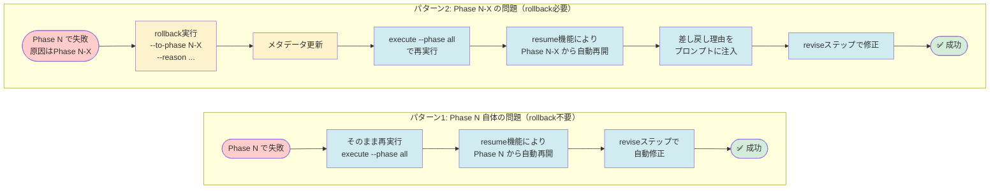

# AI Workflow Agent

TypeScript ベースの AI Workflow 自動化ツールキットです。Codex と Claude Code のデュアルエージェント機能により、GitHub / Jenkins / Pulumi と統合した 10 フェーズの Issue ワークフロー（planning 〜 evaluation）を実行します。

## 特長

- **Codex + Claude のデュアルエージェント** … Codex（`gpt-5-codex`）で高い推論が必要な編集を担当し、状況に応じて自動で Claude にフォールバックします。
- **決定的なプロンプト管理** … すべてのプロンプトテンプレートは `src/prompts/{phase}` に配置され、ビルド時に `dist` へコピーされます。
- **永続化されたワークフロー状態** … `.ai-workflow/issue-*/metadata.json` へメタデータを保存する `MetadataManager` により、途中再開やコスト集計が可能です。
- **マルチリポジトリ対応** … Issue URL から対象リポジトリを自動判定し、別のリポジトリに対してもワークフローを実行できます（v0.2.0 で追加）。
- **自動PR作成とタイトル最適化** … Issue タイトルをそのまま PR タイトルとして使用し、PR 一覧での可読性を向上（v0.3.0、Issue #73）。
- **GitHub & Jenkins 対応** … 個人アクセストークンと Jenkins Job DSL に対応し、Docker コンテナ内で TypeScript CLI を実行できます。

## リポジトリ構成

```
ai-workflow-agent/
├── Dockerfile                 # Node 20 ベースの Codex 対応イメージ
├── package.json               # CLI エントリーポイント（bin: ai-workflow）
├── scripts/
│   └── copy-static-assets.mjs # prompts/templates を dist/ へコピー
├── src/
│   ├── core/                  # エージェント・Git/GitHub ヘルパー・メタデータ管理
│   ├── phases/                # 各フェーズ実装（planning 〜 evaluation）
│   ├── prompts/               # フェーズ別プロンプト
│   ├── templates/             # PR ボディなどのテンプレート
│   ├── main.ts                # CLI 定義
│   └── index.ts               # bin エントリ
└── dist/                      # `npm run build` 後に生成される JS
```

## 前提条件

- Node.js 20 以上
- npm 10 以上
- Codex API キー（`CODEX_API_KEY` または `OPENAI_API_KEY`）
- Claude Code 認証ファイル（`credentials.json`）
- GitHub パーソナルアクセストークン（`repo`, `workflow`, `read:org`）
- （任意）環境変数 `REPOS_ROOT` … マルチリポジトリ環境でリポジトリの親ディレクトリを指定
- （任意）環境変数 `LOG_LEVEL` … ログレベル制御（`debug` | `info` | `warn` | `error`、デフォルト: `info`）
- （任意）環境変数 `LOG_NO_COLOR` … カラーリング無効化（CI環境用）
- （任意）Docker 24 以上（コンテナ内で実行する場合）

## クイックスタート（ローカル）

```bash
# 依存関係のインストールとビルド
npm install
npm run build

# 環境変数
export CODEX_API_KEY="sk-code..."        # Codex 高推論キー
export CLAUDE_CODE_CREDENTIALS_PATH="$HOME/.claude-code/credentials.json"
export GITHUB_TOKEN="ghp_..."
export GITHUB_REPOSITORY="tielec/ai-workflow-agent"
export REPOS_ROOT="$HOME/projects"       # （任意）リポジトリの親ディレクトリ
export LOG_LEVEL="info"                  # （任意）ログレベル（debug|info|warn|error）
export LOG_NO_COLOR="false"              # （任意）カラーリング無効化（CI環境では "true"）

# Issue URL からワークフローを初期化
node dist/index.js init \
  --issue-url https://github.com/tielec/ai-workflow-agent/issues/1

# 全フェーズ実行
node dist/index.js execute --phase all --issue 1

# 失敗したフェーズのみ再実行
node dist/index.js execute --phase requirements --issue 1 --agent codex

# マルチリポジトリの例: 別リポジトリのIssueに対してワークフローを実行
node dist/index.js init \
  --issue-url https://github.com/owner/my-app/issues/123
node dist/index.js execute --phase all --issue 123
```

## CLI オプション

```bash
ai-workflow init \
  --issue-url <URL> \
  [--branch <name>]

ai-workflow execute \
  --issue <number> \
  [--phase <name>|--phase all] \
  [--agent auto|codex|claude] \
  [--preset <name>] \
  [--force-reset] \
  [--skip-dependency-check|--ignore-dependencies] \
  [--cleanup-on-complete] \
  [--cleanup-on-complete-force] \
  [--requirements-doc <path>] [...] \
  [--git-user <name>] [--git-email <email>] \
  [--followup-llm-mode auto|openai|claude|off] \
  [--followup-llm-model <model>] \
  [--followup-llm-timeout <ms>] \
  [--followup-llm-max-retries <count>] \
  [--followup-llm-append-metadata]

ai-workflow execute \
  --list-presets

ai-workflow review \
  --phase <name> \
  --issue <number>

ai-workflow migrate \
  --sanitize-tokens \
  [--dry-run] \
  [--issue <number>] \
  [--repo <path>]

ai-workflow rollback \
  --issue <number> \
  --to-phase <phase> \
  --reason <text> | --reason-file <path> | --interactive \
  [--to-step <step>] \
  [--from-phase <phase>] \
  [--force] \
  [--dry-run]
```

### ブランチ名のカスタマイズ

`init` コマンドで `--branch` オプションを使用すると、カスタムブランチ名でワークフローを開始できます（v0.2.0 で追加）：

```bash
# カスタムブランチ名を指定
node dist/index.js init \
  --issue-url https://github.com/tielec/ai-workflow-agent/issues/1 \
  --branch feature/add-logging

# 既存ブランチでワークフローを開始
node dist/index.js init \
  --issue-url https://github.com/tielec/ai-workflow-agent/issues/1 \
  --branch feature/existing-work

# デフォルト（未指定時は ai-workflow/issue-{issue_number}）
node dist/index.js init \
  --issue-url https://github.com/tielec/ai-workflow-agent/issues/1
```

**ブランチ名のバリデーション**:

Git 命名規則に従わないブランチ名はエラーになります：
- 空白を含まない
- `..`（連続ドット）を含まない
- 不正文字（`~`, `^`, `:`, `?`, `*`, `[`, `\`, `@{`）を含まない
- `/` で始まらない、終わらない
- `.` で終わらない

### エージェントモード

- `auto`（既定）: Codex API キーがあれば Codex を使用し、なければ Claude にフォールバックします。
- `codex`: Codex のみを使用（`gpt-5-codex`）。Claude 認証情報は無視されます。
- `claude`: Claude Code を強制使用。`CLAUDE_CODE_CREDENTIALS_PATH` が必須です。

### プリセット

プリセットは、よくある開発パターンに合わせて複数のフェーズを組み合わせたショートカットです。各プリセットはオプショナルコンテキスト構築機能により、前段フェーズの成果物が存在しない場合でも柔軟に実行できます。

**利用可能なプリセット一覧**:

```bash
# プリセット一覧を表示
ai-workflow execute --list-presets
```

| プリセット名 | 含まれるフェーズ | 用途 |
|------------|----------------|------|
| `review-requirements` | Planning + Requirements | 要件定義のレビュー用 |
| `review-design` | Planning + Requirements + Design | 設計のレビュー用 |
| `review-test-scenario` | Planning + Requirements + Design + TestScenario | テストシナリオのレビュー用 |
| `quick-fix` | Implementation + Documentation + Report | 軽微な修正（タイポ、小さなバグ修正）<br>※ `--ignore-dependencies` との併用を推奨 |
| `implementation` | Implementation + TestImplementation + Testing + Documentation + Report | 通常の実装フロー |
| `testing` | TestImplementation + Testing | 既存実装へのテスト追加 |
| `finalize` | Documentation + Report + Evaluation | 実装完了後の最終化 |

**使用例**:

```bash
# 軽微な修正を実装からレポートまで一括実行（依存関係を無視）
ai-workflow execute --issue 1 --preset quick-fix --ignore-dependencies

# 要件定義とPlanningのみ実行してレビューを受ける
ai-workflow execute --issue 2 --preset review-requirements
```

**プリセット vs `--phase` の使い分け**:

- **プリセット**: 頻繁に使用するフェーズの組み合わせ（推奨）
- **`--phase all`**: 全フェーズを実行（新規Issue、初回実行時）
- **`--phase <name>`**: 単一フェーズ実行、またはプリセットでカバーされないパターン

**後方互換性**:

旧プリセット名も6ヶ月間サポートされますが、新しい名前への移行を推奨します:

- `requirements-only` → `review-requirements`
- `design-phase` → `review-design`
- `implementation-phase` → `implementation`
- `full-workflow` → `--phase all`

### フォローアップIssue生成オプション（v0.4.0、Issue #119で追加）

フォローアップIssue生成時にLLM (OpenAI/Anthropic) を利用してタイトルと本文の品質を向上できます。LLM失敗時は既存テンプレートへ自動的にフォールバックします。

- `--followup-llm-mode <mode>` … LLMモード選択（`auto`（既定）、`openai`、`claude`、`off`）
- `--followup-llm-model <model>` … モデル指定（例: `gpt-4o-mini`、`claude-3-sonnet-20240229`）
- `--followup-llm-timeout <ms>` … タイムアウト時間（ミリ秒、既定: 25000）
- `--followup-llm-max-retries <count>` … 最大リトライ回数（既定: 3）
- `--followup-llm-append-metadata` … 生成メタデータをIssue本文に追記

**環境変数**:
- `FOLLOWUP_LLM_MODE` … LLMモード（`auto` | `openai` | `claude` | `off`）
- `FOLLOWUP_LLM_MODEL` … モデル名
- `FOLLOWUP_LLM_TIMEOUT_MS` … タイムアウト（ミリ秒）
- `FOLLOWUP_LLM_MAX_RETRIES` … 最大リトライ回数
- `FOLLOWUP_LLM_APPEND_METADATA` … メタデータ追記フラグ（`true` | `false`）
- `OPENAI_API_KEY` … OpenAI APIキー（`openai` モード使用時）
- `ANTHROPIC_API_KEY` … Anthropic APIキー（`claude` モード使用時）

**使用例**:
```bash
# OpenAIで生成（メタデータ追記あり）
node dist/index.js execute --issue 123 --phase evaluation \
  --followup-llm-mode openai --followup-llm-model gpt-4o-mini \
  --followup-llm-append-metadata

# Anthropicで生成（タイムアウト短縮）
node dist/index.js execute --issue 123 --phase evaluation \
  --followup-llm-mode claude --followup-llm-model claude-3-sonnet-20240229 \
  --followup-llm-timeout 20000

# LLM無効化（既存テンプレートを使用）
node dist/index.js execute --issue 123 --phase evaluation --followup-llm-mode off
```

**注意**: デフォルトは無効（`enabled=false`）です。CLIオプションまたは環境変数で明示的に有効化してください。

### 依存関係チェックのフラグ

- `--skip-dependency-check` … すべてのフェーズ依存関係チェックを無効化します（慎重に使用）。
- `--ignore-dependencies` … 依存関係の警告を表示しつつ処理を続行します。

### マイグレーションコマンド

`migrate` コマンドは、既存の `.ai-workflow/issue-*/metadata.json` に含まれるPersonal Access Tokenを検出・除去します（v0.3.1で追加）：

```bash
# 基本的な使用方法
ai-workflow migrate --sanitize-tokens

# ドライラン（ファイルを変更せず、検出のみ）
ai-workflow migrate --sanitize-tokens --dry-run

# 特定のIssueのみ対象
ai-workflow migrate --sanitize-tokens --issue 123

# 対象リポジトリを指定
ai-workflow migrate --sanitize-tokens --repo /path/to/repo
```

**主な機能**:
- **トークン検出**: メタデータの `target_repository.remote_url` フィールドをスキャン
- **自動サニタイズ**: HTTPS形式のURLからトークンを除去（SSH形式は変更なし）
- **バックアップ作成**: 変更前に `.bak` ファイルを作成
- **ドライランモード**: `--dry-run` でファイルを変更せず検出のみ実行

**注意**: v0.3.1以降、`init` コマンド実行時に自動的にトークンが除去されるため、新規ワークフローでは不要です。既存ワークフロー（v0.3.1より前に作成）のメタデータ修正に使用してください。

### Rollbackコマンド（フェーズ差し戻し）

`rollback` コマンドは、ワークフローを前のフェーズに差し戻し、修正作業を行うための機能です（v0.4.0、Issue #90で追加）。レビューで問題が発見された場合や、実装方針の変更が必要な場合に使用します。

```bash
# 基本的な使用方法（直接理由を指定）
ai-workflow rollback \
  --issue 123 \
  --to-phase implementation \
  --reason "テストでバグが発見されたため、実装を修正する必要があります"

# ファイルから差し戻し理由を読み込む
ai-workflow rollback \
  --issue 123 \
  --to-phase design \
  --reason-file /path/to/reason.md

# インタラクティブモード（標準入力から理由を入力）
ai-workflow rollback \
  --issue 123 \
  --to-phase requirements \
  --interactive

# 特定のステップへの差し戻し（revise ステップから再開）
ai-workflow rollback \
  --issue 123 \
  --to-phase implementation \
  --to-step revise \
  --reason "レビューコメントの修正が必要"

# ドライラン（実際には差し戻さず、変更内容のみ確認）
ai-workflow rollback \
  --issue 123 \
  --to-phase implementation \
  --reason "テスト用" \
  --dry-run
```

**主な機能**:

- **差し戻し理由の記録**: `--reason`、`--reason-file`、`--interactive` の3つの入力方法をサポート
- **メタデータ自動更新**: 差し戻し先フェーズを `in_progress` に、後続フェーズを `pending` にリセット
- **差し戻し履歴の記録**: `metadata.json` の `rollback_history` 配列に履歴を保存
- **プロンプト自動注入**: 差し戻し先フェーズの `revise` ステップで差し戻し理由が自動的にプロンプトに注入される
- **ROLLBACK_REASON.md生成**: 差し戻し理由を記録したMarkdownファイルを自動生成

**オプション**:

- `--issue <number>`: 対象のIssue番号（必須）
- `--to-phase <phase>`: 差し戻し先のフェーズ名（必須）
  - 有効なフェーズ: `planning`, `requirements`, `design`, `test-scenario`, `implementation`, `test-implementation`, `testing`, `documentation`, `report`, `evaluation`
- `--reason <text>`: 差し戻し理由を直接指定（最大1000文字）
- `--reason-file <path>`: 差し戻し理由が記載されたファイルパス（最大100KB）
- `--interactive`: 標準入力から差し戻し理由を読み込む（EOF（Ctrl+D）で終了）
- `--to-step <step>`: 差し戻し先のステップ（`execute` | `review` | `revise`、デフォルト: `revise`）
- `--from-phase <phase>`: 差し戻し元のフェーズ（省略時は現在の最新完了フェーズ）
- `--force`: 確認プロンプトをスキップ
- `--dry-run`: 実際には差し戻さず、変更内容のみを表示

**使用例**:

```bash
# ケース1: Phase 6（Testing）でバグ発見 → Phase 4（Implementation）に差し戻し
ai-workflow rollback \
  --issue 90 \
  --to-phase implementation \
  --reason "テスト実行時にNullPointerExceptionが発生。エラーハンドリングの追加が必要。"

# ケース2: Phase 5（Test Implementation）でテスト設計の見直しが必要 → Phase 3（Test Scenario）に差し戻し
ai-workflow rollback \
  --issue 90 \
  --to-phase test-scenario \
  --reason-file review-comments.md \
  --to-step execute

# ケース3: 長文の差し戻し理由をインタラクティブに入力
ai-workflow rollback --issue 90 --to-phase design --interactive
# （標準入力から複数行の理由を入力し、Ctrl+Dで終了）

# ケース4: 差し戻し前に変更内容を確認（ドライラン）
ai-workflow rollback \
  --issue 90 \
  --to-phase implementation \
  --reason "テスト用" \
  --dry-run
```

**注意事項**:

- 差し戻し先フェーズは少なくとも一度実行済み（`completed` または `in_progress`）である必要があります
- `--reason`、`--reason-file`、`--interactive` のいずれか1つが必須です
- 差し戻しを実行すると、後続フェーズのステータスはすべて `pending` にリセットされます
- 差し戻し理由は `ROLLBACK_REASON.md` として `.ai-workflow/issue-<NUM>/<PHASE>/` ディレクトリに保存されます
- 差し戻し後、次回の `execute` コマンドで差し戻し先フェーズの指定ステップから自動的に再開されます

### Rollback機能の運用フロー

rollback機能を使用する場合の典型的なオペレーションフローを説明します。

#### フローチャート


#### パターン1: 自動修正可能な失敗（rollback不要）

フェーズ自体の問題で失敗した場合、`rollback`コマンドは不要です。そのまま再実行すれば、自動的にreviseステップで修正が試みられます。

```bash
# 1. 初回実行
ai-workflow execute --phase all --issue 123

# → Phase 6 (Testing) で失敗
# → reviseステップで3回自動修正を試みるが、すべて失敗
# → phases.testing.status = "failed" が記録される

# 2. そのまま再実行（rollbackなし）
ai-workflow execute --phase all --issue 123

# → resume機能により Phase 6 から自動的に再開
# → reviseステップで再度修正を試みる
# → 成功すれば Phase 7-9 を継続実行
```

**この場合、rollbackは不要です。** `--phase all` のまま再実行するだけでOKです。

#### パターン2: 前のフェーズに問題がある場合（rollback必要）

前のフェーズの設計・実装に問題があり、現在のフェーズでは修正できない場合、rollbackコマンドを使用します。

```bash
# 1. 初回実行
ai-workflow execute --phase all --issue 123

# → Phase 0-5: 成功
# → Phase 6 (Testing): 失敗
#    理由: "Phase 4のテストコード実装が不完全"と判明
#    （reviseで3回修正を試みるが、Phase 6では解決できない）

# 2. ログを確認して原因を特定
cat .ai-workflow/issue-123/06_testing/output/test-result.md
# → "Phase 4 (Implementation)のモック実装が不完全"と判明

# 3. rollbackコマンドで Phase 4 に差し戻し
ai-workflow rollback \
  --issue 123 \
  --to-phase implementation \
  --reason "Testing Phaseで11個のテスト失敗。PhaseRunnerのモック実装が不完全。validatePhaseDependenciesの修正が必要"

# → メタデータ自動更新:
#    - phases.implementation.status = "in_progress"
#    - phases.implementation.current_step = "revise"
#    - phases.test_implementation.status = "pending" (リセット)
#    - phases.testing.status = "pending" (リセット)
#    - rollback_context に差し戻し理由を記録
#    - ROLLBACK_REASON.md を生成

# 4. 再実行（rollback後も --phase all のまま）
ai-workflow execute --phase all --issue 123

# → resume機能により Phase 4 から自動的に再開
# → Phase 4 の revise ステップから開始
#    （差し戻し理由が自動的にプロンプトに注入される）
# → AIエージェントがテストコードを修正
# → Phase 5-9 を順次実行
# → 成功
```

**重要**: rollback後も `--phase all` のまま再実行してください。`--phase implementation` に変更する必要はありません。resume機能により自動的に正しいフェーズから再開されます。

#### パターン3: Jenkins での運用フロー

Jenkinsでも同様のフローになります。


**Jenkinsでの設定例**:

```bash
# 1. Jenkins Job #1: 初回実行
EXECUTION_MODE: all_phases
ISSUE_URL: https://github.com/owner/repo/issues/123
# → Phase 6 で失敗

# 2. ログ確認 → Phase 4 の問題と判明

# 3. Jenkins Job #2: rollback実行
EXECUTION_MODE: rollback
ROLLBACK_TO_PHASE: implementation
ROLLBACK_REASON: "Testing Phaseで失敗。PhaseRunnerのモック実装が不完全"
# → メタデータ更新

# 4. Jenkins Job #3: 再実行（パラメータは最初と同じ）
EXECUTION_MODE: all_phases  ← rollback前と同じ
ISSUE_URL: https://github.com/owner/repo/issues/123
# → Phase 4 から自動的に再開
# → 成功
```

**Jenkinsでの注意点**:
- rollback後は **EXECUTION_MODEを `all_phases` または `preset` に戻す**
- `single_phase` モードは使用しない（自動的に後続フェーズが実行されない）
- CI環境では `--force` フラグが自動的に付与されるため、確認プロンプトは表示されません

#### パターン4: 差し戻し理由の伝達

rollbackで記録された差し戻し理由は、次回実行時に自動的にAIエージェントに伝達されます。

```markdown
# Phase 4 (Implementation) - Revise プロンプト

## ⚠️ 前のフェーズから差し戻されました

**差し戻し元**: testing (Phase 6)
**差し戻し日時**: 2025-01-30 14:00:00
**差し戻し理由**:
Testing Phaseで11個のテスト失敗。
PhaseRunnerのモック実装が不完全。
validatePhaseDependenciesの修正が必要。

---

## 修正指示

上記の差し戻し理由を踏まえて、実装を修正してください。

（以下、通常のreviseプロンプトが続く）
```

これにより、AIエージェントは問題の本質を理解して適切な修正を実施できます。

#### まとめ: rollback vs 通常のresume



| 状況 | 使用コマンド | 次の実行 | resume開始フェーズ |
|------|------------|----------|------------------|
| **Phase N 自体の問題**<br/>（例: Testing失敗、テストコードのバグ） | なし（そのまま再実行） | `--phase all` で再実行 | Phase N |
| **Phase N-X の問題**<br/>（例: Testing失敗、Implementationのモック不完全） | `rollback --to-phase N-X` | `--phase all` で再実行 | Phase N-X |

**重要なポイント**:
- ✅ rollback後も `--phase all` で実行する（`--phase <name>` に変更しない）
- ✅ resume機能は自動的に働くので、メタデータさえ正しければ正しいフェーズから再開される
- ✅ rollbackはメタデータを更新するだけなので、実行モードは変更不要
- ✅ Jenkinsでも同じ（EXECUTION_MODEは `all_phases` または `preset` のまま）

## フェーズ概要

| フェーズ | ファイル                         | 説明                                        |
|--------:|----------------------------------|---------------------------------------------|
| 0       | `src/phases/planning.ts`         | 計画ドキュメントと設計メモの草案            |
| 1       | `src/phases/requirements.ts`     | 要件収集・外部資料の整理                    |
| 2       | `src/phases/design.ts`           | アーキテクチャ設計                          |
| 3       | `src/phases/test-scenario.ts`    | テストシナリオ策定                          |
| 4       | `src/phases/implementation.ts`   | コード実装                                  |
| 5       | `src/phases/test-implementation.ts` | テストコードの実装                      |
| 6       | `src/phases/testing.ts`          | テスト実行と証跡収集                        |
| 7       | `src/phases/documentation.ts`    | ドキュメント・ランブック更新                |
| 8       | `src/phases/report.ts`           | ステータスレポート・PR ボディ生成・ワークフローログクリーンアップ |
| 9       | `src/phases/evaluation.ts`       | 最終評価と残作業の整理                     |

各フェーズは `BasePhase` を継承し、メタデータ永続化、実行/レビューサイクル、エージェント制御、Git 自動コミットなど共通機能を利用します。

### ステップ単位のGitコミット＆レジューム

各フェーズは execute / review / revise の3つのステップで構成されており、**各ステップ完了後に自動的にGitコミット＆プッシュ**が実行されます（v0.3.0で追加）：

**主な利点**:
- **高速なレジューム**: 失敗したステップのみを再実行（フェーズ全体ではなく）
- **トークン消費量の削減**: 完了済みステップのスキップにより、無駄なAPI呼び出しを防止
- **CI/CD効率化**: Jenkins等のCI環境でワークスペースリセット後も、リモートから最新状態を取得して適切なステップから再開

**Gitログの例**:
```
[ai-workflow] Phase 1 (requirements) - revise completed
[ai-workflow] Phase 1 (requirements) - review completed
[ai-workflow] Phase 1 (requirements) - execute completed
```

**レジューム動作**:
- CI環境では各ビルド開始時にリモートブランチからメタデータを同期
- `metadata.json` の `current_step` と `completed_steps` フィールドで進捗を管理
- 完了済みステップは自動的にスキップされ、次のステップから再開

### ワークフローログの自動クリーンアップ

Report Phase (Phase 8) 完了後、リポジトリサイズを削減するためにワークフローログが自動的にクリーンアップされます：

- **削除対象**: 各フェーズ（00_planning 〜 08_report）の `execute/`, `review/`, `revise/` ディレクトリ
- **保持対象**: `metadata.json` と `output/*.md`（成果物ファイル、Planning Phaseの `output/planning.md` を含む）
- **効果**: リポジトリサイズを約75%削減、PRレビューを成果物に集中

クリーンアップは非破壊的に動作し、失敗してもワークフロー全体は継続します。

### ワークフローディレクトリの完全削除（オプション）

Evaluation Phase (Phase 9) 完了後、オプションで `.ai-workflow/issue-*` ディレクトリ全体を削除できます（v0.3.0で追加）：

```bash
# Evaluation Phase 完了後にワークフローディレクトリを完全削除
node dist/index.js execute --issue 123 --phase evaluation --cleanup-on-complete

# 確認プロンプトをスキップ（CI環境用）
node dist/index.js execute --issue 123 --phase evaluation \
  --cleanup-on-complete --cleanup-on-complete-force

# 全フェーズ実行時にも適用可能
node dist/index.js execute --issue 123 --phase all --cleanup-on-complete
```

- **削除対象**: `.ai-workflow/issue-<NUM>/` ディレクトリ全体（`metadata.json`、`output/*.md` を含む）
- **実行タイミング**: Evaluation Phase完了後、`--cleanup-on-complete` オプション指定時のみ
- **確認プロンプト**: 対話的環境では削除前に確認を求める（`--cleanup-on-complete-force` でスキップ可能、CI環境では自動スキップ）
- **Git 自動コミット**: クリーンアップ後に削除を自動コミット＆プッシュ

**注意**: デフォルトでは成果物を保持します（`--cleanup-on-complete` オプション未指定時）。

## Docker での実行

```bash
docker build -t ai-workflow-agent .

docker run --rm \
  -e CODEX_API_KEY \
  -e CLAUDE_CODE_CREDENTIALS_PATH=/root/.claude-code/credentials.json \
  -e GITHUB_TOKEN \
  -e GITHUB_REPOSITORY \
  -v "$HOME/.claude-code:/root/.claude-code:ro" \
  -v "$(pwd):/workspace" \
  -w /workspace \
  ai-workflow-agent \
  node dist/index.js execute --phase all --issue 1 --agent auto
```

## 開発フロー

```bash
# 依存関係のインストールとウォッチャー起動
npm install
npm run dev

# （任意）Lint
npx eslint --ext .ts src

# ユニットテスト（必要に応じて追加）
npx vitest
```

## 参考ドキュメント

- [ARCHITECTURE.md](ARCHITECTURE.md) … モジュール構成とデータフロー
- [DOCKER_AUTH_SETUP.md](DOCKER_AUTH_SETUP.md) … Codex / Claude 認証の準備手順
- [SETUP_TYPESCRIPT.md](SETUP_TYPESCRIPT.md) … ローカル開発環境の構築手順
- [ROADMAP.md](ROADMAP.md) … 今後の改善計画
- [TROUBLESHOOTING.md](TROUBLESHOOTING.md) … よくあるトラブルと対処法

---

**バージョン**: 0.3.0（TypeScript リライト版）
**最終更新日**: 2025-01-20
